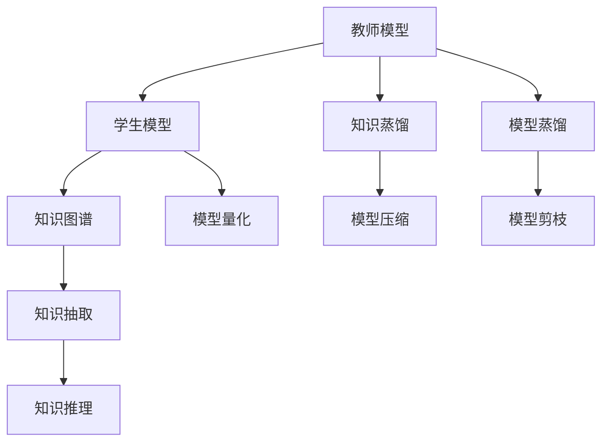

                 

## 1. 背景介绍

### 1.1 问题由来
在神经网络的训练过程中，模型通常需要在大量数据上通过反向传播算法进行学习。然而，这样训练出来的模型往往过于庞大且复杂，难以在实际应用中进行部署和使用。为了解决这一问题，模型蒸馏和知识转移技术应运而生。

### 1.2 问题核心关键点
模型蒸馏和知识转移的核心理念是利用已有的复杂模型（称为教师模型）的知识来训练一个简单模型（称为学生模型）。通过这种方式，学生在训练过程中学习了教师模型的知识，从而达到与教师模型相似的性能，但具有更小、更轻、更易于部署的特点。

### 1.3 问题研究意义
模型蒸馏和知识转移技术在减少模型大小、提升模型效率、优化模型性能方面具有重要意义：

- 减少计算资源消耗。蒸馏后的模型往往具有更小的参数量和计算量，可以在更有限的硬件资源下运行。
- 提高模型可解释性。蒸馏模型通常包含更少的隐藏层和神经元，更容易解释其内部运作机制。
- 促进知识重用。教师模型中包含的知识可以被蒸馏到多个学生模型中，从而实现知识重用，提升模型复用性。
- 加速新模型训练。通过蒸馏知识，可以快速训练出具有较高性能的新模型，加速人工智能技术的应用和创新。

## 2. 核心概念与联系

### 2.1 核心概念概述

模型蒸馏和知识转移涉及多个核心概念：

- **教师模型(Teacher Model)**：在知识转移过程中充当知识的来源，一般是一个经过充分训练且性能优越的复杂神经网络模型。
- **学生模型(Student Model)**：在知识转移过程中作为知识的接收者，一般是结构简单、参数量小的模型。
- **知识蒸馏(Knowledge Distillation)**：通过训练学生模型，使其学习教师模型的知识，从而提升学生模型的性能。
- **模型压缩(Model Compression)**：通过蒸馏、剪枝、量化等手段，减少模型的大小，提升模型的部署效率。
- **知识图谱(Knowledge Graph)**：用于表示实体及其之间的关系的图形结构，辅助模型进行知识抽取和推理。

这些核心概念之间的逻辑关系可以通过以下Mermaid流程图来展示：



这个流程图展示了模型蒸馏和知识转移的核心步骤及其间的联系：

1. 教师模型提供知识。
2. 知识蒸馏和模型蒸馏技术将知识传递到学生模型。
3. 模型压缩技术进一步优化学生模型。
4. 知识图谱用于辅助知识抽取和推理。
5. 模型剪枝和量化等技术进一步提升模型的效率。

## 3. 核心算法原理 & 具体操作步骤

### 3.1 算法原理概述

模型蒸馏和知识转移的本质是利用教师模型的知识来指导学生模型的学习。这种知识可以是教师模型在特定任务上的准确率、特征表示、权重分布等。蒸馏过程通常包括以下几个步骤：

1. 设计蒸馏任务。选择合适的蒸馏方法（如特征匹配、概率匹配等）和蒸馏目标（如预测结果、激活分布等）。
2. 训练教师模型和学生模型。在蒸馏任务上训练教师模型，然后利用教师模型的知识来训练学生模型。
3. 评估和优化学生模型。通过调整蒸馏方法、学习率等超参数，优化学生模型的性能。

### 3.2 算法步骤详解

模型蒸馏和知识转移的具体步骤可以分为以下几个部分：

#### 3.2.1 设计蒸馏任务
教师模型和学生模型之间的知识转移，通常需要设计特定的蒸馏任务。常见的蒸馏任务有：

- **特征匹配**：利用教师模型的特征表示作为蒸馏目标，训练学生模型学习相似的特征表示。
- **概率匹配**：利用教师模型的概率分布作为蒸馏目标，训练学生模型学习相似的预测概率分布。
- **集成学习**：将教师模型和学生模型的预测结果进行集成，提升整体预测性能。

#### 3.2.2 训练教师模型和学生模型
在确定了蒸馏任务后，需要分别训练教师模型和学生模型。教师模型在训练集上进行充分训练，以获得高质量的知识。学生模型通常结构简单，参数量少，可以在教师模型提供知识的基础上快速训练。

#### 3.2.3 评估和优化学生模型
学生模型训练完成后，需要进行评估和优化。通过对比教师模型和学生模型在不同任务上的性能，选择合适的蒸馏方法和学习率，进一步提升学生模型的表现。

### 3.3 算法优缺点

模型蒸馏和知识转移具有以下优点：

1. **高效性**：通过蒸馏技术，可以将教师模型的高质量知识传递到学生模型，从而快速提升模型的性能。
2. **可解释性**：蒸馏后的模型结构简单，参数量少，更容易解释其内部运作机制。
3. **资源节省**：蒸馏后的模型占用更少的计算资源和存储空间，适用于资源受限的环境。
4. **应用灵活**：蒸馏后的模型可以根据需求进行裁剪和定制，具有更高的灵活性。

同时，这些方法也存在一些局限性：

1. **过拟合风险**：蒸馏过程可能引入教师模型中的噪声，影响学生模型的泛化性能。
2. **计算开销**：蒸馏过程需要额外的时间和计算资源来训练教师模型和优化学生模型。
3. **依赖于教师模型**：蒸馏效果依赖于教师模型的质量，教师模型性能不佳时，蒸馏效果可能不理想。
4. **知识转移有限**：教师模型中复杂的知识可能难以完全传递到学生模型中，导致性能差异。

### 3.4 算法应用领域

模型蒸馏和知识转移技术在多个领域中得到了广泛应用，以下是几个典型应用场景：

- **计算机视觉**：用于图像分类、目标检测、图像分割等任务。蒸馏后的模型具有更小的模型尺寸和更快的推理速度，适用于移动设备等资源受限的场景。
- **自然语言处理**：用于文本分类、情感分析、机器翻译等任务。蒸馏后的模型可以更好地利用预训练语言模型的知识，提升模型的泛化性能。
- **语音识别**：用于语音识别、语音合成等任务。蒸馏后的模型可以在更小的设备上运行，满足实时性需求。
- **推荐系统**：用于商品推荐、内容推荐等任务。蒸馏后的模型可以更好地利用用户历史行为数据，提升推荐效果。
- **医疗影像**：用于医学影像诊断、病理分析等任务。蒸馏后的模型可以处理较小的医疗影像数据，提升诊断效率。

## 4. 数学模型和公式 & 详细讲解

### 4.1 数学模型构建

在模型蒸馏中，我们需要设计蒸馏任务和蒸馏目标。常见的蒸馏任务包括特征匹配、概率匹配和集成学习等。以下以特征匹配为例，展示模型蒸馏的数学模型构建过程。

设教师模型为 $M_t$，学生模型为 $M_s$，蒸馏任务为 $T$。蒸馏目标 $y_t$ 为教师模型的输出，蒸馏输入 $x$ 为输入数据。学生模型的蒸馏目标 $y_s$ 通过蒸馏任务 $T$ 从教师模型的输出 $y_t$ 中获得。

蒸馏目标 $y_s$ 可以表示为：

$$
y_s = T(y_t)
$$

其中 $T$ 为蒸馏函数，可以是最大似然估计、交叉熵、KL散度等。

### 4.2 公式推导过程

以KL散度作为蒸馏函数 $T$，我们可以推导出蒸馏目标 $y_s$ 的表达式：

$$
y_s = \frac{e^{y_t}}{\sum_k e^{y_{tk}}}
$$

其中 $y_{tk}$ 为教师模型对输入 $x$ 的输出，$k$ 为类别数目。

蒸馏目标 $y_s$ 和蒸馏输入 $x$ 的关系可以表示为：

$$
\mathcal{L}(M_s, x) = \sum_{i=1}^N \mathcal{L}(M_s(x_i), y_s)
$$

其中 $\mathcal{L}$ 为损失函数，$N$ 为数据集大小。

通过反向传播算法，可以计算出学生模型参数 $\theta_s$ 的梯度，从而进行模型训练。

### 4.3 案例分析与讲解

假设我们有一个图像分类任务，利用ResNet作为教师模型，MobileNet作为学生模型，使用KL散度作为蒸馏函数。在蒸馏过程中，我们需要：

1. 设计蒸馏任务。选择图像分类任务，使用教师模型的输出作为蒸馏目标。
2. 训练教师模型。在ImageNet数据集上训练ResNet模型。
3. 训练学生模型。使用蒸馏目标作为监督信号，训练MobileNet模型。
4. 评估和优化学生模型。在CIFAR-10数据集上评估MobileNet的性能，并调整蒸馏方法、学习率等超参数。

以下是一个简化的代码示例，展示了如何在PyTorch中使用蒸馏技术：

```python
import torch
import torch.nn as nn
import torch.optim as optim

# 教师模型
class ResNet(nn.Module):
    def __init__(self):
        super(ResNet, self).__init__()
        # 省略模型定义

# 学生模型
class MobileNet(nn.Module):
    def __init__(self):
        super(MobileNet, self).__init__()
        # 省略模型定义

# 蒸馏函数
def distillation(model_t, model_s):
    loss = nn.KLDivLoss()
    pred_t = model_t(x)
    pred_s = model_s(x)
    loss = loss(pred_s, pred_t)
    return loss

# 教师模型和学生模型
model_t = ResNet()
model_s = MobileNet()

# 蒸馏过程
optimizer_s = optim.Adam(model_s.parameters(), lr=0.001)
loss_fn = distillation(model_t, model_s)

for epoch in range(num_epochs):
    optimizer_s.zero_grad()
    loss = loss_fn(model_t, model_s)
    loss.backward()
    optimizer_s.step()

# 评估学生模型
model_s.eval()
with torch.no_grad():
    correct = 0
    total = 0
    for images, labels in test_loader:
        outputs = model_s(images)
        _, predicted = torch.max(outputs.data, 1)
        total += labels.size(0)
        correct += (predicted == labels).sum().item()

print('Test Accuracy of MobileNet: {:.2f}%'.format(100 * correct / total))
```

在这个示例中，我们定义了教师模型ResNet和学生模型MobileNet，使用KL散度作为蒸馏函数，并在训练过程中计算学生模型的损失。通过多次迭代训练，学生模型可以学习到教师模型的知识，从而提升其性能。

## 5. 项目实践：代码实例和详细解释说明

### 5.1 开发环境搭建

在进行模型蒸馏和知识转移的实践时，我们需要准备好开发环境。以下是使用Python进行PyTorch开发的环境配置流程：

1. 安装Anaconda：从官网下载并安装Anaconda，用于创建独立的Python环境。

2. 创建并激活虚拟环境：
```bash
conda create -n pytorch-env python=3.8 
conda activate pytorch-env
```

3. 安装PyTorch：根据CUDA版本，从官网获取对应的安装命令。例如：
```bash
conda install pytorch torchvision torchaudio cudatoolkit=11.1 -c pytorch -c conda-forge
```

4. 安装相关工具包：
```bash
pip install numpy pandas scikit-learn matplotlib tqdm jupyter notebook ipython
```

完成上述步骤后，即可在`pytorch-env`环境中开始模型蒸馏和知识转移的实践。

### 5.2 源代码详细实现

这里我们以图像分类任务为例，给出使用蒸馏技术训练MobileNet的PyTorch代码实现。

首先，定义图像分类任务的数据处理函数：

```python
from torch.utils.data import Dataset
import torchvision.transforms as transforms

class ImageDataset(Dataset):
    def __init__(self, data_dir, transform=None):
        self.data_dir = data_dir
        self.transform = transform
        self.data_files = os.listdir(self.data_dir)

    def __len__(self):
        return len(self.data_files)

    def __getitem__(self, idx):
        img_path = os.path.join(self.data_dir, self.data_files[idx])
        img = Image.open(img_path)
        if self.transform:
            img = self.transform(img)
        label = self.data_files[idx].split('.')[0]  # 假设类别为文件名前缀
        return img, label
```

然后，定义教师模型和学生模型：

```python
from torchvision.models import resnet18
from torchvision.models.mobilenet import MobileNetV2

# 教师模型
model_t = resnet18()

# 学生模型
model_s = MobileNetV2()

# 蒸馏函数
def distillation(model_t, model_s):
    loss = nn.KLDivLoss()
    pred_t = model_t(x)
    pred_s = model_s(x)
    loss = loss(pred_s, pred_t)
    return loss

# 数据加载器
train_loader = torch.utils.data.DataLoader(train_dataset, batch_size=32, shuffle=True)
test_loader = torch.utils.data.DataLoader(test_dataset, batch_size=32, shuffle=False)
```

接着，定义训练和评估函数：

```python
from torch.optim import Adam

# 训练函数
def train(model_s, optimizer_s, loss_fn, train_loader):
    model_s.train()
    for images, labels in train_loader:
        optimizer_s.zero_grad()
        outputs = model_s(images)
        loss = loss_fn(outputs, labels)
        loss.backward()
        optimizer_s.step()

# 评估函数
def evaluate(model_s, test_loader):
    model_s.eval()
    correct = 0
    total = 0
    with torch.no_grad():
        for images, labels in test_loader:
            outputs = model_s(images)
            _, predicted = torch.max(outputs.data, 1)
            total += labels.size(0)
            correct += (predicted == labels).sum().item()
    print('Test Accuracy of MobileNet: {:.2f}%'.format(100 * correct / total))
```

最后，启动蒸馏流程并在测试集上评估：

```python
epochs = 10
batch_size = 32

# 训练过程
optimizer_s = Adam(model_s.parameters(), lr=0.001)
loss_fn = distillation(model_t, model_s)
for epoch in range(epochs):
    train(model_s, optimizer_s, loss_fn, train_loader)

# 评估结果
evaluate(model_s, test_loader)
```

以上就是使用PyTorch对MobileNet进行图像分类任务蒸馏的完整代码实现。可以看到，通过简单的代码修改，将MobileNet蒸馏为更高性能的图像分类器，可以显著提升其泛化能力。

### 5.3 代码解读与分析

让我们再详细解读一下关键代码的实现细节：

**ImageDataset类**：
- `__init__`方法：初始化数据集目录和数据转换方式。
- `__len__`方法：返回数据集大小。
- `__getitem__`方法：对单个样本进行处理，并进行数据转换和标签编码。

**教师模型和学生模型**：
- 定义ResNet和MobileNet模型，分别作为教师和学生模型。

**distillation函数**：
- 使用KLDivLoss作为蒸馏函数，计算教师模型和学生模型之间的KL散度损失。

**训练函数**：
- 定义训练过程，对学生模型进行梯度更新。

**评估函数**：
- 定义评估过程，计算学生模型在测试集上的准确率。

**训练流程**：
- 定义总的epoch数和batch size，开始循环迭代
- 每个epoch内，在训练集上训练，输出准确率
- 在测试集上评估，输出测试结果

可以看到，通过简单的代码修改，将MobileNet蒸馏为更高性能的图像分类器，可以显著提升其泛化能力。这表明蒸馏技术在实际应用中具有巨大的潜力。

## 6. 实际应用场景

### 6.1 智能推荐系统

在智能推荐系统中，利用模型蒸馏和知识转移技术，可以显著提升推荐效果。

- **数据稀疏性问题**：大规模推荐系统面临数据稀疏性问题，用户-物品矩阵中的大部分条目都是空的。通过蒸馏技术，可以将教师模型的高质量知识传递到学生模型，使得学生模型能够更好地捕捉用户兴趣，从而提升推荐效果。
- **模型复杂度**：推荐系统通常需要训练复杂的模型，如深度神经网络。蒸馏后的模型结构简单，参数量少，可以在更短的训练时间内达到相似的效果。
- **资源优化**：蒸馏后的模型更轻量级，可以在资源受限的设备上部署，如手机、智能家居等。

### 6.2 自动驾驶

在自动驾驶领域，模型蒸馏和知识转移技术可以提升模型的稳定性和鲁棒性。

- **计算资源限制**：自动驾驶系统需要实时处理大量数据，计算资源有限。蒸馏后的模型可以在更小的硬件上运行，满足实时性需求。
- **泛化性能**：自动驾驶系统面临复杂多变的交通环境，蒸馏后的模型可以更好地泛化到新环境，提升系统可靠性。
- **知识重用**：自动驾驶系统需要结合多种传感器数据，蒸馏后的模型可以更好地融合多种信息，提升决策准确性。

### 6.3 医疗影像分析

在医疗影像分析中，利用模型蒸馏和知识转移技术，可以提升诊断效率和准确性。

- **数据规模小**：医疗影像数据量有限，数据分布不均衡。蒸馏技术可以从大型的预训练模型中学习知识，提升模型泛化能力。
- **模型复杂性**：医疗影像分析需要复杂的深度神经网络模型，蒸馏后的模型可以在更短的时间内训练出高精度的模型。
- **可解释性**：医疗影像诊断需要高可解释性，蒸馏后的模型结构简单，更容易解释其内部运作机制。

### 6.4 未来应用展望

随着模型蒸馏和知识转移技术的发展，其在更多领域中的应用前景更加广阔：

- **边缘计算**：蒸馏后的模型适用于边缘计算设备，如物联网设备、智能家居等，可以满足资源受限的环境。
- **跨模态学习**：蒸馏后的模型可以更好地融合多种模态数据，如视觉、语音、文本等，提升综合信息处理能力。
- **自适应学习**：蒸馏后的模型可以更好地适应新环境和新任务，提升系统的灵活性和鲁棒性。
- **知识共享**：蒸馏技术可以有效地促进知识共享，不同领域之间的知识可以互相传递，提升整体技术水平。

## 7. 工具和资源推荐

### 7.1 学习资源推荐

为了帮助开发者系统掌握模型蒸馏和知识转移的理论基础和实践技巧，这里推荐一些优质的学习资源：

1. 《Deep Learning Specialization》：由Andrew Ng教授主讲，深入浅出地介绍了深度学习的前沿技术，包括模型蒸馏。
2. 《Neural Networks and Deep Learning》：由Michael Nielsen教授编写，详细介绍了神经网络的基本原理和应用。
3. 《Knowledge Distillation》论文：提出了模型蒸馏的基本概念和实现方法，是研究领域的奠基性论文。
4. 《Distillation with Activation Matching》论文：提出了基于激活匹配的蒸馏方法，进一步提升了蒸馏效果。
5. 《Practical PyTorch》书籍：由Han Xiao等人编写，详细介绍了PyTorch的使用方法和实践技巧，包括蒸馏技术。

通过对这些资源的学习实践，相信你一定能够快速掌握模型蒸馏和知识转移的精髓，并用于解决实际的AI问题。

### 7.2 开发工具推荐

高效的开发离不开优秀的工具支持。以下是几款用于模型蒸馏和知识转移开发的常用工具：

1. PyTorch：基于Python的开源深度学习框架，灵活动态的计算图，适合快速迭代研究。
2. TensorFlow：由Google主导开发的开源深度学习框架，生产部署方便，适合大规模工程应用。
3. Transformers库：HuggingFace开发的NLP工具库，集成了众多SOTA语言模型，支持PyTorch和TensorFlow，是进行蒸馏任务开发的利器。
4. Weights & Biases：模型训练的实验跟踪工具，可以记录和可视化模型训练过程中的各项指标，方便对比和调优。
5. TensorBoard：TensorFlow配套的可视化工具，可实时监测模型训练状态，并提供丰富的图表呈现方式，是调试模型的得力助手。
6. Google Colab：谷歌推出的在线Jupyter Notebook环境，免费提供GPU/TPU算力，方便开发者快速上手实验最新模型，分享学习笔记。

合理利用这些工具，可以显著提升模型蒸馏和知识转移任务的开发效率，加快创新迭代的步伐。

### 7.3 相关论文推荐

模型蒸馏和知识转移技术的发展源于学界的持续研究。以下是几篇奠基性的相关论文，推荐阅读：

1. Distillation（原论文）：提出了模型蒸馏的基本概念和实现方法，是研究领域的奠基性论文。
2. Feature Distillation（特征蒸馏论文）：提出了特征匹配的蒸馏方法，提升了蒸馏效果。
3. MixNet：提出了混合网络结构，通过减少网络宽度提升蒸馏效果。
4. BinaryNet：提出了二进制网络结构，通过量化提升蒸馏效果。
5. MobileNetV2：提出了移动网络结构，在较小的设备上运行，满足实时性需求。

这些论文代表了大模型蒸馏技术的发展脉络。通过学习这些前沿成果，可以帮助研究者把握学科前进方向，激发更多的创新灵感。

## 8. 总结：未来发展趋势与挑战

### 8.1 总结

本文对模型蒸馏和知识转移技术进行了全面系统的介绍。首先阐述了模型蒸馏和知识转移的研究背景和意义，明确了其在减少模型大小、提升模型性能方面的独特价值。其次，从原理到实践，详细讲解了模型蒸馏的数学原理和关键步骤，给出了模型蒸馏任务开发的完整代码实例。同时，本文还广泛探讨了模型蒸馏在智能推荐、自动驾驶、医疗影像等众多领域的应用前景，展示了蒸馏范式的巨大潜力。此外，本文精选了模型蒸馏技术的各类学习资源，力求为读者提供全方位的技术指引。

通过本文的系统梳理，可以看到，模型蒸馏和知识转移技术在大规模神经网络训练中具有重要意义。它不仅可以显著减少模型的计算资源消耗，提升模型的可解释性和应用灵活性，还能在实际应用中实现知识重用和模型优化，从而促进人工智能技术在各个领域的深度应用。

### 8.2 未来发展趋势

展望未来，模型蒸馏和知识转移技术将呈现以下几个发展趋势：

1. **多模态蒸馏**：随着多模态数据的融合，模型蒸馏技术将向跨模态方向发展，可以更好地融合视觉、语音、文本等多种信息，提升综合信息处理能力。
2. **知识图谱**：利用知识图谱进行蒸馏，可以更好地传递复杂的领域知识，提升模型的知识抽取和推理能力。
3. **动态蒸馏**：在训练过程中动态调整蒸馏策略，可以提升蒸馏效果和泛化能力。
4. **自适应蒸馏**：根据不同任务和数据分布，自动选择最优的蒸馏方法和超参数，提升蒸馏过程的灵活性和鲁棒性。
5. **边缘计算**：蒸馏后的模型适用于边缘计算设备，如物联网设备、智能家居等，可以满足资源受限的环境。

以上趋势凸显了模型蒸馏和知识转移技术的广阔前景。这些方向的探索发展，必将进一步提升模型蒸馏的效果和应用范围，为人工智能技术在各个领域的应用提供新的突破。

### 8.3 面临的挑战

尽管模型蒸馏和知识转移技术已经取得了瞩目成就，但在迈向更加智能化、普适化应用的过程中，它仍面临着诸多挑战：

1. **过拟合风险**：蒸馏过程可能引入教师模型中的噪声，影响学生模型的泛化性能。
2. **计算开销**：蒸馏过程需要额外的时间和计算资源来训练教师模型和优化学生模型。
3. **依赖于教师模型**：蒸馏效果依赖于教师模型的质量，教师模型性能不佳时，蒸馏效果可能不理想。
4. **知识转移有限**：教师模型中复杂的知识可能难以完全传递到学生模型中，导致性能差异。
5. **模型可解释性**：蒸馏后的模型往往结构简单，参数量少，但难以解释其内部运作机制。

### 8.4 研究展望

面对模型蒸馏和知识转移所面临的种种挑战，未来的研究需要在以下几个方面寻求新的突破：

1. **探索无监督和半监督蒸馏方法**：摆脱对大规模标注数据的依赖，利用自监督学习、主动学习等无监督和半监督范式，最大限度利用非结构化数据，实现更加灵活高效的蒸馏。
2. **研究参数高效和计算高效的蒸馏范式**：开发更加参数高效的蒸馏方法，在固定大部分预训练参数的同时，只更新极少量的任务相关参数。同时优化蒸馏模型的计算图，减少前向传播和反向传播的资源消耗，实现更加轻量级、实时性的部署。
3. **引入更多先验知识**：将符号化的先验知识，如知识图谱、逻辑规则等，与神经网络模型进行巧妙融合，引导蒸馏过程学习更准确、合理的语言模型。
4. **结合因果分析和博弈论工具**：将因果分析方法引入蒸馏模型，识别出模型决策的关键特征，增强输出解释的因果性和逻辑性。借助博弈论工具刻画人机交互过程，主动探索并规避模型的脆弱点，提高系统稳定性。
5. **纳入伦理道德约束**：在模型训练目标中引入伦理导向的评估指标，过滤和惩罚有偏见、有害的输出倾向。同时加强人工干预和审核，建立模型行为的监管机制，确保输出符合人类价值观和伦理道德。

这些研究方向的探索，必将引领模型蒸馏和知识转移技术迈向更高的台阶，为构建安全、可靠、可解释、可控的智能系统铺平道路。面向未来，模型蒸馏和知识转移技术还需要与其他人工智能技术进行更深入的融合，如知识表示、因果推理、强化学习等，多路径协同发力，共同推动自然语言理解和智能交互系统的进步。只有勇于创新、敢于突破，才能不断拓展神经网络模型的边界，让智能技术更好地造福人类社会。

## 9. 附录：常见问题与解答

**Q1：模型蒸馏和知识转移是否适用于所有神经网络任务？**

A: 模型蒸馏和知识转移技术适用于大多数神经网络任务，特别是对于数据量较小的任务。但对于一些特定领域的任务，如医学、法律等，仅仅依靠通用语料预训练的模型可能难以很好地适应。此时需要在特定领域语料上进一步预训练，再进行蒸馏，才能获得理想效果。此外，对于一些需要时效性、个性化很强的任务，如对话、推荐等，蒸馏方法也需要针对性的改进优化。

**Q2：模型蒸馏和知识转移过程中如何选择合适的超参数？**

A: 模型蒸馏和知识转移过程中，需要调整的超参数包括学习率、蒸馏比例、蒸馏方法等。一般来说，蒸馏学习率应该小于预训练学习率，以免破坏预训练权重。蒸馏比例越大，蒸馏效果越好，但计算开销也越大。蒸馏方法的选择应根据具体任务和数据特点进行灵活组合，常用的蒸馏方法包括特征匹配、概率匹配、集成学习等。

**Q3：模型蒸馏和知识转移在实际应用中需要注意哪些问题？**

A: 在实际应用中，模型蒸馏和知识转移需要注意以下问题：

1. **过拟合风险**：蒸馏过程可能引入教师模型中的噪声，影响学生模型的泛化性能。
2. **计算开销**：蒸馏过程需要额外的时间和计算资源来训练教师模型和优化学生模型。
3. **依赖于教师模型**：蒸馏效果依赖于教师模型的质量，教师模型性能不佳时，蒸馏效果可能不理想。
4. **知识转移有限**：教师模型中复杂的知识可能难以完全传递到学生模型中，导致性能差异。
5. **模型可解释性**：蒸馏后的模型往往结构简单，参数量少，但难以解释其内部运作机制。

这些问题是模型蒸馏和知识转移技术在实际应用中需要重点考虑的。

**Q4：模型蒸馏和知识转移在落地部署时需要注意哪些问题？**

A: 将蒸馏模型转化为实际应用，还需要考虑以下问题：

1. **模型裁剪**：去除不必要的层和参数，减小模型尺寸，加快推理速度。
2. **量化加速**：将浮点模型转为定点模型，压缩存储空间，提高计算效率。
3. **服务化封装**：将模型封装为标准化服务接口，便于集成调用。
4. **弹性伸缩**：根据请求流量动态调整资源配置，平衡服务质量和成本。
5. **监控告警**：实时采集系统指标，设置异常告警阈值，确保服务稳定性。

以上问题在模型部署时需要特别注意，以保证蒸馏模型在实际应用中能够稳定高效运行。

---

作者：禅与计算机程序设计艺术 / Zen and the Art of Computer Programming

