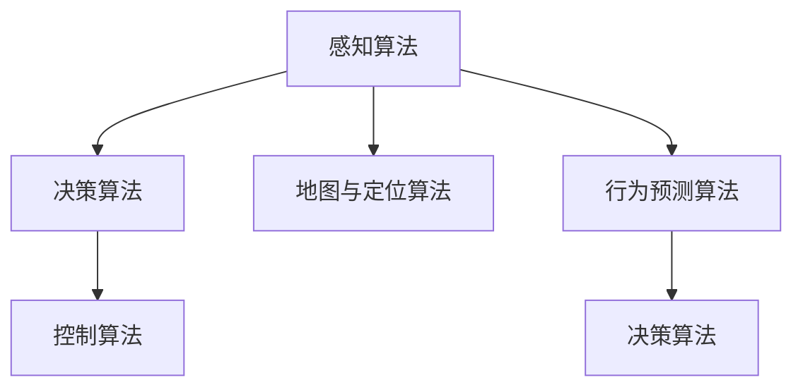

                 

# 一切皆是映射：自动驾驶技术中的AI算法

## 1. 背景介绍

在21世纪的技术浪潮中，自动驾驶技术（Autonomous Driving, AD）正迅速崛起，成为未来出行方式的核心。随着深度学习和计算机视觉等技术的不断进步，自动驾驶车辆开始具备了高度复杂的感知、决策和控制能力。然而，这些技术背后的核心算法并非孤立存在，它们之间存在紧密的联系和协同作用。本文将深入探讨自动驾驶技术中的AI算法，分析其原理与联系，并展望其未来发展趋势与挑战。

## 2. 核心概念与联系

### 2.1 核心概念概述

自动驾驶技术中的AI算法包括但不限于以下几个关键领域：

- **感知算法**：通过摄像头、激光雷达（LiDAR）、雷达等传感器，感知车辆周围的环境信息。

- **决策算法**：利用感知信息，结合地图数据、交通规则等，做出安全的行驶决策。

- **控制算法**：执行决策算法产生的动作指令，如转向、加速、制动等，确保车辆按照预期轨迹行驶。

- **地图与定位算法**：构建和更新高精度的地图，并利用传感器数据进行实时定位。

- **行为预测算法**：预测其他交通参与者的行为，以便做出更好的避障决策。

这些算法之间相互依存、相互影响，共同构成了自动驾驶系统的核心。下面通过一个简单的Mermaid流程图来展示这些算法之间的联系：



## 3. 核心算法原理 & 具体操作步骤

### 3.1 算法原理概述

自动驾驶技术的核心算法主要基于机器学习和计算机视觉技术，以实现车辆的感知、决策和控制。其基本原理可以归纳为以下几个步骤：

1. **数据采集**：通过传感器采集车辆周围的环境信息。
2. **预处理**：对采集到的数据进行清洗、转换和增强，以提高后续算法的输入质量。
3. **特征提取**：利用深度学习模型（如卷积神经网络CNN）从数据中提取出有用的特征。
4. **决策与规划**：基于提取的特征，使用决策树、神经网络等模型做出行驶决策，并进行路径规划。
5. **控制执行**：将决策转换为具体的控制指令，如转向、加速或制动，以驱动车辆行驶。

### 3.2 算法步骤详解

#### 3.2.1 数据采集与预处理

数据采集是自动驾驶技术的第一步。常用的传感器包括摄像头、激光雷达、雷达和GPS等，它们分别提供视觉、点云、雷达和定位信息。这些数据需要经过预处理，包括去噪、校正、归一化等，以提高后续算法的准确性。

#### 3.2.2 特征提取

特征提取是自动驾驶技术的关键步骤。常用的深度学习模型包括卷积神经网络（CNN）、循环神经网络（RNN）和Transformer等。以CNN为例，其核心原理是通过多层卷积和池化操作，从原始图像中提取出高层次的特征。

#### 3.2.3 决策与规划

决策与规划是自动驾驶技术的核心。通过将提取的特征输入到决策模型中，如强化学习（RL）、神经网络等，模型可以输出一个或多个决策。决策模型通常包括目标检测、轨迹规划和行为决策等子模块，它们共同作用，生成最优的行驶路径。

#### 3.2.4 控制执行

控制执行是将决策转换为实际动作的过程。控制算法需要考虑车辆的动力学特性，如加速度、转向角和速度等，以确保动作的安全和高效。常用的控制算法包括PID控制、模型预测控制（MPC）和线性二次回归控制（LQR）等。

### 3.3 算法优缺点

#### 3.3.1 优点

- **高度自动化**：自动驾驶技术可以大幅减少人类司机的负担，提高行驶安全性。
- **效率提升**：自动驾驶车辆可以24小时不间断工作，避免疲劳驾驶。
- **节能减排**：自动驾驶技术可以优化行驶路径，减少燃料消耗和碳排放。

#### 3.3.2 缺点

- **技术复杂**：自动驾驶技术涉及众多领域，包括感知、决策和控制等，技术难度高。
- **成本高昂**：自动驾驶车辆的硬件和软件成本较高，难以普及。
- **伦理与安全问题**：自动驾驶技术面临诸多伦理和安全问题，如责任归属、隐私保护等。

### 3.4 算法应用领域

自动驾驶技术的应用领域非常广泛，涵盖汽车、物流、公共交通等众多领域。以物流领域为例，自动驾驶货车可以实现无人货物运输，提高运输效率和安全性。在公共交通领域，自动驾驶公交车可以优化路线和班次，提升乘客体验。

## 4. 数学模型和公式 & 详细讲解

### 4.1 数学模型构建

自动驾驶技术中的AI算法涉及众多数学模型，其中最核心的是深度学习模型和强化学习模型。

- **深度学习模型**：通常采用多层神经网络结构，用于特征提取和分类任务。以CNN为例，其数学模型可以表示为：
  $$
  y=f(W*x+b)
  $$
  其中 $W$ 为权重矩阵，$x$ 为输入图像，$b$ 为偏置向量，$f$ 为激活函数。

- **强化学习模型**：基于奖励信号和策略函数，通过不断试错优化决策过程。常用的模型包括Q-learning、策略梯度方法等。

### 4.2 公式推导过程

以CNN为例，其核心推导过程包括卷积、池化和全连接层。

- **卷积层**：对输入图像进行卷积操作，提取局部特征：
  $$
  y=f(W*x+b)
  $$

- **池化层**：对卷积层输出的特征图进行下采样，减少计算量：
  $$
  y=f(\frac{1}{p}\sum_{i=1}^p{x_i})
  $$

- **全连接层**：将池化层输出的特征图展开，输入到全连接层进行分类：
  $$
  y=f(W*x+b)
  $$

### 4.3 案例分析与讲解

以自动驾驶车辆中的目标检测为例，可以采用YOLO（You Only Look Once）算法。YOLO算法将输入图像分成若干个网格，每个网格预测一个边界框和对应的类别概率。其核心数学模型为：
$$
y=f(W*x+b)
$$
其中 $W$ 和 $b$ 分别为卷积层和全连接层的权重和偏置向量。

## 5. 项目实践：代码实例和详细解释说明

### 5.1 开发环境搭建

开发自动驾驶技术的AI算法通常需要使用深度学习框架，如TensorFlow、PyTorch等。以下是搭建开发环境的步骤：

1. 安装Anaconda：
   ```bash
   conda install anaconda
   ```

2. 创建虚拟环境：
   ```bash
   conda create -n auto_learning_env python=3.8
   conda activate auto_learning_env
   ```

3. 安装深度学习框架：
   ```bash
   pip install tensorflow
   pip install torch
   ```

4. 安装相关库：
   ```bash
   pip install numpy scipy matplotlib
   ```

### 5.2 源代码详细实现

以下是一个简单的目标检测代码示例，基于YOLO算法实现。

```python
import cv2
import numpy as np
import tensorflow as tf

# 加载YOLO模型
model = tf.keras.models.load_model('yolo_model.h5')

# 加载类别标签
with open('classes.txt', 'r') as f:
    classes = [line.strip() for line in f.readlines()]

# 加载图像并进行预处理
image = cv2.imread('test_image.jpg')
image = cv2.resize(image, (416, 416))
image = image / 255.0 - 0.5

# 进行目标检测
results = model.predict(image[np.newaxis, ...])
boxes, scores, classes = results[:, :, :5]
boxes = boxes * np.array([416, 416, 416, 416])
boxes = boxes / 416 - 0.5
boxes = boxes[0, :, :]

# 可视化检测结果
for i in range(boxes.shape[0]):
    x, y, w, h = boxes[i]
    x = int(x)
    y = int(y)
    w = int(w)
    h = int(h)
    cv2.rectangle(image, (x, y), (x + w, y + h), (0, 255, 0), 2)
    cv2.putText(image, classes[i], (x, y - 10), cv2.FONT_HERSHEY_SIMPLEX, 1, (0, 255, 0), 2)

cv2.imshow('Detection Result', image)
cv2.waitKey(0)
cv2.destroyAllWindows()
```

### 5.3 代码解读与分析

该代码示例中，我们首先加载了预训练的YOLO模型，然后加载类别标签。接着，我们加载测试图像并进行预处理，包括归一化和尺寸调整。然后，我们使用模型进行目标检测，并可视化检测结果。

## 6. 实际应用场景

### 6.1 智能交通

自动驾驶技术可以大幅提升交通系统的效率和安全性。例如，通过自动驾驶出租车和共享汽车，可以优化城市交通流量，减少拥堵和事故发生。

### 6.2 物流运输

自动驾驶货车可以实现无人货物运输，大幅提升物流效率和降低运输成本。自动驾驶技术可以24小时不间断工作，减少人工驾驶的疲劳和事故风险。

### 6.3 自动停车

自动驾驶技术可以用于自动停车系统，实现精准定位和避障，提升停车体验和效率。例如，自动驾驶车辆可以自动找到停车位，并进行自动停车。

### 6.4 未来应用展望

未来，自动驾驶技术将进一步发展，涵盖更多应用场景。例如，自动驾驶无人车将应用于农林业、快递配送等领域，带来新的农业和物流模式。

## 7. 工具和资源推荐

### 7.1 学习资源推荐

- **TensorFlow官方文档**：提供全面深入的深度学习框架使用指南，包括TensorFlow中的自动驾驶相关模块。
- **PyTorch官方文档**：提供Python中深度学习的完整实现，适合快速实验和研究。
- **GitHub**：提供大量的开源自动驾驶项目和代码，供学习和参考。

### 7.2 开发工具推荐

- **Jupyter Notebook**：交互式的开发环境，支持Python代码的快速实验和展示。
- **Visual Studio Code**：强大的代码编辑器，支持自动补全、代码高亮等功能。
- **Git**：版本控制系统，支持代码的版本管理和协作开发。

### 7.3 相关论文推荐

- **端到端自动驾驶技术**：介绍端到端的自动驾驶系统架构和实现。
- **深度学习在自动驾驶中的应用**：探讨深度学习在自动驾驶中的具体应用，如目标检测、行为预测等。
- **自动驾驶中的强化学习**：研究强化学习在自动驾驶中的决策优化和路径规划。

## 8. 总结：未来发展趋势与挑战

### 8.1 研究成果总结

自动驾驶技术中的AI算法在感知、决策和控制等方面取得了显著进展，但仍面临诸多挑战。未来，如何提升算法的鲁棒性和可靠性，如何优化算法的实时性和效率，将是重要的研究方向。

### 8.2 未来发展趋势

- **多模态融合**：融合视觉、雷达、激光雷达等多模态信息，提升感知和决策的准确性。
- **边缘计算**：将计算任务下放到车辆边缘设备，降低网络延迟和通信开销。
- **联邦学习**：通过联邦学习实现分布式数据训练，提升模型的泛化能力和隐私保护。
- **人机协同**：实现人机协作驾驶，提升系统的灵活性和用户体验。

### 8.3 面临的挑战

- **技术复杂性**：自动驾驶技术涉及多学科知识，技术难度高。
- **数据隐私**：自动驾驶车辆需要处理大量数据，数据隐私和安全问题严峻。
- **伦理问题**：自动驾驶技术面临诸多伦理挑战，如责任归属、隐私保护等。

### 8.4 研究展望

未来的自动驾驶技术需要进一步突破技术瓶颈，优化算法性能，解决伦理和隐私问题。同时，需要建立国际标准和法规，推动自动驾驶技术的规范化应用。

## 9. 附录：常见问题与解答

### 9.1 常见问题

**Q1: 自动驾驶技术涉及哪些算法？**

A: 自动驾驶技术涉及感知、决策、控制、地图与定位等多个领域的算法。常用的算法包括卷积神经网络、深度强化学习、行为预测等。

**Q2: 自动驾驶技术的感知算法有哪些？**

A: 感知算法包括摄像头、激光雷达、雷达等传感器的数据处理。常用的深度学习算法包括卷积神经网络、Transformer等。

**Q3: 自动驾驶技术中的目标检测算法有哪些？**

A: 目标检测算法包括YOLO、Faster R-CNN、SSD等。这些算法通过卷积和池化操作，从原始图像中提取出目标边界框和类别概率。

### 9.2 解答

**A1: 自动驾驶技术涉及多个领域的算法，包括感知、决策和控制等。感知算法通过传感器采集环境信息，决策算法利用感知信息进行路径规划，控制算法将决策转换为具体动作。**

**A2: 常用的感知算法包括摄像头、激光雷达和雷达。摄像头使用卷积神经网络进行目标检测和分类，激光雷达使用点云数据进行环境建模，雷达使用信号处理算法进行障碍物检测。**

**A3: 目标检测算法包括YOLO、Faster R-CNN和SSD等。这些算法通过卷积和池化操作，从原始图像中提取出目标边界框和类别概率。**

作者：禅与计算机程序设计艺术 / Zen and the Art of Computer Programming

