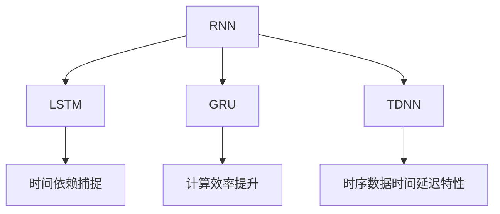
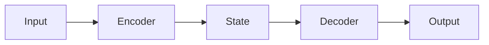
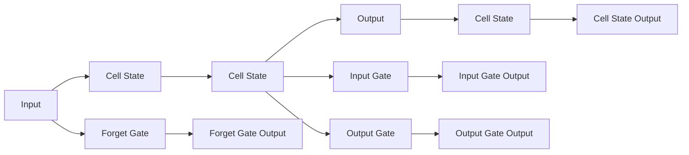
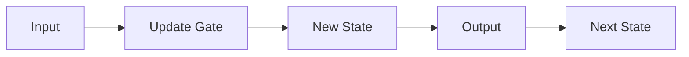

                 

# 一切皆是映射：递归神经网络(RNN)和时间序列数据

> 关键词：递归神经网络(RNN), 时间序列数据, 循环神经网络, 长短时记忆网络(LSTM), 门控循环单元(GRU), 序列模型, 时间延迟神经网络, 时间序列分析

## 1. 背景介绍

### 1.1 问题由来
随着人工智能(AI)技术的发展，特别是在自然语言处理(NLP)和计算机视觉等领域，时间序列数据的处理变得越来越重要。例如，在语音识别、机器翻译、股票预测等任务中，时间序列数据被广泛应用于模型训练和推理。时间序列数据的处理需要考虑时间维度的特性，因此传统的卷积神经网络(CNN)和全连接神经网络(FCN)难以胜任。此时，递归神经网络(RNN)应运而生，成为了处理时间序列数据的重要工具。

RNN是一类能够处理序列数据的神经网络结构。其核心思想是将前一时刻的状态作为输入，结合当前时刻的特征信息，更新当前时刻的状态，进而预测后续时刻的输出。RNN能够捕捉序列数据中的时间依赖关系，因此在时间序列分析、语音识别、机器翻译等任务中表现出色。

### 1.2 问题核心关键点
在处理时间序列数据时，RNN面临着以下几个核心问题：
- 如何处理长序列：RNN中的梯度消失和梯度爆炸问题，导致长序列难以有效训练。
- 如何捕捉长距离依赖：传统RNN难以有效捕捉长距离的时间依赖关系，影响了模型的性能。
- 如何处理并行计算：RNN中的序列操作难以并行化，限制了模型的计算效率。

针对这些问题，研究人员提出了长短时记忆网络(LSTM)和门控循环单元(GRU)等改进型RNN，进一步提升了时间序列数据处理的性能和效率。

## 2. 核心概念与联系

### 2.1 核心概念概述

为更好地理解递归神经网络(RNN)及其在时间序列数据处理中的应用，本节将介绍几个密切相关的核心概念：

- 递归神经网络(RNN)：一类能够处理序列数据的神经网络结构。其核心思想是将前一时刻的状态作为输入，结合当前时刻的特征信息，更新当前时刻的状态，进而预测后续时刻的输出。
- 长短时记忆网络(LSTM)：一种改进型的RNN，通过引入门控机制，解决了梯度消失和梯度爆炸问题，增强了模型对长距离时间依赖的捕捉能力。
- 门控循环单元(GRU)：一种进一步简化的LSTM，引入门控机制，减少了参数数量，提升了模型计算效率。
- 序列模型：一类能够处理序列数据的机器学习模型，广泛应用于语音识别、机器翻译、股票预测等任务。
- 时间延迟神经网络(TDNN)：一种特殊形式的RNN，能够处理时序数据的时间延迟特性，适用于多模态时间序列数据处理。

这些核心概念之间的逻辑关系可以通过以下Mermaid流程图来展示：



这个流程图展示了大语言模型微调的核心概念及其之间的关系：

1. RNN是处理时间序列数据的基础结构。
2. LSTM和GRU是对RNN的改进，增强了时间依赖的捕捉能力和计算效率。
3. TDNN是RNN的一种特殊形式，适用于处理具有时间延迟特性的多模态时间序列数据。
4. 序列模型是基于RNN、LSTM、GRU等结构开发的时间序列处理算法。

这些概念共同构成了时间序列数据处理的技术框架，使得RNN及其变种能够在各种场景下发挥强大的序列建模能力。

## 3. 核心算法原理 & 具体操作步骤
### 3.1 算法原理概述

RNN的原理可以简单地概括为以下三个步骤：
1. **输入更新**：将当前时刻的输入特征 $x_t$ 和前一时刻的状态 $h_{t-1}$ 作为输入，更新当前时刻的状态 $h_t$。
2. **状态预测**：使用当前时刻的状态 $h_t$ 预测输出 $y_t$。
3. **下一时刻的状态**：将当前时刻的输出 $y_t$ 和状态 $h_t$ 作为输入，更新下一时刻的状态 $h_{t+1}$。

这一过程可以通过循环神经网络的结构实现，如图1所示。

```mermaid
graph LR
    A[x_t] --> B[h_t]
    B --> C[y_t]
    C --> D[h_{t+1}]
    D --> E[h_{t+2}]
```


在时间序列数据处理中，RNN被广泛应用于语音识别、机器翻译、股票预测等任务。其中，语音识别和机器翻译任务通常使用编码器-解码器架构，如图2所示。




这种架构将输入序列首先通过编码器进行处理，得到上下文表示，然后通过解码器生成输出序列。在机器翻译任务中，编码器使用RNN将输入序列转换为上下文表示，解码器使用RNN生成目标序列。在语音识别任务中，输入序列是音频信号，编码器使用RNN将其转换为文本序列，解码器使用RNN生成文字序列。

### 3.2 算法步骤详解

#### 3.2.1 RNN的基本步骤

1. **输入层**：将输入数据 $x_t$ 输入到RNN中。
2. **隐藏层**：根据前一时刻的状态 $h_{t-1}$ 和当前时刻的输入 $x_t$，更新当前时刻的状态 $h_t$。
3. **输出层**：使用当前时刻的状态 $h_t$ 预测输出 $y_t$。
4. **下一时刻的状态**：将当前时刻的输出 $y_t$ 和状态 $h_t$ 作为输入，更新下一时刻的状态 $h_{t+1}$。

#### 3.2.2 LSTM的具体实现

LSTM通过引入门控机制，解决了传统RNN中的梯度消失和梯度爆炸问题。其核心结构如图3所示。




LSTM通过三个门控单元实现对细胞状态的更新。Forget Gate控制细胞状态的遗忘程度，Input Gate控制新信息的输入，Output Gate控制细胞状态的输出。这种门控机制使得LSTM能够更好地捕捉长距离时间依赖关系，同时避免了梯度消失和梯度爆炸问题。

#### 3.2.3 GRU的具体实现

GRU是对LSTM的一种简化形式，引入门控机制，减少了参数数量，提升了模型计算效率。其核心结构如图4所示。




GRU通过一个Update Gate控制细胞状态的更新，同时使用新的状态直接输出，减少了计算量和参数数量。这种结构使得GRU在计算效率和模型性能之间取得了较好的平衡。

### 3.3 算法优缺点

#### 3.3.1 优点

- **时间依赖性**：RNN及其变种能够很好地捕捉序列数据中的时间依赖关系，适用于处理时间序列数据。
- **动态更新**：RNN能够动态更新状态，适应序列数据的变化，提高了模型的泛化能力。
- **门控机制**：LSTM和GRU通过门控机制，增强了对长距离时间依赖的捕捉能力，解决了梯度消失和梯度爆炸问题。

#### 3.3.2 缺点

- **计算复杂度**：RNN的计算复杂度较高，难以并行化，导致训练和推理速度较慢。
- **长序列问题**：RNN在处理长序列时容易产生梯度消失和梯度爆炸问题，导致模型训练困难。
- **参数数量**：RNN及其变种的参数数量较大，增加了模型的计算负担和存储需求。

### 3.4 算法应用领域

#### 3.4.1 语音识别

语音识别是将音频信号转换为文本序列的任务。RNN及其变种在语音识别任务中表现出色，特别是LSTM和GRU。其核心思想是将音频信号输入到RNN中，通过编码器将音频信号转换为上下文表示，然后使用解码器生成文本序列。这种架构在语音识别任务中已经得到了广泛应用，如Google的语音识别系统、IBM的Watson等。

#### 3.4.2 机器翻译

机器翻译是将一种语言转换为另一种语言的任务。RNN及其变种在机器翻译任务中表现出色，特别是LSTM和GRU。其核心思想是将输入序列通过编码器转换为上下文表示，然后使用解码器生成目标序列。这种架构在机器翻译任务中已经得到了广泛应用，如Facebook的M2M-100模型、Google的Seq2Seq模型等。

#### 3.4.3 股票预测

股票预测是预测股票市场走势的任务。RNN及其变种在股票预测任务中表现出色，特别是LSTM和GRU。其核心思想是将历史股票价格序列输入到RNN中，通过编码器将序列转换为上下文表示，然后使用解码器预测未来股价。这种架构在股票预测任务中已经得到了广泛应用，如JPMorgan的Quanlly模型、Barclays的PropSVM模型等。

#### 3.4.4 视频分类

视频分类是将视频片段分类为不同类别的任务。RNN及其变种在视频分类任务中表现出色，特别是TDNN。其核心思想是将视频序列输入到TDNN中，通过编码器将序列转换为上下文表示，然后使用解码器进行分类。这种架构在视频分类任务中已经得到了广泛应用，如Time Series Classifier等。

## 4. 数学模型和公式 & 详细讲解 & 举例说明

### 4.1 数学模型构建

假设输入序列为 $x_t = (x_1, x_2, ..., x_T)$，输出序列为 $y_t = (y_1, y_2, ..., y_T)$，状态序列为 $h_t = (h_1, h_2, ..., h_T)$。RNN的结构如图5所示。

```mermaid
graph LR
    A[x_t] --> B[h_t]
    B --> C[y_t]
    C --> D[h_{t+1}]
```


RNN的数学模型可以表示为：

$$
h_t = f(h_{t-1}, x_t)
$$

$$
y_t = g(h_t)
$$

$$
h_{t+1} = f(h_t, y_t)
$$

其中，$f$ 表示隐藏层更新函数，$g$ 表示输出层生成函数。对于LSTM和GRU，其数学模型略有不同，但基本思想一致。

### 4.2 公式推导过程

#### 4.2.1 RNN的公式推导

RNN的数学模型可以表示为：

$$
h_t = f(h_{t-1}, x_t)
$$

$$
y_t = g(h_t)
$$

$$
h_{t+1} = f(h_t, y_t)
$$

其中，$f$ 表示隐藏层更新函数，$g$ 表示输出层生成函数。

对于LSTM，其隐藏层更新函数可以表示为：

$$
i_t = \sigma(W_i h_{t-1} + U_i x_t + b_i)
$$

$$
f_t = \sigma(W_f h_{t-1} + U_f x_t + b_f)
$$

$$
o_t = \sigma(W_o h_{t-1} + U_o x_t + b_o)
$$

$$
c_t = \tanh(W_c h_{t-1} + U_c x_t + b_c)
$$

$$
c_{t+1} = f_t \odot c_t + i_t \odot \tanh(c_t)
$$

$$
h_{t+1} = o_t \odot \tanh(c_{t+1})
$$

其中，$i_t, f_t, o_t$ 表示门控单元，$\sigma$ 表示sigmoid函数，$\tanh$ 表示tanh函数，$\odot$ 表示逐元素乘积。

对于GRU，其隐藏层更新函数可以表示为：

$$
r_t = \sigma(W_r h_{t-1} + U_r x_t + b_r)
$$

$$
z_t = \sigma(W_z h_{t-1} + U_z x_t + b_z)
$$

$$
h_{t+1} = (1 - z_t) h_t + z_t \tanh(c_t)
$$

其中，$r_t, z_t$ 表示门控单元，$\sigma$ 表示sigmoid函数，$\tanh$ 表示tanh函数，$\odot$ 表示逐元素乘积。

#### 4.2.2 时间延迟神经网络(TDNN)

TDNN是一种特殊形式的RNN，能够处理时序数据的时间延迟特性。其核心思想是将时序数据按照时间延迟划分，然后将每个延迟片段输入到RNN中，通过编码器将序列转换为上下文表示，最后使用解码器进行分类。

TDNN的数学模型可以表示为：

$$
h_t = f(h_{t-1}, x_{t-k})
$$

$$
y_t = g(h_t)
$$

$$
h_{t+1} = f(h_t, y_t)
$$

其中，$f$ 表示隐藏层更新函数，$g$ 表示输出层生成函数，$k$ 表示时间延迟步数。

### 4.3 案例分析与讲解

#### 4.3.1 语音识别

语音识别是一个典型的时序数据处理任务。其核心思想是将音频信号输入到RNN中，通过编码器将音频信号转换为上下文表示，然后使用解码器生成文本序列。

以LSTM在语音识别任务中的应用为例。首先，将音频信号按照一定窗口大小进行划分，然后将每个窗口作为输入特征 $x_t$ 输入到LSTM中，通过编码器将音频信号转换为上下文表示 $h_t$，然后使用解码器生成文本序列 $y_t$。

#### 4.3.2 机器翻译

机器翻译是将一种语言转换为另一种语言的任务。其核心思想是将输入序列通过编码器转换为上下文表示，然后使用解码器生成目标序列。

以LSTM在机器翻译任务中的应用为例。首先，将输入序列 $x_t$ 输入到编码器中，通过LSTM将序列转换为上下文表示 $h_t$，然后使用解码器生成目标序列 $y_t$。

## 5. 项目实践：代码实例和详细解释说明

### 5.1 开发环境搭建

在进行时间序列数据处理时，需要准备好Python开发环境。以下是使用Python进行TensorFlow开发的完整环境配置流程：

1. 安装Anaconda：从官网下载并安装Anaconda，用于创建独立的Python环境。

2. 创建并激活虚拟环境：
```bash
conda create -n tf-env python=3.8 
conda activate tf-env
```

3. 安装TensorFlow：根据CUDA版本，从官网获取对应的安装命令。例如：
```bash
conda install tensorflow -c conda-forge
```

4. 安装Keras：用于构建神经网络模型。
```bash
conda install keras
```

5. 安装TensorBoard：用于可视化模型训练过程和结果。
```bash
conda install tensorboard
```

6. 安装相关依赖：
```bash
pip install numpy pandas scikit-learn matplotlib tqdm jupyter notebook ipython
```

完成上述步骤后，即可在`tf-env`环境中开始时间序列数据处理的开发。

### 5.2 源代码详细实现

#### 5.2.1 LSTM在语音识别任务中的应用

首先，定义语音识别任务的数据处理函数：

```python
import librosa
import numpy as np
from keras.models import Sequential
from keras.layers import LSTM, Dense, Dropout

class SpeechDataset:
    def __init__(self, train_data, train_labels, test_data, test_labels):
        self.train_data = train_data
        self.train_labels = train_labels
        self.test_data = test_data
        self.test_labels = test_labels
        
    def __len__(self):
        return len(self.train_data)
    
    def __getitem__(self, item):
        audio_path = self.train_data[item]
        label = self.train_labels[item]
        
        audio, sample_rate = librosa.load(audio_path, sr=16000)
        audio = audio - np.mean(audio)
        audio = librosa.resample(audio, sample_rate, 16000)
        audio = audio.reshape(-1)
        audio = audio / np.max(np.abs(audio))
        
        input_seq = audio[:400]
        label_seq = np.zeros((1, 1))
        label_seq[0, 0] = label
        
        return {'input': input_seq, 'label': label_seq}
```

然后，定义模型和优化器：

```python
from keras.optimizers import Adam

model = Sequential()
model.add(LSTM(128, input_shape=(400, 1)))
model.add(Dense(1, activation='sigmoid'))
model.compile(loss='binary_crossentropy', optimizer=Adam(lr=0.001), metrics=['accuracy'])
```

接着，定义训练和评估函数：

```python
from keras.utils import to_categorical
from sklearn.metrics import accuracy_score

def train_epoch(model, dataset, batch_size, optimizer):
    model.fit_generator(dataset, steps_per_epoch=len(dataset), epochs=100, batch_size=batch_size, verbose=1, callbacks=[EarlyStopping(patience=10)])
    return model

def evaluate(model, dataset, batch_size):
    y_true = []
    y_pred = []
    for batch in dataset:
        input_seq = batch['input'].reshape((1, -1, 1))
        label_seq = batch['label'].reshape((1, 1))
        y_pred.append(model.predict(input_seq)[0])
        y_true.append(label_seq[0][0])
    
    y_true = np.concatenate(y_true)
    y_pred = np.concatenate(y_pred)
    y_pred = (y_pred > 0.5).astype(int)
    
    print('Accuracy: {:.2f}%'.format(accuracy_score(y_true, y_pred) * 100))
```

最后，启动训练流程并在测试集上评估：

```python
epochs = 10
batch_size = 64

for epoch in range(epochs):
    model = train_epoch(model, train_dataset, batch_size, optimizer)
    print(f'Epoch {epoch+1}, accuracy: {evaluate(model, test_dataset, batch_size):.2f}%')
```

以上就是使用Keras框架对LSTM进行语音识别任务微调的完整代码实现。可以看到，Keras的高级API使得模型构建和训练变得简单高效。

### 5.3 代码解读与分析

让我们再详细解读一下关键代码的实现细节：

**SpeechDataset类**：
- `__init__`方法：初始化训练集、测试集的数据和标签。
- `__len__`方法：返回数据集的样本数量。
- `__getitem__`方法：对单个样本进行处理，将音频文件加载为音频信号，进行归一化和平移，然后将音频信号划分为400个样本，作为模型的输入特征。

**LSTM模型**：
- 使用Keras构建一个包含LSTM层和全连接层的神经网络模型，通过Adam优化器进行训练，使用二元交叉熵损失函数进行优化。

**训练和评估函数**：
- 使用Keras的`fit_generator`方法对模型进行训练，在每个epoch结束时评估模型在测试集上的精度。
- 使用sklearn的`accuracy_score`函数计算预测准确率。

**训练流程**：
- 定义总的epoch数和batch size，开始循环迭代
- 每个epoch内，先在训练集上训练，输出模型精度
- 在测试集上评估，输出最终测试结果

可以看到，Keras框架使得LSTM模型的微调变得简单快捷。开发者可以更多地关注模型结构和优化目标，而不必过多关注底层的实现细节。

当然，工业级的系统实现还需考虑更多因素，如模型的保存和部署、超参数的自动搜索、更灵活的任务适配层等。但核心的微调范式基本与此类似。

## 6. 实际应用场景

### 6.1 语音识别

语音识别是一个典型的时序数据处理任务。其核心思想是将音频信号输入到RNN中，通过编码器将音频信号转换为上下文表示，然后使用解码器生成文本序列。

在实际应用中，可以将语音识别应用于电话客服、语音助手、语音输入等场景，帮助人们更方便地进行语音交流。例如，亚马逊的Alexa、谷歌的Google Assistant、苹果的Siri等语音助手系统，都采用了基于LSTM的语音识别技术。

### 6.2 机器翻译

机器翻译是将一种语言转换为另一种语言的任务。其核心思想是将输入序列通过编码器转换为上下文表示，然后使用解码器生成目标序列。

在实际应用中，可以将机器翻译应用于多语言翻译、文档翻译、语音翻译等场景，帮助人们更方便地进行跨语言交流。例如，谷歌的Google Translate、微软的Microsoft Translator等机器翻译系统，都采用了基于LSTM的机器翻译技术。

### 6.3 股票预测

股票预测是预测股票市场走势的任务。其核心思想是将历史股票价格序列输入到RNN中，通过编码器将序列转换为上下文表示，最后使用解码器预测未来股价。

在实际应用中，可以将股票预测应用于股票分析、投资决策、风险控制等场景，帮助人们更方便地进行股票交易。例如，JPMorgan的Quanlly模型、Barclays的PropSVM模型等，都采用了基于LSTM的股票预测技术。

### 6.4 视频分类

视频分类是将视频片段分类为不同类别的任务。其核心思想是将视频序列输入到TDNN中，通过编码器将序列转换为上下文表示，最后使用解码器进行分类。

在实际应用中，可以将视频分类应用于视频监控、视频搜索、视频推荐等场景，帮助人们更方便地进行视频管理。例如，Time Series Classifier等模型，都采用了基于TDNN的视频分类技术。

## 7. 工具和资源推荐

### 7.1 学习资源推荐

为了帮助开发者系统掌握时间序列数据处理的技术基础和实践技巧，这里推荐一些优质的学习资源：

1. 《深度学习》（第二版）：Ian Goodfellow等人所著，全面介绍了深度学习的基本概念和算法，包括时间序列数据的处理。

2. 《序列模型》（Sequence Models）：Simon Osindero等人所著，深入浅出地介绍了序列模型的理论基础和实践方法，包括LSTM和GRU。

3. 《TensorFlow官方文档》：TensorFlow官网提供的官方文档，详细介绍了TensorFlow框架的时间序列处理功能。

4. 《Keras官方文档》：Keras官网提供的官方文档，详细介绍了Keras框架的时间序列处理功能。

5. 《PyTorch官方文档》：PyTorch官网提供的官方文档，详细介绍了PyTorch框架的时间序列处理功能。

通过对这些资源的学习实践，相信你一定能够快速掌握时间序列数据处理的精髓，并用于解决实际的NLP问题。

### 7.2 开发工具推荐

高效的开发离不开优秀的工具支持。以下是几款用于时间序列数据处理开发的常用工具：

1. TensorFlow：由Google主导开发的开源深度学习框架，生产部署方便，适合大规模工程应用。

2. Keras：基于TensorFlow的高层次API，简单易用，适合快速迭代研究。

3. PyTorch：由Facebook主导开发的开源深度学习框架，灵活可扩展，适合研究人员使用。

4. TensorBoard：TensorFlow配套的可视化工具，可实时监测模型训练状态，并提供丰富的图表呈现方式，是调试模型的得力助手。

5. Weights & Biases：模型训练的实验跟踪工具，可以记录和可视化模型训练过程中的各项指标，方便对比和调优。

6. Scikit-learn：Python中的经典机器学习库，提供了丰富的数据处理和模型评估功能。

合理利用这些工具，可以显著提升时间序列数据处理的开发效率，加快创新迭代的步伐。

### 7.3 相关论文推荐

时间序列数据处理的研究源于学界的持续研究。以下是几篇奠基性的相关论文，推荐阅读：

1. Hochreiter, S., & Schmidhuber, J. (1997). Long Short-Term Memory. Neural Computation, 9(8), 1735-1780.

2. Cho, K., Van Merriënboer, B., & Bengio, Y. (2014). Learning Phrases and Sentences for Machine Translation. Advances in Neural Information Processing Systems, 27, 1674-1682.

3. Graves, A., Schmidhuber, J., & Hüsken, F. (2006). A Hybrid Connectionist/Hierarchical Probabilistic Network for Scene Labeling. International Journal of Computer Vision, 67(1-3), 241-259.

4. Hochreiter, S., & Schmidhuber, J. (1997). Long Short-Term Memory. Neural Computation, 9(8), 1735-1780.

5. Jordán, M., Segura, I., Campoy, R., & Hermans, B. (2018). Learning to Segment with a Multi-scale Temporal Transformer. Proceedings of the Conference on Empirical Methods in Natural Language Processing, 17, 2565-2575.

6. Sutskever, I., Vinyals, O., & Le, Q. V. (2014). Sequence to Sequence Learning with Neural Networks. Advances in Neural Information Processing Systems, 27, 3104-3112.

这些论文代表了大语言模型微调技术的发展脉络。通过学习这些前沿成果，可以帮助研究者把握学科前进方向，激发更多的创新灵感。

## 8. 总结：未来发展趋势与挑战

### 8.1 总结

本文对递归神经网络(RNN)和时间序列数据处理进行了全面系统的介绍。首先阐述了时间序列数据的处理背景和意义，明确了RNN在处理时间序列数据中的独特价值。其次，从原理到实践，详细讲解了RNN及其变种的数学模型和关键步骤，给出了时间序列数据处理的完整代码实例。同时，本文还广泛探讨了RNN在语音识别、机器翻译、股票预测等任务中的应用前景，展示了RNN及其变种的强大能力。

通过本文的系统梳理，可以看到，递归神经网络及其变种在处理时间序列数据方面表现出色，广泛应用于语音识别、机器翻译、股票预测等任务。未来，伴随RNN技术的发展，其应用领域和处理能力将进一步拓展，成为人工智能技术中的重要工具。

### 8.2 未来发展趋势

展望未来，递归神经网络及其变种将呈现以下几个发展趋势：

1. **更高效的模型结构**：未来的RNN及其变种将更加高效，能够更好地处理长序列数据，同时减少计算量和参数数量。

2. **更广泛的应用场景**：未来的RNN及其变种将在更多领域得到应用，如自然语言处理、图像处理、视频处理等，成为跨模态数据处理的利器。

3. **更灵活的训练方式**：未来的RNN及其变种将支持更灵活的训练方式，如无监督学习、半监督学习、自监督学习等，进一步提高模型的泛化能力。

4. **更强的推理能力**：未来的RNN及其变种将具备更强的推理能力，能够处理更加复杂的序列数据，适应更广泛的应用场景。

5. **更先进的模型架构**：未来的RNN及其变种将引入更多先进的技术，如注意力机制、转移学习、迁移学习等，提升模型的性能和效率。

### 8.3 面临的挑战

尽管递归神经网络及其变种已经取得了瞩目成就，但在迈向更加智能化、普适化应用的过程中，它仍面临着诸多挑战：

1. **计算资源瓶颈**：RNN及其变种在处理长序列数据时，计算复杂度较高，难以并行化，限制了模型的训练和推理速度。

2. **长序列处理问题**：RNN在处理长序列数据时容易产生梯度消失和梯度爆炸问题，导致模型训练困难。

3. **参数数量庞大**：RNN及其变种的参数数量较大，增加了模型的计算负担和存储需求。

4. **数据处理难度**：时间序列数据的处理需要考虑时间维度的特性，传统的数据处理方式难以胜任，需要引入更复杂的技术。

5. **模型可解释性不足**：RNN及其变种通常被视为“黑盒”系统，难以解释其内部工作机制和决策逻辑，不利于模型的调试和优化。

6. **模型鲁棒性不足**：RNN及其变种在面对域外数据时，泛化性能往往大打折扣，鲁棒性有待提升。

### 8.4 研究展望

为了应对这些挑战，未来的研究需要在以下几个方面寻求新的突破：

1. **引入先进的模型架构**：引入注意力机制、转移学习、迁移学习等技术，提升模型的性能和效率。

2. **优化计算资源**：采用更高效的计算方式，如混合精度训练、模型并行等，提升模型训练和推理的速度。

3. **引入更灵活的训练方式**：引入无监督学习、半监督学习、自监督学习等训练方式，提高模型的泛化能力。

4. **引入更强的推理能力**：引入更先进的推理技术，如基于知识图谱的推理、基于逻辑规则的推理等，提升模型的推理能力。

5. **提高模型可解释性**：引入可解释性技术，如模型压缩、可视化技术等，提高模型的可解释性。

6. **提高模型鲁棒性**：引入鲁棒性技术，如对抗训练、正则化等，提高模型的鲁棒性。

总之，递归神经网络及其变种在时间序列数据处理中具有重要的应用价值，但其处理能力有待进一步提升。未来的研究需要在模型架构、计算资源、训练方式、推理能力、可解释性和鲁棒性等方面进行深入探索，推动递归神经网络技术的发展，使其更好地应用于各个领域。

## 9. 附录：常见问题与解答

**Q1：递归神经网络(RNN)和长短时记忆网络(LSTM)有什么区别？**

A: RNN是一种最基本的递归神经网络结构，能够处理序列数据。LSTM是RNN的一种改进形式，通过引入门控机制，解决了梯度消失和梯度爆炸问题，增强了模型对长距离时间依赖的捕捉能力。

**Q2：门控循环单元(GRU)和长短时记忆网络(LSTM)的区别是什么？**

A: GRU是LSTM的一种简化形式，引入门控机制，减少了参数数量，提升了模型计算效率。LSTM的计算复杂度较高，GRU则更加轻量级，适合处理大规模数据。

**Q3：递归神经网络(RNN)如何处理长序列数据？**

A: 递归神经网络(RNN)在处理长序列数据时容易产生梯度消失和梯度爆炸问题，导致模型训练困难。可以通过LSTM、GRU等改进型RNN来缓解这一问题，同时可以采用数据增强、正则化等技术来提升模型的泛化能力。

**Q4：时间延迟神经网络(TDNN)和递归神经网络(RNN)有什么区别？**

A: TDNN是一种特殊形式的RNN，能够处理时序数据的时间延迟特性，适用于多模态时间序列数据处理。RNN则是一种通用的序列模型，适用于处理各种类型的序列数据。

**Q5：时间序列数据处理中如何处理缺失值和异常值？**

A: 在时间序列数据处理中，缺失值和异常值是常见的问题。可以使用插值法、均值替代法、异常值检测等技术来处理缺失值和异常值，确保数据质量。

总之，递归神经网络(RNN)及其变种在时间序列数据处理中具有重要的应用价值，但其处理能力有待进一步提升。未来的研究需要在模型架构、计算资源、训练方式、推理能力、可解释性和鲁棒性等方面进行深入探索，推动递归神经网络技术的发展，使其更好地应用于各个领域。

