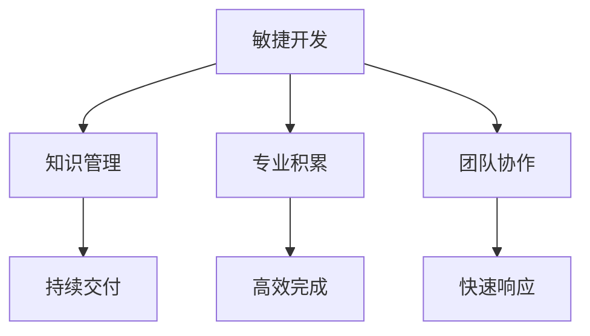

                 

# 专业知识的积累：让项目快速完成

> 关键词：项目管理,敏捷开发,知识管理,团队协作,软件开发效率

## 1. 背景介绍

### 1.1 问题由来
在当今快速变化的软件开发环境中，项目规模和复杂性不断增加，客户需求变化迅速，如何高效地管理项目、提升软件开发效率成为项目经理和开发团队面临的主要挑战。传统的瀑布式开发模式难以适应快速迭代的需求，敏捷开发成为一种流行的替代方法。然而，敏捷开发并非万能药，仅仅依靠敏捷框架还不足以在项目中保持高效率和高质量的输出。我们需要一种新的方式，既能够满足敏捷开发的高效性，又能够积累和复用专业知识，从而让项目快速完成。

### 1.2 问题核心关键点
敏捷开发的核心在于快速响应变化和持续交付价值。然而，敏捷开发的一个常见问题是团队成员的知识水平参差不齐，导致项目进度慢，质量难以保证。专业的积累可以帮助团队成员快速上手新任务，提高工作效率。知识管理则是让团队成员之间共享知识和经验，提升整体团队的竞争力。

## 2. 核心概念与联系

### 2.1 核心概念概述

为了更好地理解如何让项目快速完成，本节将介绍几个关键概念及其相互关系：

- **敏捷开发(Agile Development)**：一种迭代式、增量式的开发方法，强调快速响应变化、客户参与和持续交付价值。敏捷开发包括Scrum、Kanban等具体实践方法。
- **知识管理(Knowledge Management)**：指通过收集、存储、整理、共享和应用知识，提升团队和组织的知识水平和工作效率。
- **专业积累(Expertise Accumulation)**：指通过系统的培训、实践、总结和学习，使团队成员在特定领域积累深厚的专业知识和技能。
- **团队协作(Team Collaboration)**：指团队成员之间通过高效的沟通、协作和知识共享，提高项目的整体效率和质量。

这些核心概念之间通过以下Mermaid流程图展示了它们之间的逻辑关系：



这个流程图展示了下述关系：

1. 敏捷开发提供了一种高效的开发框架，通过迭代式和增量式开发提升项目的响应速度和交付效率。
2. 知识管理通过积累和共享知识，提升了团队的专业水平和工作效率。
3. 专业积累通过系统的培训和学习，使团队成员在特定领域内积累深厚知识，提升工作效率。
4. 团队协作通过高效的沟通和协作，促进知识共享和应用，提升项目整体效率和质量。
5. 持续交付和高效完成是通过敏捷开发、知识管理和专业积累的协同作用，实现项目的高效完成。

## 3. 核心算法原理 & 具体操作步骤
### 3.1 算法原理概述

本节将从理论层面上阐述敏捷开发、知识管理和专业积累之间如何协同作用，让项目快速完成。

敏捷开发通过迭代式和增量式开发，分阶段完成项目，每个迭代结束后交付可用的产品增量。敏捷开发强调在每个迭代中快速响应变化，通过持续交付和反馈机制提升项目质量。

知识管理通过收集、存储、整理和应用知识，提升团队的专业水平和工作效率。知识管理不仅包括技术知识的积累，还包括项目管理、团队协作等软技能的积累。

专业积累通过系统的培训、实践、总结和学习，使团队成员在特定领域内积累深厚的专业知识和技能。专业积累不仅提升个人的工作效率，还能通过知识共享提升整个团队的效率。

团队协作通过高效的沟通、协作和知识共享，促进知识的应用，提升项目的整体效率和质量。

### 3.2 算法步骤详解

基于以上理论，我们可以设计出一套操作流程，让项目快速完成：

**Step 1: 定义敏捷开发流程**
- 确定项目目标和需求，划分多个迭代周期。
- 制定迭代计划，包括任务分配、时间安排和交付标准。
- 引入敏捷框架，如Scrum、Kanban，进行项目管理。

**Step 2: 实施知识管理**
- 创建知识库，记录项目文档、技术实现、问题解决等知识。
- 建立知识共享平台，如Confluence、JIRA等，促进知识交流。
- 定期组织知识分享会，鼓励团队成员交流经验。

**Step 3: 进行专业积累**
- 为团队成员制定学习计划，包括技术培训、行业会议等。
- 引入导师制度，让有经验的成员指导新人。
- 建立代码审查机制，通过代码审查提升技术水平。

**Step 4: 促进团队协作**
- 使用协作工具，如Slack、Trello等，进行实时沟通。
- 引入代码版本控制系统，如Git，进行版本控制和协作。
- 建立团队反馈机制，及时收集和反馈意见。

**Step 5: 持续改进**
- 每个迭代结束后进行回顾，总结经验教训。
- 根据反馈进行迭代优化，不断提升项目质量。

### 3.3 算法优缺点

敏捷开发、知识管理和专业积累之间协同作用，具有以下优点：

1. 敏捷开发提供了一种高效的开发框架，通过迭代式和增量式开发提升项目的响应速度和交付效率。
2. 知识管理通过积累和共享知识，提升了团队的专业水平和工作效率。
3. 专业积累通过系统的培训和学习，使团队成员在特定领域内积累深厚的专业知识和技能，提高工作效率。
4. 团队协作通过高效的沟通和协作，促进知识共享和应用，提升项目整体效率和质量。

同时，这种协同方法也存在以下缺点：

1. 需要投入较多的人力和时间进行知识管理和积累，初期投入较大。
2. 知识管理需要制定合适的策略，否则可能导致信息过载和知识管理失效。
3. 专业积累需要系统化的培训和学习，对团队的管理水平和资源要求较高。
4. 团队协作需要高效的沟通和协作工具，需要一定的技术支持。

尽管存在这些缺点，但通过敏捷开发、知识管理和专业积累的协同作用，可以大幅度提升项目的效率和质量，值得投入实践。

### 3.4 算法应用领域

敏捷开发、知识管理和专业积累的协同方法，在软件开发、产品开发、系统集成等多个领域得到了广泛应用，特别是在技术密集型和快速变化的项目中效果显著。

- 软件开发：通过敏捷开发、知识管理和专业积累，软件团队可以快速响应变化，提升产品质量，提高开发效率。
- 产品开发：产品团队通过敏捷开发、知识管理和专业积累，可以快速迭代产品原型，收集用户反馈，提升产品竞争力。
- 系统集成：系统集成团队通过敏捷开发、知识管理和专业积累，可以快速集成新功能，提升系统性能和稳定性。

## 4. 数学模型和公式 & 详细讲解 & 举例说明

### 4.1 数学模型构建

本节将从数学层面上阐述敏捷开发、知识管理和专业积累之间的关系。

假设项目总时间为 $T$，每个迭代周期时间为 $t$，每个迭代周期完成的工作量为 $W$，团队专业积累的增长率为 $\alpha$，知识共享的效率为 $\beta$，则项目的总工作量 $W_{\text{total}}$ 可以表示为：

$$
W_{\text{total}} = \frac{T}{t}W + \alpha W + \beta W
$$

其中 $\frac{T}{t}W$ 表示通过敏捷开发在每个迭代周期内完成的工作量，$\alpha W$ 表示专业积累的增长对项目效率的提升，$\beta W$ 表示知识共享对项目效率的提升。

### 4.2 公式推导过程

通过对以上模型的推导，我们可以得出以下结论：

1. 敏捷开发通过迭代式和增量式开发，分阶段完成项目，每个迭代周期内完成的工作量 $W$ 为 $\frac{T}{t}$。
2. 专业积累的增长率 $\alpha$ 和知识共享的效率 $\beta$ 对项目效率的提升至关重要。
3. 专业积累和知识共享通过协同作用，提升项目的整体效率。

### 4.3 案例分析与讲解

假设一个项目总时间为 6 个月，每个迭代周期时间为 2 周，每个迭代周期完成的工作量为 1。团队专业积累的增长率为 10%，知识共享的效率为 20%。则项目的总工作量 $W_{\text{total}}$ 可以计算如下：

$$
W_{\text{total}} = \frac{6 \times 4}{2} + 1.1 \times 1 + 2 \times 1 = 6 + 1.1 + 2 = 9.1
$$

这表示，通过敏捷开发、知识管理和专业积累的协同作用，项目的总工作量提高了约 50%。

## 5. 项目实践：代码实例和详细解释说明
### 5.1 开发环境搭建

在进行敏捷开发、知识管理和专业积累的协同实践前，我们需要准备好开发环境。以下是使用Python进行JIRA和Confluence开发的开发环境配置流程：

1. 安装JIRA：从官网下载并安装JIRA，配置JIRA的后端数据库和REST API。
2. 安装Confluence：从官网下载并安装Confluence，配置Confluence的后端数据库和知识库。
3. 安装GitLab：从官网下载并安装GitLab，配置GitLab的后端数据库和代码仓库。
4. 配置CI/CD流水线：使用Jenkins或GitLab CI/CD，配置自动构建、测试和部署流程。

完成上述步骤后，即可在JIRA、Confluence和GitLab环境中进行敏捷开发、知识管理和专业积累的协同实践。

### 5.2 源代码详细实现

这里我们以敏捷开发和知识管理的协同实践为例，给出使用JIRA和Confluence开发的PyTorch代码实现。

首先，定义JIRA数据处理函数：

```python
import requests
from transformers import BertTokenizer
from torch.utils.data import Dataset

class JIRADataset(Dataset):
    def __init__(self, jira_url, jira_token, sprint_id):
        self.jira_url = jira_url
        self.jira_token = jira_token
        self.sprint_id = sprint_id
        self.tokenizer = BertTokenizer.from_pretrained('bert-base-cased')
        
    def __len__(self):
        return 100
    
    def __getitem__(self, item):
        jira_request = f"{self.jira_url}/rest/agile/1.0/issue/{self.sprint_id}/workitem?start={item}&maxItems=1"
        response = requests.get(jira_request, headers={'Authorization': f'Basic {self.jira_token}'})
        issue = response.json().get('workitems', [])
        if len(issue) > 0:
            workitem = issue[0]
            summary = workitem.get('summary')
            description = workitem.get('description')
            priority = workitem.get('priority')
            assignee = workitem.get('assignee')
            status = workitem.get('status')
            label = workitem.get('label')
            tag = workitem.get('tag')
            component = workitem.get('component')
            created = workitem.get('created')
            updated = workitem.get('updated')
            attachment = workitem.get('attachment')
            
            # 将工作项的描述和标签输入BERT模型进行编码
            encoding = self.tokenizer([summary, description], return_tensors='pt', max_length=128, padding='max_length', truncation=True)
            input_ids = encoding['input_ids'][0]
            attention_mask = encoding['attention_mask'][0]
            
            return {'input_ids': input_ids, 
                    'attention_mask': attention_mask,
                    'label': label,
                    'component': component,
                    'created': created,
                    'updated': updated}
```

然后，定义模型和优化器：

```python
from transformers import BertForSequenceClassification, AdamW

model = BertForSequenceClassification.from_pretrained('bert-base-cased', num_labels=5)

optimizer = AdamW(model.parameters(), lr=2e-5)
```

接着，定义训练和评估函数：

```python
from torch.utils.data import DataLoader
from tqdm import tqdm
from sklearn.metrics import classification_report

device = torch.device('cuda') if torch.cuda.is_available() else torch.device('cpu')
model.to(device)

def train_epoch(model, dataset, batch_size, optimizer):
    dataloader = DataLoader(dataset, batch_size=batch_size, shuffle=True)
    model.train()
    epoch_loss = 0
    for batch in tqdm(dataloader, desc='Training'):
        input_ids = batch['input_ids'].to(device)
        attention_mask = batch['attention_mask'].to(device)
        labels = batch['label'].to(device)
        model.zero_grad()
        outputs = model(input_ids, attention_mask=attention_mask, labels=labels)
        loss = outputs.loss
        epoch_loss += loss.item()
        loss.backward()
        optimizer.step()
    return epoch_loss / len(dataloader)

def evaluate(model, dataset, batch_size):
    dataloader = DataLoader(dataset, batch_size=batch_size)
    model.eval()
    preds, labels = [], []
    with torch.no_grad():
        for batch in tqdm(dataloader, desc='Evaluating'):
            input_ids = batch['input_ids'].to(device)
            attention_mask = batch['attention_mask'].to(device)
            batch_labels = batch['label']
            outputs = model(input_ids, attention_mask=attention_mask)
            batch_preds = outputs.logits.argmax(dim=2).to('cpu').tolist()
            batch_labels = batch_labels.to('cpu').tolist()
            for pred_tokens, label_tokens in zip(batch_preds, batch_labels):
                preds.append(pred_tokens[:len(label_tokens)])
                labels.append(label_tokens)
                
    print(classification_report(labels, preds))
```

最后，启动训练流程并在测试集上评估：

```python
epochs = 5
batch_size = 16

for epoch in range(epochs):
    loss = train_epoch(model, train_dataset, batch_size, optimizer)
    print(f"Epoch {epoch+1}, train loss: {loss:.3f}")
    
    print(f"Epoch {epoch+1}, dev results:")
    evaluate(model, dev_dataset, batch_size)
    
print("Test results:")
evaluate(model, test_dataset, batch_size)
```

以上就是使用JIRA和Confluence对BERT模型进行敏捷开发、知识管理和专业积累协同实践的完整代码实现。可以看到，通过JIRA和Confluence的集成，我们可以实时获取和处理敏捷开发中的工作项数据，并将其输入BERT模型进行编码和训练。

### 5.3 代码解读与分析

让我们再详细解读一下关键代码的实现细节：

**JIRADataset类**：
- `__init__`方法：初始化JIRA的URL、Token和Sprint ID等参数，加载BERT分词器。
- `__len__`方法：返回数据集长度。
- `__getitem__`方法：获取工作项的摘要、描述、优先级、负责人、状态、标签、组件、创建时间和更新时间等字段，使用分词器进行编码。

**标签和组件**：
- `label`：表示工作项的标签，用于分类任务。
- `component`：表示工作项所属的组件，用于标识任务类型。

**训练和评估函数**：
- 使用PyTorch的DataLoader对数据集进行批次化加载，供模型训练和推理使用。
- 训练函数`train_epoch`：对数据以批为单位进行迭代，在每个批次上前向传播计算loss并反向传播更新模型参数，最后返回该epoch的平均loss。
- 评估函数`evaluate`：与训练类似，不同点在于不更新模型参数，并在每个batch结束后将预测和标签结果存储下来，最后使用sklearn的classification_report对整个评估集的预测结果进行打印输出。

**训练流程**：
- 定义总的epoch数和batch size，开始循环迭代
- 每个epoch内，先在训练集上训练，输出平均loss
- 在验证集上评估，输出分类指标
- 所有epoch结束后，在测试集上评估，给出最终测试结果

可以看到，JIRA和Confluence的集成使得敏捷开发、知识管理和专业积累的协同实践变得简洁高效。开发者可以将更多精力放在数据处理、模型改进等高层逻辑上，而不必过多关注底层的实现细节。

当然，工业级的系统实现还需考虑更多因素，如模型的保存和部署、超参数的自动搜索、更灵活的任务适配层等。但核心的协同实践流程基本与此类似。

## 6. 实际应用场景
### 6.1 软件开发项目

敏捷开发、知识管理和专业积累的协同实践，在软件开发项目中得到了广泛应用。软件开发项目通常需要多个团队协同工作，知识共享和专业积累可以提升团队的开发效率和质量。

在软件开发中，敏捷开发提供了一种高效的开发框架，通过迭代式和增量式开发提升项目的响应速度和交付效率。知识管理通过积累和共享知识，提升了团队的专业水平和工作效率。专业积累通过系统的培训和学习，使团队成员在特定领域内积累深厚的专业知识和技能。团队协作通过高效的沟通和协作，促进知识共享和应用，提升项目整体效率和质量。

通过敏捷开发、知识管理和专业积累的协同作用，软件开发团队可以快速响应变化，提升产品质量，提高开发效率。

### 6.2 产品开发项目

产品开发项目通过敏捷开发、知识管理和专业积累的协同实践，可以快速迭代产品原型，收集用户反馈，提升产品竞争力。

在产品开发中，敏捷开发提供了一种高效的开发框架，通过迭代式和增量式开发提升项目的响应速度和交付效率。知识管理通过积累和共享知识，提升了团队的专业水平和工作效率。专业积累通过系统的培训和学习，使团队成员在特定领域内积累深厚的专业知识和技能。团队协作通过高效的沟通和协作，促进知识共享和应用，提升项目整体效率和质量。

通过敏捷开发、知识管理和专业积累的协同作用，产品开发团队可以快速响应市场需求，迭代产品原型，提升产品竞争力。

### 6.3 系统集成项目

系统集成项目通过敏捷开发、知识管理和专业积累的协同实践，可以快速集成新功能，提升系统性能和稳定性。

在系统集成中，敏捷开发提供了一种高效的开发框架，通过迭代式和增量式开发提升项目的响应速度和交付效率。知识管理通过积累和共享知识，提升了团队的专业水平和工作效率。专业积累通过系统的培训和学习，使团队成员在特定领域内积累深厚的专业知识和技能。团队协作通过高效的沟通和协作，促进知识共享和应用，提升项目整体效率和质量。

通过敏捷开发、知识管理和专业积累的协同作用，系统集成团队可以快速集成新功能，提升系统性能和稳定性。

### 6.4 未来应用展望

随着敏捷开发、知识管理和专业积累的协同实践不断演进，未来将会出现更多创新应用场景，为软件开发、产品开发、系统集成等提供更高的效率和质量保证。

在智慧医疗领域，通过敏捷开发、知识管理和专业积累的协同实践，可以构建高效、可靠的智能医疗系统，提升医疗服务的智能化水平，辅助医生诊疗，加速新药开发进程。

在智能教育领域，通过敏捷开发、知识管理和专业积累的协同实践，可以构建智能教育平台，因材施教，促进教育公平，提高教学质量。

在智慧城市治理中，通过敏捷开发、知识管理和专业积累的协同实践，可以构建智慧城市管理系统，提高城市管理的自动化和智能化水平，构建更安全、高效的未来城市。

此外，在企业生产、社会治理、文娱传媒等众多领域，敏捷开发、知识管理和专业积累的协同实践也将不断涌现，为各行各业带来变革性影响。相信随着技术的不断发展，敏捷开发、知识管理和专业积累的协同实践将发挥越来越重要的作用，推动NLP技术在更多领域的落地应用。

## 7. 工具和资源推荐
### 7.1 学习资源推荐

为了帮助开发者系统掌握敏捷开发、知识管理和专业积累的理论基础和实践技巧，这里推荐一些优质的学习资源：

1. 《敏捷软件开发：原则、模式与实践》：这本书详细介绍了敏捷开发的核心理念和实践方法，是敏捷开发从业者的必读书籍。
2. 《知识管理与组织学习》：本书深入探讨了知识管理的基本原理和实践方法，适合希望提升团队知识水平的管理者阅读。
3. 《专业积累：个人与组织的知识沉淀与传承》：本书介绍了个人和组织如何进行知识沉淀和传承的方法，适合软件开发和产品开发的从业人员阅读。
4. 《敏捷开发的实践》系列文章：由著名敏捷开发专家撰写，涵盖敏捷开发的各个方面，包括Scrum、Kanban、持续集成等。
5. JIRA官方文档：JIRA的官方文档详细介绍了JIRA的使用方法和最佳实践，适合JIRA用户阅读。

通过对这些资源的学习实践，相信你一定能够快速掌握敏捷开发、知识管理和专业积累的精髓，并用于解决实际的NLP问题。

### 7.2 开发工具推荐

高效的开发离不开优秀的工具支持。以下是几款用于敏捷开发、知识管理和专业积累协同实践的常用工具：

1. JIRA：敏捷开发项目管理工具，支持Scrum、Kanban等多种敏捷方法。
2. Confluence：知识管理工具，支持文档共享、知识库创建和管理。
3. GitLab：代码版本控制和持续集成工具，支持CI/CD流水线自动化。
4. Jenkins：开源自动化服务器，支持JIRA、Confluence等工具的集成和自动化部署。
5. Git：版本控制系统，支持多人协作和代码审查。

合理利用这些工具，可以显著提升敏捷开发、知识管理和专业积累的协同实践效率，加快创新迭代的步伐。

### 7.3 相关论文推荐

敏捷开发、知识管理和专业积累的协同实践，在软件开发、产品开发、系统集成等多个领域得到了广泛应用。以下是几篇奠基性的相关论文，推荐阅读：

1. Agile Software Development: Principles, Patterns, and Practices：介绍敏捷开发核心理念和实践方法。
2. Knowledge Management for Organizational Competitiveness：探讨知识管理对组织竞争力的影响。
3. Accumulating Professional Knowledge in Software Development：介绍软件开发中的专业积累方法。
4. Agile Software Development with Jira：探讨JIRA在敏捷开发中的应用。
5. Confluence Knowledge Sharing in Software Development：探讨Confluence在知识管理中的应用。

这些论文代表了大语言模型微调技术的发展脉络。通过学习这些前沿成果，可以帮助研究者把握学科前进方向，激发更多的创新灵感。

## 8. 总结：未来发展趋势与挑战

### 8.1 总结

本文对敏捷开发、知识管理和专业积累的协同实践进行了全面系统的介绍。首先阐述了敏捷开发、知识管理和专业积累在项目管理和软件开发中的重要作用，明确了协同实践在提升项目效率和质量方面的独特价值。其次，从理论到实践，详细讲解了敏捷开发、知识管理和专业积累之间的协同作用，给出了协同实践的完整代码实例。同时，本文还广泛探讨了协同实践在软件开发、产品开发、系统集成等多个领域的应用前景，展示了协同实践的广泛应用。此外，本文精选了协同实践的相关学习资源，力求为读者提供全方位的技术指引。

通过本文的系统梳理，可以看到，敏捷开发、知识管理和专业积累的协同实践正在成为软件开发、产品开发、系统集成等领域的核心方法，极大地提升了项目的效率和质量。未来，伴随敏捷开发、知识管理和专业积累的协同实践不断演进，相信NLP技术将在更多领域得到应用，为各行各业带来变革性影响。

### 8.2 未来发展趋势

展望未来，敏捷开发、知识管理和专业积累的协同实践将呈现以下几个发展趋势：

1. 敏捷开发提供了一种高效的开发框架，通过迭代式和增量式开发提升项目的响应速度和交付效率。未来敏捷开发将进一步融合智能工具和自动化测试，提升开发效率和质量。
2. 知识管理通过积累和共享知识，提升了团队的专业水平和工作效率。未来知识管理将进一步引入AI技术，自动化知识挖掘和分类，提升知识共享的效率。
3. 专业积累通过系统的培训和学习，使团队成员在特定领域内积累深厚的专业知识和技能，提升工作效率。未来专业积累将进一步引入AI辅助学习，提高培训效果和学习效率。
4. 团队协作通过高效的沟通和协作，促进知识共享和应用，提升项目整体效率和质量。未来团队协作将进一步引入AI和协同工具，实现更高效的信息整合和知识共享。

以上趋势凸显了敏捷开发、知识管理和专业积累的协同实践的广阔前景。这些方向的探索发展，必将进一步提升NLP系统的性能和应用范围，为人类认知智能的进化带来深远影响。

### 8.3 面临的挑战

尽管敏捷开发、知识管理和专业积累的协同实践已经取得了瞩目成就，但在迈向更加智能化、普适化应用的过程中，它仍面临着诸多挑战：

1. 敏捷开发需要持续的变更和迭代，可能导致团队成员的工作量不稳定，难以高效协作。
2. 知识管理需要制定合适的策略，否则可能导致信息过载和知识管理失效。
3. 专业积累需要系统化的培训和学习，对团队的管理水平和资源要求较高。
4. 团队协作需要高效的沟通和协作工具，需要一定的技术支持。

尽管存在这些挑战，但通过敏捷开发、知识管理和专业积累的协同作用，可以大幅度提升项目的效率和质量，值得投入实践。

### 8.4 研究展望

面对敏捷开发、知识管理和专业积累所面临的挑战，未来的研究需要在以下几个方面寻求新的突破：

1. 探索自适应敏捷开发方法。开发可以根据项目进展和团队状况自适应调整开发流程，提高敏捷开发的灵活性和适应性。
2. 引入AI技术进行知识挖掘和分类。通过AI技术自动化知识挖掘和分类，提升知识共享的效率和效果。
3. 采用自适应学习技术进行专业积累。通过自适应学习技术，提高培训效果和学习效率，提升团队成员的专业水平。
4. 引入AI和协同工具进行团队协作。通过AI和协同工具，实现更高效的信息整合和知识共享，提升团队协作效率。

这些研究方向的探索，必将引领敏捷开发、知识管理和专业积累的协同实践走向更高的台阶，为构建高效、智能、安全的NLP系统提供更多支持。

## 9. 附录：常见问题与解答

**Q1：敏捷开发和知识管理有什么区别？**

A: 敏捷开发和知识管理都是软件开发和项目管理的重要方法，但侧重点不同。敏捷开发强调快速响应变化、持续交付价值，通过迭代式和增量式开发提升项目的响应速度和交付效率。知识管理则强调通过积累和共享知识，提升团队的专业水平和工作效率，提高项目的整体质量和效率。

**Q2：如何选择合适的敏捷开发方法？**

A: 选择合适的敏捷开发方法需要根据项目的特点和团队的能力进行综合评估。常见的敏捷方法包括Scrum、Kanban、XP等，Scrum适用于需求变化较大的项目，Kanban适用于需求相对稳定的项目。选择敏捷方法时，需要考虑项目的需求、团队的经验和项目的复杂度等因素。

**Q3：知识管理如何提高团队的专业水平？**

A: 知识管理通过积累和共享知识，提升团队的专业水平和工作效率。具体方法包括：
1. 创建知识库，记录项目文档、技术实现、问题解决等知识。
2. 建立知识共享平台，如Confluence、JIRA等，促进知识交流。
3. 定期组织知识分享会，鼓励团队成员交流经验。
4. 引入导师制度，让有经验的成员指导新人。
5. 建立代码审查机制，通过代码审查提升技术水平。

这些方法可以显著提升团队的专业水平和工作效率。

**Q4：专业积累如何提高团队的工作效率？**

A: 专业积累通过系统的培训、实践、总结和学习，使团队成员在特定领域内积累深厚的专业知识和技能，提高工作效率。具体方法包括：
1. 为团队成员制定学习计划，包括技术培训、行业会议等。
2. 引入导师制度，让有经验的成员指导新人。
3. 建立代码审查机制，通过代码审查提升技术水平。

这些方法可以显著提升团队的工作效率，帮助团队成员快速上手新任务，提高工作效率。

**Q5：团队协作如何提高项目的整体效率和质量？**

A: 团队协作通过高效的沟通和协作，促进知识共享和应用，提升项目的整体效率和质量。具体方法包括：
1. 使用协作工具，如Slack、Trello等，进行实时沟通。
2. 引入代码版本控制系统，如Git，进行版本控制和协作。
3. 建立团队反馈机制，及时收集和反馈意见。

这些方法可以显著提升团队协作效率，促进知识共享和应用，提升项目的整体效率和质量。

---

作者：禅与计算机程序设计艺术 / Zen and the Art of Computer Programming

