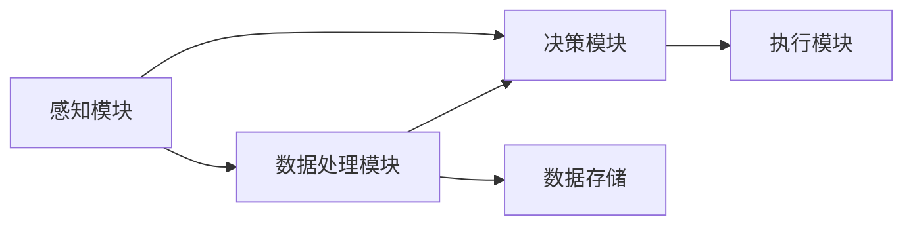

                 

## 1. 背景介绍

随着技术的不断进步，自动驾驶汽车已经不再只是科幻电影中的梦想，而成为了现实。越来越多的公司开始涉足自动驾驶领域，包括传统的汽车制造商、科技公司以及初创企业。然而，尽管自动驾驶技术取得了诸多突破，但在实际应用中，仍面临许多技术和伦理难题，业内对自动驾驶的前景也存在不同的观点。

### 1.1 自动驾驶技术现状

自动驾驶技术大致可以分为五个级别：L0到L5。L0指的是人类驾驶员完全控制车辆，L5则表示完全无人驾驶。目前，大多数汽车制造商和科技公司开发的自动驾驶技术处于L3级别，即有条件自动驾驶。在L3级别下，系统可以在特定条件下控制车辆，但驾驶员仍需准备接管。部分科技公司已经公开展示了L4级别的自动驾驶技术，如Waymo，但这些技术尚未大规模商用。

### 1.2 自动驾驶技术挑战

尽管自动驾驶技术已经取得了显著进步，但仍面临许多挑战：

- **安全性**：自动驾驶系统在复杂的交通环境中容易出现误判，造成事故。
- **法律法规**：不同国家的法律法规对自动驾驶的接受度和规定不同。
- **基础设施**：道路、交通信号灯等基础设施需要升级以支持自动驾驶。
- **网络安全**：自动驾驶系统可能会成为黑客攻击的目标，造成严重后果。

### 1.3 自动驾驶技术发展现状

目前，特斯拉、Waymo、百度等公司在自动驾驶技术上已经取得了显著进展。特斯拉的自动驾驶技术Autopilot和全自驾驶功能（Full Self-Driving，FSD）已经在部分地区投入使用。Waymo则在全球多地开展自动驾驶出租车服务。百度也推出了Apollo自动驾驶平台，吸引了众多合作伙伴。

## 2. 核心概念与联系

### 2.1 核心概念概述

自动驾驶技术是指通过传感器、摄像头、雷达等设备，结合人工智能算法，使车辆能够自动驾驶。其核心概念包括：

- **感知模块**：负责收集车辆周围环境信息，如传感器、摄像头、雷达等。
- **决策模块**：根据感知模块获取的信息，做出驾驶决策。
- **执行模块**：执行决策模块的命令，控制车辆运动，如转向、加速、刹车等。
- **数据处理模块**：负责数据收集、处理、存储等，确保系统正常运行。

这些模块通过数据流、消息传递等技术进行连接，形成一个完整的自动驾驶系统。

### 2.2 核心概念原理和架构的 Mermaid 流程图



### 2.3 核心概念之间的联系

感知模块获取环境信息，数据处理模块对信息进行预处理，决策模块根据信息做出决策，执行模块执行决策，数据存储模块记录系统运行数据。各模块之间通过数据流和消息传递进行信息共享和控制，形成一个闭环系统。

## 3. 核心算法原理 & 具体操作步骤

### 3.1 算法原理概述

自动驾驶技术依赖于多个算法和系统，包括传感器融合、路径规划、行为预测、决策制定等。其核心算法原理主要包括：

- **传感器融合**：将多个传感器的数据进行融合，提高环境感知的准确性。
- **路径规划**：根据环境信息，规划最优的驾驶路径。
- **行为预测**：预测其他车辆、行人的行为，以做出合理决策。
- **决策制定**：根据路径规划和行为预测结果，制定最优的驾驶策略。

### 3.2 算法步骤详解

自动驾驶系统的开发通常包括以下步骤：

1. **硬件选型和安装**：选择适合的传感器、摄像头、雷达等硬件，并进行安装和调试。
2. **环境感知**：利用传感器、摄像头、雷达等设备，获取环境信息。
3. **数据处理**：对感知数据进行预处理，如滤波、校正、融合等。
4. **路径规划**：根据环境信息，规划最优路径。
5. **行为预测**：预测其他车辆、行人的行为。
6. **决策制定**：根据路径规划和行为预测结果，制定最优驾驶策略。
7. **执行控制**：控制车辆转向、加速、刹车等，执行驾驶策略。

### 3.3 算法优缺点

自动驾驶技术具有以下优点：

- **减少人为失误**：自动驾驶系统可以通过算法避免人为驾驶中的失误，提高行车安全性。
- **提高行车效率**：自动驾驶系统可以优化交通流，减少拥堵，提高行车效率。

但同时，也存在以下缺点：

- **高成本**：自动驾驶系统的硬件和软件成本较高。
- **技术不成熟**：自动驾驶技术尚未完全成熟，存在安全隐患。
- **法律法规不完善**：不同国家和地区的法律法规对自动驾驶接受度和规定不同。

### 3.4 算法应用领域

自动驾驶技术的应用领域非常广泛，主要包括以下几个方面：

- **城市交通**：自动驾驶出租车、公交车、物流车等。
- **物流运输**：自动驾驶配送车、货运车等。
- **个人出行**：自动驾驶私家车、共享汽车等。

## 4. 数学模型和公式 & 详细讲解 & 举例说明

### 4.1 数学模型构建

自动驾驶技术中的数学模型主要包括以下几个方面：

- **车辆运动模型**：描述车辆在道路上的运动状态。
- **路径规划模型**：根据环境信息，规划最优路径。
- **行为预测模型**：预测其他车辆、行人的行为。
- **决策制定模型**：根据路径规划和行为预测结果，制定最优驾驶策略。

### 4.2 公式推导过程

以路径规划为例，假设车辆在二维平面上的位置为 $(x,y)$，速度为 $(v_x,v_y)$，道路边界为 $(x_{min},x_{max},y_{min},y_{max})$，则路径规划的数学模型为：

$$
\begin{aligned}
    x_{next} &= x + v_x\Delta t \\
    y_{next} &= y + v_y\Delta t \\
    v_x &= \begin{cases}
        v_x + a_x & \text{if } v_x < v_{max} \\
        v_{max} & \text{otherwise}
    \end{cases} \\
    v_y &= \begin{cases}
        v_y + a_y & \text{if } v_y < v_{max} \\
        v_{max} & \text{otherwise}
    \end{cases}
\end{aligned}
$$

其中，$\Delta t$ 为时间步长，$a_x$ 和 $a_y$ 分别为横纵轴加速度。

### 4.3 案例分析与讲解

以特斯拉的Autopilot系统为例，其路径规划算法主要基于规则和预测两种方式：

1. **规则方式**：按照一定的规则规划路径，如保持车距、跟随前车等。
2. **预测方式**：通过传感器和摄像头预测其他车辆、行人的行为，规划最优路径。

## 5. 项目实践：代码实例和详细解释说明

### 5.1 开发环境搭建

自动驾驶系统通常需要高性能的计算机和硬件设备，以下是在Ubuntu系统下搭建开发环境的步骤：

1. 安装ROS（Robot Operating System）：
```
sudo apt-get update
sudo apt-get install ros-kinetic-ros-base ros-kinetic-image-processors ros-kinetic-lidar-laserscan ros-kinetic-carla-ros-kinetic
```

2. 安装Gazebo：
```
sudo apt-get install ros-kinetic-gazebo-ros-kinetic
```

3. 安装Turtlebot3：
```
sudo apt-get install ros-kinetic-turtlebot-gazebo-kinetic
```

4. 安装TensorFlow：
```
sudo apt-get install tensorflow python-tensorflow
```

### 5.2 源代码详细实现

以下是一个简单的路径规划算法代码实现：

```python
import tensorflow as tf

def path_planning(x, y, v_x, v_y, a_x, a_y, t, max_speed):
    x_next = x + v_x * t
    y_next = y + v_y * t
    v_x = v_x + a_x * t
    v_y = v_y + a_y * t

    # 检查速度限制
    if v_x > max_speed:
        v_x = max_speed
    if v_y > max_speed:
        v_y = max_speed

    return x_next, y_next, v_x, v_y
```

### 5.3 代码解读与分析

上述代码实现了车辆在二维平面上的路径规划算法，主要通过时间步长 $t$、当前位置 $(x,y)$、速度 $(v_x,v_y)$ 和加速度 $(a_x,a_y)$ 来计算下一个位置和速度。

## 6. 实际应用场景

### 6.1 自动驾驶出租车

自动驾驶出租车已经在一些城市进行试点，并取得了不错的效果。例如，Waymo在美国凤凰城和加州等地推出了自动驾驶出租车服务，乘客可以通过手机App预约乘车。自动驾驶出租车能够提供全天候、无缝的出行服务，大大提高了交通效率。

### 6.2 物流运输

自动驾驶配送车和货运车在物流领域也有广泛应用。例如，UPS在美国弗吉尼亚州设立了自动驾驶配送中心，使用自动驾驶卡车进行包裹配送。自动驾驶物流车能够提高配送效率，减少交通事故，降低物流成本。

### 6.3 个人出行

特斯拉的Autopilot系统和全自驾驶功能（FSD）已经在部分地区投入使用，部分车主已经体验到了自动驾驶带来的便利。自动驾驶私家车能够提供更加安全、舒适的驾驶体验，减少驾驶疲劳。

### 6.4 未来应用展望

未来，自动驾驶技术将在更多领域得到应用，为人类生产和生活带来变革：

1. **自动驾驶公交车**：自动驾驶公交车能够提供准时、安全的公共交通服务，缓解城市交通压力。
2. **自动驾驶船只**：自动驾驶船只在港口和海洋运输中具有广泛应用前景。
3. **自动驾驶无人机**：自动驾驶无人机能够在农业、救援、物流等领域发挥重要作用。

## 7. 工具和资源推荐

### 7.1 学习资源推荐

- **ROS官方文档**：ROS是一个开源的机器人操作系统，提供了详细的开发和调试指南。
- **TensorFlow官方文档**：TensorFlow是深度学习框架，提供了丰富的学习资源和样例代码。
- **自动驾驶博客**：如“自动驾驶100天”，提供了丰富的学习资源和实践经验。

### 7.2 开发工具推荐

- **ROS**：ROS是机器人操作系统，提供了丰富的工具和库，方便自动驾驶系统开发。
- **Gazebo**：Gazebo是一个模拟环境工具，可以模拟自动驾驶车辆在各种场景中的行驶。
- **Turtlebot3**：Turtlebot3是一个机器人平台，支持自动驾驶系统的硬件安装和调试。

### 7.3 相关论文推荐

- **《自动驾驶技术研究进展与未来趋势》**：这篇文章综述了自动驾驶技术的发展历程和未来趋势，是了解自动驾驶技术的绝佳资源。
- **《深度学习在自动驾驶中的应用》**：这篇文章介绍了深度学习在自动驾驶中的应用，包括感知、决策、执行等。

## 8. 总结：未来发展趋势与挑战

### 8.1 研究成果总结

自动驾驶技术在过去几年取得了显著进展，但仍然面临诸多挑战。未来，自动驾驶技术需要在安全性、法律法规、基础设施等方面取得更多突破。

### 8.2 未来发展趋势

未来，自动驾驶技术将在更多领域得到应用，技术也将更加成熟和稳定。自动驾驶技术将从L3逐步发展到L4和L5，全面实现无人驾驶。

### 8.3 面临的挑战

自动驾驶技术仍面临诸多挑战，包括：

- **技术不成熟**：自动驾驶技术尚未完全成熟，存在安全隐患。
- **法律法规不完善**：不同国家和地区的法律法规对自动驾驶接受度和规定不同。
- **基础设施不足**：道路、交通信号灯等基础设施需要升级以支持自动驾驶。

### 8.4 研究展望

未来，自动驾驶技术需要在安全性、法律法规、基础设施等方面取得更多突破。同时，研究如何提高自动驾驶系统的鲁棒性和可解释性，使其更加可信和透明。

## 9. 附录：常见问题与解答

**Q1：自动驾驶系统如何感知环境？**

A: 自动驾驶系统通过多种传感器感知环境，包括激光雷达、摄像头、雷达、GPS等。这些传感器获取的环境信息经过融合，形成统一的环境表示。

**Q2：自动驾驶系统如何规划路径？**

A: 自动驾驶系统通过传感器和摄像头获取环境信息，利用路径规划算法规划最优路径。路径规划算法通常基于规则和预测两种方式，根据环境信息和自身状态做出决策。

**Q3：自动驾驶系统如何做出驾驶决策？**

A: 自动驾驶系统通过感知模块获取环境信息，数据处理模块对信息进行预处理，决策模块根据环境信息和自身状态做出决策。决策模块通常基于规则和预测两种方式，根据环境信息和自身状态做出决策。

**Q4：自动驾驶系统如何执行控制？**

A: 自动驾驶系统通过执行模块控制车辆转向、加速、刹车等，执行驾驶策略。执行模块通常基于规则和预测两种方式，根据决策模块的命令做出响应。

**Q5：自动驾驶系统有哪些应用场景？**

A: 自动驾驶系统在城市交通、物流运输、个人出行等领域具有广泛应用前景。例如，自动驾驶出租车、物流车、配送车、公交车等。

作者：禅与计算机程序设计艺术 / Zen and the Art of Computer Programming

