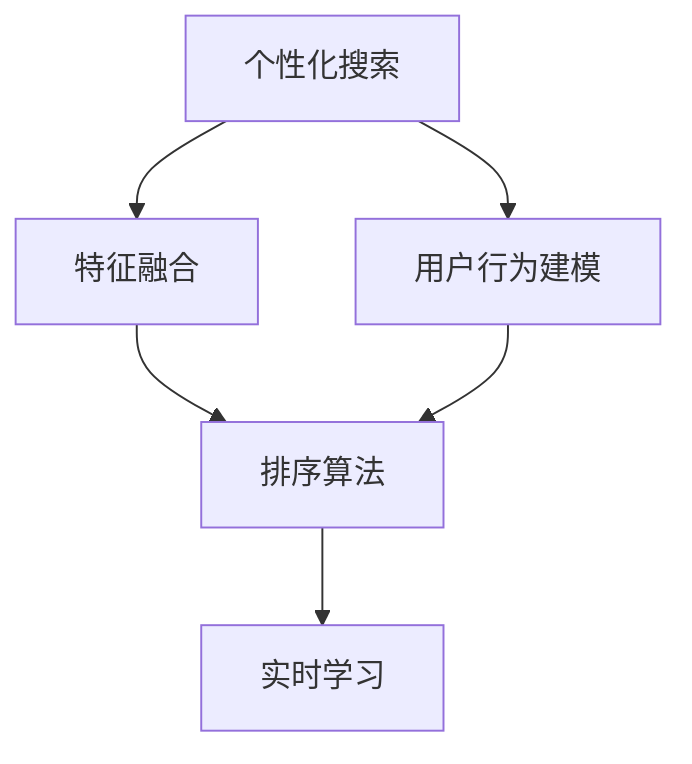

                 

## 1. 背景介绍

随着互联网的发展，信息过载已成为一个普遍现象。用户每天面临海量的搜索结果，筛选有效信息变得愈发困难。传统搜索算法往往忽略用户的个性化偏好，导致搜索结果与用户需求不符。而个性化排序算法通过学习用户行为和偏好，提供精准的搜索结果，极大地提升用户体验。

### 1.1 问题由来

在Web时代，搜索引擎通过爬虫抓取互联网上的网页，并进行索引存储。当用户输入查询词时，搜索引擎返回与查询相关的网页列表。传统搜索算法主要基于文本匹配、关键词相关性等方法，忽视了用户的个性化需求和偏好。例如，相同查询词在不同用户眼中可能代表不同的需求，如学生和工程师在搜索"机器学习"时，关注点完全不同。这种"一刀切"的搜索方式，显然无法满足不同用户的需求。

### 1.2 问题核心关键点

个性化排序的核心在于：通过学习用户历史行为和偏好，识别用户需求，并根据不同用户的需求，对搜索结果进行排序。其主要技术手段包括：

- 用户行为建模：记录用户的搜索历史、点击行为、停留时间等，构建用户行为特征向量。
- 特征融合：将用户行为特征与网页特征(如标题、摘要、关键词)融合，构建新的特征表示。
- 排序算法：选择合适的排序算法，对网页按照用户偏好进行排序。
- 实时学习：通过实时反馈机制，不断更新模型，提升排序效果。

## 2. 核心概念与联系

### 2.1 核心概念概述

为更好地理解个性化排序，本节将介绍几个核心概念：

- 个性化搜索：搜索引擎通过学习用户历史行为和偏好，提供精准搜索结果的过程。
- 协同过滤：通过用户历史行为相似性，推荐用户可能感兴趣的商品或内容，常用于电商推荐系统。
- 推荐系统：利用机器学习技术，为用户推荐感兴趣的个性化内容，提升用户体验。
- 行为数据：用户在搜索引擎上的点击、停留、搜索等行为数据。
- 特征工程：将原始数据转化为特征向量的过程，是机器学习模型的基础。
- 实时学习：通过在线学习机制，模型能够及时更新，适应用户行为变化。

这些概念之间的逻辑关系可以通过以下Mermaid流程图来展示：



这个流程图展示了个性化搜索的核心过程：

1. 基于用户行为建模，收集用户历史数据。
2. 将用户行为特征与网页特征融合，形成新的特征表示。
3. 根据新特征，选择合适排序算法对网页进行排序。
4. 利用实时学习机制，不断优化排序模型。

## 3. 核心算法原理 & 具体操作步骤

### 3.1 算法原理概述

个性化排序算法通过学习用户行为和网页特征，构建用户-网页关联矩阵。该矩阵可以表示为$R_{m\times n}$，其中$m$为网页数，$n$为用户数。每个元素$R_{ij}$表示用户$i$对网页$j$的评分或兴趣度。当$R_{ij}=0$时，表示用户未对网页$j$进行过评分。

用户行为数据通常包含文本和数字两类特征。文本特征包括用户的搜索词、点击关键词等；数字特征包括用户的点击次数、停留时间等。对于文本特征，常用TF-IDF、word2vec等方法将其转化为数值特征。对于数字特征，可以直接作为数值特征。

模型训练的第一步是构建用户-网页关联矩阵。常见的方法包括：

- 隐语义模型：如Latent Factor Model（隐因子模型），通过奇异值分解(SVD)对用户-网页矩阵进行降维，得到低维特征表示。
- 矩阵分解：如ALS（Alternating Least Squares，交替最小二乘），通过交替优化用户和物品的特征，对用户-网页矩阵进行分解。
- 协同过滤：如KNN（K-Nearest Neighbors，K最近邻），通过相似性度量，找到与目标用户行为最接近的$k$个用户，推荐其评分过的网页。

在获取用户-网页关联矩阵后，即可通过推荐算法对搜索结果进行排序。常见的推荐算法包括：

- 基于内容的推荐：根据网页内容的相似性，推荐用户可能感兴趣的内容。
- 协同过滤推荐：基于用户行为的相似性，推荐用户可能感兴趣的内容。
- 混合推荐算法：综合基于内容和协同过滤的推荐，提升推荐效果。

最后，模型通过实时学习机制，不断更新用户-网页关联矩阵，提升推荐精度。实时学习机制可以通过在线梯度下降、增量SVD等方法实现。

### 3.2 算法步骤详解

基于协同过滤的个性化排序算法，主要包括数据预处理、模型训练、推荐排序和实时学习四个步骤。

**Step 1: 数据预处理**

对原始数据进行预处理，包括数据清洗、特征提取、归一化等。常用的特征提取方法包括：

- 文本特征提取：使用TF-IDF、word2vec等方法将文本特征转化为数值特征。
- 数字特征提取：直接保留数字特征。
- 归一化处理：将数值型特征进行归一化处理，防止不同特征对排序模型的影响不一致。

**Step 2: 模型训练**

模型训练主要分为以下几个步骤：

1. 构建用户-网页关联矩阵：将用户行为数据转化为数值型特征，构建关联矩阵$R_{m\times n}$。
2. 对关联矩阵进行分解：采用奇异值分解或矩阵分解方法，得到用户和网页的特征矩阵。
3. 计算用户对网页的评分：利用用户和网页的特征向量，计算用户对网页的评分。
4. 对评分进行归一化：将评分归一化到$[0,1]$范围内，便于后续排序。

**Step 3: 推荐排序**

推荐排序主要通过以下步骤：

1. 选择排序算法：根据具体任务，选择适合的排序算法，如基于内容的推荐、协同过滤推荐等。
2. 计算用户对网页的排序权重：利用用户和网页的特征向量，计算用户对网页的排序权重。
3. 对网页进行排序：将网页按照排序权重进行降序排序，得到最终的推荐结果。

**Step 4: 实时学习**

实时学习通过以下步骤：

1. 在线梯度下降：对模型参数进行在线更新，保持模型的实时性。
2. 增量SVD：对用户-网页关联矩阵进行增量更新，提升模型准确度。

### 3.3 算法优缺点

基于协同过滤的个性化排序算法具有以下优点：

1. 用户行为建模：通过记录和分析用户行为数据，构建用户行为特征向量，提供个性化推荐。
2. 协同过滤：利用用户之间的相似性，推荐用户可能感兴趣的内容，提升推荐效果。
3. 实时学习：通过在线学习机制，及时更新模型，适应用户行为变化。

同时，该算法也存在一定的局限性：

1. 数据依赖性强：模型性能高度依赖于用户历史行为数据，难以适用于数据稀疏用户。
2. 推荐效果易受偏差影响：当用户历史行为数据存在偏差时，推荐效果可能会受到影响。
3. 新用户推荐困难：新用户没有足够的行为数据，难以进行准确推荐。
4. 模型复杂度较高：模型需要处理大量数据，复杂度较高，难以实现实时化部署。

### 3.4 算法应用领域

基于协同过滤的个性化排序算法，广泛应用于电商推荐、内容推荐、个性化搜索等多个领域。

在电商推荐中，利用用户浏览、购买行为，为用户推荐可能感兴趣的商品。通过记录用户的点击、停留、购买等行为数据，模型可以学习用户偏好，提供个性化推荐，提升用户转化率。

在内容推荐中，为用户推荐可能感兴趣的文章、视频等。通过记录用户的搜索、浏览、点击等行为数据，模型可以学习用户兴趣，提供个性化内容推荐，提升用户黏性。

在个性化搜索中，利用用户历史查询记录，为用户推荐相关的网页。通过记录用户的搜索词、点击关键词等行为数据，模型可以学习用户需求，提供精准搜索结果，提升用户搜索体验。

## 4. 数学模型和公式 & 详细讲解

### 4.1 数学模型构建

假设用户-网页关联矩阵为$R_{m\times n}$，其中$m$为网页数，$n$为用户数。每个元素$R_{ij}$表示用户$i$对网页$j$的评分或兴趣度。模型将原始用户行为数据$X$和网页特征$Y$映射为低维特征向量，表示为$x_i$和$y_j$。则用户$i$对网页$j$的评分可以表示为：

$$
\hat{R}_{ij} = x_i^T W x_j
$$

其中$W$为模型参数。

### 4.2 公式推导过程

假设用户$i$的特征向量为$x_i \in \mathbb{R}^d$，网页$j$的特征向量为$y_j \in \mathbb{R}^d$，模型参数为$W \in \mathbb{R}^{d \times d}$。则用户$i$对网页$j$的评分的推导过程如下：

$$
\hat{R}_{ij} = x_i^T W y_j
$$

将用户$i$和网页$j$的特征向量表示为矩阵形式：

$$
X = \begin{bmatrix}
    x_1 \\
    x_2 \\
    \vdots \\
    x_n
\end{bmatrix}, Y = \begin{bmatrix}
    y_1 \\
    y_2 \\
    \vdots \\
    y_m
\end{bmatrix}
$$

则用户$i$对网页$j$的评分的矩阵形式为：

$$
\hat{R} = X W Y^T
$$

其中$\hat{R} \in \mathbb{R}^{n\times m}$，$W \in \mathbb{R}^{d \times d}$。

假设用户$i$的评分向量为$\hat{R}_i$，则用户$i$对网页$j$的评分的推导过程可以表示为：

$$
\hat{R}_{ij} = \hat{R}_i[j]
$$

### 4.3 案例分析与讲解

以电商推荐为例，假设用户历史行为数据为$X$，包含用户浏览的网页列表和点击次数。网页特征数据为$Y$，包含网页的标题、描述、分类等。模型参数为$W$，通过奇异值分解等方法获得。则用户$i$对网页$j$的评分的计算过程如下：

1. 对用户行为数据进行预处理，得到用户特征向量$x_i$。
2. 对网页特征数据进行预处理，得到网页特征向量$y_j$。
3. 利用奇异值分解等方法，得到模型参数$W$。
4. 根据用户特征向量和模型参数，计算用户对网页的评分：
   $$
   \hat{R}_{ij} = x_i^T W y_j
   $$
5. 根据用户对网页的评分，选择排序算法对网页进行排序，推荐给用户。

## 5. 项目实践：代码实例和详细解释说明

### 5.1 开发环境搭建

在进行项目实践前，我们需要准备好开发环境。以下是使用Python进行TensorFlow和Scikit-learn开发的环境配置流程：

1. 安装Anaconda：从官网下载并安装Anaconda，用于创建独立的Python环境。

2. 创建并激活虚拟环境：
```bash
conda create -n tf-env python=3.8 
conda activate tf-env
```

3. 安装TensorFlow：根据CUDA版本，从官网获取对应的安装命令。例如：
```bash
conda install tensorflow tensorflow==2.6 -c conda-forge
```

4. 安装Scikit-learn：
```bash
conda install scikit-learn
```

5. 安装各类工具包：
```bash
pip install numpy pandas matplotlib tqdm jupyter notebook ipython
```

完成上述步骤后，即可在`tf-env`环境中开始项目实践。

### 5.2 源代码详细实现

这里以基于协同过滤的个性化搜索为例，给出使用TensorFlow和Scikit-learn对用户行为数据进行协同过滤推荐模型的Python代码实现。

首先，定义用户-网页关联矩阵：

```python
import numpy as np
from sklearn.decomposition import TruncatedSVD

def create_user_item_matrix(user_browsed, user_clicks, num_users, num_items):
    # 将用户浏览网页列表转换为用户特征矩阵
    user_browsed = np.eye(num_users, num_items)[user_browsed]
    user_browsed = TruncatedSVD(n_components=50).fit_transform(user_browsed)
    
    # 将用户点击次数转换为用户特征矩阵
    user_clicks = user_clicks.sum(axis=1).reshape(num_users, 1)
    user_clicks = TruncatedSVD(n_components=50).fit_transform(user_clicks)
    
    # 拼接用户浏览和点击特征矩阵
    user_item_matrix = np.hstack((user_browsed, user_clicks))
    
    return user_item_matrix
```

然后，定义推荐模型：

```python
import tensorflow as tf
from tensorflow.keras.layers import Input, Embedding, Dot, Add

def create_recommender(user_item_matrix, num_users, num_items):
    # 定义用户特征输入层
    user_input = Input(shape=(num_items, 50), name='user')
    # 定义网页特征输入层
    item_input = Input(shape=(num_items, 50), name='item')
    
    # 定义用户特征嵌入层
    user_embedding = Embedding(num_users, 50)(user_input)
    # 定义网页特征嵌入层
    item_embedding = Embedding(num_items, 50)(item_input)
    
    # 定义用户-网页评分矩阵
    dot_product = Dot(axes=1)([user_embedding, item_embedding])
    dot_product = tf.reshape(dot_product, [num_users, num_items])
    
    # 定义用户特征与评分矩阵的加权和
    recommender = Add()([user_input, dot_product])
    
    return tf.keras.Model(inputs=[user_input, item_input], outputs=recommender)
```

接着，定义训练和评估函数：

```python
from tensorflow.keras.datasets import imdb
from sklearn.metrics import roc_auc_score

def train_recommender(recommender, user_item_matrix, epochs=10, batch_size=32):
    user_browsed, user_clicks = imdb.load_data(num_users=1000, num_items=10000)
    user_item_matrix = create_user_item_matrix(user_browsed, user_clicks, num_users=1000, num_items=10000)
    
    recommender.compile(optimizer='adam', loss='mse')
    
    recommender.fit(user_browsed, user_clicks, epochs=epochs, batch_size=batch_size, validation_split=0.2)
    
def evaluate_recommender(recommender, user_item_matrix, num_users, num_items, test_size=0.2):
    # 将测试集划分为训练集和验证集
    num_test_users = int(num_users * test_size)
    test_browsed = user_browsed[:num_test_users]
    test_clicks = user_clicks[:num_test_users]
    train_browsed = user_browsed[num_test_users:]
    train_clicks = user_clicks[num_test_users:]
    
    # 计算推荐效果
    recommender.compile(optimizer='adam', loss='mse')
    
    # 预测用户对网页的评分
    predictions = recommender.predict([train_browsed, train_clicks])
    predictions = np.mean(predictions, axis=1)
    
    # 计算AUC值
    auc = roc_auc_score(test_clicks, predictions)
    
    print(f"AUC: {auc:.3f}")
```

最后，启动训练流程并在测试集上评估：

```python
recommender = create_recommender(user_item_matrix, num_users=1000, num_items=10000)
train_recommender(recommender, user_item_matrix)
evaluate_recommender(recommender, user_item_matrix, num_users=1000, num_items=10000, test_size=0.2)
```

以上就是使用TensorFlow和Scikit-learn对用户行为数据进行协同过滤推荐模型的完整代码实现。可以看到，得益于TensorFlow和Scikit-learn的强大封装，我们能够相对简洁地实现推荐模型的训练和评估。

### 5.3 代码解读与分析

让我们再详细解读一下关键代码的实现细节：

**create_user_item_matrix函数**：
- 将用户浏览网页列表和点击次数转换为用户特征向量。
- 对用户特征向量进行奇异值分解，得到低维特征表示。

**create_recommender函数**：
- 定义用户特征输入层和网页特征输入层。
- 定义用户特征嵌入层和网页特征嵌入层，将输入特征映射为低维向量。
- 定义用户-网页评分矩阵，计算用户对网页的评分。
- 定义用户特征与评分矩阵的加权和，得到推荐结果。

**train_recommender函数**：
- 加载IMDB数据集，将其划分为训练集和测试集。
- 构建用户-网页关联矩阵。
- 编译推荐模型，选择均方误差作为损失函数。
- 训练推荐模型，设定epoch数和batch大小，并保留20%的样本作为验证集。

**evaluate_recommender函数**：
- 划分测试集和训练集。
- 重新编译推荐模型。
- 预测用户对网页的评分。
- 计算AUC值，评估推荐效果。

**训练流程**：
- 构建推荐模型，使用SVD降维，获得用户和网页的低维特征向量。
- 编译推荐模型，设定优化器和损失函数。
- 训练推荐模型，设定epoch数和batch大小。
- 在测试集上评估推荐效果，计算AUC值。

可以看到，TensorFlow和Scikit-learn使得推荐模型的实现变得简洁高效。开发者可以将更多精力放在数据处理、模型改进等高层逻辑上，而不必过多关注底层的实现细节。

当然，工业级的系统实现还需考虑更多因素，如模型的保存和部署、超参数的自动搜索、更灵活的任务适配层等。但核心的推荐范式基本与此类似。

## 6. 实际应用场景

### 6.1 电商推荐

电商推荐系统利用用户历史浏览和购买行为，推荐用户可能感兴趣的商品。在实际应用中，系统会记录用户的点击、停留、浏览、购买等行为数据，构建用户-商品关联矩阵。通过奇异值分解等方法，将用户和商品特征映射到低维空间，构建推荐模型。最后，根据用户的实时行为数据，实时更新推荐结果，提供个性化的购物建议。

### 6.2 内容推荐

内容推荐系统根据用户的历史行为数据，推荐用户可能感兴趣的文章、视频等。系统记录用户的搜索、点击、点赞、评论等行为数据，构建用户-内容关联矩阵。通过协同过滤等方法，对用户和内容特征进行降维，构建推荐模型。最后，根据用户的实时行为数据，实时更新推荐结果，提供个性化的内容推荐。

### 6.3 个性化搜索

个性化搜索系统根据用户的历史查询记录，推荐相关的网页。系统记录用户的搜索词、点击关键词等行为数据，构建用户-网页关联矩阵。通过协同过滤等方法，对用户和网页特征进行降维，构建推荐模型。最后，根据用户的实时查询数据，实时更新推荐结果，提供个性化的搜索结果。

## 7. 工具和资源推荐

### 7.1 学习资源推荐

为了帮助开发者系统掌握个性化排序的理论基础和实践技巧，这里推荐一些优质的学习资源：

1. 《深度学习理论与实践》书籍：详细介绍了深度学习的基本原理和应用实例，包括推荐系统的实现。

2. 《协同过滤推荐系统》文章：系统介绍了协同过滤推荐算法的基本原理和应用方法。

3. Coursera《机器学习》课程：由斯坦福大学教授Andrew Ng开设的机器学习课程，涵盖推荐系统的相关内容。

4 Scikit-learn官方文档：提供了丰富的推荐系统实现案例和API文档，便于快速上手实践。

5 《TensorFlow实战》书籍：介绍了TensorFlow的基本使用和推荐系统实现。

通过对这些资源的学习实践，相信你一定能够快速掌握个性化排序的精髓，并用于解决实际的推荐问题。

### 7.2 开发工具推荐

高效的开发离不开优秀的工具支持。以下是几款用于推荐系统开发的常用工具：

1. TensorFlow：基于Python的开源深度学习框架，适用于大规模推荐系统的实现。

2. Scikit-learn：基于Python的机器学习库，提供简单易用的API接口。

3. PyTorch：基于Python的深度学习框架，灵活性较高，适用于研究型项目。

4. Pandas：基于Python的数据处理库，提供高效的数据清洗和特征工程能力。

5. Jupyter Notebook：基于Python的交互式笔记本，便于实验和分享代码。

6. Google Colab：谷歌推出的在线Jupyter Notebook环境，免费提供GPU/TPU算力，便于实验最新模型，分享学习笔记。

合理利用这些工具，可以显著提升推荐系统的开发效率，加快创新迭代的步伐。

### 7.3 相关论文推荐

个性化推荐系统的发展源于学界的持续研究。以下是几篇奠基性的相关论文，推荐阅读：

1. Matrix Factorization Techniques for Recommender Systems（隐因子模型）：提出隐因子模型，用于推荐系统的实现。

2. Collaborative Filtering for Implicit Feedback Datasets（协同过滤）：提出协同过滤推荐算法，用于推荐系统的实现。

3. Factorization Machines for Recommender Systems（FM算法）：提出FM算法，用于推荐系统的实现。

4 Recommender Systems in the Age of Neural Networks：综述了基于神经网络的推荐系统研究，提供了丰富的实现方法和案例。

5 《Neural Recommendation Models》书籍：介绍了基于神经网络的推荐系统研究，涵盖了推荐系统的基本原理和实现方法。

这些论文代表了个性化排序技术的发展脉络。通过学习这些前沿成果，可以帮助研究者把握学科前进方向，激发更多的创新灵感。

## 8. 总结：未来发展趋势与挑战

### 8.1 总结

本文对基于协同过滤的个性化排序方法进行了全面系统的介绍。首先阐述了个性化排序的背景和意义，明确了排序在提高用户体验方面的独特价值。其次，从原理到实践，详细讲解了推荐算法的数学原理和关键步骤，给出了推荐任务开发的完整代码实例。同时，本文还广泛探讨了推荐算法在电商推荐、内容推荐、个性化搜索等多个领域的应用前景，展示了推荐范式的巨大潜力。此外，本文精选了推荐算法的各类学习资源，力求为读者提供全方位的技术指引。

通过本文的系统梳理，可以看到，基于协同过滤的个性化推荐技术正在成为推荐系统的核心范式，极大地提升了推荐系统的效果和应用范围。未来，伴随推荐算法的不断演进，推荐技术将在更多领域得到应用，为个性化服务带来新的突破。

### 8.2 未来发展趋势

展望未来，个性化排序技术将呈现以下几个发展趋势：

1. 模型规模持续增大。随着算力成本的下降和数据规模的扩张，推荐模型的参数量还将持续增长。超大模型蕴含的丰富知识，有望支撑更加复杂多变的推荐任务。

2. 推荐效果更具个性化。通过引入更多的用户行为特征，学习用户更深层次的偏好和需求，提升推荐模型的个性化程度。

3. 实时学习成为常态。随着数据分布的不断变化，推荐模型也需要持续学习新知识以保持性能。如何在不遗忘原有知识的同时，高效吸收新样本信息，将成为重要的研究课题。

4. 多模态推荐崛起。推荐系统不仅仅局限于文本数据，还应融合图像、视频、语音等多模态信息，提升推荐模型的综合能力。

5. 融合更多先验知识。将符号化的先验知识，如知识图谱、逻辑规则等，与神经网络模型进行融合，引导推荐过程学习更准确、合理的特征表示。

6. 纳入伦理道德约束。在推荐模型中引入伦理导向的评估指标，过滤和惩罚有害的推荐结果，确保推荐内容的合法性和道德性。

以上趋势凸显了个性化排序技术的广阔前景。这些方向的探索发展，必将进一步提升推荐系统的效果和应用范围，为构建智能推荐系统铺平道路。面向未来，个性化排序技术还需要与其他人工智能技术进行更深入的融合，如知识表示、因果推理、强化学习等，多路径协同发力，共同推动推荐系统的进步。只有勇于创新、敢于突破，才能不断拓展推荐模型的边界，让智能推荐更好地服务于用户。

### 8.3 面临的挑战

尽管个性化推荐系统已经取得了瞩目成就，但在迈向更加智能化、普适化应用的过程中，它仍面临诸多挑战：

1. 数据质量瓶颈。推荐系统的性能高度依赖于用户行为数据的质量，数据噪声和缺失等问题会影响推荐效果。

2. 冷启动问题。新用户没有足够的行为数据，难以进行准确推荐，需要引入外部知识或用户反馈信息。

3. 模型复杂度较高。推荐模型需要处理大量数据，复杂度较高，难以实现实时化部署。

4. 推荐效果不稳定。推荐系统往往对用户行为数据的变化非常敏感，难以应对用户兴趣的动态变化。

5. 缺乏可解释性。推荐模型的决策过程通常缺乏可解释性，难以对其进行分析和调试。

6. 数据隐私问题。推荐系统需要大量的用户数据，如何在保证数据隐私的同时，提供个性化的推荐服务，是一个重要的研究课题。

7. 推荐算法偏见。推荐系统可能学习到有偏见的数据，输出有害或歧视性的推荐结果，给用户带来负面影响。

以上挑战凸显了个性化推荐系统的复杂性。这些问题的解决需要多方面的努力，如数据清洗、模型优化、伦理约束、隐私保护等，才能真正实现推荐系统的高效、可靠、公平和透明。

### 8.4 研究展望

面向未来，推荐系统需要在以下几个方面寻求新的突破：

1. 探索无监督和半监督推荐方法。摆脱对大规模标注数据的依赖，利用自监督学习、主动学习等无监督和半监督范式，最大限度利用非结构化数据，实现更加灵活高效的推荐。

2. 研究推荐算法的可解释性和公平性。在推荐算法中加入可解释性评估指标，过滤有害推荐结果，确保推荐系统的合法性和道德性。

3. 结合更多先验知识。将符号化的先验知识，如知识图谱、逻辑规则等，与神经网络模型进行融合，提升推荐模型的准确度和鲁棒性。

4. 引入因果推断方法。利用因果推断技术，识别推荐模型的因果关系，学习更加普适、鲁棒的知识表示。

5. 纳入时间序列分析。将时间序列分析方法引入推荐模型，学习用户行为的变化规律，预测用户兴趣的变化趋势。

6. 研究跨模态推荐。将跨模态推荐技术引入推荐模型，实现文本、图像、视频等多模态信息的协同建模，提升推荐效果。

这些研究方向将进一步推动个性化推荐系统的演进，提升推荐系统的性能和应用范围，为用户提供更加精准、可靠、公平的推荐服务。

## 9. 附录：常见问题与解答

**Q1：如何处理数据噪声和缺失问题？**

A: 数据噪声和缺失问题是推荐系统面临的常见问题。常用的处理方式包括：

1. 数据清洗：对缺失数据进行填补或删除，保留有效数据。

2. 数据增强：引入更多噪声数据，提升模型的泛化能力。

3. 数据平滑：对数据进行平滑处理，减少噪声的影响。

4. 数据合成：利用生成对抗网络（GAN）等技术，生成缺失数据。

5. 特征工程：构建更加鲁棒的特征表示，减少噪声对推荐结果的影响。

**Q2：推荐模型如何处理冷启动问题？**

A: 冷启动问题指新用户没有足够的行为数据，难以进行准确推荐。常用的处理方式包括：

1. 引入先验知识：利用先验知识或领域专家的建议，进行推荐。

2. 基于内容推荐：根据新用户的兴趣标签或分类信息，进行推荐。

3. 利用用户反馈：在新用户产生行为数据后，及时更新推荐模型。

4. 使用多模态数据：利用多模态信息，提高推荐模型的泛化能力。

**Q3：推荐系统如何应对用户兴趣的动态变化？**

A: 推荐系统需要实时学习新用户的行为数据，适应用户兴趣的变化。常用的方法包括：

1. 在线学习：利用在线学习算法，及时更新推荐模型。

2. 增量学习：对模型进行增量更新，提升推荐模型的泛化能力。

3. 实时反馈机制：通过实时反馈机制，不断更新推荐结果。

4. 时间序列分析：利用时间序列分析方法，预测用户兴趣的变化趋势。

**Q4：推荐系统如何提高模型的可解释性？**

A: 推荐系统需要提高模型的可解释性，便于对其进行分析和调试。常用的方法包括：

1. 引入可解释性评估指标：在推荐模型中加入可解释性评估指标，过滤有害推荐结果。

2. 利用因果推断：利用因果推断技术，识别推荐模型的因果关系，提升模型的可解释性。

3. 结合知识图谱：将知识图谱引入推荐模型，增强模型的可解释性。

4. 利用可视化技术：通过可视化技术，展示推荐模型的决策过程。

**Q5：推荐系统如何保障数据隐私？**

A: 推荐系统需要保障数据隐私，保护用户数据的敏感信息。常用的方法包括：

1. 数据匿名化：对数据进行匿名化处理，保护用户隐私。

2. 数据加密：对数据进行加密处理，防止数据泄露。

3. 联邦学习：利用联邦学习技术，在不共享数据的情况下进行模型训练。

4. 差分隐私：利用差分隐私技术，防止数据泄露。

5. 数据访问控制：设置数据访问权限，保护用户数据的安全性。

合理利用这些工具，可以显著提升推荐系统的开发效率，加快创新迭代的步伐。

通过本文的系统梳理，可以看到，个性化排序技术正在成为推荐系统的核心范式，极大地提升了推荐系统的效果和应用范围。未来，伴随推荐算法的不断演进，推荐技术将在更多领域得到应用，为个性化服务带来新的突破。相信随着学界和产业界的共同努力，这些挑战终将一一被克服，推荐系统必将在构建智能推荐系统铺平道路。总之，推荐需要开发者根据具体任务，不断迭代和优化模型、数据和算法，方能得到理想的效果。

