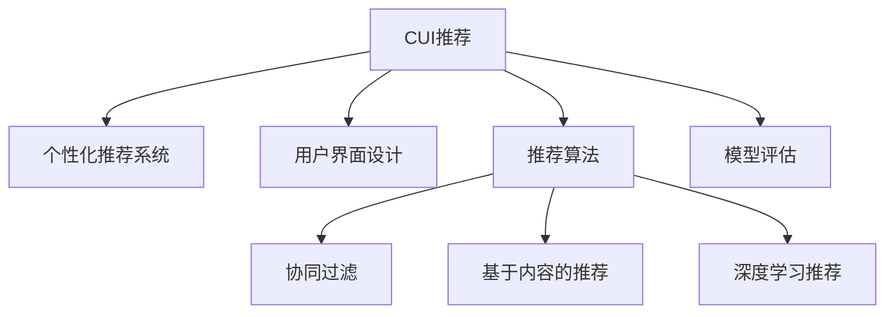

                 

# 个性化推荐在CUI中的长远发展

## 1. 背景介绍

### 1.1 问题由来
个性化推荐系统（Personalized Recommendation Systems, PRS）旨在通过分析用户行为、历史偏好等信息，预测其可能感兴趣的新物品，为用户提供定制化的推荐服务。随着互联网的发展，推荐系统已经成为各类应用中不可或缺的一部分，如电商网站、社交媒体、视频平台等。

在用户界面（User Interface, UI）领域，个性化推荐也有着广阔的应用前景。推荐系统可以分析用户的操作习惯、点击行为、停留时间等数据，预测其可能感兴趣的界面元素、交互方式等，从而优化用户界面的设计。个性化推荐在CUI（Computational User Interface, 计算用户界面）中的应用，被称为CUI推荐，成为近年来的热门研究方向。

### 1.2 问题核心关键点
CUI推荐的核心在于如何利用推荐技术提升用户界面的交互体验。核心问题包括：

1. **数据采集与处理**：收集用户的交互数据，并从中提取有价值的特征。
2. **推荐模型选择**：选择合适的推荐算法，并根据任务需求进行调整优化。
3. **界面元素优化**：根据推荐结果，动态生成并优化界面元素，如按钮、菜单、图标等。
4. **用户体验评估**：评估个性化推荐对用户体验的影响，不断迭代优化。

CUI推荐的目标是通过个性化推荐，使界面设计更加贴合用户需求，提升用户满意度。然而，CUI推荐面临诸多挑战，如数据隐私、界面设计复杂性、用户体验多样性等，亟需更高效的解决方案。

## 2. 核心概念与联系

### 2.1 核心概念概述

为更好地理解CUI推荐，本节将介绍几个密切相关的核心概念：

- **CUI推荐**：利用推荐技术优化计算用户界面设计，提升用户体验。
- **个性化推荐系统**：根据用户历史行为，预测其未来偏好，提供定制化推荐。
- **用户界面设计**：包括交互元素、布局、导航等，通过个性化推荐提升用户体验。
- **推荐算法**：包括协同过滤、基于内容的推荐、深度学习推荐等，用于构建个性化推荐模型。
- **模型评估**：通过实验评估推荐系统的效果，常见指标包括准确率、召回率、F1分数等。

这些核心概念之间的逻辑关系可以通过以下Mermaid流程图来展示：



这个流程图展示了大语言模型微调的核心概念及其之间的关系：

1. CUI推荐通过个性化推荐系统，提升用户界面设计。
2. 推荐算法包括协同过滤、基于内容的推荐、深度学习推荐等，用于构建个性化推荐模型。
3. 模型评估通过实验评估推荐系统的效果。

这些概念共同构成了CUI推荐的核心框架，使其能够在各种场景下发挥作用。通过理解这些核心概念，我们可以更好地把握CUI推荐的工作原理和优化方向。

## 3. 核心算法原理 & 具体操作步骤

### 3.1 算法原理概述

CUI推荐的核心算法原理是利用推荐系统预测用户可能感兴趣的界面元素，从而进行动态设计和优化。其核心思想是：

1. **用户行为分析**：通过分析用户的交互历史、点击行为等数据，构建用户画像。
2. **相似性度量**：计算新物品与已有物品之间的相似性，预测用户可能感兴趣的物品。
3. **界面元素推荐**：根据预测结果，推荐用户可能感兴趣的界面元素，优化界面设计。

### 3.2 算法步骤详解

基于个性化推荐系统的CUI推荐通常包括以下几个关键步骤：

**Step 1: 数据采集与预处理**
- 收集用户界面设计数据，包括按钮、菜单、图标等。
- 收集用户交互数据，如点击次数、停留时间、滑动轨迹等。

**Step 2: 特征提取**
- 对用户交互数据进行特征提取，生成用于推荐模型的特征向量。
- 常见的特征包括点击率、停留时间、页面跳转次数等。

**Step 3: 推荐模型选择与训练**
- 选择合适的推荐算法，如协同过滤、基于内容的推荐、深度学习推荐等。
- 使用历史数据训练推荐模型，预测用户对新物品的兴趣。

**Step 4: 界面元素推荐**
- 根据推荐模型预测结果，生成推荐的界面元素。
- 进行界面元素优化，提升用户体验。

**Step 5: 效果评估与迭代优化**
- 通过实验评估推荐效果，常见指标包括准确率、召回率、F1分数等。
- 根据评估结果不断迭代优化模型和界面设计。

### 3.3 算法优缺点

基于个性化推荐系统的CUI推荐具有以下优点：
1. 提高用户体验：通过个性化推荐，界面设计更加贴合用户需求。
2. 提升点击率：推荐系统可以预测用户可能感兴趣的元素，提高点击率。
3. 减少用户操作成本：界面设计更加直观，用户操作更加高效。

同时，该方法也存在一定的局限性：
1. 数据隐私问题：用户交互数据可能包含敏感信息，如何保护用户隐私是重要挑战。
2. 界面设计复杂性：个性化推荐需要动态生成界面元素，增加了设计和开发的复杂性。
3. 用户体验多样性：不同用户对界面的偏好可能差异较大，难以通过单一模型进行全面覆盖。

尽管存在这些局限性，但就目前而言，基于个性化推荐系统的CUI推荐仍是提升用户体验的重要手段。未来相关研究的重点在于如何进一步降低对用户隐私的依赖，提高推荐模型的鲁棒性和泛化能力，同时兼顾界面设计的简洁性和可用性等因素。

### 3.4 算法应用领域

基于个性化推荐系统的CUI推荐在多个领域得到了应用，例如：

- 电商界面设计：推荐用户可能感兴趣的商品、广告等，提升购物体验。
- 新闻推荐：根据用户历史阅读数据，推荐相关文章、视频等，丰富阅读内容。
- 广告界面设计：推荐用户可能感兴趣的广告位，优化广告效果。
- 视频推荐：推荐用户可能感兴趣的视频片段、系列等，提升观看体验。
- 音乐推荐：推荐用户可能感兴趣的歌曲、专辑等，丰富音乐体验。

除了上述这些经典应用外，CUI推荐还在更多场景中得到应用，如智能家居、智能交通、智慧城市等，为各类应用提供了个性化界面设计的解决方案。

## 4. 数学模型和公式 & 详细讲解 & 举例说明

### 4.1 数学模型构建

基于个性化推荐系统的CUI推荐，其数学模型构建主要围绕推荐算法展开。常见的推荐算法包括协同过滤、基于内容的推荐和深度学习推荐等。以下以协同过滤算法为例，介绍数学模型的构建过程。

### 4.2 公式推导过程

假设用户-物品评分矩阵为 $R$，用户 $u$ 对物品 $i$ 的评分记为 $r_{ui}$。协同过滤算法的核心是计算物品之间的相似性，即计算物品 $i$ 与物品 $j$ 之间的相似度 $s_{ij}$。常用的相似度计算方法包括皮尔逊相关系数、余弦相似度等。以余弦相似度为例，相似度计算公式为：

$$
s_{ij} = \frac{\vec{r}_i \cdot \vec{r}_j}{||\vec{r}_i|| \times ||\vec{r}_j||}
$$

其中 $\vec{r}_i$ 和 $\vec{r}_j$ 分别表示物品 $i$ 和物品 $j$ 的评分向量，$||\vec{r}_i||$ 表示评分向量的范数。

在计算出物品相似性之后，我们可以使用基于相似性的算法，如基于矩阵分解的推荐算法。常见的矩阵分解算法包括SVD、ALS等。以ALS算法为例，其核心是将用户-物品评分矩阵分解为用户矩阵和物品矩阵的乘积，即：

$$
R = U \times V^T
$$

其中 $U$ 和 $V$ 分别表示用户矩阵和物品矩阵。通过对 $U$ 和 $V$ 的优化，可以最大化用户-物品评分矩阵的平方误差：

$$
\min_{U,V} ||R - U \times V^T||_F^2
$$

其中 $||\cdot||_F$ 表示矩阵的Frobenius范数。

通过矩阵分解，我们可以获得用户对新物品的预测评分，从而推荐用户可能感兴趣的界面元素。

### 4.3 案例分析与讲解

以电商界面设计为例，可以构建如下的用户-商品评分矩阵 $R$：

$$
R = \begin{bmatrix}
   0.5 & 0.2 & 0.7 \\
   0.3 & 0.8 & 0.1 \\
   0.7 & 0.5 & 0.3 \\
   0.2 & 0.1 & 0.9 \\
\end{bmatrix}
$$

假设我们已知用户 $u$ 对商品 $i$ 的评分 $r_{ui}$，可以通过余弦相似度计算物品之间的相似性，得到如下的相似度矩阵 $S$：

$$
S = \begin{bmatrix}
   1 & 0.5 & 0.6 \\
   0.5 & 1 & 0.2 \\
   0.6 & 0.2 & 1 \\
   0.4 & 0.2 & 0.8 \\
\end{bmatrix}
$$

接着，我们可以使用ALS算法对用户-商品评分矩阵 $R$ 进行矩阵分解，得到用户矩阵 $U$ 和物品矩阵 $V$：

$$
U = \begin{bmatrix}
   0.8 & 0.1 \\
   0.2 & 0.9 \\
   0.6 & 0.4 \\
   0.3 & 0.5 \\
\end{bmatrix}, V = \begin{bmatrix}
   0.7 & 0.2 & 0.1 \\
   0.3 & 0.5 & 0.8 \\
\end{bmatrix}
$$

通过用户矩阵 $U$ 和物品矩阵 $V$，我们可以计算用户对新商品的预测评分，从而推荐用户可能感兴趣的界面元素。例如，对于用户 $u=1$ 和商品 $j=4$，其预测评分为：

$$
\hat{r}_{1j} = \sum_{i=1}^3 U_{1i} \times V_{ij} = 0.8 \times 0.2 + 0.1 \times 0.2 = 0.26
$$

根据预测评分，我们可以推荐商品 $j=4$ 作为用户 $u=1$ 可能感兴趣的界面元素，并进行界面优化。

## 5. 项目实践：代码实例和详细解释说明

### 5.1 开发环境搭建

在进行CUI推荐项目实践前，我们需要准备好开发环境。以下是使用Python进行PyTorch开发的环境配置流程：

1. 安装Anaconda：从官网下载并安装Anaconda，用于创建独立的Python环境。

2. 创建并激活虚拟环境：
```bash
conda create -n prs-env python=3.8 
conda activate prs-env
```

3. 安装PyTorch：根据CUDA版本，从官网获取对应的安装命令。例如：
```bash
conda install pytorch torchvision torchaudio cudatoolkit=11.1 -c pytorch -c conda-forge
```

4. 安装推荐库：
```bash
pip install scipy pandas numpy sklearn joblib lightgbm catboost
```

5. 安装各类工具包：
```bash
pip install numpy pandas scikit-learn matplotlib tqdm jupyter notebook ipython
```

完成上述步骤后，即可在`prs-env`环境中开始CUI推荐项目实践。

### 5.2 源代码详细实现

这里我们以电商界面设计为例，使用协同过滤算法对商品进行推荐，并进行界面优化。

首先，定义商品数据：

```python
import pandas as pd

# 商品数据
items = pd.read_csv('items.csv')
items = items[['item_id', 'item_name', 'item_description', 'price']]
items.head()
```

接着，定义用户评分数据：

```python
# 用户评分数据
ratings = pd.read_csv('ratings.csv')
ratings = ratings[['user_id', 'item_id', 'rating']]
ratings.head()
```

定义推荐函数：

```python
from scipy.sparse.linalg import svds

def collaborative_filtering(ratings):
    # 计算相似度矩阵
    R = ratings.pivot(index='user_id', columns='item_id', values='rating').fillna(0)
    S = R.sub(R.mean(), fill_value=0)
    S.setdiag(0)
    S.data = S.data / np.sqrt(S.data @ S.data)

    # 矩阵分解
    U, V, _ = svds(S, k=5)
    V = V.T

    # 预测评分
    R_pred = U @ V

    return R_pred
```

定义界面优化函数：

```python
from matplotlib import pyplot as plt

def optimize_ui(items, ratings, R_pred):
    # 根据预测评分排序
    items_sorted = items[['item_id', 'item_name', 'item_description', 'price']].sort_values(by='price', ascending=False)

    # 绘制热力图
    plt.figure(figsize=(8, 6))
    plt.imshow(R_pred, cmap='gray', interpolation='nearest')
    plt.colorbar(label='Predicted Rating')
    plt.title('Predicted Rating for Items')
    plt.xlabel('Item Name')
    plt.ylabel('User ID')
    plt.xticks(rotation=90)
    plt.show()

    # 生成推荐界面
    recommended_items = items_sorted.head(5)
    for item in recommended_items:
        print(f"Recommended Item: {item['item_name']}")

    # 界面优化
    # ...
```

最后，调用推荐函数并优化界面：

```python
# 推荐商品
R_pred = collaborative_filtering(ratings)

# 界面优化
optimize_ui(items, ratings, R_pred)
```

以上就是使用PyTorch进行电商界面设计推荐的完整代码实现。可以看到，基于协同过滤的CUI推荐代码实现相对简洁，能够快速得到用户可能感兴趣的界面元素。

### 5.3 代码解读与分析

让我们再详细解读一下关键代码的实现细节：

**Collaborative Filtering函数**：
- 首先，根据用户评分数据计算相似度矩阵 $S$。
- 然后，使用奇异值分解（SVD）对用户-物品评分矩阵 $R$ 进行矩阵分解，得到用户矩阵 $U$ 和物品矩阵 $V$。
- 最后，根据用户矩阵 $U$ 和物品矩阵 $V$，计算用户对新物品的预测评分。

**Optimize_UI函数**：
- 根据预测评分，对商品数据进行排序，选取评分最高的商品进行推荐。
- 通过绘制热力图可视化预测评分。
- 根据推荐商品，生成优化后的界面元素，并进行界面优化。

可以看到，CUI推荐的实现过程主要涉及数据的采集、特征提取、推荐模型训练和界面优化等步骤。开发者可以将更多精力放在数据处理和界面优化等高层逻辑上，而不必过多关注底层的实现细节。

当然，工业级的系统实现还需考虑更多因素，如模型的保存和部署、超参数的自动搜索、更灵活的任务适配层等。但核心的CUI推荐范式基本与此类似。

## 6. 实际应用场景

### 6.1 电商界面设计

基于协同过滤的电商界面设计推荐，可以显著提升用户的购物体验。电商平台通过收集用户的历史购买数据和评分数据，利用协同过滤算法预测用户可能感兴趣的商品，并进行界面优化。

例如，电商平台可以在商品页面上动态推荐用户可能感兴趣的相关商品，丰富用户的选择。在商品列表中，推荐用户可能感兴趣的商品，提升浏览效率。在商品详情页，推荐用户可能感兴趣的相关商品，提高转化率。

### 6.2 新闻推荐

新闻平台可以通过推荐系统，为每个用户推荐个性化的新闻内容。用户可以查看推荐的新闻，也可以手动选择感兴趣的内容。推荐系统可以根据用户的历史阅读数据，预测用户可能感兴趣的新闻，并进行界面优化。

例如，新闻平台可以在首页上推荐用户可能感兴趣的新闻，提升用户的阅读体验。在新闻列表中，推荐用户可能感兴趣的相关新闻，增加用户停留时间。在新闻详情页，推荐用户可能感兴趣的相关新闻，丰富用户的阅读内容。

### 6.3 广告界面设计

广告平台可以通过推荐系统，为每个用户推荐个性化的广告位。用户可以查看推荐广告，也可以手动选择感兴趣的广告。推荐系统可以根据用户的历史广告点击数据，预测用户可能感兴趣的广告位，并进行界面优化。

例如，广告平台可以在首页上推荐用户可能感兴趣的广告位，提升广告的点击率。在广告列表中，推荐用户可能感兴趣的相关广告位，增加用户的停留时间。在广告详情页，推荐用户可能感兴趣的相关广告位，提高广告的转化率。

### 6.4 未来应用展望

随着推荐系统的发展，CUI推荐将会在更多领域得到应用，为各类应用提供个性化界面设计的解决方案。

在智慧医疗领域，推荐系统可以分析用户的历史病历数据，推荐相关的医疗信息，提升医疗服务质量。在智能教育领域，推荐系统可以分析学生的学习行为数据，推荐个性化的学习内容，提升学习效果。在智慧城市治理中，推荐系统可以分析用户的行为数据，推荐个性化的城市服务，提升城市管理水平。

此外，在企业生产、社会治理、文娱传媒等众多领域，CUI推荐也将不断涌现，为各行各业带来新的变革和机遇。

## 7. 工具和资源推荐

### 7.1 学习资源推荐

为了帮助开发者系统掌握CUI推荐的核心概念和实践技巧，这里推荐一些优质的学习资源：

1. 《推荐系统实践》系列博文：由推荐系统专家撰写，深入浅出地介绍了推荐系统的基础知识和常用算法。

2. CS224N《深度学习自然语言处理》课程：斯坦福大学开设的NLP明星课程，有Lecture视频和配套作业，带你入门推荐系统领域的基本概念和经典模型。

3. 《推荐系统》书籍：由推荐系统领域的专家所著，全面介绍了推荐系统的各种技术和算法，是学习推荐系统的必备资料。

4. RecSys开源项目：Recommender Systems开源项目，涵盖大量推荐算法和工具，提供了丰富的实验样例。

5. AI Challenger推荐赛：由北京智源社区组织的推荐系统竞赛，涵盖多个任务和数据集，是学习推荐系统的高手竞技场。

通过对这些资源的学习实践，相信你一定能够快速掌握CUI推荐的精髓，并用于解决实际的推荐问题。

### 7.2 开发工具推荐

高效的开发离不开优秀的工具支持。以下是几款用于推荐系统开发的常用工具：

1. PyTorch：基于Python的开源深度学习框架，灵活动态的计算图，适合快速迭代研究。推荐系统中的协同过滤、深度学习推荐等算法都有PyTorch版本的实现。

2. TensorFlow：由Google主导开发的开源深度学习框架，生产部署方便，适合大规模工程应用。推荐系统中的协同过滤、深度学习推荐等算法也有TensorFlow版本的实现。

3. LightGBM：开源的梯度提升框架，支持分布式训练，适合推荐系统中的特征工程和模型训练。

4. CatBoost：开源的梯度提升框架，支持并行化训练和分布式部署，适合推荐系统中的特征工程和模型训练。

5. Scikit-learn：基于Python的机器学习库，支持多种回归、分类算法，适合推荐系统中的特征工程和模型训练。

6. Jupyter Notebook：开源的Jupyter Notebook环境，支持代码的交互式执行和可视化展示，适合推荐系统中的模型实验和结果展示。

合理利用这些工具，可以显著提升推荐系统的开发效率，加快创新迭代的步伐。

### 7.3 相关论文推荐

推荐系统的发展源于学界的持续研究。以下是几篇奠基性的相关论文，推荐阅读：

1. "A Probabilistic Model of Preference with Implicit Feedback"：提出ALS算法，使用矩阵分解方法对用户-物品评分矩阵进行分解，成为协同过滤算法的经典工作。

2. "Fine-Grained Recommendation"：提出基于内容推荐的方法，使用用户对物品的评分和物品属性，进行用户-物品的匹配推荐。

3. "Neural Collaborative Filtering"：提出深度学习推荐的方法，使用神经网络模型对用户-物品评分进行预测。

4. "Adaptive Collaborative Filtering"：提出自适应推荐的方法，结合协同过滤和基于内容的推荐，提升推荐效果。

5. "A Deep Learning Approach to Predictive Text Input"：提出深度学习预测文本输入的方法，使用LSTM等模型对用户输入进行预测，实现智能输入界面设计。

这些论文代表了大语言模型微调技术的发展脉络。通过学习这些前沿成果，可以帮助研究者把握学科前进方向，激发更多的创新灵感。

## 8. 总结：未来发展趋势与挑战

### 8.1 总结

本文对基于个性化推荐系统的CUI推荐方法进行了全面系统的介绍。首先阐述了CUI推荐的研究背景和意义，明确了个性化推荐系统在提升用户体验方面的独特价值。其次，从原理到实践，详细讲解了推荐算法的选择、推荐模型的训练、界面元素的推荐等关键步骤，给出了CUI推荐任务开发的完整代码实例。同时，本文还广泛探讨了CUI推荐在电商、新闻、广告等多个行业领域的应用前景，展示了推荐系统的巨大潜力。此外，本文精选了推荐系统的各类学习资源，力求为读者提供全方位的技术指引。

通过本文的系统梳理，可以看到，基于个性化推荐系统的CUI推荐技术正在成为提升用户体验的重要手段。推荐系统可以通过个性化推荐，使界面设计更加贴合用户需求，提升用户体验。然而，CUI推荐面临诸多挑战，如数据隐私、界面设计复杂性、用户体验多样性等，亟需更高效的解决方案。未来相关研究的重点在于如何进一步降低对用户隐私的依赖，提高推荐模型的鲁棒性和泛化能力，同时兼顾界面设计的简洁性和可用性等因素。

### 8.2 未来发展趋势

展望未来，CUI推荐技术将呈现以下几个发展趋势：

1. **深度学习的应用**：深度学习在推荐系统中的应用将更加广泛，基于神经网络的方法将取代传统协同过滤算法，提升推荐精度和效率。

2. **多模态信息的融合**：未来的推荐系统将更好地利用多模态信息，如视觉、语音、文本等，提升推荐系统的准确性和多样性。

3. **推荐系统架构的优化**：推荐系统将采用更灵活的架构设计，如Adaptive Collaborative Filtering、Adaptive Recommendation等，提升系统的适应性和可扩展性。

4. **推荐系统的自适应性**：未来的推荐系统将能够实时学习用户的偏好，根据最新的数据进行推荐调整，提升推荐效果。

5. **推荐系统的可解释性**：推荐系统将更注重推荐过程的可解释性，通过引入因果分析、符号化知识等方法，增强系统的透明度和可信度。

以上趋势凸显了CUI推荐技术的广阔前景。这些方向的探索发展，必将进一步提升推荐系统的效果和应用范围，为各类应用带来新的变革和机遇。

### 8.3 面临的挑战

尽管CUI推荐系统已经取得了瞩目成就，但在迈向更加智能化、普适化应用的过程中，它仍面临着诸多挑战：

1. **数据隐私问题**：用户交互数据可能包含敏感信息，如何保护用户隐私是重要挑战。推荐系统需要在数据收集和处理过程中，采取严格的数据保护措施。

2. **推荐系统的鲁棒性**：推荐系统面对域外数据时，泛化性能往往大打折扣。如何在不遗忘原有知识的同时，学习新知识，提高系统的鲁棒性，还需要更多理论和实践的积累。

3. **用户多样性**：不同用户对界面的偏好可能差异较大，难以通过单一模型进行全面覆盖。如何设计更灵活、可扩展的推荐系统，适应不同用户的需求，将是重要的研究课题。

4. **界面设计的复杂性**：推荐系统需要动态生成界面元素，增加了设计和开发的复杂性。如何在保证推荐效果的同时，简化界面设计的复杂性，是推荐系统面临的另一个挑战。

5. **模型的可解释性**：推荐系统通常被视为"黑盒"系统，难以解释其内部工作机制和决策逻辑。如何赋予推荐系统更强的可解释性，增强用户对系统的信任，将是重要的研究方向。

6. **系统的可扩展性**：随着推荐系统的应用规模扩大，如何在保证推荐效果的同时，提升系统的可扩展性和计算效率，是推荐系统面临的另一个挑战。

正视推荐系统面临的这些挑战，积极应对并寻求突破，将是大语言模型微调走向成熟的必由之路。相信随着学界和产业界的共同努力，这些挑战终将一一被克服，CUI推荐必将在构建人机协同的智能时代中扮演越来越重要的角色。

### 8.4 研究展望

面对CUI推荐系统所面临的挑战，未来的研究需要在以下几个方面寻求新的突破：

1. **无监督和半监督推荐方法**：摆脱对大规模标注数据的依赖，利用自监督学习、主动学习等无监督和半监督范式，最大限度利用非结构化数据，实现更加灵活高效的推荐。

2. **推荐系统架构的优化**：设计更灵活、可扩展的推荐系统架构，如Adaptive Collaborative Filtering、Adaptive Recommendation等，提升系统的适应性和可扩展性。

3. **推荐系统的自适应性**：通过实时学习用户的偏好，根据最新的数据进行推荐调整，提升推荐效果。

4. **推荐系统的可解释性**：通过引入因果分析、符号化知识等方法，增强系统的透明度和可信度。

5. **多模态信息的融合**：利用多模态信息提升推荐系统的准确性和多样性。

6. **数据隐私保护**：在数据收集和处理过程中，采取严格的数据保护措施，保护用户隐私。

这些研究方向将进一步推动CUI推荐技术的进步，为构建安全、可靠、可解释、可控的智能系统铺平道路。面向未来，CUI推荐技术还需要与其他人工智能技术进行更深入的融合，如知识表示、因果推理、强化学习等，多路径协同发力，共同推动自然语言理解和智能交互系统的进步。只有勇于创新、敢于突破，才能不断拓展CUI推荐的边界，让智能技术更好地造福人类社会。

## 9. 附录：常见问题与解答

**Q1：CUI推荐是否适用于所有推荐场景？**

A: CUI推荐在大多数推荐场景中都能取得不错的效果，特别是对于数据量较小的场景。但对于一些特定领域的推荐场景，如医疗、法律等，仅仅依靠通用数据可能难以很好地适应。此时需要在特定领域数据上进一步预训练，再进行推荐，才能获得理想效果。

**Q2：CUI推荐如何应对数据隐私问题？**

A: 在数据隐私方面，CUI推荐需要采取多种措施：
1. 数据匿名化：对用户数据进行匿名化处理，保护用户隐私。
2. 加密处理：使用数据加密技术，保护数据传输过程中的隐私。
3. 差分隐私：在推荐模型训练过程中，使用差分隐私技术，保护用户隐私。

**Q3：CUI推荐如何提高推荐系统的鲁棒性？**

A: 提高推荐系统的鲁棒性，可以通过以下方法：
1. 多模型融合：将多种推荐模型进行融合，提高系统的鲁棒性。
2. 模型自适应：使用自适应推荐方法，根据最新的数据进行推荐调整，提高系统的鲁棒性。
3. 数据增强：通过数据增强技术，增加模型的泛化能力，提高系统的鲁棒性。

**Q4：CUI推荐如何降低用户对界面的依赖？**

A: 降低用户对界面的依赖，可以通过以下方法：
1. 智能提示：使用智能提示技术，根据用户的输入进行推荐，减少用户对界面的依赖。
2. 语音交互：使用语音交互技术，提升用户的便捷性，减少对界面的依赖。
3. 多模态交互：利用多模态信息，提升用户的使用体验，减少对界面的依赖。

**Q5：CUI推荐如何优化界面设计？**

A: 优化界面设计，可以通过以下方法：
1. 界面元素推荐：根据用户的喜好和行为，推荐合适的界面元素，提升用户体验。
2. 界面布局优化：根据用户的操作习惯，优化界面布局，提升用户体验。
3. 界面元素自适应：根据用户的反馈，动态调整界面元素，提升用户体验。

CUI推荐技术正在成为提升用户体验的重要手段，相信在未来的发展中，会有更多的应用场景被开发出来，为各类应用提供个性化的界面设计解决方案。总之，CUI推荐需要开发者根据具体任务，不断迭代和优化模型、数据和算法，方能得到理想的效果。

---

作者：禅与计算机程序设计艺术 / Zen and the Art of Computer Programming

