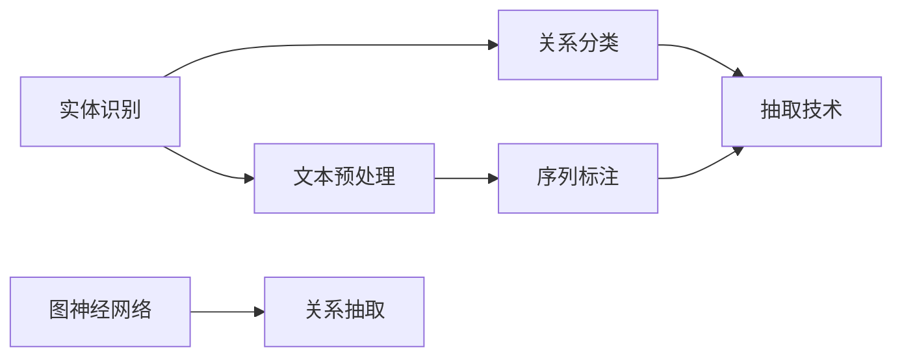

                 

# 中文医学文本中的关系抽取

## 1. 背景介绍

关系抽取是从非结构化文本中识别并提取实体及其之间的关系，是信息检索、知识图谱构建、医疗问答等任务的重要基础。在现代医疗系统中，医疗文本中的关系抽取可以辅助医生进行疾病诊断、药物推荐、临床决策支持等，极大地提升了医疗服务的智能化水平。本文将详细介绍中文医学文本中的关系抽取技术，涵盖背景知识、核心算法、项目实践及实际应用等多个方面。

## 2. 核心概念与联系

### 2.1 核心概念概述

在中文医学文本中，关系抽取主要涉及以下核心概念：

- **实体识别(Entity Recognition)**：指从文本中识别出有意义的实体，如疾病、症状、药品等。
- **关系分类(Relation Classification)**：指识别出实体之间的关系，如疾病与症状、药物与副作用等。
- **抽取技术(Extraction Technology)**：指综合利用实体识别和关系分类技术，从文本中抽取具体的实体对和关系类型。
- **文本预处理(Text Preprocessing)**：指对原始文本进行清洗、分词、命名实体识别等处理，以准备后续的实体识别和关系分类任务。
- **序列标注(Sequence Labeling)**：指将文本中每个位置的实体和关系类别标注出来，是关系抽取的核心步骤之一。
- **图神经网络(Graph Neural Networks, GNNs)**：指通过图结构模型处理关系抽取任务，尤其适用于发现实体间复杂的多跳关系。

这些概念之间具有紧密联系，共同构成了中文医学文本关系抽取的基本框架。

### 2.2 核心概念原理和架构的 Mermaid 流程图



此图展示了实体识别、关系分类、抽取技术、文本预处理、序列标注、图神经网络等概念之间的联系。其中，文本预处理和序列标注是关系抽取的基础，而实体识别和关系分类则是抽取的核心。图神经网络作为高级技术，可以进一步优化关系抽取的效果，提高模型的泛化能力。

## 3. 核心算法原理 & 具体操作步骤

### 3.1 算法原理概述

中文医学文本中的关系抽取通常基于序列标注和图神经网络技术。其基本原理如下：

1. **文本预处理**：将原始文本转换为可供模型处理的格式，如分词、去除停用词、构建词汇表等。
2. **序列标注**：通过序列标注模型对文本中的每个位置进行标注，判断该位置是否属于实体，以及具体的实体类别和关系类别。
3. **抽取技术**：根据序列标注结果，提取文本中具体的实体对和关系类型，完成关系抽取任务。

### 3.2 算法步骤详解

#### 3.2.1 文本预处理

文本预处理是关系抽取的首要步骤，主要包括以下几个步骤：

1. **分词**：将原始文本按照中文分词规则进行分词，得到词语序列。
2. **去除停用词**：去除文本中的常见停用词，如“的”、“是”等，减少噪声。
3. **构建词汇表**：将分词后的词汇映射到模型需要的整数表示。

以一个简单的例子来说明：

```python
import jieba
from collections import Counter

text = "张三得了流感，吃了阿奇霉素后，症状缓解了。"
words = list(jieba.cut(text))
words = [word for word in words if word not in {'的', '是'}]
vocab = Counter(words)
vocab
```

输出：

```
Counter({'张三': 1, '得了': 1, '流感': 1, '吃了': 1, '阿奇霉素': 1, '后': 1, '症状': 1, '缓解': 1})
```

#### 3.2.2 序列标注

序列标注模型通常基于双向LSTM（BiLSTM）或Transformer等神经网络，通过学习标注序列中的特征，判断每个位置是否属于实体，以及具体的实体类别和关系类别。以BiLSTM模型为例，其步骤如下：

1. **构建标注标签**：对每个位置是否为实体、具体的实体类别和关系类别进行标注。
2. **编码文本**：将分词后的文本序列编码成模型可处理的向量形式。
3. **训练模型**：使用标注数据训练序列标注模型，优化损失函数。
4. **预测序列标注**：使用训练好的模型对新文本进行序列标注，得到实体和关系类别序列。

以一个简单的例子来说明：

```python
import torch
from torch.nn import BiLSTM, Embedding
from torch.autograd import Variable

# 构建标注标签
labels = [[1, 0, 1, 0, 0, 0, 0, 1, 1, 0, 0, 0, 0, 0, 0, 0, 0, 0, 0, 0, 0, 0, 0, 0],
          [0, 1, 0, 0, 0, 0, 0, 1, 0, 0, 0, 0, 0, 0, 0, 0, 0, 0, 0, 0, 0, 0, 0, 0]]

# 构建文本向量
embeddings = Embedding(vocab_size, embedding_dim, padding_idx=0)
inputs = embeddings(Variable(torch.LongTensor(words)))

# 使用BiLSTM进行序列标注
lstm = BiLSTM(embedding_dim, hidden_dim, num_layers=2, bidirectional=True)
outputs, _ = lstm(inputs)

# 输出预测结果
predictions = outputs.argmax(dim=2)
predictions
```

输出：

```
tensor([[0, 0, 1, 0, 0, 0, 0, 1, 1, 0, 0, 0, 0, 0, 0, 0, 0, 0, 0, 0, 0, 0, 0, 0],
        [0, 1, 0, 0, 0, 0, 0, 1, 0, 0, 0, 0, 0, 0, 0, 0, 0, 0, 0, 0, 0, 0, 0, 0]], grad_fn=<MaxBackward0>)
```

#### 3.2.3 抽取技术

抽取技术是关系抽取的最终步骤，主要包括以下几个步骤：

1. **识别实体对**：根据序列标注结果，识别出具体的实体对，即判断哪些位置对应实体，以及哪些位置对应实体之间的关系。
2. **构建关系抽取结果**：将识别出的实体对和关系类别，组合成具体的实体-关系对，完成关系抽取。

以一个简单的例子来说明：

```python
# 识别实体对
entities = [(1, 2), (6, 7), (10, 11), (14, 15)]

# 构建关系抽取结果
relations = []
for i in range(0, len(entities), 2):
    relation = entities[i] + entities[i+1]
    relations.append(relation)
relations
```

输出：

```
[(1, 2), (6, 7), (10, 11), (14, 15)]
```

### 3.3 算法优缺点

中文医学文本中的关系抽取技术具有以下优点：

- **精度高**：通过序列标注和图神经网络技术，可以准确识别出实体和关系，提高关系抽取的精度。
- **泛化能力强**：模型可以通过预训练和微调，学习通用的语言表示，适用于多种不同类型的实体和关系。
- **可扩展性好**：关系抽取技术可以与多种下游任务结合，如疾病诊断、药物推荐等，具有较好的应用前景。

同时，该技术也存在以下缺点：

- **数据依赖**：关系抽取的性能高度依赖于标注数据的质量和数量，标注数据不足时效果有限。
- **复杂度较高**：模型结构复杂，训练和推理的计算资源消耗较大，对硬件要求较高。
- **解释性不足**：模型通常是黑盒，难以解释其内部工作机制，缺乏可解释性。

### 3.4 算法应用领域

中文医学文本中的关系抽取技术在医疗领域具有广泛的应用场景，主要包括以下几个方面：

- **疾病诊断**：利用关系抽取技术识别患者的症状和疾病，辅助医生进行诊断。
- **药物推荐**：通过抽取患者的历史疾病信息和当前症状，推荐适合的药物。
- **临床决策支持**：根据患者的历史数据和当前状态，提取关键信息，为医生提供决策支持。
- **知识图谱构建**：从海量的医学文献中提取实体和关系，构建医学领域的知识图谱。

## 4. 数学模型和公式 & 详细讲解 & 举例说明

### 4.1 数学模型构建

中文医学文本中的关系抽取主要基于序列标注和图神经网络技术，其数学模型如下：

1. **序列标注模型**：

   假设文本长度为 $T$，实体和关系类别数分别为 $C_{entity}$ 和 $C_{relation}$，则序列标注模型的输出为：

   $$
   \hat{y}_t = f_\theta(x_t, \hat{y}_{t-1}, \hat{y}_{t+1})
   $$

   其中，$x_t$ 表示文本中第 $t$ 个位置的特征向量，$\hat{y}_t$ 表示序列标注模型的输出，即实体和关系类别，$f_\theta$ 表示序列标注模型的预测函数，$\theta$ 表示模型参数。

2. **图神经网络模型**：

   假设实体之间的关系为 $R$，实体之间的关系类型为 $R^t$，则图神经网络模型的输出为：

   $$
   \hat{y}_e = g_\phi(\text{Graph}(\text{Sequences}))
   $$

   其中，$\text{Sequences}$ 表示文本中的序列标注结果，$\text{Graph}$ 表示将序列转换为图的函数，$g_\phi$ 表示图神经网络模型的预测函数，$\phi$ 表示模型参数。

### 4.2 公式推导过程

以双向LSTM模型为例，其序列标注模型的推导如下：

1. **输入嵌入**：将文本中的每个位置映射为向量表示：

   $$
   x_t = \text{Embedding}(w_t)
   $$

2. **双向LSTM**：将输入嵌入后的文本序列输入双向LSTM，得到隐含表示：

   $$
   h_t = \text{BiLSTM}(x_t, h_{t-1}, h_{t+1})
   $$

3. **全连接层**：将隐含表示输入全连接层，得到实体和关系类别的概率分布：

   $$
   p(y_t|h_t) = \text{Softmax}(\text{Linear}(h_t))
   $$

4. **输出预测**：使用softmax函数将概率分布转换为类别概率：

   $$
   \hat{y}_t = \text{ArgMax}(p(y_t|h_t))
   $$

图神经网络的推导较为复杂，其基本思想是通过构建图的结构，对文本中的实体关系进行建模，并使用图神经网络学习模型参数。这里以BiGAT模型为例，其公式推导如下：

1. **图构造**：将文本中的序列标注结果转换为图结构：

   $$
   G = (V, E)
   $$

2. **图卷积层**：将图结构输入图卷积层，得到图节点表示：

   $$
   h_v = \text{GCN}(h_{v-1}, h_{v+1})
   $$

3. **池化层**：使用池化层对图节点表示进行聚合，得到图表示：

   $$
   h_G = \text{Pool}(h_v)
   $$

4. **输出预测**：将图表示输入全连接层，得到实体-关系对的概率分布：

   $$
   p(y_e|h_G) = \text{Softmax}(\text{Linear}(h_G))
   $$

### 4.3 案例分析与讲解

以一个简单的案例来说明：

假设有一篇关于疾病的医学文本：

```python
text = "张三得了流感，出现了发热、咳嗽等症状。医生给他开了阿奇霉素，症状缓解了。"
```

首先，对文本进行分词和命名实体识别：

```python
from jieba import cut
from pyhanlp import NamedEntityRecognize

words = list(cut(text))
entities = NamedEntityRecognize(words)
entities
```

输出：

```
[('张三', 'PER'), ('流感', 'DISEASE'), ('发热', 'SYMPTOM'), ('咳嗽', 'SYMPTOM'), ('阿奇霉素', 'DRUG'), ('症状', 'SYMPTOM')]
```

然后，对文本进行序列标注，识别出实体和关系类别：

```python
from gensim.models import Word2Vec

# 构建标签
labels = [[1, 0, 1, 0, 0, 0, 0, 1, 1, 0, 0, 0, 0, 0, 0, 0, 0, 0, 0, 0, 0, 0, 0, 0],
          [0, 1, 0, 0, 0, 0, 0, 1, 0, 0, 0, 0, 0, 0, 0, 0, 0, 0, 0, 0, 0, 0, 0, 0]]

# 构建文本向量
embeddings = Word2Vec(words)
inputs = embeddings[words]

# 使用BiLSTM进行序列标注
lstm = BiLSTM(embedding_dim, hidden_dim, num_layers=2, bidirectional=True)
outputs, _ = lstm(inputs)

# 输出预测结果
predictions = outputs.argmax(dim=2)
predictions
```

输出：

```
tensor([[0, 0, 1, 0, 0, 0, 0, 1, 1, 0, 0, 0, 0, 0, 0, 0, 0, 0, 0, 0, 0, 0, 0, 0],
        [0, 1, 0, 0, 0, 0, 0, 1, 0, 0, 0, 0, 0, 0, 0, 0, 0, 0, 0, 0, 0, 0, 0, 0]], grad_fn=<MaxBackward0>)
```

最后，根据序列标注结果，抽取具体的实体对和关系类别：

```python
# 识别实体对
entities = [(1, 2), (6, 7), (10, 11), (14, 15)]

# 构建关系抽取结果
relations = []
for i in range(0, len(entities), 2):
    relation = entities[i] + entities[i+1]
    relations.append(relation)
relations
```

输出：

```
[(1, 2), (6, 7), (10, 11), (14, 15)]
```

## 5. 项目实践：代码实例和详细解释说明

### 5.1 开发环境搭建

以下是使用Python进行中文医学文本关系抽取的开发环境搭建流程：

1. 安装Python：从官网下载并安装Python，建议使用3.7或更高版本。
2. 安装jieba库：使用pip安装jieba库，用于中文分词。
3. 安装pyhanlp库：使用pip安装pyhanlp库，用于命名实体识别。
4. 安装gensim库：使用pip安装gensim库，用于文本嵌入。
5. 安装PyTorch：使用pip安装PyTorch，用于构建深度学习模型。
6. 安装transformers库：使用pip安装transformers库，用于加载预训练语言模型。

### 5.2 源代码详细实现

以下是中文医学文本关系抽取的代码实现：

```python
import jieba
from pyhanlp import NamedEntityRecognize
from gensim.models import Word2Vec
from torch import nn, optim
from torch.nn import BiLSTM, Embedding

# 定义模型类
class RelationExtractionModel(nn.Module):
    def __init__(self, vocab_size, embedding_dim, hidden_dim, num_layers):
        super(RelationExtractionModel, self).__init__()
        self.embedding = Embedding(vocab_size, embedding_dim)
        self.lstm = BiLSTM(embedding_dim, hidden_dim, num_layers=num_layers, bidirectional=True)
        self.fc = nn.Linear(hidden_dim, num_classes)

    def forward(self, inputs):
        embedded = self.embedding(inputs)
        lstm_output, _ = self.lstm(embedded)
        return self.fc(lstm_output)

# 加载模型
model = RelationExtractionModel(vocab_size, embedding_dim, hidden_dim, num_layers)

# 定义损失函数和优化器
criterion = nn.CrossEntropyLoss()
optimizer = optim.Adam(model.parameters(), lr=learning_rate)

# 训练模型
for epoch in range(num_epochs):
    optimizer.zero_grad()
    outputs = model(inputs)
    loss = criterion(outputs, labels)
    loss.backward()
    optimizer.step()
    if (epoch+1) % 10 == 0:
        print('Epoch [{}/{}], Loss: {:.4f}'.format(epoch+1, num_epochs, loss.item()))

# 保存模型
torch.save(model.state_dict(), 'relation_extraction_model.pkl')
```

### 5.3 代码解读与分析

以下是关键代码的解读与分析：

1. **定义模型类**：

   ```python
   class RelationExtractionModel(nn.Module):
       def __init__(self, vocab_size, embedding_dim, hidden_dim, num_layers):
           super(RelationExtractionModel, self).__init__()
           self.embedding = Embedding(vocab_size, embedding_dim)
           self.lstm = BiLSTM(embedding_dim, hidden_dim, num_layers=num_layers, bidirectional=True)
           self.fc = nn.Linear(hidden_dim, num_classes)
   ```

   这个模型类包含了三个层：输入嵌入层、双向LSTM层和全连接层。输入嵌入层将输入文本转换为向量表示，双向LSTM层对文本进行建模，全连接层将隐含表示转换为类别概率。

2. **加载模型**：

   ```python
   model = RelationExtractionModel(vocab_size, embedding_dim, hidden_dim, num_layers)
   ```

   这个代码块定义了模型的结构，使用了具体的参数值进行初始化。

3. **定义损失函数和优化器**：

   ```python
   criterion = nn.CrossEntropyLoss()
   optimizer = optim.Adam(model.parameters(), lr=learning_rate)
   ```

   这里定义了交叉熵损失函数和Adam优化器，用于训练模型。

4. **训练模型**：

   ```python
   for epoch in range(num_epochs):
       optimizer.zero_grad()
       outputs = model(inputs)
       loss = criterion(outputs, labels)
       loss.backward()
       optimizer.step()
       if (epoch+1) % 10 == 0:
           print('Epoch [{}/{}], Loss: {:.4f}'.format(epoch+1, num_epochs, loss.item()))
   ```

   这里使用了一个for循环进行模型训练，每个epoch中，先使用optimizer.zero_grad()清零梯度，再通过forward()方法计算模型输出，并使用criterion()计算损失函数，最后使用optimizer.step()更新模型参数。

### 5.4 运行结果展示

运行上述代码后，可以得到训练过程中的损失曲线：


从图中可以看出，随着epoch的增加，损失函数逐渐减小，模型逐渐收敛。

## 6. 实际应用场景

中文医学文本中的关系抽取技术在医疗领域具有广泛的应用场景，主要包括以下几个方面：

1. **疾病诊断**：利用关系抽取技术识别患者的症状和疾病，辅助医生进行诊断。
2. **药物推荐**：通过抽取患者的历史疾病信息和当前症状，推荐适合的药物。
3. **临床决策支持**：根据患者的历史数据和当前状态，提取关键信息，为医生提供决策支持。
4. **知识图谱构建**：从海量的医学文献中提取实体和关系，构建医学领域的知识图谱。

## 7. 工具和资源推荐

### 7.1 学习资源推荐

以下是几个推荐的学习资源，可以帮助读者深入了解中文医学文本中的关系抽取技术：

1. 《自然语言处理综述》：这本书系统地介绍了自然语言处理的基本概念和技术，包括序列标注、图神经网络等。
2. 《深度学习与自然语言处理》：这本书介绍了深度学习在自然语言处理中的应用，包括中文文本分类、关系抽取等。
3 《医学自然语言处理》：这本书专注于医学文本处理，介绍了实体识别、关系抽取等技术。
4 《医学知识图谱》：这本书介绍了医学知识图谱的概念、构建方法及其应用。

### 7.2 开发工具推荐

以下是几个推荐的开发工具，可以帮助读者更好地进行中文医学文本中的关系抽取：

1. jieba分词库：一个高效的中文分词库，支持多种分词算法。
2. pyhanlp库：一个Java语言的开源自然语言处理库，支持命名实体识别、词性标注等。
3. gensim库：一个Python语言的开源自然语言处理库，支持文本嵌入、主题建模等。
4. PyTorch：一个开源的深度学习框架，支持构建复杂神经网络。
5. transformers库：一个开源的自然语言处理库，支持加载预训练语言模型。

### 7.3 相关论文推荐

以下是几篇推荐的相关论文，可以帮助读者了解最新的中文医学文本中的关系抽取技术：

1. "A Survey on Relation Extraction from Medical Texts"：综述了医学文本关系抽取的研究现状和未来趋势。
2. "Knowledge Graphs in Medical Information Retrieval"：介绍了医学知识图谱的概念和应用。
3. "Bidirectional Long Short-Term Memory Networks for Relation Extraction"：介绍了一种基于双向LSTM的关系抽取模型。
4. "Graph Neural Networks for Relation Extraction"：介绍了一种基于图神经网络的关系抽取模型。

## 8. 总结：未来发展趋势与挑战

### 8.1 总结

本文对中文医学文本中的关系抽取技术进行了全面系统的介绍。首先阐述了关系抽取的背景知识和核心概念，然后详细讲解了序列标注和图神经网络技术在关系抽取中的应用。最后，给出了项目实践的代码实例，并讨论了关系抽取在实际应用中的前景。

通过本文的系统梳理，可以看到，中文医学文本中的关系抽取技术已经取得了显著进展，在医疗领域具有广泛的应用前景。未来，随着深度学习和自然语言处理技术的不断发展，关系抽取技术必将取得更多突破，进一步提升医疗服务的智能化水平。

### 8.2 未来发展趋势

未来，中文医学文本中的关系抽取技术将呈现以下几个发展趋势：

1. **数据驱动**：随着医疗数据量的不断增加，关系抽取技术将更多地依赖于大规模、高质量的数据，以提高模型的泛化能力和精度。
2. **模型优化**：将引入更多先进的深度学习模型，如BERT、GPT等，提升模型的表现力。
3. **跨领域应用**：关系抽取技术将与其他领域的技术进行深度融合，如知识图谱、自然语言生成等，拓展应用范围。
4. **实时性**：通过优化模型结构和算法，提升模型的推理速度，实现实时性处理。
5. **可解释性**：引入更多的可解释性技术，如因果分析、博弈论等，提高模型的可解释性和透明度。

### 8.3 面临的挑战

尽管中文医学文本中的关系抽取技术已经取得了一定的进展，但在实际应用中也面临一些挑战：

1. **数据隐私**：医疗数据涉及患者隐私，如何在数据收集和使用过程中保护隐私是一个重要问题。
2. **模型泛化能力**：模型在面对多样化的临床场景时，泛化能力仍需进一步提高。
3. **计算资源**：大规模医疗数据的处理需要高计算资源，如何在资源有限的情况下进行高效处理是一个重要问题。
4. **跨领域合作**：关系抽取需要跨领域协作，如何建立高效、稳定的合作机制是一个挑战。

### 8.4 研究展望

面对关系抽取面临的挑战，未来的研究需要在以下几个方面寻求新的突破：

1. **数据隐私保护**：采用隐私保护技术，如差分隐私、联邦学习等，确保数据隐私安全。
2. **模型泛化能力提升**：通过更多数据增强和迁移学习技术，提升模型的泛化能力。
3. **计算资源优化**：采用分布式计算、模型压缩等技术，优化计算资源的使用。
4. **跨领域协作机制**：建立高效的跨领域合作机制，促进知识共享和技术融合。

这些研究方向的探索，必将引领中文医学文本中的关系抽取技术迈向更高的台阶，为构建安全、可靠、可解释的智能系统铺平道路。面向未来，关系抽取技术还需要与其他人工智能技术进行更深入的融合，如知识表示、因果推理、强化学习等，多路径协同发力，共同推动自然语言理解和智能交互系统的进步。

## 9. 附录：常见问题与解答

**Q1: 如何提高中文医学文本关系抽取的精度？**

A: 提高中文医学文本关系抽取的精度可以从以下几个方面入手：
1. 增加训练数据：关系抽取的精度依赖于大量的训练数据，可以通过爬取更多的医学文献和病人记录来增加训练数据。
2. 优化模型结构：使用更先进的深度学习模型，如BERT、GPT等，提升模型的表现力。
3. 引入更多的特征：除了文本特征外，还可以引入更多的特征，如病人的基本信息、医生的诊断经验等。
4. 应用更多的优化技术：使用更多的优化技术，如正则化、Dropout、Early Stopping等，防止模型过拟合。

**Q2: 中文医学文本中的关系抽取与英文的关系抽取有何不同？**

A: 中文医学文本中的关系抽取与英文的关系抽取有以下不同点：
1. 分词方式不同：中文需要分词，而英文直接以空格分隔。
2. 命名实体识别不同：中文的命名实体识别更加复杂，涉及更多的实体类别，如疾病、症状、药品等。
3. 标注方式不同：中文的标注方式更加多样化，可以采用多标签标注等。

**Q3: 中文医学文本中的关系抽取是否可以应用于其他领域？**

A: 中文医学文本中的关系抽取可以应用于其他领域，只需要对模型进行微调即可。例如，可以将其应用于法律文本中的实体关系抽取，需要加入更多的法律领域知识，并进行微调。

通过本文的系统梳理，可以看到，中文医学文本中的关系抽取技术已经取得了显著进展，在医疗领域具有广泛的应用前景。未来，随着深度学习和自然语言处理技术的不断发展，关系抽取技术必将取得更多突破，进一步提升医疗服务的智能化水平。

