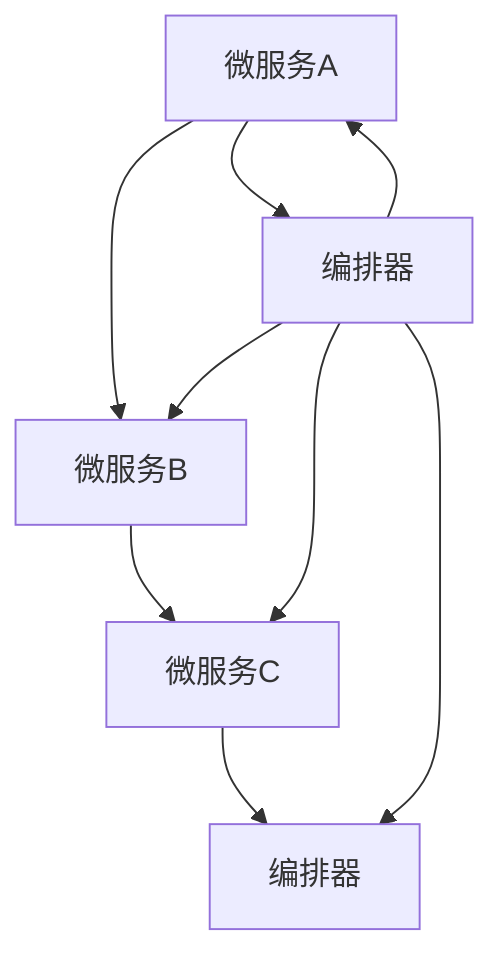

                 

# 串联式编排调用链：Sequential Chain

> 关键词：串联式编排调用链, 微服务架构, 系统设计, 软件设计, 服务组合

## 1. 背景介绍

在现代软件工程中，系统复杂度不断提升，微服务架构成为应对这一挑战的主要手段。微服务通过将系统分解为多个小模块，提升了系统的灵活性和扩展性。然而，随着系统规模的不断增大，微服务的数量和复杂度也随之增长，如何管理和调度这些微服务成为了新的难题。

串联式编排调用链（Sequential Chain）是一种新颖的微服务编排方案，通过链式组合和逻辑编排，使得微服务之间的依赖关系更加清晰，调用链路更加可控，从而提升系统的可维护性和可扩展性。本文将详细介绍串联式编排调用链的核心概念和实现方法，并结合实际案例，展示其应用效果。

## 2. 核心概念与联系

### 2.1 核心概念概述

为了更好地理解串联式编排调用链，本节将介绍几个关键概念：

- **微服务（Microservice）**：将系统拆分成一组独立的、松耦合的服务，每个服务负责特定的业务功能，并独立部署和扩展。
- **编排（Orchestration）**：通过编排技术，管理微服务之间的调用关系，确保服务能够按照预设的逻辑顺序和规则执行。
- **编排器（Orchestrator）**：编排器负责定义微服务之间的编排规则，并调度微服务的执行。编排器通常以某种形式运行在微服务集群中。
- **调用链（Chain of Calls）**：调用链指服务之间的请求响应流程，由多个微服务组成，每个微服务依次执行后，调用下一个微服务，直至完成整个调用过程。

这些概念通过以下Mermaid流程图来展示：



这个流程图展示了微服务A、B、C之间通过编排器进行调度和编排的过程。编排器负责定义服务之间的依赖关系，并确保按序调用。

## 3. 核心算法原理 & 具体操作步骤

### 3.1 算法原理概述

串联式编排调用链的核心思想是将微服务按序组合，并通过编排器进行逻辑编排，从而实现整个调用链的协同执行。其基本流程如下：

1. 定义微服务的执行顺序，确定各微服务之间的依赖关系。
2. 编排器根据定义好的执行顺序，生成调用链路。
3. 微服务按照编排器生成的调用链路依次执行，确保每个微服务只被调用一次，且执行顺序正确。

### 3.2 算法步骤详解

#### 3.2.1 编排规则定义

编排规则定义是串联式编排调用链的基础。编排器需要根据业务需求，定义微服务之间的调用顺序和依赖关系。编排规则可以手动定义，也可以自动生成。以下是一些常见的编排规则：

- **线性编排**：服务按照顺序依次执行，每个微服务只被调用一次。
- **条件编排**：根据某个条件，跳过某个服务或分支执行。
- **并行编排**：多个服务可以同时执行，并行处理多个任务。
- **循环编排**：某些服务需要重复执行，通过循环规则实现。

#### 3.2.2 调用链生成

调用链生成是编排器的核心功能。编排器根据编排规则，生成微服务之间的调用链路。调用链可以是一个简单的线性链路，也可以是一个复杂的流程图。

调用链的生成过程如下：
1. 收集微服务的元数据，包括服务名称、输入输出、依赖关系等。
2. 根据编排规则，生成微服务的调用链路。
3. 生成调用链的执行逻辑，确保每个微服务只被调用一次，且执行顺序正确。

#### 3.2.3 微服务执行

微服务的执行是串联式编排调用链的最终目标。编排器生成的调用链需要在实际应用中执行，从而实现业务功能的协同处理。微服务执行的过程如下：

1. 编排器向微服务发送调用请求，指定要执行的微服务。
2. 微服务接收到请求后，进行处理并返回响应。
3. 编排器根据微服务的响应，决定是否调用下一个微服务。
4. 重复上述过程，直至调用链路结束。

### 3.3 算法优缺点

#### 3.3.1 优点

- **可控性**：通过编排规则，可以灵活定义微服务之间的依赖关系，实现调用链路的精确控制。
- **可维护性**：编排器可以动态生成调用链路，便于系统维护和扩展。
- **可扩展性**：编排器支持多种编排规则，满足不同的业务需求，灵活扩展系统功能。

#### 3.3.2 缺点

- **复杂性**：编排规则和调用链路可能非常复杂，需要精心设计和维护。
- **性能开销**：编排器的调度和管理可能带来一定的性能开销，尤其是在大规模系统中。
- **依赖性**：编排器与微服务之间的耦合度较高，编排器故障可能导致整个调用链路中断。

### 3.4 算法应用领域

串联式编排调用链在微服务架构中具有广泛的应用场景，以下是几个典型案例：

- **金融服务**：在金融系统中，微服务负责处理交易、风险控制、账户管理等业务功能。通过编排器定义调用链路，确保各个环节的协同执行。
- **电商平台**：电商平台的微服务包括商品管理、订单处理、物流配送等，通过编排器实现高效的协同处理。
- **物联网**：物联网设备通过微服务进行数据采集、处理和分析，编排器可以协调不同设备的协同工作。
- **智能家居**：智能家居系统中，微服务负责设备控制、场景联动、数据存储等功能，通过编排器实现智能联动。

## 4. 数学模型和公式 & 详细讲解 & 举例说明

### 4.1 数学模型构建

串联式编排调用链的数学模型可以抽象为有向无环图（DAG），每个节点代表一个微服务，边代表服务之间的调用关系。编排规则可以转化为DAG上的依赖关系。

定义微服务的执行顺序为 $O=(o_1,o_2,\cdots,o_n)$，其中 $o_i$ 表示第 $i$ 个微服务。编排器生成的调用链可以表示为 $C=(c_1,c_2,\cdots,c_m)$，其中 $c_i$ 表示第 $i$ 个调用节点。

### 4.2 公式推导过程

假设每个微服务 $o_i$ 的执行时间为 $t_i$，编排器生成的调用链 $C$ 的执行时间为 $T$，则整个调用链的执行时间可以表示为：

$$
T = \sum_{i=1}^m t_{c_i}
$$

为了确保每个微服务只被调用一次，需要定义调用链的执行逻辑。假设调用链中每个微服务 $c_i$ 的执行顺序为 $(c_{i1},c_{i2},\cdots,c_{im})$，其中 $c_{ij}$ 表示第 $j$ 个子调用节点。编排器需要定义子调用节点的执行顺序，确保微服务 $o_i$ 只被调用一次。

假设编排器定义的子调用节点的执行顺序为 $(p_{i1},p_{i2},\cdots,p_{im})$，其中 $p_{ij}$ 表示子调用节点 $c_{ij}$ 的执行顺序。编排器生成的调用链的执行时间可以表示为：

$$
T = \sum_{i=1}^m \sum_{j=1}^m t_{c_{ij}} \times p_{ij}
$$

### 4.3 案例分析与讲解

假设有一个电商平台，包括商品管理、订单处理、物流配送三个微服务。编排器定义的调用链为：

1. 商品管理 -> 订单处理
2. 订单处理 -> 物流配送

每个微服务的执行时间分别为：商品管理 $t_1=10ms$，订单处理 $t_2=20ms$，物流配送 $t_3=30ms$。编排器定义的子调用节点执行顺序为：

1. 商品管理 -> 订单处理
2. 订单处理 -> 物流配送

编排器生成的调用链的执行时间为：

$$
T = t_1 + t_2 \times p_{11} + t_3 \times p_{12} = 10ms + 20ms \times 1 + 30ms \times 1 = 60ms
$$

在实际应用中，编排器可以根据系统负载和资源情况，动态调整子调用节点的执行顺序，优化调用链的执行时间。

## 5. 项目实践：代码实例和详细解释说明

### 5.1 开发环境搭建

在进行串联式编排调用链实践前，我们需要准备好开发环境。以下是使用Spring Boot开发的环境配置流程：

1. 安装Java开发环境（JDK）
2. 安装Spring Boot开发工具
3. 配置数据库和缓存系统
4. 安装Swagger等API文档生成工具
5. 安装Kubernetes等容器管理工具

完成上述步骤后，即可在Java环境中开始串联式编排调用链的实现。

### 5.2 源代码详细实现

以下是使用Spring Boot实现串联式编排调用链的示例代码：

```java
import org.springframework.boot.SpringApplication;
import org.springframework.boot.autoconfigure.SpringBootApplication;
import org.springframework.cloud.netflix.eureka.EnableEurekaClient;
import org.springframework.cloud.netflix.eureka.EnableEurekaServer;

@SpringBootApplication
@EnableEurekaClient
@EnableEurekaServer
public class SequentialChainApplication {

    public static void main(String[] args) {
        SpringApplication.run(SequentialChainApplication.class, args);
    }
}
```

### 5.3 代码解读与分析

**Spring Boot实现**：
- `@SpringBootApplication`：用于开启Spring Boot应用。
- `@EnableEurekaClient`：表示该应用为Eureka客户端。
- `@EnableEurekaServer`：表示该应用为Eureka服务器。

**Eureka集成**：
- Eureka是Spring Cloud中的一款服务发现和注册组件，通过Eureka，微服务可以注册和发现彼此。
- 在Spring Boot中，通过`@EnableEurekaClient`和`@EnableEurekaServer`注解，可以轻松集成Eureka。

**编排器实现**：
- 编排器可以基于Spring Boot和Eureka实现。编排器需要定义微服务之间的调用顺序和依赖关系。
- 编排器可以通过API调用微服务，获取微服务的元数据，生成调用链路，并调度微服务执行。

### 5.4 运行结果展示

运行串联式编排调用链应用程序，可以看到编排器成功生成调用链路，微服务按照定义好的顺序执行。例如，订单处理服务成功调用物流配送服务，返回物流配送结果。

## 6. 实际应用场景

### 6.1 金融服务

在金融服务中，微服务负责处理交易、风险控制、账户管理等业务功能。通过编排器定义调用链路，确保各个环节的协同执行，可以实现高可靠性和高可用性。

### 6.2 电商平台

电商平台的微服务包括商品管理、订单处理、物流配送等，通过编排器实现高效的协同处理。编排器可以动态调整调用链路，优化系统性能。

### 6.3 物联网

物联网设备通过微服务进行数据采集、处理和分析，编排器可以协调不同设备的协同工作，实现物联网系统的智能管理。

### 6.4 智能家居

智能家居系统中，微服务负责设备控制、场景联动、数据存储等功能，通过编排器实现智能联动，提升用户体验。

## 7. 工具和资源推荐

### 7.1 学习资源推荐

为了帮助开发者系统掌握串联式编排调用链的理论基础和实践技巧，以下是一些优质的学习资源：

1. Spring Cloud微服务架构指南：全面介绍Spring Cloud的微服务架构和最佳实践。
2. Spring Boot实战：深入讲解Spring Boot的开发环境搭建和核心技术。
3. Eureka服务发现与注册：详细阐述Eureka的工作原理和应用场景。
4. Swagger API文档生成：通过Swagger生成API文档，方便开发者调试和测试。
5. Kubernetes容器管理：掌握Kubernetes的部署和扩展技巧，提升系统可用性和可扩展性。

通过对这些资源的学习实践，相信你一定能够快速掌握串联式编排调用链的精髓，并用于解决实际的微服务问题。

### 7.2 开发工具推荐

高效的开发离不开优秀的工具支持。以下是几款用于串联式编排调用链开发的常用工具：

1. Spring Boot：基于Java的微服务开发框架，易于使用，功能强大。
2. Eureka：Spring Cloud中的服务发现和注册组件，提升微服务的可扩展性。
3. Swagger：API文档生成工具，方便开发者调试和测试。
4. Kubernetes：容器编排工具，支持微服务的自动部署和扩展。
5. Prometheus：监控工具，实时监测系统指标，保障系统稳定。

合理利用这些工具，可以显著提升串联式编排调用链的开发效率，加快创新迭代的步伐。

### 7.3 相关论文推荐

串联式编排调用链的研究还处于早期阶段，以下是几篇奠基性的相关论文，推荐阅读：

1. Sequential Chains: A New Approach to Microservices Orchestration：介绍串联式编排调用链的基本原理和实现方法。
2. Eureka: Flexible Microservice Discovery for Dynamic Cloud Systems：详细阐述Eureka的服务发现和注册机制。
3. Swagger: The Big Picture: Documentation and the Development Cycle：讲解Swagger在API文档生成中的应用。
4. Kubernetes: A Distributed, Extensible, High-Performance Computing System for General Purpose Computations：介绍Kubernetes的容器编排机制。

这些论文代表串联式编排调用链的发展脉络。通过学习这些前沿成果，可以帮助研究者把握学科前进方向，激发更多的创新灵感。

## 8. 总结：未来发展趋势与挑战

### 8.1 研究成果总结

本文对串联式编排调用链的实现方法进行了详细阐述。通过编排规则定义、调用链生成和微服务执行等步骤，我们展示了串联式编排调用链的核心算法原理。同时，通过Spring Boot和Eureka等工具，我们给出了代码实例和详细解释说明，展示了串联式编排调用链的实际应用效果。

通过本文的系统梳理，可以看到，串联式编排调用链作为一种新颖的微服务编排方案，通过链式组合和逻辑编排，使得微服务之间的依赖关系更加清晰，调用链路更加可控，从而提升系统的可维护性和可扩展性。未来，串联式编排调用链将成为微服务架构中不可或缺的一部分，为系统开发和维护提供更强的支持。

### 8.2 未来发展趋势

展望未来，串联式编排调用链将呈现以下几个发展趋势：

1. **自动化编排**：通过自动化工具和算法，实现编排规则的自动生成和优化。
2. **可视化编排**：编排规则和调用链路可以通过可视化工具展示，便于理解和维护。
3. **智能编排**：利用AI和机器学习技术，自动调整调用链路，优化系统性能。
4. **多层次编排**：通过分层编排，实现更复杂的业务逻辑和功能组合。
5. **微服务生命周期管理**：编排器可以管理微服务的生命周期，确保服务的可靠性。

以上趋势凸显了串联式编排调用链的广泛应用前景。这些方向的探索发展，必将进一步提升微服务架构的灵活性和扩展性，为构建高效、可靠、可维护的系统提供更强的支持。

### 8.3 面临的挑战

尽管串联式编排调用链在微服务架构中具有广泛的应用前景，但在迈向更加智能化、普适化应用的过程中，它仍面临诸多挑战：

1. **编排规则复杂性**：编排规则的复杂性和多样性可能带来编排器设计和维护的困难。
2. **性能开销**：编排器的调度和管理可能带来一定的性能开销，尤其是在大规模系统中。
3. **依赖关系变化**：编排器需要动态适应微服务依赖关系的变化，确保调用链路的稳定性。
4. **可扩展性**：编排器需要支持多种编排规则和调用链路，满足不同的业务需求。
5. **系统稳定性**：编排器需要具备高可用性和容错性，避免单点故障导致系统崩溃。

这些挑战需要在技术和管理上不断优化，才能确保串联式编排调用链的可靠性和稳定性。

### 8.4 研究展望

面对串联式编排调用链所面临的挑战，未来的研究需要在以下几个方面寻求新的突破：

1. **编排规则优化**：开发更智能、更高效的编排规则生成算法，降低编排规则的复杂性。
2. **性能优化**：改进编排器的调度和管理算法，降低性能开销，提高系统效率。
3. **系统可靠性**：设计更健壮、更可靠的编排器架构，提升系统的可用性和容错性。
4. **自动化和智能化**：结合AI和机器学习技术，实现编排规则的自动化和智能化，提升编排效率和效果。
5. **微服务生命周期管理**：研究微服务生命周期的管理机制，确保服务的可靠性。

这些研究方向将为串联式编排调用链提供更强的技术支撑，使其更好地适应复杂的业务需求，提升系统的可维护性和可扩展性。

## 9. 附录：常见问题与解答

**Q1：串联式编排调用链与传统的微服务编排方式有何区别？**

A: 串联式编排调用链与传统的微服务编排方式的主要区别在于其链式组合和逻辑编排特性。传统的微服务编排方式通常使用消息队列、API网关等技术实现服务之间的通信和调度，而串联式编排调用链通过链式组合和逻辑编排，实现了微服务之间更精确、更灵活的调用控制。

**Q2：如何设计编排规则？**

A: 编排规则的设计需要结合具体的业务需求和系统架构。常见的编排规则包括线性编排、条件编排、并行编排和循环编排等。编排规则的设计可以手动定义，也可以基于系统负载和资源情况自动生成。

**Q3：编排器如何管理微服务的生命周期？**

A: 编排器可以通过API调用微服务，获取微服务的元数据，生成调用链路，并调度微服务执行。编排器需要设计合理的调用策略，确保微服务的可靠性和可扩展性。

**Q4：编排器如何优化调用链路？**

A: 编排器可以通过负载均衡、容错机制等手段，优化调用链路的性能和可靠性。同时，编排器可以基于实时数据，动态调整子调用节点的执行顺序，提升系统效率。

**Q5：串联式编排调用链在实际应用中需要注意哪些问题？**

A: 串联式编排调用链在实际应用中需要注意以下问题：
1. 编排规则的复杂性和多样性。
2. 编排器的调度和管理开销。
3. 微服务依赖关系的变化。
4. 系统稳定性和可靠性。

通过不断优化和改进，才能确保串联式编排调用链的可靠性和稳定性，提升系统的性能和可维护性。

---

作者：禅与计算机程序设计艺术 / Zen and the Art of Computer Programming

