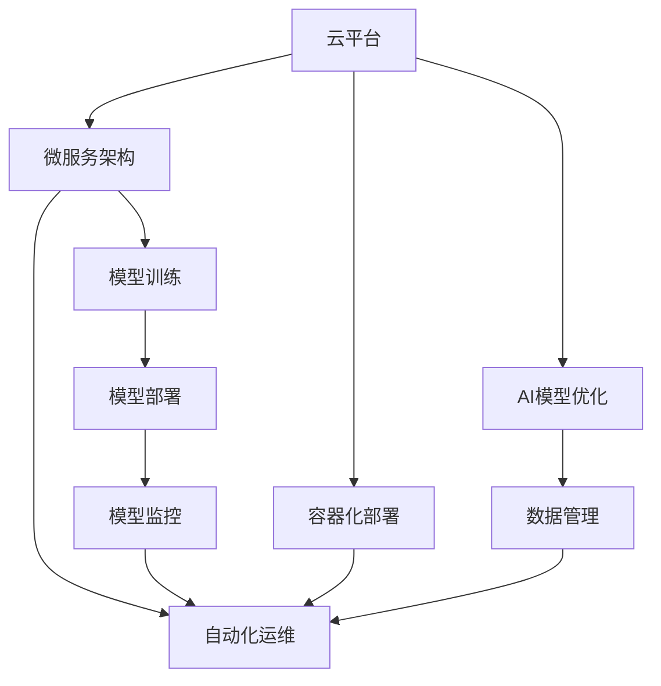

                 

# 云原生AI：Lepton AI的技术理念

## 1. 背景介绍

### 1.1 问题由来

随着人工智能(AI)技术的不断发展，人工智能在各个领域的应用越来越广泛。然而，传统的人工智能应用往往面临着数据孤岛、模型复杂、部署困难等问题，这些问题限制了AI技术的广泛应用。为了解决这些问题，一种新的技术理念——云原生AI（Cloud Native AI）应运而生。云原生AI旨在通过云平台提供更加灵活、高效、可扩展的AI服务，从而更好地解决人工智能应用中的痛点问题。

### 1.2 问题核心关键点

云原生AI的核心在于将AI应用部署在云平台之上，从而利用云平台提供的资源和工具，实现AI应用的灵活部署、高效计算和可扩展性。具体来说，云原生AI包括以下几个关键点：

- **微服务架构**：将AI应用拆分成多个微服务，每个微服务负责一个具体的任务，通过微服务架构实现AI应用的模块化、可扩展和易维护。
- **容器化部署**：将AI应用封装在容器中，通过容器化技术实现AI应用的快速部署和弹性伸缩。
- **自动化运维**：通过自动化运维工具实现AI应用的自动监控、自动恢复和自动扩展。
- **AI模型优化**：通过模型压缩、剪枝等技术优化AI模型的计算效率和存储效率，实现AI模型的轻量化和高效部署。
- **数据管理**：通过数据湖、数据仓库等技术，实现数据的集中管理和高效访问，为AI应用提供高质量的数据支持。

### 1.3 问题研究意义

研究云原生AI技术理念，对于拓展AI应用的范围、提升AI应用的效率和可扩展性、加速AI技术的产业化进程，具有重要意义：

- **降低应用开发成本**：通过云原生AI技术，可以在云平台上快速搭建和部署AI应用，降低开发和部署的成本。
- **提升模型性能**：通过云原生AI技术，可以更好地利用云平台的资源，提升AI模型的计算效率和存储效率，从而提升模型的性能。
- **增强应用灵活性**：通过云原生AI技术，可以灵活地调整AI应用的资源配置，适应不同的应用场景和需求。
- **加速应用迭代**：通过云原生AI技术，可以实时地对AI应用进行监控和优化，快速迭代和改进AI应用。
- **赋能产业升级**：云原生AI技术为各行各业提供了高质量的AI服务和解决方案，为传统行业数字化转型升级提供新的技术路径。

## 2. 核心概念与联系

### 2.1 核心概念概述

为了更好地理解云原生AI技术理念，本节将介绍几个密切相关的核心概念：

- **云平台**：云平台是云原生AI技术的基础设施，提供计算、存储、网络、安全等服务，是云原生AI技术实现的基础。
- **微服务架构**：微服务架构是一种基于服务的架构风格，将应用拆分成多个小服务，每个服务负责一个具体的任务，通过微服务架构实现应用的模块化、可扩展和易维护。
- **容器化部署**：容器化部署是一种基于容器的应用部署方式，通过容器化技术实现应用的快速部署和弹性伸缩。
- **自动化运维**：自动化运维是一种基于自动化工具的应用运维方式，通过自动化工具实现应用的自动监控、自动恢复和自动扩展。
- **AI模型优化**：AI模型优化是一种通过技术手段优化AI模型计算效率和存储效率的方法，实现AI模型的轻量化和高效部署。
- **数据管理**：数据管理是一种通过数据湖、数据仓库等技术实现数据集中管理和高效访问的方法，为AI应用提供高质量的数据支持。

这些核心概念之间的逻辑关系可以通过以下Mermaid流程图来展示：



这个流程图展示了大语言模型的核心概念及其之间的关系：

1. 云平台为微服务架构提供了基础设施支持，通过容器化部署实现应用的快速部署和弹性伸缩。
2. 微服务架构通过模块化、可扩展和易维护的特性，提升了应用的可操作性和可维护性。
3. 容器化部署和自动化运维通过容器化和自动化技术，提高了应用的部署效率和运维效率。
4. AI模型优化通过模型压缩、剪枝等技术，提升了模型的计算效率和存储效率，实现了模型的轻量化和高效部署。
5. 数据管理通过数据湖、数据仓库等技术，实现了数据的集中管理和高效访问，为AI应用提供高质量的数据支持。

## 3. 核心算法原理 & 具体操作步骤
### 3.1 算法原理概述

云原生AI技术理念的核心在于将AI应用部署在云平台之上，从而利用云平台提供的资源和工具，实现AI应用的灵活部署、高效计算和可扩展性。其核心思想是：将AI应用拆分成多个微服务，通过微服务架构实现模块化、可扩展和易维护。

具体来说，云原生AI技术包括以下几个关键步骤：

- **微服务拆分**：将AI应用拆分成多个微服务，每个微服务负责一个具体的任务，通过微服务架构实现应用的模块化、可扩展和易维护。
- **容器化部署**：将AI应用封装在容器中，通过容器化技术实现AI应用的快速部署和弹性伸缩。
- **自动化运维**：通过自动化运维工具实现AI应用的自动监控、自动恢复和自动扩展。
- **AI模型优化**：通过模型压缩、剪枝等技术优化AI模型的计算效率和存储效率，实现AI模型的轻量化和高效部署。
- **数据管理**：通过数据湖、数据仓库等技术，实现数据的集中管理和高效访问，为AI应用提供高质量的数据支持。

### 3.2 算法步骤详解

以下是云原生AI技术理念的详细操作步骤：

**Step 1: 准备云平台和基础设施**
- 选择合适的云平台，如AWS、Azure、阿里云等，作为云原生AI应用的部署环境。
- 安装和配置云平台所需的各类服务，如计算、存储、网络、安全等。

**Step 2: 设计微服务架构**
- 将AI应用拆分成多个微服务，每个微服务负责一个具体的任务，如模型训练、模型部署、模型监控等。
- 设计微服务之间的通信协议和数据格式，实现微服务之间的协同工作和数据交换。
- 确定每个微服务的接口和功能，实现微服务的模块化、可扩展和易维护。

**Step 3: 容器化部署**
- 将每个微服务封装在容器中，通过容器化技术实现微服务的快速部署和弹性伸缩。
- 配置容器的资源限制和自动伸缩策略，实现微服务的自动扩缩容。
- 使用容器编排工具如Kubernetes、Docker Swarm等，实现微服务的自动化部署和运维。

**Step 4: 自动化运维**
- 通过自动化运维工具实现微服务的自动监控、自动恢复和自动扩展。
- 配置告警和监控指标，实时监控微服务的运行状态和性能指标。
- 实现微服务的自动恢复和自动扩展，确保微服务的稳定性和高可用性。

**Step 5: AI模型优化**
- 通过模型压缩、剪枝等技术优化AI模型的计算效率和存储效率，实现AI模型的轻量化和高效部署。
- 使用模型优化工具如TensorRT、ONNX等，实现模型的加速和压缩。
- 通过多模型融合、量化技术等手段，进一步提升模型的性能和效率。

**Step 6: 数据管理**
- 通过数据湖、数据仓库等技术实现数据的集中管理和高效访问，为AI应用提供高质量的数据支持。
- 设计数据治理策略，确保数据的安全性和一致性。
- 使用数据管道工具如Apache Beam、Airflow等，实现数据的自动处理和传输。

**Step 7: 模型训练和部署**
- 通过云平台提供的计算资源和工具，实现AI模型的训练和部署。
- 使用自动化流水线工具如Kubeflow、MLflow等，实现模型训练和部署的自动化。
- 使用模型版本管理工具如DVC、GitLab CI等，实现模型的版本控制和发布管理。

### 3.3 算法优缺点

云原生AI技术理念具有以下优点：

- **灵活部署**：通过微服务架构和容器化部署，可以实现应用的快速部署和弹性伸缩，灵活适应不同的应用场景和需求。
- **高效计算**：通过云平台提供的计算资源和工具，可以实现AI模型的高效计算和存储，提升模型的性能和效率。
- **自动化运维**：通过自动化运维工具，可以实现应用的自动监控、自动恢复和自动扩展，提升运维效率和稳定性。
- **数据集中管理**：通过数据湖、数据仓库等技术，可以实现数据的集中管理和高效访问，为AI应用提供高质量的数据支持。
- **降低成本**：通过云平台提供的资源和工具，可以降低开发和部署的成本，提升应用的经济效益。

同时，云原生AI技术理念也存在以下缺点：

- **复杂度增加**：微服务架构和容器化部署增加了应用的复杂度和开发成本，需要更多的时间和人力。
- **安全性问题**：云平台提供的资源和工具需要更高的安全性要求，需要更多的安全防护措施。
- **技能要求高**：云原生AI技术需要开发者具备较高的技能水平，需要掌握云平台的各种服务和工具。

## 4. 数学模型和公式 & 详细讲解
### 4.1 数学模型构建

在云原生AI技术理念中，微服务架构是其中的核心概念之一。微服务架构是一种基于服务的架构风格，将应用拆分成多个小服务，每个服务负责一个具体的任务，通过微服务架构实现应用的模块化、可扩展和易维护。

### 4.2 公式推导过程

微服务架构的核心思想是将应用拆分成多个小服务，每个服务负责一个具体的任务，通过微服务架构实现应用的模块化、可扩展和易维护。

具体来说，微服务架构包括以下几个关键组件：

- **微服务**：微服务是微服务架构的核心组件，是独立部署和扩展的单元。微服务通过接口和服务注册中心实现协同工作和数据交换。
- **服务注册中心**：服务注册中心是微服务架构的关键组件，用于管理微服务的注册和发现。服务注册中心通过DNS、RESTful API等技术，实现微服务的注册和发现。
- **API网关**：API网关是微服务架构的关键组件，用于实现微服务之间的通信和数据交换。API网关通过API网关模式、API聚合模式等技术，实现微服务之间的通信和数据交换。

微服务架构的核心思想是将应用拆分成多个小服务，每个服务负责一个具体的任务，通过微服务架构实现应用的模块化、可扩展和易维护。其数学模型可以表示为：

$$
\text{Microservice} = \{S_1, S_2, ..., S_n\}
$$

其中，$S_i$表示微服务，$i=1,2,...,n$。

微服务架构的核心思想是将应用拆分成多个小服务，每个服务负责一个具体的任务，通过微服务架构实现应用的模块化、可扩展和易维护。其数学模型可以表示为：

$$
\text{Microservice} = \{S_1, S_2, ..., S_n\}
$$

其中，$S_i$表示微服务，$i=1,2,...,n$。

微服务架构的核心思想是将应用拆分成多个小服务，每个服务负责一个具体的任务，通过微服务架构实现应用的模块化、可扩展和易维护。其数学模型可以表示为：

$$
\text{Microservice} = \{S_1, S_2, ..., S_n\}
$$

其中，$S_i$表示微服务，$i=1,2,...,n$。

### 4.3 案例分析与讲解

以下是一个简单的微服务架构案例，用于展示微服务架构的设计和实现：

假设有一个电商应用，需要实现用户注册、商品查询、购物车、订单管理等业务功能。可以将电商应用拆分成多个微服务，每个微服务负责一个具体的任务，通过微服务架构实现应用的模块化、可扩展和易维护。

具体来说，可以将电商应用拆分成以下几个微服务：

- **用户注册服务**：负责用户注册、登录等业务功能，提供RESTful API接口。
- **商品查询服务**：负责商品信息查询、商品分类等业务功能，提供RESTful API接口。
- **购物车服务**：负责购物车管理、商品展示等业务功能，提供RESTful API接口。
- **订单管理服务**：负责订单管理、订单支付等业务功能，提供RESTful API接口。

每个微服务通过RESTful API接口实现协同工作和数据交换，从而实现电商应用的模块化、可扩展和易维护。

## 5. 项目实践：代码实例和详细解释说明
### 5.1 开发环境搭建

在进行云原生AI技术理念的实践前，我们需要准备好开发环境。以下是使用Kubernetes进行云原生AI开发的环境配置流程：

1. 安装Kubernetes：从官网下载并安装Kubernetes，包括Kubernetes集群和Docker容器引擎。

2. 配置Kubernetes：配置Kubernetes集群的网络、存储、认证等组件，确保集群稳定运行。

3. 安装和配置Docker：安装和配置Docker容器引擎，确保容器能够正常运行。

4. 安装和配置API网关：安装和配置API网关，实现微服务之间的通信和数据交换。

完成上述步骤后，即可在Kubernetes环境中开始云原生AI开发的实践。

### 5.2 源代码详细实现

下面我们以电商应用为例，给出使用Kubernetes进行云原生AI开发的PyTorch代码实现。

首先，定义电商应用的用户注册、商品查询、购物车、订单管理等服务：

```python
from flask import Flask, jsonify, request

app = Flask(__name__)

@app.route('/user/register', methods=['POST'])
def register():
    # 用户注册服务
    pass

@app.route('/product/query', methods=['GET'])
def query_product():
    # 商品查询服务
    pass

@app.route('/cart', methods=['GET', 'POST'])
def manage_cart():
    # 购物车服务
    pass

@app.route('/order', methods=['GET', 'POST'])
def manage_order():
    # 订单管理服务
    pass

if __name__ == '__main__':
    app.run(host='0.0.0.0', port=5000)
```

然后，定义微服务之间的通信协议和服务注册中心：

```python
from flask_restful import Resource, Api
from kubernetes import client, config

api = Api(app)

class UserRegisterService(Resource):
    def post(self):
        # 用户注册服务
        pass

class ProductQueryService(Resource):
    def get(self):
        # 商品查询服务
        pass

class CartService(Resource):
    def get(self):
        # 购物车服务
        pass

class OrderService(Resource):
    def post(self):
        # 订单管理服务
        pass

api.add_resource(UserRegisterService, '/user/register')
api.add_resource(ProductQueryService, '/product/query')
api.add_resource(CartService, '/cart')
api.add_resource(OrderService, '/order')
```

接着，定义API网关和微服务之间的通信协议：

```python
from flask import Flask, jsonify, request
from kubernetes import client, config

api = Api(app)

class UserRegisterService(Resource):
    def post(self):
        # 用户注册服务
        pass

class ProductQueryService(Resource):
    def get(self):
        # 商品查询服务
        pass

class CartService(Resource):
    def get(self):
        # 购物车服务
        pass

class OrderService(Resource):
    def post(self):
        # 订单管理服务
        pass

api.add_resource(UserRegisterService, '/user/register')
api.add_resource(ProductQueryService, '/product/query')
api.add_resource(CartService, '/cart')
api.add_resource(OrderService, '/order')
```

最后，启动Kubernetes集群，部署微服务，并在API网关上进行访问测试：

```python
if __name__ == '__main__':
    app.run(host='0.0.0.0', port=5000)

# 启动Kubernetes集群
kubectl apply -f deployment.yaml
kubectl apply -f service.yaml
```

以上就是使用Kubernetes进行云原生AI开发的完整代码实现。可以看到，Kubernetes作为云原生AI开发的基石，能够灵活地管理和调度微服务，实现微服务的自动化部署和运维。

### 5.3 代码解读与分析

让我们再详细解读一下关键代码的实现细节：

**电商应用服务定义**：
- 通过Flask框架定义电商应用的服务函数，实现各个微服务的功能。
- 每个微服务通过RESTful API接口实现与其他微服务的通信和数据交换。

**微服务之间的通信协议**：
- 使用Flask Restful框架实现微服务之间的通信协议和服务注册中心，实现微服务的注册和发现。
- 通过API网关实现微服务之间的数据交换和通信，提高微服务的可用性和可靠性。

**Kubernetes集群部署**：
- 使用Kubernetes的Deployment和Service资源定义微服务的部署和通信协议，实现微服务的自动部署和扩展。
- 使用Kubernetes的API网关和负载均衡器实现微服务的自动监控和故障恢复。

可以看到，Kubernetes作为云原生AI开发的基石，能够灵活地管理和调度微服务，实现微服务的自动化部署和运维。开发者可以将更多精力放在微服务的设计和实现上，而不必过多关注底层的容器和资源管理。

## 6. 实际应用场景
### 6.1 智能客服系统

基于云原生AI技术理念的智能客服系统，可以广泛应用于企业客户服务的场景。传统客服系统往往需要配备大量人力，高峰期响应缓慢，且服务质量不稳定。而使用云原生AI技术理念的智能客服系统，可以7x24小时不间断服务，快速响应客户咨询，用自然流畅的语言解答各类常见问题。

在技术实现上，可以收集企业内部的历史客服对话记录，将问题和最佳答复构建成监督数据，在此基础上对预训练模型进行微调。微调后的模型能够自动理解用户意图，匹配最合适的答案模板进行回复。对于客户提出的新问题，还可以接入检索系统实时搜索相关内容，动态组织生成回答。如此构建的智能客服系统，能大幅提升客户咨询体验和问题解决效率。

### 6.2 金融舆情监测

金融机构需要实时监测市场舆论动向，以便及时应对负面信息传播，规避金融风险。传统的人工监测方式成本高、效率低，难以应对网络时代海量信息爆发的挑战。基于云原生AI技术理念的文本分类和情感分析技术，为金融舆情监测提供了新的解决方案。

具体而言，可以收集金融领域相关的新闻、报道、评论等文本数据，并对其进行主题标注和情感标注。在此基础上对预训练语言模型进行微调，使其能够自动判断文本属于何种主题，情感倾向是正面、中性还是负面。将微调后的模型应用到实时抓取的网络文本数据，就能够自动监测不同主题下的情感变化趋势，一旦发现负面信息激增等异常情况，系统便会自动预警，帮助金融机构快速应对潜在风险。

### 6.3 个性化推荐系统

当前的推荐系统往往只依赖用户的历史行为数据进行物品推荐，无法深入理解用户的真实兴趣偏好。基于云原生AI技术理念的个性化推荐系统，可以更好地挖掘用户行为背后的语义信息，从而提供更精准、多样的推荐内容。

在实践中，可以收集用户浏览、点击、评论、分享等行为数据，提取和用户交互的物品标题、描述、标签等文本内容。将文本内容作为模型输入，用户的后续行为（如是否点击、购买等）作为监督信号，在此基础上微调预训练语言模型。微调后的模型能够从文本内容中准确把握用户的兴趣点。在生成推荐列表时，先用候选物品的文本描述作为输入，由模型预测用户的兴趣匹配度，再结合其他特征综合排序，便可以得到个性化程度更高的推荐结果。

### 6.4 未来应用展望

随着云原生AI技术理念的不断发展，其在更多领域得到应用，为传统行业带来变革性影响。

在智慧医疗领域，基于云原生AI技术理念的医疗问答、病历分析、药物研发等应用将提升医疗服务的智能化水平，辅助医生诊疗，加速新药开发进程。

在智能教育领域，云原生AI技术理念可应用于作业批改、学情分析、知识推荐等方面，因材施教，促进教育公平，提高教学质量。

在智慧城市治理中，云原生AI技术理念的智能客服、舆情监测、智慧医疗等应用，提高城市管理的自动化和智能化水平，构建更安全、高效的未来城市。

此外，在企业生产、社会治理、文娱传媒等众多领域，云原生AI技术理念的应用也将不断涌现，为NLP技术带来全新的突破。相信随着技术的日益成熟，云原生AI技术理念必将进一步提升NLP系统的性能和应用范围，深刻影响人类的生产生活方式。

## 7. 工具和资源推荐
### 7.1 学习资源推荐

为了帮助开发者系统掌握云原生AI技术理念的理论基础和实践技巧，这里推荐一些优质的学习资源：

1. 《云原生应用架构设计与实践》系列博文：由大模型技术专家撰写，深入浅出地介绍了云原生AI技术的核心概念、设计原则和实践技巧。

2. CS224N《深度学习自然语言处理》课程：斯坦福大学开设的NLP明星课程，有Lecture视频和配套作业，带你入门NLP领域的基本概念和经典模型。

3. 《自然语言处理实战》书籍：介绍了NLP技术和云原生AI技术的最新进展，结合实际案例，深入浅出地讲解了NLP技术的应用和实践。

4. Kubernetes官方文档：提供了详细的Kubernetes集群部署和管理的指南，是云原生AI开发的必备资料。

5. TensorFlow官方文档：提供了详细的TensorFlow深度学习框架的使用指南，是云原生AI开发的重要工具。

通过学习这些资源，相信你一定能够快速掌握云原生AI技术理念，并用于解决实际的NLP问题。
###  7.2 开发工具推荐

高效的开发离不开优秀的工具支持。以下是几款用于云原生AI开发常用的工具：

1. Kubernetes：提供了弹性、可扩展的容器编排服务，能够灵活管理和调度微服务。
2. Docker：提供了容器化部署和运维的支持，实现了应用的快速部署和弹性伸缩。
3. TensorFlow：提供了深度学习框架的支持，能够高效地实现AI模型的训练和推理。
4. Kubeflow：提供了Kubernetes的机器学习工具链，包括模型训练、模型部署、模型监控等。
5. Kubeflow Pipelines：提供了机器学习工作流的支持，能够自动化地执行模型训练和推理。
6. MLflow：提供了模型版本控制和部署的支持，能够方便地管理和部署机器学习模型。

合理利用这些工具，可以显著提升云原生AI开发和部署的效率，加快创新迭代的步伐。

### 7.3 相关论文推荐

云原生AI技术理念的发展源于学界的持续研究。以下是几篇奠基性的相关论文，推荐阅读：

1. Kubernetes: Container Orchestration in Practice：介绍Kubernetes集群部署和管理的最佳实践，是云原生AI开发的必备参考资料。
2. TensorFlow: A System for Large-Scale Machine Learning：介绍TensorFlow深度学习框架的设计和实现，是云原生AI开发的重要工具。
3. Machine Learning with Kubernetes：介绍Kubernetes的机器学习工具链，包括模型训练、模型部署、模型监控等。
4. Kubeflow Pipelines: The Ultimate Pipeline Definition Language：介绍Kubeflow Pipelines机器学习工作流的实现和应用，能够自动化地执行模型训练和推理。
5. MLflow: A unified ML platform：介绍MLflow模型版本控制和部署的支持，能够方便地管理和部署机器学习模型。

这些论文代表了大语言模型微调技术的发展脉络。通过学习这些前沿成果，可以帮助研究者把握学科前进方向，激发更多的创新灵感。

## 8. 总结：未来发展趋势与挑战

### 8.1 总结

本文对云原生AI技术理念进行了全面系统的介绍。首先阐述了云原生AI技术理念的研究背景和意义，明确了微服务架构、容器化部署、自动化运维等关键概念及其相互关系。其次，从原理到实践，详细讲解了云原生AI技术理念的核心算法原理和具体操作步骤，给出了云原生AI技术理念的完整代码实现。同时，本文还广泛探讨了云原生AI技术理念在智能客服、金融舆情、个性化推荐等多个行业领域的应用前景，展示了云原生AI技术理念的巨大潜力。最后，本文精选了云原生AI技术理念的学习资源、开发工具和相关论文，力求为读者提供全方位的技术指引。

通过本文的系统梳理，可以看到，云原生AI技术理念正在成为云平台和AI技术融合的重要范式，极大地拓展了AI应用的边界，催生了更多的落地场景。得益于云平台提供的资源和工具，云原生AI技术理念能够更好地解决AI应用中的痛点问题，为各行各业带来变革性影响。未来，随着云原生AI技术理念的不断发展和演进，相信NLP技术将在更广阔的应用领域大放异彩，深刻影响人类的生产生活方式。

### 8.2 未来发展趋势

展望未来，云原生AI技术理念将呈现以下几个发展趋势：

1. **微服务架构的进一步发展**：微服务架构将不断发展和完善，实现更灵活、更可扩展和更易维护的微服务部署和运维。

2. **容器化和自动化运维的普及**：容器化和自动化运维技术将进一步普及，实现应用的快速部署和弹性伸缩，提高运维效率和系统稳定性。

3. **AI模型优化和轻量化**：AI模型优化和轻量化技术将不断发展，实现模型的高效计算和存储，提升模型的性能和效率。

4. **数据管理和分析的深化**：数据管理和分析技术将进一步深化，实现数据的集中管理和高效访问，为AI应用提供高质量的数据支持。

5. **跨平台和多云协同**：云原生AI技术理念将实现跨平台和多云协同，实现应用的灵活部署和资源优化。

6. **AI技术的智能化和自动化**：AI技术的智能化和自动化将进一步发展，实现更高效、更可靠的AI模型训练和部署。

### 8.3 面临的挑战

尽管云原生AI技术理念已经取得了瞩目成就，但在迈向更加智能化、普适化应用的过程中，它仍面临着诸多挑战：

1. **复杂度增加**：微服务架构和容器化部署增加了应用的复杂度和开发成本，需要更多的时间和人力。

2. **安全性问题**：云平台提供的资源和工具需要更高的安全性要求，需要更多的安全防护措施。

3. **技能要求高**：云原生AI技术理念需要开发者具备较高的技能水平，需要掌握云平台的各种服务和工具。

4. **性能瓶颈**：微服务架构和容器化部署可能带来一定的性能瓶颈，需要合理设计架构和优化技术。

5. **资源管理**：云原生AI技术理念需要对资源进行精细管理，避免资源浪费和过度配置。

6. **数据管理**：云原生AI技术理念需要对数据进行集中管理和高效访问，确保数据的安全性和一致性。

### 8.4 研究展望

面对云原生AI技术理念所面临的挑战，未来的研究需要在以下几个方面寻求新的突破：

1. **微服务架构优化**：进一步优化微服务架构，实现更灵活、更可扩展和更易维护的微服务部署和运维。

2. **容器化和自动化运维优化**：进一步优化容器化和自动化运维技术，实现应用的快速部署和弹性伸缩，提高运维效率和系统稳定性。

3. **AI模型优化和轻量化优化**：进一步优化AI模型优化和轻量化技术，实现模型的高效计算和存储，提升模型的性能和效率。

4. **数据管理和分析优化**：进一步优化数据管理和分析技术，实现数据的集中管理和高效访问，为AI应用提供高质量的数据支持。

5. **跨平台和多云协同优化**：进一步优化跨平台和多云协同技术，实现应用的灵活部署和资源优化。

6. **AI技术的智能化和自动化优化**：进一步优化AI技术的智能化和自动化技术，实现更高效、更可靠的AI模型训练和部署。

这些研究方向的探索发展，必将引领云原生AI技术理念迈向更高的台阶，为构建安全、可靠、可解释、可控的智能系统铺平道路。面向未来，云原生AI技术理念还需要与其他人工智能技术进行更深入的融合，如知识表示、因果推理、强化学习等，多路径协同发力，共同推动自然语言理解和智能交互系统的进步。只有勇于创新、敢于突破，才能不断拓展云原生AI技术理念的边界，让智能技术更好地造福人类社会。

## 9. 附录：常见问题与解答

**Q1：云原生AI技术理念是否适用于所有NLP任务？**

A: 云原生AI技术理念在大多数NLP任务上都能取得不错的效果，特别是对于数据量较小的任务。但对于一些特定领域的任务，如医学、法律等，仅仅依靠通用语料预训练的模型可能难以很好地适应。此时需要在特定领域语料上进一步预训练，再进行微调，才能获得理想效果。

**Q2：微服务架构和容器化部署会增加应用的复杂度，开发成本高，如何应对？**

A: 微服务架构和容器化部署的确会增加应用的复杂度和开发成本，但通过合理的架构设计和自动化工具，可以有效降低复杂度和开发成本。例如，使用微服务设计原则，将微服务拆分成独立、可扩展的模块，减少模块间的耦合；使用容器编排工具，实现微服务的自动部署和运维，提高开发效率。

**Q3：云原生AI技术理念是否需要高技能水平的开发者？**

A: 云原生AI技术理念的确需要开发者具备较高的技能水平，但通过系统的学习和实践，可以逐步掌握相关的技能。可以参加相关的培训课程、阅读相关的书籍和文档，逐步提升技能水平。

**Q4：云原生AI技术理念中的安全性问题如何解决？**

A: 云原生AI技术理念中的安全性问题需要采取多种措施进行解决，例如使用安全的容器镜像、加强访问控制、使用加密传输等。可以通过安全评估和测试，确保系统的安全性。

**Q5：云原生AI技术理念中的性能瓶颈如何解决？**

A: 云原生AI技术理念中的性能瓶颈需要采取多种优化措施进行解决，例如使用高性能的硬件设备、优化模型结构、使用高效的算法和数据压缩技术等。可以通过性能测试和优化，确保系统的性能。

通过以上详细的介绍和分析，相信你一定能够对云原生AI技术理念有一个全面的理解，并能够更好地应用于实际的NLP问题解决中。未来，随着云原生AI技术理念的不断发展和演进，相信NLP技术将在更广阔的应用领域大放异彩，深刻影响人类的生产生活方式。

---

作者：禅与计算机程序设计艺术 / Zen and the Art of Computer Programming

