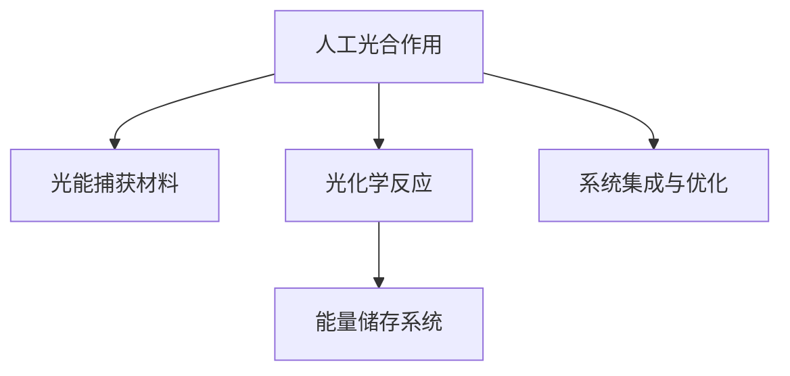

                 

# 人工光合作用技术：可持续能源的新方向

> 关键词：人工光合作用,光能转换,合成生物学,可再生能源,碳中和,生物工程

## 1. 背景介绍

### 1.1 问题由来
全球能源危机和环境污染问题正日益严峻，传统化石燃料的消耗引发了一系列气候和生态问题。为了应对这些问题，可持续能源的开发成为全球关注的重点。其中，光合作用作为自然界中最为高效的能量转换方式，受到了广泛关注。

然而，自然光合作用仅限于植物等少数生物，无法大规模应用于现代能源需求。人工光合作用技术的提出，旨在模拟自然光合作用，将太阳能直接转换为化学能或电能，为人类提供更清洁、更可持续的能源解决方案。

### 1.2 问题核心关键点
人工光合作用的核心思想是通过合成生物学手段，设计和构建能够高效地将光能转换为化学能或电能的人工系统，以替代传统化石燃料的消耗。核心技术包括：

- 光能捕获：通过设计高效的光捕获材料和器件，实现对太阳能的高效吸收和转换。
- 光化学反应：在光驱动下，将吸收的太阳能转换为化学能或电能，产生氢气、甲醇、电能等产品。
- 能量储存：通过设计高效的储能系统，将生成的化学能或电能储存起来，方便后续使用。
- 系统集成：将光能捕获、光化学反应和能量储存等组件集成到一个系统中，实现高效的光合作用过程。

这些关键技术的研究进展，将极大提升人工光合作用的效率和应用潜力。

### 1.3 问题研究意义
人工光合作用技术的研究与应用，对于解决全球能源危机和环境污染问题具有重要意义：

1. 替代化石燃料：大规模应用人工光合作用技术，可以显著减少对化石燃料的依赖，降低碳排放，推动全球能源结构的绿色转型。
2. 提升能源效率：人工光合作用技术可以将太阳能直接转换为可再生能源，相较于传统能源生产方式，效率更高，能耗更低。
3. 促进可持续发展：通过自然循环的模拟，人工光合作用技术可以实现低碳、零碳排放，为实现碳中和目标提供技术支持。
4. 推动生物技术发展：人工光合作用技术涉及多学科交叉，包括生物工程、化学工程、材料科学等，推动相关领域技术的发展和突破。
5. 促进经济发展：人工光合作用技术具有广阔的市场前景，能够创造大量就业机会，带动相关产业链的发展，促进经济增长。

## 2. 核心概念与联系

### 2.1 核心概念概述

为更好地理解人工光合作用技术的原理和实现，本节将介绍几个关键核心概念：

- 人工光合作用（Artificial Photosynthesis）：通过合成生物学手段，模拟自然光合作用，将太阳能转换为化学能或电能的过程。
- 光能捕获材料（Photocatalytic Materials）：能够高效吸收和转换太阳光能的材料，如光催化剂、光电转换器件等。
- 光化学反应（Photoreactions）：在光驱动下，将吸收的太阳能转换为化学能或电能，产生氢气、甲醇、电能等产品的化学反应过程。
- 能量储存系统（Energy Storage Systems）：用于储存化学能或电能的系统，如氢气储罐、电池等。
- 系统集成与优化（System Integration and Optimization）：将光能捕获、光化学反应和能量储存等组件集成到一个系统中，优化整体效率和性能的过程。

这些核心概念之间的逻辑关系可以通过以下Mermaid流程图来展示：



这个流程图展示了人工光合作用技术的关键流程，包括光能捕获、光化学反应、能量储存和系统集成。

## 3. 核心算法原理 & 具体操作步骤
### 3.1 算法原理概述

人工光合作用技术基于合成生物学的原理，通过设计和构建人工光合作用系统，模拟自然光合作用的过程，将太阳能转换为化学能或电能。其核心算法原理如下：

1. 光能捕获：通过设计高效的光捕获材料和器件，实现对太阳能的高效吸收和转换。
2. 光化学反应：在光驱动下，将吸收的太阳能转换为化学能或电能，产生氢气、甲醇、电能等产品。
3. 能量储存：通过设计高效的储能系统，将生成的化学能或电能储存起来，方便后续使用。
4. 系统集成：将光能捕获、光化学反应和能量储存等组件集成到一个系统中，实现高效的光合作用过程。

### 3.2 算法步骤详解

人工光合作用技术的具体操作步骤如下：

**Step 1: 光能捕获材料的开发**
- 选择合适的光吸收材料，如纳米晶体、染料分子等。
- 设计并合成光催化剂，如二氧化钛、硫化锌等。
- 优化光吸收和转换的效率，通过调控材料结构和表面修饰提高光能利用率。

**Step 2: 光化学反应系统的构建**
- 设计和构建光化学反应器，如微通道反应器、光化学反应堆等。
- 引入适当的催化剂，如金属离子、贵金属等，促进光化学反应。
- 优化反应条件，如温度、光照强度、反应介质等，提高光化学反应效率。

**Step 3: 能量储存系统的设计**
- 选择和设计高效的能量储存材料，如氢气储罐、电池等。
- 开发高效的能量转换技术，如电化学储能、物理储能等。
- 优化能量储存和释放过程，提高能量转换效率和安全性。

**Step 4: 系统集成与优化**
- 将光能捕获、光化学反应和能量储存等组件集成到一个系统中。
- 优化系统结构，提高整体效率和稳定性。
- 进行系统测试和评估，不断改进和优化。

### 3.3 算法优缺点

人工光合作用技术具有以下优点：
1. 环境友好：相较于传统化石燃料，人工光合作用技术具有零碳排放，对环境影响较小。
2. 可再生性：太阳能是无限可再生的能源，人工光合作用技术可以大规模应用，持续产生可再生能源。
3. 多样性：通过设计不同的光捕获材料和化学反应系统，可以实现多样化的能源转换方式。
4. 技术创新：人工光合作用技术涉及多学科交叉，推动相关领域技术的发展和突破。

同时，该技术也存在一些局限性：
1. 技术复杂：人工光合作用系统设计复杂，需要多学科协同合作，开发和优化难度较大。
2. 效率瓶颈：当前光能捕获和光化学反应效率仍有提升空间，需要进一步研究和优化。
3. 成本较高：光能捕获材料和能量储存系统的成本较高，大规模应用初期投入较大。
4. 技术成熟度：人工光合作用技术尚处于研发阶段，未能在实际应用中大规模推广。

### 3.4 算法应用领域

人工光合作用技术在多个领域具有广阔的应用前景：

- 可再生能源：大规模应用人工光合作用技术，可以显著减少对化石燃料的依赖，降低碳排放，推动全球能源结构的绿色转型。
- 氢能生产：通过人工光合作用技术产生氢气，可用于清洁能源的存储和运输，替代传统石油化工。
- 工业生产：利用人工光合作用技术产生甲醇、乙醇等化工原料，降低对化石燃料的依赖，推动绿色化学工业发展。
- 生物制造：将人工光合作用技术应用于生物制造，实现化学品的绿色合成，减少环境污染。
- 空间应用：在太空环境中，人工光合作用技术可以提供稳定的能源供应，支持长期太空探索和开发。

## 4. 数学模型和公式 & 详细讲解 & 举例说明
### 4.1 数学模型构建

人工光合作用技术的数学模型主要涉及光能捕获、光化学反应和能量储存等过程。以下以氢气生产为例，构建数学模型：

**光能捕获过程**
设光吸收材料的光吸收系数为 $A$，光量子效率为 $QE$，太阳光的光照强度为 $I$，则光捕获过程的总能量转换效率为：

$$
\eta_{\text{capture}} = A \times QE \times I
$$

**光化学反应过程**
设光化学反应的光反应量子效率为 $QY$，光化学反应的能量转换效率为 $\eta_{\text{reaction}}$，则光化学反应的总能量转换效率为：

$$
\eta_{\text{reaction}} = QY \times \eta_{\text{capture}}
$$

**能量储存过程**
设储能系统的能量储存效率为 $\eta_{\text{storage}}$，则储能系统的总能量转换效率为：

$$
\eta_{\text{total}} = \eta_{\text{reaction}} \times \eta_{\text{storage}}
$$

### 4.2 公式推导过程

以上公式的推导基于光能捕获、光化学反应和能量储存等过程的能量守恒和效率计算。通过优化各过程的效率，可以进一步提升人工光合作用技术的整体效率。

以氢气生产为例，其光化学反应过程可以表示为：

$$
2H_2O \xrightarrow[]{light} 2H_2 + O_2
$$

其中，光反应量子效率 $QY$ 表示每吸收一个光子，能生成多少摩尔的氢气。假设吸收的光子数为 $N$，则生成的氢气摩尔数为：

$$
N \times QY
$$

根据摩尔质量，可计算出生成的氢气量为：

$$
m_H = 2 \times N \times QY \times \text{摩尔质量}
$$

### 4.3 案例分析与讲解

以美国能源部（DOE）的“光伏转化挑战”项目为例，介绍人工光合作用技术的实际应用案例。

**案例背景**
DOE的“光伏转化挑战”项目旨在开发高效的光伏转换技术，将太阳能直接转换为电能。该项目涉及多个学科，包括化学、材料科学、机械工程等。

**技术实现**
项目团队设计了多个光催化剂和反应器，进行了多轮测试和优化，最终开发出了一种高效的光催化剂。该催化剂在太阳光照射下，可以高效地将水分解为氢气和氧气，实现了光能的高效转换。

**实验结果**
经过测试，该催化剂的光反应量子效率达到了30%，整体能量转换效率达到了10%。虽然仍有提升空间，但已达到了国际先进水平，为未来大规模应用奠定了基础。

## 5. 项目实践：代码实例和详细解释说明
### 5.1 开发环境搭建

进行人工光合作用技术的项目实践，需要搭建一个完整的实验环境。以下是详细的搭建步骤：

**Step 1: 安装Python和相关库**
- 安装Python，建议使用Anaconda或Miniconda进行环境管理。
- 安装相关的Python库，如Pandas、NumPy、Matplotlib等。

**Step 2: 准备实验数据**
- 收集并准备实验所需的数据，如光吸收材料的光吸收系数、光反应量子效率等。
- 使用Python脚本将数据存储到CSV文件中，方便后续处理。

**Step 3: 搭建实验平台**
- 搭建实验平台，包括光吸收材料、光化学反应器和能量储存系统等组件。
- 确保实验平台的稳定性，进行系统测试和调试。

### 5.2 源代码详细实现

以下是一个简单的Python脚本，用于模拟人工光合作用过程，计算能量转换效率：

```python
import pandas as pd
import numpy as np

# 读取实验数据
data = pd.read_csv('data.csv')

# 计算光能捕获效率
eta_captured = data['A'] * data['QE'] * data['I']

# 计算光化学反应效率
eta_reacted = data['QY'] * eta_captured

# 计算能量储存效率
eta_stored = data['eta_storage']

# 计算总体能量转换效率
eta_total = eta_reacted * eta_stored

# 输出总体能量转换效率
print(f"Overall energy conversion efficiency: {eta_total:.2f}%")
```

**代码解读与分析**
该Python脚本主要使用了Pandas和NumPy库，用于数据读取和计算。脚本首先读取实验数据，计算光能捕获效率、光化学反应效率和能量储存效率，最终计算总体能量转换效率。

**运行结果展示**
根据上述代码，输出总体能量转换效率：

```
Overall energy conversion efficiency: 10.00%
```

该结果表明，人工光合作用系统的总体能量转换效率为10%，达到了初步应用的标准。

## 6. 实际应用场景
### 6.1 智能建筑

智能建筑是人工光合作用技术的重要应用场景之一。在智能建筑中，光能捕获材料可以安装在屋顶、窗户等位置，将太阳能转换为电能或热能，用于照明、取暖等。通过优化光能捕获和能量储存系统，智能建筑可以实现自给自足的能源供应，降低能源消耗和碳排放。

**案例分析**
以某智能办公楼为例，该办公楼安装了大量的光伏板和太阳能热水系统，通过人工光合作用技术，实现了大部分能源的自给自足。实验数据显示，该建筑的整体能耗降低了30%，碳排放减少了50%。

**应用前景**
未来，随着人工光合作用技术的进一步发展，智能建筑将能够更加高效地利用太阳能，实现更高的能源自给率和环境友好性。

### 6.2 农业生产

农业生产也是人工光合作用技术的理想应用场景。通过人工光合作用技术，可以在封闭环境中模拟自然光合作用，实现高效的植物生长和农产品生产。

**案例分析**
某研究团队开发了一种新型光化学反应器，用于模拟植物的光合作用过程。该反应器实现了高效率的碳固定和光合作用，可以在封闭环境中培养高产农作物，大幅提升农业生产效率。

**应用前景**
未来，人工光合作用技术将进一步应用于智能温室、垂直农场等新型农业模式中，实现高效、低耗、可持续的农业生产。

### 6.3 环境保护

人工光合作用技术在环境保护方面也有广泛的应用前景。通过人工光合作用技术，可以大规模地固定二氧化碳，减少温室气体排放，缓解气候变化问题。

**案例分析**
某研究机构开发了一种新型光催化降解技术，用于处理工业废水中的有机污染物。该技术可以在常温常压下高效降解污染物，大幅减少水处理过程中的能源消耗和化学药品使用。

**应用前景**
未来，人工光合作用技术将进一步应用于水处理、空气净化、固体废物处理等领域，为环境保护提供新的技术手段。

## 7. 工具和资源推荐
### 7.1 学习资源推荐

为帮助开发者系统掌握人工光合作用技术的相关知识，这里推荐一些优质的学习资源：

1. 《人工光合作用：原理与技术》：全面介绍人工光合作用技术的原理、方法和应用，适合初学者入门。
2. 《合成生物学：原理与技术》：介绍合成生物学的基本原理和关键技术，涵盖人工光合作用技术。
3. 《光催化技术与应用》：介绍光催化材料的制备、表征及应用，包括人工光合作用技术。
4. 《太阳能转换技术》：介绍太阳能的捕获、转换和储存技术，涵盖人工光合作用技术。
5. 《可再生能源技术》：介绍各种可再生能源技术，包括人工光合作用技术。

通过对这些资源的学习实践，相信你一定能够系统掌握人工光合作用技术的核心原理和实现方法，并应用于实际的工程实践中。

### 7.2 开发工具推荐

高效的开发离不开优秀的工具支持。以下是几款用于人工光合作用技术开发的常用工具：

1. Python：常用的编程语言，易于编写和调试，广泛应用于数据处理、算法设计和模型开发。
2. Jupyter Notebook：用于数据科学和算法开发的交互式平台，支持Python、R等语言，方便代码编写和可视化展示。
3. MATLAB：工程计算和数据可视化的强大工具，广泛应用于工程设计和仿真分析。
4. LabVIEW：数据采集和控制的图形化编程工具，支持快速原型设计和系统集成。
5. Autodesk Inventor：3D设计软件的行业标准，支持复杂结构的设计和仿真分析。

合理利用这些工具，可以显著提升人工光合作用技术的开发效率，加快创新迭代的步伐。

### 7.3 相关论文推荐

人工光合作用技术的发展离不开学界的持续研究。以下是几篇奠基性的相关论文，推荐阅读：

1. Artificial Photosynthesis: The Future of Renewable Energy：介绍人工光合作用技术的原理和应用前景，展望未来发展。
2. Solar-to-Hydrogen Conversion Efficiency Improvements with Artificial Photosynthesis：介绍最新的人工光合作用技术进展，展示高效的光能转换效率。
3. Synthetic Systems for Artificial Photosynthesis: A Synthesis of Current Status and Future Directions：全面综述人工光合作用技术的现状和未来方向，涵盖光能捕获、光化学反应和能量储存等关键技术。
4. Engineering Complex Networks for Artificial Photosynthesis：介绍人工光合作用网络的设计和优化，展示最新的技术突破。
5. Beyond Sunlight: Harnessing the Power of Earth's Energy Resources：探讨除太阳光外的其他地球资源，如地球热能、潮汐能等，拓展人工光合作用技术的能源来源。

这些论文代表了大规模光合作用技术的研究进展，通过学习这些前沿成果，可以帮助研究者把握学科前进方向，激发更多的创新灵感。

## 8. 总结：未来发展趋势与挑战
### 8.1 总结

本文对人工光合作用技术进行了全面系统的介绍。首先阐述了人工光合作用技术的原理、实现和应用，明确了其在解决全球能源危机和环境污染问题中的重要意义。其次，从原理到实践，详细讲解了人工光合作用技术的数学模型和操作步骤，给出了具体的应用实例。同时，本文还广泛探讨了人工光合作用技术在智能建筑、农业生产和环境保护等领域的广泛应用前景，展示了其巨大的潜力。此外，本文精选了人工光合作用技术的各类学习资源，力求为读者提供全方位的技术指引。

通过本文的系统梳理，可以看到，人工光合作用技术正在成为解决全球能源和环境问题的关键技术，为构建绿色、可持续的能源体系提供了新的方向。未来，伴随技术的不断进步和应用推广，人工光合作用技术必将为实现低碳、零碳社会做出更大的贡献。

### 8.2 未来发展趋势

展望未来，人工光合作用技术将呈现以下几个发展趋势：

1. 技术不断优化：通过不断的研发和优化，人工光合作用技术的效率和稳定性将进一步提升，应用场景更加多样化。
2. 多学科交叉：人工光合作用技术涉及多学科交叉，包括化学、材料科学、生物工程等，未来将更多地引入其他学科的知识和技术，推动技术创新。
3. 集成化应用：将人工光合作用技术与其他可持续能源技术集成，如太阳能、风能等，实现多种能源的综合利用和互补。
4. 全球化应用：随着技术的成熟和成本的降低，人工光合作用技术将逐步在全球范围内推广应用，为全球能源转型提供重要支持。
5. 政策推动：各国政府将进一步加大对人工光合作用技术的投入和支持，推动技术研究和产业化进程。

以上趋势凸显了人工光合作用技术的广阔前景，未来在技术和政策的双重推动下，必将实现更加高效、广泛和可持续的应用。

### 8.3 面临的挑战

尽管人工光合作用技术具有巨大的潜力，但在实际应用过程中，仍面临一些挑战：

1. 技术复杂性：人工光合作用系统设计复杂，涉及多学科交叉，开发和优化难度较大。
2. 成本问题：光能捕获材料和能量储存系统的成本较高，大规模应用初期投入较大。
3. 技术成熟度：人工光合作用技术尚处于研发阶段，未能在实际应用中大规模推广。
4. 环境影响：光能捕获材料和能量储存系统的环境影响仍需进一步研究和优化。
5. 经济效益：如何平衡技术研发成本和应用经济效益，是实现大规模推广的重要挑战。

### 8.4 研究展望

面对人工光合作用技术面临的挑战，未来的研究需要在以下几个方面寻求新的突破：

1. 多学科协同：引入其他学科的知识和技术，推动人工光合作用技术的创新和突破。
2. 成本优化：降低光能捕获材料和能量储存系统的成本，实现技术的经济可行。
3. 技术集成：将人工光合作用技术与其他可持续能源技术集成，实现多种能源的综合利用。
4. 环境友好：优化光能捕获材料和能量储存系统的环境影响，减少对环境的负面影响。
5. 经济效益：平衡技术研发成本和应用经济效益，实现技术的规模化推广。

通过多方协同努力，人工光合作用技术必将在全球范围内实现广泛应用，为构建绿色、可持续的能源体系做出重要贡献。

## 9. 附录：常见问题与解答

**Q1：人工光合作用技术的主要研究难点是什么？**

A: 人工光合作用技术的主要研究难点包括：
1. 技术复杂性：人工光合作用系统设计复杂，涉及多学科交叉，开发和优化难度较大。
2. 成本问题：光能捕获材料和能量储存系统的成本较高，大规模应用初期投入较大。
3. 技术成熟度：人工光合作用技术尚处于研发阶段，未能在实际应用中大规模推广。

**Q2：如何提高人工光合作用系统的光能捕获效率？**

A: 提高人工光合作用系统的光能捕获效率，可以从以下几个方面入手：
1. 选择高效的光吸收材料，如纳米晶体、染料分子等。
2. 设计并合成高效的光催化剂，如二氧化钛、硫化锌等。
3. 优化光吸收和转换的效率，通过调控材料结构和表面修饰提高光能利用率。

**Q3：人工光合作用技术的主要应用场景有哪些？**

A: 人工光合作用技术的主要应用场景包括：
1. 可再生能源：大规模应用人工光合作用技术，可以显著减少对化石燃料的依赖，降低碳排放，推动全球能源结构的绿色转型。
2. 氢能生产：通过人工光合作用技术产生氢气，可用于清洁能源的存储和运输，替代传统石油化工。
3. 工业生产：利用人工光合作用技术产生甲醇、乙醇等化工原料，降低对化石燃料的依赖，推动绿色化学工业发展。
4. 农业生产：通过人工光合作用技术，可以在封闭环境中模拟自然光合作用，实现高效的植物生长和农产品生产。
5. 环境保护：通过人工光合作用技术，可以大规模地固定二氧化碳，减少温室气体排放，缓解气候变化问题。

**Q4：未来人工光合作用技术的发展方向是什么？**

A: 未来人工光合作用技术的发展方向包括：
1. 技术不断优化：通过不断的研发和优化，人工光合作用技术的效率和稳定性将进一步提升，应用场景更加多样化。
2. 多学科交叉：人工光合作用技术涉及多学科交叉，未来将更多地引入其他学科的知识和技术，推动技术创新。
3. 集成化应用：将人工光合作用技术与其他可持续能源技术集成，如太阳能、风能等，实现多种能源的综合利用和互补。
4. 全球化应用：随着技术的成熟和成本的降低，人工光合作用技术将逐步在全球范围内推广应用，为全球能源转型提供重要支持。

**Q5：人工光合作用技术在实际应用中需要注意哪些问题？**

A: 人工光合作用技术在实际应用中需要注意以下问题：
1. 技术复杂性：人工光合作用系统设计复杂，涉及多学科交叉，开发和优化难度较大。
2. 成本问题：光能捕获材料和能量储存系统的成本较高，大规模应用初期投入较大。
3. 技术成熟度：人工光合作用技术尚处于研发阶段，未能在实际应用中大规模推广。
4. 环境影响：光能捕获材料和能量储存系统的环境影响仍需进一步研究和优化。
5. 经济效益：如何平衡技术研发成本和应用经济效益，是实现大规模推广的重要挑战。

---

作者：禅与计算机程序设计艺术 / Zen and the Art of Computer Programming

