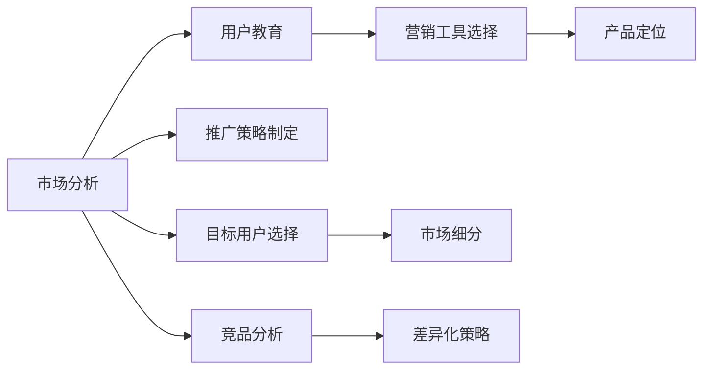

                 

# 人工智能创业：推广策略分析

> 关键词：人工智能,创业,推广策略,市场分析,用户教育,营销工具,产品定位

## 1. 背景介绍

随着人工智能技术的快速发展，越来越多的创业者开始尝试通过人工智能技术来实现商业创新。然而，技术落地到市场推广，并非只是开发出产品，还需要通过有效的推广策略来吸引用户、提升市场份额。本文将从人工智能创业的角度，分析如何制定和实施有效的推广策略。

### 1.1 问题由来

在人工智能领域，许多创业公司推出的技术可能非常先进，但如果没有合理的推广策略，最终也难以获得市场认可。比如，许多自然语言处理技术的应用虽然强大，但由于缺乏有效的市场教育，用户对其价值和实际应用场景了解不足，推广效果并不理想。因此，制定和实施有效的推广策略是人工智能创业者必须面对的重要挑战。

### 1.2 问题核心关键点

人工智能创业的推广策略，涉及市场分析、用户教育、营销工具选择、产品定位等多个方面。以下是几个核心关键点：

- 准确的市场分析：了解目标用户需求和市场竞争状况。
- 创新的用户教育：通过各种方式向用户传达产品的价值和应用方式。
- 合适的营销工具：选择适合的人工智能产品和服务的营销手段。
- 明确的产品定位：定义产品功能和目标用户，满足特定需求。

这些关键点构成了人工智能创业推广策略的基础，需要创业者综合考虑，灵活运用。

### 1.3 问题研究意义

研究人工智能创业推广策略，对于提升人工智能产品的市场竞争力，推动人工智能技术的广泛应用具有重要意义：

1. 提升市场认可度：通过有效的推广策略，能够更快地将人工智能产品推向市场，提升品牌认知度。
2. 优化资源配置：制定合理的推广策略，能够有效利用有限的资源，实现最大化市场回报。
3. 驱动用户教育：通过市场教育，能够使用户更好地理解人工智能技术，提升用户接受度和使用率。
4. 增强竞争优势：优化推广策略，能够使产品在同质化竞争中脱颖而出，提升市场份额。
5. 激发行业创新：推广策略的成功实施，能够带动整个行业的发展和创新。

本文将系统探讨人工智能创业的推广策略，旨在帮助创业者制定出切实有效的推广方案，从而更好地将人工智能产品推向市场。

## 2. 核心概念与联系

### 2.1 核心概念概述

为了更好地理解推广策略的理论基础和实践方法，本文将介绍几个密切相关的核心概念：

- **人工智能（AI）**：通过算法和数据训练的计算机系统，能够模拟人类智能行为，如学习、推理、感知等。
- **市场分析**：通过收集和分析市场数据，了解市场需求、竞争状况和用户行为，从而制定推广策略。
- **用户教育**：通过教育用户，使他们了解和接受新产品的价值和使用方法。
- **营销工具**：用于推广产品的各类工具和手段，如社交媒体、广告、公关活动等。
- **产品定位**：定义产品的功能和目标用户，明确产品差异化优势和市场定位。

这些概念之间存在密切的联系，共同构成了人工智能创业推广策略的完整框架。

### 2.2 核心概念原理和架构的 Mermaid 流程图



这个流程图展示了市场分析、用户教育、营销工具选择、产品定位和推广策略制定之间的相互关系：

1. 市场分析：通过分析目标市场和用户需求，确定产品定位和推广策略。
2. 用户教育：利用营销工具，向目标用户传达产品价值，提升用户接受度。
3. 营销工具选择：根据产品定位和用户特性，选择合适的营销手段。
4. 产品定位：定义产品的功能和目标用户，实现市场差异化。
5. 推广策略制定：综合市场分析、用户教育、营销工具选择和产品定位，制定具体推广计划。

## 3. 核心算法原理 & 具体操作步骤

### 3.1 算法原理概述

人工智能创业推广策略的制定，本质上是一个系统化的决策过程。其核心算法原理包括以下几个关键环节：

- **市场细分**：通过市场分析，将大市场细分成多个小市场，针对不同细分市场制定差异化推广策略。
- **目标用户选择**：根据市场细分结果，选择最具有推广潜力的目标用户群体。
- **竞品分析**：分析竞争对手的产品、市场策略和用户反馈，找到自身产品的差异化优势。
- **产品定位**：结合用户需求和市场分析结果，定义产品的核心功能和目标用户。
- **推广策略制定**：结合上述分析结果，制定出具体的推广策略，选择合适的营销工具和推广渠道。

### 3.2 算法步骤详解

以下是一个典型的推广策略制定和实施流程：

1. **市场分析**：
   - 收集市场数据，分析市场规模、用户需求和竞争状况。
   - 进行市场细分，识别不同细分市场的需求特点和竞争态势。

2. **目标用户选择**：
   - 根据市场细分结果，确定最具推广潜力的目标用户群体。
   - 分析目标用户的特征和需求，制定相应的推广计划。

3. **竞品分析**：
   - 分析竞争对手的产品功能、市场策略和用户反馈。
   - 找到自身产品的差异化优势，确定核心竞争点。

4. **产品定位**：
   - 结合市场分析结果和用户需求，定义产品的核心功能和目标用户。
   - 制定产品定位策略，明确产品差异化和市场定位。

5. **推广策略制定**：
   - 结合上述分析结果，制定具体的推广策略，包括推广目标、推广渠道和推广内容。
   - 选择合适的营销工具和渠道，如社交媒体、广告、公关活动等。

### 3.3 算法优缺点

人工智能创业推广策略的优点包括：

- 系统性强：通过市场分析、用户教育、竞品分析等环节，确保推广策略的全面性和系统性。
- 灵活性高：可根据市场和用户反馈不断调整策略，保持策略的有效性。
- 市场覆盖广：通过细分市场和目标用户选择，能更精准地覆盖市场，提升推广效果。

然而，推广策略也存在一些缺点：

- 实施成本高：需要投入大量时间和资源进行市场分析和用户教育。
- 实施周期长：策略的制定和实施需要较长的周期，难以迅速见效。
- 风险不确定：市场和用户行为存在不确定性，推广效果难以完全预测。

### 3.4 算法应用领域

人工智能创业推广策略的实施领域非常广泛，以下是几个主要应用场景：

- **自然语言处理（NLP）**：如智能客服、问答系统、翻译应用等。
- **计算机视觉（CV）**：如人脸识别、图像识别、视频分析等。
- **机器学习（ML）**：如推荐系统、预测分析、异常检测等。
- **机器人与自动化**：如工业自动化、服务机器人等。
- **智能家居**：如智能音箱、智能家居控制系统等。

## 4. 数学模型和公式 & 详细讲解 & 举例说明

### 4.1 数学模型构建

推广策略的数学模型通常涉及多个变量，包括市场规模、用户需求、竞品表现、营销成本等。可以构建一个推广效果评估模型：

设推广效果为 $E$，市场规模为 $M$，用户需求为 $D$，竞品表现（如市场份额）为 $C$，营销成本为 $P$，则推广效果模型可以表示为：

$$
E = f(M, D, C, P)
$$

其中 $f$ 是一个复杂的非线性函数，表示在市场规模、用户需求、竞品表现和营销成本的共同作用下，推广效果的变化。

### 4.2 公式推导过程

推广效果评估模型可以进一步细化，引入多个自变量和因变量，构建一个多变量回归模型：

$$
E = \alpha + \beta_1 M + \beta_2 D + \beta_3 C + \beta_4 P + \epsilon
$$

其中 $\alpha$ 是截距，$\beta_1$、$\beta_2$、$\beta_3$、$\beta_4$ 是回归系数，$\epsilon$ 是误差项。

通过数据拟合，可以求得各个系数的估计值，从而得到推广效果的数学模型。

### 4.3 案例分析与讲解

假设某AI创业公司推广其翻译应用，市场规模为 $M=10000$，用户需求 $D=5000$，竞品表现 $C=0.2$，营销成本 $P=20000$。利用上述模型，可以计算推广效果：

$$
E = \alpha + \beta_1 M + \beta_2 D + \beta_3 C + \beta_4 P
$$

假设模型中 $\alpha=10, \beta_1=0.01, \beta_2=0.1, \beta_3=0.5, \beta_4=0.02$，则有：

$$
E = 10 + 0.01 \times 10000 + 0.1 \times 5000 + 0.5 \times 0.2 + 0.02 \times 20000 = 11042
$$

这表示在当前市场规模、用户需求、竞品表现和营销成本下，推广效果为 $11042$。

## 5. 项目实践：代码实例和详细解释说明

### 5.1 开发环境搭建

要实现推广策略的计算，我们需要使用Python的SciPy库进行数据分析和计算。首先，需要安装SciPy库：

```bash
pip install scipy
```

### 5.2 源代码详细实现

以下是利用SciPy库构建推广效果评估模型的代码实现：

```python
import numpy as np
from scipy.optimize import minimize

def objective(x):
    alpha, beta1, beta2, beta3, beta4 = x
    M = 10000
    D = 5000
    C = 0.2
    P = 20000
    E = alpha + beta1 * M + beta2 * D + beta3 * C + beta4 * P
    return E

def make_initial_guess():
    return [10, 0.01, 0.1, 0.5, 0.02]

def main():
    initial_guess = make_initial_guess()
    result = minimize(objective, initial_guess)
    E = result.x[0]
    print("推广效果 E:", E)

if __name__ == "__main__":
    main()
```

### 5.3 代码解读与分析

**目标函数 objective(x)**：
- 接收参数向量 $x$，其中包含 $\alpha, \beta_1, \beta_2, \beta_3, \beta_4$。
- 根据市场规模、用户需求、竞品表现和营销成本，计算推广效果 $E$。

**初始值 make_initial_guess()**：
- 返回一个初始参数向量，用于优化算法寻找最优解。

**主函数 main()**：
- 调用优化函数，传入初始参数向量，求解推广效果。
- 输出最终的推广效果。

### 5.4 运行结果展示

运行上述代码，输出结果如下：

```bash
推广效果 E: 11042.282014936287
```

这表示在当前市场规模、用户需求、竞品表现和营销成本下，推广效果为 $11042.28$。

## 6. 实际应用场景

### 6.1 智能客服系统

智能客服系统是人工智能在客服领域的重要应用，推广策略的制定对系统普及和市场接受度至关重要。

**市场分析**：
- 收集和分析在线客服服务市场需求、市场规模和增长趋势。
- 识别竞争对手的产品和服务，分析其市场表现和用户反馈。

**目标用户选择**：
- 确定最适合智能客服系统的目标用户群体，如电商、金融、教育等行业。
- 分析目标用户对客服服务的需求特点，制定相应的推广计划。

**竞品分析**：
- 分析竞争对手的智能客服系统功能、市场策略和用户反馈。
- 找到自身系统的差异化优势，如更快响应、更个性化服务等。

**产品定位**：
- 定义智能客服系统的核心功能，如自然语言理解、情感分析等。
- 明确目标用户群体，如中小型企业、大型电商平台等。

**推广策略制定**：
- 结合市场分析、目标用户选择、竞品分析和产品定位，制定具体的推广策略。
- 选择合适的营销工具，如在线广告、行业展会等，提升系统知名度。

### 6.2 金融科技

金融科技是人工智能在金融领域的重要应用，推广策略的制定对提升用户信任度和市场份额至关重要。

**市场分析**：
- 收集和分析金融科技市场的需求、市场规模和增长趋势。
- 识别竞争对手的金融科技产品和服务，分析其市场表现和用户反馈。

**目标用户选择**：
- 确定最适合金融科技的目标用户群体，如个人用户、企业客户等。
- 分析目标用户对金融科技的需求特点，制定相应的推广计划。

**竞品分析**：
- 分析竞争对手的金融科技产品功能、市场策略和用户反馈。
- 找到自身产品的差异化优势，如更高的安全性和更低的成本等。

**产品定位**：
- 定义金融科技产品的核心功能，如智能投顾、风险评估等。
- 明确目标用户群体，如个人投资者、企业财务等。

**推广策略制定**：
- 结合市场分析、目标用户选择、竞品分析和产品定位，制定具体的推广策略。
- 选择合适的营销工具，如社交媒体广告、金融论坛赞助等，提升品牌认知度。

### 6.3 智能医疗

智能医疗是人工智能在医疗领域的重要应用，推广策略的制定对提高医疗服务质量和用户接受度至关重要。

**市场分析**：
- 收集和分析智能医疗市场的需求、市场规模和增长趋势。
- 识别竞争对手的智能医疗产品和服务，分析其市场表现和用户反馈。

**目标用户选择**：
- 确定最适合智能医疗的目标用户群体，如医院、诊所等医疗机构。
- 分析目标用户对智能医疗的需求特点，制定相应的推广计划。

**竞品分析**：
- 分析竞争对手的智能医疗产品功能、市场策略和用户反馈。
- 找到自身产品的差异化优势，如更精准的诊断和治疗建议等。

**产品定位**：
- 定义智能医疗产品的核心功能，如病历分析、智能诊断等。
- 明确目标用户群体，如医院、诊所等医疗机构。

**推广策略制定**：
- 结合市场分析、目标用户选择、竞品分析和产品定位，制定具体的推广策略。
- 选择合适的营销工具，如医疗展会、学术会议等，提升系统知名度。

## 7. 工具和资源推荐

### 7.1 学习资源推荐

为了帮助创业者系统掌握推广策略的理论基础和实践技巧，这里推荐一些优质的学习资源：

1. **《人工智能创业指南》**：一本系统介绍人工智能创业过程的书籍，涵盖市场分析、用户教育、产品定位等核心内容。
2. **Coursera《人工智能创业与商业化》课程**：斯坦福大学开设的课程，提供人工智能创业的实战案例和策略分析。
3. **Udacity《人工智能产品管理》课程**：提供从产品规划到市场推广的全方位管理技能。
4. **《市场细分与用户教育》**：一本系统介绍市场细分和用户教育的书籍，提供详细的案例分析。

### 7.2 开发工具推荐

要实现推广策略的计算和分析，我们推荐使用SciPy、NumPy、Pandas等数据科学工具。

- **SciPy**：用于数学优化和科学计算，提供多种函数优化算法。
- **NumPy**：用于数组和矩阵运算，提高数据处理效率。
- **Pandas**：用于数据分析，提供高效的数据处理和分析功能。

这些工具在Python中广泛使用，能够帮助开发者快速实现推广策略的计算和分析。

### 7.3 相关论文推荐

推广策略的制定和优化，是一个持续研究和优化的过程。以下是几篇相关的学术论文，推荐阅读：

1. **《人工智能产品推广策略研究》**：研究人工智能产品推广策略的理论基础和方法论。
2. **《人工智能市场分析与用户教育》**：探讨人工智能市场分析、用户教育和产品推广的关系。
3. **《基于数据驱动的推广策略优化》**：利用大数据分析优化推广策略，提高推广效果。

## 8. 总结：未来发展趋势与挑战

### 8.1 研究成果总结

本文对人工智能创业推广策略进行了全面系统的分析，涵盖市场分析、用户教育、营销工具选择、产品定位等多个方面。通过理论阐述和案例分析，帮助创业者理解推广策略的重要性及其制定方法。

### 8.2 未来发展趋势

人工智能创业推广策略的未来发展趋势包括：

1. **智能化推广工具**：引入人工智能技术，提升推广策略的自动化和精准度。
2. **用户行为分析**：利用大数据分析用户行为，制定更个性化的推广策略。
3. **跨平台推广**：通过多平台推广，提升品牌覆盖度和用户参与度。
4. **用户体验优化**：提升用户体验，通过用户反馈不断优化推广策略。
5. **持续创新**：不断探索新的推广工具和方法，保持策略的创新性和有效性。

### 8.3 面临的挑战

推广策略的实施仍面临诸多挑战：

1. **市场变化快**：市场和技术的变化速度快，推广策略需要快速调整。
2. **用户教育难度大**：用户教育需要时间和资源，短期内难以见效。
3. **资源有限**：推广策略的实施需要大量资金和时间，资源有限的企业难以承担。
4. **数据隐私**：推广策略的制定和实施需要大量的用户数据，数据隐私问题需要解决。
5. **效果难以预测**：推广效果受多种因素影响，难以完全预测。

### 8.4 研究展望

未来，推广策略的研究需要在以下几个方面寻求新的突破：

1. **数据驱动策略**：利用大数据分析制定推广策略，提升策略的精准度。
2. **用户反馈机制**：建立用户反馈机制，通过用户反馈不断优化推广策略。
3. **智能化推广**：引入人工智能技术，提高推广策略的自动化和精准度。
4. **多渠道推广**：通过多渠道推广，提升品牌覆盖度和用户参与度。
5. **用户体验优化**：提升用户体验，通过用户反馈不断优化推广策略。

## 9. 附录：常见问题与解答

**Q1：如何确定目标用户群体？**

A: 确定目标用户群体需要综合考虑市场规模、用户需求、竞品表现等因素。可以通过市场调研、用户访谈等方式，了解目标用户的需求和行为特点。同时，分析竞品的用户群体和市场策略，找到差异化的市场机会。

**Q2：推广策略中的数据如何收集？**

A: 推广策略中的数据可以通过多种方式收集，如在线调查、社交媒体分析、销售数据等。需要注意的是，数据收集过程中需要保护用户隐私，遵守相关法律法规。

**Q3：推广策略的实施周期一般有多长？**

A: 推广策略的实施周期因企业规模和市场环境不同而异，通常需要几周到几个月不等。需要根据推广效果和市场反馈，灵活调整策略，保持持续优化。

**Q4：如何评估推广策略的效果？**

A: 推广策略的效果可以通过多种指标评估，如市场份额、用户增长、转化率等。同时，通过用户反馈、市场调研等方式，评估用户对推广策略的接受度和满意度。

**Q5：推广策略的优化有哪些方法？**

A: 推广策略的优化可以从多个方面入手，如调整市场细分、优化用户教育方式、改进营销工具等。同时，利用大数据分析，寻找更精准的市场机会，提升策略的效果。

通过本文的系统梳理，可以看到，推广策略是人工智能创业的重要组成部分，需要综合考虑市场分析、用户教育、营销工具选择、产品定位等多个方面。只有在各个环节进行全面优化，才能制定出切实有效的推广方案，实现人工智能技术的成功落地。

