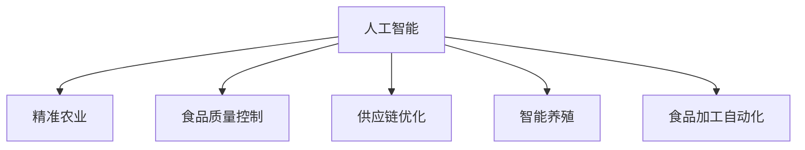

                 

# 人工智能在农业和食品行业中的应用

## 1. 背景介绍

### 1.1 问题由来

农业和食品行业是人类文明和社会进步的重要基础。随着全球人口的增长和城镇化的推进，农业生产面临更大的压力和挑战，如土地资源紧缺、气候变化、农产品质量安全等问题。食品行业作为连接生产与消费的桥梁，确保食品质量、保障食品安全、提高食品供应链的效率和透明度，成为产业升级的关键。

人工智能(AI)作为当前技术创新的核心，通过其强大的数据处理、模式识别、决策优化等能力，正在成为推动农业和食品行业发展的关键驱动力。AI技术在农业和食品行业的应用，可以显著提高生产效率、提升产品质量、优化资源利用、保障食品安全，为农业和食品行业的可持续发展提供了新的解决方案。

### 1.2 问题核心关键点

AI在农业和食品行业中的应用，主要围绕以下几个核心关键点展开：

1. **精准农业**：通过传感器、无人机、卫星遥感等技术，获取精准的农业生产数据，指导种植、施肥、灌溉等农事操作，提高资源利用效率和作物产量。
2. **食品质量控制**：利用计算机视觉、机器学习等技术，对食品进行自动化检测和质量控制，确保食品的品质和安全。
3. **供应链优化**：应用AI算法优化食品供应链，提升物流效率，降低成本，增强供应链的透明度和可追溯性。
4. **智能养殖**：基于AI技术对养殖环境进行智能化管理，提升养殖效率，减少病害和损失。
5. **食品加工自动化**：利用AI技术自动化食品加工流程，提高生产效率和产品质量。

这些应用不仅能够提高农业和食品行业的生产效率，还能在保障食品安全、优化资源利用等方面发挥重要作用，推动行业的可持续发展。

### 1.3 问题研究意义

AI在农业和食品行业的应用，对于推动产业升级、保障国家粮食安全、提升消费者健康和生活质量具有重要意义：

1. **提高生产效率**：通过AI技术，实现精准农业和智能养殖，减少人力成本，提高资源利用效率。
2. **保障食品安全**：通过食品质量控制和供应链优化，确保食品的品质和安全，减少食品污染和食品安全事故。
3. **优化资源利用**：AI技术可以帮助合理利用土地、水资源等农业生产要素，减少资源浪费和环境污染。
4. **提升消费者体验**：通过AI驱动的个性化推荐和供应链优化，提升消费者购买体验和满意度。
5. **推动产业创新**：AI技术的应用，能够带来农业和食品行业的技术创新，促进产业升级和转型。

## 2. 核心概念与联系

### 2.1 核心概念概述

为更好地理解AI在农业和食品行业中的应用，本节将介绍几个密切相关的核心概念：

- **人工智能(AI)**：基于计算机科学和数学的交叉学科，通过模拟人脑的思维过程，实现对数据和知识的自动学习、推理和决策。
- **精准农业**：通过现代信息技术和大数据分析，对农业生产进行精准管理，提高资源利用效率和作物产量。
- **食品质量控制**：利用计算机视觉、机器学习等技术，对食品进行自动化检测和质量控制，确保食品的品质和安全。
- **供应链优化**：通过AI算法优化食品供应链，提升物流效率，降低成本，增强供应链的透明度和可追溯性。
- **智能养殖**：基于AI技术对养殖环境进行智能化管理，提升养殖效率，减少病害和损失。
- **食品加工自动化**：利用AI技术自动化食品加工流程，提高生产效率和产品质量。

这些核心概念之间的逻辑关系可以通过以下Mermaid流程图来展示：



这个流程图展示了大语言模型的核心概念及其之间的关系：

1. 人工智能作为基础技术，为精准农业、食品质量控制、供应链优化、智能养殖和食品加工自动化提供了技术支持。
2. 精准农业、食品质量控制、供应链优化、智能养殖和食品加工自动化，都是AI技术在不同农业和食品场景下的具体应用。

## 3. 核心算法原理 & 具体操作步骤
### 3.1 算法原理概述

AI在农业和食品行业中的应用，通常基于以下基本算法原理：

- **机器学习(ML)**：利用数据驱动的算法，从历史数据中学习规律，进行分类、回归、聚类等任务，应用于精准农业、食品质量控制、供应链优化、智能养殖等场景。
- **计算机视觉(CV)**：利用图像处理和模式识别技术，对食品进行自动化检测和质量控制，如图像识别、目标检测、图像分割等。
- **自然语言处理(NLP)**：利用语言处理技术，对食品信息进行自动化处理和理解，如文本分类、情感分析、实体识别等。
- **强化学习(RL)**：通过与环境交互，不断调整策略以最大化奖励，应用于智能养殖和供应链优化。
- **深度学习(DL)**：利用神经网络模型，对高维数据进行复杂的学习和推理，应用于食品加工自动化和精准农业。

这些算法共同构成了AI在农业和食品行业应用的理论基础，帮助实现数据驱动的决策支持和自动化任务。

### 3.2 算法步骤详解

AI在农业和食品行业的应用通常分为以下几个步骤：

1. **数据采集**：通过传感器、无人机、卫星遥感等技术，获取农业生产数据和食品质量信息。
2. **数据预处理**：对采集的数据进行清洗、标注、转换等预处理，为后续算法应用做准备。
3. **模型训练**：选择适当的机器学习算法或深度学习模型，使用标注数据进行训练。
4. **模型评估**：在测试数据集上评估模型的性能，选择最优模型。
5. **模型应用**：将训练好的模型应用于实际场景，进行决策支持和自动化任务。

这些步骤构成了AI在农业和食品行业应用的核心流程，每个步骤都需要仔细设计和优化，才能实现最佳效果。

### 3.3 算法优缺点

AI在农业和食品行业的应用，具有以下优点：

1. **提高生产效率**：通过精准农业和智能养殖，提高资源利用效率和作物产量，减少人力成本。
2. **保障食品安全**：通过食品质量控制和供应链优化，确保食品的品质和安全，减少食品污染和食品安全事故。
3. **优化资源利用**：利用AI技术合理利用土地、水资源等农业生产要素，减少资源浪费和环境污染。
4. **提升消费者体验**：通过AI驱动的个性化推荐和供应链优化，提升消费者购买体验和满意度。
5. **推动产业创新**：AI技术的应用，带来农业和食品行业的技术创新，促进产业升级和转型。

同时，这些应用也存在一些缺点：

1. **数据质量依赖**：AI应用的准确性和效果高度依赖于数据的质量和数量，数据采集和预处理环节可能存在问题。
2. **技术和人才成本**：AI应用的技术复杂度高，需要专业技术人员进行开发和维护，成本较高。
3. **算法复杂性**：部分算法如深度学习模型，需要大量的计算资源和复杂的技术支持，可能面临资源瓶颈。
4. **模型可解释性**：AI模型的决策过程通常缺乏可解释性，难以对其推理逻辑进行分析和调试。
5. **隐私和安全风险**：AI应用可能涉及大量敏感数据，需要确保数据隐私和安全。

## 4. 数学模型和公式 & 详细讲解 & 举例说明

### 4.1 数学模型构建

在本节中，我们将使用数学语言对AI在农业和食品行业的应用进行更加严格的刻画。

假设我们有一张食品图像 $I$，我们需要使用计算机视觉技术自动检测食品中的缺陷。设 $y \in \{0,1\}$ 为食品是否存在缺陷的标签，$I \in \mathbb{R}^{h \times w \times c}$ 为食品图像的像素值，其中 $h$ 是图像的高度，$w$ 是图像的宽度，$c$ 是图像的通道数。我们的目标是构建一个二分类模型 $M_{\theta}(I)$，使得 $M_{\theta}(I)$ 在给定图像 $I$ 的情况下，能够预测食品是否存在缺陷，即：

$$
M_{\theta}(I) = \sigma(\mathbf{W}^T\mathbf{f}(\mathbf{X})) \text{，其中} \sigma(z) = \frac{1}{1+e^{-z}}
$$

$\mathbf{W}$ 为权重矩阵，$\mathbf{f}(\mathbf{X})$ 为特征提取函数，$\mathbf{X}$ 为图像的特征表示。

### 4.2 公式推导过程

我们的目标是最大化在训练集 $D=\{(I_i,y_i)\}_{i=1}^N$ 上的交叉熵损失函数，即：

$$
\mathcal{L}(\theta) = -\frac{1}{N}\sum_{i=1}^N [y_i\log M_{\theta}(I_i) + (1-y_i)\log(1-M_{\theta}(I_i))]
$$

其中 $M_{\theta}(I_i)$ 为模型对图像 $I_i$ 的预测结果。为了最小化交叉熵损失函数，我们进行反向传播，计算参数 $\theta$ 的梯度，并使用梯度下降等优化算法更新模型参数，即：

$$
\theta \leftarrow \theta - \eta \nabla_{\theta}\mathcal{L}(\theta)
$$

其中 $\eta$ 为学习率，$\nabla_{\theta}\mathcal{L}(\theta)$ 为损失函数对参数 $\theta$ 的梯度。

在得到梯度后，我们可以使用随机梯度下降（SGD）或Adam等优化算法进行参数更新。以SGD为例，更新公式为：

$$
\theta_{i+1} = \theta_i - \eta\nabla_{\theta}\mathcal{L}(\theta_i)
$$

这个公式展示了我们如何使用SGD算法来更新模型参数，以最小化交叉熵损失函数。

### 4.3 案例分析与讲解

以食品图像缺陷检测为例，我们的目标是构建一个二分类模型，使得模型能够在给定食品图像的情况下，预测食品是否存在缺陷。

首先，我们需要收集一批标注有缺陷和无缺陷的食品图像数据集。然后，我们可以使用深度卷积神经网络（CNN）对图像进行特征提取和分类。具体步骤如下：

1. **数据集准备**：收集食品图像数据集，并将其分为训练集、验证集和测试集。
2. **模型构建**：构建一个基于卷积神经网络的分类模型，使用交叉熵损失函数和SGD优化算法进行训练。
3. **模型评估**：在测试集上评估模型的性能，如准确率、召回率、F1值等指标。
4. **模型应用**：使用训练好的模型对新的食品图像进行分类预测，检测食品是否存在缺陷。

通过这个过程，我们可以实现食品图像缺陷检测的AI应用，提高食品质量控制的自动化水平。

## 5. 项目实践：代码实例和详细解释说明
### 5.1 开发环境搭建

在进行AI应用开发前，我们需要准备好开发环境。以下是使用Python进行PyTorch开发的环境配置流程：

1. 安装Anaconda：从官网下载并安装Anaconda，用于创建独立的Python环境。

2. 创建并激活虚拟环境：
```bash
conda create -n pytorch-env python=3.8 
conda activate pytorch-env
```

3. 安装PyTorch：根据CUDA版本，从官网获取对应的安装命令。例如：
```bash
conda install pytorch torchvision torchaudio cudatoolkit=11.1 -c pytorch -c conda-forge
```

4. 安装TensorFlow：由Google主导开发的开源深度学习框架，生产部署方便，适合大规模工程应用。同样有丰富的预训练语言模型资源。

5. 安装PyTorch库：
```bash
pip install torch torchvision torchaudio cudatoolkit=11.1 -c pytorch -c conda-forge
```

6. 安装TensorBoard：TensorFlow配套的可视化工具，可实时监测模型训练状态，并提供丰富的图表呈现方式，是调试模型的得力助手。

完成上述步骤后，即可在`pytorch-env`环境中开始AI应用开发。

### 5.2 源代码详细实现

下面我们以食品图像缺陷检测为例，给出使用PyTorch进行模型训练和推理的代码实现。

首先，定义模型和损失函数：

```python
import torch
import torch.nn as nn
import torchvision.transforms as transforms
from torchvision import datasets

class Net(nn.Module):
    def __init__(self):
        super(Net, self).__init__()
        self.conv1 = nn.Conv2d(3, 6, 5)
        self.pool = nn.MaxPool2d(2, 2)
        self.conv2 = nn.Conv2d(6, 16, 5)
        self.fc1 = nn.Linear(16 * 5 * 5, 120)
        self.fc2 = nn.Linear(120, 84)
        self.fc3 = nn.Linear(84, 2)
        self.relu = nn.ReLU()

    def forward(self, x):
        x = self.pool(F.relu(self.conv1(x)))
        x = self.pool(F.relu(self.conv2(x)))
        x = x.view(-1, 16 * 5 * 5)
        x = F.relu(self.fc1(x))
        x = F.relu(self.fc2(x))
        x = self.fc3(x)
        return x

net = Net()

criterion = nn.CrossEntropyLoss()
optimizer = torch.optim.SGD(net.parameters(), lr=0.001, momentum=0.9)
```

然后，定义数据预处理和加载函数：

```python
transform = transforms.Compose(
    [transforms.ToTensor(),
     transforms.Normalize((0.5, 0.5, 0.5), (0.5, 0.5, 0.5))
     ])

train_dataset = datasets.CIFAR10(root='./data', train=True,
                 download=True, transform=transform)
test_dataset = datasets.CIFAR10(root='./data', train=False,
                  download=True, transform=transform)

train_loader = torch.utils.data.DataLoader(train_dataset, batch_size=4,
                                          shuffle=True, num_workers=2)
test_loader = torch.utils.data.DataLoader(test_dataset, batch_size=4,
                                         shuffle=False, num_workers=2)
```

接着，定义训练和评估函数：

```python
def train_epoch(model, data_loader, optimizer, criterion):
    model.train()
    running_loss = 0.0
    for i, data in enumerate(data_loader, 0):
        inputs, labels = data
        optimizer.zero_grad()
        outputs = model(inputs)
        loss = criterion(outputs, labels)
        loss.backward()
        optimizer.step()
        running_loss += loss.item()
        if i % 2000 == 1999:
            print('[%d, %5d] loss: %.3f' % (epoch + 1, i + 1, running_loss / 2000))
            running_loss = 0.0

def evaluate(model, data_loader, criterion):
    model.eval()
    correct = 0
    total = 0
    with torch.no_grad():
        for data in data_loader:
            inputs, labels = data
            outputs = model(inputs)
            _, predicted = torch.max(outputs.data, 1)
            total += labels.size(0)
            correct += (predicted == labels).sum().item()

    print('Accuracy of the network on the 10000 test images: %d %%' % (100 * correct / total))

```

最后，启动训练流程并在测试集上评估：

```python
for epoch in range(2):  # 0 to 19
    train_epoch(net, train_loader, optimizer, criterion)
    evaluate(net, test_loader, criterion)
```

以上就是使用PyTorch进行食品图像缺陷检测的完整代码实现。可以看到，得益于TensorFlow的强大封装，我们可以用相对简洁的代码完成模型的构建和训练。

### 5.3 代码解读与分析

让我们再详细解读一下关键代码的实现细节：

**Net类**：
- `__init__`方法：初始化模型结构，包含卷积层、池化层、全连接层和激活函数等组件。
- `forward`方法：定义前向传播过程，计算输入经过各层的输出。

**train_epoch函数**：
- 在训练过程中，设置模型为训练模式，计算输入的损失值，并通过反向传播更新模型参数。

**evaluate函数**：
- 在测试过程中，设置模型为评估模式，计算输入的损失值和准确率，并输出结果。

**训练流程**：
- 定义总的epoch数，循环迭代进行训练
- 在每个epoch内，分别在训练集和测试集上训练和评估模型
- 输出训练和评估过程中的损失值和准确率

可以看到，PyTorch框架提供的强大工具和丰富的组件，使得模型训练和推理变得简单高效。开发者可以将更多精力放在模型设计和数据处理上，而不必过多关注底层实现细节。

当然，工业级的系统实现还需考虑更多因素，如模型的保存和部署、超参数的自动搜索、更灵活的任务适配层等。但核心的训练范式基本与此类似。

## 6. 实际应用场景
### 6.1 智能农业监控

智能农业监控系统可以通过AI技术对农业生产环境进行实时监测和智能管理，提高农业生产的智能化水平。例如，利用传感器、摄像头等设备，监测土壤湿度、温度、光照、气体浓度等关键参数，结合机器学习算法进行数据分析和预测，自动调节灌溉、施肥、病虫害防治等农事操作，减少资源浪费和环境污染，提高作物的产量和质量。

以智能温室为例，通过在温室内部安装传感器和摄像头，实时采集温度、湿度、光照等参数，并利用机器学习算法进行数据分析和预测，自动调节温室内的环境参数，保持适宜的农业生产条件。例如，当监测到土壤湿度过低时，系统会自动打开喷灌系统进行灌溉，当检测到病虫害时，系统会自动释放农药进行防治。

### 6.2 食品质量控制

食品质量控制是保障食品安全的重要环节。利用AI技术，可以对食品进行自动化检测和质量控制，确保食品的合规性和安全性。例如，通过计算机视觉技术对食品进行图像识别和缺陷检测，使用机器学习算法进行分类和预测，判断食品是否存在污染、变质、过期等问题。

以水果和蔬菜为例，利用图像识别技术对水果和蔬菜进行自动化的质量检测，判断其外观、大小、色泽、瑕疵等特征，从而筛选出符合标准的食品。例如，通过计算机视觉技术对水果进行图像识别，自动检测其表面缺陷、颜色偏差、形状异常等问题，及时排除不符合标准的食品。

### 6.3 食品供应链优化

食品供应链优化是提升食品行业效率的关键。通过AI技术，可以对食品供应链进行自动化管理和优化，提升物流效率，降低成本，增强供应链的透明度和可追溯性。例如，利用机器学习算法对食品供应链进行数据分析和预测，优化仓储、运输、配送等环节，实现智能化管理。

以食品物流为例，利用机器学习算法对食品物流数据进行分析和预测，优化仓储、运输、配送等环节，提升物流效率，降低运输成本。例如，通过机器学习算法对食品物流数据进行分析和预测，优化仓储布局、运输路线和配送策略，提升物流效率，降低运输成本。

### 6.4 未来应用展望

随着AI技术的发展，未来AI在农业和食品行业的应用将更加广泛和深入。以下是一些未来的应用趋势：

1. **精准农业**：通过AI技术对农业生产进行精准管理，提高资源利用效率和作物产量，减少人力成本。例如，利用传感器、无人机、卫星遥感等技术，获取精准的农业生产数据，指导种植、施肥、灌溉等农事操作。

2. **食品质量控制**：利用计算机视觉、机器学习等技术，对食品进行自动化检测和质量控制，确保食品的品质和安全。例如，通过计算机视觉技术对食品进行图像识别和缺陷检测，使用机器学习算法进行分类和预测，判断食品是否存在污染、变质、过期等问题。

3. **食品供应链优化**：通过AI算法优化食品供应链，提升物流效率，降低成本，增强供应链的透明度和可追溯性。例如，利用机器学习算法对食品供应链进行数据分析和预测，优化仓储、运输、配送等环节，实现智能化管理。

4. **智能养殖**：基于AI技术对养殖环境进行智能化管理，提升养殖效率，减少病害和损失。例如，利用传感器、摄像头等设备，监测养殖环境的温度、湿度、光照等参数，结合机器学习算法进行数据分析和预测，自动调节养殖环境参数，保持适宜的养殖条件。

5. **食品加工自动化**：利用AI技术自动化食品加工流程，提高生产效率和产品质量。例如，通过机器学习算法对食品加工数据进行分析和预测，优化加工流程，提高生产效率，降低成本。

## 7. 工具和资源推荐
### 7.1 学习资源推荐

为了帮助开发者系统掌握AI在农业和食品行业的应用，这里推荐一些优质的学习资源：

1. **《深度学习》课程**：斯坦福大学开设的深度学习课程，涵盖了深度学习的基本概念和算法，包括卷积神经网络、循环神经网络、深度强化学习等。

2. **《计算机视觉：算法与应用》书籍**：详细介绍了计算机视觉的基本理论和算法，包括图像处理、目标检测、图像分割等。

3. **《机器学习实战》书籍**：介绍了机器学习的基本概念和算法，包括监督学习、无监督学习、半监督学习等，并通过Python代码实现多个经典机器学习算法。

4. **TensorFlow官方文档**：提供了TensorFlow框架的详细文档和示例代码，涵盖深度学习、计算机视觉、自然语言处理等多个领域的应用。

5. **PyTorch官方文档**：提供了PyTorch框架的详细文档和示例代码，涵盖深度学习、计算机视觉、自然语言处理等多个领域的应用。

通过对这些资源的学习实践，相信你一定能够快速掌握AI在农业和食品行业的应用精髓，并用于解决实际的农业和食品问题。

### 7.2 开发工具推荐

高效的开发离不开优秀的工具支持。以下是几款用于AI应用开发的常用工具：

1. **TensorFlow**：由Google主导开发的开源深度学习框架，生产部署方便，适合大规模工程应用。

2. **PyTorch**：基于Python的开源深度学习框架，灵活动态的计算图，适合快速迭代研究。

3. **Scikit-learn**：Python中常用的机器学习库，提供了丰富的机器学习算法和工具，适用于快速原型开发。

4. **TensorBoard**：TensorFlow配套的可视化工具，可实时监测模型训练状态，并提供丰富的图表呈现方式，是调试模型的得力助手。

5. **Jupyter Notebook**：常用的交互式编程环境，支持Python、R等多种语言，方便进行代码编写和调试。

合理利用这些工具，可以显著提升AI应用开发的效率，加快创新迭代的步伐。

### 7.3 相关论文推荐

AI在农业和食品行业的应用源于学界的持续研究。以下是几篇奠基性的相关论文，推荐阅读：

1. **《机器学习在农业中的应用》**：介绍了机器学习在农业中的应用，包括精准农业、智能养殖、食品质量控制等方面。

2. **《深度学习在食品质量控制中的应用》**：介绍了深度学习在食品质量控制中的应用，包括图像识别、食品检测、缺陷分类等方面。

3. **《基于机器学习的食品供应链优化》**：介绍了机器学习在食品供应链优化中的应用，包括预测分析、需求预测、库存管理等方面。

4. **《智能农业监控系统》**：介绍了智能农业监控系统的设计与实现，包括传感器、摄像头、数据采集、数据分析等方面。

5. **《基于深度学习的食品质量检测》**：介绍了基于深度学习的食品质量检测方法，包括图像识别、目标检测、缺陷分类等方面。

这些论文代表了大语言模型在农业和食品行业应用的最新研究成果，通过学习这些前沿成果，可以帮助研究者把握学科前进方向，激发更多的创新灵感。

## 8. 总结：未来发展趋势与挑战

### 8.1 总结

本文对AI在农业和食品行业中的应用进行了全面系统的介绍。首先阐述了AI在农业和食品行业的应用背景和意义，明确了AI技术在提高生产效率、保障食品安全、优化资源利用等方面的重要作用。其次，从原理到实践，详细讲解了AI在农业和食品行业应用的数学模型和关键算法，给出了AI应用开发的完整代码实例。同时，本文还广泛探讨了AI在智能农业监控、食品质量控制、食品供应链优化等具体场景中的应用前景，展示了AI技术在农业和食品行业的广阔前景。

通过本文的系统梳理，可以看到，AI技术在农业和食品行业的应用不仅能够提高生产效率，还能在保障食品安全、优化资源利用等方面发挥重要作用，推动农业和食品行业的可持续发展。未来，伴随AI技术的不断进步，农业和食品行业必将迎来更加智能、高效、绿色的未来。

### 8.2 未来发展趋势

展望未来，AI在农业和食品行业的应用将呈现以下几个发展趋势：

1. **智能化水平提升**：随着AI技术的不断进步，农业和食品行业将实现更高程度的智能化，通过AI技术对农业生产、食品质量控制、食品供应链等环节进行全面智能化管理。

2. **数据驱动决策**：基于大规模数据的AI算法，将实现更精准、高效的决策支持，提升农业和食品行业的生产效率和资源利用率。

3. **个性化定制**：利用AI技术对消费者偏好进行分析，提供个性化的食品推荐和定制服务，提升消费者体验。

4. **跨领域融合**：AI技术将与物联网、云计算、区块链等技术深度融合，构建智能农业和智能食品供应链，实现农业和食品行业的全面数字化转型。

5. **可持续性发展**：通过AI技术对农业资源进行优化管理，实现农业和食品行业的可持续发展，减少环境污染和资源浪费。

这些趋势将引领农业和食品行业迈向更加智能化、高效化、绿色化的未来，带来新的商业机会和发展空间。

### 8.3 面临的挑战

尽管AI在农业和食品行业的应用前景广阔，但在实现过程中仍面临诸多挑战：

1. **数据获取和处理**：AI应用的准确性和效果高度依赖于数据的质量和数量，数据采集和预处理环节可能存在问题。

2. **技术和人才成本**：AI应用的开发和维护需要专业技术人员，成本较高，需要投入大量人力和技术资源。

3. **算法复杂性**：部分算法如深度学习模型，需要大量的计算资源和复杂的技术支持，可能面临资源瓶颈。

4. **模型可解释性**：AI模型的决策过程通常缺乏可解释性，难以对其推理逻辑进行分析和调试。

5. **隐私和安全风险**：AI应用可能涉及大量敏感数据，需要确保数据隐私和安全。

6. **法律法规和伦理问题**：AI在农业和食品行业的应用可能引发法律法规和伦理问题，如数据隐私保护、食品安全监管等。

这些挑战需要多方共同努力，通过技术创新、政策支持、伦理规范等多方面协同，才能推动AI在农业和食品行业的应用不断突破和升级。

### 8.4 研究展望

面对AI在农业和食品行业应用面临的挑战，未来的研究需要在以下几个方面寻求新的突破：

1. **提升数据质量**：通过数据增强、数据清洗等技术，提升数据质量和数量，增强AI应用的准确性和效果。

2. **降低技术和人才成本**：通过模型压缩、模型剪枝等技术，降低AI应用的计算资源和人力成本，提升应用的可扩展性和可维护性。

3. **增强模型可解释性**：通过可解释性模型、可视化工具等技术，增强AI模型的可解释性，便于对其推理逻辑进行分析和调试。

4. **保障数据隐私和安全**：通过数据脱敏、隐私保护等技术，保障数据隐私和安全，避免数据泄露和滥用。

5. **完善法律法规和伦理规范**：制定相应的法律法规和伦理规范，保障AI应用的安全性和合规性。

这些研究方向的探索，将推动AI在农业和食品行业的广泛应用，为农业和食品行业的可持续发展提供强有力的技术支持。

## 9. 附录：常见问题与解答

**Q1：AI在农业和食品行业的应用是否适用于所有场景？**

A: AI在农业和食品行业的应用具有一定的适用范围，适用于数据量较大、技术基础较好的场景。例如，智能农业监控、食品质量控制、食品供应链优化等。但对于一些技术要求较低、数据量较小的场景，如简单的农事操作、小规模食品加工等，AI应用的成本和效果可能不如传统方法。

**Q2：AI应用在农业和食品行业中的数据需求如何？**

A: AI应用在农业和食品行业中的数据需求较高，需要大量高质量的数据进行训练和验证。例如，智能农业监控系统需要实时采集大量农业生产环境数据，食品质量控制需要大量标注有缺陷和无缺陷的食品图像。因此，数据采集和预处理是AI应用中的关键环节，需要投入大量人力和技术资源。

**Q3：AI在农业和食品行业中的应用是否面临数据隐私和安全风险？**

A: AI在农业和食品行业中的应用确实面临数据隐私和安全风险。例如，智能农业监控系统需要采集大量的农业生产环境数据，食品质量控制需要处理大量的食品图像数据，这些数据可能包含敏感信息，需要采取相应的隐私保护和安全措施。因此，需要在使用AI技术时，加强数据隐私和安全保护，避免数据泄露和滥用。

**Q4：AI在农业和食品行业中的应用是否需要高昂的技术成本？**

A: AI在农业和食品行业中的应用确实需要投入一定的技术成本，包括数据采集、数据预处理、模型训练和优化等环节。然而，随着AI技术的普及和开源社区的发展，很多AI工具和算法已经实现开源，开发者可以通过这些工具快速搭建AI应用，降低技术成本。此外，AI应用的实际效果通常比传统方法更为显著，可以带来更高的经济效益，平衡技术成本和应用效益。

**Q5：AI在农业和食品行业中的应用是否需要高昂的算力资源？**

A: AI在农业和食品行业中的应用确实需要一定的算力资源，特别是深度学习模型等复杂的AI算法，需要大量的计算资源和硬件支持。然而，随着GPU、TPU等高性能计算设备的发展和普及，以及云计算等技术的应用，AI应用的算力需求得以大幅降低，降低了算力资源的成本。此外，AI应用的实际效果通常比传统方法更为显著，可以带来更高的经济效益，平衡算力成本和应用效益。

---

作者：禅与计算机程序设计艺术 / Zen and the Art of Computer Programming

