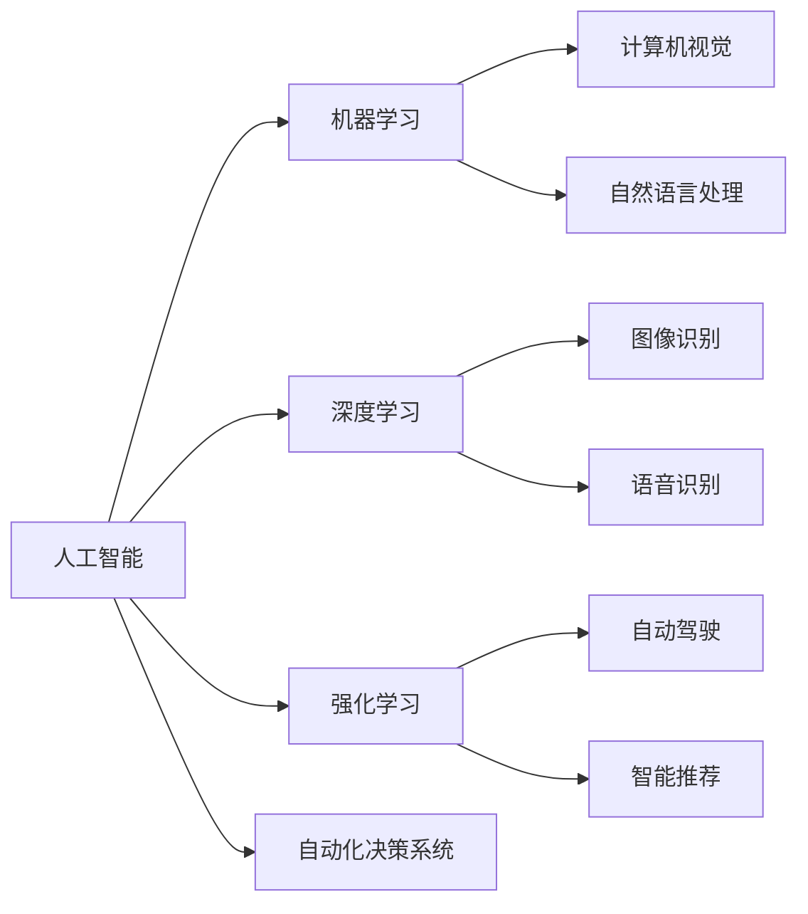

                 

# 人工智能：社会影响与思考

## 1. 背景介绍

### 1.1 问题由来

随着人工智能技术的飞速发展，人工智能已经渗透到了社会的各个角落，从医疗、教育、交通到金融、零售、娱乐，人工智能正在改变我们的生活方式，同时也引发了一系列的社会问题。从自动驾驶引发的道德困境，到隐私保护和数据安全的争议，再到机器人取代劳动力的担忧，人工智能的影响力已经引起了广泛的关注和讨论。

本文旨在深入探讨人工智能的社会影响，分析其在不同领域的应用现状及面临的挑战，提出可能的解决方案，为人工智能技术的健康发展提供参考。

### 1.2 问题核心关键点

本文将重点探讨以下几个核心问题：

- 人工智能在各领域的应用现状和影响。
- 人工智能面临的主要社会问题和挑战。
- 人工智能技术的伦理和安全问题。
- 如何应对人工智能的社会影响，推动技术健康发展。

## 2. 核心概念与联系

### 2.1 核心概念概述

为了更好地理解人工智能的社会影响，我们需要了解一些核心概念：

- **人工智能(AI)**：通过计算机算法和数学模型，使机器具备类人智能，包括感知、学习、推理、决策等能力。
- **机器学习(ML)**：一种通过数据训练机器模型，使其具备预测和决策能力的机器学习技术。
- **深度学习(DL)**：一种特殊的机器学习方法，使用多层神经网络进行特征提取和模型训练，广泛应用于图像、语音、自然语言处理等领域。
- **强化学习(RL)**：一种通过与环境互动，不断调整策略，以最大化奖励信号的学习方法。
- **计算机视觉(CV)**：研究如何让计算机"看"和理解图像、视频等视觉信息的技术。
- **自然语言处理(NLP)**：研究如何让计算机理解和生成人类语言的技术。
- **自动化决策系统(ADS)**：使用AI技术自动做出决策的智能系统，如自动驾驶、智能推荐等。

这些概念之间的关系可以通过以下Mermaid流程图来展示：



这个流程图展示了人工智能与其他相关技术之间的联系和应用领域。

## 3. 核心算法原理 & 具体操作步骤

### 3.1 算法原理概述

人工智能的核心算法原理主要包括以下几个方面：

- **监督学习**：通过标注数据训练机器学习模型，使其具备预测能力。
- **无监督学习**：从未标注数据中学习模式和结构，发现数据的内在关系。
- **半监督学习**：结合少量标注数据和大量未标注数据，提高学习效果。
- **强化学习**：通过与环境的交互，不断调整策略，最大化奖励信号。
- **迁移学习**：将在一个任务上学到的知识迁移到另一个任务上，提高学习效率。
- **神经网络**：一种通过多层非线性变换，进行特征提取和模型训练的算法。

### 3.2 算法步骤详解

人工智能的核心算法步骤通常包括数据预处理、模型训练、模型评估和模型部署。以下以监督学习为例，详细讲解其操作步骤：

1. **数据预处理**：包括数据收集、数据清洗、数据增强等步骤，确保数据的质量和多样性。
2. **模型训练**：选择合适的算法和模型结构，使用标注数据进行训练，优化模型参数。
3. **模型评估**：通过测试集评估模型性能，使用各种指标（如准确率、召回率、F1-score等）进行评估。
4. **模型部署**：将训练好的模型集成到实际应用中，进行实时推理和预测。

### 3.3 算法优缺点

人工智能的算法具有以下优点：

- **高效性**：能够处理大规模数据集，快速进行模型训练和预测。
- **准确性**：通过优化算法和大量数据训练，具备较高的预测准确性。
- **可扩展性**：可以扩展到不同领域和任务，具备广泛的应用前景。
- **自适应性**：能够适应环境变化，进行实时决策和调整。

但同时，人工智能也存在一些缺点：

- **复杂性**：算法复杂，需要大量的数据和计算资源。
- **黑箱性**：许多模型内部机制复杂，难以解释和调试。
- **数据依赖**：需要大量高质量的标注数据，数据质量对模型性能影响巨大。
- **偏见和歧视**：可能存在数据偏见和算法偏见，导致模型输出结果不公正。

### 3.4 算法应用领域

人工智能在多个领域都得到了广泛应用，以下是几个主要应用领域：

- **医疗**：在疾病诊断、治疗方案推荐、健康管理等方面，人工智能可以大幅提高医疗服务质量。
- **金融**：在风险控制、欺诈检测、投资决策等方面，人工智能可以提升金融服务效率和安全性。
- **制造**：在质量控制、供应链管理、智能制造等方面，人工智能可以提高制造业的自动化和智能化水平。
- **交通**：在智能交通、自动驾驶、物流优化等方面，人工智能可以提升交通系统的运行效率和安全性。
- **零售**：在商品推荐、库存管理、客户服务等方面，人工智能可以提高零售业的个性化和效率。
- **教育**：在智能辅导、课程推荐、教学评估等方面，人工智能可以提升教育质量和学习体验。

## 4. 数学模型和公式 & 详细讲解 & 举例说明

### 4.1 数学模型构建

人工智能的数学模型通常包括损失函数、优化算法、正则化技术等。以下以监督学习为例，介绍其主要数学模型：

1. **损失函数**：衡量模型预测与真实标签之间的差异，常见的损失函数包括均方误差、交叉熵等。
2. **优化算法**：通过梯度下降等算法优化模型参数，常见的优化算法包括SGD、Adam等。
3. **正则化技术**：通过L1、L2正则等技术，防止模型过拟合，常见的正则化技术包括L1正则、L2正则、Dropout等。

### 4.2 公式推导过程

以下以监督学习中的二分类问题为例，推导其数学模型和公式：

1. **损失函数**：假设模型在输入 $x$ 上的预测输出为 $\hat{y}$，真实标签为 $y$，则二分类交叉熵损失函数为：

   $$
   \ell(\hat{y}, y) = -(y\log \hat{y} + (1-y)\log (1-\hat{y}))
   $$

2. **优化算法**：使用梯度下降算法更新模型参数，更新公式为：

   $$
   \theta \leftarrow \theta - \eta \nabla_{\theta}\ell(\hat{y}, y)
   $$

   其中 $\eta$ 为学习率。

3. **正则化技术**：使用L2正则技术，防止模型过拟合，更新公式为：

   $$
   \theta \leftarrow \theta - \eta (\nabla_{\theta}\ell(\hat{y}, y) + \lambda \theta)
   $$

   其中 $\lambda$ 为正则化系数。

### 4.3 案例分析与讲解

以图像识别为例，介绍深度学习在人工智能中的应用：

1. **数据预处理**：将图像数据标准化，进行归一化、旋转、裁剪等预处理。
2. **模型构建**：构建多层卷积神经网络，包括卷积层、池化层、全连接层等。
3. **模型训练**：使用标注数据进行训练，优化模型参数。
4. **模型评估**：在测试集上进行评估，使用各种指标（如准确率、召回率、F1-score等）进行评估。
5. **模型部署**：将训练好的模型集成到实际应用中，进行实时推理和预测。

## 5. 项目实践：代码实例和详细解释说明

### 5.1 开发环境搭建

在进行人工智能项目实践前，我们需要准备好开发环境。以下是使用Python进行TensorFlow开发的环境配置流程：

1. 安装Anaconda：从官网下载并安装Anaconda，用于创建独立的Python环境。

2. 创建并激活虚拟环境：
```bash
conda create -n tf-env python=3.8 
conda activate tf-env
```

3. 安装TensorFlow：根据CUDA版本，从官网获取对应的安装命令。例如：
```bash
conda install tensorflow tensorflow-gpu=2.4 -c conda-forge
```

4. 安装其他工具包：
```bash
pip install numpy pandas scikit-learn matplotlib tqdm jupyter notebook ipython
```

完成上述步骤后，即可在`tf-env`环境中开始项目实践。

### 5.2 源代码详细实现

下面以图像识别为例，给出使用TensorFlow进行卷积神经网络训练的Python代码实现。

```python
import tensorflow as tf
from tensorflow.keras import layers, models
import numpy as np

# 定义模型
model = models.Sequential([
    layers.Conv2D(32, (3,3), activation='relu', input_shape=(64,64,3)),
    layers.MaxPooling2D((2,2)),
    layers.Conv2D(64, (3,3), activation='relu'),
    layers.MaxPooling2D((2,2)),
    layers.Conv2D(64, (3,3), activation='relu'),
    layers.Flatten(),
    layers.Dense(64, activation='relu'),
    layers.Dense(10)
])

# 编译模型
model.compile(optimizer=tf.keras.optimizers.Adam(0.001),
              loss=tf.keras.losses.SparseCategoricalCrossentropy(from_logits=True),
              metrics=['accuracy'])

# 加载数据
train_data = tf.keras.datasets.cifar10.load_data()
x_train, y_train = train_data[0], train_data[1]

# 数据增强
train_generator = tf.keras.preprocessing.image.ImageDataGenerator(
    rotation_range=15,
    width_shift_range=0.1,
    height_shift_range=0.1,
    horizontal_flip=True
)
train_generator.fit(x_train)

# 模型训练
model.fit(train_generator.flow(x_train, y_train, batch_size=32),
          epochs=10,
          validation_data=(x_train[1000:], y_train[1000:]))
```

以上就是使用TensorFlow进行卷积神经网络训练的完整代码实现。可以看到，TensorFlow提供了丰富的API，使得模型构建和训练变得简洁高效。

### 5.3 代码解读与分析

让我们再详细解读一下关键代码的实现细节：

**数据预处理**：
- `train_data = tf.keras.datasets.cifar10.load_data()`：从TensorFlow自带的CIFAR-10数据集中加载训练数据和标签。
- `x_train, y_train = train_data[0], train_data[1]`：将数据集中的输入和标签分别赋值给变量。

**模型构建**：
- `model = models.Sequential()`：创建一个顺序模型。
- `layers.Conv2D(32, (3,3), activation='relu', input_shape=(64,64,3))`：添加一个32个3x3卷积核的卷积层，使用ReLU激活函数，输入维度为64x64x3。
- `layers.MaxPooling2D((2,2))`：添加一个2x2最大池化层，用于降采样。
- `layers.Conv2D(64, (3,3), activation='relu')`：添加64个3x3卷积核的卷积层，使用ReLU激活函数。
- `layers.Flatten()`：将二维卷积层的输出展开成一维向量。
- `layers.Dense(64, activation='relu')`：添加一个64个神经元的全连接层，使用ReLU激活函数。
- `layers.Dense(10)`：添加一个10个神经元的输出层，用于分类。

**模型编译**：
- `model.compile(optimizer=tf.keras.optimizers.Adam(0.001), loss=tf.keras.losses.SparseCategoricalCrossentropy(from_logits=True), metrics=['accuracy'])`：编译模型，指定Adam优化器、交叉熵损失函数和准确率指标。

**数据增强**：
- `train_generator = tf.keras.preprocessing.image.ImageDataGenerator(rotation_range=15, width_shift_range=0.1, height_shift_range=0.1, horizontal_flip=True)`：创建一个数据增强器，使用旋转、平移、翻转等变换扩充训练集。
- `train_generator.fit(x_train)`：在训练集上进行拟合，学习数据的分布特性。

**模型训练**：
- `model.fit(train_generator.flow(x_train, y_train, batch_size=32), epochs=10, validation_data=(x_train[1000:], y_train[1000:]))`：使用数据增强器进行模型训练，指定批次大小为32，训练10个epoch，并在验证集上进行评估。

可以看到，TensorFlow提供了丰富的API和工具，使得模型构建和训练变得简洁高效。开发者可以将更多精力放在模型优化和数据增强等高层逻辑上，而不必过多关注底层的实现细节。

## 6. 实际应用场景

### 6.1 智能医疗

人工智能在医疗领域的应用前景广阔，包括疾病诊断、治疗方案推荐、健康管理等方面。通过深度学习模型，医生可以更准确地识别疾病，制定个性化治疗方案，提高医疗服务质量。

### 6.2 智能金融

金融领域面临风险控制、欺诈检测、投资决策等挑战。通过人工智能模型，金融机构可以实时监控交易风险，预测市场趋势，提升风险管理能力。

### 6.3 智能制造

制造领域需要高效的质量控制和供应链管理。通过人工智能技术，可以实现智能制造、质量检测和生产优化，提高制造业的自动化和智能化水平。

### 6.4 智能交通

交通领域面临智能交通、自动驾驶、物流优化等挑战。通过人工智能技术，可以实现智能交通管理、自动驾驶汽车和物流优化，提升交通系统的运行效率和安全性。

## 7. 工具和资源推荐

### 7.1 学习资源推荐

为了帮助开发者系统掌握人工智能的理论基础和实践技巧，这里推荐一些优质的学习资源：

1. 《深度学习》课程：斯坦福大学开设的深度学习课程，详细介绍了深度学习的基本概念和常用算法。
2. 《TensorFlow实战》书籍：TensorFlow的官方文档，提供了丰富的API和示例代码，是学习TensorFlow的必备资料。
3. 《Python深度学习》书籍：通过Python代码实现深度学习模型的经典教材，适合初学者学习。
4. 《机器学习实战》书籍：详细介绍了机器学习算法及其应用，适合有一定编程基础的读者。
5. 《人工智能：一种现代方法》书籍：经典的人工智能教材，覆盖了人工智能的各个方面，适合深入学习。

通过对这些资源的学习实践，相信你一定能够快速掌握人工智能的核心技术和应用场景，为后续的实践奠定基础。

### 7.2 开发工具推荐

高效的开发离不开优秀的工具支持。以下是几款用于人工智能开发的常用工具：

1. TensorFlow：基于Python的开源深度学习框架，灵活动态的计算图，适合快速迭代研究。
2. PyTorch：由Facebook开发的深度学习框架，灵活的动态图和高效的GPU计算，适合学术研究和生产部署。
3. Keras：基于TensorFlow和Theano的高级深度学习API，简单易用，适合快速原型开发。
4. Jupyter Notebook：交互式Python开发环境，支持代码编写、数据可视化和报告生成。
5. GitHub：代码托管平台，提供丰富的开源项目和社区资源，适合协作开发和代码分享。

合理利用这些工具，可以显著提升人工智能项目的开发效率，加快创新迭代的步伐。

### 7.3 相关论文推荐

人工智能的快速发展得益于学界的持续研究。以下是几篇奠基性的相关论文，推荐阅读：

1. "Deep Blue": IBM的国际象棋计算机，展示了人工智能的首次突破。
2. "ImageNet Classification with Deep Convolutional Neural Networks": AlexNet模型，展示了深度学习在图像识别领域的巨大潜力。
3. "Long Short-Term Memory": LSTM模型，展示了循环神经网络在序列数据处理中的应用。
4. "Playing Atari with Deep Reinforcement Learning": AlphaGo模型，展示了强化学习在复杂决策问题中的应用。
5. "Generative Adversarial Networks": GAN模型，展示了生成对抗网络在图像生成和数据增强中的应用。

这些论文代表了人工智能技术的发展脉络。通过学习这些前沿成果，可以帮助研究者把握学科前进方向，激发更多的创新灵感。

## 8. 总结：未来发展趋势与挑战

### 8.1 总结

本文对人工智能的社会影响进行了全面系统的介绍。首先阐述了人工智能在各领域的应用现状和影响，明确了其在不同领域的应用前景和潜在风险。其次，探讨了人工智能面临的主要社会问题和挑战，提出可能的解决方案。最后，提出未来人工智能技术的发展趋势和面临的挑战，为人工智能技术的健康发展提供参考。

通过本文的系统梳理，可以看到，人工智能已经深刻影响着社会的各个方面，其未来发展前景广阔。但同时，人工智能也面临诸多挑战，需要在技术、伦理、法律等方面进行深入探讨和研究。

### 8.2 未来发展趋势

展望未来，人工智能的发展趋势包括以下几个方面：

1. **技术进步**：深度学习、强化学习、计算机视觉、自然语言处理等领域的技术将继续突破，带来更多创新应用。
2. **行业应用**：人工智能将在更多行业得到广泛应用，推动行业数字化转型和智能化升级。
3. **伦理与安全**：人工智能的伦理和安全问题将成为重要研究课题，保障人工智能技术的健康发展。
4. **跨领域融合**：人工智能将与其他技术领域进行更深入的融合，如量子计算、区块链、物联网等，拓展技术应用边界。
5. **人类共融**：人工智能的发展将促进人机协作，提升人类生活质量和幸福感。

这些趋势预示着人工智能技术的广阔前景和巨大潜力，需要各方共同努力，推动技术健康发展。

### 8.3 面临的挑战

尽管人工智能技术取得了显著进展，但在迈向更加智能化、普适化应用的过程中，仍面临诸多挑战：

1. **数据隐私与安全**：人工智能需要大量数据进行训练和优化，如何保护用户隐私和数据安全成为重要问题。
2. **算法偏见与歧视**：人工智能模型可能存在数据偏见和算法偏见，导致不公平的结果。
3. **模型复杂性与可解释性**：许多人工智能模型内部机制复杂，难以解释和调试，缺乏可解释性。
4. **资源消耗与能效问题**：人工智能模型对计算资源和能源消耗巨大，如何降低能耗和提升能效成为重要挑战。
5. **社会伦理与法律问题**：人工智能的应用可能带来伦理和法律问题，如就业替代、隐私侵犯、伦理决策等。

这些挑战需要各方共同努力，通过技术创新和政策引导，推动人工智能技术的健康发展。

### 8.4 研究展望

未来，人工智能技术的研究方向将包括以下几个方面：

1. **联邦学习**：在分布式环境下进行模型训练，保护数据隐私和安全性。
2. **可解释性AI**：增强人工智能模型的可解释性，提高算法的透明性和可信度。
3. **跨领域应用**：将人工智能技术应用到更多领域，推动行业数字化转型。
4. **伦理与法律研究**：研究人工智能技术的伦理和法律问题，制定规范和标准。
5. **人机协作**：推动人机协作，提升人工智能在人类社会的价值和作用。

这些研究方向将推动人工智能技术的发展，为构建安全、可靠、可解释、可控的智能系统铺平道路。

## 9. 附录：常见问题与解答

**Q1：人工智能是否会取代人类工作？**

A: 人工智能可以自动化执行许多重复性、低技能的工作，但同时也会创造更多新的岗位和就业机会。人工智能的发展需要大量专业人才，如数据科学家、算法工程师、人工智能伦理学家等。因此，人工智能不会完全取代人类工作，而是促进人类社会的进步和发展。

**Q2：人工智能是否会带来伦理和安全问题？**

A: 人工智能可能带来伦理和安全问题，如数据隐私泄露、算法偏见、恶意攻击等。为了保障人工智能的安全和伦理，需要制定相关政策和规范，加强技术监管和伦理研究。

**Q3：人工智能的发展是否会对社会产生负面影响？**

A: 人工智能的发展可能对社会产生负面影响，如就业替代、隐私侵犯、伦理决策等。但通过合理的政策引导和监管，可以最大限度地避免这些负面影响，推动人工智能技术的健康发展。

**Q4：人工智能是否会推动社会进步？**

A: 人工智能有望推动社会进步，提高工作效率、提升医疗服务质量、促进环境保护等。但同时，人工智能的发展也需要关注其伦理和安全问题，保障技术健康发展。

---

作者：禅与计算机程序设计艺术 / Zen and the Art of Computer Programming

