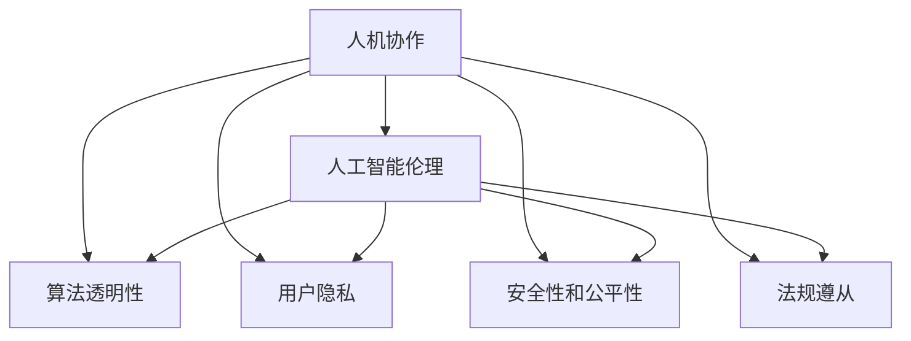
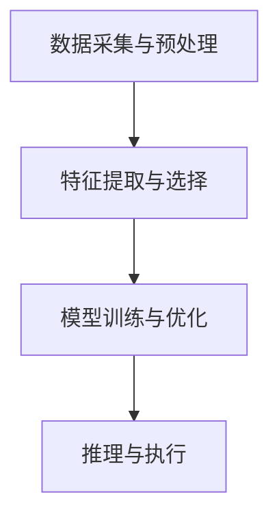

                 

# 人机协作：伦理规范与准则

> 关键词：人机协作, 人工智能伦理, 算法透明性, 用户隐私, 安全性和公平性, 法规遵从

## 1. 背景介绍

随着人工智能(AI)技术的飞速发展，人机协作已经深刻渗透到各行各业。无论是无人驾驶、智能客服，还是工业自动化、医疗诊断，AI技术的应用都在不断地提升人类工作的效率和质量。然而，与此同时，AI技术也引发了一系列伦理和法律问题，需要构建完善的规范和准则，确保其应用符合人类社会的价值观和法律法规。本文将探讨人机协作中的伦理规范与准则，为AI技术的未来发展提供理论和实践指导。

## 2. 核心概念与联系

### 2.1 核心概念概述

为更好地理解人机协作中的伦理规范与准则，本节将介绍几个核心概念：

- **人机协作**：指人类与人工智能系统共同完成工作任务的过程。这一过程涉及人类与机器的交互、决策、反馈等环节。
- **人工智能伦理**：人工智能在应用过程中需遵循的道德准则和伦理规范，如隐私保护、数据安全、公平性等。
- **算法透明性**：要求AI系统对决策过程的解释和说明，便于用户理解和信任。
- **用户隐私**：用户在数据交互过程中应享有的隐私权，包括数据采集、存储和处理等方面。
- **安全性和公平性**：要求AI系统在设计和应用过程中，确保数据和系统的安全，以及决策的公平性和无偏见性。
- **法规遵从**：要求AI系统在开发和应用过程中，遵守当地法律法规，保护用户的合法权益。

这些核心概念构成了人机协作伦理规范与准则的基础，涉及技术、法律和社会等多个层面。以下Mermaid流程图展示了这些概念之间的联系：



### 2.2 核心概念原理和架构的 Mermaid 流程图

人机协作中，AI系统的决策过程通常包含以下几个步骤：数据采集与预处理、特征提取与选择、模型训练与优化、推理与执行。以下是一个简化的流程图，展示了这一过程：



在这一流程中，AI系统需要遵循一系列伦理规范与准则，以确保其决策过程透明、公平和安全。

## 3. 核心算法原理 & 具体操作步骤

### 3.1 算法原理概述

人机协作中的伦理规范与准则，本质上是对AI系统设计和应用过程中，如何确保其决策透明、公平、安全、用户隐私保护等关键问题的解决。具体而言，包括以下几个方面：

- **决策透明性**：要求AI系统对决策过程的解释和说明，便于用户理解和信任。
- **公平性**：要求AI系统在处理不同群体时，保持一致的决策标准，避免偏见和歧视。
- **安全性**：要求AI系统在数据采集、存储、传输和处理过程中，确保数据的安全和隐私保护。
- **用户隐私**：要求AI系统在数据采集和使用过程中，遵循隐私保护的原则，避免侵犯用户隐私。

### 3.2 算法步骤详解

基于上述核心概念，人机协作中的伦理规范与准则可以通过以下步骤来实现：

1. **数据治理与隐私保护**：设计数据治理框架，确保数据采集、存储和处理过程中的隐私保护和合规性。
2. **算法透明性与可解释性**：开发可解释性算法，提供决策过程的透明性和用户可理解性。
3. **公平性与无偏见性**：通过数据集的多样性和公平性训练，确保模型在处理不同群体时的一致性。
4. **安全性与风险管理**：采取安全措施，如加密、认证、访问控制等，保护数据和系统的安全。
5. **法规遵从与伦理审查**：建立合规和伦理审查机制，确保AI系统遵循法律法规和伦理标准。

### 3.3 算法优缺点

人机协作中的伦理规范与准则具有以下优点：

- **增强用户信任**：通过透明性和可解释性，提升用户对AI系统的信任度。
- **促进公平性**：确保不同群体在数据和决策过程中的公平对待。
- **保障数据安全**：通过安全措施和合规机制，保护用户隐私和数据安全。

同时，也存在一些局限性：

- **技术复杂性**：实现透明性、公平性和安全性，往往需要复杂的算法和技术。
- **隐私保护挑战**：在大数据时代，隐私保护和合规性是一个复杂且不断变化的问题。
- **法规和标准差异**：不同国家和地区对AI伦理有不同的法规和标准，需要灵活应对。

### 3.4 算法应用领域

人机协作中的伦理规范与准则，广泛应用于以下几个领域：

- **医疗诊断**：确保医疗AI系统的决策透明、公平和安全，保护患者隐私。
- **金融风控**：确保金融AI系统在决策过程中遵循公平性和隐私保护原则。
- **智能制造**：确保工业AI系统在数据采集和使用过程中，遵循安全性和合规性要求。
- **自动驾驶**：确保自动驾驶AI系统在决策过程中，考虑透明度、公平性和安全性。
- **教育与培训**：确保教育AI系统在数据和决策过程中，遵循公平性和隐私保护原则。

## 4. 数学模型和公式 & 详细讲解 & 举例说明

### 4.1 数学模型构建

在具体应用中，人机协作中的伦理规范与准则可以通过数学模型来描述和计算。以下是一个简化的模型，用于描述AI系统在不同用户群体中的公平性：

$$
F_k = \frac{1}{N} \sum_{i=1}^N P(y_i=k|X_i)
$$

其中，$F_k$ 为第$k$个用户群体的公平性评分，$N$为总样本数，$P(y_i=k|X_i)$ 为第$i$个样本属于第$k$个用户群体且被AI系统预测正确的概率。

### 4.2 公式推导过程

公平性评分可以通过以下步骤计算：

1. **数据采集与预处理**：收集不同用户群体的数据，并进行预处理和清洗。
2. **特征提取与选择**：提取与公平性相关的特征，如性别、种族、年龄等。
3. **模型训练与优化**：训练公平性模型，评估不同用户群体的预测性能。
4. **结果评估**：计算每个用户群体的公平性评分，分析公平性差距。

### 4.3 案例分析与讲解

假设有一个招聘AI系统，需要确保不同性别和种族的求职者在面试邀请过程中的公平性。以下是一个简化的案例分析：

1. **数据采集与预处理**：收集历史面试数据，包括求职者的性别、种族、年龄、面试结果等。
2. **特征提取与选择**：选择性别、种族等特征，作为公平性评估的关键指标。
3. **模型训练与优化**：训练公平性模型，评估不同性别和种族求职者的面试邀请概率。
4. **结果评估**：计算不同性别和种族求职者的公平性评分，分析差距并调整模型参数。

## 5. 项目实践：代码实例和详细解释说明

### 5.1 开发环境搭建

在进行公平性评分系统的开发前，我们需要准备好开发环境。以下是使用Python进行TensorFlow开发的环境配置流程：

1. 安装Anaconda：从官网下载并安装Anaconda，用于创建独立的Python环境。

2. 创建并激活虚拟环境：
```bash
conda create -n tf-env python=3.8 
conda activate tf-env
```

3. 安装TensorFlow：根据CUDA版本，从官网获取对应的安装命令。例如：
```bash
conda install tensorflow=2.7 -c tensorflow -c conda-forge
```

4. 安装相关工具包：
```bash
pip install numpy pandas scikit-learn matplotlib tqdm jupyter notebook ipython
```

完成上述步骤后，即可在`tf-env`环境中开始公平性评分系统的开发。

### 5.2 源代码详细实现

我们以招聘AI系统的公平性评分为例，给出使用TensorFlow实现公平性评分的Python代码。

```python
import tensorflow as tf
from tensorflow.keras import layers
import numpy as np

class FairnessEvaluator:
    def __init__(self, data, features):
        self.data = data
        self.features = features
        self.model = self.build_model()

    def build_model(self):
        inputs = tf.keras.layers.Input(shape=(len(self.features),))
        x = layers.Dense(64, activation='relu')(inputs)
        outputs = layers.Dense(1, activation='sigmoid')(x)
        model = tf.keras.Model(inputs=inputs, outputs=outputs)
        model.compile(optimizer='adam', loss='binary_crossentropy', metrics=['accuracy'])
        return model

    def evaluate(self):
        X = self.data[self.features].values
        y = self.data['is_hired'].values
        X_train, X_test, y_train, y_test = train_test_split(X, y, test_size=0.2, random_state=42)
        self.model.fit(X_train, y_train, epochs=10, batch_size=32, validation_data=(X_test, y_test))
        y_pred = self.model.predict(X_test)
        return np.mean(y_pred)
```

以上代码实现了公平性评分系统的基础功能。具体步骤如下：

1. **数据预处理**：使用`train_test_split`函数将数据集划分为训练集和测试集。
2. **模型训练**：使用`model.fit`函数训练公平性模型。
3. **结果评估**：使用`model.predict`函数对测试集进行预测，并计算公平性评分。

### 5.3 代码解读与分析

**FairnessEvaluator类**：
- `__init__`方法：初始化数据和特征。
- `build_model`方法：构建公平性评分模型。
- `evaluate`方法：评估模型的公平性评分。

**代码实现细节**：
- `inputs`层：输入数据层，定义输入特征的维度。
- `x`层：全连接层，进行特征提取和转换。
- `outputs`层：输出层，使用Sigmoid函数将输出转换为公平性评分。
- `model`层：定义整个模型结构。
- `model.compile`方法：配置模型的优化器和损失函数。
- `model.fit`方法：训练模型。
- `model.predict`方法：对测试集进行预测。

**结果评估**：
- 使用`np.mean`函数计算公平性评分，评估模型在不同用户群体中的公平性。

## 6. 实际应用场景

### 6.4 未来应用展望

随着人工智能技术的不断发展和应用，人机协作中的伦理规范与准则也将面临更多的挑战和机遇。未来，AI技术将在更多领域得到应用，如智慧医疗、智能交通、智能制造等，人机协作将变得更加广泛和深入。

1. **智慧医疗**：医疗AI系统将需要遵循伦理规范与准则，确保数据隐私和安全，同时提供透明的决策过程。
2. **智能交通**：自动驾驶AI系统将需要考虑安全性和公平性，确保不同交通参与者的权益。
3. **智能制造**：工业AI系统将需要遵循数据治理和隐私保护原则，确保制造过程的透明性和公平性。
4. **智能客服**：AI客服系统将需要考虑用户隐私和公平性，提供高效、安全的交互体验。

## 7. 工具和资源推荐

### 7.1 学习资源推荐

为了帮助开发者系统掌握人机协作中的伦理规范与准则，这里推荐一些优质的学习资源：

1. 《人工智能伦理基础》系列博文：由AI伦理专家撰写，深入浅出地介绍了人工智能伦理的基本概念和实际案例。

2. CS231n《深度学习与计算机视觉》课程：斯坦福大学开设的深度学习课程，涵盖了数据隐私、算法透明性等伦理问题。

3. 《人工智能伦理与法律》书籍：全面介绍了人工智能伦理和法律框架，适合深入研究。

4. IEEE《人工智能伦理指南》：由IEEE发布的伦理指南，包含多种伦理模型和标准。

5. TED Talks：观看专家关于AI伦理的演讲视频，获取更多理论和实践见解。

通过对这些资源的学习实践，相信你一定能够快速掌握人机协作中的伦理规范与准则，并用于解决实际的伦理问题。

### 7.2 开发工具推荐

高效的开发离不开优秀的工具支持。以下是几款用于人机协作开发的常用工具：

1. TensorFlow：基于Python的开源深度学习框架，灵活动态的计算图，适合研究新模型和新算法。
2. PyTorch：由Facebook开发的深度学习框架，具有灵活性和易用性，适合快速原型开发。
3. Weights & Biases：模型训练的实验跟踪工具，可以记录和可视化模型训练过程中的各项指标，方便对比和调优。
4. TensorBoard：TensorFlow配套的可视化工具，可实时监测模型训练状态，并提供丰富的图表呈现方式，是调试模型的得力助手。

合理利用这些工具，可以显著提升人机协作系统的开发效率，加快创新迭代的步伐。

### 7.3 相关论文推荐

人机协作中的伦理规范与准则是一个前沿领域，相关的研究论文不断涌现。以下是几篇奠基性的相关论文，推荐阅读：

1. "Algorithmic Fairness through Pre-processing"：提出通过预处理数据实现公平性的方法，适用于多种领域。
2. "Towards Explainable and Fair Machine Learning"：讨论了AI系统透明性和公平性的重要性和实现路径。
3. "The Ethical Principles of Artificial Intelligence"：总结了人工智能伦理的基本原则和应用指南。
4. "Human-AI Collaboration: Principles and Practices"：探讨了人机协作中的伦理规范与准则，适用于多个应用场景。
5. "Fairness in Algorithmic Decision Making"：详细介绍了算法公平性评估和优化的方法。

这些论文代表了人机协作伦理规范与准则的研究进展，通过学习这些前沿成果，可以帮助研究者把握学科前进方向，激发更多的创新灵感。

## 8. 总结：未来发展趋势与挑战

### 8.1 总结

本文对人机协作中的伦理规范与准则进行了全面系统的介绍。首先阐述了人机协作的重要性和当前面临的伦理挑战，明确了伦理规范与准则在AI系统设计和应用中的关键作用。其次，从原理到实践，详细讲解了人机协作中的决策透明性、公平性、安全性、用户隐私保护等关键问题，给出了具体的应用实例和代码实现。同时，本文还广泛探讨了人机协作在智慧医疗、智能交通、智能制造等诸多领域的应用前景，展示了伦理规范与准则的重要性和可行性。最后，本文精选了人机协作的相关学习资源和开发工具，力求为读者提供全方位的技术指引。

通过本文的系统梳理，可以看到，人机协作中的伦理规范与准则正在成为AI系统设计和应用的重要组成部分，确保了系统的透明性、公平性、安全性和用户隐私保护。未来，随着AI技术的不断发展和应用，伦理规范与准则的研究和实践将变得更加重要和复杂，需要学界和产业界的共同努力。

### 8.2 未来发展趋势

展望未来，人机协作中的伦理规范与准则将呈现以下几个发展趋势：

1. **多领域适用**：伦理规范与准则将广泛应用于各个领域，如医疗、交通、制造等，成为AI系统设计的基础。
2. **实时性和动态性**：伦理规范与准则将需要考虑实时性和动态性，确保AI系统在不断变化的环境下保持合规性和透明性。
3. **全球化与区域化**：不同国家和地区对人机协作有不同的伦理标准和法律法规，需要设计全球化与区域化的伦理框架。
4. **技术融合与创新**：伦理规范与准则将与AI技术不断融合，推动新技术和新方法的应用。
5. **用户参与与反馈**：用户参与和反馈机制将成为伦理规范与准则的重要组成部分，提升系统的可接受性和可信度。

### 8.3 面临的挑战

尽管人机协作中的伦理规范与准则已经取得了初步成果，但在迈向更加智能化、普适化应用的过程中，仍面临诸多挑战：

1. **技术复杂性**：实现伦理规范与准则需要复杂的算法和技术，如何在不同场景中灵活应用，是一个重要问题。
2. **隐私保护挑战**：在大数据时代，隐私保护和合规性是一个复杂且不断变化的问题，如何确保数据安全是一个长期挑战。
3. **法规和标准差异**：不同国家和地区对人机协作有不同的法规和标准，如何在全球范围内统一伦理框架，是一个亟待解决的问题。
4. **公平性和偏见**：确保AI系统在处理不同群体时的一致性，避免偏见和歧视，是一个复杂且敏感的问题。
5. **安全性和鲁棒性**：确保AI系统在数据采集、存储、传输和处理过程中，始终保持安全性和鲁棒性，是一个长期且重要的任务。

### 8.4 研究展望

面对人机协作中伦理规范与准则所面临的挑战，未来的研究需要在以下几个方面寻求新的突破：

1. **技术创新与优化**：开发更加高效、灵活的算法和技术，确保伦理规范与准则在不同场景中的应用。
2. **隐私保护与合规性**：设计更为先进的隐私保护和合规性机制，确保数据和系统的安全。
3. **全球化与区域化**：建立全球化与区域化的伦理框架，确保不同国家和地区对人机协作的共同理解和遵守。
4. **公平性与无偏见性**：开发更为公平和无偏见的AI系统，确保不同群体的权益。
5. **安全性与鲁棒性**：设计和实现更加安全、鲁棒的AI系统，确保其在复杂环境中稳定运行。

这些研究方向的探索，将推动人机协作中的伦理规范与准则不断发展和完善，为人机协作技术的未来发展提供坚实的基础。

## 9. 附录：常见问题与解答

**Q1：如何确保AI系统的决策透明性？**

A: 确保AI系统的决策透明性，需要从以下几个方面入手：
1. **可解释性算法**：使用可解释性算法，提供模型决策的详细解释。
2. **模型可视化**：使用可视化工具，展示模型内部结构和决策过程。
3. **用户反馈机制**：建立用户反馈机制，收集用户对AI系统决策的意见和建议。

**Q2：如何确保AI系统的公平性？**

A: 确保AI系统的公平性，需要从以下几个方面入手：
1. **数据多样化**：确保数据集的多样性和代表性，避免数据偏见。
2. **公平性训练**：在训练过程中，采用公平性约束，确保模型在处理不同群体时的一致性。
3. **公平性评估**：在模型部署后，定期评估模型的公平性，及时调整模型参数。

**Q3：如何保护用户隐私？**

A: 保护用户隐私，需要从以下几个方面入手：
1. **数据匿名化**：对数据进行匿名化处理，确保数据隐私。
2. **访问控制**：采用访问控制技术，确保数据的安全性和隐私保护。
3. **合规性审查**：建立合规性审查机制，确保数据处理和使用的合法性。

**Q4：如何确保AI系统的安全性？**

A: 确保AI系统的安全性，需要从以下几个方面入手：
1. **加密技术**：使用加密技术，确保数据在传输和存储过程中的安全性。
2. **安全审计**：定期进行安全审计，发现和修复系统漏洞。
3. **异常检测**：采用异常检测技术，及时发现和应对系统攻击。

**Q5：如何设计全球化与区域化的伦理框架？**

A: 设计全球化与区域化的伦理框架，需要从以下几个方面入手：
1. **国际标准**：遵循国际标准，确保伦理框架在全球范围内的通用性和一致性。
2. **本地化适应**：考虑不同国家和地区的文化和社会背景，设计本地化的伦理规范。
3. **多方协作**：建立多方协作机制，确保伦理框架的实施和监督。

这些常见问题及其解答，为读者提供了人机协作中的伦理规范与准则的实践指南，帮助他们更好地应对实际问题。

---

作者：禅与计算机程序设计艺术 / Zen and the Art of Computer Programming

