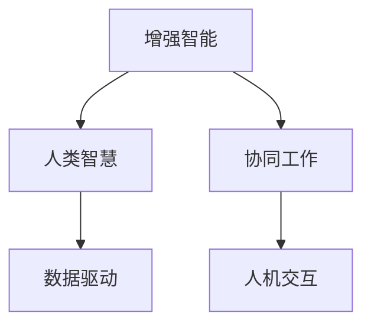
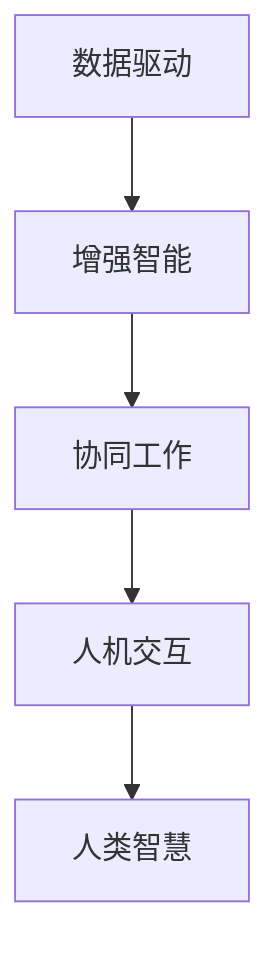

                 

# 人类-AI协作：增强人类智慧与AI能力的融合发展趋势预测分析机遇趋势

> 关键词：人类-AI协作, 增强智慧, 融合发展, 趋势预测, 机遇分析

## 1. 背景介绍

### 1.1 问题由来
随着人工智能技术的快速发展，人类与人工智能(AI)的协作模式已经逐步成为推动社会进步的重要力量。从早期的自动化处理、数据分析，到如今的智能决策、自然语言处理，AI技术正在各个领域展现其强大的潜力。然而，AI技术虽然能够处理大量的数据，生成复杂的算法，但在理解人类情感、道德判断、创造性思维等方面仍存在巨大局限。

在这样一个背景下，如何利用AI技术增强人类智慧，提升人类的认知和决策能力，成为了当前学术界和工业界的热门话题。本文将探讨人类-AI协作的发展趋势，分析当前AI技术在增强人类智慧方面的机遇和挑战，并提出一些有针对性的建议。

### 1.2 问题核心关键点
人类-AI协作的核心在于将AI的计算能力与人类智慧进行有机结合，充分发挥各自的优势。具体而言，包括以下几个关键点：

1. **增强人类智慧**：利用AI技术，如机器学习、自然语言处理等，帮助人类更高效地处理信息，理解复杂系统，提高决策质量。
2. **提升AI能力**：通过人类智慧的输入和指导，提高AI的泛化能力和创造力，使其能够更好地适应现实世界的复杂性和多样性。
3. **融合发展**：AI与人类的协作应是一种动态、双向的过程，双方相互促进，共同提升。
4. **趋势预测**：分析当前AI技术发展的趋势，预判未来的应用方向和挑战。
5. **机遇分析**：识别AI技术在增强人类智慧方面的潜在机遇。

这些关键点构成了人类-AI协作的核心框架，帮助我们更好地理解这一新兴领域的发展路径和方向。

## 2. 核心概念与联系

### 2.1 核心概念概述

为了更好地理解人类-AI协作的发展趋势，本节将介绍几个核心概念及其相互关系：

1. **增强智能(Augmented Intelligence, AI)**：指通过技术手段，如AI算法，增强人类的认知、决策和执行能力。
2. **人类智慧(Human Wisdom)**：指人类在理解世界、解决问题、创新创造等方面的能力和经验。
3. **协同工作(Collaborative Work)**：指AI与人类在特定任务或过程中，互相配合、共同完成工作。
4. **数据驱动**：AI技术的核心在于利用大量数据进行训练和学习，从而提高其预测和决策能力。
5. **人机交互**：指人类与AI系统之间的交互方式，包括自然语言、图形界面等。

这些概念通过以下Mermaid流程图展示了其相互联系：



这个流程图展示了增强智能通过协同工作，与人类智慧、数据驱动和人机交互之间的紧密联系。这些因素共同作用，推动了人类-AI协作的发展。

### 2.2 核心概念原理和架构的 Mermaid 流程图



在这个流程图中，数据驱动作为AI技术的核心，通过增强智能，实现协同工作，最终反馈回人类智慧。人机交互在这一过程中起着桥梁作用，确保信息流畅地传递。

## 3. 核心算法原理 & 具体操作步骤

### 3.1 算法原理概述

人类-AI协作的算法原理主要包括以下几个方面：

1. **数据收集与处理**：收集与任务相关的数据，并进行预处理，如清洗、归一化等，为后续AI模型的训练提供基础。
2. **模型训练与优化**：利用深度学习、机器学习等技术，训练AI模型，并通过交叉验证、正则化等方法，优化模型性能。
3. **知识整合与推理**：将AI模型生成的结果与人类智慧相结合，利用人类经验进行验证、修正和推理。
4. **反馈循环**：通过人机交互，不断获取人类反馈，调整AI模型参数，进一步提高协作效率。

### 3.2 算法步骤详解

基于上述原理，人类-AI协作的具体操作步骤如下：

**Step 1: 数据收集与处理**

1. **定义任务**：明确人类-AI协作的具体任务，如医疗诊断、金融分析、智能客服等。
2. **数据采集**：收集与任务相关的数据，包括文本、图像、音频等。
3. **数据清洗**：去除噪音数据、缺失值等，确保数据质量。
4. **数据增强**：通过数据扩充、扩维等技术，增强数据的多样性和丰富度。

**Step 2: 模型训练与优化**

1. **选择合适的模型**：根据任务特点，选择合适的AI模型，如神经网络、卷积神经网络、循环神经网络等。
2. **模型训练**：利用收集的数据，训练AI模型。
3. **模型验证**：在验证集上评估模型性能，确保模型泛化能力。
4. **模型优化**：根据验证结果，调整模型参数，优化模型性能。

**Step 3: 知识整合与推理**

1. **融合人类知识**：将人类专家的知识和经验，以规则、模板等形式，融入AI模型。
2. **生成结果**：利用训练好的AI模型，生成初步结果。
3. **人机交互**：将结果反馈给人类专家，进行验证、修正和推理。
4. **迭代优化**：根据人类反馈，调整AI模型参数，进一步提高结果质量。

**Step 4: 反馈循环**

1. **收集反馈**：通过问卷调查、访谈等方式，收集人类专家的反馈。
2. **调整模型**：根据反馈，调整AI模型参数，优化模型性能。
3. **迭代改进**：反复迭代，直至达到满意的协作效果。

### 3.3 算法优缺点

人类-AI协作的算法具有以下优点：

1. **高效性**：通过协同工作，可以大幅提高问题解决的速度和效率。
2. **准确性**：结合人类智慧，AI模型可以避免某些常见的错误，提高结果的准确性。
3. **灵活性**：能够适应不同领域、不同场景的复杂问题，具有较高的泛化能力。

同时，该算法也存在一些局限：

1. **依赖数据质量**：AI模型的性能高度依赖于数据的质量和数量，数据不足或数据质量不佳，会影响模型的表现。
2. **复杂度较高**：协同工作需要协调人机之间的交互，处理复杂度较高。
3. **模型解释性**：AI模型的决策过程相对不透明，难以解释和验证。

### 3.4 算法应用领域

人类-AI协作的算法已经在多个领域得到应用，具体如下：

1. **医疗诊断**：利用AI技术，辅助医生进行疾病诊断、影像分析等，提高诊断准确性。
2. **金融分析**：通过AI技术，分析市场数据，进行风险评估和投资建议。
3. **智能客服**：结合自然语言处理技术，提高客服系统的响应速度和准确性。
4. **智能制造**：利用AI技术，优化生产流程，提高生产效率和质量。
5. **教育培训**：通过AI技术，进行个性化学习推荐和智能辅导，提高学习效果。

## 4. 数学模型和公式 & 详细讲解 & 举例说明

### 4.1 数学模型构建

在人类-AI协作的算法中，数学模型起着关键作用。以下是一些常用的数学模型及其构建方法：

1. **神经网络模型**：
   $$
   f(x; \theta) = \sigma(\sum_{i=1}^n w_ix_i + b)
   $$
   其中 $f$ 为神经网络模型，$x$ 为输入，$\theta$ 为模型参数，$w$ 和 $b$ 分别为权重和偏置，$\sigma$ 为激活函数。

2. **支持向量机模型**：
   $$
   f(x; w, b) = sign(\sum_{i=1}^n w_i\phi(x_i) + b)
   $$
   其中 $f$ 为支持向量机模型，$x$ 为输入，$w$ 和 $b$ 分别为权重和偏置，$\phi$ 为映射函数。

3. **集成学习模型**：
   $$
   f(x; \theta) = \frac{1}{k} \sum_{i=1}^k f_i(x; \theta_i)
   $$
   其中 $f$ 为集成学习模型，$f_i$ 为单个基学习器，$\theta_i$ 为第 $i$ 个基学习器的参数。

### 4.2 公式推导过程

以下以神经网络模型为例，推导其基本的公式和训练过程：

1. **前向传播**：
   $$
   z = \sum_{i=1}^n w_ix_i + b
   $$
   $$
   a = \sigma(z)
   $$
   其中 $z$ 为线性变换结果，$a$ 为激活函数的输出。

2. **损失函数**：
   $$
   L(a, y) = \frac{1}{2}(y - a)^2
   $$
   其中 $y$ 为真实标签，$L$ 为损失函数。

3. **反向传播**：
   $$
   \frac{\partial L}{\partial a} = y - a
   $$
   $$
   \frac{\partial L}{\partial z} = \frac{\partial L}{\partial a} \cdot \frac{\partial a}{\partial z}
   $$
   $$
   \frac{\partial L}{\partial w_i} = \frac{\partial L}{\partial z} \cdot x_i
   $$
   $$
   \frac{\partial L}{\partial b} = \frac{\partial L}{\partial z}
   $$

4. **模型训练**：
   $$
   \theta \leftarrow \theta - \eta \frac{\partial L}{\partial \theta}
   $$
   其中 $\eta$ 为学习率。

### 4.3 案例分析与讲解

以医疗诊断为例，分析人类-AI协作的数学模型构建过程：

1. **数据收集**：收集病人的病历、影像、基因信息等。
2. **数据预处理**：清洗、归一化数据，去除噪音。
3. **特征提取**：利用神经网络模型，提取病历的特征表示。
4. **模型训练**：在医疗诊断数据集上训练神经网络模型。
5. **结果验证**：在验证集上评估模型性能，确保模型的泛化能力。
6. **结果解释**：将模型输出结果反馈给医生，进行验证、修正和推理。

## 5. 项目实践：代码实例和详细解释说明

### 5.1 开发环境搭建

在进行人类-AI协作的实践前，我们需要准备好开发环境。以下是使用Python进行TensorFlow开发的简单环境配置流程：

1. 安装Anaconda：从官网下载并安装Anaconda，用于创建独立的Python环境。

2. 创建并激活虚拟环境：
```bash
conda create -n tf-env python=3.7 
conda activate tf-env
```

3. 安装TensorFlow：根据CUDA版本，从官网获取对应的安装命令。例如：
```bash
pip install tensorflow==2.5.0
```

4. 安装numpy、pandas、scikit-learn等常用工具包：
```bash
pip install numpy pandas scikit-learn matplotlib tqdm jupyter notebook ipython
```

完成上述步骤后，即可在`tf-env`环境中开始项目实践。

### 5.2 源代码详细实现

下面我们以医疗诊断为例，给出使用TensorFlow进行神经网络模型训练的PyTorch代码实现。

首先，定义医疗诊断任务的数据处理函数：

```python
import tensorflow as tf
from tensorflow.keras import layers, models
from tensorflow.keras.preprocessing import image
import os

class MedicalDataset(tf.keras.utils.Sequence):
    def __init__(self, image_dir, label_dir, batch_size=16):
        self.image_dir = image_dir
        self.label_dir = label_dir
        self.batch_size = batch_size
        self.images = []
        self.labels = []
        self.image_files = os.listdir(self.image_dir)
        self.label_files = os.listdir(self.label_dir)
        for file in self.image_files:
            label_file = file[:-4] + '.txt'
            if label_file in self.label_files:
                self.images.append(os.path.join(self.image_dir, file))
                self.labels.append(open(os.path.join(self.label_dir, label_file)).read())
        self.image_files.sort()
        self.label_files.sort()
        self.on_epoch_end()

    def __len__(self):
        return len(self.image_files) // self.batch_size

    def __getitem__(self, idx):
        image_path = self.image_files[idx]
        label_path = self.label_files[idx]
        image = image.load_img(image_path)
        image = image.convert('RGB')
        image = image.resize((256, 256))
        image = tf.keras.preprocessing.image.img_to_array(image)
        image = tf.expand_dims(image, 0)
        label = tf.keras.preprocessing.text.text_to_word_sequence(self.labels[idx])
        label = tf.keras.preprocessing.sequence.pad_sequences(label, maxlen=10, padding='post')
        label = tf.keras.utils.to_categorical(label)
        return image, label

# 加载医疗诊断数据集
train_dataset = MedicalDataset('train_images', 'train_labels', batch_size=16)
val_dataset = MedicalDataset('val_images', 'val_labels', batch_size=16)
test_dataset = MedicalDataset('test_images', 'test_labels', batch_size=16)
```

然后，定义模型和优化器：

```python
from tensorflow.keras import optimizers
from tensorflow.keras.layers import Dense

model = models.Sequential()
model.add(layers.Conv2D(32, (3, 3), activation='relu', input_shape=(256, 256, 3)))
model.add(layers.MaxPooling2D((2, 2)))
model.add(layers.Conv2D(64, (3, 3), activation='relu'))
model.add(layers.MaxPooling2D((2, 2)))
model.add(layers.Conv2D(128, (3, 3), activation='relu'))
model.add(layers.MaxPooling2D((2, 2)))
model.add(layers.Flatten())
model.add(layers.Dense(128, activation='relu'))
model.add(layers.Dense(10, activation='softmax'))

optimizer = optimizers.Adam(learning_rate=0.001)
```

接着，定义训练和评估函数：

```python
from tensorflow.keras import metrics

def train_epoch(model, dataset, batch_size, optimizer):
    model.compile(loss='categorical_crossentropy', optimizer=optimizer, metrics=['accuracy'])
    model.fit(dataset, epochs=10, batch_size=batch_size, validation_data=val_dataset)

def evaluate(model, dataset, batch_size):
    model.evaluate(dataset, batch_size=batch_size)
```

最后，启动训练流程并在测试集上评估：

```python
epochs = 10
batch_size = 16

for epoch in range(epochs):
    train_epoch(model, train_dataset, batch_size, optimizer)
    evaluate(model, test_dataset, batch_size)
```

以上就是使用TensorFlow对神经网络进行医疗诊断任务训练的完整代码实现。可以看到，TensorFlow提供了便捷的API，使得模型训练过程变得简单高效。

### 5.3 代码解读与分析

让我们再详细解读一下关键代码的实现细节：

**MedicalDataset类**：
- `__init__`方法：初始化数据集的路径、批处理大小等参数。
- `__len__`方法：返回数据集的样本数量。
- `__getitem__`方法：对单个样本进行处理，将图像和标签加载进模型所需的格式。

**神经网络模型**：
- `Sequential`：创建序列模型，按顺序添加各层。
- `Conv2D`：卷积层，用于提取图像特征。
- `MaxPooling2D`：池化层，用于下采样。
- `Flatten`：扁平化层，将多维数据转换为一维向量。
- `Dense`：全连接层，用于分类。

**优化器**：
- `Adam`：自适应优化器，能够自动调整学习率，适用于大规模数据集。

在实际应用中，还需要针对具体任务的特点，对模型架构、训练流程等进行优化设计，如添加正则化技术、设置合理的学习率等。

## 6. 实际应用场景

### 6.1 智能制造

在智能制造领域，AI与人类智慧的结合，可以显著提升生产效率和质量。通过机器视觉技术，结合AI算法，实现对生产设备的实时监测和故障预测。人类工程师可以利用这些数据，优化生产流程，进行预防性维护。

例如，某制造企业通过AI技术，实现了对生产设备的自动检测和故障预测。该系统首先通过机器视觉技术，实时采集生产设备的视频和图像数据，利用深度学习算法进行特征提取和异常检测。一旦检测到异常情况，系统会及时发出警报，并自动调整生产参数。人类工程师可以根据系统提示，进行设备检修和参数调整，避免生产中断。

### 6.2 智能客服

在智能客服领域，AI与人类智慧的结合，可以提供更高效、更个性化的服务。智能客服系统通过自然语言处理技术，结合AI算法，实现对客户咨询的快速响应和智能解答。人类客服可以通过这些数据，进行业务流程优化和知识库更新。

例如，某电商公司通过AI技术，实现了智能客服系统。该系统首先通过自然语言处理技术，对客户的咨询请求进行语义理解和情感分析。然后，利用AI算法，自动匹配最合适的解答模板，提供初步响应。人类客服可以根据这些响应，进行二次审核和调整，确保客户满意度。

### 6.3 智能农业

在智能农业领域，AI与人类智慧的结合，可以实现精准农业和智慧农业。通过AI技术，结合传感器数据和历史农业数据，实现对农作物生长环境的智能监测和优化。人类农民可以利用这些数据，进行精准施肥、灌溉和病虫害防治。

例如，某农业公司通过AI技术，实现了智能农业系统。该系统首先通过传感器数据，实时监测土壤湿度、温度、光照等环境参数。然后，利用AI算法，对数据进行分析和预测，生成精准的灌溉和施肥方案。人类农民可以根据这些方案，进行精细化管理，提高农业产量和质量。

## 7. 工具和资源推荐

### 7.1 学习资源推荐

为了帮助开发者系统掌握人类-AI协作的理论基础和实践技巧，这里推荐一些优质的学习资源：

1. **《增强智能：从算法到应用》**：深入介绍增强智能的基本原理和应用场景，涵盖神经网络、支持向量机、集成学习等算法。
2. **Coursera的《机器学习》课程**：由斯坦福大学开设的机器学习课程，详细讲解机器学习的基本概念和算法。
3. **《深度学习与人工智能应用》书籍**：全面介绍深度学习技术在各个领域的应用，包括医疗、金融、教育等。
4. **Google AI教育平台**：提供大量免费课程和实践项目，涵盖深度学习、自然语言处理、计算机视觉等方向。
5. **Kaggle竞赛平台**：通过参与数据科学竞赛，学习实际问题解决和模型优化技巧。

通过这些资源的学习实践，相信你一定能够系统掌握人类-AI协作的技术和方法，并用于解决实际的业务问题。

### 7.2 开发工具推荐

高效的开发离不开优秀的工具支持。以下是几款用于人类-AI协作开发的常用工具：

1. **TensorFlow**：由Google主导开发的深度学习框架，生产部署方便，适合大规模工程应用。
2. **PyTorch**：基于Python的开源深度学习框架，灵活动态的计算图，适合快速迭代研究。
3. **Keras**：高层次的深度学习框架，易于使用，适合快速原型开发。
4. **Jupyter Notebook**：支持代码编写、数据可视化的工具，方便进行模型训练和调试。
5. **AWS SageMaker**：亚马逊提供的云端机器学习平台，支持分布式训练和模型部署。

合理利用这些工具，可以显著提升人类-AI协作任务的开发效率，加快创新迭代的步伐。

### 7.3 相关论文推荐

人类-AI协作的研究源于学界的持续研究。以下是几篇奠基性的相关论文，推荐阅读：

1. **《深度学习与增强智能：理论与实践》**：综述了深度学习在增强智能中的应用，包括神经网络、卷积神经网络、循环神经网络等。
2. **《基于增强智能的协作系统设计》**：探讨了增强智能与人类智慧的协作模式，提出了一系列协同工作的方法和模型。
3. **《人机协作中的数据融合与推理》**：介绍了数据融合技术在增强智能中的应用，包括特征融合、数据增强等。
4. **《集成学习与人机协作》**：讨论了集成学习在增强智能中的应用，包括集成学习模型、模型融合等。

这些论文代表了大语言模型微调技术的发展脉络。通过学习这些前沿成果，可以帮助研究者把握学科前进方向，激发更多的创新灵感。

## 8. 总结：未来发展趋势与挑战

### 8.1 总结

本文对人类-AI协作的发展趋势进行了全面系统的介绍。首先阐述了人类-AI协作的研究背景和意义，明确了增强智能在提升人类智慧方面的独特价值。其次，从原理到实践，详细讲解了人类-AI协作的数学原理和关键步骤，给出了项目实践的完整代码实例。同时，本文还广泛探讨了人类-AI协作在智能制造、智能客服、智能农业等多个行业领域的应用前景，展示了协同发展的巨大潜力。此外，本文精选了人类-AI协作的相关学习资源，力求为读者提供全方位的技术指引。

通过本文的系统梳理，可以看到，人类-AI协作已经逐渐成为推动社会进步的重要力量。AI技术与人类智慧的有机结合，为人类提供了更高效、更智能的解决方案。未来，伴随技术的发展，人类-AI协作将迎来更多的机遇和挑战。

### 8.2 未来发展趋势

展望未来，人类-AI协作的发展趋势将呈现以下几个方向：

1. **自适应协作**：通过机器学习技术，AI系统能够自适应人类专家的工作习惯和偏好，提高协作效率。
2. **跨领域协作**：AI系统能够跨领域融合不同领域的知识，提供更全面的解决方案。
3. **实时协作**：通过实时数据流处理技术，AI系统能够实时与人类专家协作，提供及时的决策支持。
4. **多模态协作**：结合视觉、听觉、触觉等多模态数据，提供更丰富、更真实的环境感知。
5. **自主学习**：AI系统能够自主学习新知识和技能，实现持续的自我提升。

这些趋势凸显了人类-AI协作的广阔前景。技术的发展将进一步提升协作效率和效果，推动社会的智能化进程。

### 8.3 面临的挑战

尽管人类-AI协作技术已经取得了瞩目成就，但在迈向更加智能化、普适化应用的过程中，它仍面临着诸多挑战：

1. **数据隐私和安全**：在协同过程中，如何保护数据隐私和安全，避免数据泄露和滥用，是重要的研究方向。
2. **协作效率**：如何优化人机交互，提高协作效率，减少沟通成本，是亟待解决的问题。
3. **知识融合**：如何将人类知识和AI算法有机结合，实现高效的知识融合和推理，是重要的技术难题。
4. **模型可解释性**：如何增强AI模型的可解释性，使其决策过程透明、可验证，是重要的研究方向。
5. **伦理和社会影响**：如何确保AI系统的公平性、公正性，避免偏见和歧视，是重要的伦理问题。

这些挑战需要在未来的研究中加以克服，才能更好地发挥人类-AI协作的优势，推动社会的可持续发展。

### 8.4 研究展望

面对人类-AI协作面临的挑战，未来的研究需要在以下几个方面寻求新的突破：

1. **数据隐私保护**：研究隐私保护技术，确保数据在协作过程中的安全性和匿名性。
2. **高效协作算法**：研究高效协作算法，优化人机交互流程，提高协作效率。
3. **多模态融合**：研究多模态融合技术，提高环境感知能力，提供更全面、更真实的解决方案。
4. **模型可解释性**：研究可解释性技术，增强AI模型的透明性和可验证性。
5. **伦理和社会影响评估**：研究AI系统的伦理和社会影响评估方法，确保系统的公平性和公正性。

这些研究方向的探索，必将引领人类-AI协作技术迈向更高的台阶，为构建安全、可靠、可解释、可控的智能系统铺平道路。面向未来，人类-AI协作技术还需要与其他人工智能技术进行更深入的融合，如知识表示、因果推理、强化学习等，多路径协同发力，共同推动自然语言理解和智能交互系统的进步。只有勇于创新、敢于突破，才能不断拓展AI与人类智慧的边界，让智能技术更好地造福人类社会。

## 9. 附录：常见问题与解答

**Q1：人类-AI协作如何实现？**

A: 人类-AI协作主要通过数据收集、模型训练、知识整合与推理等步骤实现。具体而言，数据收集包括定义任务、数据采集、预处理等；模型训练包括选择合适的模型、模型训练、模型验证等；知识整合与推理包括融合人类知识、生成结果、人机交互等。

**Q2：如何优化人类-AI协作的效果？**

A: 优化人类-AI协作的效果，可以从以下几个方面入手：1.选择合适的模型和算法；2.调整模型参数，优化模型性能；3.增强数据多样性和丰富度；4.优化人机交互，提高协作效率；5.增强模型可解释性，提高决策透明度。

**Q3：人类-AI协作的实际应用场景有哪些？**

A: 人类-AI协作的实际应用场景包括医疗诊断、金融分析、智能客服、智能制造、智能农业等多个领域。这些场景中的AI系统能够与人类专家协同工作，提供高效、精准、个性化的解决方案。

**Q4：人类-AI协作面临哪些挑战？**

A: 人类-AI协作面临的主要挑战包括数据隐私和安全、协作效率、知识融合、模型可解释性、伦理和社会影响等。这些挑战需要通过技术创新和政策法规的完善，加以解决。

**Q5：人类-AI协作的未来发展方向有哪些？**

A: 人类-AI协作的未来发展方向包括自适应协作、跨领域协作、实时协作、多模态协作、自主学习等。这些趋势将进一步提升协作效率和效果，推动社会的智能化进程。

---

作者：禅与计算机程序设计艺术 / Zen and the Art of Computer Programming

