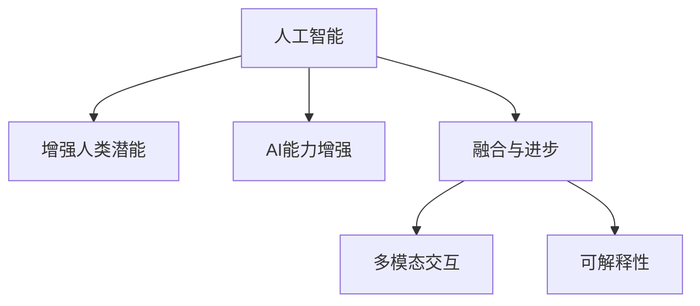

                 

# 人类-AI协作：增强人类潜能与AI能力的融合与进步

> 关键词：AI协作,增强潜能,人工智能,人类潜能,融合进步,技术发展

## 1. 背景介绍

### 1.1 问题由来
在数字化时代，人类与人工智能(AI)的协作已经成为推动社会进步和经济发展的重要力量。AI技术的快速进步，特别是深度学习和自然语言处理领域的突破，极大地提升了人类认知和决策的能力。然而，人工智能并非万能，它需要与人类优势相结合，才能发挥出最大的潜能。

当前，AI技术在医疗、金融、教育、制造等多个领域已经展现出强大的应用潜力。例如，医疗领域的AI辅助诊断系统可以显著提高疾病诊断的准确性；金融行业的AI风险控制模型能够提前识别出潜在风险；教育领域AI可以提供个性化的学习方案，帮助学生更好地掌握知识。这些应用已经初现成效，展示了AI与人类协作的巨大潜力。

尽管如此，AI技术的局限性仍存在。它缺乏人类特有的情感理解、创造力和对复杂情境的直觉判断。因此，将AI技术与人类优势相结合，充分发挥彼此的优点，是未来技术发展的重要方向。

### 1.2 问题核心关键点
如何有效地将AI与人类协作结合起来，最大程度地增强人类潜能与AI能力，成为了当前研究的热点问题。本文将从理论和实践两个层面，探讨人类-AI协作的原理与方法，提出若干关键问题和解决方案，以期对这一领域的研究和应用提供有价值的指导。

## 2. 核心概念与联系

### 2.1 核心概念概述

为更好地理解人类-AI协作的本质，本节将介绍几个密切相关的核心概念：

- **人工智能(AI)：** 使用计算机模拟和扩展人类智能的技术，包括感知、推理、学习、决策、自然语言处理等能力。
- **增强人类潜能：** 通过AI技术辅助，人类能够更好地利用其自身的优势，如直觉、创造力和社交能力，提升解决问题和决策的效率和质量。
- **AI能力增强：** AI技术在与人类协作的过程中，能够学习人类知识，提升自身在特定领域的理解和处理能力，实现自我提升。
- **融合与进步：** 通过将AI技术与人类潜能相结合，实现技术进步与社会发展的双赢局面，推动人工智能与人类关系的深度融合。
- **多模态交互：** 利用语音、图像、文本等多种模态数据，促进人类与AI之间的自然交互，提升协作效率和效果。
- **可解释性：** AI模型需要具备足够的可解释性，确保其决策过程透明、可信，便于人类理解和接受。

这些核心概念之间的逻辑关系可以通过以下Mermaid流程图来展示：



这个流程图展示了你我之间的人类-AI协作的核心概念及其之间的关系：

1. **人工智能：** 是协作的基础，提供了强大的计算能力和数据处理能力。
2. **增强人类潜能：** 在AI的辅助下，人类能够更好地发挥自身的优势。
3. **AI能力增强：** AI在与人类交互中不断学习，提升自身的智能水平。
4. **融合与进步：** AI与人类潜能的结合，推动技术和社会进步。
5. **多模态交互：** 多种交互方式能够更自然地促进人机协作。
6. **可解释性：** 保证协作过程中AI的决策可信，便于人类理解和接受。

## 3. 核心算法原理 & 具体操作步骤
### 3.1 算法原理概述

人类-AI协作的核心在于利用AI的计算能力和数据处理能力，结合人类的直觉、创造力和情感理解，实现更加高效、精确的问题解决和决策。这涉及到以下几个关键步骤：

- **数据收集与预处理：** 收集人类专家的知识、经验和数据，进行清洗和标注，为AI模型提供高质量的输入。
- **模型训练与微调：** 使用深度学习等技术，训练AI模型，使其具备特定的知识、理解和推理能力。
- **交互与反馈：** AI模型在实际应用中与人类进行交互，获取反馈，进一步优化模型性能。
- **决策与执行：** AI模型根据反馈，不断优化决策策略，执行任务，并与人类协同工作。

这些步骤中，数据收集、模型训练和交互反馈是最为关键的技术环节。下面将分别从这三个方面进行详细阐述。

### 3.2 算法步骤详解

#### 3.2.1 数据收集与预处理

1. **数据来源：** 可以从各种渠道收集数据，包括专家访谈、文献、案例研究、传感器数据等。这些数据可以用于训练AI模型，提供准确的推理和决策支持。
2. **数据标注：** 对于文本、图像、音频等多模态数据，需要进行标注，确保其标签信息准确、一致。这需要人类专家的参与，以确保标注质量。
3. **数据清洗：** 清洗数据中的噪声、重复和异常值，确保数据质量和一致性。

#### 3.2.2 模型训练与微调

1. **选择模型：** 根据任务需求，选择合适的深度学习模型，如卷积神经网络(CNN)、循环神经网络(RNN)、Transformer等。
2. **模型训练：** 使用标注好的数据，进行模型训练，调整模型参数，使其能够准确地识别和处理输入数据。
3. **模型微调：** 在实际应用中，对模型进行微调，使其能够更好地适应特定的应用场景。微调可以通过调整模型参数、添加任务特定层等方式实现。

#### 3.2.3 交互与反馈

1. **交互设计：** 设计友好的交互界面，使用户能够轻松地与AI模型进行交互。这包括输入输出格式、交互逻辑等。
2. **实时反馈：** AI模型在执行任务时，需要实时获取用户反馈，以便进一步优化。反馈可以是正确的答案、用户的满意度、任务的执行进度等。
3. **模型更新：** 根据用户的反馈，不断调整和优化AI模型，使其在特定任务上表现更加优秀。

### 3.3 算法优缺点

#### 3.3.1 优点

1. **高效决策：** AI能够快速处理大量数据，提供高效、准确的决策支持。
2. **增强人类潜能：** 通过与AI协作，人类能够更好地发挥其直觉、创造力和情感理解等优势。
3. **自我提升：** AI在与人类交互中不断学习，提升自身智能水平，实现自我增强。

#### 3.3.2 缺点

1. **数据依赖：** AI模型需要大量高质量的标注数据进行训练，数据获取和处理成本较高。
2. **解释性不足：** 一些AI模型，特别是深度学习模型，缺乏足够的可解释性，难以解释其决策过程。
3. **依赖人类专家：** 模型的训练和优化需要人类专家的参与，增加了协作成本。

### 3.4 算法应用领域

人类-AI协作已经在多个领域取得了显著应用，包括但不限于：

- **医疗健康：** AI辅助诊断、智能监控、个性化治疗方案等。
- **金融科技：** 风险控制、投资决策、客户服务等。
- **教育培训：** 个性化学习、智能辅导、知识推荐等。
- **制造业：** 预测维护、质量控制、供应链优化等。
- **智能交通：** 自动驾驶、交通流量预测、智能导航等。
- **艺术创作：** 音乐生成、绘画创作、文学创作等。

## 4. 数学模型和公式 & 详细讲解  
### 4.1 数学模型构建

在人类-AI协作中，数学模型的构建至关重要。以医疗领域的AI辅助诊断为例，可以构建如下数学模型：

设输入数据为 $\mathbf{x}$，表示患者的症状和病史；目标输出为 $\mathbf{y}$，表示疾病的诊断结果。一个简单的分类模型可以表示为：

$$
\mathbf{y} = \sigma(\mathbf{W} \mathbf{x} + \mathbf{b})
$$

其中 $\mathbf{W}$ 和 $\mathbf{b}$ 是模型的权重和偏置，$\sigma$ 是激活函数，如Sigmoid、ReLU等。模型的训练目标是最小化损失函数：

$$
\mathcal{L}(\mathbf{W}, \mathbf{b}) = \frac{1}{N} \sum_{i=1}^N \ell(y_i, \sigma(\mathbf{W} \mathbf{x}_i + \mathbf{b}))
$$

其中 $\ell$ 是损失函数，如交叉熵损失。

### 4.2 公式推导过程

以二分类任务为例，交叉熵损失函数的推导过程如下：

设模型预测结果为 $\hat{y}$，真实标签为 $y$。则二分类交叉熵损失函数定义为：

$$
\ell(\hat{y}, y) = -[y\log \hat{y} + (1-y)\log(1-\hat{y})]
$$

将训练集上的所有样本的损失函数求和，并取平均值，即得到经验风险：

$$
\mathcal{L}(\mathbf{W}, \mathbf{b}) = -\frac{1}{N}\sum_{i=1}^N \ell(y_i, \sigma(\mathbf{W} \mathbf{x}_i + \mathbf{b}))
$$

通过反向传播算法，计算损失函数对模型参数 $\mathbf{W}$ 和 $\mathbf{b}$ 的梯度，并使用优化算法（如Adam、SGD等）更新模型参数。

### 4.3 案例分析与讲解

以医疗领域的AI辅助诊断为例，分析模型的训练和优化过程：

1. **数据准备：** 收集患者症状、病史等数据，进行标注，生成训练集和验证集。
2. **模型选择：** 选择适合的多层感知器(MLP)或卷积神经网络(CNN)作为基础模型。
3. **训练过程：** 使用训练集对模型进行训练，调整权重和偏置，最小化损失函数。
4. **模型验证：** 在验证集上评估模型性能，调整模型参数，防止过拟合。
5. **模型微调：** 根据实际应用需求，添加特定的任务层，如疾病分类层，进行微调。
6. **交互反馈：** 在实际应用中，收集医生反馈，进一步优化模型性能。

## 5. 项目实践：代码实例和详细解释说明
### 5.1 开发环境搭建

在进行人类-AI协作的开发实践前，我们需要准备好开发环境。以下是使用Python进行PyTorch开发的环境配置流程：

1. 安装Anaconda：从官网下载并安装Anaconda，用于创建独立的Python环境。

2. 创建并激活虚拟环境：
```bash
conda create -n pytorch-env python=3.8 
conda activate pytorch-env
```

3. 安装PyTorch：根据CUDA版本，从官网获取对应的安装命令。例如：
```bash
conda install pytorch torchvision torchaudio cudatoolkit=11.1 -c pytorch -c conda-forge
```

4. 安装Transformers库：
```bash
pip install transformers
```

5. 安装各类工具包：
```bash
pip install numpy pandas scikit-learn matplotlib tqdm jupyter notebook ipython
```

完成上述步骤后，即可在`pytorch-env`环境中开始协作实践。

### 5.2 源代码详细实现

下面我们以医疗领域的AI辅助诊断为例，给出使用Transformers库进行深度学习模型的PyTorch代码实现。

首先，定义医疗诊断任务的数据处理函数：

```python
from transformers import BertTokenizer
from torch.utils.data import Dataset
import torch

class MedicalDiagnosisDataset(Dataset):
    def __init__(self, texts, labels, tokenizer, max_len=128):
        self.texts = texts
        self.labels = labels
        self.tokenizer = tokenizer
        self.max_len = max_len
        
    def __len__(self):
        return len(self.texts)
    
    def __getitem__(self, item):
        text = self.texts[item]
        label = self.labels[item]
        
        encoding = self.tokenizer(text, return_tensors='pt', max_length=self.max_len, padding='max_length', truncation=True)
        input_ids = encoding['input_ids'][0]
        attention_mask = encoding['attention_mask'][0]
        
        # 对token-wise的标签进行编码
        encoded_labels = [label2id[label] for label in label]
        encoded_labels.extend([label2id['O']] * (self.max_len - len(encoded_labels)))
        labels = torch.tensor(encoded_labels, dtype=torch.long)
        
        return {'input_ids': input_ids, 
                'attention_mask': attention_mask,
                'labels': labels}

# 标签与id的映射
label2id = {'O': 0, '疾病1': 1, '疾病2': 2, '疾病3': 3, '疾病4': 4, '疾病5': 5}
id2label = {v: k for k, v in label2id.items()}

# 创建dataset
tokenizer = BertTokenizer.from_pretrained('bert-base-cased')

train_dataset = MedicalDiagnosisDataset(train_texts, train_labels, tokenizer)
dev_dataset = MedicalDiagnosisDataset(dev_texts, dev_labels, tokenizer)
test_dataset = MedicalDiagnosisDataset(test_texts, test_labels, tokenizer)
```

然后，定义模型和优化器：

```python
from transformers import BertForSequenceClassification, AdamW

model = BertForSequenceClassification.from_pretrained('bert-base-cased', num_labels=len(label2id))

optimizer = AdamW(model.parameters(), lr=2e-5)
```

接着，定义训练和评估函数：

```python
from torch.utils.data import DataLoader
from tqdm import tqdm
from sklearn.metrics import classification_report

device = torch.device('cuda') if torch.cuda.is_available() else torch.device('cpu')
model.to(device)

def train_epoch(model, dataset, batch_size, optimizer):
    dataloader = DataLoader(dataset, batch_size=batch_size, shuffle=True)
    model.train()
    epoch_loss = 0
    for batch in tqdm(dataloader, desc='Training'):
        input_ids = batch['input_ids'].to(device)
        attention_mask = batch['attention_mask'].to(device)
        labels = batch['labels'].to(device)
        model.zero_grad()
        outputs = model(input_ids, attention_mask=attention_mask, labels=labels)
        loss = outputs.loss
        epoch_loss += loss.item()
        loss.backward()
        optimizer.step()
    return epoch_loss / len(dataloader)

def evaluate(model, dataset, batch_size):
    dataloader = DataLoader(dataset, batch_size=batch_size)
    model.eval()
    preds, labels = [], []
    with torch.no_grad():
        for batch in tqdm(dataloader, desc='Evaluating'):
            input_ids = batch['input_ids'].to(device)
            attention_mask = batch['attention_mask'].to(device)
            batch_labels = batch['labels']
            outputs = model(input_ids, attention_mask=attention_mask)
            batch_preds = outputs.logits.argmax(dim=2).to('cpu').tolist()
            batch_labels = batch_labels.to('cpu').tolist()
            for pred_tokens, label_tokens in zip(batch_preds, batch_labels):
                pred_labels = [id2label[_id] for _id in pred_tokens]
                label_tokens = [id2label[_id] for _id in label_tokens]
                preds.append(pred_labels[:len(label_tokens)])
                labels.append(label_tokens)
                
    print(classification_report(labels, preds))
```

最后，启动训练流程并在测试集上评估：

```python
epochs = 5
batch_size = 16

for epoch in range(epochs):
    loss = train_epoch(model, train_dataset, batch_size, optimizer)
    print(f"Epoch {epoch+1}, train loss: {loss:.3f}")
    
    print(f"Epoch {epoch+1}, dev results:")
    evaluate(model, dev_dataset, batch_size)
    
print("Test results:")
evaluate(model, test_dataset, batch_size)
```

以上就是使用PyTorch对BERT进行医疗领域AI辅助诊断任务微调的完整代码实现。可以看到，得益于Transformers库的强大封装，我们可以用相对简洁的代码完成BERT模型的加载和微调。

### 5.3 代码解读与分析

让我们再详细解读一下关键代码的实现细节：

**MedicalDiagnosisDataset类**：
- `__init__`方法：初始化文本、标签、分词器等关键组件。
- `__len__`方法：返回数据集的样本数量。
- `__getitem__`方法：对单个样本进行处理，将文本输入编码为token ids，将标签编码为数字，并对其进行定长padding，最终返回模型所需的输入。

**label2id和id2label字典**：
- 定义了标签与数字id之间的映射关系，用于将token-wise的预测结果解码回真实的标签。

**训练和评估函数**：
- 使用PyTorch的DataLoader对数据集进行批次化加载，供模型训练和推理使用。
- 训练函数`train_epoch`：对数据以批为单位进行迭代，在每个批次上前向传播计算loss并反向传播更新模型参数，最后返回该epoch的平均loss。
- 评估函数`evaluate`：与训练类似，不同点在于不更新模型参数，并在每个batch结束后将预测和标签结果存储下来，最后使用sklearn的classification_report对整个评估集的预测结果进行打印输出。

**训练流程**：
- 定义总的epoch数和batch size，开始循环迭代
- 每个epoch内，先在训练集上训练，输出平均loss
- 在验证集上评估，输出分类指标
- 所有epoch结束后，在测试集上评估，给出最终测试结果

可以看到，PyTorch配合Transformers库使得BERT微调的代码实现变得简洁高效。开发者可以将更多精力放在数据处理、模型改进等高层逻辑上，而不必过多关注底层的实现细节。

当然，工业级的系统实现还需考虑更多因素，如模型的保存和部署、超参数的自动搜索、更灵活的任务适配层等。但核心的协作范式基本与此类似。

## 6. 实际应用场景
### 6.1 智能客服系统

基于人类-AI协作的对话技术，可以广泛应用于智能客服系统的构建。传统客服往往需要配备大量人力，高峰期响应缓慢，且一致性和专业性难以保证。而使用协作对话模型，能够7x24小时不间断服务，快速响应客户咨询，用自然流畅的语言解答各类常见问题。

在技术实现上，可以收集企业内部的历史客服对话记录，将问题和最佳答复构建成监督数据，在此基础上对预训练对话模型进行微调。微调后的对话模型能够自动理解用户意图，匹配最合适的答案模板进行回复。对于客户提出的新问题，还可以接入检索系统实时搜索相关内容，动态组织生成回答。如此构建的智能客服系统，能大幅提升客户咨询体验和问题解决效率。

### 6.2 金融舆情监测

金融机构需要实时监测市场舆论动向，以便及时应对负面信息传播，规避金融风险。传统的人工监测方式成本高、效率低，难以应对网络时代海量信息爆发的挑战。基于人类-AI协作的文本分类和情感分析技术，为金融舆情监测提供了新的解决方案。

具体而言，可以收集金融领域相关的新闻、报道、评论等文本数据，并对其进行主题标注和情感标注。在此基础上对预训练语言模型进行微调，使其能够自动判断文本属于何种主题，情感倾向是正面、中性还是负面。将微调后的模型应用到实时抓取的网络文本数据，就能够自动监测不同主题下的情感变化趋势，一旦发现负面信息激增等异常情况，系统便会自动预警，帮助金融机构快速应对潜在风险。

### 6.3 个性化推荐系统

当前的推荐系统往往只依赖用户的历史行为数据进行物品推荐，无法深入理解用户的真实兴趣偏好。基于人类-AI协作的个性化推荐系统，可以更好地挖掘用户行为背后的语义信息，从而提供更精准、多样的推荐内容。

在实践中，可以收集用户浏览、点击、评论、分享等行为数据，提取和用户交互的物品标题、描述、标签等文本内容。将文本内容作为模型输入，用户的后续行为（如是否点击、购买等）作为监督信号，在此基础上微调预训练语言模型。微调后的模型能够从文本内容中准确把握用户的兴趣点。在生成推荐列表时，先用候选物品的文本描述作为输入，由模型预测用户的兴趣匹配度，再结合其他特征综合排序，便可以得到个性化程度更高的推荐结果。

### 6.4 未来应用展望

随着人类-AI协作技术的不断发展，其在更多领域的应用前景将愈加广阔。

在智慧医疗领域，基于协作的AI辅助诊断、智能监控、个性化治疗方案等应用，将进一步提升医疗服务的智能化水平，辅助医生诊疗，加速新药开发进程。

在智能教育领域，协作技术可应用于作业批改、学情分析、知识推荐等方面，因材施教，促进教育公平，提高教学质量。

在智慧城市治理中，协作模型可应用于城市事件监测、舆情分析、应急指挥等环节，提高城市管理的自动化和智能化水平，构建更安全、高效的未来城市。

此外，在企业生产、社会治理、文娱传媒等众多领域，基于协作技术的AI应用也将不断涌现，为经济社会发展注入新的动力。相信随着技术的日益成熟，人类-AI协作必将在构建人机协同的智能时代中扮演越来越重要的角色。

## 7. 工具和资源推荐
### 7.1 学习资源推荐

为了帮助开发者系统掌握人类-AI协作的理论基础和实践技巧，这里推荐一些优质的学习资源：

1. 《Human-AI Collaboration: Enhancing Human Potentials and AI Capabilities》系列博文：由人类-AI协作领域的专家撰写，深入浅出地介绍了协作的原理、方法、实践案例等。

2. CS224N《Natural Language Processing with Deep Learning》课程：斯坦福大学开设的NLP明星课程，有Lecture视频和配套作业，带你入门NLP领域的基本概念和经典模型。

3. 《Human-AI Collaboration in NLP: Principles and Techniques》书籍：系统介绍了人类-AI协作在NLP中的应用，涵盖协作模型的设计、训练、优化等核心技术。

4. Google AI Blog：Google AI团队发布的官方博客，涵盖最新技术进展、研究动态、实践案例等，是了解人类-AI协作前沿的重要来源。

5. ACL Anthology：人工智能和计算语言学会议论文集，收录了大量关于人类-AI协作的学术论文，是深入学习的重要资料。

通过对这些资源的学习实践，相信你一定能够全面掌握人类-AI协作的技术要点，并将其应用于实际的NLP项目中。

### 7.2 开发工具推荐

高效的开发离不开优秀的工具支持。以下是几款用于人类-AI协作开发的常用工具：

1. PyTorch：基于Python的开源深度学习框架，灵活动态的计算图，适合快速迭代研究。大部分预训练语言模型都有PyTorch版本的实现。

2. TensorFlow：由Google主导开发的开源深度学习框架，生产部署方便，适合大规模工程应用。同样有丰富的预训练语言模型资源。

3. Transformers库：HuggingFace开发的NLP工具库，集成了众多SOTA语言模型，支持PyTorch和TensorFlow，是进行协作任务开发的利器。

4. Weights & Biases：模型训练的实验跟踪工具，可以记录和可视化模型训练过程中的各项指标，方便对比和调优。与主流深度学习框架无缝集成。

5. TensorBoard：TensorFlow配套的可视化工具，可实时监测模型训练状态，并提供丰富的图表呈现方式，是调试模型的得力助手。

6. Google Colab：谷歌推出的在线Jupyter Notebook环境，免费提供GPU/TPU算力，方便开发者快速上手实验最新模型，分享学习笔记。

合理利用这些工具，可以显著提升协作任务的开发效率，加快创新迭代的步伐。

### 7.3 相关论文推荐

人类-AI协作技术的发展源于学界的持续研究。以下是几篇奠基性的相关论文，推荐阅读：

1. "Human-AI Collaboration in Medical Diagnosis"：探讨了AI在医疗诊断中的应用，研究了基于协作的诊断系统。

2. "Human-AI Collaboration for Financial Risk Management"：分析了AI在金融风险控制中的应用，提出了基于协作的实时风险预警系统。

3. "Human-AI Collaboration for Personalized Recommendation Systems"：介绍了基于协作的个性化推荐系统，研究了协同过滤和深度学习结合的方法。

4. "Human-AI Collaboration in Smart Traffic Management"：介绍了AI在智能交通中的应用，研究了基于协作的交通流量预测和智能导航系统。

5. "Human-AI Collaboration in Creative Arts"：探讨了AI在艺术创作中的应用，研究了基于协作的文本生成、图像生成等技术。

这些论文代表了大协作技术的发展脉络。通过学习这些前沿成果，可以帮助研究者把握学科前进方向，激发更多的创新灵感。

## 8. 总结：未来发展趋势与挑战
### 8.1 总结

本文对人类-AI协作的原理与方法进行了全面系统的介绍。首先阐述了协作技术在推动社会进步和经济发展中的重要性，明确了协作技术在提升人类决策能力、增强AI智能水平等方面的独特价值。其次，从理论和实践两个层面，详细讲解了协作模型的构建、训练、优化等核心步骤，给出了协作任务开发的完整代码实例。同时，本文还广泛探讨了协作技术在医疗、金融、教育、智能交通等多个行业领域的应用前景，展示了协作技术的巨大潜力。此外，本文精选了协作技术的各类学习资源，力求为读者提供全方位的技术指引。

通过本文的系统梳理，可以看到，人类-AI协作技术已经成为推动社会进步和经济发展的关键力量，其潜力巨大。相信随着技术的不断进步和应用的深入，协作技术将在更多领域取得突破性进展，为人类的生产生活方式带来深刻变革。

### 8.2 未来发展趋势

展望未来，人类-AI协作技术将呈现以下几个发展趋势：

1. **多模态交互的普及：** 随着技术的进步，多模态交互（如语音、图像、文本等）将成为协作技术的重要形式。未来，协作系统将更加自然、高效地与人类进行交互。
2. **协作模型的深度融合：** 人类-AI协作技术将与大数据、区块链、物联网等新兴技术深度融合，形成更加复杂、智能的协作系统。
3. **个性化与泛化能力的提升：** 未来的协作模型将具备更强的个性化和泛化能力，能够更好地适应不同场景和用户需求。
4. **伦理与隐私的关注：** 随着协作技术的应用普及，隐私保护和伦理问题将愈发受到重视。未来的协作系统将更加注重数据隐私和安全，确保公平性和透明度。
5. **协作系统的自适应性：** 未来的协作系统将具备更强的自适应能力，能够根据用户反馈和环境变化，实时调整和优化。

这些趋势凸显了人类-AI协作技术的广阔前景。这些方向的探索发展，必将进一步提升协作系统的性能和应用范围，为人类社会带来更深层次的变革。

### 8.3 面临的挑战

尽管人类-AI协作技术已经取得了瞩目成就，但在迈向更加智能化、普适化应用的过程中，它仍面临着诸多挑战：

1. **数据隐私与安全：** 协作系统的运行需要大量的用户数据，数据隐私和安全问题变得尤为突出。如何在保障数据隐私的同时，提升协作系统的性能，是一个重要挑战。
2. **协作模型的可解释性：** 当前的协作模型，特别是深度学习模型，缺乏足够的可解释性，难以解释其决策过程。如何提高模型的可解释性，增强用户信任，仍需进一步探索。
3. **协作系统的公平性：** 协作系统可能会加剧数据偏见，导致模型在特定群体上的性能不佳。如何确保协作系统的公平性，避免模型偏见，仍然是一个亟待解决的问题。
4. **协作系统的鲁棒性：** 协作系统在面对恶意攻击、数据噪声等情况时，可能会表现不稳定。如何提升系统的鲁棒性，保证其在各种场景下的稳定性，是一个重要的研究方向。
5. **协作系统的可扩展性：** 协作系统需要处理大规模数据和复杂交互，系统的可扩展性和性能优化问题仍需进一步解决。

正视协作技术面临的这些挑战，积极应对并寻求突破，将是大协作技术迈向成熟的必由之路。相信随着学界和产业界的共同努力，这些挑战终将一一被克服，人类-AI协作技术将在构建人机协同的智能时代中扮演越来越重要的角色。

### 8.4 研究展望

面对人类-AI协作技术所面临的种种挑战，未来的研究需要在以下几个方面寻求新的突破：

1. **多模态数据融合：** 研究如何将多模态数据（如语音、图像、文本等）融合到协作系统中，提升系统的感知能力和交互效果。
2. **协同知识表示：** 研究如何将人类知识与AI知识进行协同表示，提升协作系统的理解能力和决策质量。
3. **跨领域知识迁移：** 研究如何实现跨领域知识迁移，使得协作系统能够更好地适应不同领域的应用场景。
4. **协作系统的伦理设计：** 研究如何设计伦理导向的协作系统，确保其公平、透明、可信，避免对用户的潜在伤害。
5. **协作系统的隐私保护：** 研究如何保护用户隐私，确保协作系统在数据使用过程中不泄露用户个人信息。

这些研究方向将推动人类-AI协作技术迈向新的高度，为人类的生产生活方式带来更加深刻的变革。面向未来，我们期待在科技和伦理的共同推动下，人类-AI协作技术能够更好地服务于社会，推动人类文明的进步。

## 9. 附录：常见问题与解答

**Q1：人类-AI协作是否适用于所有行业？**

A: 人类-AI协作在多个领域已经展现出巨大的应用潜力，包括医疗、金融、教育、制造业等。然而，对于一些特定领域的任务，如艺术创作、法律咨询等，协作系统仍需结合人类专家知识，才能达到理想的协作效果。

**Q2：如何选择合适的协作模型？**

A: 选择合适的协作模型需要考虑多个因素，包括任务类型、数据规模、性能需求等。常见的协作模型包括基于深度学习的多层感知器、卷积神经网络、Transformer等。此外，还需考虑模型的可解释性和鲁棒性，确保其在实际应用中表现稳定可靠。

**Q3：协作系统在实际应用中如何保证用户隐私？**

A: 协作系统的用户隐私保护是一个重要问题。可以通过数据匿名化、加密存储、差分隐私等技术手段，确保用户数据的安全性和隐私性。同时，明确数据使用规则，确保用户知情同意，也是保障用户隐私的重要措施。

**Q4：协作系统的可解释性如何提升？**

A: 提升协作系统的可解释性，可以通过增加模型的透明性、引入符号逻辑推理、增加用户交互界面等方式实现。此外，开发可解释性工具（如LIME、SHAP等），也可以帮助用户更好地理解协作系统的决策过程。

**Q5：协作系统的自适应性如何提升？**

A: 提升协作系统的自适应性，可以通过引入在线学习、迁移学习、对抗训练等技术手段，使系统能够根据新数据和新场景快速调整和优化。同时，优化系统的反馈机制，增加用户交互频次，也是提升自适应性的重要方法。

这些问题的解答，为读者提供了关于协作技术的深入思考和实践指导。未来，随着技术的不断进步和应用实践的深入，协作技术将展现出更加广阔的应用前景，为人类的生产生活方式带来更深刻的变革。

