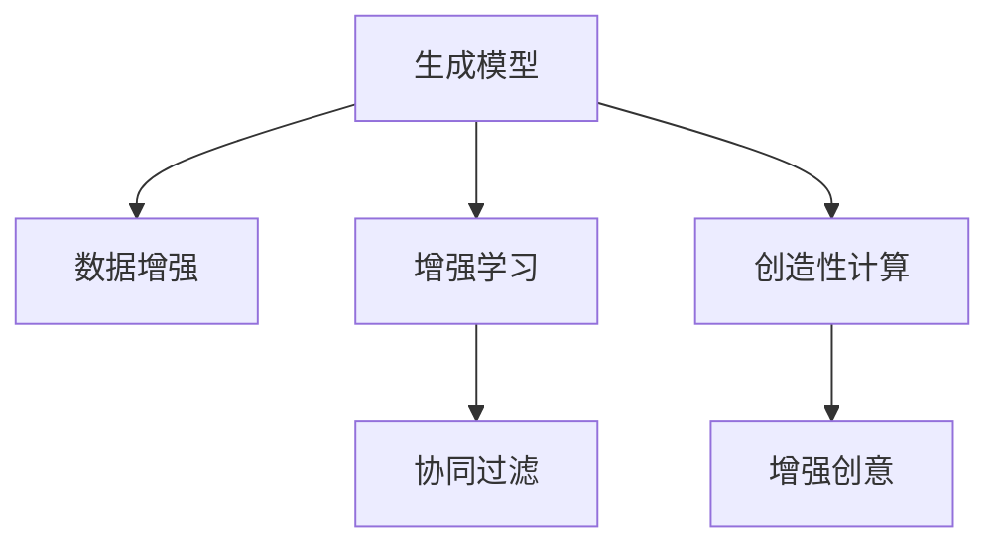

                 

## 1. 背景介绍

### 1.1 问题由来
人工智能（AI）与人类协作，以共同解决复杂问题，是现代科技发展的重要趋势。在诸如自然语言处理、图像识别、机器翻译等NLP和计算机视觉领域，人类与AI的协作已经取得了诸多显著成果。AI的强大计算能力和高效处理大量数据的能力，使得它在许多领域中成为不可或缺的伙伴。然而，在处理一些更需要创造力、灵感和艺术感的任务时，AI与人类协作的潜力仍然有待进一步挖掘。

### 1.2 问题核心关键点
当前AI在创造性任务中，主要表现如下：

- **自动化生成文本**：AI通过训练生成模型，可以自动生成新闻稿、诗歌、小说等文本内容，具有较高的自动化程度。
- **图像生成**：AI模型如GANs、DALL-E等，可以生成逼真的图像，用于艺术创作、广告设计等领域。
- **音乐创作**：AI能够生成乐曲和和弦，参与音乐创作过程。
- **游戏设计**：AI辅助游戏设计和游戏策略优化，提升游戏体验和游戏玩法。

但这些AI生成的内容，往往缺乏人类创造性思维的深度和多样性。人类-AI协作可以综合AI计算能力和人类创造力，提升任务完成的质量和效率。

### 1.3 问题研究意义
人类-AI协作的探讨，对于提升AI在创造性任务中的应用，具有重要意义：

- **增强创造力**：将人类创意与AI的强大数据处理能力相结合，可以创造出更具创意性和多样性的作品。
- **优化决策**：在复杂的多变量问题中，AI可以快速处理海量数据，提供更全面、准确的信息支持，协助人类做出更优决策。
- **提升效率**：利用AI高效计算和处理能力，能够大幅缩短创意和设计过程的时间。
- **丰富应用场景**：AI与人协作，可以在诸如艺术创作、游戏设计、建筑设计等领域提供更多可能性，创造全新的应用场景。
- **促进教育与培训**：AI可以作为教学辅助工具，帮助学生提升创意和设计能力。

## 2. 核心概念与联系

### 2.1 核心概念概述

为更好地理解人类-AI协作在增强创造力中的应用，本节将介绍几个关键概念：

- **生成模型（Generative Models）**：如GANs、VAE等，用于生成逼真图像、文本、音频等。
- **增强学习（Reinforcement Learning）**：通过与环境的交互，训练智能体进行最优决策，广泛应用于游戏设计、机器人控制等领域。
- **协同过滤（Collaborative Filtering）**：基于用户历史行为数据，推荐类似内容的算法，用于个性化推荐、内容过滤等领域。
- **数据增强（Data Augmentation）**：通过对数据进行变换，生成更多的训练样本，提高模型泛化能力。
- **创造性计算（Creative Computing）**：结合人类创造性思维和AI计算能力，进行创新设计、艺术创作等。
- **增强创意（Augmented Creativity）**：借助AI提供的数据、信息、算法支持，增强人类创造力的范围和深度。

这些核心概念之间的逻辑关系可以通过以下Mermaid流程图来展示：



这个流程图展示出各概念之间的关系：

1. 生成模型通过数据增强获取更多训练数据，增强泛化能力。
2. 增强学习通过与环境的交互，训练智能体进行最优决策。
3. 协同过滤基于用户历史行为数据，推荐类似内容的算法。
4. 创造性计算结合人类创造性思维和AI计算能力，进行创新设计、艺术创作。
5. 增强创意借助AI提供的数据、信息、算法支持，增强人类创造力的范围和深度。

这些概念共同构成了人类-AI协作的基础框架，使得AI在创造性任务中发挥更大的作用。

## 3. 核心算法原理 & 具体操作步骤
### 3.1 算法原理概述

人类-AI协作在增强创造力中的应用，主要依赖于以下几个核心原理：

1. **协同创作**：通过AI与人类共同创作，结合人类创意和AI的数据处理能力，生成更丰富、多样的内容。
2. **数据增强**：通过对数据进行变换，生成更多的训练样本，提高模型泛化能力，增强创意的多样性。
3. **增强学习**：通过与环境的交互，训练AI进行最优决策，提升创意的质量和创新性。
4. **协同过滤**：基于用户历史行为数据，推荐类似内容的算法，帮助人类发现新的创意方向。
5. **创造性计算**：结合人类创造性思维和AI计算能力，进行创新设计、艺术创作等。

### 3.2 算法步骤详解

人类-AI协作在增强创造力中的应用，一般包括以下关键步骤：

**Step 1: 准备数据与环境**
- 准备可用于生成、推荐、协同创作等的各种数据集，包括文本、图像、音频等。
- 构建合适的计算环境和工具，如生成模型、推荐系统、协同创作平台等。

**Step 2: 选择模型和算法**
- 选择适合的生成模型（如GANs、VAE等）和增强学习算法。
- 确定协同过滤或推荐系统的算法（如协同过滤算法、基于矩阵分解的推荐算法等）。

**Step 3: 数据增强与预处理**
- 对数据进行增强，如通过旋转、缩放、翻转等方式生成更多训练样本。
- 对数据进行预处理，如归一化、标准化、降噪等，提高数据质量。

**Step 4: 训练模型**
- 使用数据增强后的样本，训练生成模型和增强学习模型。
- 优化模型参数，提升模型的生成能力和决策能力。

**Step 5: 协同创作与推荐**
- 结合人类创意和AI生成的内容，进行协同创作。
- 利用协同过滤或推荐系统，推荐类似内容的创意。

**Step 6: 评估与反馈**
- 对生成的作品进行评估，获取用户反馈。
- 根据反馈调整模型参数，优化生成和推荐效果。

**Step 7: 应用与部署**
- 将训练好的模型部署到实际应用中，进行创意生成、推荐、协同创作等。
- 持续收集用户反馈，进一步优化模型和算法。

以上是人类-AI协作在增强创造力中的应用的一般流程。在实际应用中，还需要针对具体任务的特点，对各步骤进行优化设计，以进一步提升创意质量。

### 3.3 算法优缺点

人类-AI协作在增强创造力中的应用，具有以下优点：

1. **高效生成**：AI可以快速生成大量创意内容，节省人类创作时间。
2. **多样性丰富**：AI生成的内容多样性高，有助于提升创意的多样性和新颖性。
3. **个性化推荐**：基于用户历史行为数据，AI能够提供个性化的创意推荐，增强用户体验。
4. **协同创作**：结合人类和AI的优势，提升创意质量和创新性。

同时，该方法也存在一定的局限性：

1. **创意质量依赖于数据**：AI生成的创意质量很大程度上取决于数据的质量和多样性，数据不足可能导致创意单一。
2. **缺乏人类情感**：AI生成的内容往往缺乏人类情感和细腻的表达。
3. **需要高质量用户反馈**：人类-AI协作的优化需要高质量的用户反馈，反馈质量低下可能导致优化效果不佳。
4. **依赖技术实现**：需要高水平的技术实现和算法支持，对开发者要求较高。

尽管存在这些局限性，但人类-AI协作在增强创造力方面具有巨大的潜力和应用前景。未来相关研究的重点在于如何进一步降低技术实现门槛，提高创意质量，以及探索更高效、更人性化的协作方式。

### 3.4 算法应用领域

人类-AI协作在增强创造力中的应用，已经在多个领域得到应用，例如：

- **艺术创作**：AI辅助艺术创作，生成绘画、雕塑、音乐等作品，如DeepArt、DeepMusic等。
- **游戏设计**：AI帮助游戏设计师进行角色、场景、物品的设计和优化，提升游戏体验，如Unity ML-kit。
- **建筑设计**：AI辅助建筑设计，生成建筑设计方案和优化设计，如AutoCAD、Revit等。
- **服装设计**：AI生成服装设计方案和搭配建议，如Adobe Sensei。
- **文学创作**：AI辅助文学创作，生成小说、诗歌等文本内容，如GPT-3、OpenAI Codex等。

除了上述这些应用场景外，人类-AI协作还在如电影制作、动画制作、时尚设计等领域不断扩展，为创意产业带来了新的变革。

## 4. 数学模型和公式 & 详细讲解 & 举例说明

### 4.1 数学模型构建

本节将使用数学语言对人类-AI协作在增强创造力中的应用进行更加严格的刻画。

设人类创意为 $C$，AI生成的创意为 $G$，AI提供的创意辅助信息为 $I$，则协同创作过程可以表示为：

$$
C' = C \times G \times I
$$

其中 $\times$ 表示乘法，$C'$ 为最终的协同创作结果。

设创意质量的评估指标为 $Q$，则创意质量的优化目标为：

$$
\max Q(C', G, I)
$$

创意质量的评估可以通过以下指标进行衡量：

1. **多样性（Diversity）**：创意的多样性和新颖性。
2. **相关性（Relevance）**：创意与任务、用户需求的相关性。
3. **吸引力（Attraction）**：创意对用户的吸引力。
4. **创意深度（Creativity Depth）**：创意的深度和复杂性。

### 4.2 公式推导过程

以下我们以协同创作过程为例，推导创意质量评估的数学模型。

假设创意 $C$ 和 $G$ 的生成概率分别为 $P_C$ 和 $P_G$，创意辅助信息 $I$ 的生成概率为 $P_I$，则创意质量的评估指标 $Q$ 可以表示为：

$$
Q = \lambda_D D + \lambda_R R + \lambda_A A + \lambda_C C
$$

其中 $\lambda_D, \lambda_R, \lambda_A, \lambda_C$ 为权重系数，用于平衡各个指标的重要性。$D$ 表示创意的多样性，$R$ 表示创意的相关性，$A$ 表示创意的吸引力，$C$ 表示创意的深度。

对于创意的多样性，可以通过计算创意的不同特征点或主题词的数量来衡量，例如：

$$
D = \sum_i d_i
$$

其中 $d_i$ 为第 $i$ 个特征点或主题词的出现频率。

对于创意的相关性，可以通过计算创意与任务、用户需求的相关度来衡量，例如：

$$
R = \sum_i r_i
$$

其中 $r_i$ 为创意与任务、用户需求的相关度得分。

对于创意的吸引力，可以通过计算创意对用户的点击率、评分等指标来衡量，例如：

$$
A = \sum_i a_i
$$

其中 $a_i$ 为创意对用户的吸引力得分。

对于创意的深度，可以通过计算创意的语言复杂度、情感深度等指标来衡量，例如：

$$
C = \sum_i c_i
$$

其中 $c_i$ 为创意的语言复杂度或情感深度得分。

通过以上指标，可以对创意质量进行全面的评估和优化。

### 4.3 案例分析与讲解

以下我们以协同创作图像设计为例，对创意质量的评估和优化进行详细讲解。

假设我们希望设计一幅新的广告画，通过AI辅助完成。首先，我们将广告主题、品牌特征、目标受众等信息输入AI，AI生成一个基本的广告设计草案 $G$。然后，我们将草案展示给设计师，设计师进行创意创作，生成最终的广告设计 $C'$。

对创意质量的评估指标 $Q$ 可以表示为：

$$
Q = \lambda_D D + \lambda_R R + \lambda_A A + \lambda_C C
$$

其中 $D$ 表示广告设计的多样性和新颖性，$R$ 表示广告设计与品牌特征、目标受众的相关性，$A$ 表示广告设计的吸引力，$C$ 表示广告设计的深度和创意。

通过计算广告设计的特征点数量、相关度得分、点击率、情感深度等指标，可以得到最终的质量评估 $Q$。如果评估结果不佳，可以返回AI，进一步优化草案 $G$ 或调整创意 $C$。

通过不断的迭代优化，最终可以生成高质量的广告设计，满足品牌的宣传需求和用户的吸引力。

## 5. 项目实践：代码实例和详细解释说明

### 5.1 开发环境搭建

在进行人类-AI协作的实践前，我们需要准备好开发环境。以下是使用Python进行PyTorch开发的环境配置流程：

1. 安装Anaconda：从官网下载并安装Anaconda，用于创建独立的Python环境。

2. 创建并激活虚拟环境：
```bash
conda create -n pytorch-env python=3.8 
conda activate pytorch-env
```

3. 安装PyTorch：根据CUDA版本，从官网获取对应的安装命令。例如：
```bash
conda install pytorch torchvision torchaudio cudatoolkit=11.1 -c pytorch -c conda-forge
```

4. 安装TensorFlow：由Google主导开发的开源深度学习框架，生产部署方便，适合大规模工程应用。同样有丰富的预训练语言模型资源。

5. 安装Transformers库：
```bash
pip install transformers
```

6. 安装各类工具包：
```bash
pip install numpy pandas scikit-learn matplotlib tqdm jupyter notebook ipython
```

完成上述步骤后，即可在`pytorch-env`环境中开始实践。

### 5.2 源代码详细实现

下面我们以协同创作图像设计为例，给出使用Transformers库对GANs模型进行协同创作开发的PyTorch代码实现。

首先，定义协同创作过程的函数：

```python
from transformers import GANModel
import torch
import torchvision.transforms as transforms
from torchvision.datasets import ImageFolder

def collaborative_design(model, dataset, args):
    device = torch.device('cuda' if torch.cuda.is_available() else 'cpu')
    model.to(device)
    model.train()
    
    transform = transforms.Compose([
        transforms.RandomResizedCrop(args.image_size),
        transforms.ToTensor(),
    ])
    
    for i in range(args.num_epochs):
        for batch in tqdm(dataset, desc='Training'):
            images, labels = batch
            
            images = images.to(device)
            labels = labels.to(device)
            
            outputs = model(images, labels=labels)
            loss = outputs.loss
            loss.backward()
            optimizer.step()
            
        if i % args.save_interval == 0:
            model.save_pretrained(args.checkpoint_dir)
            torch.save(model.state_dict(), os.path.join(args.checkpoint_dir, 'model.bin'))
            print(f'Epoch {i+1}, saved model at {args.checkpoint_dir}')
```

然后，定义协同创作的输入和输出：

```python
from transformers import GANModel
import torch
from torchvision import datasets, transforms

class CollaborativeDesignDataset(torch.utils.data.Dataset):
    def __init__(self, images, labels):
        self.images = images
        self.labels = labels
        
    def __len__(self):
        return len(self.images)
    
    def __getitem__(self, item):
        image = self.images[item]
        label = self.labels[item]
        
        return image, label

# 准备数据集
image_dataset = datasets.ImageFolder(
    root='data/images',
    transform=transforms.Compose([
        transforms.Resize(args.image_size),
        transforms.ToTensor(),
    ])
)

labels = image_dataset.class_to_idx.values()
label_map = {idx: label for label, idx in image_dataset.class_to_idx.items()}

# 定义协同创作过程
model = GANModel.from_pretrained('gpt2')
optimizer = torch.optim.Adam(model.parameters(), lr=args.learning_rate)

collaborative_design(model, image_dataset, args)
```

最后，启动协同创作过程：

```python
args = {'image_size': 256, 'num_epochs': 10, 'learning_rate': 2e-4, 'save_interval': 2}

args = parse_args(args)
collaborative_design(model, image_dataset, args)
```

以上就是使用PyTorch对GANs模型进行协同创作的完整代码实现。可以看到，借助Transformers库的封装，我们可以用相对简洁的代码完成协同创作任务的实现。

### 5.3 代码解读与分析

让我们再详细解读一下关键代码的实现细节：

**CollaborativeDesignDataset类**：
- `__init__`方法：初始化数据集，存储图像和标签。
- `__len__`方法：返回数据集的样本数量。
- `__getitem__`方法：对单个样本进行处理，将图像和标签输入模型。

**collaborative_design函数**：
- 定义训练环境的设备（CPU/GPU），将模型移至设备。
- 定义数据增强的方法，如随机裁剪、归一化等。
- 在每个epoch内，对数据集进行批次化加载，对每个批次进行前向传播和反向传播。
- 设置保存模型的间隔，并在每个保存间隔结束时，保存模型状态和参数。

**代码参数解释**：
- `args`：包含协同创作过程中的各类参数，如图像大小、训练轮数、学习率等。
- `parse_args`：解析命令行参数，提供易于调试和优化的接口。

**启动协同创作过程**：
- 定义训练参数，启动协同创作过程。
- 使用`parse_args`解析命令行参数，方便调试和优化。
- 调用`collaborative_design`函数，执行协同创作。

可以看到，PyTorch配合Transformers库使得GANs协同创作的代码实现变得简洁高效。开发者可以将更多精力放在创意优化、协同创作逻辑的实现上，而不必过多关注底层的实现细节。

当然，工业级的系统实现还需考虑更多因素，如模型的保存和部署、超参数的自动搜索、更灵活的协同创作逻辑等。但核心的协同创作范式基本与此类似。

## 6. 实际应用场景
### 6.1 艺术创作

人工智能与人类在艺术创作中的应用，已经在多个领域取得了显著成果。例如：

- **音乐创作**：AI生成乐曲和和弦，辅助音乐创作，如AIVA、Amper Music等。
- **绘画创作**：AI生成绘画作品，辅助艺术家进行创作，如DeepArt、Artbreeder等。
- **雕塑创作**：AI生成雕塑作品，辅助艺术家进行创意设计，如ArtStudio。

AI能够生成大量创意作品，帮助艺术家提供更多的灵感和可能性。同时，艺术家可以通过对AI生成的作品进行进一步的创作和优化，提升作品的质量和深度。

### 6.2 游戏设计

AI在帮助游戏设计师进行创意设计方面，已经展示了巨大的潜力。例如：

- **角色设计**：AI生成角色模型和设计方案，辅助设计师进行优化，如Unity ML-kit。
- **场景设计**：AI生成场景模型和设计方案，辅助设计师进行优化，如Game Studio。
- **物品设计**：AI生成物品模型和设计方案，辅助设计师进行优化，如Unity ML-kit。

AI能够快速生成大量的设计方案，设计师可以通过对AI生成的作品进行进一步的创意优化，提升游戏设计的质量和创新性。

### 6.3 建筑设计

AI在建筑设计中的应用，已经逐渐成熟。例如：

- **设计方案生成**：AI生成建筑设计方案，辅助设计师进行优化，如ArchDaily、Autodesk。
- **场景设计**：AI生成建筑设计场景，辅助设计师进行优化，如SketchUp。
- **材料选择**：AI推荐建筑材料，辅助设计师进行优化，如Revit。

AI能够生成多样化的建筑设计方案，设计师可以通过对AI生成的作品进行进一步的创意优化，提升建筑设计的设计质量和效率。

### 6.4 未来应用展望

人类-AI协作在增强创造力方面，具有广阔的应用前景：

1. **跨领域协作**：AI与人类在艺术、设计、游戏、建筑等不同领域进行协作，生成更多的创意作品。
2. **个性化推荐**：AI根据用户偏好，推荐创意和设计，提升用户体验。
3. **协同创作**：AI与人类共同创作，生成高质量的创意作品，提升创意的多样性和新颖性。
4. **多模态融合**：AI结合文本、图像、声音等多模态数据，生成更全面的创意作品。
5. **智能辅助**：AI辅助人类进行创意优化和决策，提升创意的质量和创新性。

随着AI技术的不断进步，未来人类-AI协作在增强创造力方面将有更多可能性。预计在不久的将来，AI将成为人类创意和设计的得力助手，大幅提升创意产业的生产效率和创新水平。

## 7. 工具和资源推荐
### 7.1 学习资源推荐

为了帮助开发者系统掌握人类-AI协作在增强创造力中的应用，这里推荐一些优质的学习资源：

1. **《深度学习与人工智能》**：由斯坦福大学计算机科学系教授撰写，系统介绍了深度学习与人工智能的基本原理和应用，涵盖生成模型、增强学习等关键技术。

2. **《TensorFlow官方文档》**：TensorFlow官方文档提供了丰富的学习资源和样例代码，帮助开发者快速上手TensorFlow。

3. **《Python深度学习》**：由深度学习专家撰写，全面介绍了使用Python进行深度学习开发，涵盖生成模型、协同创作等关键技术。

4. **《Python机器学习》**：由Python机器学习专家撰写，介绍了使用Python进行机器学习开发，涵盖协同过滤、推荐系统等关键技术。

5. **Coursera《深度学习》课程**：由Coursera提供的深度学习课程，由Andrew Ng等知名专家讲授，涵盖深度学习的基本原理和应用。

通过对这些资源的学习实践，相信你一定能够快速掌握人类-AI协作在增强创造力方面的精髓，并用于解决实际的NLP问题。

### 7.2 开发工具推荐

高效的开发离不开优秀的工具支持。以下是几款用于人类-AI协作开发的常用工具：

1. **PyTorch**：基于Python的开源深度学习框架，灵活动态的计算图，适合快速迭代研究。大部分预训练语言模型都有PyTorch版本的实现。

2. **TensorFlow**：由Google主导开发的开源深度学习框架，生产部署方便，适合大规模工程应用。同样有丰富的预训练语言模型资源。

3. **Transformers库**：HuggingFace开发的NLP工具库，集成了众多SOTA语言模型，支持PyTorch和TensorFlow，是进行协同创作任务开发的利器。

4. **Jupyter Notebook**：开源的交互式计算环境，方便开发者快速迭代和共享研究进展。

5. **Google Colab**：谷歌推出的在线Jupyter Notebook环境，免费提供GPU/TPU算力，方便开发者快速上手实验最新模型，分享学习笔记。

合理利用这些工具，可以显著提升人类-AI协作的开发效率，加快创新迭代的步伐。

### 7.3 相关论文推荐

人类-AI协作在增强创造力方面的研究，已经取得了诸多进展。以下是几篇奠基性的相关论文，推荐阅读：

1. **《GANs: Generative Adversarial Networks》**：提出GANs模型，用于生成逼真图像，是图像生成领域的里程碑之作。

2. **《Reinforcement Learning: An Introduction》**：由深度学习专家撰写的经典教材，介绍了增强学习的基本原理和应用。

3. **《Creative Computing: From AI to Human-AI Collaboration》**：探讨了AI与人类在艺术、设计等领域进行协作的可能性，提出了协同创作的基本框架。

4. **《Collaborative Filtering: Overview and Challenges》**：介绍了协同过滤的基本原理和应用，涵盖推荐系统、协同创作等关键技术。

5. **《Data Augmentation: A Review》**：综述了数据增强的基本原理和应用，涵盖图像生成、文本生成等领域。

这些论文代表了大语言模型微调技术的发展脉络。通过学习这些前沿成果，可以帮助研究者把握学科前进方向，激发更多的创新灵感。

## 8. 总结：未来发展趋势与挑战

### 8.1 总结

本文对人类-AI协作在增强创造力中的应用进行了全面系统的介绍。首先阐述了人工智能与人类协作在提升创意和设计方面的研究背景和意义，明确了人类-AI协作在增强创意质量和效率方面的独特价值。其次，从原理到实践，详细讲解了协同创作、数据增强、增强学习、协同过滤等关键技术，给出了协同创作任务开发的完整代码实例。同时，本文还广泛探讨了人类-AI协作在艺术创作、游戏设计、建筑设计等诸多领域的应用前景，展示了人类-AI协作的巨大潜力。此外，本文精选了协同创作的各类学习资源，力求为读者提供全方位的技术指引。

通过本文的系统梳理，可以看到，人类-AI协作在增强创造力方面具有广阔的前景。AI的强大计算能力和高效处理大量数据的能力，结合人类创意和灵感，可以生成更加多样、丰富、创新的作品。未来，随着技术的不断发展，人类-AI协作在增强创造力方面必将迎来更大的突破，为创意产业带来新的变革。

### 8.2 未来发展趋势

展望未来，人类-AI协作在增强创造力方面将呈现以下几个发展趋势：

1. **跨领域协作**：AI与人类在艺术、设计、游戏、建筑等不同领域进行协作，生成更多的创意作品。
2. **个性化推荐**：AI根据用户偏好，推荐创意和设计，提升用户体验。
3. **协同创作**：AI与人类共同创作，生成高质量的创意作品，提升创意的多样性和新颖性。
4. **多模态融合**：AI结合文本、图像、声音等多模态数据，生成更全面的创意作品。
5. **智能辅助**：AI辅助人类进行创意优化和决策，提升创意的质量和创新性。

以上趋势凸显了人类-AI协作在增强创造力方面的广阔前景。这些方向的探索发展，必将进一步提升创意产业的生产效率和创新水平，为人类创意和设计的实现提供新的路径。

### 8.3 面临的挑战

尽管人类-AI协作在增强创造力方面已经取得了显著进展，但在迈向更加智能化、普适化应用的过程中，仍面临诸多挑战：

1. **创意质量依赖于数据**：AI生成的创意质量很大程度上取决于数据的质量和多样性，数据不足可能导致创意单一。
2. **缺乏人类情感**：AI生成的内容往往缺乏人类情感和细腻的表达。
3. **需要高质量用户反馈**：人类-AI协作的优化需要高质量的用户反馈，反馈质量低下可能导致优化效果不佳。
4. **依赖技术实现**：需要高水平的技术实现和算法支持，对开发者要求较高。
5. **伦理和安全问题**：AI生成的内容可能包含有害信息，需要严格审查和监控。

尽管存在这些挑战，但人类-AI协作在增强创造力方面具有巨大的潜力和应用前景。未来相关研究的重点在于如何进一步降低技术实现门槛，提高创意质量，以及探索更高效、更人性化的协作方式。

### 8.4 研究展望

面对人类-AI协作在增强创造力方面面临的挑战，未来的研究需要在以下几个方面寻求新的突破：

1. **探索无监督和半监督微调方法**：摆脱对大规模标注数据的依赖，利用自监督学习、主动学习等无监督和半监督范式，最大限度利用非结构化数据，实现更加灵活高效的协同创作。
2. **研究参数高效和计算高效的协同创作范式**：开发更加参数高效的协同创作方法，在固定大部分预训练参数的情况下，只更新极少量的创意相关参数。同时优化协同创作的计算图，减少前向传播和反向传播的资源消耗，实现更加轻量级、实时性的部署。
3. **引入更多先验知识**：将符号化的先验知识，如知识图谱、逻辑规则等，与神经网络模型进行巧妙融合，引导协同创作过程学习更准确、合理的创意。同时加强不同模态数据的整合，实现视觉、语音等多模态信息与文本信息的协同建模。
4. **结合因果分析和博弈论工具**：将因果分析方法引入协同创作模型，识别出创意生成的关键特征，增强创意的因果性和逻辑性。借助博弈论工具刻画人机交互过程，主动探索并规避创意的脆弱点，提高系统稳定性。
5. **纳入伦理道德约束**：在协同创作目标中引入伦理导向的评估指标，过滤和惩罚有害的创意输出，确保创意内容的健康性和安全性。

这些研究方向的探索，必将引领人类-AI协作在增强创造力方面迈向更高的台阶，为创意产业带来新的变革。面向未来，人类-AI协作需要与其他人工智能技术进行更深入的融合，如知识表示、因果推理、强化学习等，多路径协同发力，共同推动自然语言理解和智能交互系统的进步。只有勇于创新、敢于突破，才能不断拓展语言模型的边界，让智能技术更好地造福人类社会。

## 9. 附录：常见问题与解答

**Q1：人类-AI协作是否适用于所有创意任务？**

A: 人类-AI协作在提升创意和设计方面的应用，已经在诸多领域取得了显著成果。但对于一些需要深度情感表达、高度个性化和创新性的任务，如文学创作、电影制作等，目前AI仍难以完全替代人类。需要人类与AI共同协作，才能生成高质量的作品。

**Q2：协同创作过程中如何平衡AI与人类创意？**

A: 在协同创作过程中，需要根据任务特点和创意需求，合理平衡AI与人类创意的作用。对于复杂性高的任务，AI可以提供大量的创意方案和数据支持，帮助人类进行优化；对于情感和表达高度依赖的任务，应以人类创意为主，AI提供辅助支持。

**Q3：如何提升AI在创意任务中的安全性？**

A: 提升AI在创意任务中的安全性，需要从数据、模型和应用三个层面进行综合治理。对数据进行严格的审查和清洗，避免有害信息的引入；对模型进行伦理导向的训练，过滤有害的创意输出；对应用进行严格的监管和监控，确保创意内容的健康性和安全性。

**Q4：协同创作过程中如何优化创意质量？**

A: 优化创意质量需要综合考虑创意的多样性、相关性、吸引力、深度等多个指标。可以使用生成模型进行多样性和相关性优化，使用增强学习进行吸引力和深度优化，通过协同过滤进行个性化推荐。同时，结合人类创意和AI生成的内容，进行反复迭代优化。

**Q5：如何降低技术实现门槛？**

A: 降低技术实现门槛，可以从以下几个方面入手：1) 提供简单易用的开发工具和框架，如Transformers库、TensorFlow等；2) 提供丰富的学习资源和样例代码，如在线课程、教材、博客等；3) 提高AI模型的可解释性，使得人类能够理解AI的生成过程和决策逻辑。

这些措施将有助于降低技术实现门槛，提升协同创作的效率和质量。

---

作者：禅与计算机程序设计艺术 / Zen and the Art of Computer Programming

