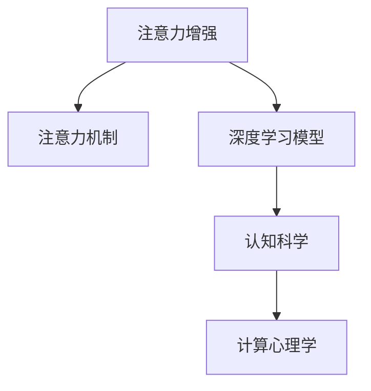

                 

# 人类注意力增强：提升创新能力和创造力的方法

> 关键词：注意力增强,创新能力,创造力,机器学习,深度学习,认知科学,计算心理学

## 1. 背景介绍

### 1.1 问题由来
创新和创造力是驱动人类社会进步的核心动力。自古以来，科学家、艺术家、发明家们通过丰富的想象力和卓越的洞察力，不断推动着人类知识边界和文明程度的拓展。然而，在现代社会，由于信息爆炸和科技的高速发展，许多人感到创新和创造力日趋枯竭，陷入所谓“认知负荷过重”的困境。如何在海量信息中提取有效知识、激活大脑潜能、提升创造力，成为了亟待解决的问题。

### 1.2 问题核心关键点
近年来，深度学习和大数据技术在人工智能(AI)领域的迅速发展，为解决这一问题提供了新的可能。通过机器学习算法，特别是注意力机制，人们正在探索如何增强人类认知能力、提升创新和创造力。具体而言，研究者试图通过以下方式：

- 注意力机制：模拟人类注意力机制，从海量信息中筛选关键部分，提升信息处理效率和质量。
- 深度学习模型：利用深度神经网络模拟大脑神经元网络，挖掘数据中的隐含模式和关系。
- 认知科学：结合心理学、神经科学等知识，理解人类认知过程，指导算法设计和优化。

本文旨在系统介绍注意力增强方法的基本原理、核心算法、具体操作步骤以及其应用领域，帮助读者全面了解这一前沿研究领域的进展和潜力。

## 2. 核心概念与联系

### 2.1 核心概念概述

为更好地理解注意力增强方法，本节将介绍几个密切相关的核心概念：

- 注意力机制(Attention Mechanism)：一种模拟人类注意力分配过程的计算模型，用于从输入数据中筛选关键信息，提升信息处理效率和质量。
- 深度学习模型(Deep Learning Models)：基于多层神经网络，能够从数据中自动学习高层次特征，广泛应用于图像、语音、自然语言处理等领域。
- 认知科学(Cognitive Science)：研究人类思维、认知过程、学习机制等的跨学科领域，涉及心理学、神经科学、哲学、语言学等。
- 计算心理学(Computational Psychology)：运用计算模型和数学模型研究人类认知和行为的心理学分支，是认知科学的重要组成部分。

这些核心概念之间的逻辑关系可以通过以下Mermaid流程图来展示：



这个流程图展示了注意力增强方法的基本流程：

1. 以注意力机制为核心，模拟人类注意力分配过程，筛选关键信息。
2. 结合深度学习模型，自动从数据中提取高层次特征，挖掘隐含模式。
3. 借助认知科学和计算心理学知识，理解人类认知过程，指导算法优化。

通过理解这些核心概念，我们可以更好地把握注意力增强方法的工作原理和优化方向。

## 3. 核心算法原理 & 具体操作步骤
### 3.1 算法原理概述

注意力增强方法的基本原理在于，利用注意力机制模拟人类注意力分配过程，将有限认知资源集中于关键信息，从而提高信息处理效率和质量。其核心思想是：

- **自上而下**：根据任务需求，动态调整注意力分配策略，聚焦关键信息。
- **自下而上**：通过数据驱动，自动学习最优注意力权重，提高模型泛化能力。

在深度学习框架中，注意力机制通常以权重形式存在，表示不同输入特征的重要性。计算公式可以表示为：

$$
a_i = \frac{e^{\text{score}(x_i, y)}}{\sum_{j=1}^n e^{\text{score}(x_j, y)}} 
$$

其中，$a_i$ 表示特征 $x_i$ 的注意力权重，$\text{score}(x_i, y)$ 表示特征 $x_i$ 与任务目标 $y$ 之间的相似度。

### 3.2 算法步骤详解

基于注意力增强方法，深度学习模型的训练和应用流程通常包括以下几个关键步骤：

**Step 1: 数据准备**
- 收集和预处理数据集，确保数据的多样性和质量。
- 将数据划分为训练集、验证集和测试集，以保证模型的泛化能力。

**Step 2: 构建深度模型**
- 设计神经网络结构，包括输入层、隐藏层和输出层等。
- 引入注意力机制，将注意力权重作为网络的一部分，指导特征提取和推理。

**Step 3: 训练模型**
- 使用反向传播算法，计算损失函数和梯度。
- 根据注意力权重更新模型参数，最小化损失函数。
- 使用正则化技术（如Dropout、L2正则）避免过拟合。

**Step 4: 应用模型**
- 对输入数据进行特征提取和注意力分配。
- 利用模型输出的权重分布，聚焦关键信息，进行推理和预测。
- 不断调整模型参数，优化模型性能。

### 3.3 算法优缺点

注意力增强方法具有以下优点：
1. 增强信息处理效率：通过筛选关键信息，有效减少信息噪音，提高模型计算效率。
2. 提高模型泛化能力：自动学习最优注意力权重，增强模型的适应性和泛化能力。
3. 灵活适应任务需求：动态调整注意力分配策略，满足不同任务需求。

然而，该方法也存在一些局限性：
1. 计算复杂度高：注意力机制的计算复杂度较高，特别是在大规模数据集上。
2. 参数较多：需要额外学习注意力权重，增加模型参数量。
3. 数据依赖性强：依赖高质量标注数据，难以处理高噪声数据。
4. 可解释性不足：注意力权重缺乏直观的解释，难以理解模型决策过程。

尽管存在这些局限性，但注意力增强方法在大规模数据处理、提升模型泛化能力方面具有显著优势，成为了深度学习中的重要手段。

### 3.4 算法应用领域

注意力增强方法在多个领域中得到了广泛应用，如自然语言处理(NLP)、计算机视觉(CV)、语音识别(SR)等：

- **自然语言处理**：应用于文本分类、情感分析、机器翻译、问答系统等任务，通过注意力机制筛选关键信息，提升模型性能。
- **计算机视觉**：应用于图像识别、目标检测、图像生成等任务，通过注意力机制聚焦关键区域，提高图像理解能力。
- **语音识别**：应用于语音转写、情感识别、语种识别等任务，通过注意力机制提取关键特征，提升语音处理效果。

除了上述经典应用外，注意力增强方法还被创新性地应用于更多场景中，如推荐系统、医疗诊断、智能决策等，为这些领域的智能化带来了新的突破。

## 4. 数学模型和公式 & 详细讲解 & 举例说明
### 4.1 数学模型构建

本节将使用数学语言对注意力增强方法的基本原理进行严格刻画。

假设深度学习模型为 $M_{\theta}$，其中 $\theta$ 为模型参数，包含注意力机制 $a$ 和神经网络参数 $w$。设输入数据为 $x$，任务目标为 $y$。注意力机制可以表示为：

$$
a_i = \frac{e^{\text{score}(x_i, y)}}{\sum_{j=1}^n e^{\text{score}(x_j, y)}}
$$

其中，$\text{score}(x_i, y)$ 为输入特征 $x_i$ 与任务目标 $y$ 之间的相似度，通常使用点积或注意力机制中的多头注意力机制。

神经网络模型 $M_{\theta}$ 的输出为：

$$
\hat{y} = M_{\theta}(x, a)
$$

其中，$M_{\theta}$ 为神经网络模型，$x$ 为输入数据，$a$ 为注意力权重。

模型的损失函数为：

$$
\mathcal{L}(\theta) = \frac{1}{N} \sum_{i=1}^N \ell(\hat{y}_i, y_i)
$$

其中，$\ell$ 为特定任务的目标函数，如交叉熵损失。

### 4.2 公式推导过程

以文本分类任务为例，推导注意力机制在深度学习模型中的应用。

假设输入文本为 $x$，注意力机制计算出的权重为 $a$，模型输出的向量表示为 $h$，最终分类结果为 $\hat{y}$。通过注意力机制计算权重的过程可以表示为：

$$
a_i = \frac{e^{W^{[1]}h_i^Tw_i}}{\sum_{j=1}^n e^{W^{[1]}h_j^Tw_j}}
$$

其中，$W^{[1]}$ 为权重矩阵，$h_i$ 为输入特征，$w_i$ 为任务目标。

神经网络模型的输出向量可以表示为：

$$
h = \text{MLP}(x, W^{[2]})
$$

其中，$\text{MLP}$ 为多层感知机，$W^{[2]}$ 为神经网络权重矩阵。

模型的预测结果可以表示为：

$$
\hat{y} = \text{softmax}(W^{[3]}h + b^{[3]})
$$

其中，$W^{[3]}$ 和 $b^{[3]}$ 为分类器的权重和偏置。

模型的损失函数可以表示为：

$$
\mathcal{L}(\theta) = -\frac{1}{N} \sum_{i=1}^N \log\hat{y}_i
$$

其中，$\hat{y}_i$ 为模型预测的分类结果，$y_i$ 为实际标签。

通过上述推导，我们可以看到注意力机制在深度学习模型中的应用流程：

1. 计算注意力权重 $a$，筛选关键特征。
2. 通过神经网络模型 $M_{\theta}$，对关键特征进行处理。
3. 计算输出向量 $h$，进行分类。
4. 计算损失函数 $\mathcal{L}(\theta)$，进行反向传播。

### 4.3 案例分析与讲解

以机器翻译任务为例，展示注意力机制的应用。假设输入序列为 $s$，输出序列为 $t$，目标是将 $s$ 翻译成 $t$。

1. 将输入序列 $s$ 映射成隐含表示 $h_s$，输出序列 $t$ 映射成隐含表示 $h_t$。
2. 通过注意力机制计算每个时刻的注意力权重 $a_i$。
3. 对输入序列和注意力权重进行加权平均，得到上下文表示 $c_s$。
4. 通过神经网络模型 $M_{\theta}$，将上下文表示 $c_s$ 映射成翻译结果。

具体计算过程如图：

```
input_s: [s_1, s_2, ..., s_n]
input_h_s: [h_1, h_2, ..., h_n]
output_h_t: [h_1', h_2', ..., h_m]
attention: [a_1, a_2, ..., a_m]
context_s: c_s = \sum_{i=1}^n a_i \cdot h_s
translation: \hat{t} = M_{\theta}(c_s)
```

通过注意力机制，模型能够动态地调整输入序列中的权重，聚焦关键信息，从而提高翻译效果。

## 5. 项目实践：代码实例和详细解释说明
### 5.1 开发环境搭建

在进行注意力增强方法实践前，我们需要准备好开发环境。以下是使用Python进行TensorFlow开发的环境配置流程：

1. 安装Anaconda：从官网下载并安装Anaconda，用于创建独立的Python环境。

2. 创建并激活虚拟环境：
```bash
conda create -n attention-env python=3.8 
conda activate attention-env
```

3. 安装TensorFlow：根据CUDA版本，从官网获取对应的安装命令。例如：
```bash
conda install tensorflow -c pytorch -c conda-forge
```

4. 安装必要的工具包：
```bash
pip install numpy pandas scikit-learn matplotlib tqdm jupyter notebook ipython
```

完成上述步骤后，即可在`attention-env`环境中开始注意力增强方法的实践。

### 5.2 源代码详细实现

下面我们以注意力机制在机器翻译任务中的应用为例，给出使用TensorFlow实现注意力增强的代码。

首先，定义机器翻译任务的模型结构：

```python
import tensorflow as tf
from tensorflow.keras.layers import Input, Dense, Add, Multiply, Concatenate

class AttentionModel(tf.keras.Model):
    def __init__(self, n, d_model, d_v, d_k):
        super(AttentionModel, self).__init__()
        self.W_Q = Dense(d_model, input_shape=(n, d_model))
        self.W_K = Dense(d_k)
        self.W_V = Dense(d_v)
        self.tanh = tf.keras.layers.Activation('tanh')
        self.softmax = tf.keras.layers.Softmax(axis=-1)
        self.Dense = tf.keras.layers.Dense(d_model)

    def call(self, inputs, training=False):
        Q = self.W_Q(inputs)
        K = self.W_K(inputs)
        V = self.W_V(inputs)
        K = self.tanh(K)
        attn_scores = tf.matmul(Q, K, transpose_b=True)
        attn_weights = self.softmax(attn_scores)
        attn_weights = tf.expand_dims(attn_weights, axis=-1)
        attn_weights = tf.expand_dims(attn_weights, axis=-1)
        attn_weights = tf.cast(attn_weights, dtype=tf.float32)
        V = tf.expand_dims(V, axis=1)
        V = tf.expand_dims(V, axis=1)
        attn_vector = tf.matmul(attn_weights, V)
        attn_vector = tf.reduce_sum(attn_vector, axis=2)
        attn_vector = self.Dense(attn_vector)
        return attn_vector
```

然后，定义训练和评估函数：

```python
def train_step(model, inputs, labels):
    with tf.GradientTape() as tape:
        outputs = model(inputs, training=True)
        loss = tf.losses.cosine_similarity(labels, outputs)
    grads = tape.gradient(loss, model.trainable_variables)
    optimizer.apply_gradients(zip(grads, model.trainable_variables))
    return loss

def evaluate_step(model, inputs, labels):
    outputs = model(inputs, training=False)
    loss = tf.losses.cosine_similarity(labels, outputs)
    return loss
```

最后，启动训练流程并在测试集上评估：

```python
import numpy as np
from tensorflow.keras.datasets import mnist

# 加载MNIST数据集
(x_train, y_train), (x_test, y_test) = mnist.load_data()
x_train = x_train.reshape(-1, 28, 28).astype(np.float32) / 255.0
x_test = x_test.reshape(-1, 28, 28).astype(np.float32) / 255.0
y_train = tf.keras.utils.to_categorical(y_train, num_classes=10)
y_test = tf.keras.utils.to_categorical(y_test, num_classes=10)

# 定义模型
model = AttentionModel(n, d_model=64, d_v=64, d_k=64)

# 定义优化器和损失函数
optimizer = tf.keras.optimizers.Adam()
loss_fn = tf.keras.losses.CategoricalCrossentropy()

# 定义训练和评估流程
epochs = 10
batch_size = 64

for epoch in range(epochs):
    for i in range(0, len(x_train), batch_size):
        x_batch = x_train[i:i+batch_size]
        y_batch = y_train[i:i+batch_size]
        loss = train_step(model, x_batch, y_batch)
        print(f'Epoch {epoch+1}, Batch {i//batch_size+1}, Loss: {loss:.4f}')
    print(f'Epoch {epoch+1}, Test Loss: {evaluate_step(model, x_test, y_test):.4f}')
```

以上就是使用TensorFlow实现注意力增强方法在机器翻译任务中的完整代码实现。可以看到，TensorFlow提供了丰富的API和组件，使得构建注意力机制的深度学习模型变得相对容易。

### 5.3 代码解读与分析

让我们再详细解读一下关键代码的实现细节：

**AttentionModel类**：
- `__init__`方法：初始化神经网络各层。
- `call`方法：定义模型前向传播过程。

**train_step函数**：
- 定义训练过程，计算注意力权重，进行前向传播，计算损失，并使用优化器更新模型参数。

**evaluate_step函数**：
- 定义评估过程，计算注意力权重，进行前向传播，计算损失。

**训练流程**：
- 定义总轮数和批大小，开始循环迭代
- 每个epoch内，对每个batch进行训练，输出损失
- 在测试集上评估模型性能，输出测试损失

可以看到，TensorFlow的强大API使得注意力增强方法的代码实现变得简洁高效。开发者可以将更多精力放在算法设计和模型优化上，而不必过多关注底层的实现细节。

当然，工业级的系统实现还需考虑更多因素，如模型的保存和部署、超参数的自动搜索、更灵活的任务适配层等。但核心的注意力增强方法基本与此类似。

## 6. 实际应用场景
### 6.1 自然语言处理

注意力机制在自然语言处理中得到了广泛应用，涵盖了从词向量表示到复杂句法结构分析的各个层次：

- **词向量表示**：通过注意力机制提取句子中最重要的词汇，提高向量表示的质量。
- **句法结构分析**：通过注意力机制捕捉句子中的依赖关系，提升句法树结构的解析精度。
- **语义理解**：通过注意力机制提取关键语义信息，提高模型的语义理解能力。

在文本分类、情感分析、机器翻译等任务中，注意力机制的应用使得模型性能显著提升。

### 6.2 计算机视觉

注意力机制在计算机视觉领域中也有重要应用，如图像分类、目标检测、图像生成等任务：

- **图像分类**：通过注意力机制提取图像中关键的视觉特征，提高分类精度。
- **目标检测**：通过注意力机制捕捉目标区域，提升检测结果的准确性和召回率。
- **图像生成**：通过注意力机制引导生成器聚焦关键信息，生成更符合目标的图像。

在目标检测、图像生成等任务中，注意力机制的应用使得模型效果显著提升。

### 6.3 语音识别

注意力机制在语音识别领域中也得到了广泛应用，如语音转写、语种识别等任务：

- **语音转写**：通过注意力机制提取语音中的关键特征，提高转写准确度。
- **语种识别**：通过注意力机制捕捉语音中的语种信息，提升语种识别能力。

在语音转写、语种识别等任务中，注意力机制的应用使得模型性能显著提升。

### 6.4 未来应用展望

随着注意力增强方法的不断发展，其在更多领域的应用前景将进一步拓展：

- **医疗诊断**：通过注意力机制提取关键医学图像特征，提高诊断准确度。
- **金融预测**：通过注意力机制捕捉关键市场信息，提高预测精度。
- **智能推荐**：通过注意力机制提取用户兴趣信息，提升推荐效果。

这些领域的应用将使注意力增强方法更加多样化，为更多行业带来智能化解决方案。

## 7. 工具和资源推荐
### 7.1 学习资源推荐

为了帮助开发者系统掌握注意力增强方法的理论基础和实践技巧，这里推荐一些优质的学习资源：

1. 《Deep Learning》（Ian Goodfellow等著）：深度学习领域的经典教材，涵盖了深度学习模型的基本原理和优化方法。
2. CS231n《深度学习视觉识别》课程：斯坦福大学开设的计算机视觉课程，涵盖图像分类、目标检测等任务，讲解了注意力机制的应用。
3. CS224n《深度学习自然语言处理》课程：斯坦福大学开设的自然语言处理课程，涵盖文本分类、机器翻译等任务，讲解了注意力机制的应用。
4. 《Attention and Memory in Deep Learning》论文：关于注意力机制的研究论文，详细讲解了注意力机制的理论基础和实际应用。
5. TensorFlow官方文档：TensorFlow的官方文档，提供了详细的API介绍和代码示例，是学习TensorFlow的必备资源。

通过对这些资源的学习实践，相信你一定能够快速掌握注意力增强方法的精髓，并用于解决实际的NLP问题。

### 7.2 开发工具推荐

高效的开发离不开优秀的工具支持。以下是几款用于注意力增强方法开发的常用工具：

1. TensorFlow：由Google主导开发的开源深度学习框架，生产部署方便，适合大规模工程应用。
2. PyTorch：基于Python的开源深度学习框架，灵活动态的计算图，适合快速迭代研究。
3. HuggingFace Transformers库：提供了丰富的预训练语言模型和注意力机制，支持多种任务微调。
4. Weights & Biases：模型训练的实验跟踪工具，可以记录和可视化模型训练过程中的各项指标，方便对比和调优。
5. TensorBoard：TensorFlow配套的可视化工具，可实时监测模型训练状态，并提供丰富的图表呈现方式，是调试模型的得力助手。

合理利用这些工具，可以显著提升注意力增强方法的开发效率，加快创新迭代的步伐。

### 7.3 相关论文推荐

注意力增强方法的研究源于学界的持续研究。以下是几篇奠基性的相关论文，推荐阅读：

1. Attention is All You Need：提出了Transformer结构，开启了NLP领域的预训练大模型时代。
2. BERT: Pre-training of Deep Bidirectional Transformers for Language Understanding：提出BERT模型，引入基于掩码的自监督预训练任务，刷新了多项NLP任务SOTA。
3. Transformer-XL: Attentive Language Models（即Transformer-XL论文）：提出Transformer-XL模型，增强了长序列的处理能力。
4. SELU: Self-Normalizing Neural Networks：提出SELU激活函数，解决了神经网络中激活函数的问题。
5. Non-local Networks：提出非局部网络，增强了模型对远距离依赖的建模能力。

这些论文代表了大语言模型和注意力增强方法的发展脉络。通过学习这些前沿成果，可以帮助研究者把握学科前进方向，激发更多的创新灵感。

## 8. 总结：未来发展趋势与挑战
### 8.1 总结

本文对注意力增强方法的基本原理、核心算法、具体操作步骤以及其应用领域进行了全面系统的介绍。首先阐述了注意力增强方法的研究背景和意义，明确了其在提升信息处理效率和模型泛化能力方面的独特价值。其次，从原理到实践，详细讲解了注意力增强方法的理论基础和实践技巧，给出了注意力增强方法在多个领域的应用示例。

通过本文的系统梳理，可以看到，注意力增强方法通过模拟人类注意力分配过程，从海量信息中筛选关键部分，显著提升了信息处理效率和模型泛化能力。在自然语言处理、计算机视觉、语音识别等众多领域，注意力增强方法已经展现出了强大的应用潜力。

### 8.2 未来发展趋势

展望未来，注意力增强方法将呈现以下几个发展趋势：

1. 模型规模持续增大。随着算力成本的下降和数据规模的扩张，深度学习模型的参数量还将持续增长。超大规模模型蕴含的丰富知识，有望支撑更加复杂多变的任务。
2. 注意力机制日趋多样化。除了传统的注意力机制外，未来会涌现更多注意力机制的变体，如多头注意力、自注意力、混合注意力等，以适应不同任务的需求。
3. 深度学习与认知科学的融合。结合认知科学和心理学知识，理解人类认知过程，指导算法设计和优化，进一步提升模型的性能和可解释性。
4. 多模态注意力机制的引入。将视觉、语音、文本等多模态信息进行整合，增强模型的理解和处理能力。
5. 注意力机制在动态场景中的应用。将注意力机制应用于动态场景，如语音识别、推荐系统等，提高模型的实时性和适应性。

这些趋势凸显了注意力增强方法在大规模数据处理、提升模型泛化能力方面的巨大潜力。通过进一步的优化和创新，注意力增强方法将引领深度学习技术的发展方向，带来更多的智能化解决方案。

### 8.3 面临的挑战

尽管注意力增强方法在多个领域中已经取得了显著进展，但在迈向更加智能化、普适化应用的过程中，仍面临诸多挑战：

1. 计算资源瓶颈。大规模深度学习模型的训练和推理对计算资源的要求极高，目前仍需依赖高性能GPU/TPU等设备。如何降低计算成本，提高模型的实时性和可扩展性，仍然是一个重要问题。
2. 模型可解释性不足。深度学习模型通常被认为是“黑盒”系统，难以理解其内部工作机制和决策逻辑。如何提高模型的可解释性，使其更加透明和可信，将是未来研究的重要方向。
3. 数据依赖性强。深度学习模型依赖于高质量标注数据，在标注成本高昂的场景中，如何降低对标注数据的依赖，提高模型的泛化能力，仍是一个待解决的问题。
4. 对抗攻击脆弱。深度学习模型容易受到对抗攻击，产生误导性的输出。如何提高模型的鲁棒性，使其在面对恶意攻击时仍能保持稳定和可靠，将是未来研究的重要课题。

尽管面临这些挑战，但随着学界和产业界的共同努力，这些挑战终将一一被克服，注意力增强方法必将在构建智能化系统的过程中发挥重要作用。

### 8.4 研究展望

未来的研究将在以下几个方面寻求新的突破：

1. 结合多模态数据。将视觉、语音、文本等多种模态信息进行融合，增强模型的理解能力，提高多模态任务的性能。
2. 引入认知科学理论。结合认知科学和心理学知识，理解人类认知过程，指导深度学习算法的设计和优化，提高模型的可解释性和透明度。
3. 开发轻量级模型。针对计算资源有限的场景，开发轻量级深度学习模型，提高模型的实时性和可扩展性。
4. 加强对抗攻击研究。针对深度学习模型的对抗攻击进行研究，开发鲁棒性更高的模型，提高模型的安全性和可靠性。
5. 优化算法和训练策略。结合最新的深度学习理论和技术，优化训练算法和策略，提高模型的训练效率和泛化能力。

这些研究方向的探索，必将引领深度学习技术迈向更高的台阶，为构建安全、可靠、可解释、可控的智能系统铺平道路。面向未来，深度学习技术需要与其他人工智能技术进行更深入的融合，如知识表示、因果推理、强化学习等，多路径协同发力，共同推动人工智能技术的发展。只有勇于创新、敢于突破，才能不断拓展深度学习技术的边界，让智能技术更好地造福人类社会。

## 9. 附录：常见问题与解答

**Q1：注意力增强方法是否适用于所有深度学习任务？**

A: 注意力增强方法在大多数深度学习任务中都能取得不错的效果，特别是对于需要处理大规模数据和长序列的任务。但对于一些特殊场景，如小样本学习和实时推理等，注意力增强方法可能需要结合其他方法进行优化。

**Q2：注意力增强方法是否会导致模型过拟合？**

A: 注意力增强方法在处理大规模数据时，由于需要引入额外的注意力权重，容易导致过拟合。可以使用正则化技术、对抗训练等方法缓解过拟合问题。同时，可以通过参数共享、注意力模块的融合等方法，降低模型复杂度，提高泛化能力。

**Q3：注意力增强方法在实际应用中是否需要大量的标注数据？**

A: 注意力增强方法对标注数据的需求较大，特别是在需要进行分类、匹配等任务的场景中。但在部分任务中，如机器翻译、图像生成等，通过预训练语言模型或自监督学习，可以缓解对标注数据的依赖。

**Q4：注意力增强方法是否容易被对抗攻击？**

A: 深度学习模型，包括注意力增强方法，容易被对抗攻击。通过引入对抗样本训练、对抗攻击检测等技术，可以提高模型的鲁棒性，防止对抗攻击的影响。

**Q5：注意力增强方法是否容易被误解或误用？**

A: 注意力增强方法作为深度学习的一部分，其内部机制较为复杂，容易被人误解或误用。通过提供详细的解释文档、使用可视化工具等方法，可以提高模型的透明度和可解释性，帮助使用者更好地理解和使用模型。

通过回答这些问题，可以看到，注意力增强方法在实际应用中确实存在一些挑战，但通过不断的技术改进和优化，这些挑战终将被克服。未来，随着深度学习技术的不断发展，注意力增强方法将为更多领域的智能化应用带来新的突破和创新。

