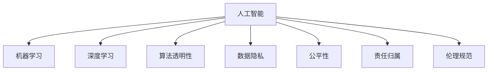

                 

# 人类的价值观：AI 时代的价值重塑

## 1. 背景介绍

### 1.1 问题由来

随着人工智能(AI)技术的迅速发展，AI 在各个领域的应用日益广泛。从自动驾驶到医疗诊断，从智能客服到工业制造，AI 正逐渐改变着人类社会的面貌。然而，AI 的发展也带来了一系列新的伦理和价值问题，这些问题的核心便是对人类价值观的重新审视和塑造。

AI 时代的到来，意味着机器不仅在计算和处理数据上超越人类，还将参与到更复杂的决策过程。这种变化要求我们对 AI 的行为和决策进行更深入的思考，以确保其符合人类的价值观念和社会伦理。

### 1.2 问题核心关键点

AI 时代对人类价值观的重塑主要体现在以下几个方面：

1. **算法透明性**：AI 决策的透明度和可解释性对人类价值观至关重要。如何确保 AI 的决策过程符合人类的道德标准和伦理要求，成为关键问题。

2. **数据隐私**：数据是 AI 的核心资源，如何在保护用户隐私的前提下，充分利用数据进行训练和推理，成为亟待解决的技术和伦理问题。

3. **公平性**：AI 模型在训练和应用过程中，往往受到数据偏见的影响，导致某些群体被边缘化。如何确保 AI 系统的公平性和无歧视性，是实现普惠社会的重要目标。

4. **责任归属**：当 AI 系统出现错误或意外伤害时，责任应由谁承担？如何界定 AI 系统的责任边界，是确保社会稳定和安全的重要保障。

5. **伦理规范**：AI 技术的发展需要遵循哪些伦理规范，如何在技术创新和伦理约束之间取得平衡，是 AI 应用中的核心议题。

这些问题不仅涉及技术细节，更触及人类社会的核心价值观和伦理规范。如何在 AI 时代，重新审视和塑造人类的价值观，是本文探讨的核心。

## 2. 核心概念与联系

### 2.1 核心概念概述

为了更好地理解 AI 时代对人类价值观的重塑，我们需要先明确几个核心概念：

- **人工智能**：利用计算机技术和算法，模拟和扩展人类智能的技术体系。AI 的核心在于机器学习、深度学习等技术，能够在特定任务上表现出色。

- **机器学习**：一种通过数据训练模型，使机器具备学习能力的算法。机器学习可以分为监督学习、无监督学习和强化学习等多种形式。

- **深度学习**：一种基于神经网络，通过多层非线性变换，实现复杂数据表示和模式识别的方法。深度学习在图像、语音、自然语言处理等领域取得了显著成果。

- **算法透明性**：指 AI 模型的决策过程可被解释和理解的程度。透明性有助于提升公众对 AI 系统的信任和接受度。

- **数据隐私**：指个人信息和数据在收集、存储和处理过程中的安全性和保护程度。数据隐私是实现 AI 伦理和法律合规的前提。

- **公平性**：指 AI 模型在不同群体间的表现一致性，避免因数据偏见导致的不公平。公平性是实现社会公正的重要保障。

- **责任归属**：指 AI 系统在执行任务时可能带来的责任问题，如决策错误、安全事故等。责任归属是确保 AI 应用安全的核心问题。

- **伦理规范**：指在 AI 技术应用中，需要遵循的一系列道德和法律规范，确保 AI 系统的使用符合人类社会的价值观和利益。

这些核心概念之间的关系可以通过以下 Mermaid 流程图来展示：



这个流程图展示了 AI 与各个核心概念的逻辑联系：

1. AI 技术的发展依赖于机器学习和深度学习，这些技术是实现 AI 的基础。
2. 算法透明性、数据隐私、公平性、责任归属和伦理规范等概念，是评估和指导 AI 应用的重要准则。

### 2.2 核心概念原理和架构

#### 2.2.1 算法透明性

算法透明性指的是 AI 模型的工作原理和决策过程可以被人类理解和解释的程度。算法透明性的重要性在于，只有当 AI 的决策过程可以被理解和解释时，人们才能对其结果进行监督和质疑，确保其符合人类的价值观和伦理要求。

算法透明性的实现可以通过以下方式：

- **可解释性模型**：使用可解释性强的模型架构，如决策树、线性回归等，使得模型的决策过程更容易理解。
- **可视化工具**：通过可视化工具，如heatmap、feature importance等，展示模型在不同特征上的关注度。
- **可解释性接口**：设计可解释性接口，提供模型输入、输出和中间过程的详细解释，帮助用户理解模型行为。

#### 2.2.2 数据隐私

数据隐私是指在数据收集、存储和处理过程中，对用户个人信息的保护程度。数据隐私的保障是实现 AI 伦理和法律合规的基础。

数据隐私的保障可以通过以下方式：

- **数据匿名化**：对用户数据进行去标识化处理，使其无法直接关联到个人身份。
- **访问控制**：对数据访问进行严格的权限控制，确保只有授权人员可以访问敏感数据。
- **加密技术**：对数据进行加密存储和传输，防止数据泄露和篡改。
- **隐私保护算法**：使用差分隐私等隐私保护算法，对模型训练过程进行保护。

#### 2.2.3 公平性

公平性指 AI 模型在不同群体间的表现一致性，避免因数据偏见导致的不公平。公平性是实现社会公正的重要保障。

公平性的实现可以通过以下方式：

- **数据平衡**：在训练数据中确保不同群体的样本数量平衡，防止数据偏见。
- **偏见检测**：对模型进行偏见检测，识别和消除模型中的偏见因素。
- **多模型集成**：训练多个模型，通过集成学习的方式，减少单一模型的不公平性。

#### 2.2.4 责任归属

责任归属指 AI 系统在执行任务时可能带来的责任问题，如决策错误、安全事故等。责任归属是确保 AI 应用安全的核心问题。

责任归属的实现可以通过以下方式：

- **责任追溯**：建立责任追溯机制，确保在出现问题时，能够快速定位和纠正责任人。
- **责任保险**：通过责任保险等方式，对 AI 系统的错误和事故进行补偿和赔偿。
- **伦理准则**：制定和遵守 AI 系统的伦理准则，确保其在应用过程中符合人类价值观和法律规定。

#### 2.2.5 伦理规范

伦理规范指在 AI 技术应用中，需要遵循的一系列道德和法律规范，确保 AI 系统的使用符合人类社会的价值观和利益。

伦理规范的制定和遵守可以通过以下方式：

- **伦理委员会**：建立专门的伦理委员会，对 AI 系统的开发和应用进行监督和审查。
- **伦理准则**：制定和遵守 AI 系统的伦理准则，如《人工智能伦理指南》等。
- **公众参与**：鼓励公众参与 AI 系统的设计和应用过程，确保其符合公众利益。

## 3. 核心算法原理 & 具体操作步骤

### 3.1 算法原理概述

AI 时代对人类价值观的重塑，主要通过以下核心算法原理实现：

1. **监督学习**：通过标注数据训练 AI 模型，使其具备特定任务的处理能力。监督学习需要大量高质量的标注数据，确保模型的泛化性能和公平性。

2. **无监督学习**：利用未标注数据，通过自学习的方式，发现数据中的隐含结构和规律。无监督学习有助于发现数据中的潜在模式，提升模型的鲁棒性和泛化能力。

3. **强化学习**：通过与环境的互动，优化 AI 系统的行为和策略。强化学习常用于游戏、机器人等领域，提升 AI 系统的智能和自主性。

4. **迁移学习**：利用已有的知识，在新任务上进行迁移学习，提升模型的适应能力和泛化性能。迁移学习有助于在数据匮乏的情况下，快速提升 AI 系统的性能。

5. **生成对抗网络(GAN)**：通过生成器和判别器的对抗训练，生成逼真的合成数据，提升模型的数据生成能力和鲁棒性。

### 3.2 算法步骤详解

#### 3.2.1 数据准备

数据准备是 AI 算法应用的基础。以下是数据准备的关键步骤：

1. **数据收集**：根据具体任务，收集和整理相关的数据。确保数据质量，避免噪声和错误。

2. **数据清洗**：对数据进行去重、补全、清洗等操作，确保数据的一致性和完整性。

3. **数据划分**：将数据划分为训练集、验证集和测试集，确保模型在未见数据上的泛化能力。

4. **数据增强**：通过数据增强技术，扩充训练集数据的多样性，提升模型的鲁棒性和泛化能力。

#### 3.2.2 模型训练

模型训练是实现 AI 算法的重要步骤。以下是模型训练的关键步骤：

1. **模型选择**：根据具体任务，选择合适的 AI 模型架构。如卷积神经网络(CNN)、循环神经网络(RNN)、Transformer 等。

2. **参数初始化**：对模型参数进行初始化，通常使用随机初始化。

3. **模型训练**：通过反向传播算法，更新模型参数，最小化损失函数。训练过程中需要监控模型的性能和资源消耗。

4. **模型评估**：在验证集上评估模型的性能，调整超参数和优化算法，确保模型在未见数据上的泛化能力。

#### 3.2.3 模型部署

模型部署是将训练好的 AI 模型应用于实际任务的过程。以下是模型部署的关键步骤：

1. **模型压缩**：对模型进行压缩和优化，提升模型的推理速度和资源效率。

2. **模型存储**：将模型存储到高效的存储介质上，确保模型的快速访问和部署。

3. **模型接口设计**：设计符合业务需求的模型接口，确保模型的易用性和可维护性。

4. **模型监控**：对模型进行实时监控和性能评估，确保其在实际应用中的稳定性和可靠性。

### 3.3 算法优缺点

AI 算法在实现人类价值观重塑的过程中，既有其优点，也存在一些缺点。

#### 3.3.1 优点

1. **高效性**：AI 算法可以在短时间内处理大量数据，提升数据处理和决策的效率。

2. **鲁棒性**：AI 算法通过大量数据的训练，具有较强的鲁棒性和泛化能力，可以在不同场景下保持稳定性能。

3. **可扩展性**：AI 算法可以根据需求，进行灵活扩展和优化，适应不同的业务场景。

#### 3.3.2 缺点

1. **数据依赖**：AI 算法依赖高质量的标注数据，缺乏数据时，性能可能受到限制。

2. **算法透明性**：某些 AI 算法（如深度学习）的黑箱特性，使得其决策过程难以理解和解释。

3. **公平性问题**：AI 算法可能受到数据偏见的影响，导致某些群体被边缘化。

4. **责任归属模糊**：AI 算法的自动化决策可能带来责任归属问题，难以界定责任边界。

### 3.4 算法应用领域

AI 算法在实现人类价值观重塑的过程中，广泛应用于以下领域：

1. **医疗领域**：AI 算法在医疗诊断、药物研发、疾病预测等方面，实现了许多创新应用，提升了医疗服务的智能化水平。

2. **金融领域**：AI 算法在风险评估、欺诈检测、个性化推荐等方面，提升了金融服务的精准度和效率。

3. **教育领域**：AI 算法在智能辅导、学习分析、教育管理等方面，提升了教育的个性化和智能化水平。

4. **公共安全领域**：AI 算法在视频监控、异常检测、预警分析等方面，提升了公共安全管理的智能化和效率。

5. **环境保护领域**：AI 算法在环境监测、污染预测、资源管理等方面，提升了环境保护的智能化和精准度。

6. **交通领域**：AI 算法在自动驾驶、交通监控、路线规划等方面，提升了交通管理的智能化和效率。

## 4. 数学模型和公式 & 详细讲解 & 举例说明

### 4.1 数学模型构建

在 AI 算法中，数学模型是实现算法的基础。以下是常用的数学模型：

1. **线性回归模型**：
   $$
   y = \theta_0 + \sum_{i=1}^n \theta_i x_i
   $$
   其中 $y$ 为预测值，$x_i$ 为输入特征，$\theta_i$ 为模型参数。

2. **支持向量机(SVM)**：
   $$
   \min_{w, \alpha} \frac{1}{2}w^Tw + C\sum_{i=1}^n \alpha_i \quad s.t. y_i(w^Tx_i + b) \geq 1 - \alpha_i, \quad \alpha_i \geq 0
   $$
   其中 $w$ 为模型参数，$\alpha$ 为拉格朗日乘子，$C$ 为正则化系数。

3. **卷积神经网络(CNN)**：
   $$
   y = W_{conv} * x + b_{conv} + W_{pool} * x_{pool} + b_{pool}
   $$
   其中 $W_{conv}$ 和 $b_{conv}$ 为卷积层参数，$x_{pool}$ 和 $b_{pool}$ 为池化层参数。

### 4.2 公式推导过程

#### 4.2.1 线性回归模型的推导

线性回归模型的推导过程如下：

1. 假设 $y$ 为预测值，$x_i$ 为输入特征，$\theta_i$ 为模型参数。

2. 根据最小二乘法，求解模型参数 $\theta_i$，使得模型输出 $y$ 与实际值 $y_{true}$ 的误差最小。

3. 推导结果为：
   $$
   \theta_i = \frac{\sum_{j=1}^n (x_{ij}y_{truej} - \sum_{j=1}^n x_{ij}y_{truej}) / (\sum_{j=1}^n x_{ij}^2 - \sum_{j=1}^n x_{ij}^2) \quad i=1,2,\cdots,n
   $$

#### 4.2.2 支持向量机的推导

支持向量机模型的推导过程如下：

1. 假设 $y$ 为预测值，$x_i$ 为输入特征，$w$ 为模型参数，$\alpha$ 为拉格朗日乘子，$C$ 为正则化系数。

2. 根据 L1 正则化，求解模型参数 $w$ 和 $\alpha$，使得模型输出 $y$ 与实际值 $y_{true}$ 的误差最小。

3. 推导结果为：
   $$
   w = \sum_{i=1}^n \alpha_i y_i x_i
   $$

### 4.3 案例分析与讲解

#### 4.3.1 线性回归模型

假设我们有一个房价预测问题，已知输入特征 $x=[房屋面积, 房屋位置, 房屋类型]$，输出目标 $y=$ 房价。

1. 收集数据集，进行数据清洗和划分。

2. 使用线性回归模型进行训练，得到模型参数 $\theta_i$。

3. 在测试集上评估模型性能，计算均方误差。

#### 4.3.2 支持向量机模型

假设我们有一个二分类问题，已知输入特征 $x=[特征向量, 标签]$，输出目标 $y=1$ 或 $0$。

1. 收集数据集，进行数据清洗和划分。

2. 使用支持向量机模型进行训练，得到模型参数 $w$ 和 $\alpha$。

3. 在测试集上评估模型性能，计算准确率和召回率。

## 5. 项目实践：代码实例和详细解释说明

### 5.1 开发环境搭建

在进行 AI 算法实践前，我们需要准备好开发环境。以下是使用 Python 进行 TensorFlow 开发的环境配置流程：

1. 安装 Anaconda：从官网下载并安装 Anaconda，用于创建独立的 Python 环境。

2. 创建并激活虚拟环境：
```bash
conda create -n tf-env python=3.8
conda activate tf-env
```

3. 安装 TensorFlow：根据 GPU 版本，从官网获取对应的安装命令。例如：
```bash
conda install tensorflow-gpu=2.8 -c tf -c conda-forge
```

4. 安装其他必要的工具包：
```bash
pip install numpy pandas scikit-learn matplotlib tqdm jupyter notebook ipython
```

完成上述步骤后，即可在 `tf-env` 环境中开始 AI 算法实践。

### 5.2 源代码详细实现

以下是使用 TensorFlow 实现线性回归模型的代码实现：

```python
import tensorflow as tf
import numpy as np
from sklearn.datasets import load_boston
from sklearn.model_selection import train_test_split
from sklearn.metrics import mean_squared_error

# 加载波士顿房价数据集
boston = load_boston()
X = boston.data
y = boston.target

# 将数据集划分为训练集和测试集
X_train, X_test, y_train, y_test = train_test_split(X, y, test_size=0.2, random_state=42)

# 定义模型参数
theta = tf.Variable(tf.zeros([X.shape[1], 1]))

# 定义损失函数和优化器
def linear_regression(x):
    return tf.matmul(x, theta)

def loss_function(y_true, y_pred):
    return tf.reduce_mean(tf.square(y_true - y_pred))

def optimizer():
    return tf.optimizers.Adam(learning_rate=0.01)

# 训练模型
with tf.GradientTape() as tape:
    y_pred = linear_regression(X_train)
    loss = loss_function(y_train, y_pred)

gradients = tape.gradient(loss, theta)
optimizer.apply_gradients(zip(gradients, [theta]))

# 在测试集上评估模型性能
y_pred_test = linear_regression(X_test)
mse = mean_squared_error(y_test, y_pred_test)

print(f"测试集上的均方误差：{mse:.2f}")
```

### 5.3 代码解读与分析

以下是关键代码的解读与分析：

1. 数据准备：
```python
# 加载波士顿房价数据集
boston = load_boston()
X = boston.data
y = boston.target

# 将数据集划分为训练集和测试集
X_train, X_test, y_train, y_test = train_test_split(X, y, test_size=0.2, random_state=42)
```
加载波士顿房价数据集，进行数据清洗和划分，确保数据集具有代表性。

2. 模型定义：
```python
# 定义模型参数
theta = tf.Variable(tf.zeros([X.shape[1], 1]))

# 定义损失函数和优化器
def linear_regression(x):
    return tf.matmul(x, theta)

def loss_function(y_true, y_pred):
    return tf.reduce_mean(tf.square(y_true - y_pred))

def optimizer():
    return tf.optimizers.Adam(learning_rate=0.01)
```
定义线性回归模型，损失函数和优化器。使用 TensorFlow 定义变量和函数，以便进行梯度下降优化。

3. 模型训练：
```python
# 训练模型
with tf.GradientTape() as tape:
    y_pred = linear_regression(X_train)
    loss = loss_function(y_train, y_pred)

gradients = tape.gradient(loss, theta)
optimizer.apply_gradients(zip(gradients, [theta]))
```
使用梯度下降算法对模型参数进行优化，最小化损失函数。在每个训练迭代中，使用梯度计算和优化器更新参数。

4. 模型评估：
```python
# 在测试集上评估模型性能
y_pred_test = linear_regression(X_test)
mse = mean_squared_error(y_test, y_pred_test)

print(f"测试集上的均方误差：{mse:.2f}")
```
在测试集上评估模型性能，计算均方误差，评估模型的泛化能力。

## 6. 实际应用场景

### 6.1 医疗诊断

AI 在医疗领域的应用，不仅提升了医疗服务的智能化水平，还帮助医生进行更精准的诊断。例如，基于深度学习的图像识别技术，可以对 X 光片、CT 图像等进行自动分析，识别出病变区域，提供初步诊断意见。

### 6.2 金融风控

AI 在金融领域的应用，可以实时监测市场变化，预测股票价格波动，识别潜在的风险。例如，基于深度学习的情感分析技术，可以对金融新闻、评论等文本数据进行情感分析，判断市场情绪，辅助决策。

### 6.3 智能客服

AI 在智能客服领域的应用，可以实现自动回答客户问题，提高服务效率。例如，基于深度学习的对话生成技术，可以自动回答客户的常见问题，提供个性化的咨询服务。

### 6.4 教育推荐

AI 在教育领域的应用，可以提供个性化的学习推荐，提升教育效果。例如，基于深度学习的推荐系统，可以根据学生的学习行为和偏好，推荐合适的学习资源，提升学习效果。

## 7. 工具和资源推荐

### 7.1 学习资源推荐

为了帮助开发者系统掌握 AI 技术的理论基础和实践技巧，这里推荐一些优质的学习资源：

1. 《深度学习》（Ian Goodfellow 著）：详细介绍了深度学习的原理和算法，是学习 AI 技术的经典教材。

2. 《TensorFlow 官方文档》：TensorFlow 的官方文档，提供了丰富的 API 和示例代码，适合初学者学习。

3. 《PyTorch 官方文档》：PyTorch 的官方文档，提供了详细的 API 和示例代码，适合深度学习初学者。

4. 《机器学习实战》（Peter Harrington 著）：通过实例演示了机器学习算法的实现，适合动手实践。

5. 《机器学习》（周志华 著）：介绍了机器学习的基本概念和算法，适合学习机器学习理论。

### 7.2 开发工具推荐

高效的开发离不开优秀的工具支持。以下是几款用于 AI 算法开发的常用工具：

1. TensorFlow：由 Google 主导开发的开源深度学习框架，生产部署方便，适合大规模工程应用。

2. PyTorch：由 Facebook 主导开发的开源深度学习框架，灵活动态的计算图，适合快速迭代研究。

3. Jupyter Notebook：基于 Web 的交互式笔记本，支持多种编程语言和库，适合数据科学和机器学习开发。

4. Visual Studio Code：轻量级的 IDE，支持 Python、TensorFlow 等 AI 开发环境，适合跨平台开发。

5. Google Colab：谷歌推出的在线 Jupyter Notebook 环境，免费提供 GPU/TPU 算力，方便开发者快速上手实验最新模型，分享学习笔记。

### 7.3 相关论文推荐

AI 技术的发展源于学界的持续研究。以下是几篇奠基性的相关论文，推荐阅读：

1. 《深度学习》（Ian Goodfellow 著）：介绍了深度学习的原理和算法，是学习 AI 技术的经典教材。

2. 《ImageNet 大规模视觉识别挑战》（Krizhevsky 等著）：提出 ImageNet 大规模视觉识别挑战，推动了深度学习在计算机视觉领域的发展。

3. 《AlphaGo》（DeepMind 团队著）：介绍 AlphaGo 在围棋中的应用，展示了深度学习和强化学习的强大能力。

4. 《分布式深度学习》（Duchi 等著）：介绍了分布式深度学习的原理和算法，推动了深度学习在大规模数据上的应用。

5. 《深度强化学习》（Bengio 等著）：介绍了深度强化学习的原理和算法，推动了深度学习在复杂决策场景中的应用。

这些论文代表了大数据技术的发展脉络。通过学习这些前沿成果，可以帮助研究者把握学科前进方向，激发更多的创新灵感。

## 8. 总结：未来发展趋势与挑战

### 8.1 总结

本文对 AI 时代对人类价值观的重塑进行了全面系统的介绍。首先阐述了 AI 技术在医疗、金融、教育等领域的应用，明确了 AI 技术在实现人类价值观重塑中的重要作用。其次，从算法透明性、数据隐私、公平性、责任归属和伦理规范等核心概念出发，探讨了 AI 技术在实现人类价值观重塑中的具体应用。最后，总结了 AI 技术在实现人类价值观重塑中面临的挑战，并提出了未来发展的方向和展望。

通过本文的系统梳理，可以看到，AI 技术正在改变人类社会的各个方面，成为推动社会进步的重要力量。AI 技术的持续发展，将进一步提升人类社会的智能化水平，带来更多的社会价值和效益。

### 8.2 未来发展趋势

展望未来，AI 技术的发展将呈现以下几个趋势：

1. **自动化和智能化水平提升**：AI 技术将进一步提升自动化和智能化水平，实现更高效的决策和执行。

2. **跨领域融合应用深化**：AI 技术将在更多领域实现跨领域的融合应用，提升各领域的智能化水平。

3. **数据和算法模型的协同优化**：数据和算法模型的协同优化将成为未来 AI 技术发展的重要方向，提升模型的泛化能力和鲁棒性。

4. **伦理和社会责任重视**：AI 技术的应用将更加重视伦理和社会责任，确保其应用符合人类的价值观和利益。

5. **人机协同增强**：人机协同将成为未来 AI 技术发展的重要方向，提升人机交互的自然性和智能化水平。

6. **多模态信息融合**：AI 技术将更多地融合多模态信息，提升系统的感知和理解能力。

### 8.3 面临的挑战

尽管 AI 技术取得了显著进展，但在迈向更加智能化、普适化应用的过程中，仍面临诸多挑战：

1. **数据获取和质量问题**：高质量的数据是 AI 技术的基础，但获取高质量数据往往需要大量人力和资源，且数据质量难以保证。

2. **算法透明性和可解释性**：AI 算法的黑箱特性使得其决策过程难以理解和解释，增加了使用风险。

3. **公平性和偏见问题**：AI 算法可能受到数据偏见的影响，导致某些群体被边缘化。

4. **责任归属问题**：AI 算法的自动化决策可能带来责任归属问题，难以界定责任边界。

5. **伦理和安全问题**：AI 技术的应用需要遵循伦理和法律规范，确保其安全性。

6. **跨学科融合困难**：AI 技术涉及多个学科领域，跨学科融合难度较大，需要多领域协同合作。

### 8.4 研究展望

面对 AI 技术面临的诸多挑战，未来的研究需要在以下几个方面寻求新的突破：

1. **数据获取和质量提升**：研究高效的数据获取和质量提升技术，降低对数据成本和质量的依赖。

2. **算法透明性和可解释性**：研究算法透明性和可解释性技术，提升模型的解释能力和用户信任度。

3. **公平性和偏见消除**：研究公平性和偏见消除技术，提升模型的公平性和鲁棒性。

4. **责任归属机制设计**：研究责任归属机制设计，确保 AI 系统的责任明确，使用安全。

5. **伦理规范制定**：制定和遵守 AI 技术的伦理规范，确保其应用符合人类价值观和利益。

6. **跨学科协同研究**：加强跨学科协同研究，推动 AI 技术在更多领域的融合应用。

这些研究方向的探索，将进一步推动 AI 技术的发展，为构建更加智能化、普适化、安全的社会提供技术保障。

## 9. 附录：常见问题与解答

**Q1：什么是 AI 技术？**

A: AI 技术是指利用计算机技术和算法，模拟和扩展人类智能的技术体系。AI 的核心在于机器学习、深度学习等技术，能够在特定任务上表现出色。

**Q2：AI 技术的应用领域有哪些？**

A: AI 技术在医疗、金融、教育、公共安全、环境保护、交通等领域都有广泛应用。例如，AI 技术在医疗诊断、金融风控、智能客服、教育推荐等方面，提升了服务的智能化水平。

**Q3：AI 技术在实现人类价值观重塑中面临哪些挑战？**

A: AI 技术在实现人类价值观重塑中面临诸多挑战，包括数据获取和质量问题、算法透明性和可解释性、公平性和偏见问题、责任归属问题、伦理和安全问题、跨学科融合困难等。

**Q4：如何应对 AI 技术面临的挑战？**

A: 应对 AI 技术面临的挑战，需要从数据获取和质量提升、算法透明性和可解释性、公平性和偏见消除、责任归属机制设计、伦理规范制定、跨学科协同研究等方面寻求新的突破。

**Q5：未来 AI 技术的发展方向是什么？**

A: 未来 AI 技术的发展方向包括自动化和智能化水平提升、跨领域融合应用深化、数据和算法模型的协同优化、伦理和社会责任重视、人机协同增强、多模态信息融合等。

通过本文的系统梳理，可以看到，AI 技术正在深刻改变人类社会的各个方面，成为推动社会进步的重要力量。AI 技术的持续发展，将进一步提升人类社会的智能化水平，带来更多的社会价值和效益。未来，伴随着 AI 技术的不断进步，人类社会将迎来更加智能化、普适化的未来。

