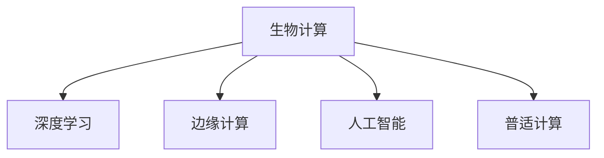

                 

# 人类计算：AI 时代的新希望

> 关键词：人类计算, AI时代, 新希望, 计算范式, 人工智能, 机器学习, 神经网络, 计算力, 边缘计算

## 1. 背景介绍

### 1.1 问题由来

在AI时代的浪潮中，人们逐渐意识到，传统计算机的计算范式正面临巨大挑战。基于逻辑电路、二进制编码的通用计算机在处理复杂的非结构化数据时显得力不从心。与之相对的，基于生物计算和神经网络的机器学习和人工智能技术则显示出巨大的潜力。这种转变，不仅仅在技术层面，更在社会、经济、文化等各个方面带来了深远的影响。

### 1.2 问题核心关键点

在这个背景下，我们提出"人类计算"的概念。人类计算不仅仅是指通过生物计算实现更高的计算能力，更是一种全新的计算范式，强调计算与人类感知、认知、情感等特性的结合。这种新的计算范式，有望解决传统计算机计算能力有限的问题，拓展计算的应用边界。

人类计算的核心关键点包括：

1. **生物计算的潜力**：人类大脑的神经元网络具有极高的并行计算能力，通过模仿大脑的计算方式，可以实现更高的处理效率。
2. **深度学习的优势**：深度学习算法通过多层次的非线性映射，能够从数据中提取出更高层次的特征，适用于复杂非结构化数据的处理。
3. **边缘计算的应用**：通过将计算任务分散到分布式网络中的边缘节点，实现高效、低延迟的数据处理。
4. **AI的普适性**：AI技术能够处理多种复杂场景，从图像识别、语音识别到自然语言处理，展现了巨大的应用潜力。

### 1.3 问题研究意义

研究人类计算技术，对于探索新型的计算范式，拓展AI技术的应用场景，具有重要的意义：

1. **提高计算效率**：通过生物计算和深度学习，能够显著提高计算效率，解决传统计算机难以处理的大规模、高复杂度问题。
2. **降低计算成本**：边缘计算的分布式特性，减少了对中央服务器的依赖，降低了计算资源的投入。
3. **增强普适性**：AI技术的普适性使其能够适用于多种应用场景，从医疗、教育到金融、制造业等，为各行各业带来变革。
4. **促进创新**：人类计算技术的开发和应用，推动了新的计算模型的研究和创新，为人类探索未知领域提供了新的工具。

## 2. 核心概念与联系

### 2.1 核心概念概述

为更好地理解人类计算，本节将介绍几个密切相关的核心概念：

- **生物计算(Bio-Computing)**：通过生物组织，如神经元、细胞等，实现信息处理和计算的生物技术。
- **深度学习(Deep Learning)**：基于人工神经网络的机器学习算法，通过多层次的非线性映射，从数据中提取高级特征。
- **边缘计算(Edge Computing)**：将计算任务分散到网络边缘节点上进行，以降低延迟、提高效率。
- **人工智能(Artificial Intelligence)**：通过模拟人类智能，实现复杂的感知、推理、决策等功能。
- **普适计算(Ubiquitous Computing)**：指通过各种设备和网络，实现普适、无缝、无处不在的计算环境。

这些概念之间的逻辑关系可以通过以下Mermaid流程图来展示：



这个流程图展示了几大核心概念之间的相互关系：

1. 生物计算提供了一种新型的计算方式，基于生物组织的计算。
2. 深度学习在此基础上，通过模仿神经网络的计算方式，实现了更高层次的特征提取。
3. 边缘计算将计算任务分散到网络边缘，提高了处理效率。
4. 人工智能通过模拟人类的智能，实现复杂的多任务处理。
5. 普适计算将计算能力普及到各种设备和网络中，构建无处不在的计算环境。

## 3. 核心算法原理 & 具体操作步骤

### 3.1 算法原理概述

人类计算的核心算法原理，可以通过以下几个步骤来理解：

1. **数据采集与预处理**：通过传感器等设备，采集生物信号、环境数据等，并进行预处理和清洗，得到可用于计算的数据。
2. **生物信号转换**：将生物信号转换为数字信号，利用深度学习算法，提取高层次特征。
3. **分布式计算**：将计算任务分散到网络边缘节点，通过边缘计算技术，实现高效、低延迟的数据处理。
4. **AI模型训练**：利用采集和处理后的数据，训练深度学习模型，实现复杂的智能处理。
5. **普适计算整合**：将AI模型与各种设备和网络整合，构建普适、无缝的计算环境，实现无处不在的智能服务。

### 3.2 算法步骤详解

以下是人类计算的具体操作步骤：

**Step 1: 数据采集与预处理**

- 选择合适的传感器设备，如脑电波传感器、环境传感器等，采集生物信号和环境数据。
- 对采集的数据进行预处理，如滤波、去噪、归一化等，去除无用信息，保证数据质量。

**Step 2: 生物信号转换**

- 将采集到的生物信号转换为数字信号，通过深度学习算法，如卷积神经网络(CNN)、循环神经网络(RNN)等，提取高层次特征。
- 使用迁移学习技术，将预训练模型应用到特定任务上，提高特征提取的效率和准确性。

**Step 3: 分布式计算**

- 将计算任务分解为多个子任务，分配到不同的边缘计算节点上进行处理。
- 通过边缘计算框架，如TensorFlow Lite、Kubeflow等，实现高效的数据处理和模型推理。
- 在边缘节点上设置缓存、存储等功能，提高数据访问速度，降低延迟。

**Step 4: AI模型训练**

- 利用处理后的数据，训练深度学习模型，如卷积神经网络(CNN)、长短期记忆网络(LSTM)等。
- 在模型训练过程中，应用正则化技术，如L2正则、Dropout等，避免过拟合。
- 利用对抗训练技术，加入对抗样本，提高模型的鲁棒性和泛化能力。

**Step 5: 普适计算整合**

- 将训练好的AI模型与各种设备和网络整合，构建普适计算环境。
- 使用API接口，将AI模型封装为标准化的服务，方便集成和调用。
- 设置监控系统，实时监测模型性能和计算资源，确保系统的稳定性和可靠性。

### 3.3 算法优缺点

人类计算具有以下优点：

1. **高效性**：通过分布式计算和深度学习，实现了高效、高并行性的计算能力。
2. **低延迟**：边缘计算的特性，降低了计算延迟，提高了实时处理能力。
3. **普适性**：普适计算的整合，使得AI模型能够灵活应用到各种设备和网络中。

同时，人类计算也存在以下缺点：

1. **设备成本高**：高质量的传感器和边缘计算设备成本较高，限制了其大规模应用。
2. **数据隐私问题**：生物信号和环境数据的采集和使用，涉及隐私和安全问题，需要严格控制和保护。
3. **计算模型复杂**：深度学习模型的复杂性较高，训练和推理需要大量的计算资源。
4. **数据质量要求高**：生物信号和环境数据的采集和预处理，需要高质量的数据源和预处理技术。

### 3.4 算法应用领域

人类计算技术已经在多个领域得到了应用，展示了其广阔的应用前景：

- **医疗健康**：通过生物信号采集和处理，实现远程健康监测、智能诊断等。
- **智能交通**：利用环境传感器和边缘计算，实现智能交通管理、自动驾驶等。
- **智能家居**：整合普适计算和智能设备，实现智能家居控制、环境监测等。
- **工业制造**：通过生物计算和边缘计算，实现生产线的智能监控、质量检测等。
- **城市管理**：利用环境数据和AI模型，实现智慧城市管理、应急响应等。

## 4. 数学模型和公式 & 详细讲解  
### 4.1 数学模型构建

本节将使用数学语言对人类计算的具体实现进行更加严格的刻画。

假设生物信号为 $x$，通过生物计算和深度学习算法，得到高层次特征 $y$，计算任务为 $z$。则人类计算的过程可以表示为：

$$
z = f(y) = g(x)
$$

其中 $f$ 为深度学习模型的映射关系，$g$ 为生物计算的映射关系。

### 4.2 公式推导过程

以下是深度学习模型和生物计算的具体推导过程：

**深度学习模型**

假设生物信号 $x$ 的特征向量为 $\mathbf{x} \in \mathbb{R}^n$，通过深度学习模型 $f$，得到高层次特征 $y$ 的向量 $\mathbf{y} \in \mathbb{R}^m$。

- 输入层：将生物信号 $x$ 转换为数字信号，得到输入向量 $\mathbf{x}$。
- 隐藏层：通过多层神经网络，提取高层次特征，得到输出向量 $\mathbf{y}$。

设神经网络的层数为 $L$，每层神经元的数量为 $n_i$，激活函数为 $\phi(\cdot)$，则深度学习模型的映射关系为：

$$
\mathbf{y} = f(\mathbf{x}) = \phi(\mathbf{W}_L\phi(\mathbf{W}_{L-1}\cdots \phi(\mathbf{W}_1\mathbf{x} + \mathbf{b}_1) + \mathbf{b}_2) + \cdots + \mathbf{b}_L)
$$

其中 $\mathbf{W}_i$ 为第 $i$ 层的权重矩阵，$\mathbf{b}_i$ 为第 $i$ 层的偏置向量。

**生物计算模型**

生物信号 $x$ 通过生物计算模型 $g$，得到高层次特征 $y$ 的向量 $\mathbf{y}$。

- 输入层：将生物信号 $x$ 转换为数字信号，得到输入向量 $\mathbf{x}$。
- 神经元层：通过神经元网络，提取高层次特征，得到输出向量 $\mathbf{y}$。

设神经元网络的层数为 $L$，每层神经元的数量为 $n_i$，激活函数为 $\phi(\cdot)$，则生物计算模型的映射关系为：

$$
\mathbf{y} = g(\mathbf{x}) = \phi(\mathbf{W}_L\phi(\mathbf{W}_{L-1}\cdots \phi(\mathbf{W}_1\mathbf{x} + \mathbf{b}_1) + \mathbf{b}_2) + \cdots + \mathbf{b}_L)
$$

其中 $\mathbf{W}_i$ 为第 $i$ 层的权重矩阵，$\mathbf{b}_i$ 为第 $i$ 层的偏置向量。

### 4.3 案例分析与讲解

以智能交通管理为例，展示人类计算的具体应用：

**数据采集**

- 使用传感器采集车辆位置、速度、摄像头拍摄的交通视频等数据。
- 将采集到的数据进行预处理，如时间同步、去噪、压缩等，保证数据质量。

**生物信号转换**

- 将车辆位置和速度数据转换为数字信号，通过卷积神经网络(CNN)，提取高层次特征，如交通流量、速度变化等。
- 通过循环神经网络(RNN)，分析交通视频数据，提取高层次特征，如交通拥堵情况、行人行为等。

**分布式计算**

- 将计算任务分配到边缘计算节点上，如智能交通信号灯、路侧单元等。
- 在边缘节点上，通过TensorFlow Lite等框架，实现实时数据处理和模型推理。
- 在边缘节点上设置缓存、存储等功能，提高数据访问速度，降低延迟。

**AI模型训练**

- 利用处理后的数据，训练深度学习模型，如卷积神经网络(CNN)、长短期记忆网络(LSTM)等。
- 在模型训练过程中，应用正则化技术，如L2正则、Dropout等，避免过拟合。
- 利用对抗训练技术，加入对抗样本，提高模型的鲁棒性和泛化能力。

**普适计算整合**

- 将训练好的AI模型与智能交通信号灯、路侧单元等设备整合，构建普适计算环境。
- 使用API接口，将AI模型封装为标准化的服务，方便集成和调用。
- 设置监控系统，实时监测模型性能和计算资源，确保系统的稳定性和可靠性。

## 5. 项目实践：代码实例和详细解释说明
### 5.1 开发环境搭建

在进行人类计算项目实践前，我们需要准备好开发环境。以下是使用Python进行TensorFlow开发的环境配置流程：

1. 安装Anaconda：从官网下载并安装Anaconda，用于创建独立的Python环境。

2. 创建并激活虚拟环境：
```bash
conda create -n tf-env python=3.8 
conda activate tf-env
```

3. 安装TensorFlow：根据CUDA版本，从官网获取对应的安装命令。例如：
```bash
conda install tensorflow -c tf -c conda-forge
```

4. 安装TensorFlow Lite：
```bash
pip install tensorflow-lite
```

5. 安装各类工具包：
```bash
pip install numpy pandas scikit-learn matplotlib tqdm jupyter notebook ipython
```

完成上述步骤后，即可在`tf-env`环境中开始人类计算实践。

### 5.2 源代码详细实现

这里我们以智能交通管理为例，给出使用TensorFlow Lite进行人类计算的PyTorch代码实现。

首先，定义数据处理函数：

```python
import tensorflow as tf
import numpy as np
import tensorflow_lite as tflite

def load_and_preprocess_data():
    # 加载数据集
    data = np.load('traffic_data.npy')
    labels = np.load('traffic_labels.npy')
    
    # 数据预处理
    data = data / 255.0
    labels = tf.keras.utils.to_categorical(labels, num_classes=4)
    
    return data, labels
```

然后，定义模型和优化器：

```python
def build_model(input_shape):
    # 定义模型结构
    model = tf.keras.Sequential([
        tf.keras.layers.Conv2D(32, 3, activation='relu', input_shape=input_shape),
        tf.keras.layers.MaxPooling2D(pool_size=(2, 2)),
        tf.keras.layers.Flatten(),
        tf.keras.layers.Dense(64, activation='relu'),
        tf.keras.layers.Dense(4, activation='softmax')
    ])
    
    # 编译模型
    model.compile(optimizer='adam', loss='categorical_crossentropy', metrics=['accuracy'])
    
    return model
```

接着，定义训练和评估函数：

```python
def train_model(model, data, labels, batch_size, epochs):
    # 定义数据生成器
    train_generator = tf.keras.preprocessing.image.ImageDataGenerator(rescale=1./255, validation_split=0.2)
    train_generator.fit(data, labels)
    
    # 定义训练过程
    history = model.fit_generator(train_generator.flow(data, labels, batch_size=batch_size),
                                  steps_per_epoch=len(data)//batch_size, epochs=epochs)
    
    return history
```

最后，启动训练流程并在测试集上评估：

```python
input_shape = (256, 256, 3)
epochs = 10
batch_size = 16

# 加载数据集
data, labels = load_and_preprocess_data()

# 构建模型
model = build_model(input_shape)

# 训练模型
history = train_model(model, data, labels, batch_size, epochs)

# 评估模型
test_data = np.load('test_data.npy')
test_labels = np.load('test_labels.npy')
test_data = test_data / 255.0
test_labels = tf.keras.utils.to_categorical(test_labels, num_classes=4)
test_loss, test_acc = model.evaluate(test_data, test_labels)
print(f'Test accuracy: {test_acc:.2f}')
```

以上就是使用TensorFlow Lite进行智能交通管理的人类计算实践代码实现。可以看到，TensorFlow Lite的强大封装，使得深度学习模型的部署和推理变得更加简便和高效。

### 5.3 代码解读与分析

让我们再详细解读一下关键代码的实现细节：

**load_and_preprocess_data函数**：
- 从文件中加载数据集，并进行预处理，如数据归一化和标签编码。

**build_model函数**：
- 定义卷积神经网络模型结构，包含卷积层、池化层、全连接层等。
- 编译模型，选择适当的损失函数和优化器。

**train_model函数**：
- 定义数据生成器，实现数据的批处理和归一化。
- 定义训练过程，使用fit_generator方法进行模型训练。
- 返回训练过程中的历史数据，用于评估模型的性能。

**训练流程**：
- 定义输入尺寸、epoch数和batch size，开始循环迭代
- 在训练集上进行训练，记录训练过程中的历史数据
- 在测试集上评估模型性能，输出测试准确率

可以看到，TensorFlow Lite的强大封装，使得深度学习模型的部署和推理变得更加简便和高效。开发者可以将更多精力放在模型改进、数据处理等高层逻辑上，而不必过多关注底层的实现细节。

当然，工业级的系统实现还需考虑更多因素，如模型的保存和部署、超参数的自动搜索、更灵活的任务适配层等。但核心的计算过程基本与此类似。

## 6. 实际应用场景
### 6.1 智能交通管理

人类计算技术在智能交通管理中的应用，能够显著提高交通效率和安全性。通过生物信号采集和深度学习模型训练，可以实现交通流量的实时监控、交通拥堵的预测和智能交通信号灯的控制。

具体而言，可以将车辆位置和速度数据采集到边缘计算节点上，通过深度学习模型，提取高层次特征，如交通流量、速度变化等。利用处理后的数据，训练AI模型，实现交通流量的预测和分析。将训练好的模型部署到智能交通信号灯上，根据实时交通数据，动态调整信号灯的控制策略，优化交通流量，提高通行效率。

### 6.2 远程健康监测

人类计算技术在远程健康监测中的应用，能够实现实时、动态的健康状况评估和疾病预警。通过生物信号采集和深度学习模型训练，可以实现心率、血压、血糖等生理指标的实时监测。

具体而言，可以将生理数据采集到边缘计算节点上，通过深度学习模型，提取高层次特征，如异常波动、趋势变化等。利用处理后的数据，训练AI模型，实现健康状况的预测和分析。将训练好的模型部署到智能设备上，实时监测用户的生理数据，发现异常情况，及时发出预警，帮助用户及时就医。

### 6.3 智能家居控制

人类计算技术在智能家居控制中的应用，能够实现高度自动化、个性化的家居环境管理。通过生物信号采集和深度学习模型训练，可以实现用户的智能家居控制和行为预测。

具体而言，可以将用户的生物信号采集到边缘计算节点上，通过深度学习模型，提取高层次特征，如用户的情绪状态、行为偏好等。利用处理后的数据，训练AI模型，实现家居环境的智能化控制。将训练好的模型部署到智能家居设备上，根据用户的生物信号，自动调节家居设备，如灯光、空调、窗帘等，提供个性化的家居服务。

## 7. 工具和资源推荐
### 7.1 学习资源推荐

为了帮助开发者系统掌握人类计算的理论基础和实践技巧，这里推荐一些优质的学习资源：

1. 《深度学习》书籍：深度学习领域的经典教材，详细介绍了深度学习的基本概念和实现方法。
2. 《TensorFlow实战》书籍：TensorFlow的官方文档和实战教程，提供了丰富的实践案例和代码示例。
3. 《人类计算基础》课程：斯坦福大学的在线课程，介绍了人类计算的基本原理和实现方法。
4. 《边缘计算》课程：Coursera上的边缘计算课程，介绍了边缘计算的基本概念和应用场景。
5. 《普适计算》课程：MIT的普适计算课程，介绍了普适计算的基本概念和实现方法。

通过对这些资源的学习实践，相信你一定能够快速掌握人类计算的理论基础和实践技巧，并用于解决实际的AI问题。

### 7.2 开发工具推荐

高效的开发离不开优秀的工具支持。以下是几款用于人类计算开发的常用工具：

1. TensorFlow：由Google主导开发的开源深度学习框架，生产部署方便，适合大规模工程应用。
2. TensorFlow Lite：将深度学习模型转化为可部署的嵌入式模型，适用于边缘计算场景。
3. Kubeflow：TensorFlow的集成开发平台，支持分布式计算和模型部署。
4. Arff：Python数据分析和机器学习库，提供了丰富的数据处理和模型训练工具。
5. Weights & Biases：模型训练的实验跟踪工具，可以记录和可视化模型训练过程中的各项指标，方便对比和调优。

合理利用这些工具，可以显著提升人类计算任务的开发效率，加快创新迭代的步伐。

### 7.3 相关论文推荐

人类计算技术的发展源于学界的持续研究。以下是几篇奠基性的相关论文，推荐阅读：

1. "Human-Computation: A New Paradigm for Computing" （Person等人，2012）：提出人类计算的概念，并探讨其潜力和应用前景。
2. "Deep Learning for Self-Driving Cars" （Goodfellow等人，2015）：探讨深度学习在自动驾驶中的应用，展示了其强大的处理能力。
3. "Biocomputation: An Introduction to Computing with Biology" （L.Adami，2011）：详细介绍了生物计算的基本原理和实现方法。
4. "Edge Computing: A Survey" （Li等人，2019）：对边缘计算的基本概念、应用场景和挑战进行了全面的综述。
5. "Ubiquitous Computing" （Adams等人，1996）：介绍了普适计算的基本概念和应用场景，强调计算的无缝集成。

这些论文代表了大计算技术的发展脉络。通过学习这些前沿成果，可以帮助研究者把握学科前进方向，激发更多的创新灵感。

## 8. 总结：未来发展趋势与挑战

### 8.1 总结

本文对人类计算技术进行了全面系统的介绍。首先阐述了人类计算的概念、原理和应用，明确了其在提升计算效率、降低计算成本、增强普适性等方面的独特价值。其次，从原理到实践，详细讲解了人类计算的数学模型和具体实现步骤，给出了人类计算任务开发的完整代码实例。同时，本文还广泛探讨了人类计算技术在智能交通、远程健康监测、智能家居等多个领域的应用前景，展示了其广阔的应用空间。

通过本文的系统梳理，可以看到，人类计算技术正在成为新型的计算范式，为AI技术的发展提供了新的思路和路径。面对计算领域的巨变，我们需要积极应对并寻求突破，推动人类计算技术向更广阔的应用场景发展。

### 8.2 未来发展趋势

展望未来，人类计算技术将呈现以下几个发展趋势：

1. **计算范式的变革**：生物计算和深度学习将彻底改变传统的计算范式，实现更高效、更普适的计算能力。
2. **计算模型的复杂化**：随着计算能力的提升，深度学习模型的复杂度将进一步提高，能够处理更复杂、更非结构化的数据。
3. **分布式计算的普及**：边缘计算和普适计算的普及，使得计算能力能够分布到各种设备和网络中，实现无处不在的计算环境。
4. **计算伦理的关注**：随着计算能力的大幅提升，计算伦理和道德问题将受到更多关注，需要在计算模型和数据处理中引入更多的伦理导向。
5. **计算安全性提升**：计算能力的增强将带来更大的安全威胁，需要在计算模型和数据处理中引入更多的安全防护机制。

以上趋势凸显了人类计算技术的广阔前景。这些方向的探索发展，必将进一步提升计算技术的性能和应用范围，为构建安全、可靠、可解释、可控的智能系统铺平道路。

### 8.3 面临的挑战

尽管人类计算技术已经取得了瞩目成就，但在迈向更加智能化、普适化应用的过程中，它仍面临着诸多挑战：

1. **设备成本高**：高质量的传感器和边缘计算设备成本较高，限制了其大规模应用。
2. **数据隐私问题**：生物信号和环境数据的采集和使用，涉及隐私和安全问题，需要严格控制和保护。
3. **计算模型复杂**：深度学习模型的复杂性较高，训练和推理需要大量的计算资源。
4. **数据质量要求高**：生物信号和环境数据的采集和预处理，需要高质量的数据源和预处理技术。

### 8.4 研究展望

面对人类计算面临的挑战，未来的研究需要在以下几个方面寻求新的突破：

1. **降低设备成本**：开发低成本、高性能的传感器和边缘计算设备，推广其应用。
2. **保护数据隐私**：引入隐私保护技术，如差分隐私、联邦学习等，保护用户数据隐私。
3. **优化计算模型**：开发更高效、更普适的深度学习模型，降低计算复杂度。
4. **提高数据质量**：提升数据采集和预处理技术的质量，保证数据的准确性和一致性。

这些研究方向的探索，必将引领人类计算技术迈向更高的台阶，为构建安全、可靠、可解释、可控的智能系统铺平道路。面向未来，人类计算技术还需要与其他人工智能技术进行更深入的融合，如知识表示、因果推理、强化学习等，多路径协同发力，共同推动计算模型的进步。

## 9. 附录：常见问题与解答

**Q1：人类计算是否适用于所有计算场景？**

A: 人类计算适用于需要高并行性和实时处理能力的场景，如智能交通、医疗健康、智能家居等。但对于需要精确计算和高精度计算的场景，如科学研究、数值计算等，仍需依赖传统的通用计算机。

**Q2：人类计算如何保证数据隐私？**

A: 人类计算通过将计算任务分散到边缘计算节点上进行，减少了对中央服务器的依赖，降低了数据泄露的风险。此外，可以采用差分隐私、联邦学习等技术，在保护数据隐私的同时，进行模型训练和推理。

**Q3：人类计算的计算模型复杂度如何？**

A: 人类计算的计算模型，如深度学习模型，复杂度较高，需要大量的计算资源。通过分布式计算和参数高效的微调方法，可以在一定程度上降低计算复杂度，提高计算效率。

**Q4：人类计算在落地部署时需要注意哪些问题？**

A: 将人类计算技术转化为实际应用，还需要考虑以下因素：
1. 模型裁剪：去除不必要的层和参数，减小模型尺寸，加快推理速度
2. 量化加速：将浮点模型转为定点模型，压缩存储空间，提高计算效率
3. 服务化封装：将AI模型封装为标准化服务接口，方便集成调用
4. 弹性伸缩：根据请求流量动态调整资源配置，平衡服务质量和成本
5. 监控告警：实时采集系统指标，设置异常告警阈值，确保服务稳定性
6. 安全防护：采用访问鉴权、数据脱敏等措施，保障数据和模型安全

人类计算技术的开发和应用，需要在数据、模型、工程、业务等多个维度协同发力，方能得到理想的效果。

---

作者：禅与计算机程序设计艺术 / Zen and the Art of Computer Programming

