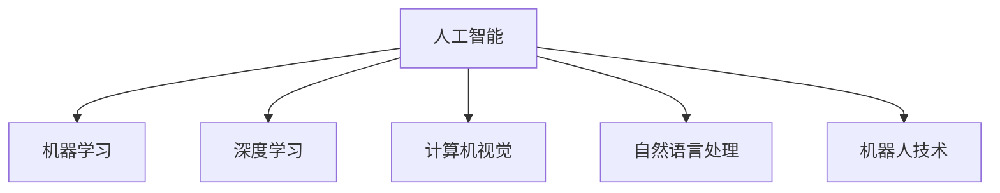

                 

## 1. 背景介绍

随着人工智能(AI)技术的迅猛发展，特别是深度学习、计算机视觉、自然语言处理等领域的技术突破，人类计算的时代正在悄然改变。AI不仅能高效完成复杂的任务，还能在特定领域内提供超越人类水平的性能。那么，在AI时代，人类计算将面临怎样的挑战与机遇？本文将深入探讨AI时代人类计算的未来就业前景和技能需求。

## 2. 核心概念与联系

### 2.1 核心概念概述

在AI时代，人类计算的核心概念主要包括以下几点：

1. **人工智能**：通过模拟人类智能，让机器执行需要人类智能的任务，包括但不限于计算机视觉、语音识别、自然语言处理等。
2. **机器学习**：使机器通过数据学习，自动改进性能的技术。机器学习模型通常包括监督学习、无监督学习和强化学习三种类型。
3. **深度学习**：一种基于人工神经网络的机器学习方法，能够处理复杂的数据结构，例如图像、声音和文本。
4. **计算机视觉**：使计算机能“看”的技术，主要涉及图像处理、模式识别和视觉感知等。
5. **自然语言处理**：使计算机能“听”和“理解”人类语言的技术，包括语音识别、语言理解、语言生成等。
6. **机器人技术**：结合机械工程和计算机技术，让机器人能够执行各种任务。

这些核心概念通过彼此协作，共同构成了AI时代人类计算的基石。如图，以下是一个简单的流程图，展示了这些概念间的联系：



## 3. 核心算法原理 & 具体操作步骤

### 3.1 算法原理概述

在AI时代，深度学习模型通过大量数据进行训练，逐步提升其性能。深度学习模型通常包括多个神经网络层，每一层都能自动提取数据中的特征，从而实现高级别的任务处理。深度学习的核心算法包括前向传播和反向传播。

在模型训练过程中，前向传播将输入数据通过网络层处理，得到输出结果。反向传播则基于输出结果，通过链式法则计算梯度，从而更新网络参数，使模型性能不断提高。这一过程不断迭代，直至模型收敛或达到预设的训练轮数。

### 3.2 算法步骤详解

以下是深度学习模型的典型训练步骤：

1. **数据准备**：收集并准备训练数据，将其分为训练集、验证集和测试集。
2. **模型选择**：选择合适的深度学习模型，如卷积神经网络(CNN)、循环神经网络(RNN)、Transformer等。
3. **参数初始化**：对模型参数进行初始化，通常使用随机初始化或预训练模型。
4. **前向传播**：将训练数据输入模型，计算模型输出。
5. **计算损失**：计算模型输出与真实标签之间的损失函数，例如均方误差(MSE)、交叉熵等。
6. **反向传播**：计算损失函数对模型参数的梯度，使用梯度下降等优化算法更新参数。
7. **验证和测试**：在验证集和测试集上评估模型性能，优化超参数。
8. **应用部署**：将训练好的模型部署到实际应用中，进行推理计算。

### 3.3 算法优缺点

深度学习模型的优点包括：

- 强大的数据拟合能力：深度学习模型能够学习复杂的数据分布，适用于多种任务。
- 自动特征提取：模型能够自动提取数据的高级特征，减少手工特征工程的工作量。
- 端到端训练：深度学习模型能够直接学习输入数据到输出结果的映射，不需要手动设计中间环节。

然而，深度学习模型也存在以下缺点：

- 数据依赖性强：深度学习模型需要大量标注数据进行训练，数据获取成本较高。
- 训练时间长：深度学习模型的训练时间较长，通常需要GPU等高性能设备。
- 可解释性差：深度学习模型通常被视为"黑箱"，难以解释其内部工作机制。

### 3.4 算法应用领域

深度学习模型的应用领域非常广泛，包括但不限于：

- **计算机视觉**：图像分类、目标检测、人脸识别等。
- **自然语言处理**：机器翻译、情感分析、文本生成等。
- **语音识别**：语音转文本、情感识别等。
- **推荐系统**：个性化推荐、广告推荐等。
- **游戏AI**：自主决策、策略规划等。

## 4. 数学模型和公式 & 详细讲解 & 举例说明

### 4.1 数学模型构建

以图像分类为例，常用的深度学习模型是卷积神经网络(CNN)。CNN模型包含卷积层、池化层和全连接层等组件。如图，以下是一个简单的CNN模型结构图：


### 4.2 公式推导过程

在CNN模型中，卷积层和池化层是核心组件，用于提取输入数据的局部特征。以卷积层为例，其计算公式如下：

$$
\text{Conv}(x) = \sum_{i=0}^{h-1} \sum_{j=0}^{w-1} \sum_{k=0}^{c-1} \left( x_{i,j,k} * W_{i,j,k} \right) + b_k
$$

其中，$x$为输入数据，$h$、$w$、$c$分别为输入数据的高度、宽度和通道数，$W$为卷积核，$b$为偏置项。

### 4.3 案例分析与讲解

以图像分类为例，假设有三个卷积核$W_1$、$W_2$、$W_3$，分别提取输入数据中的不同特征。将三个卷积核的结果进行拼接，并通过ReLU激活函数和池化层处理，最终得到一个高维特征向量，送入全连接层进行分类。

## 5. 项目实践：代码实例和详细解释说明

### 5.1 开发环境搭建

在深度学习模型的开发中，Python是最常用的编程语言，TensorFlow和PyTorch是最流行的深度学习框架。以下是在Python和TensorFlow环境下搭建开发环境的详细步骤：

1. **安装Anaconda**：从官网下载并安装Anaconda，创建独立的Python环境。
2. **安装TensorFlow**：使用pip安装TensorFlow，并指定所需版本。
3. **安装Pandas和Numpy**：这些是数据处理常用的Python库，需要安装。
4. **创建虚拟环境**：在Anaconda中创建虚拟环境，并激活。
5. **安装模型库**：安装常用的深度学习模型库，如Keras、TensorFlow等。

### 5.2 源代码详细实现

以下是一个简单的图像分类模型的代码实现，使用TensorFlow框架：

```python
import tensorflow as tf
from tensorflow.keras import layers

# 定义模型
model = tf.keras.Sequential([
    layers.Conv2D(32, (3, 3), activation='relu', input_shape=(28, 28, 1)),
    layers.MaxPooling2D((2, 2)),
    layers.Conv2D(64, (3, 3), activation='relu'),
    layers.MaxPooling2D((2, 2)),
    layers.Flatten(),
    layers.Dense(64, activation='relu'),
    layers.Dense(10)
])

# 编译模型
model.compile(optimizer='adam',
              loss=tf.keras.losses.SparseCategoricalCrossentropy(from_logits=True),
              metrics=['accuracy'])

# 加载数据集
mnist = tf.keras.datasets.mnist
(x_train, y_train), (x_test, y_test) = mnist.load_data()
x_train, x_test = x_train / 255.0, x_test / 255.0

# 训练模型
model.fit(x_train, y_train, epochs=5, validation_data=(x_test, y_test))
```

### 5.3 代码解读与分析

在上述代码中，首先定义了一个简单的卷积神经网络模型，包含两个卷积层、两个池化层和两个全连接层。使用MNIST数据集进行训练和验证。

## 6. 实际应用场景

在AI时代，人类计算的应用场景越来越广泛。以下是几个典型的应用场景：

### 6.1 自动驾驶

自动驾驶技术通过计算机视觉和深度学习模型，实现对道路环境的高效感知和决策。如图，以下是一个简单的自动驾驶系统结构图：


### 6.2 医疗影像诊断

医疗影像诊断通过深度学习模型，对医学影像进行自动化分析，辅助医生进行诊断。如图，以下是一个简单的医疗影像诊断系统结构图：


### 6.3 智能客服

智能客服通过自然语言处理和深度学习模型，实现对用户问题的自动理解与回答。如图，以下是一个简单的智能客服系统结构图：


### 6.4 未来应用展望

未来，随着AI技术的不断发展，人类计算的应用场景将更加多样和复杂。以下是一些未来应用展望：

- **智能制造**：通过深度学习模型对生产数据进行实时分析，提高生产效率和质量。
- **智慧城市**：通过深度学习模型对城市数据进行智能分析，提高城市管理效率和安全性。
- **个性化推荐**：通过深度学习模型对用户行为进行分析和预测，提供个性化推荐服务。
- **医疗健康**：通过深度学习模型对医疗数据进行分析和诊断，提高医疗服务的质量和效率。

## 7. 工具和资源推荐

### 7.1 学习资源推荐

为了更好地掌握AI时代的计算技能，以下是一些推荐的在线资源：

1. **Coursera**：提供由顶尖大学和公司提供的AI相关课程，涵盖了深度学习、计算机视觉、自然语言处理等多个领域。
2. **Udacity**：提供AI相关的纳米学位课程，包括深度学习、自动驾驶等。
3. **DeepLearning.AI**：提供由Andrew Ng教授主讲的深度学习课程，涵盖基础知识和高级技术。
4. **Kaggle**：提供数据科学和机器学习的竞赛平台，可以学习和分享数据处理和模型优化经验。
5. **GitHub**：提供开源AI项目和代码库，方便学习和复用。

### 7.2 开发工具推荐

在AI开发中，以下工具和框架是常用的：

1. **TensorFlow**：由Google开发的深度学习框架，支持多种编程语言和分布式计算。
2. **PyTorch**：由Facebook开发的深度学习框架，支持动态图和静态图计算。
3. **Keras**：基于TensorFlow和Theano的高级API，提供简单易用的深度学习模型构建接口。
4. **Jupyter Notebook**：提供交互式的编程环境，方便模型开发和数据可视化。
5. **Anaconda**：提供Python环境管理和依赖管理，方便开发和部署。

### 7.3 相关论文推荐

以下是几篇AI领域的经典论文，推荐阅读：

1. **ImageNet Classification with Deep Convolutional Neural Networks**：提出卷积神经网络，并在ImageNet数据集上取得了优异表现。
2. **Learning to Detect Objects with Invariance to Scale and Rotation**：提出基于尺度不变和旋转不变的目标检测算法，提升了目标检测的精度。
3. **Attention Is All You Need**：提出Transformer模型，显著提高了自然语言处理任务的性能。
4. **BERT: Pre-training of Deep Bidirectional Transformers for Language Understanding**：提出BERT模型，利用预训练技术提升了语言理解能力。
5. **AlphaGo Zero**：提出AlphaGo Zero算法，实现了在围棋上的零知识学习和自我对弈。

## 8. 总结：未来发展趋势与挑战

### 8.1 研究成果总结

在AI时代，人类计算领域取得了诸多重大突破，特别是在深度学习、计算机视觉和自然语言处理等方面。这些技术不仅提升了计算机的智能水平，也在各个行业中得到了广泛应用。

### 8.2 未来发展趋势

未来，人类计算领域将继续朝着智能化、自动化和人性化方向发展，以下是一些未来发展趋势：

1. **自动化水平提升**：自动化技术将进一步提升，实现更高效、更精准的计算任务。
2. **多模态融合**：多模态计算技术将进一步发展，实现视觉、听觉、触觉等信息的全面融合。
3. **边缘计算**：边缘计算技术将进一步普及，实现实时数据处理和分析。
4. **人机协同**：人机协同技术将进一步提升，实现更加自然的交互体验。

### 8.3 面临的挑战

尽管AI技术取得了重大进展，但在应用过程中仍面临诸多挑战：

1. **数据获取成本高**：深度学习模型需要大量标注数据进行训练，数据获取成本较高。
2. **模型可解释性差**：深度学习模型通常被视为"黑箱"，难以解释其内部工作机制。
3. **算法伦理问题**：AI技术的应用可能涉及伦理问题，需要关注算法偏见和数据隐私等问题。
4. **计算资源需求高**：深度学习模型需要高性能计算资源，成本较高。
5. **技术门槛高**：深度学习技术复杂，需要专业知识，对开发者提出了较高要求。

### 8.4 研究展望

未来，在人类计算领域，需要关注以下几个方面：

1. **数据获取**：探索更多低成本的数据获取方法，提高数据质量。
2. **算法优化**：优化模型结构，提高计算效率，降低算法复杂度。
3. **伦理规范**：建立AI技术的伦理规范，确保技术应用的公正性。
4. **人机协同**：提升人机协同技术，实现更加自然的交互体验。
5. **跨领域应用**：将AI技术应用到更多领域，提升各行业效率和效益。

## 9. 附录：常见问题与解答

**Q1：AI时代人类计算的主要应用场景是什么？**

A: AI时代人类计算的主要应用场景包括自动驾驶、医疗影像诊断、智能客服、个性化推荐等。这些场景中，AI技术能够显著提升效率和准确性，改善用户体验。

**Q2：如何提高深度学习模型的训练效率？**

A: 提高深度学习模型训练效率的方法包括：
1. **数据增强**：通过对训练数据进行扩充，提高模型鲁棒性。
2. **分布式训练**：使用多台机器进行分布式训练，提升计算速度。
3. **模型压缩**：对模型进行压缩，减少计算量。
4. **梯度累积**：通过批量处理数据，减少单次计算量。
5. **混合精度训练**：使用混合精度计算，提高计算效率。

**Q3：如何优化深度学习模型的性能？**

A: 优化深度学习模型性能的方法包括：
1. **超参数调优**：通过调整学习率、批大小等超参数，优化模型性能。
2. **正则化**：通过L2正则、Dropout等方法，避免过拟合。
3. **模型融合**：通过模型融合，提高模型鲁棒性。
4. **迁移学习**：利用预训练模型，提高模型泛化能力。
5. **知识蒸馏**：通过知识蒸馏，提高模型泛化能力。

**Q4：AI技术在医疗健康领域有哪些应用？**

A: AI技术在医疗健康领域的应用包括：
1. **医学影像分析**：通过深度学习模型，对医学影像进行分析和诊断。
2. **个性化治疗**：通过深度学习模型，对患者数据进行分析和预测，提供个性化治疗方案。
3. **药物研发**：通过深度学习模型，对药物分子进行分析和预测，加速药物研发进程。

**Q5：AI技术在智能制造领域有哪些应用？**

A: AI技术在智能制造领域的应用包括：
1. **生产过程优化**：通过深度学习模型，对生产数据进行分析和优化。
2. **设备维护**：通过深度学习模型，对设备状态进行预测和维护。
3. **质量检测**：通过深度学习模型，对产品质量进行检测和分析。

---

作者：禅与计算机程序设计艺术 / Zen and the Art of Computer Programming

