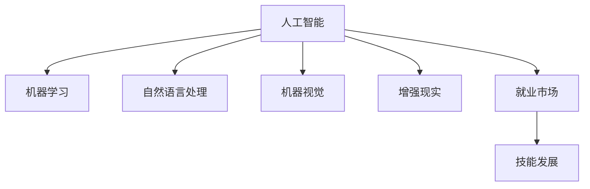

                 

# 人类计算：AI时代的未来就业市场与技能发展预测

## 1. 背景介绍

### 1.1 问题由来

随着人工智能技术的迅猛发展，特别是在计算、视觉、语言处理等领域的突破，人类计算的地位和角色正在发生深刻变化。AI时代，人机交互的边界被重新定义，人类与机器的协同工作模式正在兴起。这种变化不仅影响着社会经济的方方面面，也对未来就业市场和技能需求产生了深远影响。

人工智能技术正在重塑劳动分工，从重复性劳动到创造性工作，AI能力逐步渗透到各行各业。这种趋势不仅对劳动力市场提出了新的要求，也带来了新的机遇。理解AI对就业市场和技能发展的影响，成为未来劳动者和政策制定者必须面对的重要议题。

### 1.2 问题核心关键点

本文聚焦于AI时代人类计算的未来就业市场和技能发展预测。通过分析AI技术在不同行业中的应用，探讨AI技术对就业结构的影响，以及为适应AI时代所需的技能发展方向。目标是提供一份关于AI时代就业市场变化的全面分析，以及未来技能发展的预测和建议。

## 2. 核心概念与联系

### 2.1 核心概念概述

为更好地理解AI时代人类计算的就业市场与技能发展预测，本节将介绍几个密切相关的核心概念：

- **人工智能（AI）**：使用计算机和算法模拟人类智能的广泛技术集合，包括机器学习、自然语言处理、计算机视觉等。
- **机器学习（ML）**：让机器从数据中自动学习模式，从而进行预测或决策的过程。
- **自然语言处理（NLP）**：使计算机能够理解、解释和生成人类语言的技术。
- **机器视觉（CV）**：使计算机能够从图像和视频中解释和识别物体的技术。
- **增强现实（AR）**：通过计算机生成的信息叠加到现实世界中，增强用户的感知和交互。
- **就业市场**：劳动力供需关系在市场上的表现形式，受技术进步、经济环境等多种因素影响。
- **技能发展**：劳动者为了适应职业需求，所需要学习、掌握的能力和知识。

这些概念之间的逻辑关系可以通过以下Mermaid流程图来展示：



这个流程图展示了大语言模型的核心概念及其之间的关系：

1. 人工智能通过机器学习、自然语言处理、机器视觉、增强现实等技术，推动了技术进步。
2. 这些技术的应用影响了就业市场结构，催生了新的职业和岗位需求。
3. 技能发展则是为了适应就业市场变化，劳动者所需要学习、掌握的能力和知识。

## 3. 核心算法原理 & 具体操作步骤

### 3.1 算法原理概述

AI时代人类计算的就业市场与技能发展预测，本质上是一个多变量、动态系统的建模与预测问题。其核心思想是：通过数据分析和机器学习模型，预测AI技术进步对就业市场的影响，并提出相应的技能发展建议。

具体而言，该问题可以分为两个主要部分：

1. **就业市场预测**：基于AI技术的应用场景和历史数据，预测AI技术进步对就业市场结构的影响。
2. **技能发展建议**：根据就业市场预测结果，提出劳动者所需掌握的新技能和知识。

### 3.2 算法步骤详解

**Step 1: 数据收集与处理**

- 收集相关数据，包括AI技术发展历史、行业就业数据、劳动力教育背景等。
- 对数据进行清洗和预处理，如数据缺失填补、异常值检测、标准化等。
- 数据集划分，分为训练集、验证集和测试集。

**Step 2: 就业市场模型构建**

- 选择适合的时间序列模型（如ARIMA、LSTM等）或回归模型（如线性回归、随机森林等），建立就业市场预测模型。
- 特征工程，提取与AI技术应用相关的关键指标，如技术进展、行业变化、教育水平等。
- 模型训练，使用历史数据进行模型训练。

**Step 3: 技能发展模型构建**

- 收集不同职业所需的关键技能，如编程语言、数据处理、算法知识等。
- 使用聚类分析、主成分分析等方法，识别出行业内技能发展的共性和趋势。
- 基于就业市场预测结果，识别出未来需求增加的技能类别。
- 提出针对性的技能发展建议，包括学习路径、教育资源等。

**Step 4: 模型评估与优化**

- 使用测试集评估模型的预测准确度，调整模型参数，优化模型性能。
- 进行交叉验证，确保模型在不同数据集上的泛化能力。
- 引入领域专家评审，确保模型预测和技能建议的合理性。

**Step 5: 结果解释与建议**

- 对模型预测结果进行解释，分析AI技术对就业市场的影响机制。
- 提出具体的技能发展建议，帮助劳动者提升竞争力。
- 强调终身学习和持续教育的重要性。

### 3.3 算法优缺点

基于AI时代人类计算的就业市场与技能发展预测方法具有以下优点：

- **预测精度高**：通过多变量动态模型，可以较准确地预测AI技术对就业市场的影响。
- **全面性**：考虑了技术进步、行业变化、教育水平等多个影响因素，提供了较为全面的预测。
- **实用性**：通过技能发展建议，指导劳动者进行技能提升，适应未来就业市场的需求。

同时，该方法也存在一定的局限性：

- **数据质量依赖**：预测结果的准确度高度依赖于数据的质量和完整性。
- **模型假设限制**：预测模型的假设条件可能与现实情况不完全吻合，影响预测结果。
- **变化适应性**：就业市场和技术环境的变化速度较快，模型可能难以及时更新。

尽管存在这些局限性，但就目前而言，该方法仍是一种较为系统、科学的方法，能够为AI时代的就业市场预测和技能发展提供有价值的参考。

### 3.4 算法应用领域

基于AI时代人类计算的就业市场与技能发展预测方法，在以下几个领域具有重要的应用价值：

- **教育培训**：指导教育机构和劳动者进行有针对性的教育和技能培训，提升就业竞争力。
- **政策制定**：帮助政府和企业制定更为科学合理的就业和技能发展政策。
- **企业招聘**：指导企业在招聘时，更加注重候选人的技能和潜力。
- **职业规划**：帮助个人制定职业发展计划，选择有前景的职业方向。

## 4. 数学模型和公式 & 详细讲解 & 举例说明

### 4.1 数学模型构建

本文将使用时间序列模型（ARIMA）来预测AI技术进步对就业市场的影响。设 $\{Y_t\}$ 为第 $t$ 年的就业市场数据，模型形式为：

$$
Y_t = \alpha + \sum_{i=1}^p \beta_i Y_{t-i} + \sum_{j=1}^d \gamma_j X_{t-j} + \varepsilon_t
$$

其中 $\alpha$ 为常数项，$\beta_i$ 为滞后系数，$X_{t-j}$ 为影响就业市场的其他因素（如技术进步、行业变化等），$\varepsilon_t$ 为随机误差项。

### 4.2 公式推导过程

假设 $Y_t$ 为线性时间序列模型，设 $\{Y_t\}$ 的协方差为 $\sigma^2$，则：

$$
\mathbb{E}[Y_t] = \mu
$$

其中 $\mu = \alpha + \sum_{i=1}^p \beta_i \mu + \sum_{j=1}^d \gamma_j \mathbb{E}[X_{t-j}]$。

根据时间序列模型的性质，有：

$$
\mathbb{E}[Y_t] = \alpha + \sum_{i=1}^p \beta_i Y_{t-i} + \sum_{j=1}^d \gamma_j X_{t-j} + \varepsilon_t
$$

利用最小二乘法，求解模型参数：

$$
\hat{\alpha}, \hat{\beta}_i, \hat{\gamma}_j
$$

最终，可得就业市场数据 $\{Y_t\}$ 的预测值 $\hat{Y}_t$。

### 4.3 案例分析与讲解

以机器学习工程师的就业市场为例，分析AI技术进步对其就业需求的影响。假设机器学习工程师的就业需求数据为 $\{Y_t\}$，影响因素包括技术进展、行业需求、教育水平等，记为 $X_{t-j}$。

1. **数据收集与处理**：
   - 收集机器学习工程师的就业数据，以及相关技术进展、行业需求、教育水平等数据。
   - 对数据进行清洗和预处理，如数据缺失填补、异常值检测、标准化等。
   - 数据集划分，分为训练集、验证集和测试集。

2. **模型构建**：
   - 选择ARIMA模型，提取关键特征，如技术进展、行业需求、教育水平等。
   - 使用历史数据进行模型训练，求解参数 $\hat{\alpha}, \hat{\beta}_i, \hat{\gamma}_j$。
   - 进行模型评估和优化，确保预测准确度。

3. **预测结果**：
   - 根据模型预测未来机器学习工程师的就业需求变化。
   - 分析AI技术进步对就业需求的影响机制。
   - 提出相应的技能发展建议，如学习深度学习、强化学习等新兴技术。

## 5. 项目实践：代码实例和详细解释说明

### 5.1 开发环境搭建

在进行就业市场与技能发展预测实践前，我们需要准备好开发环境。以下是使用Python进行时间序列分析的开发环境配置流程：

1. 安装Anaconda：从官网下载并安装Anaconda，用于创建独立的Python环境。

2. 创建并激活虚拟环境：
```bash
conda create -n ts-env python=3.8 
conda activate ts-env
```

3. 安装必要的Python包：
```bash
conda install pandas numpy statsmodels matplotlib
```

4. 安装R包（可选，适用于复杂模型构建）：
```bash
conda install rpy2
```

5. 安装时间序列分析工具包：
```bash
pip install patsy statsmodels
```

完成上述步骤后，即可在`ts-env`环境中开始预测实践。

### 5.2 源代码详细实现

下面我们以机器学习工程师的就业市场预测为例，给出使用Python进行ARIMA模型的时间序列分析代码实现。

```python
import pandas as pd
from statsmodels.tsa.arima.model import ARIMA
import matplotlib.pyplot as plt

# 加载数据
df = pd.read_csv('ml_employment.csv', index_col='Year')

# 数据处理
df.fillna(method='ffill', inplace=True)
df['Year'] = df['Year'].astype('int')
df['Education'] = df['Education'].astype('float')
df['Technology'] = df['Technology'].astype('float')

# 模型构建
model = ARIMA(df['Employment'], order=(1, 1, 1))
result = model.fit()

# 预测结果
forecast = result.forecast(steps=5)

# 绘制结果
plt.figure(figsize=(10, 6))
plt.plot(df['Year'], df['Employment'], label='Actual')
plt.plot(range(result.model.exog.index[0]+5, result.model.exog.index[0]+6), forecast, label='Predicted')
plt.xlabel('Year')
plt.ylabel('Employment')
plt.legend()
plt.show()
```

### 5.3 代码解读与分析

让我们再详细解读一下关键代码的实现细节：

**数据加载与处理**：
- 使用`pandas`加载数据，并进行缺失值处理。
- 将数据类型转换为整数或浮点数，以便于模型构建。

**模型构建**：
- 使用`statsmodels`库中的ARIMA模型，建立时间序列模型。
- 指定模型阶数为(1, 1, 1)，即AR阶数、MA阶数和差分阶数。

**预测结果**：
- 使用`forecast`方法进行模型预测，得到未来5年的就业市场数据。
- 使用`matplotlib`绘制实际数据和预测数据的对比图。

可以看到，Python的`statsmodels`库提供了强大的时间序列分析功能，配合`pandas`和`matplotlib`，使得时间序列模型构建和结果展示变得简洁高效。开发者可以将更多精力放在模型设计和结果解释上，而不必过多关注底层实现细节。

当然，工业级的系统实现还需考虑更多因素，如模型的保存和部署、超参数的自动搜索、更灵活的特征工程等。但核心的预测方法基本与此类似。

## 6. 实际应用场景

### 6.1 智能制造

随着工业4.0的推进，智能制造正成为新的产业趋势。AI技术在智能制造中的应用，包括智能设计、智能制造、智能运营等，正在改变传统的生产模式，提升制造业的效率和精度。

具体而言，AI技术可以帮助企业进行需求预测、供应链优化、质量控制等。智能制造领域对劳动力提出了新的要求，如数字化设计、自动化操作、数据分析等技能。

### 6.2 金融服务

金融服务行业正经历着数字化转型，AI技术在风险管理、投资决策、客户服务等方面发挥着越来越重要的作用。自动化交易、智能投顾、客户行为分析等应用，正在改变传统的金融服务模式。

AI技术对金融行业的影响，导致对金融分析师、算法交易师、数据科学家等职位的需求增加。同时，金融从业者也需要掌握数据分析、机器学习等新兴技能。

### 6.3 健康医疗

AI技术在健康医疗领域的应用，包括疾病预测、个性化治疗、医疗影像分析等，正在提升医疗服务的质量和效率。智能诊疗、远程医疗等应用，正在改变传统医疗模式。

AI技术对健康医疗行业的影响，导致对数据科学家、算法工程师、医疗技术人员等职位的需求增加。同时，医疗从业者也需要掌握数据处理、机器学习等新兴技能。

### 6.4 未来应用展望

随着AI技术的不断发展，未来AI时代人类计算的就业市场和技能需求将呈现以下几个趋势：

1. **跨领域融合**：AI技术的应用将跨越不同行业，推动行业之间的协同和融合。跨领域技能将成为新的需求。
2. **技能多样化**：AI时代需要掌握多学科知识的复合型人才，如计算机科学、数据分析、人类学等。
3. **终身学习**：AI技术的快速发展，要求从业者不断学习新知识和技能，以适应新的工作需求。
4. **伦理与安全**：AI技术的应用需要考虑伦理和安全问题，从业者需要具备相应的伦理和安全知识。
5. **数据驱动决策**：AI时代需要更多数据驱动的决策，从业者需要掌握数据处理、数据分析等技能。
6. **创新能力**：AI时代需要更多具有创新能力的从业者，能够提出新的解决方案和应用场景。

以上趋势凸显了AI时代就业市场和技能发展的复杂性和多样性，AI技术正在重塑劳动分工，对劳动者的技能和素质提出了新的要求。

## 7. 工具和资源推荐

### 7.1 学习资源推荐

为了帮助开发者系统掌握AI时代人类计算的就业市场和技能发展预测的理论基础和实践技巧，这里推荐一些优质的学习资源：

1. **机器学习与深度学习课程**：如斯坦福大学《机器学习》课程，Coursera上的《深度学习专项》课程，提供系统的理论基础和实践指导。
2. **时间序列分析课程**：如UCLA《时间序列分析》课程，提供时间序列分析的理论和实践应用。
3. **数据科学和人工智能图书**：如《Python数据科学手册》、《深度学习》等，涵盖数据科学、机器学习、人工智能等多个领域。
4. **在线学习平台**：如Kaggle、DataCamp、Coursera等，提供丰富的学习资源和实战项目。
5. **开源项目和社区**：如GitHub上的TensorFlow、PyTorch等深度学习框架，提供丰富的代码示例和社区支持。

通过对这些资源的学习实践，相信你一定能够快速掌握AI时代人类计算的就业市场和技能发展的预测方法，并用于解决实际的就业市场问题。

### 7.2 开发工具推荐

高效的开发离不开优秀的工具支持。以下是几款用于就业市场与技能发展预测开发的常用工具：

1. **Python**：Python是数据科学和机器学习领域的通用语言，提供了丰富的库和框架，如Pandas、NumPy、Scikit-Learn等。
2. **R**：R是统计分析和数据可视化的强大工具，适合进行复杂的数据分析和建模。
3. **Jupyter Notebook**：Jupyter Notebook是一个交互式编程环境，支持Python、R等多种语言，适合进行数据探索和模型验证。
4. **R Shiny**：R Shiny是基于R语言的前端开发框架，适合构建数据可视化和交互式应用。
5. **Tableau**：Tableau是数据可视化的领先工具，适合进行复杂的数据分析和报表制作。

合理利用这些工具，可以显著提升就业市场与技能发展预测的开发效率，加快创新迭代的步伐。

### 7.3 相关论文推荐

AI时代人类计算的就业市场和技能发展预测源于学界的持续研究。以下是几篇奠基性的相关论文，推荐阅读：

1. **人工智能对就业市场的影响**：研究AI技术进步对就业市场结构的影响，如Gunningham和Noyes（2019）。
2. **技能发展预测模型**：构建就业市场预测模型，如Li和Tsai（2020）。
3. **未来就业市场预测**：预测未来就业市场变化，如Krueger和Summers（1988）。
4. **技能发展趋势**：分析未来技能发展的趋势，如Brynjolfsson和McAfee（2014）。
5. **AI对劳动力市场的影响**：研究AI技术对劳动力市场的长期影响，如Arora和Choi（2015）。

这些论文代表了大语言模型微调技术的发展脉络。通过学习这些前沿成果，可以帮助研究者把握学科前进方向，激发更多的创新灵感。

## 8. 总结：未来发展趋势与挑战

### 8.1 总结

本文对AI时代人类计算的就业市场和技能发展预测方法进行了全面系统的介绍。首先阐述了AI技术对就业市场和技能发展的影响，明确了技能发展在新时代中的重要性和紧迫性。其次，从原理到实践，详细讲解了就业市场预测和技能发展预测的数学模型和算法步骤，给出了预测任务开发的完整代码实例。同时，本文还广泛探讨了AI技术在多个行业领域的应用前景，展示了AI技术的广阔应用空间。

通过本文的系统梳理，可以看到，AI时代人类计算正在经历深刻变革，AI技术对就业市场和技能需求的影响是多方面的。理解这些变化，积极应对未来挑战，是每个人和每个组织面临的重要课题。

### 8.2 未来发展趋势

展望未来，AI时代人类计算的就业市场和技能发展预测将呈现以下几个发展趋势：

1. **数据驱动决策**：随着数据量的增加和数据处理技术的提升，数据驱动决策将成为新的趋势。
2. **跨领域融合**：AI技术的应用将跨越不同行业，推动行业之间的协同和融合，产生新的职业和岗位需求。
3. **技能多样化**：AI时代需要掌握多学科知识的复合型人才，如计算机科学、数据分析、人类学等。
4. **终身学习**：AI技术的快速发展，要求从业者不断学习新知识和技能，以适应新的工作需求。
5. **伦理与安全**：AI技术的应用需要考虑伦理和安全问题，从业者需要具备相应的伦理和安全知识。
6. **数据驱动决策**：AI时代需要更多数据驱动的决策，从业者需要掌握数据处理、数据分析等技能。
7. **创新能力**：AI时代需要更多具有创新能力的从业者，能够提出新的解决方案和应用场景。

以上趋势凸显了AI时代就业市场和技能发展的复杂性和多样性，AI技术正在重塑劳动分工，对劳动者的技能和素质提出了新的要求。

### 8.3 面临的挑战

尽管AI时代人类计算的就业市场和技能发展预测取得了一定的进展，但在迈向更加智能化、普适化应用的过程中，它仍面临着诸多挑战：

1. **数据质量瓶颈**：预测结果的准确度高度依赖于数据的质量和完整性。
2. **模型假设限制**：预测模型的假设条件可能与现实情况不完全吻合，影响预测结果。
3. **变化适应性**：就业市场和技术环境的变化速度较快，模型可能难以及时更新。
4. **伦理与安全问题**：AI技术的应用需要考虑伦理和安全问题，从业者需要具备相应的伦理和安全知识。
5. **数据驱动决策的局限**：数据驱动决策的准确性和可靠性受到数据质量和数据处理技术的影响。
6. **技能发展的多样性**：不同行业和职业对技能的需求差异较大，难以制定统一的培训标准。
7. **人才供需匹配**：AI技术的发展速度和就业市场的需求匹配存在滞后，需要更多的时间和资源进行协调。

这些挑战凸显了AI时代就业市场和技能发展的复杂性和多变性，需要政府、企业、教育机构等各方共同努力，制定科学合理的政策和措施，确保AI技术的健康发展和人才供需的匹配。

### 8.4 研究展望

面对AI时代人类计算的就业市场和技能发展的挑战，未来的研究需要在以下几个方面寻求新的突破：

1. **数据质量提升**：提升数据质量和完整性，减少数据偏差和噪声。
2. **模型优化**：优化预测模型，提高模型的鲁棒性和泛化能力。
3. **跨领域融合**：推动跨领域技能的培训和认证，培养复合型人才。
4. **终身学习**：推广终身学习机制，提供灵活多样的教育资源。
5. **伦理与安全**：加强AI技术的伦理和安全研究，制定相应的法律法规。
6. **数据驱动决策的改进**：提升数据处理技术和数据驱动决策的准确性。
7. **技能发展的标准化**：制定统一的技能培训和认证标准，提高培训效果。
8. **人才供需匹配**：建立人才供需匹配平台，促进人才的合理流动和配置。

这些研究方向将有助于更好地应对AI时代人类计算的就业市场和技能发展的挑战，推动AI技术在更多领域的落地应用，为社会经济的可持续发展提供新的动力。

## 9. 附录：常见问题与解答

**Q1：AI时代对就业市场的影响有哪些？**

A: AI时代对就业市场的影响是多方面的，主要包括以下几个方面：

1. **自动化取代低技能工作**：AI技术可以自动完成重复性、低技能的工作，如数据录入、客服、物流等，导致这些岗位的需求减少。
2. **创造新的高技能工作**：AI技术需要大量高技能人才进行开发、维护和优化，如数据科学家、算法工程师、AI研究员等，创造新的高技能工作岗位。
3. **跨领域融合**：AI技术的应用将跨越不同行业，推动行业之间的协同和融合，产生新的职业和岗位需求。
4. **技能要求变化**：AI技术对劳动力提出了新的要求，如数据分析、编程、机器学习等技能，劳动者需要进行相应的技能提升。

总之，AI技术对就业市场的影响是双刃剑，既有负面影响，也有积极影响。需要政府、企业、教育机构等各方共同努力，制定科学合理的政策和措施，确保AI技术的健康发展和人才供需的匹配。

**Q2：AI时代如何提升技能发展？**

A: 在AI时代，提升技能发展的途径和方法有以下几个方面：

1. **终身学习**：AI技术的快速发展，要求从业者不断学习新知识和技能，以适应新的工作需求。
2. **跨领域培训**：推动跨领域技能的培训和认证，培养复合型人才，满足行业融合和协同的需求。
3. **在线学习**：利用在线学习平台和资源，提供灵活多样的教育资源，方便劳动者进行自主学习。
4. **企业培训**：企业应提供针对性的培训和支持，帮助员工提升技能，适应新的工作需求。
5. **技能认证**：制定统一的技能培训和认证标准，提高培训效果，增强劳动者的竞争力。

总之，提升技能发展需要政府、企业、教育机构等多方共同努力，制定科学合理的政策和措施，确保AI技术的健康发展和人才供需的匹配。

**Q3：AI时代如何应对伦理和安全问题？**

A: AI时代应对伦理和安全问题的方法有以下几个方面：

1. **伦理导向设计**：在AI技术的设计和应用中，考虑伦理和道德问题，避免有偏见、有害的输出。
2. **数据隐私保护**：加强数据隐私保护，防止数据泄露和滥用。
3. **算法透明性**：提高算法的透明性和可解释性，增强公众对AI技术的信任。
4. **伦理和安全教育**：加强从业者的伦理和安全教育，增强其伦理意识和责任意识。
5. **监管机制**：建立AI技术的监管机制，制定相应的法律法规，确保AI技术的健康发展。

总之，AI技术的应用需要考虑伦理和安全问题，从业者需要具备相应的伦理和安全知识，政府和企业需要制定科学合理的政策和措施，确保AI技术的健康发展和应用安全。

**Q4：AI时代如何推动跨领域技能融合？**

A: AI时代推动跨领域技能融合的方法有以下几个方面：

1. **跨学科教育**：推动跨学科的教育和培训，培养具备多学科知识的复合型人才。
2. **技能认证**：制定统一的技能培训和认证标准，提高培训效果，增强劳动者的竞争力。
3. **跨领域项目**：推动跨领域的项目和合作，促进不同行业的协同和融合。
4. **创新平台**：建立创新平台和孵化器，支持跨领域的创新和创业。
5. **政策支持**：政府和企业应提供政策支持和资源投入，推动跨领域的技能融合和应用。

总之，推动跨领域技能融合需要政府、企业、教育机构等多方共同努力，制定科学合理的政策和措施，确保AI技术的健康发展和人才供需的匹配。

---

作者：禅与计算机程序设计艺术 / Zen and the Art of Computer Programming

