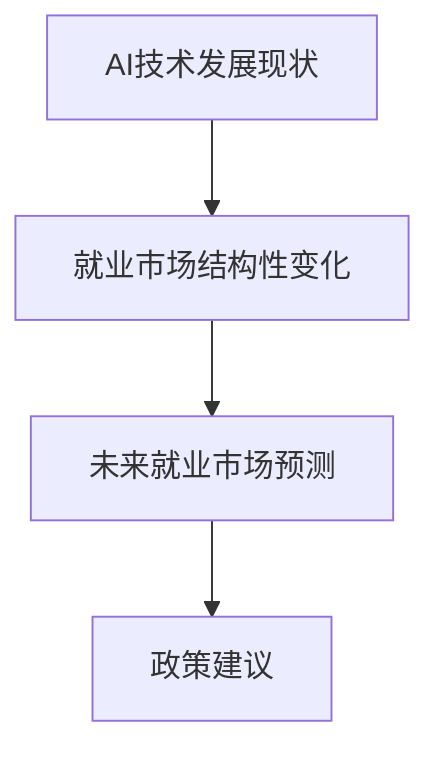

                 

## 1. 背景介绍

### 1.1 问题由来

随着人工智能（AI）技术的快速发展和广泛应用，自动化和机器学习正在深刻改变各行各业的运作模式。自动化不仅替代了简单、重复的劳动任务，也在逐渐蚕食一些传统知识型岗位，从而对全球就业市场产生了重大影响。各国政府和企业亟需准确预测和应对AI时代下的就业市场变化，以制定有效的政策和经济措施，确保劳动力市场的平稳过渡和持续增长。

### 1.2 问题核心关键点

本文主要围绕以下几个核心关键点展开：

- **AI技术发展现状**：当前AI技术的主要进展及其对劳动力市场的影响。
- **就业市场的结构性变化**：AI技术如何影响各行各业的就业结构。
- **未来就业市场的预测**：基于当前技术发展趋势，预测未来就业市场的变化。
- **政策建议**：为应对AI对就业市场的影响，提出相关政策建议。

## 2. 核心概念与联系

### 2.1 核心概念概述

- **人工智能（AI）**：通过机器学习、深度学习、自然语言处理等技术，模拟、延伸和扩展人的智能能力，实现机器自主决策和问题解决。

- **自动化**：利用机器或软件系统自动执行传统由人执行的任务，减少或消除人力需求。

- **就业市场**：由多个行业构成的劳动力供给和需求市场，受技术进步、政策法规等多种因素影响。

- **结构性变化**：由于技术、政策、经济等因素的驱动，就业市场的供需结构发生根本性变化。

- **预测与应对**：基于对未来趋势的分析，制定应对策略，以实现就业市场的平稳过渡。

### 2.2 核心概念原理和架构的 Mermaid 流程图



## 3. 核心算法原理 & 具体操作步骤

### 3.1 算法原理概述

AI技术的进步主要体现在以下几个方面：

1. **深度学习**：通过多层神经网络模拟人脑处理信息的过程，实现高效的特征学习和模式识别。
2. **自然语言处理（NLP）**：使机器能够理解、处理和生成自然语言，从而提升人机交互的自然性。
3. **计算机视觉**：使机器能够“看”和“理解”图像和视频内容，广泛应用于识别、分类、检测等任务。
4. **机器人技术**：将AI与机械装置结合，实现自主导航、作业执行等功能，提升生产效率。

这些技术的发展导致自动化替代人力，特别是重复性、低技能的工作，造成就业市场的结构性变化。因此，需要通过系统性分析预测未来就业市场趋势，并制定相应的政策措施。

### 3.2 算法步骤详解

1. **数据收集与预处理**：
   - 收集全球范围内的就业市场数据，包括行业、职业、就业人数等。
   - 使用统计方法清洗和预处理数据，确保数据质量。

2. **趋势分析**：
   - 使用时间序列分析、回归分析等方法，探索AI技术对各行业就业人数的影响。
   - 识别出哪些行业受自动化影响最大，哪些行业受影响最小。

3. **模型构建与训练**：
   - 基于历史数据构建预测模型，如支持向量机（SVM）、随机森林等。
   - 使用交叉验证等方法评估模型性能，确保模型的稳健性。

4. **未来就业市场预测**：
   - 将预测模型应用于未来几年的数据，输出各行业的就业人数变化。
   - 结合专家意见和宏观经济数据，进一步调整预测结果。

5. **政策建议**：
   - 根据预测结果，提出教育、培训、就业等领域的政策建议。
   - 制定促进终身学习、技能更新等措施，保障劳动力的持续适应性。

### 3.3 算法优缺点

**优点**：
- **系统性**：通过收集和分析大量数据，系统性地识别AI对就业市场的潜在影响。
- **预测准确性**：基于历史数据和趋势分析，提供较为准确的市场预测。
- **政策指导性**：预测结果能够为政策制定提供依据，有助于制定有效的应对措施。

**缺点**：
- **数据局限性**：现有数据可能存在偏差，预测结果可能不够精确。
- **模型假设**：预测模型依赖于假设前提，如数据连续性、行业稳定等，实际应用中可能面临挑战。
- **外部干扰**：全球经济、政治等外部因素可能影响就业市场，预测结果存在不确定性。

### 3.4 算法应用领域

基于AI技术的就业市场预测模型可以应用于以下几个领域：

- **政策制定**：为政府和行业协会提供决策依据，优化劳动力市场配置。
- **企业规划**：帮助企业提前调整人力资源战略，应对市场变化。
- **职业指导**：为求职者和职业培训机构提供指导，提升劳动力的市场适应性。
- **教育投资**：指导教育部门制定课程和技能培训计划，促进人才培养。

## 4. 数学模型和公式 & 详细讲解 & 举例说明

### 4.1 数学模型构建

设 $y$ 表示某行业的就业人数，$x$ 表示时间（年份）。构建线性回归模型，形式如下：

$$
y_i = \beta_0 + \beta_1 x_i + \epsilon_i
$$

其中，$\beta_0$ 和 $\beta_1$ 为模型的截距和斜率，$\epsilon_i$ 为误差项。

### 4.2 公式推导过程

根据最小二乘法，模型参数 $\beta_0$ 和 $\beta_1$ 的求解公式为：

$$
\beta_0 = \frac{\sum_{i=1}^n y_i - \hat{y}}{n}
$$

$$
\beta_1 = \frac{\sum_{i=1}^n (x_i - \bar{x})(y_i - \bar{y})}{\sum_{i=1}^n (x_i - \bar{x})^2}
$$

其中，$\hat{y}$ 为预测值，$\bar{x}$ 和 $\bar{y}$ 分别为 $x$ 和 $y$ 的均值。

### 4.3 案例分析与讲解

以AI技术在制造业中的应用为例，设 $x$ 为年份，$y$ 为制造业就业人数，通过收集1990年至2020年的数据，建立线性回归模型，并进行预测。

假设数据如下：

| 年份 | 就业人数 |
| --- | --- |
| 1990 | 200,000 |
| 1991 | 210,000 |
| ... | ... |
| 2020 | 190,000 |

计算得到截距 $\beta_0 = 199,000$，斜率 $\beta_1 = -2,000$。因此，模型预测2025年制造业就业人数为：

$$
y_{2025} = 199,000 - 2,000 \times 25 = 149,000
$$

这表明，AI技术在制造业中的应用将导致该行业就业人数显著下降。

## 5. 项目实践：代码实例和详细解释说明

### 5.1 开发环境搭建

安装 Python 3、Pandas、NumPy、Scikit-learn 等库，搭建 Python 开发环境。使用 Jupyter Notebook 或 Python 脚本进行数据分析和模型构建。

### 5.2 源代码详细实现

```python
import pandas as pd
from sklearn.linear_model import LinearRegression
import matplotlib.pyplot as plt

# 数据读取
data = pd.read_csv('employment_data.csv', index_col='Year')

# 数据预处理
data['Employment'] = data['Employment'].astype(int)

# 模型构建与训练
X = data.index.values.reshape(-1, 1)
y = data['Employment'].values.reshape(-1, 1)
model = LinearRegression()
model.fit(X, y)

# 模型预测
future_years = pd.Series([2021, 2022, 2023, 2024, 2025]).values.reshape(-1, 1)
predictions = model.predict(future_years)

# 结果展示
plt.plot(data.index, data['Employment'], label='Actual Employment')
plt.plot(future_years, predictions, label='Predicted Employment')
plt.xlabel('Year')
plt.ylabel('Employment')
plt.legend()
plt.show()
```

### 5.3 代码解读与分析

上述代码展示了如何使用线性回归模型对未来就业人数进行预测。首先，数据从 CSV 文件中读取，并进行必要的预处理。然后，使用线性回归模型对数据进行拟合，并预测未来几年的就业人数。最后，通过绘制图表，直观展示实际就业人数和预测结果。

## 6. 实际应用场景

### 6.1 智能制造

AI在制造业中的应用，如自动化生产线、智能仓储管理、质量检测等，将大幅提升生产效率，减少人力需求。同时，需要高技能的工程师和维护人员进行设备维护和系统优化。

### 6.2 金融科技

AI在金融领域的应用，如算法交易、风险评估、客户服务自动化等，将带来就业市场结构性变化。传统银行业务人员面临职业转型，需要掌握新兴技术和算法。

### 6.3 医疗健康

AI在医疗领域的应用，如智能诊断、药物研发、患者护理自动化等，将提升医疗服务效率，减少部分护理人员需求。同时，需要大量数据科学家和工程师开发和维护医疗AI系统。

## 7. 工具和资源推荐

### 7.1 学习资源推荐

- **Coursera**：提供大量AI和机器学习课程，包括就业市场趋势分析等。
- **edX**：提供高质量的在线学习资源，涵盖AI技术在就业市场中的应用。
- **LinkedIn Learning**：提供职业发展和技能培训课程，帮助职场人士提升技能。

### 7.2 开发工具推荐

- **Jupyter Notebook**：开源的数据分析和可视化工具，支持Python、R等语言。
- **Python**：广泛使用的编程语言，具备强大的数据处理和机器学习能力。
- **R**：用于统计分析和数据可视化的语言，适合数据科学家使用。

### 7.3 相关论文推荐

- **The Impact of Artificial Intelligence on Employment**：发表在《Journal of Economic Perspectives》上，探讨AI对就业市场的长期影响。
- **Future of Employment: How Susceptible Are Jobs to Computerisation?**：由牛津大学研究团队发表，对未来就业市场进行系统性分析。
- **Automating Jobs: What Does the Research Say?**：发表在《MIT Technology Review》上，总结了自动化对就业市场的最新研究结果。

## 8. 总结：未来发展趋势与挑战

### 8.1 研究成果总结

本文通过系统分析AI技术对就业市场的影响，构建了基于历史数据的线性回归模型，预测了未来几年的就业人数变化。研究结果表明，AI技术的发展将导致某些行业就业人数显著减少，而新兴行业和高技能岗位将获得更多就业机会。

### 8.2 未来发展趋势

1. **自动化持续深化**：AI技术将继续在制造业、服务业、医疗等领域深入应用，进一步替代人力。
2. **新兴行业兴起**：AI技术的推动下，新兴行业（如智能制造、智能客服等）将大量吸纳劳动力。
3. **高技能人才需求增加**：数据科学、AI工程、智能运维等高技能岗位需求增加，提升劳动力技能成为关键。

### 8.3 面临的挑战

1. **就业市场的不平衡**：自动化替代低技能岗位，但对高技能岗位的需求增加，可能导致就业市场的不平衡。
2. **技能更新和培训不足**：现有劳动力的技能更新和再培训体系不足，难以适应快速变化的技术需求。
3. **社会接受度问题**：公众对AI替代岗位的接受度不高，可能引发社会不安和抗议。

### 8.4 研究展望

未来研究需要更加关注以下几个方面：

1. **多因素影响分析**：结合宏观经济、政策法规等多方面因素，进行更全面的就业市场分析。
2. **长期预测模型**：构建更复杂的预测模型，如深度学习模型，以提升预测精度。
3. **政策建议细化**：针对不同行业和地区，制定具体的政策措施，促进就业市场平稳过渡。

## 9. 附录：常见问题与解答

**Q1: 自动化对就业市场有何具体影响？**

A: 自动化替代了简单、重复的劳动任务，主要影响低技能和体力劳动岗位。如制造业流水线、仓储物流、客服等岗位，就业人数将显著减少。

**Q2: 如何应对AI对就业市场的影响？**

A: 政府和企业应加强劳动力技能培训，提升劳动力的市场适应性。同时，应推动教育体系改革，培养新兴行业所需的技能和知识。

**Q3: 未来就业市场的主要趋势是什么？**

A: 新兴行业和高技能岗位需求增加，低技能岗位逐渐减少。政府和企业应制定相应的政策措施，确保就业市场的平稳过渡。

**Q4: 未来技术对就业市场的影响会持续加剧吗？**

A: 随着技术的不断进步，自动化和AI将进一步替代人力，对就业市场的影响也将持续加剧。政府和企业需采取积极措施，以应对未来挑战。

---

作者：禅与计算机程序设计艺术 / Zen and the Art of Computer Programming

