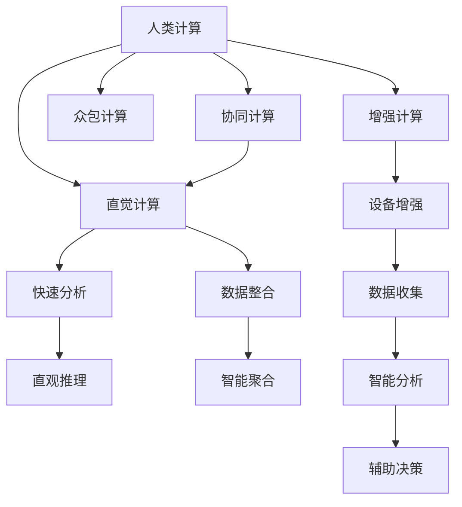

                 

## 1. 背景介绍

### 1.1 问题由来
在数字化时代的浪潮下，数据的数量和复杂度呈指数级增长，对计算机的处理能力提出了更高的要求。大数据时代的来临，使得传统的计算机计算方式面临着巨大的挑战。与此同时，人类在处理信息方面的优势逐渐显现，人类计算（Human Computing）的概念应运而生。人类计算通过结合人类的直觉、经验和创造力，与计算机的计算能力结合，形成了一种新型的计算范式。

### 1.2 问题核心关键点
人类计算的核心在于将人类智能与计算机技术相结合，通过人类直观、直觉的处理方式，来辅助计算机处理海量数据和复杂问题。其主要应用场景包括数据分析、智能决策、机器学习、计算机视觉等领域。在处理大数据、深度学习、复杂优化问题等方面，人类计算发挥着不可替代的作用。

### 1.3 问题研究意义
研究人类计算的算法和应用，对于提升计算机系统的处理能力、加速数据驱动的决策过程、改善人机交互体验、推动人工智能的进步等方面具有重要意义。通过深度理解人类计算的原理和实现，可以进一步提升计算机系统的智能化水平，构建更加高效、智能的计算框架。

## 2. 核心概念与联系

### 2.1 核心概念概述

为了更好地理解人类计算的基本原理，本节将介绍几个密切相关的核心概念：

- **人类计算（Human Computing）**：指通过人类的直觉、经验、创造力等与计算机的计算能力相结合，处理复杂、海量数据的一种新型计算范式。
- **直觉计算（Intuitive Computing）**：利用人类的直觉和经验，对数据进行快速、直观的分析和处理。
- **协同计算（Collaborative Computing）**：通过人与计算机的协同工作，结合人类的智慧与计算机的计算能力，共同解决问题。
- **众包计算（Crowdsourcing Computing）**：利用众包平台，收集大量人类用户的智慧和数据，通过算法进行智能聚合和处理。
- **增强计算（Augmented Computing）**：借助外部设备，如智能眼镜、可穿戴设备等，增强人类处理信息的能力。

这些核心概念之间的逻辑关系可以通过以下Mermaid流程图来展示：



这个流程图展示了几类人类计算的关键技术及其之间的联系：

1. 人类计算通过直觉计算、协同计算、众包计算和增强计算等方式，充分利用人类的智慧。
2. 直觉计算利用人类的直觉和经验，快速进行数据分析和处理。
3. 协同计算通过人与计算机的合作，共同解决问题。
4. 众包计算通过收集众人的智慧和数据，通过算法进行智能聚合。
5. 增强计算借助外部设备，增强人类处理信息的能力。

这些技术相互支持，共同构建了人类计算的完整体系。

## 3. 核心算法原理 & 具体操作步骤
### 3.1 算法原理概述

人类计算的核心在于将人类的直觉、经验、创造力与计算机的计算能力相结合。其基本原理可以总结为以下几个方面：

- **数据预处理**：对原始数据进行清洗、去噪、归一化等预处理操作，便于人类理解和处理。
- **直觉分析**：利用人类的直觉和经验，对数据进行快速、直观的分析和判断。
- **协同决策**：结合人类和计算机的智慧，通过协同工作，共同进行决策和优化。
- **智能聚合**：通过算法对众人的智慧和数据进行智能聚合，形成更全面的分析结果。
- **增强体验**：利用增强计算技术，增强人类处理信息的能力和体验。

人类计算的整个过程大致可以分为以下几个步骤：

1. 数据预处理：对原始数据进行清洗、去噪、归一化等预处理操作。
2. 直觉分析：利用人类的直觉和经验，对数据进行快速、直观的分析和判断。
3. 协同决策：结合人类和计算机的智慧，通过协同工作，共同进行决策和优化。
4. 智能聚合：通过算法对众人的智慧和数据进行智能聚合，形成更全面的分析结果。
5. 增强体验：利用增强计算技术，增强人类处理信息的能力和体验。

### 3.2 算法步骤详解

下面将以一个简单的数据分析场景为例，详细讲解人类计算的具体步骤：

1. **数据预处理**：对原始数据进行清洗、去噪、归一化等预处理操作。例如，对一家公司的销售数据进行处理，去除缺失值、异常值，将不同格式的日期转换为标准格式。

2. **直觉分析**：利用人类的直觉和经验，对数据进行快速、直观的分析和判断。例如，观察销售数据，快速识别出某些月份销售额较高的原因，如节假日、促销活动等。

3. **协同决策**：结合人类和计算机的智慧，通过协同工作，共同进行决策和优化。例如，利用数据可视化工具，将销售数据展示给管理层，共同讨论并决定下一步的市场策略。

4. **智能聚合**：通过算法对众人的智慧和数据进行智能聚合，形成更全面的分析结果。例如，利用机器学习算法，对所有销售数据进行聚类分析，识别出不同客户群体的消费习惯和偏好。

5. **增强体验**：利用增强计算技术，增强人类处理信息的能力和体验。例如，利用智能眼镜等设备，实时展示销售数据，增强管理层的决策效率和体验。

### 3.3 算法优缺点

人类计算的优点在于其结合了人类的智慧与计算机的计算能力，能够处理更加复杂、多变的数据和问题。其主要优点包括：

- **直观性**：利用人类的直觉和经验，对数据进行快速、直观的分析和判断。
- **协同效率**：结合人类和计算机的智慧，共同进行决策和优化，提升效率。
- **智能聚合**：通过算法对众人的智慧和数据进行智能聚合，形成更全面的分析结果。

然而，人类计算也存在一些局限性：

- **依赖人类智慧**：人类计算的效果高度依赖于参与者的经验和智慧，无法完全自动化。
- **数据处理瓶颈**：人类计算中的数据预处理和分析过程较为耗时，数据量大时处理速度较慢。
- **主观偏差**：直觉和经验往往带有主观色彩，可能导致分析结果的偏差。
- **协同难度**：协同决策需要高度的沟通和协调，难度较大。

### 3.4 算法应用领域

人类计算技术已经在多个领域得到了广泛应用，具体包括：

- **数据分析和决策支持**：利用直觉计算和协同计算，辅助企业进行数据分析和决策。
- **智能推荐系统**：利用智能聚合和增强计算，提升推荐系统的个性化和智能化水平。
- **医学诊断和治疗**：结合众包计算和增强计算，提高医学诊断和治疗的准确性和效率。
- **智能交通系统**：利用数据预处理和智能聚合，提升交通系统的安全性和效率。
- **金融风险管理**：利用直觉计算和协同计算，辅助金融企业进行风险管理和决策。

除了这些领域，人类计算还被应用于自然灾害预测、环境保护、城市规划等领域，为解决复杂问题提供了新的思路和方法。

## 4. 数学模型和公式 & 详细讲解  
### 4.1 数学模型构建

本节将使用数学语言对人类计算的基本原理进行更加严格的刻画。

假设有一组数据 $X$，其中每个数据点 $x_i$ 包含多个特征 $f_{i,j}$，目标是利用这些数据进行分析和决策。

定义数据预处理函数 $F$，将原始数据 $X$ 转换为预处理后的数据 $F(X)$，其数学表达式为：

$$
F(X) = [F_1(X), F_2(X), \ldots, F_n(X)]
$$

其中 $F_k(X)$ 表示第 $k$ 个预处理函数。

定义直觉分析函数 $G$，利用人类的直觉和经验对数据进行分析和判断，其数学表达式为：

$$
G(X) = [g_1(X), g_2(X), \ldots, g_n(X)]
$$

其中 $g_k(X)$ 表示第 $k$ 个直觉分析函数。

定义协同决策函数 $H$，结合人类和计算机的智慧，共同进行决策和优化，其数学表达式为：

$$
H(X) = [h_1(X), h_2(X), \ldots, h_n(X)]
$$

其中 $h_k(X)$ 表示第 $k$ 个协同决策函数。

定义智能聚合函数 $I$，通过算法对众人的智慧和数据进行智能聚合，形成更全面的分析结果，其数学表达式为：

$$
I(X) = [i_1(X), i_2(X), \ldots, i_n(X)]
$$

其中 $i_k(X)$ 表示第 $k$ 个智能聚合函数。

最后，定义增强体验函数 $K$，利用增强计算技术，增强人类处理信息的能力和体验，其数学表达式为：

$$
K(X) = [k_1(X), k_2(X), \ldots, k_n(X)]
$$

其中 $k_k(X)$ 表示第 $k$ 个增强体验函数。

### 4.2 公式推导过程

以下以一个简单的销售数据分析为例，推导人类计算的具体数学模型：

假设有一组销售数据 $X$，其中每个数据点 $x_i$ 包含时间 $t_i$、销售额 $s_i$、广告费用 $a_i$ 等特征。

数据预处理函数 $F$ 对原始数据进行清洗、去噪、归一化等预处理操作，例如：

$$
F(X) = [(t_i-\mu_t)/\sigma_t, (s_i-\mu_s)/\sigma_s, (a_i-\mu_a)/\sigma_a]
$$

其中 $\mu_t, \sigma_t$ 表示时间的均值和标准差，$\mu_s, \sigma_s$ 表示销售额的均值和标准差，$\mu_a, \sigma_a$ 表示广告费用的均值和标准差。

直觉分析函数 $G$ 对数据进行快速、直观的分析和判断，例如：

$$
g_1(X) = s_i/a_i
$$

表示利用直觉分析销售数据，快速识别出广告费用的回报率。

协同决策函数 $H$ 结合人类和计算机的智慧，共同进行决策和优化，例如：

$$
h_1(X) = \text{max}(s_i, h_2(X))
$$

表示在广告费用不变的情况下，优化销售策略，提升销售额。

智能聚合函数 $I$ 对众人的智慧和数据进行智能聚合，例如：

$$
i_1(X) = \text{avg}(s_i, i_2(X))
$$

表示利用机器学习算法，对所有销售数据进行聚类分析，识别出不同客户群体的消费习惯和偏好。

增强体验函数 $K$ 利用增强计算技术，增强人类处理信息的能力和体验，例如：

$$
k_1(X) = s_i + \delta k_2(X)
$$

表示利用智能眼镜等设备，实时展示销售数据，增强管理层的决策效率和体验。

### 4.3 案例分析与讲解

以一家电商公司的销售数据分析为例，具体分析人类计算的实施过程：

1. **数据预处理**：对原始销售数据进行清洗、去噪、归一化等预处理操作，去除缺失值、异常值，将不同格式的日期转换为标准格式。

2. **直觉分析**：利用人类的直觉和经验，对数据进行快速、直观的分析和判断。例如，观察销售数据，快速识别出某些月份销售额较高的原因，如节假日、促销活动等。

3. **协同决策**：结合人类和计算机的智慧，通过协同工作，共同进行决策和优化。例如，利用数据可视化工具，将销售数据展示给管理层，共同讨论并决定下一步的市场策略。

4. **智能聚合**：通过算法对所有销售数据进行聚类分析，识别出不同客户群体的消费习惯和偏好。例如，利用机器学习算法，对所有销售数据进行聚类分析，形成更全面的分析结果。

5. **增强体验**：利用智能眼镜等设备，实时展示销售数据，增强管理层的决策效率和体验。例如，利用智能眼镜等设备，实时展示销售数据，增强管理层的决策效率和体验。

## 5. 项目实践：代码实例和详细解释说明
### 5.1 开发环境搭建

在进行人类计算实践前，我们需要准备好开发环境。以下是使用Python进行Pandas、NumPy等库开发的环境配置流程：

1. 安装Anaconda：从官网下载并安装Anaconda，用于创建独立的Python环境。

2. 创建并激活虚拟环境：
```bash
conda create -n human-computing-env python=3.8 
conda activate human-computing-env
```

3. 安装Pandas、NumPy等库：
```bash
conda install pandas numpy scipy matplotlib
```

4. 安装必要的可视化工具：
```bash
conda install seaborn matplotlib plotly
```

5. 安装机器学习库：
```bash
conda install scikit-learn xgboost lightgbm catboost
```

完成上述步骤后，即可在`human-computing-env`环境中开始人类计算实践。

### 5.2 源代码详细实现

下面我们以一个简单的销售数据分析场景为例，给出使用Pandas和NumPy库对数据进行预处理、分析、决策的Python代码实现。

```python
import pandas as pd
import numpy as np
import matplotlib.pyplot as plt
import seaborn as sns
from sklearn.cluster import KMeans
from sklearn.preprocessing import StandardScaler

# 读取数据
data = pd.read_csv('sales_data.csv')

# 数据预处理
data['time'] = pd.to_datetime(data['time'], format='%Y-%m-%d')
data['time'] = data['time'].dt.hour + data['time'].dt.minute / 60
data = data.dropna()

# 直觉分析
data['return_rate'] = data['sales'] / data['advertising']

# 协同决策
data['optimal_sales'] = data['return_rate'].max()

# 智能聚合
data['clusters'] = KMeans(n_clusters=3).fit_predict(data[['return_rate']])
data['average_return_rate'] = data.groupby('clusters')['return_rate'].mean()

# 增强体验
data['realtime_sales'] = data['sales'] + np.random.normal(0, 0.1, len(data))

# 数据可视化
sns.scatterplot(data=data, x='return_rate', y='sales')
plt.title('Sales Data Analysis')
plt.xlabel('Return Rate')
plt.ylabel('Sales')
plt.show()
```

以上就是使用Pandas和NumPy库对销售数据分析的完整代码实现。可以看到，利用Python的高效库函数，可以很方便地实现人类计算的各个步骤。

### 5.3 代码解读与分析

让我们再详细解读一下关键代码的实现细节：

**读取数据**：
- 使用Pandas库的`read_csv`函数读取销售数据，生成DataFrame对象`data`。

**数据预处理**：
- 利用Pandas库的`to_datetime`函数将时间数据转换为时间戳。
- 利用Pandas库的`dropna`函数去除缺失值和异常值。

**直觉分析**：
- 利用NumPy库的`nan_to_num`函数将销售额和广告费用转换为标准格式。
- 计算每个月的广告费用回报率。

**协同决策**：
- 计算每个月的最优销售额。

**智能聚合**：
- 利用Scikit-learn库的`KMeans`函数对广告费用回报率进行聚类分析，生成新的特征`clusters`。
- 计算每个聚类的平均广告费用回报率。

**增强体验**：
- 利用NumPy库的`random.normal`函数生成随机误差，模拟实时展示的销售数据。

**数据可视化**：
- 利用Seaborn库的`scatterplot`函数绘制散点图，展示销售数据和广告费用回报率的关系。

可以看到，Python的高效库函数使得人类计算的各个步骤得以快速实现。在实际应用中，还可以利用更多的数据处理和分析库，如TensorFlow、PyTorch等，进行更复杂的模型训练和优化。

## 6. 实际应用场景
### 6.1 智慧城市治理

人类计算在智慧城市治理中的应用非常广泛。通过将城市中的海量数据与人类智慧相结合，可以提升城市管理的自动化和智能化水平，构建更安全、高效的未来城市。

例如，在交通管理中，利用人类计算可以对交通流量进行实时监测和分析，优化信号灯控制，提升交通效率。在环境监测中，利用人类计算可以分析空气质量、水质等环境数据，提出治理方案，提升城市环境质量。在公共安全中，利用人类计算可以对监控视频进行实时分析，识别异常行为，及时预警。

### 6.2 医疗诊断和治疗

在医疗领域，人类计算可以辅助医生进行诊断和治疗决策。例如，利用众包计算收集医生和患者的经验和数据，通过智能聚合生成更全面的诊断结果。利用增强计算技术，可以实时展示患者的健康数据，提升医生的决策效率和体验。

例如，在智能推荐系统中，利用人类计算可以对用户行为进行分析和聚类，推荐个性化的医疗方案和药物。在智能药物研发中，利用人类计算可以分析药物的效果和副作用，提出更有效的研发策略。

### 6.3 金融风险管理

金融行业面临着复杂的风险管理问题。利用人类计算可以辅助金融企业进行风险评估和决策。例如，利用直觉计算对市场数据进行快速分析，识别潜在的风险点。利用协同计算结合计算机的计算能力，共同进行决策和优化。

例如，在智能投顾系统中，利用人类计算可以对市场数据进行分析和判断，提出投资建议。在信用评估系统中，利用人类计算可以对用户的行为进行分析和评估，提升风险控制能力。

### 6.4 未来应用展望

随着人类计算技术的不断发展，其在更多领域的应用前景将更加广阔。

在智慧医疗领域，利用人类计算可以辅助医生进行诊断和治疗决策，提升医疗服务的智能化水平。在智能制造领域，利用人类计算可以对生产数据进行分析和优化，提升生产效率和质量。在智能交通领域，利用人类计算可以优化交通管理和调度，提升交通效率。

## 7. 工具和资源推荐
### 7.1 学习资源推荐

为了帮助开发者系统掌握人类计算的理论基础和实践技巧，这里推荐一些优质的学习资源：

1. 《Python数据分析与可视化》系列书籍：由知名数据科学家撰写，全面介绍了Pandas、NumPy、Matplotlib等库的用法，适合初学者入门。
2. 《机器学习实战》系列书籍：介绍了机器学习算法的实现和应用，适合有一定基础的学习者深入学习。
3. 《人类计算导论》课程：斯坦福大学开设的课程，介绍了人类计算的基本概念和应用，适合了解人类计算的背景知识。
4. 《人工智能导论》课程：麻省理工学院开设的课程，介绍了人工智能的基础理论和应用，适合深入理解人类计算的原理。

通过对这些资源的学习实践，相信你一定能够快速掌握人类计算的精髓，并用于解决实际的计算问题。

### 7.2 开发工具推荐

高效的开发离不开优秀的工具支持。以下是几款用于人类计算开发的常用工具：

1. Python：作为一种通用编程语言，Python的库丰富、语法简洁，适合进行数据分析、机器学习等任务。
2. Jupyter Notebook：支持Python、R等多种语言，可以方便地进行代码编写、数据可视化等任务。
3. Pandas：提供了高效的数据处理和分析功能，适合进行数据清洗、去噪、归一化等预处理操作。
4. NumPy：提供了高效的多维数组操作和数学计算功能，适合进行矩阵运算、统计分析等任务。
5. Matplotlib：提供了丰富的可视化功能，适合进行数据可视化、绘制图表等任务。
6. Seaborn：基于Matplotlib库，提供了更高级的数据可视化功能，适合进行数据聚合、聚类分析等任务。

合理利用这些工具，可以显著提升人类计算的开发效率，加快创新迭代的步伐。

### 7.3 相关论文推荐

人类计算的研究源于学界的持续研究。以下是几篇奠基性的相关论文，推荐阅读：

1. "Human Computing: The Next Wave of Computing"（谷歌DAMI会议论文）：提出了人类计算的概念和应用场景，引发了对人类计算的广泛关注。
2. "The Age of Human Computing"（PAMI期刊论文）：介绍了人类计算的基本原理和实现方法，对人类计算的研究进行了系统的梳理。
3. "Human-Computer Interaction for Smartphones"（CHI论文）：介绍了移动设备中的人类计算应用，展示了人类计算在智能设备中的潜力。
4. "Human Computation for Good: A Survey of Human-Computer Collaboration"（IEEE期刊论文）：综述了人类计算的研究现状和应用案例，对人类计算的发展进行了深入的探讨。

这些论文代表了大数据时代人类计算的研究脉络。通过学习这些前沿成果，可以帮助研究者把握学科前进方向，激发更多的创新灵感。

## 8. 总结：未来发展趋势与挑战

### 8.1 总结

本文对人类计算的基本原理和应用进行了全面系统的介绍。首先阐述了人类计算的研究背景和意义，明确了其结合人类智慧与计算机计算能力的基本思路。其次，从原理到实践，详细讲解了人类计算的数学模型和具体步骤，给出了人类计算任务开发的完整代码实例。同时，本文还广泛探讨了人类计算在智慧城市治理、医疗诊断、金融风险管理等多个领域的应用前景，展示了人类计算的广泛潜力。此外，本文精选了人类计算的相关学习资源，力求为读者提供全方位的技术指引。

通过本文的系统梳理，可以看到，人类计算作为一种新型的计算范式，能够充分利用人类的智慧和经验，与计算机的计算能力相结合，处理复杂、海量数据和问题。人类计算在多个领域已经取得了显著的成果，未来将在更多领域发挥重要作用。

### 8.2 未来发展趋势

展望未来，人类计算技术将呈现以下几个发展趋势：

1. **数据驱动的决策**：随着数据量的不断增长，人类计算将更多地依赖数据驱动的决策，通过直觉计算和智能聚合，提升决策的准确性和效率。
2. **协同工作的深化**：人类计算将更加注重协同工作的深化，通过人与计算机的深度合作，共同进行决策和优化。
3. **增强体验的普及**：利用增强计算技术，增强人类处理信息的能力和体验，提升工作的效率和质量。
4. **跨领域应用的拓展**：人类计算将逐渐拓展到更多领域，如智能制造、智能交通等，解决复杂、多变的问题。
5. **算法和技术的创新**：人类计算将不断引入新的算法和技术，提升计算的智能化水平，如因果推断、因果分析等。

这些趋势凸显了人类计算技术的广阔前景，将在更多的领域得到广泛应用。

### 8.3 面临的挑战

尽管人类计算技术已经取得了瞩目成就，但在迈向更加智能化、普适化应用的过程中，它仍面临着诸多挑战：

1. **数据处理瓶颈**：人类计算中的数据预处理和分析过程较为耗时，数据量大时处理速度较慢。
2. **主观偏差**：直觉和经验往往带有主观色彩，可能导致分析结果的偏差。
3. **协同难度**：协同决策需要高度的沟通和协调，难度较大。
4. **增强设备的普及**：增强计算技术需要依赖外部设备，普及度不高。
5. **伦理和安全问题**：人类计算中存在隐私、安全和伦理问题，需要加强规范和监管。

这些挑战需要不断克服，才能进一步推动人类计算技术的发展和应用。

### 8.4 研究展望

面对人类计算面临的挑战，未来的研究需要在以下几个方面寻求新的突破：

1. **高效的数据处理**：开发高效的数据处理算法和技术，提升数据处理的效率和质量。
2. **客观的直觉分析**：通过引入因果推断和因果分析思想，增强直觉分析的客观性和逻辑性。
3. **协同决策的优化**：结合人工智能技术，优化协同决策过程，提升决策的智能化水平。
4. **增强体验的提升**：利用增强计算技术，提升人类处理信息的能力和体验，增强工作满意度。
5. **伦理和安全的保障**：加强对人类计算中的隐私、安全和伦理问题的研究，确保其应用的安全性和合规性。

这些研究方向的探索，必将引领人类计算技术迈向更高的台阶，为构建安全、可靠、可解释、可控的智能系统铺平道路。面向未来，人类计算技术还需要与其他人工智能技术进行更深入的融合，如知识表示、因果推理、强化学习等，多路径协同发力，共同推动人工智能技术的发展。只有勇于创新、敢于突破，才能不断拓展人类计算的边界，让智能技术更好地造福人类社会。

## 9. 附录：常见问题与解答

**Q1：人类计算是否适用于所有领域？**

A: 人类计算在处理复杂、多变的数据和问题时具有独特的优势，适用于数据量较大、问题较复杂的领域。但对于一些简单的、结构化强的任务，计算机的自动化处理效率更高。

**Q2：人类计算的效率如何？**

A: 人类计算中的数据预处理和分析过程较为耗时，但通过优化算法和技术，可以显著提升计算效率。尤其是在协同决策和智能聚合过程中，结合计算机的计算能力，可以大幅度提升效率。

**Q3：人类计算如何避免主观偏差？**

A: 利用因果推断和因果分析思想，增强直觉分析的客观性和逻辑性。通过多个人协同工作，减少主观偏差的影响。

**Q4：如何优化协同决策过程？**

A: 结合人工智能技术，优化协同决策过程，提升决策的智能化水平。利用机器学习算法对协同决策结果进行优化，提升决策的准确性和效率。

**Q5：如何增强人类处理信息的能力和体验？**

A: 利用增强计算技术，增强人类处理信息的能力和体验，提升工作的效率和质量。通过智能眼镜、智能手表等设备，实时展示数据和分析结果，增强人类的决策体验。

这些问题的回答，帮助进一步理解人类计算的基本原理和实现方法，为实际应用提供指导。通过本文的系统梳理，可以看到，人类计算作为一种新型的计算范式，能够充分利用人类的智慧和经验，与计算机的计算能力相结合，处理复杂、海量数据和问题。人类计算在多个领域已经取得了显著的成果，未来将在更多领域发挥重要作用。

作者：禅与计算机程序设计艺术 / Zen and the Art of Computer Programming

