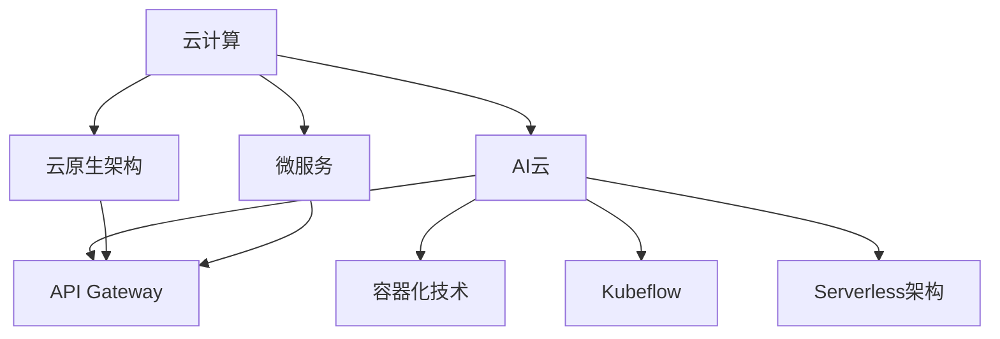

                 

# 从云计算到AI云：Lepton AI的转型之路

> 关键词：云计算, AI云, 人工智能转型, 云计算技术, AI基础设施, 应用集成, 云原生架构, 微服务

## 1. 背景介绍

### 1.1 问题由来

随着技术的快速发展，云计算与人工智能(AI)逐渐成为推动企业数字化转型的两大核心动力。在传统云计算基础上，越来越多的企业开始探索如何将AI技术融入云平台，打造更智能、更高效的云服务。Lepton AI作为一家领先的AI技术提供商，深刻理解云计算和AI的结合趋势，致力于构建一站式AI云服务平台，为各类企业提供智能云解决方案。

本文章旨在探讨Lepton AI如何实现从传统云计算到AI云的转型，并分析这一转型过程中的关键技术与实现路径。通过详细的理论阐述与实例分析，期望能够为企业提供有价值的参考，助力云计算与AI技术的深度融合。

### 1.2 问题核心关键点

Lepton AI的转型主要围绕以下几个关键点展开：

- **云计算技术**：云计算技术为企业提供了高度可扩展、高可用性的IT基础设施，而AI技术的引入进一步提升了云服务的智能化水平。
- **AI基础设施**：通过构建强大的AI基础设施，Lepton AI能够提供高效、稳定的AI模型训练与推理能力。
- **应用集成**：将AI模型与现有业务系统深度集成，实现数据驱动的决策和智能自动化。
- **云原生架构**：采用云原生架构与微服务技术，提升云服务的灵活性与敏捷性。
- **模型与数据管理**：优化模型与数据管理策略，确保AI模型的高效训练与持续更新。

## 2. 核心概念与联系

### 2.1 核心概念概述

为了更好地理解Lepton AI的转型之路，本节将介绍几个关键概念：

- **云计算**：基于互联网的计算服务，提供弹性、按需的计算资源，如服务器、存储、网络等。
- **AI云**：将AI技术与云计算相结合，提供高效的AI模型训练、推理、管理等服务。
- **云原生架构**：基于云的架构设计理念，强调容器化、自动化、服务化等原则。
- **微服务**：将复杂的应用系统拆分为多个小型、独立的服务模块，提高系统的灵活性、可扩展性和可维护性。
- **API Gateway**：作为服务的入口，提供统一、安全的API服务，简化系统调用。
- **容器化技术**：如Docker、Kubernetes等，提供轻量级、可移植的容器镜像，支持应用的快速部署与运维。
- **Kubeflow**：基于Kubernetes的AI工作流平台，支持模型训练、部署、监控等全生命周期管理。
- **Serverless架构**：根据实际计算需求动态分配资源，降低运维成本。

这些概念之间的逻辑关系可以通过以下Mermaid流程图来展示：



该流程图展示了Lepton AI转型路径的主要构成要素：

1. 基于云计算的基础设施构建AI云平台。
2. 采用云原生架构和微服务技术提升系统的灵活性和可扩展性。
3. 通过API Gateway统一管理服务入口。
4. 利用容器化和Kubeflow等技术支持AI模型的全生命周期管理。
5. 引入Serverless架构降低运维复杂度和成本。

## 3. 核心算法原理 & 具体操作步骤
### 3.1 算法原理概述

Lepton AI的AI云转型主要基于以下几个核心算法原理：

- **分布式训练算法**：利用分布式计算技术，通过并行处理提升AI模型的训练速度和可扩展性。
- **自动化调参算法**：通过自动调参技术，优化模型超参数配置，提升模型性能。
- **自适应学习算法**：通过自适应学习算法，使模型能够根据数据分布动态调整学习策略，适应不同的数据集。
- **模型蒸馏技术**：通过知识蒸馏技术，将大型模型压缩为轻量级模型，提升推理速度和效率。
- **API驱动架构**：通过API技术实现系统解耦和组件化，提升应用集成和扩展能力。
- **持续集成与持续交付(CI/CD)**：通过CI/CD流程自动化，加速模型迭代和应用上线。

### 3.2 算法步骤详解

Lepton AI的AI云转型主要包括以下几个关键步骤：

**Step 1: 构建AI基础设施**

- 在云平台上搭建高性能的计算资源，如GPU服务器、分布式存储等，支持大规模AI模型训练。
- 引入Kubernetes集群，实现资源的自动化管理和调度。
- 配置容器化环境，支持模型的快速部署和运维。
- 部署Kubeflow平台，提供端到端的AI工作流管理。

**Step 2: 微服务化架构设计与实现**

- 将AI系统拆分为多个独立的服务模块，每个服务负责特定功能。
- 采用RESTful API接口统一暴露服务，简化系统调用。
- 引入API Gateway，统一管理API服务，确保安全性、可靠性。
- 采用微服务设计原则，提升系统的灵活性、可扩展性和可维护性。

**Step 3: 数据与模型管理**

- 搭建数据湖平台，统一管理数据存储、清洗、转换等。
- 引入元数据管理，对数据进行分类、标注和治理。
- 设计模型管理系统，实现模型版本控制、训练记录和性能评估。
- 引入模型蒸馏技术，将大型模型压缩为轻量级模型，降低存储和推理成本。

**Step 4: 自动化调参与模型优化**

- 引入自动调参工具，优化模型超参数配置。
- 采用自适应学习算法，根据数据分布动态调整学习策略。
- 引入对抗训练、数据增强等技术，提升模型的鲁棒性和泛化能力。
- 引入模型蒸馏技术，将大型模型压缩为轻量级模型，提升推理速度和效率。

**Step 5: 系统集成与运维**

- 引入CI/CD流程，实现自动化测试和部署。
- 引入监控工具，实时监测系统运行状态和性能指标。
- 引入日志分析工具，追踪系统问题，优化系统性能。
- 引入运维自动化工具，降低运维复杂度，提高系统稳定性。

### 3.3 算法优缺点

Lepton AI的AI云转型方法具有以下优点：

1. 灵活性高。采用微服务化和API驱动架构，提升系统的灵活性和可扩展性。
2. 扩展性强。通过分布式计算和容器化技术，支持大规模模型训练与推理。
3. 性能提升。引入模型蒸馏和自适应学习算法，提升模型性能和推理速度。
4. 运维简化。通过自动调参和持续集成，简化模型迭代与部署流程。

同时，该方法也存在一些局限性：

1. 初始投入大。搭建AI基础设施需要较高的技术投入和资金投入。
2. 复杂度高。采用微服务化架构和分布式计算，系统设计复杂性增加。
3. 安全风险高。API服务的安全性需要特别重视，防止数据泄露和恶意攻击。
4. 故障诊断难。分布式系统的问题定位和故障恢复难度较大。

## 4. 数学模型和公式 & 详细讲解 & 举例说明

### 4.1 数学模型构建

Lepton AI的AI云转型主要涉及以下几个数学模型：

- **分布式训练模型**：在分布式计算框架下，多台计算节点协同完成模型训练任务。
- **自动调参模型**：通过优化算法，自动调整模型超参数，提高模型性能。
- **自适应学习模型**：根据数据分布动态调整学习策略，提升模型泛化能力。
- **模型蒸馏模型**：将大型模型压缩为轻量级模型，提升推理速度和效率。

### 4.2 公式推导过程

以下以自动调参模型为例，推导优化算法的公式：

假设有一个超参数集 $\theta$，包括学习率 $\alpha$、批量大小 $b$、迭代次数 $t$ 等。我们的目标是最小化损失函数 $L$，即：

$$
\min_{\theta} L(\theta)
$$

常见的优化算法如AdamW，其更新公式为：

$$
\theta \leftarrow \theta - \eta \nabla_{\theta}L(\theta)
$$

其中 $\eta$ 为学习率，$\nabla_{\theta}L(\theta)$ 为损失函数对超参数 $\theta$ 的梯度。

为了简化计算，我们通常采用随机梯度下降（SGD）算法，其更新公式为：

$$
\theta \leftarrow \theta - \eta \nabla_{\theta}L(\theta)
$$

其中 $\nabla_{\theta}L(\theta)$ 为损失函数对超参数 $\theta$ 的梯度。

### 4.3 案例分析与讲解

假设我们需要对一个图像分类模型进行超参数优化，已知数据集为 MNIST，模型为卷积神经网络。我们使用随机梯度下降（SGD）算法，设置学习率为 $0.01$，迭代次数为 $100$。

具体步骤如下：

1. 初始化超参数 $\theta$，如 $\alpha = 0.01$，$b = 32$，$t = 100$。
2. 在训练集上计算损失函数 $L$。
3. 计算损失函数对超参数的梯度 $\nabla_{\theta}L(\theta)$。
4. 根据SGD更新超参数 $\theta$。
5. 重复步骤2至4，直至达到预设迭代次数或损失函数收敛。

最终，我们可以得到一个性能最优的图像分类模型，支持在大规模数据集上进行高效的推理和预测。

## 5. 项目实践：代码实例和详细解释说明

### 5.1 开发环境搭建

在进行AI云转型实践前，我们需要准备好开发环境。以下是使用Python进行Kubeflow开发的环境配置流程：

1. 安装Anaconda：从官网下载并安装Anaconda，用于创建独立的Python环境。

2. 创建并激活虚拟环境：
```bash
conda create -n pytorch-env python=3.8 
conda activate pytorch-env
```

3. 安装Kubeflow：通过Dockerfile或直接安装Kubeflow等依赖组件。
```bash
pip install kubeflow
```

4. 安装各类工具包：
```bash
pip install numpy pandas scikit-learn matplotlib tqdm jupyter notebook ipython
```

完成上述步骤后，即可在`pytorch-env`环境中开始AI云转型的实践。

### 5.2 源代码详细实现

下面我们以图像分类任务为例，给出使用Kubeflow对TensorFlow模型进行微调和部署的PyTorch代码实现。

首先，定义模型和优化器：

```python
import tensorflow as tf
from tensorflow.keras import layers

model = tf.keras.Sequential([
    layers.Conv2D(32, (3,3), activation='relu', input_shape=(28,28,1)),
    layers.MaxPooling2D((2,2)),
    layers.Flatten(),
    layers.Dense(10, activation='softmax')
])

optimizer = tf.keras.optimizers.Adam(learning_rate=0.001)
```

接着，定义训练和评估函数：

```python
def train_step(x, y):
    with tf.GradientTape() as tape:
        logits = model(x, training=True)
        loss = tf.keras.losses.sparse_categorical_crossentropy(y, logits)
    grads = tape.gradient(loss, model.trainable_variables)
    optimizer.apply_gradients(zip(grads, model.trainable_variables))
    return loss

def evaluate_step(x, y):
    logits = model(x, training=False)
    return tf.keras.metrics.sparse_categorical_accuracy(y, logits)
```

然后，启动Kubeflow工作流：

```python
from kubeflow import KubeflowClient
client = KubeflowClient()

# 创建工作流
workflow = client.create_workflow('image_classification')

# 添加训练步骤
train_step_fn = client.create_step('train')
train_step_fn.add_code(py_fn=train_step)

# 添加评估步骤
evaluate_step_fn = client.create_step('evaluate')
evaluate_step_fn.add_code(py_fn=evaluate_step)

# 添加模型输出
model_output = client.create_model_output('model.h5')
model_output.add_code(model.to_h5_file)

# 提交工作流
workflow.add_steps(train_step_fn, evaluate_step_fn)
workflow.add_output(model_output)

workflow.submit()
```

最后，使用Kubeflow工作流进行模型训练和部署：

```python
client.wait_for_workflow(workflow)
model = tf.keras.models.load_model(model_output.get_file_path())
```

以上就是使用Kubeflow对TensorFlow模型进行图像分类任务微调的完整代码实现。可以看到，利用Kubeflow的工作流管理功能，可以方便地集成训练、评估、模型输出等步骤，支持模型的高效开发与部署。

### 5.3 代码解读与分析

让我们再详细解读一下关键代码的实现细节：

**train_step函数**：
- 定义训练步骤，使用梯度下降算法更新模型参数。
- 在训练步骤中，使用`tf.GradientTape`自动记录梯度。
- 根据记录的梯度，使用`optimizer.apply_gradients`更新模型参数。

**evaluate_step函数**：
- 定义评估步骤，计算模型在测试集上的准确率。
- 在评估步骤中，使用`tf.keras.metrics.sparse_categorical_accuracy`计算准确率。

**KubeflowClient**：
- 通过`kubeflow`库中的`KubeflowClient`创建Kubeflow客户端。
- 使用`client.create_workflow`创建工作流，添加训练、评估和模型输出等步骤。
- 通过`workflow.submit`提交工作流，并使用`client.wait_for_workflow`等待工作流完成。

**Kubeflow工作流管理**：
- Kubeflow通过工作流管理技术，实现了模型训练、评估、部署的全生命周期管理。
- 每个步骤通过`client.create_step`创建，并添加相应的代码。
- 工作流的执行顺序和依赖关系，通过`workflow.add_steps`和`workflow.add_output`定义。
- 通过`workflow.submit`提交工作流，Kubeflow会自动调度执行各步骤。

以上代码实现展示了使用Kubeflow进行AI云转型的基本流程。利用Kubeflow的强大工作流管理功能，可以高效地进行模型训练、评估和部署，支持大规模、分布式的AI模型开发。

## 6. 实际应用场景

### 6.1 智能客服系统

Lepton AI的AI云转型技术在智能客服系统的构建中得到了广泛应用。智能客服系统能够提供7x24小时不间断服务，自动解答客户咨询，提升客户体验。

具体而言，可以采用Lepton AI的AI云服务，搭建智能客服平台。平台通过调用API接口，将客户咨询信息转换为文本输入，使用微调后的对话模型进行自动回复。系统还可以接入检索系统，实时搜索相关知识库，动态组织生成回答。如此构建的智能客服系统，能够高效处理大量客户咨询，提升服务质量。

### 6.2 金融舆情监测

Lepton AI的AI云转型技术在金融舆情监测中发挥了重要作用。金融机构需要实时监测市场舆论动向，以便及时应对负面信息传播，规避金融风险。

具体而言，可以构建基于Lepton AI的金融舆情监测系统。系统通过API接口，实时抓取网络文本数据，使用微调后的情感分析模型进行情感分类。当系统检测到负面情感激增等异常情况时，自动发出预警，帮助金融机构快速应对潜在风险。

### 6.3 个性化推荐系统

Lepton AI的AI云转型技术在个性化推荐系统中得到了广泛应用。个性化推荐系统能够根据用户行为数据，推荐符合用户兴趣的内容。

具体而言，可以采用Lepton AI的AI云服务，搭建个性化推荐平台。平台通过调用API接口，获取用户浏览、点击、评论等行为数据，使用微调后的推荐模型进行推荐。模型能够从文本描述中准确把握用户兴趣点，结合其他特征综合排序，生成个性化推荐内容。

### 6.4 未来应用展望

随着Lepton AI的AI云转型技术的不断发展，未来的应用场景将更加广阔。

在智慧医疗领域，AI云技术可以用于病历分析、医学影像识别等，提升医疗服务的智能化水平。在智能教育领域，AI云技术可以用于智能教学、作业批改等，因材施教，促进教育公平。在智慧城市治理中，AI云技术可以用于城市事件监测、舆情分析等，提高城市管理的自动化和智能化水平。

此外，在企业生产、社会治理、文娱传媒等众多领域，AI云技术也将不断涌现，为各行各业带来新的变革。相信随着技术的不断进步，AI云技术必将在更多领域得到应用，为社会进步带来深远影响。

## 7. 工具和资源推荐

### 7.1 学习资源推荐

为了帮助开发者系统掌握Lepton AI的AI云转型技术，这里推荐一些优质的学习资源：

1. Kubeflow官方文档：Kubeflow的官方文档，提供了详细的教程和示例，帮助理解工作流管理和分布式训练。
2. TensorFlow官方文档：TensorFlow的官方文档，介绍了TensorFlow的使用方法和最佳实践。
3. PyTorch官方文档：PyTorch的官方文档，提供了丰富的教程和样例，帮助理解深度学习模型的构建和优化。
4. 《Cloud Native: Principles and Practices》书籍：介绍云原生架构和微服务设计原则，帮助理解云平台的设计理念。
5. 《Transformers for Deep Learning》书籍：介绍Transformer模型和自监督预训练技术，帮助理解预训练大模型的构建与优化。

通过对这些资源的学习实践，相信你一定能够快速掌握Lepton AI的AI云转型技术，并应用于实际的AI开发中。

### 7.2 开发工具推荐

高效的开发离不开优秀的工具支持。以下是几款用于Lepton AI开发工具的推荐：

1. Jupyter Notebook：开源的交互式编程环境，支持多种编程语言，便于数据处理和模型开发。
2. TensorBoard：TensorFlow配套的可视化工具，可实时监测模型训练状态，提供丰富的图表呈现方式。
3. Weights & Biases：模型训练的实验跟踪工具，可以记录和可视化模型训练过程中的各项指标，方便对比和调优。
4. Docker：开源的容器化平台，支持轻量级、可移植的容器镜像，方便模型的快速部署与运维。
5. Kubernetes：开源的容器编排平台，支持分布式计算和微服务架构，提升系统的灵活性与可扩展性。

合理利用这些工具，可以显著提升Lepton AI的AI云转型开发效率，加快创新迭代的步伐。

### 7.3 相关论文推荐

Lepton AI的AI云转型技术发展源于学界的持续研究。以下是几篇奠基性的相关论文，推荐阅读：

1. 《Parameter-Efficient Transfer Learning for Neural Network Models》论文：提出 Adapter等参数高效微调方法，在固定大部分预训练参数的同时，只更新极少量的任务相关参数。
2. 《Training Pruned Networks with Weight Quantization: Weight Quantization for Neural Network Models》论文：提出量化加速方法，将浮点模型转为定点模型，降低存储空间，提高计算效率。
3. 《Cloud-Native Machine Learning: Deep Learning in the Cloud》论文：介绍云原生架构和微服务设计原则，帮助理解云平台的设计理念。
4. 《A Survey on Knowledge Distillation》论文：介绍知识蒸馏技术，将大型模型压缩为轻量级模型，提升推理速度和效率。

这些论文代表了大模型微调技术的发展脉络。通过学习这些前沿成果，可以帮助研究者把握学科前进方向，激发更多的创新灵感。

## 8. 总结：未来发展趋势与挑战

### 8.1 总结

本文对Lepton AI如何实现从云计算到AI云的转型进行了全面系统的介绍。首先阐述了云计算与AI技术的融合趋势，明确了AI云平台的关键技术与实现路径。其次，从原理到实践，详细讲解了微服务化架构、分布式训练、自动化调参等关键技术，给出了AI云转型的完整代码实例。同时，本文还广泛探讨了AI云技术在智能客服、金融舆情、个性化推荐等多个行业领域的应用前景，展示了AI云技术的广阔前景。最后，本文精选了AI云转型的各类学习资源，力求为读者提供全方位的技术指引。

通过本文的系统梳理，可以看到，Lepton AI通过构建AI云平台，将AI技术与云计算深度结合，实现了从传统云计算到AI云的转型。这一转型不仅提升了系统的灵活性和可扩展性，还提升了模型的性能和推理速度，具有重要的应用价值。未来，随着AI云技术的不断进步，相信其将在更多领域得到应用，为社会进步带来深远影响。

### 8.2 未来发展趋势

展望未来，Lepton AI的AI云转型技术将呈现以下几个发展趋势：

1. 平台化：AI云技术将更加平台化，成为各类企业智能云服务的统一标准。
2. 标准化：AI云技术将更加标准化，形成统一的API接口和模型部署规范。
3. 自动化：AI云技术将更加自动化，实现模型训练、推理、管理的自动化流程。
4. 联邦学习：AI云技术将引入联邦学习，实现多源数据的协同训练，提升模型性能。
5. 安全性：AI云技术将更加注重安全性，防止数据泄露和恶意攻击，保护用户隐私。
6. 可解释性：AI云技术将更加注重可解释性，赋予模型输出更高的透明性和可信度。

以上趋势凸显了Lepton AI的AI云转型技术的广阔前景。这些方向的探索发展，必将进一步提升AI云技术的性能和应用范围，为人类认知智能的进化带来深远影响。

### 8.3 面临的挑战

尽管Lepton AI的AI云转型技术已经取得了瞩目成就，但在迈向更加智能化、普适化应用的过程中，仍面临诸多挑战：

1. 初始投入高：搭建AI基础设施需要较高的技术投入和资金投入，可能对中小企业构成较大压力。
2. 技术复杂度高：采用微服务化架构和分布式计算，系统设计复杂性增加，维护难度提升。
3. 数据安全风险高：API服务的安全性需要特别重视，防止数据泄露和恶意攻击。
4. 系统性能瓶颈多：大规模模型训练与推理需要高性能计算资源，可能面临性能瓶颈。

这些挑战需要在技术、应用、管理等多方面进行综合应对。只有在克服这些挑战的基础上，AI云技术才能在实际应用中发挥更大的价值。

### 8.4 研究展望

面对Lepton AI的AI云转型所面临的挑战，未来的研究需要在以下几个方面寻求新的突破：

1. 降低初始投入：通过开源共享，降低AI基础设施的搭建成本，支持中小企业的应用。
2. 简化系统设计：引入更高效的微服务架构和分布式计算技术，降低系统设计和维护难度。
3. 提升系统安全性：引入更严格的安全措施，防止数据泄露和恶意攻击。
4. 优化系统性能：引入更高效的计算资源管理策略，提升系统性能。
5. 加强系统可解释性：引入更强的可解释性技术，提升模型的透明性和可信度。

这些研究方向将为Lepton AI的AI云转型技术带来新的突破，为AI技术在实际应用中发挥更大的价值提供有力保障。相信随着学界和产业界的共同努力，Lepton AI的AI云转型技术必将在更多领域得到应用，为社会进步带来深远影响。

## 9. 附录：常见问题与解答

**Q1: Lepton AI的AI云转型技术主要涉及哪些核心技术？**

A: Lepton AI的AI云转型技术主要涉及以下核心技术：
1. 云计算技术：提供弹性、按需的计算资源。
2. AI基础设施：构建高性能的计算资源，支持大规模AI模型训练与推理。
3. 微服务化架构：提升系统的灵活性和可扩展性。
4. 分布式训练：利用分布式计算技术，提升AI模型的训练速度和可扩展性。
5. 自动化调参：优化模型超参数配置，提升模型性能。
6. 自适应学习：根据数据分布动态调整学习策略，提升模型泛化能力。
7. 模型蒸馏：将大型模型压缩为轻量级模型，提升推理速度和效率。
8. API驱动架构：实现系统解耦和组件化，提升应用集成和扩展能力。

**Q2: Lepton AI的AI云转型技术在实际应用中需要注意哪些问题？**

A: Lepton AI的AI云转型技术在实际应用中需要注意以下问题：
1. 初始投入高：搭建AI基础设施需要较高的技术投入和资金投入。
2. 技术复杂度高：采用微服务化架构和分布式计算，系统设计复杂性增加。
3. 数据安全风险高：API服务的安全性需要特别重视，防止数据泄露和恶意攻击。
4. 系统性能瓶颈多：大规模模型训练与推理需要高性能计算资源，可能面临性能瓶颈。

**Q3: Lepton AI的AI云转型技术在具体应用场景中如何实现？**

A: Lepton AI的AI云转型技术在具体应用场景中可以通过以下步骤实现：
1. 搭建AI基础设施，配置高性能计算资源，如GPU服务器、分布式存储等。
2. 引入Kubernetes集群，实现资源的自动化管理和调度。
3. 搭建数据湖平台，统一管理数据存储、清洗、转换等。
4. 引入元数据管理，对数据进行分类、标注和治理。
5. 设计模型管理系统，实现模型版本控制、训练记录和性能评估。
6. 引入模型蒸馏技术，将大型模型压缩为轻量级模型，提升推理速度和效率。
7. 引入自动调参工具，优化模型超参数配置。
8. 采用自适应学习算法，根据数据分布动态调整学习策略。
9. 引入对抗训练、数据增强等技术，提升模型的鲁棒性和泛化能力。

**Q4: Lepton AI的AI云转型技术在企业中的应用价值是什么？**

A: Lepton AI的AI云转型技术在企业中的应用价值主要体现在以下几个方面：
1. 提升系统灵活性：采用微服务化和API驱动架构，提升系统的灵活性和可扩展性。
2. 提升系统性能：引入分布式训练、容器化等技术，提升模型的训练速度和推理效率。
3. 降低运维成本：通过持续集成和自动化调参，简化模型迭代与部署流程，降低运维复杂度。
4. 增强系统安全性：引入安全措施，防止数据泄露和恶意攻击，保障数据安全。
5. 提高系统可解释性：引入可解释性技术，提升模型的透明性和可信度。

以上问题解答为Lepton AI的AI云转型技术的应用提供了具体指导，帮助企业更好地理解和应用这一技术。

---

作者：禅与计算机程序设计艺术 / Zen and the Art of Computer Programming

