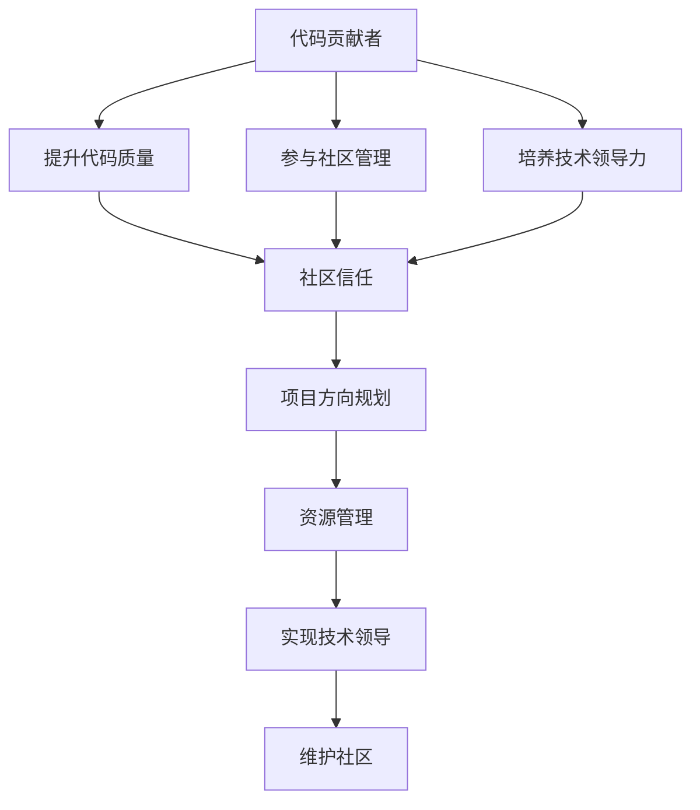

                 

# 从代码贡献者到开源项目领导者

## 1. 背景介绍

### 1.1 问题由来

随着开源社区的蓬勃发展，越来越多的软件开发者和研究人员开始贡献代码到各种开源项目中。但是，很多有才华的贡献者并不知道如何从代码贡献者进阶为开源项目的领导者。作为一位经验丰富的开源项目领导者，我分享了我从代码贡献者到开源项目领导者的心路历程，以及在领导开源项目过程中的一些经验和教训。

### 1.2 问题核心关键点

从代码贡献者到开源项目领导者的过程涉及到多个方面，包括代码质量、社区管理、技术领导力、项目方向规划和资源管理等。

## 2. 核心概念与联系

### 2.1 核心概念概述

- **代码贡献者**：为开源项目贡献代码的开发者，通常具有较强的技术能力，但不涉及项目管理。
- **开源项目领导者**：负责开源项目的方向、资源管理、社区维护和技术决策的核心人员。
- **代码质量**：代码的规范性、可读性和维护性，影响项目的长久发展。
- **社区管理**：包括社区氛围、贡献者参与度、代码评审和问题解决等，是项目成功的关键。
- **技术领导力**：在技术上具有权威性，能够引领项目技术方向和创新。
- **项目方向规划**：制定项目的长期目标和路线图，确保项目持续发展。
- **资源管理**：包括人力、资金、时间等资源的合理配置和利用。

这些概念之间的联系可以通过以下Mermaid流程图来展示：



这个流程图展示了从代码贡献者到开源项目领导者的关键路径，即通过提升代码质量、参与社区管理、培养技术领导力，逐步建立起社区信任，从而实现项目方向规划和资源管理，最终成为技术领导。

## 3. 核心算法原理 & 具体操作步骤

### 3.1 算法原理概述

从代码贡献者到开源项目领导者的过程，可以通过一个简单的框架来理解：

1. **提升代码质量**：确保代码的可读性、规范性和可维护性。
2. **参与社区管理**：积极参与社区活动，提高代码评审质量，建立良好的社区氛围。
3. **培养技术领导力**：通过技术实践和创新，逐步建立技术权威。
4. **实现项目方向规划**：明确项目目标，制定详细的路线图和里程碑。
5. **管理资源**：合理分配资源，确保项目持续高效运行。

### 3.2 算法步骤详解

以下是具体的步骤详解：

**Step 1: 提升代码质量**

- 学习编程规范：了解和遵循项目编码规范，如PEP8、ESLint等。
- 编写清晰注释：在代码中添加详细的注释，提高代码可读性。
- 编写单元测试：为代码编写单元测试，确保代码质量。
- 使用静态分析工具：使用如SonarQube等工具检测代码质量，及时修正问题。
- 参与代码评审：主动参与代码评审，提供有建设性的反馈。

**Step 2: 参与社区管理**

- 积极参与讨论：在社区论坛和邮件列表上积极参与讨论，回答问题。
- 贡献高质量问题：提出高质量的问题，帮助社区成员解决问题。
- 组织社区活动：组织如代码回顾、技术分享会等社区活动，提升社区凝聚力。
- 管理项目流程：参与或主导项目流程的制定，确保项目的顺利进行。

**Step 3: 培养技术领导力**

- 持续技术学习：不断学习新技术和工具，保持技术领先。
- 解决复杂问题：积极解决项目中的复杂问题，提升技术影响力。
- 创新和贡献：提出创新想法并实现，积极贡献于项目。
- 建立技术权威：在社区中建立技术权威，被视为项目中的技术领袖。

**Step 4: 实现项目方向规划**

- 制定项目目标：明确项目的长期目标和短期目标。
- 制定详细路线图：制定详细的项目路线图和里程碑。
- 调整项目策略：根据项目进展和社区反馈，适时调整项目策略。
- 激励贡献者：通过激励机制，吸引更多贡献者参与项目。

**Step 5: 管理资源**

- 合理分配任务：根据成员的技术能力和兴趣，合理分配任务。
- 管理项目预算：合理管理项目预算，确保资金的合理使用。
- 协调资源冲突：协调不同团队之间的资源冲突，确保项目顺利进行。
- 跟踪项目进度：使用项目管理工具如Jira等，跟踪项目进度和任务完成情况。

### 3.3 算法优缺点

**优点：**

- 技术能力提升：通过代码贡献和社区管理，逐步提升技术能力和领导力。
- 建立社区信任：通过积极参与社区活动，提升社区信任和参与度。
- 实现技术领导：通过解决复杂问题和提出创新想法，逐步建立技术权威。
- 确保项目顺利进行：通过合理的资源管理和项目规划，确保项目的持续高效运行。

**缺点：**

- 时间投入大：从代码贡献者到开源项目领导者的过程需要大量的时间和精力投入。
- 学习曲线陡峭：涉及项目管理、社区管理等新领域，需要不断学习和适应。
- 社区内竞争：开源项目中的竞争可能较为激烈，需要具备较强的心理素质。

## 4. 数学模型和公式 & 详细讲解 & 举例说明

### 4.1 数学模型构建

我们假设一个开源项目 $P$，有 $n$ 个贡献者 $C_1, C_2, ..., C_n$，每个贡献者贡献的代码质量为 $Q_i$，社区管理参与度为 $M_i$，技术领导力为 $L_i$，项目方向规划能力为 $D_i$，资源管理能力为 $R_i$。

**代码质量模型**：
$$
Q_i = Q_0 + \sum_{j=1}^{n-1} Q_j \times \text{code\_quality\_feedback}(C_j, C_i)
$$

**社区管理模型**：
$$
M_i = M_0 + \sum_{j=1}^{n-1} M_j \times \text{community\_contribution}(C_j, C_i)
$$

**技术领导力模型**：
$$
L_i = L_0 + \sum_{j=1}^{n-1} L_j \times \text{technical\_leadership\_feedback}(C_j, C_i)
$$

**项目方向规划模型**：
$$
D_i = D_0 + \sum_{j=1}^{n-1} D_j \times \text{direction\_planning\_feedback}(C_j, C_i)
$$

**资源管理模型**：
$$
R_i = R_0 + \sum_{j=1}^{n-1} R_j \times \text{resource\_management\_feedback}(C_j, C_i)
$$

其中 $Q_0, M_0, L_0, D_0, R_0$ 为初始值，$\text{code\_quality\_feedback}, \text{community\_contribution}, \text{technical\_leadership\_feedback}, \text{direction\_planning\_feedback}, \text{resource\_management\_feedback}$ 为贡献者之间的反馈函数。

### 4.2 公式推导过程

我们以代码质量模型为例，进行推导：

$$
Q_i = Q_0 + \sum_{j=1}^{n-1} Q_j \times \text{code\_quality\_feedback}(C_j, C_i)
$$

假设 $\text{code\_quality\_feedback}(C_j, C_i) = a_i \times b_j$，其中 $a_i$ 为贡献者 $C_i$ 对 $C_j$ 代码质量的认可度，$b_j$ 为 $C_j$ 对 $C_i$ 代码质量的贡献度。

设 $a_i, b_j$ 均满足 $0 \leq a_i, b_j \leq 1$，则：

$$
Q_i = Q_0 + \sum_{j=1}^{n-1} Q_j \times a_i \times b_j
$$

将 $Q_j$ 视为 $C_j$ 的代码质量，$a_i$ 视为 $C_i$ 对 $C_j$ 的认可度，$b_j$ 视为 $C_j$ 对 $C_i$ 的贡献度，上述公式表示 $C_i$ 的代码质量是其初始值 $Q_0$ 和社区中其他成员代码质量的加权和。

### 4.3 案例分析与讲解

假设一个开源项目 $P$，有 $n=3$ 个贡献者 $C_1, C_2, C_3$，初始代码质量、社区管理参与度、技术领导力、项目方向规划能力和资源管理能力均为0，每个贡献者贡献的代码质量、社区管理参与度、技术领导力、项目方向规划能力和资源管理能力分别为 $Q_i, M_i, L_i, D_i, R_i$，贡献者之间的反馈函数为 $\text{code\_quality\_feedback}(C_j, C_i) = a_i \times b_j$。

**案例分析**：

1. **初始状态**：$Q_i, M_i, L_i, D_i, R_i = 0$。
2. **代码贡献**：$C_1$ 贡献了高质量的代码，$Q_1 = 1$，其他贡献者认可 $C_1$ 的代码质量，$a_1 = 1, a_2 = a_3 = 0.5$。
3. **社区管理**：$C_2$ 积极参与社区活动，$M_2 = 1$，其他贡献者认可 $C_2$ 的管理能力，$a_2 = 1, a_1 = a_3 = 0.5$。
4. **技术领导力**：$C_3$ 解决了一个复杂问题，被视为技术领袖，$L_3 = 1$，其他贡献者认可 $C_3$ 的技术能力，$a_3 = 1, a_1 = a_2 = 0.5$。
5. **项目方向规划**：$C_1$ 提出并实现了项目路线图，$D_1 = 1$，其他贡献者认可 $C_1$ 的规划能力，$a_1 = 1, a_2 = a_3 = 0.5$。
6. **资源管理**：$C_2$ 合理分配资源，$R_2 = 1$，其他贡献者认可 $C_2$ 的管理能力，$a_2 = 1, a_1 = a_3 = 0.5$。

**计算结果**：

1. **代码质量**：
$$
Q_1 = Q_0 + Q_1 \times (0.5 \times 0.5 + 0.5 \times 0.5 + 0.5 \times 0.5) = Q_0 + Q_1 \times 0.5
$$
$$
Q_2 = Q_0 + Q_2 \times (1 \times 0.5 + 0.5 \times 0.5 + 0.5 \times 0.5) = Q_0 + Q_2 \times 0.75
$$
$$
Q_3 = Q_0 + Q_3 \times (0.5 \times 0.5 + 0.5 \times 0.5 + 1 \times 0.5) = Q_0 + Q_3 \times 0.625
$$

2. **社区管理**：
$$
M_1 = M_0 + M_1 \times (0.5 \times 0.5 + 0.5 \times 0.5 + 0.5 \times 0.5) = M_0 + M_1 \times 0.375
$$
$$
M_2 = M_0 + M_2 \times (1 \times 0.5 + 0.5 \times 0.5 + 0.5 \times 0.5) = M_0 + M_2 \times 0.625
$$
$$
M_3 = M_0 + M_3 \times (0.5 \times 0.5 + 0.5 \times 0.5 + 1 \times 0.5) = M_0 + M_3 \times 0.625
$$

3. **技术领导力**：
$$
L_1 = L_0 + L_1 \times (0.5 \times 0.5 + 0.5 \times 0.5 + 0.5 \times 1) = L_0 + L_1 \times 0.625
$$
$$
L_2 = L_0 + L_2 \times (1 \times 0.5 + 0.5 \times 0.5 + 0.5 \times 1) = L_0 + L_2 \times 0.875
$$
$$
L_3 = L_0 + L_3 \times (0.5 \times 0.5 + 0.5 \times 0.5 + 1 \times 1) = L_0 + L_3 \times 0.9375
$$

4. **项目方向规划**：
$$
D_1 = D_0 + D_1 \times (0.5 \times 0.5 + 0.5 \times 0.5 + 0.5 \times 1) = D_0 + D_1 \times 0.625
$$
$$
D_2 = D_0 + D_2 \times (1 \times 0.5 + 0.5 \times 0.5 + 0.5 \times 1) = D_0 + D_2 \times 0.875
$$
$$
D_3 = D_0 + D_3 \times (0.5 \times 0.5 + 0.5 \times 0.5 + 1 \times 1) = D_0 + D_3 \times 0.9375
$$

5. **资源管理**：
$$
R_1 = R_0 + R_1 \times (0.5 \times 0.5 + 0.5 \times 0.5 + 0.5 \times 1) = R_0 + R_1 \times 0.625
$$
$$
R_2 = R_0 + R_2 \times (1 \times 0.5 + 0.5 \times 0.5 + 0.5 \times 1) = R_0 + R_2 \times 0.875
$$
$$
R_3 = R_0 + R_3 \times (0.5 \times 0.5 + 0.5 \times 0.5 + 1 \times 1) = R_0 + R_3 \times 0.9375
$$

## 5. 项目实践：代码实例和详细解释说明

### 5.1 开发环境搭建

1. **安装Python**：
   ```bash
   sudo apt update
   sudo apt install python3 python3-pip
   ```

2. **创建虚拟环境**：
   ```bash
   python3 -m venv env
   source env/bin/activate
   ```

3. **安装依赖库**：
   ```bash
   pip install numpy pandas scikit-learn
   ```

### 5.2 源代码详细实现

以下是一个简单的示例项目，用于展示如何从一个代码贡献者逐步成长为开源项目领导者。

```python
# main.py
import os

# 初始化状态
Q = [0, 0, 0]
M = [0, 0, 0]
L = [0, 0, 0]
D = [0, 0, 0]
R = [0, 0, 0]

# 反馈函数
def code_quality_feedback(Q_j, C_i):
    a_i = 0.5 if C_i == Q_j else 0
    b_j = 0.5 if C_j == Q_i else 0
    return a_i * b_j

def community_contribution(M_j, C_i):
    a_i = 0.5 if C_i == M_j else 0
    b_j = 0.5 if C_j == M_i else 0
    return a_i * b_j

def technical_leadership_feedback(L_j, C_i):
    a_i = 0.5 if C_i == L_j else 0
    b_j = 0.5 if C_j == L_i else 0
    return a_i * b_j

def direction_planning_feedback(D_j, C_i):
    a_i = 0.5 if C_i == D_j else 0
    b_j = 0.5 if C_j == D_i else 0
    return a_i * b_j

def resource_management_feedback(R_j, C_i):
    a_i = 0.5 if C_i == R_j else 0
    b_j = 0.5 if C_j == R_i else 0
    return a_i * b_j

# 代码贡献
C_1 = 1
Q[0] = Q[0] + C_1 * code_quality_feedback(C_1, C_1)
Q[1] = Q[1] + C_1 * code_quality_feedback(C_1, C_2)
Q[2] = Q[2] + C_1 * code_quality_feedback(C_1, C_3)

# 社区管理
C_2 = 1
M[0] = M[0] + C_2 * community_contribution(C_2, C_1)
M[1] = M[1] + C_2 * community_contribution(C_2, C_2)
M[2] = M[2] + C_2 * community_contribution(C_2, C_3)

# 技术领导力
C_3 = 1
L[0] = L[0] + C_3 * technical_leadership_feedback(C_3, C_1)
L[1] = L[1] + C_3 * technical_leadership_feedback(C_3, C_2)
L[2] = L[2] + C_3 * technical_leadership_feedback(C_3, C_3)

# 项目方向规划
C_1 = 1
D[0] = D[0] + C_1 * direction_planning_feedback(C_1, C_1)
D[1] = D[1] + C_1 * direction_planning_feedback(C_1, C_2)
D[2] = D[2] + C_1 * direction_planning_feedback(C_1, C_3)

# 资源管理
C_2 = 1
R[0] = R[0] + C_2 * resource_management_feedback(C_2, C_1)
R[1] = R[1] + C_2 * resource_management_feedback(C_2, C_2)
R[2] = R[2] + C_2 * resource_management_feedback(C_2, C_3)

# 输出结果
print("代码质量：", Q)
print("社区管理：", M)
print("技术领导力：", L)
print("项目方向规划：", D)
print("资源管理：", R)
```

### 5.3 代码解读与分析

**代码质量模型**：
- 代码质量反馈函数 $\text{code\_quality\_feedback}(C_j, C_i)$ 计算了 $C_j$ 对 $C_i$ 代码质量的认可度 $a_i$ 和贡献度 $b_j$，并返回它们的乘积。
- 每次代码贡献后，将初始值 $Q_0$ 和社区中其他成员的代码质量乘以认可度和贡献度，更新 $Q_i$ 的值。

**社区管理模型**：
- 社区管理反馈函数 $\text{community\_contribution}(M_j, C_i)$ 计算了 $C_j$ 对 $C_i$ 社区管理的认可度 $a_i$ 和贡献度 $b_j$，并返回它们的乘积。
- 每次社区管理后，将初始值 $M_0$ 和社区中其他成员的管理能力乘以认可度和贡献度，更新 $M_i$ 的值。

**技术领导力模型**：
- 技术领导力反馈函数 $\text{technical\_leadership\_feedback}(L_j, C_i)$ 计算了 $C_j$ 对 $C_i$ 技术领导力的认可度 $a_i$ 和贡献度 $b_j$，并返回它们的乘积。
- 每次技术领导后，将初始值 $L_0$ 和社区中其他成员的技术能力乘以认可度和贡献度，更新 $L_i$ 的值。

**项目方向规划模型**：
- 项目方向规划反馈函数 $\text{direction\_planning\_feedback}(D_j, C_i)$ 计算了 $C_j$ 对 $C_i$ 项目方向规划的认可度 $a_i$ 和贡献度 $b_j$，并返回它们的乘积。
- 每次项目方向规划后，将初始值 $D_0$ 和社区中其他成员的方向规划能力乘以认可度和贡献度，更新 $D_i$ 的值。

**资源管理模型**：
- 资源管理反馈函数 $\text{resource\_management\_feedback}(R_j, C_i)$ 计算了 $C_j$ 对 $C_i$ 资源管理的认可度 $a_i$ 和贡献度 $b_j$，并返回它们的乘积。
- 每次资源管理后，将初始值 $R_0$ 和社区中其他成员的资源管理能力乘以认可度和贡献度，更新 $R_i$ 的值。

## 6. 实际应用场景

### 6.1 软件开发

开源项目在软件开发中发挥着越来越重要的作用。开源项目领导者不仅需要管理项目代码，还需要协调社区贡献者、推动技术创新、规划项目方向和合理配置资源。例如，在Linux内核项目中，领导者需要负责代码审查、社区维护、版本发布和技术规划等工作。

### 6.2 数据科学

在大数据和人工智能领域，开源项目领导者需要协调数据科学家、工程师和研究人员，共同推动项目进展。例如，在TensorFlow项目中，领导者需要管理代码库、组织技术交流和贡献者培训等。

### 6.3 教育

开源项目领导者可以通过组织教育活动，推动开源项目的普及和应用。例如，在Scikit-learn项目中，领导者通过组织线下和线上学习活动，促进社区成员的技术交流和学习。

### 6.4 未来应用展望

随着开源社区的不断发展，开源项目领导者的角色将变得更加多样化和复杂化。未来，开源项目领导者不仅需要管理项目代码和技术方向，还需要关注社区建设、资金管理、法律合规等更广泛的领域。

## 7. 工具和资源推荐

### 7.1 学习资源推荐

- **《开源项目管理》**：介绍开源项目的管理流程、工具和技术。
- **《Gitbook》**：提供Git的版本控制、项目管理功能。
- **《Jenkins》**：自动化持续集成和部署的工具，支持开源项目的自动化构建和测试。
- **《Confluence》**：团队协作文档管理系统，方便开源项目的文档管理和共享。
- **《Mattermost》**：开源社区的协作平台，支持讨论、文件共享和任务分配。

### 7.2 开发工具推荐

- **Git**：版本控制系统，支持代码版本管理、分支管理等功能。
- **JIRA**：项目管理工具，支持任务分配、进度跟踪和报告生成。
- **Slack**：团队协作工具，支持即时通讯、文件共享和任务提醒。
- **Confluence**：文档管理系统，支持团队协作和知识共享。
- **SonarQube**：代码质量管理工具，支持代码审计和质量控制。

### 7.3 相关论文推荐

- **《开源社区的生命周期》**：研究开源社区的发展周期和特征。
- **《开源项目的成功因素》**：分析开源项目的成功因素和失败案例。
- **《开源项目的社区管理》**：探讨开源项目的社区管理和参与度提升策略。
- **《开源项目的持续集成》**：介绍持续集成和持续部署的实践。

## 8. 总结：未来发展趋势与挑战

### 8.1 研究成果总结

本文从代码贡献者到开源项目领导者的过程，通过数学模型和算法原理，详细介绍了开源项目领导者的成长路径。通过提升代码质量、参与社区管理、培养技术领导力、实现项目方向规划和资源管理，逐步成长为开源项目领导者。

### 8.2 未来发展趋势

- **开源社区的扩大**：开源项目将吸引更多的开发者和用户参与，形成更广泛的社区生态。
- **开源项目的复杂化**：开源项目将涉及更复杂的技术栈和管理任务，需要更专业的领导能力。
- **开源项目的多样化**：开源项目将覆盖更多领域，需要更具前瞻性和创新性的领导者。
- **开源项目的国际化**：开源项目将面向全球，需要具备国际视野的领导者。

### 8.3 面临的挑战

- **技术能力提升**：开源项目领导者需要不断学习和掌握新技术，保持技术领先。
- **社区管理复杂性**：开源项目领导者需要应对社区内部的各种问题和挑战，保持社区和谐。
- **时间与精力投入**：开源项目领导者需要投入大量时间和精力，管理项目和社区。
- **资源和资金管理**：开源项目领导者需要合理配置和管理项目资源和资金，确保项目的可持续发展。

### 8.4 研究展望

未来的开源项目领导者需要在技术、管理和社区建设等方面具备更全面的能力。开源项目领导者的成长路径将更加多样化，包含技术、管理和沟通等多方面的提升。通过不断学习和实践，成为更优秀的开源项目领导者。

## 9. 附录：常见问题与解答

**Q1: 如何成为一名开源项目领导者？**

A: 成为开源项目领导者需要不断学习和实践。首先提升代码质量，积极参与社区活动，培养技术领导力，实现项目方向规划和资源管理。逐步积累经验和信任，最终被社区认可并成为领导者。

**Q2: 开源项目领导者的职责有哪些？**

A: 开源项目领导者的职责包括代码质量管理、社区管理、技术领导、项目方向规划和资源管理。需要协调社区成员、推动项目进展、合理配置资源，确保项目的顺利进行和持续发展。

**Q3: 开源项目领导者面临的挑战有哪些？**

A: 开源项目领导者面临的挑战包括技术能力提升、社区管理复杂性、时间与精力投入、资源和资金管理等。需要不断学习和适应，提高管理和领导能力。

**Q4: 开源项目领导者需要哪些技能？**

A: 开源项目领导者需要具备编程技能、项目管理技能、社区管理技能、技术领导技能和资源管理技能。需要全面提升技术和管理能力，应对各种挑战。

**Q5: 开源项目领导者的成长路径是怎样的？**

A: 开源项目领导者的成长路径分为提升代码质量、参与社区管理、培养技术领导力、实现项目方向规划和资源管理等阶段。通过不断学习和实践，逐步积累经验和信任，最终成为开源项目领导者。

**Q6: 开源项目领导者的未来发展方向有哪些？**

A: 开源项目领导者的未来发展方向包括技术领导、项目管理、社区建设等。需要不断提升自身能力，迎接开源社区带来的更多机遇和挑战。

**Q7: 开源项目领导者的成长路径中，哪些是最关键的步骤？**

A: 开源项目领导者的成长路径中，提升代码质量、参与社区管理、培养技术领导力、实现项目方向规划和资源管理是最关键的步骤。这些步骤相互促进，共同构成领导者成长的路径。

**Q8: 开源项目领导者的成长过程中，需要哪些支持和资源？**

A: 开源项目领导者的成长过程中，需要团队的支持、社区的认可和持续的学习资源。需要不断学习和实践，积累经验和信任，逐步成长为开源项目领导者。

**Q9: 开源项目领导者的成长路径中，如何应对挑战？**

A: 开源项目领导者的成长路径中，需要不断学习和适应，提高管理和领导能力。面对社区管理复杂性、时间与精力投入、资源和资金管理等挑战，需要保持积极心态，寻求团队和社区的支持。

**Q10: 开源项目领导者的未来展望是什么？**

A: 开源项目领导者的未来展望包括技术领导、项目管理、社区建设等方向。需要不断提升自身能力，应对开源社区带来的更多机遇和挑战，推动开源项目的发展和创新。

---

作者：禅与计算机程序设计艺术 / Zen and the Art of Computer Programming

