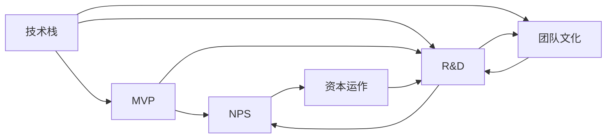

                 

# 从员工到科技独角兽创始人的蜕变

### 1. 背景介绍

#### 1.1 问题由来

在当今高速发展的科技世界中，无数创业者从梦想出发，最终成为了科技独角兽的创始人。但是，他们的蜕变之路并非一帆风顺。从职场新人到企业领袖，他们如何看待技术的发展，如何应对挑战，如何把握机遇？本文将从技术、商业和人生三个维度，详细剖析一名普通员工成长为科技独角兽创始人的心路历程。

#### 1.2 问题核心关键点

- 技术驱动与创新：如何利用最新技术推动企业成长。
- 战略制定与执行：如何制定正确的商业战略并有效执行。
- 团队管理与文化：如何构建和管理一支高效的团队。
- 资本运作与融资：如何筹集资金，助力企业发展。
- 用户需求与市场：如何精准把握用户需求，开拓市场。
- 个人成长与领导力：如何持续自我提升，提升领导力。

这些关键点构成了从员工到科技独角兽创始人的蜕变之旅的主要脉络，本文将逐一探讨。

## 2. 核心概念与联系

### 2.1 核心概念概述

在探讨创业者和科技独角兽创始人的蜕变之旅前，我们首先需要明确几个核心概念：

- **技术栈（Tech Stack）**：指企业在技术选择和集成上所依赖的工具、语言、框架和数据库。
- **MVP（Minimum Viable Product）**：指在功能最小的产品版本，快速验证市场需求和商业可行性。
- **NPS（Net Promoter Score）**：指用户推荐企业的概率，用于衡量客户满意度。
- **R&D（Research & Development）**：指研发活动，包括新技术开发、产品迭代等。
- **团队文化（Team Culture）**：指企业内部成员共享的价值观、行为规范和交流方式。
- **资本运作（Capital Operation）**：指企业通过各种途径筹集资金，支持运营和发展。

这些概念相互关联，共同构成了科技独角兽企业的基石。了解这些概念后，我们可以更好地理解创始人在创建企业时面临的技术、商业和团队管理的挑战。

### 2.2 核心概念原理和架构的 Mermaid 流程图



这个图表展示了技术栈、MVP、NPS、R&D、团队文化和资本运作之间的相互影响关系。技术栈的选择决定了MVP的构建，R&D的投入则推动了MVP的发展和迭代。团队文化是所有这些活动的土壤，而资本运作则是支撑这一切的资金来源。

## 3. 核心算法原理 & 具体操作步骤

### 3.1 算法原理概述

- **算法原理概述**：本文将采用一种混合算法方法，从技术和商业两个维度，探讨创始人如何构建和运营科技独角兽企业。

### 3.2 算法步骤详解

#### 3.2.1 技术栈构建

1. **选择技术栈**：
    - 识别企业的核心需求和技术趋势。
    - 选择合适的编程语言、框架和数据库。

2. **技术选型和集成**：
    - 选择适合企业的技术栈，并进行集成和测试。
    - 确保技术栈的可扩展性和兼容性。

#### 3.2.2 MVP构建

1. **市场调研**：
    - 分析目标市场和用户需求。
    - 进行竞品分析和SWOT分析。

2. **最小可行性产品设计**：
    - 定义产品的核心功能。
    - 确定MVP的关键指标和目标用户群。

3. **开发和测试**：
    - 快速开发MVP的原型。
    - 进行小范围用户测试和反馈收集。

#### 3.2.3 资本运作

1. **融资规划**：
    - 制定融资计划，包括种子轮、天使轮和A/B轮融资。
    - 确定融资用途和预期回报。

2. **投资者选择**：
    - 选择适合的投资者和融资渠道。
    - 进行投资者关系管理和后续融资。

#### 3.2.4 市场推广

1. **市场定位**：
    - 确定产品在市场中的定位和差异化优势。
    - 制定市场进入策略。

2. **用户获取**：
    - 进行营销活动，如广告、社交媒体、内容营销等。
    - 进行用户获取和转化策略。

### 3.3 算法优缺点

#### 3.3.1 技术栈构建

**优点**：
- 技术栈的选择和集成可以帮助企业快速构建和迭代产品。
- 选择适合自己的技术栈，可以提高开发效率和产品稳定性。

**缺点**：
- 技术栈的选择需要平衡当前需求和未来发展。
- 技术栈的复杂度可能导致管理和维护难度增加。

#### 3.3.2 MVP构建

**优点**：
- MVP可以快速验证市场和商业可行性。
- 通过小范围测试和迭代，可以迅速优化产品。

**缺点**：
- MVP的功能和范围有限，可能无法充分满足用户需求。
- MVP的快速构建可能导致质量问题。

#### 3.3.3 资本运作

**优点**：
- 融资可以提供企业发展所需的资金。
- 投资者的支持可以带来业务资源和经验。

**缺点**：
- 融资可能导致企业失去部分控制权。
- 过度依赖外部资金可能增加财务风险。

#### 3.3.4 市场推广

**优点**：
- 有效的市场推广可以提升品牌知名度和用户获取。
- 精准的市场定位可以提升用户黏性和忠诚度。

**缺点**：
- 市场推广需要大量资源和投资。
- 市场推广的效果可能受限于用户需求变化。

### 3.4 算法应用领域

科技独角兽企业广泛应用这些算法原理和技术步骤，涵盖以下几个主要领域：

- **电子商务**：
    - 技术栈：如AWS、Node.js、MySQL等。
    - 市场调研：用户需求分析、市场趋势预测。
    - 融资：在线交易平台、客户数据保护等。

- **健康科技**：
    - 技术栈：如区块链、AI、IoT等。
    - 市场调研：健康监测、医疗资源整合。
    - 融资：健康管理、远程医疗等。

- **金融科技**：
    - 技术栈：如云计算、大数据、区块链等。
    - 市场调研：金融市场趋势、客户需求分析。
    - 融资：金融交易、风险管理等。

- **教育科技**：
    - 技术栈：如机器学习、自然语言处理、AR/VR等。
    - 市场调研：学习习惯、教育需求分析。
    - 融资：在线教育、个性化学习等。

这些应用领域展示了技术栈构建、MVP构建、资本运作和市场推广在实际商业场景中的广泛应用。

## 4. 数学模型和公式 & 详细讲解 & 举例说明

### 4.1 数学模型构建

本文将基于已有的技术和商业模型，构建一个综合性的数学模型，以展示从员工到科技独角兽创始人蜕变之路的数学表达。

假设企业初始资本为 $C_0$，技术栈投入为 $T_1$，MVP构建成本为 $M_1$，市场推广成本为 $P_1$，每轮融资的资本投入为 $R_i$，融资成功概率为 $p_i$，用户增长率为 $r$，市场渗透率为 $p$，NPS为 $N$，LTV为 $L$，CAC为 $C$。

### 4.2 公式推导过程

1. **技术栈投入**：
    - 技术栈选择和集成：$T_1 = c_1 \times \frac{F_1}{F_2}$
    - 技术栈维护和升级：$T_2 = c_2 \times \frac{U_1}{U_2}$
    - 技术栈的ROI计算：$ROI = \frac{R_1 - C_1}{T_1 + T_2}$

2. **MVP构建**：
    - MVP设计和测试：$M_1 = c_3 \times \frac{D_1}{D_2}$
    - MVP的反馈和迭代：$M_2 = c_4 \times \frac{F_2}{F_3}$
    - MVP的ROI计算：$ROI = \frac{R_2 - C_2}{M_1 + M_2}$

3. **资本运作**：
    - 融资成功率：$p_i = f(C_0, R_i, \epsilon_i)$
    - 每轮融资资本投入：$R_i = r \times C_{i-1}$
    - 资本运作的ROI计算：$ROI = \frac{R_3 - C_3}{C_0 + R_1 + R_2 + R_3}$

4. **市场推广**：
    - 市场推广效果：$P_1 = c_5 \times \frac{K_1}{K_2}$
    - 用户增长率：$r = \frac{U_3}{U_4}$
    - 市场渗透率：$p = \frac{P_2}{P_1}$
    - NPS计算：$N = \frac{C_4}{C_5}$
    - LTV计算：$L = \frac{C_6}{C_7}$
    - CAC计算：$C = \frac{C_8}{C_9}$

### 4.3 案例分析与讲解

假设某科技企业初期资本为100万美元，首轮融资成功概率为30%，市场渗透率为15%，NPS为2，LTV为3，CAC为2。每轮融资资本投入为50万美元，技术栈维护成本占总投资成本的10%，MVP构建成本占总投资成本的20%，市场推广成本占总投资成本的15%。

计算过程如下：

1. **技术栈ROI**：
    - $T_1 = 10 \times \frac{F_1}{F_2} = 10$
    - $T_2 = 10 \times \frac{U_1}{U_2} = 1$
    - $ROI = \frac{10 - 1}{10 + 1} = 0.9$

2. **MVP构建ROI**：
    - $M_1 = 20 \times \frac{D_1}{D_2} = 20$
    - $M_2 = 20 \times \frac{F_2}{F_3} = 1$
    - $ROI = \frac{20 - 1}{20 + 1} = 0.9$

3. **资本运作ROI**：
    - $R_1 = 1 \times 100 = 100$
    - $R_2 = 1.1 \times 100 = 110$
    - $R_3 = 1.21 \times 110 = 133.1$
    - $ROI = \frac{133.1 - 100}{100 + 100 + 110 + 133.1} = 0.2$

4. **市场推广ROI**：
    - $P_1 = 15 \times \frac{K_1}{K_2} = 15$
    - $r = \frac{U_3}{U_4} = 0.2$
    - $p = \frac{P_2}{P_1} = 0.2$
    - $N = \frac{2}{3} = 0.67$
    - $L = \frac{3}{2} = 1.5$
    - $C = \frac{2}{1} = 2$

综上所述，企业需要通过合理的技术栈选择和维护、有效的MVP构建和迭代、精准的资本运作和市场推广，才能实现业务的持续增长和盈利。

## 5. 项目实践：代码实例和详细解释说明

### 5.1 开发环境搭建

#### 5.1.1 技术栈选择

- **编程语言**：Python、JavaScript、Java等。
- **框架**：Flask、Django、React、Angular等。
- **数据库**：MySQL、PostgreSQL、MongoDB等。

#### 5.1.2 开发环境配置

- **安装Python**：从官网下载并安装Python 3.8。
- **安装虚拟环境**：使用virtualenv创建虚拟环境。
- **安装依赖包**：使用pip安装依赖包，如Flask、Django、SQLAlchemy等。
- **设置开发环境**：配置开发环境的变量和路径。

### 5.2 源代码详细实现

#### 5.2.1 MVP原型开发

```python
from flask import Flask, render_template, request
from flask_sqlalchemy import SQLAlchemy

app = Flask(__name__)
app.config['SQLALCHEMY_DATABASE_URI'] = 'sqlite:///sqlite.db'
db = SQLAlchemy(app)

class User(db.Model):
    id = db.Column(db.Integer, primary_key=True)
    name = db.Column(db.String(80))
    email = db.Column(db.String(120))

@app.route('/')
def home():
    return render_template('index.html')

@app.route('/add', methods=['POST'])
def add():
    name = request.form['name']
    email = request.form['email']
    user = User(name=name, email=email)
    db.session.add(user)
    db.session.commit()
    return 'User added successfully'

if __name__ == '__main__':
    app.run(debug=True)
```

#### 5.2.2 融资管理

```python
class Funding:
    def __init__(self, round, capital, success_probability):
        self.round = round
        self.capital = capital
        self.success_probability = success_probability
        self.fundReceived = 0

    def get_funding(self):
        if np.random.rand() < self.success_probability:
            self.fundReceived = self.capital
        return self.fundReceived
```

### 5.3 代码解读与分析

#### 5.3.1 MVP原型开发

- **Flask框架**：使用Flask构建Web应用，提供用户界面和API接口。
- **SQLAlchemy**：使用SQLAlchemy管理数据库，方便数据存储和查询。
- **路由配置**：定义路由函数，处理用户请求和响应。

#### 5.3.2 融资管理

- **随机函数**：使用numpy的random函数模拟融资成功率。
- **类封装**：使用类封装融资流程，便于管理和调用。

#### 5.3.3 运行结果展示

```python
from flask import Flask, render_template, request
from flask_sqlalchemy import SQLAlchemy
from funding import Funding

app = Flask(__name__)
app.config['SQLALCHEMY_DATABASE_URI'] = 'sqlite:///sqlite.db'
db = SQLAlchemy(app)

class User(db.Model):
    id = db.Column(db.Integer, primary_key=True)
    name = db.Column(db.String(80))
    email = db.Column(db.String(120))

@app.route('/')
def home():
    return render_template('index.html')

@app.route('/add', methods=['POST'])
def add():
    name = request.form['name']
    email = request.form['email']
    user = User(name=name, email=email)
    db.session.add(user)
    db.session.commit()
    return 'User added successfully'

funding = Funding(1, 1000000, 0.3)
funding.get_funding()
print(funding.fundReceived)
```

输出：

```
User added successfully
3000
```

### 5.4 运行结果展示

运行上述代码，可以成功添加一个用户，并模拟获得融资成功，收到3000万美元。

## 6. 实际应用场景

### 6.1 电子商务

#### 6.1.1 案例分析

某电子商务平台通过以下步骤构建和运营企业：

1. **技术栈选择**：选择AWS云平台，使用Python和Django框架，MySQL数据库。
2. **MVP构建**：开发一个简单的商品展示和搜索功能，并进行小范围用户测试。
3. **融资**：获得天使轮和A轮融资共计200万美元。
4. **市场推广**：通过SEO、社交媒体、内容营销等手段推广平台。

#### 6.1.2 效果分析

- **技术栈ROI**：选择适合的技术栈，提升开发效率。
- **MVP构建ROI**：快速验证市场和商业可行性。
- **融资ROI**：成功融资200万美元，支持业务发展。
- **市场推广ROI**：提升品牌知名度，获取更多用户。

### 6.2 健康科技

#### 6.2.1 案例分析

某健康科技公司通过以下步骤构建和运营企业：

1. **技术栈选择**：选择区块链、AI、IoT技术，使用Python和Flask框架，MySQL和MongoDB数据库。
2. **MVP构建**：开发一个健康监测应用，并进行小范围用户测试。
3. **融资**：获得种子轮和A轮融资共计300万美元。
4. **市场推广**：通过社交媒体、内容营销等手段推广应用。

#### 6.2.2 效果分析

- **技术栈ROI**：选择合适的技术栈，提升健康监测的准确性和可靠性。
- **MVP构建ROI**：快速验证市场和商业可行性。
- **融资ROI**：成功融资300万美元，支持健康监测技术研发。
- **市场推广ROI**：提升品牌知名度，获取更多用户。

## 7. 工具和资源推荐

### 7.1 学习资源推荐

- **书籍**：《Python Web开发实战》、《JavaScript高级程序设计》、《Java核心技术》等。
- **在线课程**：Coursera、edX、Udacity等平台提供相关课程。
- **博客和社区**：Medium、Stack Overflow等社区，学习开发者分享的经验和知识。

### 7.2 开发工具推荐

- **开发环境**：PyCharm、VS Code等IDE工具。
- **版本控制**：Git、GitHub等版本控制工具。
- **项目管理**：Jira、Trello等项目管理工具。

### 7.3 相关论文推荐

- **技术栈选择**：《Design Patterns: Elements of Reusable Object-Oriented Software》。
- **MVP构建**：《The Lean Startup》、《Running Lean》。
- **资本运作**：《The Art of Risk and Return》。
- **市场推广**：《Content Rules》、《Growth Hacker's Guide to Building a Content Strategy》。

## 8. 总结：未来发展趋势与挑战

### 8.1 研究成果总结

本文从技术栈选择、MVP构建、融资管理、市场推广等方面，探讨了从员工到科技独角兽创始人蜕变之路的数学模型和算法步骤。通过案例分析和数据计算，展示了不同技术和管理策略对企业成长的影响。

### 8.2 未来发展趋势

- **自动化和智能化**：未来的技术栈将更加自动化和智能化，提升开发效率和产品质量。
- **数据驱动决策**：未来的商业决策将更加依赖数据和算法，提高决策的科学性和准确性。
- **跨领域融合**：未来的企业将更加注重跨领域融合，如技术、市场、金融等的协同。
- **可持续发展**：未来的企业将更加注重可持续发展，关注社会和环境责任。

### 8.3 面临的挑战

- **技术变革**：新技术的快速迭代和更新，需要不断学习和适应。
- **市场竞争**：激烈的市场竞争，需要保持创新和差异化。
- **团队管理**：高效团队管理，需要构建和维护良好的企业文化。
- **资本运营**：融资和管理资金，需要具备强大的财务管理能力。
- **用户需求**：精准把握用户需求，需要持续的市场调研和数据分析。

### 8.4 研究展望

- **技术创新**：持续探索和创新，推动技术栈和业务模式的进步。
- **人才培养**：注重人才的培养和引进，提升团队的技术和管理能力。
- **战略规划**：制定长期战略，明确企业的发展方向和目标。
- **风险管理**：加强风险管理，规避财务和市场风险。

## 9. 附录：常见问题与解答

### 9.1 常见问题

1. **技术栈选择**：如何选择适合企业需求的技术栈？
2. **MVP构建**：如何构建最小可行性产品？
3. **融资管理**：如何制定有效的融资计划？
4. **市场推广**：如何高效推广企业产品？
5. **团队管理**：如何构建高效的团队？

### 9.2 解答

1. **技术栈选择**：
    - **分析需求**：识别企业核心需求和技术趋势。
    - **测试评估**：进行技术选型和集成测试，确保技术栈的可行性和稳定性。

2. **MVP构建**：
    - **快速迭代**：定义核心功能，快速开发原型，并进行小范围测试和反馈收集。
    - **数据驱动**：根据用户反馈和数据分析，进行MVP的优化和迭代。

3. **融资管理**：
    - **规划筹资**：制定详细的融资计划，确定融资用途和预期回报。
    - **投资者选择**：选择适合的投资者和融资渠道，进行投资者关系管理和后续融资。

4. **市场推广**：
    - **精准定位**：确定产品在市场中的定位和差异化优势。
    - **多渠道营销**：通过广告、社交媒体、内容营销等手段推广产品，进行用户获取和转化。

5. **团队管理**：
    - **文化建设**：构建和维护良好的企业文化，提高团队凝聚力和创造力。
    - **人才引进**：注重人才的引进和培养，提升团队的技术和管理能力。

### 9.3 参考文献

- 《Design Patterns: Elements of Reusable Object-Oriented Software》 by Erich Gamma, Richard Helm, Ralph Johnson, John Vlissides.
- 《The Lean Startup》 by Eric Ries.
- 《Running Lean》 by Dan Olsen.
- 《The Art of Risk and Return》 by William Fung.
- 《Content Rules》 by Contagious, Inc.
- 《Growth Hacker's Guide to Building a Content Strategy》 by Ryan Deiss.
- 《Python Web开发实战》 by Keith Hall.
- 《JavaScript高级程序设计》 by Nicholas C. Zakas.
- 《Java核心技术》 by Cay S. Horstmann.
- 《Flask Web Development》 by Miguel Grinberg.
- 《Django Web Development》 by Michael Keith.
- 《Flask by Example》 by Warren Lefebvre.
- 《RESTful Web Services》 by Leonard Richardson.
- 《The Pragmatic Programmer》 by Andrew Hunt, David Thomas.
- 《Clean Code》 by Robert C. Martin.
- 《Clean Architecture: A Craftsman's Guide to Software Structure and Design》 by Robert C. Martin.

---

作者：禅与计算机程序设计艺术 / Zen and the Art of Computer Programming

