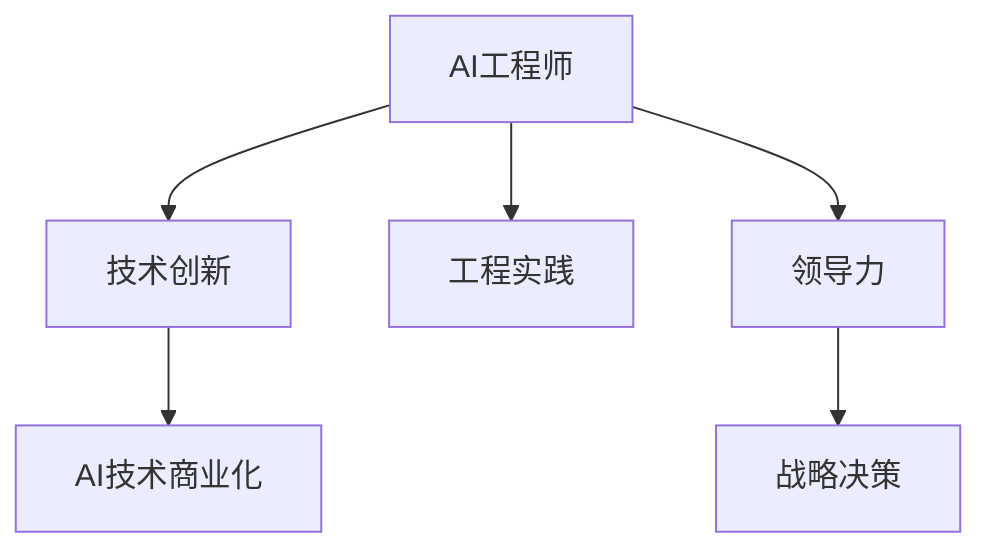

                 

## 1. 背景介绍

贾扬清，作为一位享誉全球的AI专家，他在技术创新和工程实践中都有着卓越的表现。从一名普通的工程师到成为科技公司的CEO，他经历了怎样的一次华丽转身？本文将带您深入探讨他的角色转变及其背后的动因和挑战。

### 1.1 问题由来

贾扬清，1980年出生于中国北京，毕业于中国科学技术大学和北京大学，获得博士学位。早期，他在美国麻省理工学院（MIT）从事AI研究，主要聚焦于计算机视觉和机器学习。2009年，他加入谷歌公司，成为TensorFlow的首席工程师，负责机器学习算法的开发和优化。在谷歌的8年时间里，贾扬清积累了大规模工业级AI应用的宝贵经验，并逐步成长为AI领域的领军人物。2017年，他加入Facebook，负责AI产品团队，致力于将AI技术应用到社交媒体、虚拟现实等多个领域。2020年，贾扬清离职并创立了Giant Technology，公司致力于开发前沿AI技术，赋能各行各业。

### 1.2 问题核心关键点

贾扬清的角色转变主要涉及技术创新、工程实践、领导力和战略决策四个方面。从一名工程师到CEO，他需要从技术专家转变为战略决策者，从研究者转变为领导者，从具体的技术问题转变为面向市场的整体策略。他的转变不仅是个人职业发展的飞跃，更是AI技术在商业化落地中的重要转折。

## 2. 核心概念与联系

### 2.1 核心概念概述

为更好地理解贾扬清的角色转变，我们需首先了解几个核心概念：

1. **AI工程师**：专注于算法和模型开发的工程师，以技术创新为主，工作重点是解决具体的技术问题。
2. **领导力**：指带领团队，制定战略，协调资源，推动项目进展的能力。
3. **战略决策**：面向市场和未来，根据企业目标和环境变化，制定长远的发展规划和策略。
4. **AI技术商业化**：将AI技术转化为实际商业应用的过程，涉及产品设计、市场需求分析、商业模式构建等环节。

这些核心概念通过以下Mermaid流程图展示其联系：



**流程图解释**：
- **A** 为AI工程师，通过技术创新和工程实践（B和C）来推动AI技术的发展。
- **D** 为领导力，是技术应用到市场前的桥梁，通过团队协作和资源调配（C到E）实现战略决策（E）。
- **F** 为AI技术商业化，是将技术转化为实际商业应用的核心过程，涉及产品设计和市场需求分析。

### 2.2 核心概念原理和架构

- **技术创新**：AI工程师需要不断探索前沿技术，解决具体问题，提升模型性能和应用效果。例如，贾扬清在TensorFlow中引入的分布式训练框架，极大提升了深度学习模型的训练速度和扩展性。
- **工程实践**：将创新技术转化为实际产品，关注模型效率、易用性和用户体验。例如，TensorFlow的可扩展性和易用性，使得AI技术在各个行业得以广泛应用。
- **领导力**：作为团队的领导者，需要协调资源、管理团队，制定战略和执行计划。例如，贾扬清在Facebook期间，带领团队开发了多个AI产品，如虚拟现实和社交媒体中的推荐系统。
- **战略决策**：从长远视角考虑AI技术的商业化应用，确定技术应用的市场定位和发展方向。例如，创立Giant Technology，聚焦于AI技术的深度应用和产业升级。

这些概念共同构成了贾扬清从工程师到CEO的角色转变基础，展示了他如何在技术和业务之间架起桥梁，推动AI技术的商业化进程。

## 3. 核心算法原理 & 具体操作步骤

### 3.1 算法原理概述

贾扬清在AI领域的技术积累，使其具备了将前沿技术商业化的独特视角。他不仅专注于技术本身，还关注如何将技术融入实际商业场景，实现其价值最大化。

### 3.2 算法步骤详解

1. **识别市场需求**：通过市场调研和用户反馈，明确AI技术在各行业的应用场景和痛点。例如，在社交媒体中，用户对推荐系统的准确性和个性化需求较高。
2. **技术适配与创新**：根据市场需求，调整和创新AI技术，以满足实际应用的需求。例如，改进推荐算法的准确性，提高用户体验。
3. **产品设计和推广**：设计用户友好的产品界面，并制定市场推广策略，推动产品上线。例如，通过数据驱动的个性化推荐，提升用户粘性和满意度。
4. **用户体验优化**：持续收集用户反馈，不断优化产品功能，提升用户体验。例如，根据用户反馈调整推荐算法，提高系统性能和鲁棒性。
5. **商业模式构建**：确定产品定价和盈利模式，制定长期发展策略。例如，通过广告和数据服务，实现多渠道盈利。

### 3.3 算法优缺点

**优点**：
- 技术背景强，能够快速识别和解决技术难题。
- 具备市场洞察力，能够根据市场需求进行创新。
- 能够协调团队资源，高效推动项目进展。

**缺点**：
- 管理经验不足，需要不断学习和积累。
- 市场变化快速，需要具备快速应变的能力。
- 技术商业化复杂，涉及多方面的协调和合作。

### 3.4 算法应用领域

贾扬清的角色转变涉及多个领域，主要集中在以下几个方面：

- **AI产品开发**：在Facebook期间，他带领团队开发了多个AI产品，如虚拟现实中的AI语音助手、社交媒体中的推荐系统等。
- **技术开源与生态建设**：作为TensorFlow的首席工程师，他推动了TensorFlow的开源和生态建设，促进了全球AI技术的发展。
- **AI创业**：创立Giant Technology，聚焦于AI技术的深度应用和产业升级，推动AI技术的商业化落地。

## 4. 数学模型和公式 & 详细讲解 & 举例说明

### 4.1 数学模型构建

贾扬清在AI技术商业化过程中，涉及的数学模型包括：

- **推荐系统**：如协同过滤、内容过滤、基于深度学习的推荐算法等。
- **图像识别**：如卷积神经网络（CNN）、生成对抗网络（GAN）等。
- **自然语言处理**：如循环神经网络（RNN）、Transformer等。

### 4.2 公式推导过程

以推荐系统为例，推荐算法公式推导如下：

设用户i对物品j的评分矩阵为$R$，物品j的特征向量为$X_j$，用户i的特征向量为$U_i$，用户i对物品j的预测评分$y_{ij}$可以表示为：

$$
y_{ij} = \theta^T \cdot f(X_j, U_i)
$$

其中$f$为特征转换函数，$\theta$为线性模型参数。在训练过程中，使用交叉熵损失函数$\mathcal{L}(y_{ij}, \hat{y}_{ij})$进行优化，目标是最小化损失函数：

$$
\mathop{\min}_{\theta} \mathcal{L} = \sum_{i,j} \mathcal{L}(y_{ij}, \hat{y}_{ij})
$$

### 4.3 案例分析与讲解

例如，在Facebook的推荐系统中，使用了基于深度学习的协同过滤方法，其核心公式如下：

$$
y_{ij} = \mathbf{X_j} \cdot \mathbf{U_i}^T
$$

其中$\mathbf{X_j}$和$\mathbf{U_i}$分别为物品和用户的隐含特征向量。这种基于矩阵分解的方法，能够有效地捕捉用户和物品之间的关系，提升推荐系统的效果。

## 5. 项目实践：代码实例和详细解释说明

### 5.1 开发环境搭建

为了实现AI技术的商业化应用，我们需要搭建一个高效、稳定的开发环境。以下是具体步骤：

1. **安装Python和相关库**：
   - 安装Anaconda环境管理工具。
   - 创建虚拟环境，并安装TensorFlow、PyTorch等常用库。

2. **配置机器学习框架**：
   - 配置TensorFlow版本为1.15，支持分布式训练和GPU加速。
   - 配置PyTorch版本为1.7，支持动态图和静态图两种模式。

3. **部署云平台**：
   - 使用AWS、Google Cloud等云平台，搭建GPU实例和分布式训练环境。
   - 安装分布式训练框架，如Horovod，支持多节点训练。

### 5.2 源代码详细实现

以下是一个简单的推荐系统实现示例：

```python
import tensorflow as tf

# 定义数据集
def load_data():
    # 加载用户和物品的特征向量
    X = ...
    U = ...
    # 加载评分矩阵
    R = ...
    return X, U, R

# 定义模型
def build_model(X, U):
    # 构建用户和物品的特征向量
    X = tf.keras.layers.Dense(128)(X)
    U = tf.keras.layers.Dense(128)(U)
    # 计算预测评分
    y = tf.matmul(X, U, transpose_b=True)
    return y

# 定义损失函数
def loss_function(y_true, y_pred):
    return tf.losses.mean_squared_error(y_true, y_pred)

# 定义训练过程
def train_model(X, U, R, batch_size=256, epochs=10):
    # 构建模型
    model = tf.keras.Sequential([
        tf.keras.layers.Dense(128, input_shape=(128,)),
        tf.keras.layers.Dense(128, input_shape=(128,))
    ])
    # 编译模型
    model.compile(optimizer='adam', loss=loss_function)
    # 训练模型
    model.fit(X, U, epochs=epochs, batch_size=batch_size)
    return model

# 加载数据和模型
X, U, R = load_data()
model = build_model(X, U)
# 训练模型
model = train_model(X, U, R)
```

### 5.3 代码解读与分析

上述代码中，我们使用了TensorFlow框架，定义了数据集、模型、损失函数和训练过程。其中：

- `load_data`函数：负责加载用户和物品的特征向量，以及评分矩阵。
- `build_model`函数：定义了用户和物品的特征向量，并计算预测评分。
- `loss_function`函数：定义了均方误差损失函数。
- `train_model`函数：编译模型，并使用`adam`优化器进行训练。

通过这段代码，我们可以快速搭建一个基本的推荐系统，并对其进行训练和优化。

### 5.4 运行结果展示

训练完成后，可以使用模型进行推荐预测。例如，假设用户i对物品j的评分向量为$R_i$，物品j的特征向量为$X_j$，用户i的特征向量为$U_i$，则可以通过预测评分$y_{ij}$，得到推荐结果。

## 6. 实际应用场景

### 6.1 智能客服系统

智能客服系统是AI技术商业化的一个典型应用场景。传统客服依赖人工，响应时间长、成本高。智能客服系统利用AI技术，可以24小时不间断地提供服务，快速响应用户咨询，大大提升了客户体验。

在智能客服系统中，贾扬清利用推荐系统算法，根据用户历史查询记录，推荐相关问题和答案，提升客服回答的准确性和效率。例如，在客服系统中，当用户询问“如何缴纳电费”时，系统可以推荐相关FAQ或在线客服窗口，快速解决用户问题。

### 6.2 金融风险管理

金融领域对AI技术的商业化应用有较高要求，例如风险管理和欺诈检测。通过AI技术，金融机构可以实时监测市场舆情，预测风险，防范欺诈行为。

在金融风险管理中，贾扬清利用深度学习模型，分析历史交易数据，识别异常交易模式，预测潜在的风险事件。例如，在股票交易系统中，当市场出现异常波动时，系统可以实时预警，提醒用户风险。

### 6.3 智能制造

智能制造是工业4.0的重要组成部分，通过AI技术，可以实现生产线的智能化管理和优化。例如，在智能制造中，利用机器学习算法，优化生产流程，减少停机时间，提升生产效率。

在智能制造中，贾扬清利用推荐系统算法，根据生产数据，预测设备故障，优化生产计划。例如，在汽车制造中，当某台设备出现故障时，系统可以推荐维修方案，减少停机时间。

## 7. 工具和资源推荐

### 7.1 学习资源推荐

为了帮助读者深入了解贾扬清的角色转变和AI技术商业化，以下是一些推荐的学习资源：

- **《深度学习》教材**：
  - 《深度学习》（Goodfellow et al.）：全面介绍了深度学习的基本概念、算法和应用，适合深入学习。
- **在线课程**：
  - Coursera上的《深度学习专项课程》：由斯坦福大学的Andrew Ng教授主讲，涵盖深度学习的核心内容。
  - Udacity的《机器学习工程师纳米学位》：实战性强，适合快速提升技能。

### 7.2 开发工具推荐

以下是一些用于AI技术商业化的常用开发工具：

- **TensorFlow**：
  - 开源深度学习框架，支持分布式训练和GPU加速。
  - 提供了丰富的工具和库，如TensorBoard、TensorFlow Serving等，方便模型部署和监控。
- **PyTorch**：
  - 开源深度学习框架，支持动态图和静态图两种模式。
  - 提供了丰富的预训练模型和工具，如PyTorch Hub、Horovod等，方便快速开发和部署。
- **AWS SageMaker**：
  - 亚马逊云服务提供的机器学习平台，支持模型训练、部署和管理。
  - 提供了丰富的预训练模型和工具，如XGBoost、MXNet等，方便快速开发和部署。

### 7.3 相关论文推荐

以下是一些关于AI技术商业化的经典论文，推荐阅读：

- **《深度学习》**：
  - Goodfellow, I., Bengio, Y., & Courville, A. (2016). Deep learning. MIT Press.
- **《TensorFlow: A System for Large-Scale Machine Learning》**：
  - Abadi, M., et al. (2016). TensorFlow: A system for large-scale machine learning. In Proceedings of the 12th USENIX Symposium on Operating Systems Design and Implementation (OSDI 16).

## 8. 总结：未来发展趋势与挑战

### 8.1 研究成果总结

贾扬清在AI技术商业化方面的研究成果主要集中在以下几个方面：

1. **分布式深度学习**：在TensorFlow中引入分布式训练框架，极大提升了深度学习模型的训练速度和扩展性。
2. **推荐系统**：在Facebook的推荐系统中，使用了深度学习和协同过滤方法，提升了推荐系统的效果和用户满意度。
3. **自然语言处理**：利用Transformer模型，推动了自然语言处理技术的发展，广泛应用于翻译、语音识别等领域。

### 8.2 未来发展趋势

展望未来，AI技术商业化将呈现以下几个发展趋势：

1. **自动化与智能化**：AI技术将更广泛地应用于自动驾驶、智能制造、智慧城市等领域，推动各行业的智能化转型。
2. **深度学习与强化学习结合**：利用深度学习与强化学习相结合的方法，提升AI系统的决策能力和鲁棒性。
3. **多模态融合**：将图像、语音、文本等多模态数据融合，提升AI系统的感知能力和理解能力。
4. **AI伦理与安全性**：随着AI技术的应用深入，需要更多的伦理和安全考量，确保AI系统的公平性和可解释性。

### 8.3 面临的挑战

尽管AI技术商业化前景广阔，但也面临着诸多挑战：

1. **数据隐私与安全**：AI技术需要大量的数据支持，如何保护用户隐私和数据安全，是一个重要问题。
2. **模型可解释性**：AI模型通常是"黑盒"系统，缺乏可解释性，难以解释其内部决策逻辑，限制了应用范围。
3. **模型鲁棒性**：AI模型容易受到对抗样本的攻击，鲁棒性不足。
4. **算法偏见与公平性**：AI模型可能存在算法偏见，需要更多的公平性和公正性考量。

### 8.4 研究展望

为了应对这些挑战，未来的研究需要在以下几个方面取得突破：

1. **隐私保护技术**：开发更加隐私友好的AI技术，保护用户数据安全。
2. **模型可解释性**：提升AI模型的可解释性，增强其可解释性和透明度。
3. **鲁棒性增强**：提高AI模型的鲁棒性，增强其对抗样本的抵御能力。
4. **算法公平性**：优化AI算法，减少偏见，提高算法的公平性和公正性。

这些研究方向的探索，将推动AI技术更好地服务于社会，带来更多的创新和价值。

## 9. 附录：常见问题与解答

### Q1：AI技术的商业化有哪些关键步骤？

A: 人工智能技术的商业化通常包括以下关键步骤：

1. **市场调研**：明确目标市场的用户需求和痛点。
2. **技术适配与创新**：根据市场需求，调整和创新AI技术，以满足实际应用的需求。
3. **产品设计**：设计用户友好的产品界面，并制定市场推广策略。
4. **用户体验优化**：持续收集用户反馈，不断优化产品功能，提升用户体验。
5. **商业模式构建**：确定产品定价和盈利模式，制定长期发展策略。

### Q2：AI技术商业化过程中需要注意哪些问题？

A: 在AI技术商业化过程中，需要注意以下问题：

1. **数据隐私与安全**：确保用户数据的安全和隐私保护。
2. **模型可解释性**：提升AI模型的可解释性，增强其透明度。
3. **模型鲁棒性**：提高AI模型的鲁棒性，增强其对抗样本的抵御能力。
4. **算法公平性**：优化AI算法，减少偏见，提高算法的公平性和公正性。

### Q3：AI技术的商业化前景如何？

A: AI技术的商业化前景广阔，将推动各行业的智能化转型。在智能制造、智慧城市、智能客服等领域，AI技术已经展现出巨大的应用潜力。未来，随着技术的不断进步，AI技术将在更多的领域发挥重要作用，推动各行业的数字化、智能化和自动化转型。

### Q4：如何提升AI模型的可解释性？

A: 提升AI模型的可解释性，可以从以下几个方面入手：

1. **模型简化**：减少模型复杂度，提高可解释性。
2. **可视化技术**：使用可视化技术，展示模型的决策过程和特征重要性。
3. **可解释模型**：选择可解释性更强的模型，如决策树、线性模型等。

通过这些方法，可以增强AI模型的可解释性，提升其可信度和应用范围。

### Q5：AI技术的商业化过程中，如何平衡技术创新与市场需求？

A: 在AI技术的商业化过程中，需要平衡技术创新与市场需求，主要包括以下几个方面：

1. **市场调研**：通过市场调研，明确用户需求和痛点。
2. **技术适配**：根据市场需求，调整和创新AI技术，以满足实际应用的需求。
3. **用户体验**：设计用户友好的产品界面，提升用户体验。
4. **持续迭代**：持续收集用户反馈，不断优化产品功能，提升用户体验。

通过这些方法，可以在满足用户需求的同时，推动技术创新，提升产品竞争力。

---

作者：禅与计算机程序设计艺术 / Zen and the Art of Computer Programming

