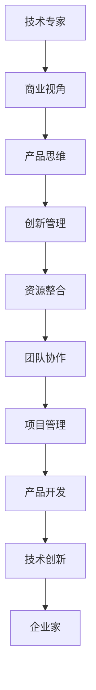

                 

## 1. 背景介绍

### 1.1 问题由来

在人工智能(AI)领域，技术的进步和应用推广几乎成为新闻头条的常态。但人们似乎常常忽视了在这背后，有一群默默付出、推动技术发展的技术专家们。他们掌握着前沿的知识和技能，是技术创新的先驱。然而，要真正将技术转化为商业价值，单凭技术力量是远远不够的。技术专家们需要具备更多企业家的视角，学会在商业化环境中进行决策和运营，才能将创新的成果推向市场。

本文将探讨技术专家如何向企业家心态转变，从技术专家的视角出发，深入分析转型过程中面临的挑战和机遇，并给出一些实用的建议和策略。

### 1.2 问题核心关键点

技术专家向企业家转型的核心关键点主要包括以下几点：

1. **商业视角**：理解市场需求、客户痛点和商业模式，将技术解决方案与实际业务需求结合起来。
2. **产品思维**：关注产品生命周期的全过程，从用户需求分析、产品设计、开发到市场推广，每一个环节都需要深思熟虑。
3. **创新管理**：有效管理创新过程，包括识别创新机会、评估风险、制定创新策略等。
4. **资源整合**：利用各种资源，包括人力、财力、技术等，确保项目顺利推进和市场成功。
5. **团队协作**：建立高效的团队协作机制，充分发挥团队成员的潜力和能力，共同实现目标。
6. **项目管理**：掌握项目管理技能，确保项目按时按质完成，同时控制成本和风险。

掌握这些关键点，技术专家将能够更有效地将技术转化为商业价值，实现从技术专家到企业家的转变。

## 2. 核心概念与联系

### 2.1 核心概念概述

为了更好地理解从技术专家到企业家的心态转变，本文将介绍几个核心概念：

- **技术专家**：掌握深度技术知识，能够解决复杂技术问题，推动技术创新的人。
- **企业家**：具备商业视角和创新管理能力，能够识别市场需求，成功将技术商业化的人。
- **技术创新**：通过技术研发和应用推广，创造新的商业价值和社会价值。
- **产品开发**：从需求分析到产品设计、开发、测试和市场推广的全过程。
- **商业模型**：基于市场需求和资源配置，定义企业盈利和价值创造方式。

这些核心概念之间的联系可以通过以下Mermaid流程图来展示：



这个流程图展示了技术专家向企业家转变的逻辑路径：首先，技术专家需要具备商业视角，理解市场需求；其次，通过产品思维，将技术应用到实际产品中；接着，通过创新管理，识别和评估创新机会；然后，整合资源，建立高效的团队协作机制；最后，通过项目管理，确保产品开发成功。最终，技术专家将成长为具有企业家视角的创新者。

## 3. 核心算法原理 & 具体操作步骤

### 3.1 算法原理概述

从技术专家到企业家的心态转变，本质上是一个从技术导向到商业导向的转变过程。这一过程可以通过以下算法原理来概述：

1. **市场需求分析**：识别市场痛点，理解客户需求，确定产品定位。
2. **商业模型设计**：基于市场需求和竞争分析，设计商业模型，包括收入来源、成本结构、定价策略等。
3. **产品规划**：明确产品功能、用户体验和性能指标，制定产品路线图。
4. **技术实现**：将产品规划转化为技术实现，选择最合适的技术栈和开发方法。
5. **市场推广**：制定市场营销策略，通过多种渠道推广产品，建立品牌影响力。
6. **反馈迭代**：收集用户反馈，不断优化产品和商业模式，实现持续创新。

这一过程可以概括为如下数学模型：

$$
企业家 = 技术专家 \times 商业视角 + 产品思维 + 创新管理 + 资源整合 + 团队协作 + 项目管理
$$

### 3.2 算法步骤详解

技术专家向企业家转型的具体操作步骤如下：

**Step 1: 市场调研**
- 深入理解目标市场的规模、需求和趋势，识别潜在的市场机会。
- 分析竞争对手，了解其优劣势，确定自己的差异化优势。

**Step 2: 商业模型设计**
- 根据市场需求和竞争分析，设计出可行的商业模型，包括收入模式、定价策略、目标客户群等。
- 制定短期和长期目标，明确企业的盈利预期和价值创造方式。

**Step 3: 产品规划**
- 定义产品的核心功能和用户体验，确保产品能够解决客户痛点。
- 制定详细的产品路线图，包括产品版本、功能迭代、里程碑等。

**Step 4: 技术实现**
- 选择合适的技术栈，构建技术团队，进行需求分析和系统设计。
- 制定开发计划，实施敏捷开发方法，确保按时交付高质量产品。

**Step 5: 市场推广**
- 制定市场推广策略，选择合适的推广渠道和媒体。
- 建立品牌形象，提升用户认知度和品牌忠诚度。

**Step 6: 反馈迭代**
- 收集用户反馈，分析产品性能和用户体验，识别改进点。
- 持续优化产品和商业模式，实现持续创新。

### 3.3 算法优缺点

从技术专家到企业家转型的算法具有以下优点：

1. **创新能力强**：通过技术实现，企业可以快速响应市场需求，推出创新的产品和服务。
2. **用户体验好**：技术专家的深入理解和优化，使产品功能更加完善，用户体验更好。
3. **成本控制**：通过敏捷开发和资源整合，企业可以高效控制项目成本，避免浪费。
4. **市场竞争力**：技术专家的专业知识和技能，使企业在市场竞争中具备优势。

但同时，这一算法也存在以下缺点：

1. **商业视角不足**：技术专家可能更关注技术实现，对市场和客户需求理解不足。
2. **管理能力弱**：技术专家可能缺乏项目管理、团队协作等管理能力。
3. **资源整合难**：技术专家可能难以有效整合各种资源，包括资金、人力、技术等。
4. **风险控制差**：技术专家的创新管理能力不足，可能面临项目风险。

### 3.4 算法应用领域

从技术专家到企业家心态转变的算法在多个领域都有应用：

1. **初创企业**：技术专家可以创办自己的初创企业，通过技术创新解决实际问题，实现商业价值。
2. **技术部门**：企业技术部门的技术专家可以参与产品开发，推动技术应用，提升企业竞争力。
3. **咨询公司**：技术专家可以进入咨询公司，为客户提供技术解决方案和创新管理建议。
4. **教育培训**：技术专家可以开设课程和培训，教授技术专家如何向企业家心态转变。

## 4. 数学模型和公式 & 详细讲解 & 举例说明

### 4.1 数学模型构建

技术专家向企业家转型的过程可以构建如下数学模型：

$$
企业家能力 = f(技术能力, 商业认知, 创新思维, 管理技能, 团队协作, 市场洞察)
$$

其中，技术能力、商业认知、创新思维、管理技能、团队协作和市场洞察是影响企业家能力的关键因素。

### 4.2 公式推导过程

为了更好地理解企业家能力的构成，可以将上述公式进一步推导为：

$$
企业家能力 = \sum_{i=1}^6 w_i \times 技术专家能力_i
$$

其中，$w_i$为各个因素的权重，技术专家能力$i$为在相应领域的表现。通过对各个因素的权重调整，可以实现对技术专家能力的综合评估和优化。

### 4.3 案例分析与讲解

以某初创企业为例，分析其技术专家如何向企业家心态转变。该企业最初专注于AI图像识别技术，但技术团队发现市场需求较大，但自身技术转化能力有限。通过市场调研和商业模型设计，团队决定推出一款面向医疗行业的AI图像分析产品，解决医生诊断效率低下的问题。

技术团队通过敏捷开发方法，快速迭代产品功能，并在市场推广中不断优化用户体验。产品上线后，受到医生和医院的好评，快速占据市场份额。技术专家通过这一过程，不仅提升了技术能力，还培养了商业视角、产品思维和创新管理能力。

## 5. 项目实践：代码实例和详细解释说明

### 5.1 开发环境搭建

技术专家向企业家心态转型的项目实践，需要以下开发环境：

1. **Python环境**：使用Python进行项目开发和数据处理。
2. **数据管理工具**：如Pandas、NumPy等，用于数据预处理和分析。
3. **项目管理工具**：如Jira、Trello等，用于项目进度管理和团队协作。
4. **版本控制工具**：如Git、SVN等，用于代码版本管理和团队协作。
5. **测试框架**：如pytest、unittest等，用于单元测试和集成测试。

完成上述环境搭建后，即可开始项目实践。

### 5.2 源代码详细实现

以下是一个简单的技术专家向企业家心态转型的项目示例，包括市场调研、商业模型设计、产品规划、技术实现和市场推广的Python代码实现。

**市场调研**

```python
import pandas as pd

# 读取市场数据
market_data = pd.read_csv('market_data.csv')

# 分析市场规模和趋势
market_trend = market_data['trend'].mean()

# 识别市场需求和机会
market_need = market_data['need'].value_counts()
```

**商业模型设计**

```python
# 计算收入模式
revenue_model = market_data['revenue'].mean()

# 确定定价策略
price_strategy = market_data['price'].mode()

# 定义目标客户群
target_customers = market_data['customer'].value_counts()
```

**产品规划**

```python
# 定义产品功能
product_function = market_data['function'].mode()

# 制定产品路线图
product_roadmap = pd.DataFrame({
    'Version': ['1.0', '2.0', '3.0'],
    'Features': ['Core Function', 'Enhanced UI', 'Multi-Language Support']
})
```

**技术实现**

```python
# 选择合适的技术栈
tech_stack = 'Python + TensorFlow'

# 构建技术团队
team_members = ['AI Expert', 'UX Designer', 'Software Engineer']

# 实施敏捷开发
sprint_backlog = pd.DataFrame({
    'Task': ['Requirement Analysis', 'System Design', 'Feature Development'],
    'Status': ['Pending', 'In Progress', 'Completed']
})
```

**市场推广**

```python
# 制定市场推广策略
marketing_strategy = 'SEO + Social Media + Email Campaign'

# 建立品牌形象
branding = 'MedAI'

# 收集用户反馈
user_feedback = pd.read_csv('user_feedback.csv')
```

### 5.3 代码解读与分析

以上代码展示了技术专家向企业家心态转型的关键步骤和实现方法。市场调研和商业模型设计通过数据分析，识别市场需求和机会，确保产品方向和商业模型符合市场需求。产品规划和技术实现通过敏捷开发方法，快速迭代产品功能，确保按时交付高质量产品。市场推广通过多种渠道，提升品牌影响力和市场份额。

## 6. 实际应用场景

### 6.1 初创企业

初创企业的技术专家可以通过市场调研和商业模型设计，发现潜在的市场机会，快速推出产品原型，通过敏捷开发方法快速迭代，同时进行市场推广和用户反馈收集，持续优化产品功能和商业模式。

### 6.2 技术部门

企业技术部门的技术专家可以参与产品开发和市场推广，推动技术应用和创新管理，提升企业竞争力。

### 6.3 咨询公司

技术专家可以进入咨询公司，为客户提供技术解决方案和创新管理建议，帮助客户实现业务转型和提升。

### 6.4 教育培训

技术专家可以开设课程和培训，教授技术专家如何向企业家心态转变，帮助更多人成功转型。

## 7. 工具和资源推荐

### 7.1 学习资源推荐

以下是几本推荐的书籍和课程，帮助技术专家掌握从技术专家到企业家心态转变的相关知识：

1. **《创新者的窘境》**：Clayton Christensen著，讲述了企业如何通过创新实现转型和突破。
2. **《精益创业》**：Eric Ries著，提供了创业过程中的实践方法和工具。
3. **《产品管理》**：Matt d'Avella著，详细介绍了产品管理全流程和工具。
4. **Coursera《创新与创业》**：由斯坦福大学开设，提供创业和创新管理的理论知识和实践案例。
5. **Udemy《企业家心态》**：提供了系统化的企业家心态训练和实际案例分析。

### 7.2 开发工具推荐

以下是一些推荐的开发工具，帮助技术专家在项目实践中更好地实现转型：

1. **Jira**：项目管理工具，支持敏捷开发和团队协作。
2. **Trello**：项目管理工具，以看板形式展示项目进度。
3. **Git**：版本控制工具，支持代码版本管理和团队协作。
4. **pytest**：测试框架，支持单元测试和集成测试。
5. **NumPy**：科学计算库，支持数据处理和分析。

### 7.3 相关论文推荐

以下是几篇相关领域的经典论文，推荐阅读：

1. **《敏捷软件开发：原则、模式与实践》**：Robert C. Martin著，详细介绍了敏捷开发方法和工具。
2. **《精益创业》**：Eric Ries著，提供了创业过程中的实践方法和工具。
3. **《创业公司》**：Peter Thiel等著，讲述了创业公司和投资者的合作与挑战。

## 8. 总结：未来发展趋势与挑战

### 8.1 总结

本文从技术专家向企业家心态转变的视角出发，系统介绍了转型过程中需要掌握的核心概念和关键步骤。技术专家需要具备商业视角、产品思维、创新管理、资源整合、团队协作和项目管理能力，才能成功转型。通过学习资源和工具的推荐，技术专家可以更好地掌握转型所需的知识和技能。

### 8.2 未来发展趋势

展望未来，技术专家向企业家心态转型的发展趋势主要包括：

1. **技术集成能力提升**：未来企业需要更加灵活地集成多种技术，形成综合解决方案，满足复杂需求。
2. **数据驱动决策**：大数据和人工智能技术的应用，将使企业在市场决策中更加依赖数据。
3. **跨学科融合**：未来的企业家需要具备跨学科知识，将技术、商业和管理等多领域知识融合，形成更全面的能力。
4. **人工智能助力**：人工智能技术的应用将进一步提升企业创新和运营效率，如自动化流程、智能客服等。
5. **全球化视野**：全球化的市场环境和竞争格局，要求企业家具备国际视野和跨文化管理能力。

### 8.3 面临的挑战

尽管技术专家向企业家心态转变有许多机会，但也面临以下挑战：

1. **技能转换**：从技术导向到商业导向的转换，需要重新学习商业和管理知识，时间成本较高。
2. **资源获取**：初创企业或技术部门可能面临资金和资源不足的问题，影响项目进展。
3. **市场竞争**：技术专家的创新能力和市场洞察力不足，可能面临激烈的市场竞争。
4. **团队协作**：如何管理跨部门团队，协调不同技术和管理人员的协作，是企业管理的重要挑战。

### 8.4 研究展望

未来的研究需要在以下几个方面进行深入探索：

1. **跨学科融合**：研究技术、商业和管理等多学科的融合方法，形成更全面的企业家能力模型。
2. **人工智能助力**：研究人工智能技术在企业家能力提升和项目管理中的应用，提高企业运营效率。
3. **资源优化**：研究如何通过资源优化和成本控制，实现技术专家向企业家的快速转型。
4. **创新管理**：研究创新管理和项目管理方法，提升企业的创新能力和项目管理水平。

这些研究方向将推动技术专家向企业家心态转型的进程，为实现技术创新和商业价值双重目标提供支持。

## 9. 附录：常见问题与解答

**Q1: 技术专家如何平衡技术和管理两方面的工作？**

A: 技术专家可以通过以下方法平衡技术和管理两方面的工作：
1. **优先级管理**：明确工作优先级，合理安排时间。
2. **团队协作**：建立高效的团队协作机制，分担管理任务。
3. **项目管理工具**：使用项目管理工具，跟踪任务进度和团队绩效。
4. **持续学习**：不断学习管理知识和技能，提升管理能力。

**Q2: 初创企业在市场推广中面临哪些挑战？**

A: 初创企业在市场推广中面临以下挑战：
1. **资金不足**：初创企业资金有限，难以进行大规模市场推广。
2. **品牌认知低**：新品牌缺乏知名度，市场推广难度大。
3. **用户获取成本高**：获取新用户的成本较高，需要有效的市场策略。
4. **竞争对手强**：市场竞争激烈，需要独特的市场定位和差异化策略。

**Q3: 如何提高技术专家的产品思维能力？**

A: 提高技术专家的产品思维能力，可以通过以下方法：
1. **用户研究**：深入了解用户需求和痛点，进行用户调研和访谈。
2. **用户体验设计**：学习用户体验设计原则，提升产品界面和交互体验。
3. **市场分析**：分析市场趋势和竞争对手，制定产品战略和路线图。
4. **迭代开发**：采用敏捷开发方法，快速迭代产品功能，不断优化用户体验。

**Q4: 如何建立高效的团队协作机制？**

A: 建立高效的团队协作机制，可以通过以下方法：
1. **明确目标和角色**：明确团队目标和各成员角色，分工协作。
2. **沟通渠道**：建立高效的沟通渠道，如定期会议、在线协作工具等。
3. **项目管理工具**：使用项目管理工具，跟踪任务进度和团队绩效。
4. **激励机制**：建立激励机制，提升团队成员的积极性和工作热情。

**Q5: 如何衡量技术专家的企业家能力？**

A: 衡量技术专家的企业家能力，可以从以下方面进行评估：
1. **商业认知**：评估对市场和客户需求的理解程度。
2. **产品规划能力**：评估产品功能和用户体验的设计能力。
3. **创新管理**：评估创新机会的识别和评估能力。
4. **资源整合能力**：评估项目资源的获取和整合能力。
5. **团队协作能力**：评估团队管理和协作能力。
6. **项目管理能力**：评估项目进度和质量控制能力。

---

作者：禅与计算机程序设计艺术 / Zen and the Art of Computer Programming

