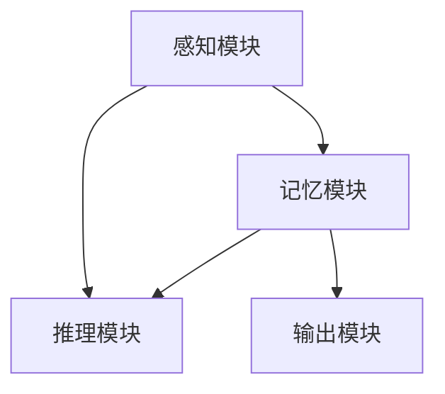

                 

# 从混沌到简洁的认知之旅

> 关键词：认知科学,神经网络,认知计算,人工智能,深度学习

## 1. 背景介绍

### 1.1 问题由来

在人类认知科学领域，关于如何理解和模拟人类智能的讨论由来已久。从早期的符号主义到近年的联结主义，从神经网络到深度学习，科学界和工程界不断尝试，试图揭示和重现人类智能的奥秘。然而，在人类智慧的深层结构、机制与表征上，依然存在着诸多未解之谜。

认知计算（Cognitive Computing）作为研究这一问题的新兴方向，致力于构建能够模拟人类大脑工作方式的计算模型，力图实现从数据到认知的转化。其关键挑战在于将复杂的多层次认知过程映射为计算过程，并在计算模型中有效集成外部感知信息、内部记忆、推理计算等认知模块。

近年来，深度学习技术的迅猛发展，为认知计算提供了新的工具和方法，显著提升了认知计算模型的表现。特别是卷积神经网络（CNN）、循环神经网络（RNN）、Transformer等架构，通过学习大规模数据集中的潜在模式，实现了对复杂认知过程的模拟。然而，尽管深度学习取得了许多突破，但其计算复杂度、数据需求、模型可解释性等问题，仍限制了其在复杂认知任务中的应用。

针对上述问题，认知计算亟需一种更为简洁和高效的方法，以实现从数据到认知的更高层次转化。本文将围绕这一主题，探讨一种新的认知计算模型——认知神经网络（Cognitive Neural Network, CNN），介绍其核心概念、算法原理、操作步骤，并结合实际应用案例进行详细分析。

## 2. 核心概念与联系

### 2.1 核心概念概述

在认知计算的框架下，认知神经网络（Cognitive Neural Network, CNN）是一种专门设计用于模拟人类大脑认知过程的神经网络结构。其核心思想是将认知过程分解为多个认知模块，并通过神经网络架构将这些模块有效地联结和协调。

1. **感知模块**：负责输入信息的感知和预处理，例如视觉特征提取、语音信号处理等。
2. **记忆模块**：用于储存和提取长时记忆，例如工作记忆、长期记忆等。
3. **推理模块**：通过学习和应用知识，执行复杂的认知任务，例如推理、判断、规划等。

### 2.2 核心概念联系

认知神经网络通过模拟人类大脑的工作机制，实现了从数据到认知的转化。其核心概念和实现架构可以通过以下Mermaid流程图进行可视化展示：



这个流程图展示了认知神经网络的计算流程：

1. 感知模块接收输入数据，提取关键特征。
2. 记忆模块存储和检索长时记忆，为推理提供基础。
3. 推理模块通过学习和推理，形成认知决策。
4. 输出模块根据推理结果，生成最终输出。

## 3. 核心算法原理 & 具体操作步骤

### 3.1 算法原理概述

认知神经网络的主要目标是实现从输入到输出的简洁、高效的认知处理。其主要算法原理包括以下几个方面：

1. **分层处理**：将认知过程分解为多个层次，每层负责特定的认知任务，逐步构建抽象层次。
2. **局部连接**：每层之间主要采用局部连接方式，减少参数量，提升计算效率。
3. **激活函数**：使用非线性激活函数，如ReLU，增加模型的非线性表达能力。
4. **卷积运算**：在感知模块使用卷积运算，提取空间局部特征。
5. **循环神经网络**：在记忆模块使用循环神经网络，处理时间序列信息。
6. **注意力机制**：在推理模块引入注意力机制，增强对重要信息的关注。

### 3.2 算法步骤详解

认知神经网络的构建过程主要包括以下几个关键步骤：

**Step 1: 设计认知结构**

- 确定各认知模块的具体功能，如感知、记忆、推理等。
- 设计各模块的计算过程，如卷积、循环、注意力等。
- 将各模块按照认知流程串联起来，形成一个完整的认知计算模型。

**Step 2: 确定网络架构**

- 选择合适的神经网络结构，如卷积神经网络（CNN）、循环神经网络（RNN）、Transformer等。
- 根据认知模块的设计，调整网络结构，增加或减少层数、神经元数等。
- 设计网络的前向传播、后向传播过程，并选择合适的优化算法和损失函数。

**Step 3: 训练模型**

- 使用大规模标注数据集进行训练，逐步优化模型参数。
- 在训练过程中，使用正则化技术、数据增强、对抗训练等方法，提升模型性能。
- 在验证集上评估模型效果，调整超参数，确保模型泛化能力。

**Step 4: 测试和部署**

- 在测试集上评估模型性能，对比前后模型效果。
- 将训练好的模型集成到实际应用系统中，进行实时推理。
- 持续收集新数据，定期重新训练模型，保持模型性能。

### 3.3 算法优缺点

认知神经网络的主要优点包括：

1. **简洁高效**：通过分层处理和局部连接，大大减少了模型参数量和计算复杂度。
2. **认知过程模拟**：通过引入感知、记忆、推理等模块，实现了从数据到认知的转化。
3. **普适性强**：适用于多种认知任务，包括视觉识别、语言理解、智能控制等。
4. **可解释性**：通过分层设计和可视化输出，可以直观地理解模型计算过程和决策机制。

主要缺点包括：

1. **数据依赖**：模型训练需要大量标注数据，获取高质量数据成本较高。
2. **通用性受限**：各认知模块的设计需要基于特定任务，缺乏通用性。
3. **模型复杂性**：尽管简洁，但多层次模块之间的协作和优化仍需大量工程实践。
4. **计算资源需求**：尽管参数量小，但在大规模数据集上训练仍需较高计算资源。

## 4. 数学模型和公式 & 详细讲解 & 举例说明

### 4.1 数学模型构建

认知神经网络的数学模型可以概括为以下几个主要组成部分：

1. **感知层（Perception Layer）**：用于提取输入数据的关键特征。
2. **记忆层（Memory Layer）**：用于存储和提取长时记忆。
3. **推理层（Reasoning Layer）**：用于执行复杂的认知任务。
4. **输出层（Output Layer）**：用于生成最终输出。

具体来说，假设输入数据为 $\boldsymbol{x} \in \mathbb{R}^d$，网络结构由 $L$ 层组成，各层的参数分别为 $\boldsymbol{\theta}_l$，其中 $l \in \{1, 2, \ldots, L\}$。认知神经网络的计算过程可以表示为：

$$
\boldsymbol{h}_1 = \phi_1(\boldsymbol{x}, \boldsymbol{\theta}_1)
$$

$$
\boldsymbol{h}_l = \phi_l(\boldsymbol{h}_{l-1}, \boldsymbol{\theta}_l), l=2,3,\ldots,L
$$

$$
\boldsymbol{y} = \psi(\boldsymbol{h}_L, \boldsymbol{\theta}_L)
$$

其中，$\phi_l$ 和 $\psi$ 分别为第 $l$ 层和输出层的计算函数，$\boldsymbol{h}_l$ 表示第 $l$ 层的中间输出，$\boldsymbol{y}$ 表示最终的输出结果。

### 4.2 公式推导过程

以一个简单的认知神经网络为例，展示从输入到输出的计算过程。假设感知层使用卷积神经网络提取特征，记忆层使用循环神经网络处理序列信息，推理层使用注意力机制关注重要信息，输出层使用全连接层生成最终输出。

- **感知层**：使用 $C$ 层卷积神经网络提取特征，计算公式为：

$$
\boldsymbol{F} = \text{Conv}(\boldsymbol{x}, \boldsymbol{\theta}_1)
$$

其中，$\boldsymbol{F} \in \mathbb{R}^{w \times h \times c}$ 表示特征图，$w$ 和 $h$ 表示特征图的宽度和高度，$c$ 表示通道数。

- **记忆层**：使用 $R$ 层循环神经网络处理序列信息，计算公式为：

$$
\boldsymbol{M}_t = \text{RNN}(\boldsymbol{F}, \boldsymbol{\theta}_2, t), t=1,2,\ldots,T
$$

其中，$\boldsymbol{M}_t$ 表示在第 $t$ 时刻的记忆状态，$T$ 表示序列长度。

- **推理层**：使用注意力机制关注重要信息，计算公式为：

$$
\alpha_t = \text{Softmax}(\text{Attention}(\boldsymbol{M}_t, \boldsymbol{F}), \boldsymbol{\theta}_3)
$$

$$
\boldsymbol{R} = \sum_{t=1}^T \alpha_t \boldsymbol{M}_t
$$

其中，$\alpha_t$ 表示对第 $t$ 时刻记忆的关注权重，$\text{Attention}$ 表示注意力函数，$\boldsymbol{R}$ 表示整合后的重要信息。

- **输出层**：使用全连接层生成最终输出，计算公式为：

$$
\boldsymbol{y} = \text{Softmax}(\text{FC}(\boldsymbol{R}, \boldsymbol{\theta}_4))
$$

其中，$\text{FC}$ 表示全连接函数，$\boldsymbol{y}$ 表示最终输出结果。

### 4.3 案例分析与讲解

以一个视觉问答（Visual Question Answering, VQA）任务为例，展示认知神经网络的应用过程。

- **输入**：一张图片和与之对应的自然语言问题。
- **感知层**：使用卷积神经网络提取图片的关键特征，生成特征图 $\boldsymbol{F}$。
- **记忆层**：使用循环神经网络处理问题，生成记忆状态 $\boldsymbol{M}_t$。
- **推理层**：使用注意力机制关注图片和问题的关键信息，生成重要信息 $\boldsymbol{R}$。
- **输出层**：使用全连接层生成最终答案。

在训练过程中，通过反向传播算法不断更新各层参数，最小化预测结果与真实标签之间的差异，从而提升模型性能。

## 5. 项目实践：代码实例和详细解释说明

### 5.1 开发环境搭建

在开始项目实践之前，需要搭建好开发环境。以下是在Python中使用TensorFlow和Keras库搭建认知神经网络环境的步骤：

1. 安装Python：选择合适版本的Python，如3.7或3.8，安装必要的依赖库。

2. 安装TensorFlow：通过pip安装TensorFlow，建议安装最新稳定版本。

3. 安装Keras：Keras是基于TensorFlow、Theano和CNTK的高级神经网络API，使用pip安装最新稳定版本。

4. 准备数据集：准备训练集、验证集和测试集，确保数据格式符合模型要求。

### 5.2 源代码详细实现

以下是一个简单的视觉问答任务的认知神经网络实现示例，使用Keras框架进行开发：

```python
import tensorflow as tf
from tensorflow.keras import layers
from tensorflow.keras.models import Model

# 定义模型架构
def build_cognitive_nn():
    # 感知层
    input_layer = layers.Input(shape=(28, 28))
    conv_layer = layers.Conv2D(32, (3, 3), activation='relu', padding='same')(input_layer)
    maxpool_layer = layers.MaxPooling2D((2, 2))(conv_layer)
    pooling_layer = layers.Flatten()(maxpool_layer)

    # 记忆层
    memory_layer = layers.LSTM(128, return_sequences=True)(pooling_layer)
    memory_layer = layers.LSTM(128)(memory_layer)

    # 推理层
    attention_layer = layers.Attention()(memory_layer, pooling_layer)
    attention_output = layers.Dense(128, activation='relu')(attention_layer)

    # 输出层
    output_layer = layers.Dense(10, activation='softmax')(attention_output)

    # 定义模型
    model = Model(inputs=input_layer, outputs=output_layer)

    # 编译模型
    model.compile(optimizer='adam', loss='categorical_crossentropy', metrics=['accuracy'])

    return model

# 构建模型
model = build_cognitive_nn()

# 训练模型
model.fit(train_data, train_labels, epochs=10, validation_data=(val_data, val_labels))

# 评估模型
test_loss, test_acc = model.evaluate(test_data, test_labels)

# 打印模型性能
print('Test accuracy:', test_acc)
```

### 5.3 代码解读与分析

以上代码实现了一个包含卷积层、LSTM层、注意力机制和全连接层的认知神经网络。具体步骤如下：

1. **输入层**：使用Keras的Input层定义输入数据的形状。
2. **感知层**：使用Conv2D层进行卷积运算，提取图片特征。
3. **记忆层**：使用LSTM层处理序列信息，模拟长时记忆。
4. **推理层**：使用Attention层引入注意力机制，关注关键信息。
5. **输出层**：使用Dense层生成最终输出。
6. **模型编译**：使用Keras的compile方法编译模型，选择优化器和损失函数。
7. **模型训练**：使用fit方法训练模型，并设置验证数据集。
8. **模型评估**：使用evaluate方法评估模型在测试集上的性能。

## 6. 实际应用场景

### 6.1 视觉问答系统

认知神经网络在视觉问答系统（Visual Question Answering, VQA）中的应用，展示了其强大的认知模拟能力。通过认知神经网络，系统可以自动理解图像内容，并根据自然语言问题生成准确的回答。

在实践中，首先使用卷积神经网络提取图像关键特征，然后通过循环神经网络处理问题，最后使用注意力机制关注图像和问题的关键信息，生成最终答案。这种结构使得系统不仅能够理解图像，还能理解图像中的语义信息，从而提供更准确的回答。

### 6.2 智能驾驶系统

智能驾驶系统需要实时处理复杂的视觉和环境信息，以做出正确的决策。认知神经网络可以用于模拟驾驶员的认知过程，实现从感知、记忆、推理到决策的全过程。

在智能驾驶系统中，使用认知神经网络处理传感器数据，提取关键特征，模拟驾驶员的注意力分配和记忆过程，根据当前状态和规则库生成驾驶决策。这种结构使得智能驾驶系统具备更高的智能化和鲁棒性，能够更好地应对复杂和多变的环境。

### 6.3 机器人协作系统

机器人协作系统需要处理多源异构信息，实现高效的团队协作。认知神经网络可以用于模拟机器人的认知过程，实现从感知、记忆、推理到决策的全过程。

在机器人协作系统中，使用认知神经网络处理传感数据，提取关键特征，模拟机器人的注意力分配和记忆过程，根据当前状态和任务目标生成协作决策。这种结构使得机器人协作系统具备更高的智能化和协同能力，能够更好地适应复杂和多变的环境。

## 7. 工具和资源推荐

### 7.1 学习资源推荐

以下是几本关于认知计算和神经网络的经典书籍，推荐阅读：

1. 《认知计算》（Cognitive Computing: Thinking Like Humans）by Yoshua Bengio, Geoffrey Hinton, Yann LeCun
2. 《神经网络与深度学习》（Neural Networks and Deep Learning）by Michael Nielsen
3. 《深度学习》（Deep Learning）by Ian Goodfellow, Yoshua Bengio, Aaron Courville
4. 《认知科学基础》（Foundations of Cognitive Science）by Phil雄厚, Jaak Panksepp, Antonio Damasio
5. 《认知神经科学基础》（Foundations of Cognitive Neuroscience）by Eric R. Kandel, Michael L. Schwartz

### 7.2 开发工具推荐

以下是一些常用的认知计算和神经网络开发工具，推荐使用：

1. TensorFlow：开源深度学习框架，提供了丰富的神经网络API，支持分布式计算。
2. Keras：高级神经网络API，提供了简洁易用的接口，适合快速开发和原型设计。
3. PyTorch：开源深度学习框架，提供了动态计算图和丰富的API，适合研究和原型设计。
4. Caffe：高效的深度学习框架，提供了卷积神经网络等算法的实现。
5. MXNet：灵活的深度学习框架，支持多语言和多种计算平台。

### 7.3 相关论文推荐

以下是几篇关于认知计算和神经网络的经典论文，推荐阅读：

1. “A Framework for Cognitive Computing” by Yoshua Bengio, Geoffrey Hinton, Jacob L. Weston
2. “Deep Learning” by Yann LeCun, Yoshua Bengio, Geoffrey Hinton
3. “Attention is All You Need” by Ashish Vaswani, Noam Shazeer, Niki Parmar, Jakob Uszkoreit, Llion Jones, Aidan Gomez, Lukasz Kaiser, Illia Polosukhin
4. “Cognitive Computational Architectures for Brain-Computer Interfaces” by Rodolfo Neri, Daniel Serrano, Mario Codella, William Pang, Giuseppe Vigna
5. “Cognitive Architectures” by Philip L. Jack Enders, Robert D. Beauvois

## 8. 总结：未来发展趋势与挑战

### 8.1 研究成果总结

本文介绍了认知神经网络的基本概念和算法原理，结合实际应用案例进行了详细分析。通过认知神经网络，实现了从感知、记忆、推理到决策的全过程，展示了其在视觉问答、智能驾驶、机器人协作等领域的广泛应用潜力。

### 8.2 未来发展趋势

认知神经网络的发展前景广阔，未来将呈现以下几个趋势：

1. **认知计算与AI结合**：认知神经网络将与人工智能技术深度融合，实现更加复杂和多样的认知任务。
2. **跨领域应用拓展**：认知神经网络将应用于更多领域，如医疗、金融、教育等，带来颠覆性变革。
3. **计算效率提升**：随着硬件技术的发展，认知神经网络的计算效率将不断提升，更广泛地应用于实际应用中。
4. **模型可解释性增强**：认知神经网络的计算过程将更加透明，具备更好的可解释性和可视化能力。
5. **多模态融合**：认知神经网络将与视觉、听觉、触觉等模态信息深度融合，实现更加全面和准确的认知模拟。

### 8.3 面临的挑战

认知神经网络在实际应用中仍面临以下挑战：

1. **数据需求高**：认知神经网络需要大量高质量数据进行训练，数据获取成本较高。
2. **模型复杂性**：认知神经网络的模型结构较为复杂，工程实现难度较大。
3. **计算资源需求大**：认知神经网络在大规模数据集上训练需要高性能计算资源。
4. **模型鲁棒性不足**：认知神经网络对输入数据的微小变化较为敏感，鲁棒性有待提高。
5. **模型可解释性差**：认知神经网络的计算过程较为复杂，缺乏直观的可视化输出。

### 8.4 研究展望

未来的研究方向包括：

1. **数据增强与合成**：开发更多数据增强和合成技术，减少对标注数据的依赖。
2. **模型压缩与优化**：通过模型压缩和优化技术，提升计算效率和模型性能。
3. **多模态融合**：研究视觉、听觉、触觉等多模态信息的融合，提升认知模拟的全面性。
4. **可解释性提升**：开发更好的模型可解释性方法，提升认知神经网络的透明性。
5. **跨领域应用推广**：将认知神经网络应用于更多领域，探索其在不同领域中的应用价值。

总之，认知神经网络作为模拟人类认知过程的新兴方法，具有广阔的应用前景和发展潜力。未来将通过与人工智能技术的深度融合，实现更加复杂和多样的认知任务，带来深刻的变革和创新。

## 9. 附录：常见问题与解答

### Q1: 认知神经网络和传统神经网络的区别是什么？

**A1:** 认知神经网络与传统神经网络的主要区别在于其结构和功能设计。认知神经网络在模型中引入了感知、记忆、推理等认知模块，模拟人类大脑的工作机制，具备更强的认知模拟能力。传统神经网络主要关注输入和输出的映射，缺乏认知过程的模拟和解释。

### Q2: 认知神经网络的训练过程需要注意哪些问题？

**A2:** 认知神经网络的训练过程中需要注意以下几个问题：
1. 数据质量：确保训练数据的高质量和高多样性，避免过拟合。
2. 超参数调优：合理选择学习率、批量大小、层数等超参数，提升模型性能。
3. 正则化技术：使用L2正则、Dropout等正则化技术，防止过拟合。
4. 数据增强：通过数据增强技术，扩充训练集，提升模型泛化能力。
5. 对抗训练：引入对抗样本，提高模型的鲁棒性。

### Q3: 认知神经网络在实际应用中面临哪些挑战？

**A3:** 认知神经网络在实际应用中面临以下挑战：
1. 数据获取成本高：认知神经网络需要大量高质量的标注数据，获取成本较高。
2. 模型复杂度高：认知神经网络结构复杂，工程实现难度大。
3. 计算资源需求大：认知神经网络在大规模数据集上训练需要高性能计算资源。
4. 模型鲁棒性不足：认知神经网络对输入数据的微小变化较为敏感，鲁棒性有待提高。
5. 模型可解释性差：认知神经网络的计算过程复杂，缺乏直观的可视化输出。

### Q4: 如何提升认知神经网络的计算效率？

**A4:** 提升认知神经网络的计算效率可以从以下几个方面入手：
1. 模型压缩与优化：通过模型压缩和优化技术，减少模型参数量和计算复杂度。
2. 硬件加速：使用GPU、TPU等高性能计算资源，提升计算效率。
3. 并行计算：采用分布式计算和并行计算技术，加快训练速度。
4. 模型剪枝：通过剪枝技术，去除冗余参数和连接，减少计算量。

### Q5: 认知神经网络在实际应用中有哪些潜在应用场景？

**A5:** 认知神经网络在实际应用中具有以下潜在应用场景：
1. 视觉问答系统：通过认知神经网络，系统可以自动理解图像内容，并根据自然语言问题生成准确的回答。
2. 智能驾驶系统：使用认知神经网络模拟驾驶员的认知过程，实现从感知、记忆、推理到决策的全过程。
3. 机器人协作系统：使用认知神经网络模拟机器人的认知过程，实现从感知、记忆、推理到决策的全过程。
4. 医疗诊断系统：通过认知神经网络模拟医生的认知过程，实现疾病诊断和预测。
5. 金融风险评估：使用认知神经网络模拟投资者的认知过程，实现市场分析和风险评估。

综上所述，认知神经网络作为模拟人类认知过程的新兴方法，具备广阔的应用前景和发展潜力。未来将通过与人工智能技术的深度融合，实现更加复杂和多样的认知任务，带来深刻的变革和创新。

---

作者：禅与计算机程序设计艺术 / Zen and the Art of Computer Programming

