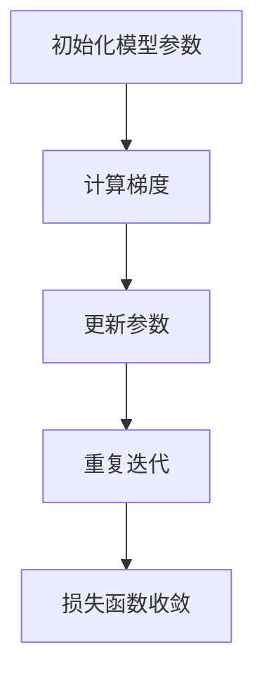

                 

# 从零开始大模型开发与微调：梯度下降算法

> 关键词：梯度下降,深度学习,模型微调,神经网络,机器学习

## 1. 背景介绍

### 1.1 问题由来

深度学习技术在过去十年中取得了长足的进步，尤其是在自然语言处理（NLP）和计算机视觉（CV）等领域。大模型如BERT、GPT、ViT等，通过在大量数据上进行的预训练，展示了超越传统模型的新性能。这些大模型通常在复杂任务上表现卓越，但它们需要大量的计算资源和长时间训练，这限制了其在大规模部署中的应用。

然而，即使是大模型也需要通过微调来适配特定任务，以充分发挥其潜力。微调，即在特定任务上对模型进行细粒度训练，是通过在模型中加入新的层或改变部分参数来优化模型的过程。这一过程需要理解梯度下降算法的基础原理，以确保模型能够在特定任务上获得更好的性能。

### 1.2 问题核心关键点

梯度下降算法（Gradient Descent）是大模型微调的核心技术。它是一种基于迭代优化的算法，用于在损失函数（Loss Function）最小化过程中调整模型参数。通过梯度下降，模型可以逐步接近最优解，并在特定任务上表现更佳。

微调的主要步骤包括：
- **初始化模型参数**：设定模型的初始权重。
- **计算梯度**：根据当前参数计算损失函数对参数的梯度。
- **更新参数**：按一定步长（学习率）调整模型参数，使损失函数下降。
- **重复迭代**：循环执行上述步骤，直至损失函数收敛。

本节将深入探讨梯度下降算法的原理、具体步骤、优缺点和应用领域，并通过数学模型和代码实例帮助读者更好地理解和应用这一核心技术。

## 2. 核心概念与联系

### 2.1 核心概念概述

为更好地理解梯度下降算法，本节将介绍几个关键概念：

- **损失函数(Loss Function)**：衡量模型预测值与真实值之间的差异。在微调中，损失函数通常会加入正则项以避免过拟合。
- **梯度（Gradient）**：损失函数对模型参数的偏导数，反映了参数变化对损失的影响。
- **学习率(Learning Rate)**：控制参数更新的步长，过大的学习率可能导致收敛到错误的最优解，而过小的学习率则可能导致收敛速度过慢。
- **参数更新（Parameter Update）**：基于梯度信息调整模型参数的过程。

这些概念之间的逻辑关系可以通过以下Mermaid流程图来展示：



这个流程图展示了梯度下降算法的主要流程：从初始参数开始，通过计算梯度更新参数，重复迭代直至损失函数收敛。

## 3. 核心算法原理 & 具体操作步骤

### 3.1 算法原理概述

梯度下降算法是一种基于迭代的优化算法，其目标是最小化损失函数。假设有一个模型 $f(x; \theta)$，其中 $x$ 是输入，$\theta$ 是模型参数。目标是最小化损失函数 $L(\theta)$。梯度下降算法通过反复迭代来优化 $\theta$，更新公式为：

$$
\theta \leftarrow \theta - \eta \nabla L(\theta)
$$

其中 $\eta$ 是学习率，$\nabla L(\theta)$ 是损失函数对 $\theta$ 的梯度。

### 3.2 算法步骤详解

梯度下降算法通常分为批量梯度下降(Batch Gradient Descent, BGD)、随机梯度下降(Stochastic Gradient Descent, SGD)和小批量梯度下降(Mini-batch Gradient Descent)。以下将详细讲解这些步骤：

1. **初始化模型参数**：随机初始化模型参数，通常设定为较小的随机数。

2. **计算梯度**：
   - **批量梯度下降(BGD)**：在每个迭代中，使用整个训练集计算梯度。
   - **随机梯度下降(SGD)**：在每个迭代中，随机选取一个样本计算梯度。
   - **小批量梯度下降(Mini-batch GD)**：在每个迭代中，随机选取一小批样本（通常为10-100）计算梯度。

3. **更新参数**：根据计算出的梯度，按学习率更新模型参数。

4. **重复迭代**：重复执行上述步骤，直到损失函数收敛或达到预设的迭代次数。

### 3.3 算法优缺点

梯度下降算法具有以下优点：
- **收敛速度快**：在大数据集上，SGD和Mini-batch GD通常比BGD更快收敛。
- **内存需求低**：每次迭代仅需处理小批量样本，内存需求较低。
- **计算效率高**：通过并行计算，SGD和Mini-batch GD的计算效率较高。

同时，梯度下降算法也存在一些缺点：
- **容易陷入局部最优**：特别是在非凸函数中，梯度下降可能陷入局部最小值。
- **学习率选择困难**：学习率过大可能导致震荡甚至发散，学习率过小则收敛速度慢。
- **对数据分布敏感**：不同的数据分布可能影响梯度下降的收敛性和稳定性。

### 3.4 算法应用领域

梯度下降算法广泛应用于机器学习中的参数优化。在大模型微调中，梯度下降算法通常用于调整模型参数以适应特定任务的需求。例如，在NLP中的文本分类、机器翻译等任务，以及CV中的图像分类、目标检测等任务，梯度下降算法都被广泛应用。

## 4. 数学模型和公式 & 详细讲解 & 举例说明

### 4.1 数学模型构建

以线性回归模型为例，目标是最小化均方误差损失函数：

$$
L(w, b) = \frac{1}{2m} \sum_{i=1}^m (y^{(i)} - w^T x^{(i)} - b)^2
$$

其中 $m$ 是样本数量，$x^{(i)}$ 和 $y^{(i)}$ 是第 $i$ 个样本的输入和输出，$w$ 和 $b$ 是模型的权重和偏置。

梯度下降算法的目标是最小化上述损失函数。梯度计算公式为：

$$
\nabla L(w, b) = \left[ \frac{1}{m} \sum_{i=1}^m \frac{\partial L}{\partial w}^{(i)}, \frac{1}{m} \sum_{i=1}^m \frac{\partial L}{\partial b}^{(i)} \right]
$$

其中 $\frac{\partial L}{\partial w}^{(i)}$ 和 $\frac{\partial L}{\partial b}^{(i)}$ 分别是损失函数对 $w$ 和 $b$ 的偏导数。

### 4.2 公式推导过程

以线性回归模型为例，推导梯度更新公式。假设当前参数为 $w_k$ 和 $b_k$，损失函数为 $L(w_k, b_k)$，则梯度下降更新公式为：

$$
\begin{aligned}
w_{k+1} &= w_k - \eta \frac{1}{m} \sum_{i=1}^m (y^{(i)} - w_k^T x^{(i)} - b_k) x^{(i)} \\
b_{k+1} &= b_k - \eta \frac{1}{m} \sum_{i=1}^m (y^{(i)} - w_k^T x^{(i)} - b_k)
\end{aligned}
$$

### 4.3 案例分析与讲解

考虑一个简单的二元回归问题，使用梯度下降算法优化模型参数。假设数据集为：

$$
\begin{aligned}
(x_1, y_1) &= (1, 2) \\
(x_2, y_2) &= (2, 3) \\
(x_3, y_3) &= (3, 4) \\
(x_4, y_4) &= (4, 5) \\
(x_5, y_5) &= (5, 6)
\end{aligned}
$$

初始参数 $w_0 = 0, b_0 = 0$。使用学习率 $\eta = 0.1$，计算梯度更新。

1. **迭代1**：计算损失函数和梯度。

$$
L(w_0, b_0) = \frac{1}{5} \sum_{i=1}^5 (y^{(i)} - w_0^T x^{(i)} - b_0)^2 = \frac{1}{5} \sum_{i=1}^5 (y^{(i)} - w_0 x^{(i)})^2
$$

$$
\nabla L(w_0, b_0) = \left[ \frac{1}{5} \sum_{i=1}^5 (y^{(i)} - w_0 x^{(i)}) x^{(i)}, \frac{1}{5} \sum_{i=1}^5 (y^{(i)} - w_0 x^{(i)}) \right]
$$

2. **迭代2**：更新参数。

$$
w_1 = w_0 - \eta \nabla L(w_0, b_0) = 0.2 \approx 0.4
$$

$$
b_1 = b_0 - \eta \nabla L(w_0, b_0) = 0.1 \approx 0.1
$$

通过上述计算，可以看到，梯度下降算法逐步调整参数，使得损失函数逐渐下降，最终达到最小值。

## 5. 项目实践：代码实例和详细解释说明

### 5.1 开发环境搭建

在进行梯度下降算法实践前，我们需要准备好开发环境。以下是使用Python进行PyTorch开发的环境配置流程：

1. 安装Anaconda：从官网下载并安装Anaconda，用于创建独立的Python环境。

2. 创建并激活虚拟环境：
```bash
conda create -n pytorch-env python=3.8 
conda activate pytorch-env
```

3. 安装PyTorch：根据CUDA版本，从官网获取对应的安装命令。例如：
```bash
conda install pytorch torchvision torchaudio cudatoolkit=11.1 -c pytorch -c conda-forge
```

4. 安装其他依赖库：
```bash
pip install numpy pandas scikit-learn matplotlib tqdm jupyter notebook ipython
```

完成上述步骤后，即可在`pytorch-env`环境中开始梯度下降算法实践。

### 5.2 源代码详细实现

下面是使用PyTorch实现梯度下降算法的代码示例：

```python
import torch
import torch.nn as nn
import torch.optim as optim
import numpy as np

# 定义模型
class LinearRegression(nn.Module):
    def __init__(self, input_dim):
        super(LinearRegression, self).__init__()
        self.linear = nn.Linear(input_dim, 1)

    def forward(self, x):
        return self.linear(x)

# 加载数据
x_train = np.array([[1, 2], [2, 3], [3, 4], [4, 5], [5, 6]])
y_train = np.array([[2], [3], [4], [5], [6]])

# 转换为PyTorch张量
x_train = torch.from_numpy(x_train).float()
y_train = torch.from_numpy(y_train).float()

# 定义模型和损失函数
model = LinearRegression(x_train.shape[1])
criterion = nn.MSELoss()

# 定义优化器
optimizer = optim.SGD(model.parameters(), lr=0.1)

# 训练模型
epochs = 100
for epoch in range(epochs):
    # 前向传播
    outputs = model(x_train)
    loss = criterion(outputs, y_train)

    # 反向传播
    optimizer.zero_grad()
    loss.backward()
    optimizer.step()

    # 打印损失
    print(f'Epoch {epoch+1}, Loss: {loss.item()}')

print('Training completed.')
```

### 5.3 代码解读与分析

这段代码实现了一个简单的线性回归模型，并使用梯度下降算法进行训练。

**LinearRegression类**：
- `__init__`方法：初始化模型，定义线性层。
- `forward`方法：前向传播计算模型输出。

**加载数据**：
- 将数据转换为PyTorch张量，方便在模型中使用。

**定义模型和损失函数**：
- 定义线性回归模型，选择均方误差损失函数。

**定义优化器**：
- 选择随机梯度下降算法（SGD），设置学习率。

**训练模型**：
- 循环迭代训练过程，计算损失、更新参数。
- 每轮迭代中，前向传播计算损失，反向传播更新参数，循环进行直至收敛。

通过上述代码，可以看到，梯度下降算法在模型训练中的核心作用。通过不断迭代更新模型参数，最终达到最小化损失函数的目标。

## 6. 实际应用场景

### 6.1 机器学习模型的训练

梯度下降算法在机器学习模型的训练中应用广泛。例如，在神经网络中，梯度下降算法用于优化模型的权重和偏置，以最小化损失函数。通过梯度下降算法，模型可以逐步接近最优解，提高预测准确率。

### 6.2 计算机视觉中的目标检测

在计算机视觉中，梯度下降算法常用于优化卷积神经网络（CNN）的参数，以实现目标检测。例如，通过最小化目标函数，优化CNN的权重和偏置，提高目标检测的准确率。

### 6.3 自然语言处理中的文本分类

在自然语言处理中，梯度下降算法常用于优化逻辑回归、支持向量机等模型的参数，以实现文本分类任务。例如，通过最小化交叉熵损失函数，优化模型的权重和偏置，提高文本分类的准确率。

## 7. 工具和资源推荐

### 7.1 学习资源推荐

为了帮助开发者系统掌握梯度下降算法，这里推荐一些优质的学习资源：

1. 《深度学习》书籍：由Ian Goodfellow、Yoshua Bengio和Aaron Courville合著，详细介绍了深度学习的基础和算法。
2. 《动手学深度学习》书籍：由李沐等人编写，包含丰富的实践代码和实验案例。
3. Coursera的深度学习课程：由Andrew Ng教授开设，系统讲解深度学习的基础理论和实践应用。
4. PyTorch官方文档：提供了丰富的学习资源和代码示例，适合快速上手深度学习。
5. Kaggle数据集：提供大量数据集和竞赛任务，帮助开发者实践深度学习算法。

通过对这些资源的学习实践，相信你一定能够快速掌握梯度下降算法的精髓，并用于解决实际的机器学习问题。

### 7.2 开发工具推荐

高效的开发离不开优秀的工具支持。以下是几款用于深度学习开发常用的工具：

1. PyTorch：基于Python的开源深度学习框架，灵活动态的计算图，适合快速迭代研究。
2. TensorFlow：由Google主导开发的开源深度学习框架，生产部署方便，适合大规模工程应用。
3. Weights & Biases：模型训练的实验跟踪工具，可以记录和可视化模型训练过程中的各项指标，方便对比和调优。
4. TensorBoard：TensorFlow配套的可视化工具，可实时监测模型训练状态，并提供丰富的图表呈现方式。
5. Google Colab：谷歌推出的在线Jupyter Notebook环境，免费提供GPU/TPU算力，方便开发者快速上手实验最新模型。

合理利用这些工具，可以显著提升梯度下降算法的开发效率，加快创新迭代的步伐。

### 7.3 相关论文推荐

梯度下降算法的研究源于学界的持续研究。以下是几篇奠基性的相关论文，推荐阅读：

1. W. LeCun等，《Backpropagation Applied to Handwritten Zebra Recognition by a Multilayer Network》：提出反向传播算法，为深度学习奠定基础。
2. Y. Bengio等，《Stochastic Gradient Descent Tricks》：详细介绍了随机梯度下降算法的基本原理和技巧。
3. I. Goodfellow等，《Deep Learning》：系统讲解深度学习的基本概念和算法，包括梯度下降算法。
4. T. Hinton等，《A Neural Probabilistic Language Model》：介绍神经网络的训练方法，包括梯度下降算法。
5. A. A. Rusu等，《Policy Gradients for Harnessing Non-Synchronous Data in Parallel and Distributed Episodic Training》：介绍政策梯度算法，扩展了梯度下降算法的应用。

这些论文代表了大模型微调技术的发展脉络。通过学习这些前沿成果，可以帮助研究者把握学科前进方向，激发更多的创新灵感。

## 8. 总结：未来发展趋势与挑战

### 8.1 研究成果总结

梯度下降算法在大模型微调中发挥着核心作用，通过不断迭代更新模型参数，最小化损失函数，实现模型优化。其快速收敛、高效计算的特性，使其成为机器学习和深度学习中的重要算法。

### 8.2 未来发展趋势

展望未来，梯度下降算法的发展趋势如下：

1. **自动化调参**：随着神经网络结构的复杂化，调参工作变得困难。自动化调参技术将成为未来研究的热点。
2. **多任务学习**：通过同时优化多个任务，提升模型性能和泛化能力。
3. **分布式训练**：随着大规模数据集的应用，分布式训练技术将进一步优化梯度下降算法的性能。
4. **自适应学习率**：通过自适应学习率调整算法，适应不同模型的学习需求。
5. **梯度压缩**：通过梯度压缩技术，减少计算和通信开销，提高分布式训练的效率。

### 8.3 面临的挑战

尽管梯度下降算法在机器学习和深度学习中应用广泛，但也面临诸多挑战：

1. **学习率选择困难**：过大的学习率可能导致震荡甚至发散，而过小的学习率则可能导致收敛速度慢。
2. **易陷入局部最优**：特别是在非凸函数中，梯度下降算法可能陷入局部最小值。
3. **计算资源消耗大**：大规模数据集和复杂模型的训练需要大量计算资源，导致资源消耗大。
4. **稳定性问题**：梯度消失和梯度爆炸问题，导致训练不稳定。

### 8.4 研究展望

未来研究需要在以下几个方面寻求新的突破：

1. **自适应学习率算法**：开发更加智能的自适应学习率算法，根据数据和模型特征动态调整学习率。
2. **梯度压缩技术**：开发高效的梯度压缩方法，减少计算和通信开销，提高分布式训练的效率。
3. **多任务优化算法**：研究多任务优化算法，提升模型在多个任务上的性能。
4. **混合优化算法**：结合不同的优化算法，提升梯度下降算法的性能和稳定性。
5. **神经网络结构设计**：设计更加高效的神经网络结构，提升梯度下降算法的收敛速度和精度。

这些研究方向的探索，将使梯度下降算法在机器学习和深度学习中发挥更大的作用，推动人工智能技术的发展。

## 9. 附录：常见问题与解答

**Q1：为什么梯度下降算法会陷入局部最优？**

A: 梯度下降算法在非凸函数中容易陷入局部最优，因为每次迭代只沿着当前点的梯度方向进行更新，无法全局最优。为解决这个问题，可以引入全局优化算法，如遗传算法、粒子群算法等。

**Q2：学习率过大和过小有什么影响？**

A: 学习率过大会导致算法震荡甚至发散，难以收敛；学习率过小会导致算法收敛速度慢。合理选择学习率是优化梯度下降算法的重要步骤。

**Q3：如何在实际应用中避免梯度消失和梯度爆炸？**

A: 通过自适应学习率算法、正则化技术、权重初始化等方法，可以避免梯度消失和梯度爆炸问题。

**Q4：如何选择优化器？**

A: 根据任务需求和模型特性选择合适的优化器，如随机梯度下降（SGD）、Adam、Adagrad等。

**Q5：如何在多任务学习中优化梯度下降算法？**

A: 使用多任务学习算法，如MAML、MTL等，通过共享特征向量或网络参数，优化多个任务的目标函数。

通过这些问题的回答，希望能帮助开发者更好地理解梯度下降算法，并在实际应用中灵活应用。

