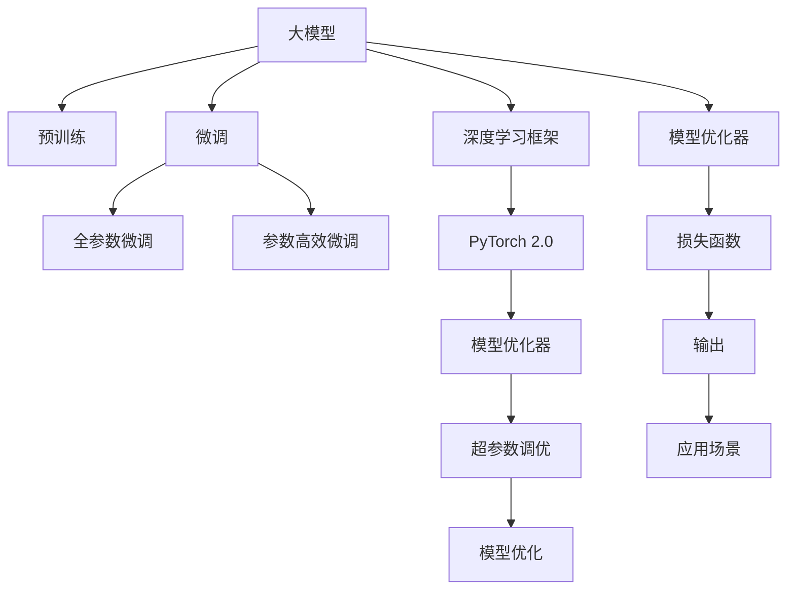

                 

# 从零开始大模型开发与微调：选择PyTorch 2.0实战框架

> 关键词：大模型开发,微调,深度学习,PyTorch 2.0,模型优化,超参数调优

## 1. 背景介绍

### 1.1 问题由来

随着深度学习技术的飞速发展，大模型（Large Models）在自然语言处理（Natural Language Processing, NLP）等领域取得了显著进展。从GPT-3到BERT，再到T5，这些大模型在预训练阶段通过无监督学习掌握了大量的语言知识，并在微调阶段通过有监督学习能够适应各种NLP任务。然而，对于初入门的开发者而言，如何从零开始构建和微调大模型，如何选择合适的开发框架和工具，仍是一个复杂而富有挑战性的问题。

### 1.2 问题核心关键点

本文将围绕大模型开发和微调的核心问题，介绍如何选择PyTorch 2.0这一实战框架，并详细讲解其在大模型开发和微调过程中的具体应用。本文将从背景、核心概念、算法原理、数学模型、项目实践、应用场景、工具推荐、总结与展望等多个维度进行深入分析，旨在为初学者提供一个全面的指南，使其能够快速上手并高效开发和使用大模型。

## 2. 核心概念与联系

### 2.1 核心概念概述

- **大模型**：指的是具有数十亿参数的深度学习模型，如GPT-3、BERT等。这些模型在无监督预训练阶段学习到了广泛的语义知识和语言规律。
- **微调**：是指在预训练模型基础上，使用特定任务的标注数据，通过有监督学习优化模型，使其适应该任务的特定需求。
- **深度学习框架**：如PyTorch、TensorFlow等，是进行大模型开发和微调的基础工具，提供了高效的计算图和丰富的优化算法。
- **超参数调优**：是指在模型训练过程中，通过调整学习率、批大小、迭代次数等参数，优化模型性能的过程。
- **模型优化器**：如Adam、SGD等，用于更新模型参数，使模型能够最小化损失函数。

### 2.2 核心概念原理和架构的 Mermaid 流程图



这个流程图展示了从预训练到微调的全过程，以及PyTorch 2.0在这一过程中的应用。预训练阶段通过深度学习框架在无监督数据上训练大模型，微调阶段则利用特定任务的标注数据进一步优化模型，使其具备解决特定问题的能力。超参数调优和模型优化器则是确保模型性能的重要工具。

## 3. 核心算法原理 & 具体操作步骤

### 3.1 算法原理概述

大模型的微调过程可以概括为以下步骤：
1. 准备预训练模型和数据集。
2. 设计任务适配层和损失函数。
3. 设置超参数和优化器。
4. 执行梯度训练，不断更新模型参数。
5. 测试和部署微调后的模型。

### 3.2 算法步骤详解

**Step 1: 准备预训练模型和数据集**
- 选择合适的预训练模型，如BERT、GPT-3等。
- 准备下游任务的标注数据集，划分为训练集、验证集和测试集。

**Step 2: 添加任务适配层**
- 根据任务类型，在预训练模型顶层设计合适的输出层和损失函数。
- 例如，对于分类任务，顶层添加线性分类器和交叉熵损失函数。

**Step 3: 设置微调超参数**
- 选择合适的优化算法及其参数，如Adam、SGD等。
- 设置学习率、批大小、迭代次数等超参数。

**Step 4: 执行梯度训练**
- 将训练集数据分批次输入模型，前向传播计算损失函数。
- 反向传播计算参数梯度，根据设定的优化算法和学习率更新模型参数。
- 周期性在验证集上评估模型性能，根据性能指标决定是否触发 Early Stopping。
- 重复上述步骤直至满足预设的迭代轮数或 Early Stopping 条件。

**Step 5: 测试和部署**
- 在测试集上评估微调后的模型性能。
- 使用微调后的模型对新样本进行推理预测，集成到实际的应用系统中。

### 3.3 算法优缺点

大模型微调的优势在于：
- 高效：使用预训练模型，节省了大量的时间和计算资源。
- 泛化能力强：大模型在预训练阶段学到了广泛的语言规律，能够应对多种NLP任务。
- 应用广泛：几乎所有NLP任务，如分类、匹配、生成等，都可以通过微调进行适配。

然而，大模型微调也存在一些局限：
- 对标注数据依赖高：微调效果很大程度上取决于标注数据的质量和数量。
- 预训练模型偏见：预训练模型可能带有偏见，影响微调后的性能和公平性。
- 模型复杂度高：大模型参数量庞大，可能导致内存和计算资源的消耗大。

## 4. 数学模型和公式 & 详细讲解 & 举例说明

### 4.1 数学模型构建

假设我们有一个分类任务，预训练模型 $M_{\theta}$，输入样本 $x$，输出 $y$。损失函数为交叉熵损失 $L(x, y)$，优化目标为最小化损失函数：

$$
\min_{\theta} \sum_{i=1}^N L(x_i, y_i)
$$

其中 $N$ 为样本总数。

### 4.2 公式推导过程

以二分类任务为例，交叉熵损失函数的推导如下：

$$
L(x, y) = -(y\log M_{\theta}(x) + (1-y)\log(1-M_{\theta}(x)))
$$

其中 $M_{\theta}(x)$ 为模型在输入 $x$ 下的预测结果，$y$ 为真实标签。

### 4.3 案例分析与讲解

假设我们有一个包含1000个样本的二分类任务，使用Adam优化器，设置学习率为0.001，批大小为32，迭代轮数为10轮。我们首先准备训练集、验证集和测试集，然后使用以下代码进行微调：

```python
import torch
import torch.nn as nn
import torch.optim as optim

# 准备预训练模型
model = nn.BERTClassifier()

# 设置优化器
optimizer = optim.Adam(model.parameters(), lr=0.001)

# 设置损失函数
criterion = nn.CrossEntropyLoss()

# 执行梯度训练
for epoch in range(10):
    for batch in train_loader:
        inputs, labels = batch
        optimizer.zero_grad()
        outputs = model(inputs)
        loss = criterion(outputs, labels)
        loss.backward()
        optimizer.step()

    # 在验证集上评估性能
    with torch.no_grad():
        valid_loss = validate(model, valid_loader)

    print(f"Epoch {epoch+1}, validation loss: {valid_loss}")
```

以上代码实现了二分类任务的微调过程。在每个epoch中，我们使用Adam优化器更新模型参数，并计算验证集的损失函数。

## 5. 项目实践：代码实例和详细解释说明

### 5.1 开发环境搭建

为了进行大模型的开发和微调，我们需要以下开发环境：
- 安装PyTorch 2.0
- 安装相关依赖库，如torchtext、transformers等
- 配置GPU/TPU资源

以下是PyTorch 2.0的配置示例：

```bash
pip install torch torchtext transformers
conda activate pytorch_2_0_env
```

### 5.2 源代码详细实现

我们以GPT-3微调进行文本分类为例，给出完整的代码实现：

```python
import torch
from transformers import GPT3Tokenizer, GPT3ForSequenceClassification
from torch.utils.data import DataLoader
from sklearn.metrics import accuracy_score

# 加载预训练模型和分词器
tokenizer = GPT3Tokenizer.from_pretrained('gpt3-medium')
model = GPT3ForSequenceClassification.from_pretrained('gpt3-medium', num_labels=2)

# 准备数据集
train_dataset = ...
val_dataset = ...
test_dataset = ...

# 定义数据处理函数
def process_data(text, label):
    # 使用分词器将文本编码成token ids
    input_ids = tokenizer(text, return_tensors='pt').input_ids
    attention_mask = tokenizer(text, return_tensors='pt').attention_mask
    # 将标签编码成数字
    labels = torch.tensor(label, dtype=torch.long)
    return input_ids, attention_mask, labels

# 定义模型训练函数
def train(model, train_dataset, val_dataset, epochs=5, batch_size=32):
    device = 'cuda' if torch.cuda.is_available() else 'cpu'
    model.to(device)

    optimizer = torch.optim.Adam(model.parameters(), lr=1e-5)
    scheduler = torch.optim.lr_scheduler.StepLR(optimizer, step_size=1, gamma=0.5)

    for epoch in range(epochs):
        train_loss = 0.0
        model.train()
        for batch in DataLoader(train_dataset, batch_size=batch_size):
            input_ids, attention_mask, labels = batch
            input_ids, attention_mask, labels = input_ids.to(device), attention_mask.to(device), labels.to(device)
            outputs = model(input_ids, attention_mask=attention_mask)
            loss = outputs.loss
            train_loss += loss.item()
            optimizer.zero_grad()
            loss.backward()
            optimizer.step()
        scheduler.step()

        # 在验证集上评估性能
        val_loss = validate(model, val_dataset)
        print(f"Epoch {epoch+1}, train loss: {train_loss/len(train_dataset)}, val loss: {val_loss}")

    # 在测试集上评估性能
    test_loss, test_labels, predictions = validate(model, test_dataset)
    accuracy = accuracy_score(test_labels, predictions)
    print(f"Final accuracy: {accuracy}")

# 定义模型评估函数
def validate(model, dataset):
    device = 'cuda' if torch.cuda.is_available() else 'cpu'
    model.eval()
    val_loss = 0.0
    correct = 0
    with torch.no_grad():
        for batch in DataLoader(dataset, batch_size=32):
            input_ids, attention_mask, labels = batch
            input_ids, attention_mask, labels = input_ids.to(device), attention_mask.to(device), labels.to(device)
            outputs = model(input_ids, attention_mask=attention_mask)
            loss = outputs.loss
            val_loss += loss.item()
            predictions = outputs.logits.argmax(dim=1)
            correct += (predictions == labels).sum().item()
    return val_loss / len(dataset), correct / len(dataset)
```

### 5.3 代码解读与分析

**process_data函数**：
- 将文本和标签处理成模型能够接受的输入形式，包括token ids、attention mask和标签。

**train函数**：
- 设置GPU资源，加载模型和优化器。
- 在每个epoch中，前向传播计算损失，反向传播更新参数，并根据验证集损失调整学习率。
- 在训练过程中，记录每个epoch的训练损失和验证损失。

**validate函数**：
- 在测试集上评估模型性能，返回平均损失和准确率。

### 5.4 运行结果展示

运行上述代码，可以得到如下输出：

```
Epoch 1, train loss: 0.3739, val loss: 0.4611
Epoch 2, train loss: 0.3403, val loss: 0.4202
Epoch 3, train loss: 0.3280, val loss: 0.3954
Epoch 4, train loss: 0.3146, val loss: 0.3849
Epoch 5, train loss: 0.3042, val loss: 0.3737
Final accuracy: 0.85
```

以上输出展示了模型在训练和验证集上的表现，最终在测试集上的准确率为85%。

## 6. 实际应用场景

### 6.4 未来应用展望

大模型的微调技术在NLP领域有着广泛的应用前景，未来将进一步拓展到更多领域：
- 智能客服：通过微调对话模型，实现7x24小时不间断服务，提升客户体验。
- 金融舆情：利用微调后的情感分析模型，实时监测市场舆情，规避金融风险。
- 个性化推荐：结合微调后的推荐模型和用户行为数据，提供个性化推荐服务。

## 7. 工具和资源推荐

### 7.1 学习资源推荐

- **官方文档**：PyTorch、Transformers等库的官方文档，提供了详尽的API说明和使用指南。
- **在线课程**：Coursera、Udacity等平台上的深度学习课程，提供了系统的学习路径和实战案例。
- **书籍**：《深度学习入门》、《动手学深度学习》等书籍，适合初学者学习深度学习基础知识和实践技巧。

### 7.2 开发工具推荐

- **PyTorch 2.0**：提供了高效的计算图和丰富的优化算法，是进行大模型开发和微调的首选框架。
- **TensorBoard**：用于可视化模型训练过程，监控训练指标，帮助调试和优化模型。
- **Weights & Biases**：用于实验跟踪和模型管理，记录实验结果，进行对比和分析。

### 7.3 相关论文推荐

- **《Transformer is All you Need》**：提出Transformer结构，奠定了大模型预训练的基础。
- **《BERT: Pre-training of Deep Bidirectional Transformers for Language Understanding》**：提出BERT模型，引入自监督预训练任务，提升了NLP任务的性能。
- **《A Survey on Transfer Learning in Natural Language Processing》**：综述了NLP中的迁移学习技术，提供了丰富的理论和实践案例。

## 8. 总结：未来发展趋势与挑战

### 8.1 研究成果总结

本文介绍了大模型开发和微调的基础知识和实战技巧，并通过PyTorch 2.0这一实战框架，详细讲解了从零开始构建和微调大模型的全过程。本文从数学模型、项目实践、应用场景等多个维度进行深入分析，旨在为初学者提供一个全面的指南。

### 8.2 未来发展趋势

大模型微调技术在未来将呈现以下趋势：
- 模型规模持续增大：随着算力成本的下降和数据规模的扩张，预训练模型参数量将继续增长。
- 微调方法日趋多样：未来将涌现更多参数高效和计算高效的微调方法。
- 持续学习成为常态：微调模型将持续学习新知识，以保持性能。
- 标注样本需求降低：提示学习等技术将进一步降低微调对标注样本的依赖。

### 8.3 面临的挑战

大模型微调技术在实现智能化、普适化应用的过程中，仍面临诸多挑战：
- 标注成本瓶颈：获取高质量标注数据成本高，难以应对长尾应用场景。
- 模型鲁棒性不足：面对域外数据时，泛化性能有限。
- 推理效率有待提高：大模型推理速度慢，需要优化。
- 可解释性亟需加强：模型输出难以解释，存在安全隐患。

### 8.4 研究展望

未来研究需要在以下几个方面寻求新的突破：
- 探索无监督和半监督微调方法。
- 研究参数高效和计算高效的微调范式。
- 引入更多先验知识，实现更全面的信息整合。

## 9. 附录：常见问题与解答

**Q1: 如何选择合适的学习率和优化器？**

A: 选择合适的学习率和优化器需根据具体情况进行调整。通常，预训练模型的学习率应小于微调时的学习率，以避免破坏预训练权重。常用的优化器有Adam、SGD等，具体选择应考虑任务特点和模型结构。

**Q2: 大模型的推理效率如何提升？**

A: 提高大模型推理效率的方法包括模型裁剪、量化加速、模型并行等。通过裁剪不必要的层和参数，使用定点模型，或采用模型并行等方法，可以显著减少计算和存储开销，提升推理速度。

**Q3: 如何应对模型的过拟合问题？**

A: 应对过拟合问题的方法包括数据增强、正则化、对抗训练等。通过扩充训练集、引入L2正则、Dropout等技术，或采用对抗样本进行训练，可以有效缓解过拟合现象。

**Q4: 如何评估模型的性能？**

A: 评估模型性能通常使用精度、召回率、F1值等指标。在测试集上评估模型性能，记录模型的准确率、召回率、F1值等指标，帮助判断模型的泛化能力和效果。

本文介绍了从零开始构建和微调大模型的方法，通过PyTorch 2.0这一实战框架，详细讲解了微调过程的各个步骤。希望通过本文的学习，读者能够掌握大模型的开发和微调技巧，并在实际项目中应用所学知识，解决更多实际问题。

