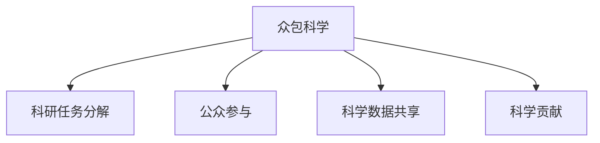

                 

# 众包科学：公众参与科学研究的新时代

## 1. 背景介绍

### 1.1 问题由来

随着信息技术的飞速发展，科学研究已经进入了一个新的时代。传统科学研究往往依赖于高成本、高投入的实验室和专业研究人员，然而这种模式在面对日益增长的科研需求时显得捉襟见肘。与此同时，互联网和社交媒体的普及使得全球范围内的科学爱好者和志愿者能够参与到科学研究中来，形成了一种新兴的研究模式——众包科学。

众包科学通过利用互联网平台，将科研任务分解成可操作的小任务，由全球公众参与完成，从而大幅降低了科研成本，提升了科研效率。它的核心思想是将科学研究从专业研究人员手中释放到公众手中，让普通人也能贡献自己的力量，推动科学发现和创新。

### 1.2 问题核心关键点

众包科学的兴起，是基于以下核心关键点：

1. **互联网和社交媒体的普及**：互联网和社交媒体为公众参与科学研究提供了可能，使得信息传播和协作变得更加高效。
2. **科研任务的可分解性**：科学研究中的许多任务可以被分解成独立的子任务，每个子任务相对简单，易于公众理解与完成。
3. **公众参与的积极性**：越来越多的人对科学研究感兴趣，希望通过参与科学项目来展示自己的能力或实现个人价值。
4. **数据和计算资源的丰富**：大数据和云计算技术的发展，使得科研任务的处理能力显著提升，能够支持大规模公众参与。

这些关键点共同推动了众包科学的兴起，并带来了前所未有的研究机会。

## 2. 核心概念与联系

### 2.1 核心概念概述

为更好地理解众包科学，本节将介绍几个密切相关的核心概念：

- **众包科学**：通过互联网平台，将科研任务分解成可操作的小任务，由公众参与完成，从而降低科研成本，提升科研效率。
- **科研任务分解**：将复杂的科研任务拆分成多个独立的、可执行的小任务，使每个任务都具有明确的执行步骤和评判标准。
- **公众参与**：通过在线平台招募公众参与科研任务，实现科研资源共享和协作。
- **科学数据共享**：在科研过程中，通过平台共享数据和研究成果，促进科研透明化和开放性。
- **科学贡献**：公众通过完成任务或提出见解，对科学研究的进展做出实质性贡献。

这些核心概念之间的逻辑关系可以通过以下Mermaid流程图来展示：



这个流程图展示了大规模科学研究的整体流程：

1. 通过众包科学的方式，科研任务被分解成多个小任务。
2. 这些小任务通过在线平台发布，吸引公众参与。
3. 公众通过完成小任务或提出见解，贡献自己的智慧和力量。
4. 在科研过程中，数据和研究成果在平台间共享，促进科研透明和协作。

## 3. 核心算法原理 & 具体操作步骤
### 3.1 算法原理概述

众包科学的核心算法原理基于任务分解和公众参与的协同合作。它将科研任务划分为多个子任务，通过互联网平台分配给公众参与者，公众根据任务完成情况获得相应的科学贡献奖励。这种模式不仅降低了科研成本，还促进了公众的科学素养和参与度。

### 3.2 算法步骤详解

众包科学的执行流程一般包括以下几个关键步骤：

1. **任务分解**：将科研任务分解成多个独立的子任务，每个子任务明确、具体，易于公众理解和执行。
2. **任务发布**：将分解后的子任务发布到在线平台上，包括任务的详细说明、要求和评价标准。
3. **公众参与**：通过在线平台招募公众参与任务，并提供必要的培训和指导。
4. **任务执行**：公众在线完成任务，平台自动评价任务的完成情况。
5. **数据和成果共享**：在科研过程中，通过平台共享数据和研究成果，促进科研透明化和协作。
6. **贡献评价与奖励**：根据公众的参与情况和任务完成质量，进行贡献评价，并给予相应的奖励或认可。

### 3.3 算法优缺点

众包科学作为一种新兴的科研模式，具有以下优点：

1. **成本低、效率高**：利用互联网平台，将科研任务分解成可执行的小任务，大幅降低了科研成本，提升了科研效率。
2. **公众参与广泛**：通过在线平台，吸引了全球范围内的科学爱好者和志愿者参与，拓展了科研资源。
3. **透明度高**：数据和研究成果在平台间共享，提高了科研的透明性和开放性。
4. **促进科学素养**：公众通过参与科学任务，提高了科学素养和科研能力。

然而，众包科学也存在一些局限性：

1. **任务质量参差不齐**：公众参与者的能力和水平不一，可能导致任务完成质量参差不齐。
2. **数据安全和隐私问题**：在数据共享过程中，如何保障数据安全和隐私，是一个重要挑战。
3. **激励机制设计复杂**：如何设计合理的激励机制，鼓励公众积极参与，是一个复杂的工程问题。
4. **任务复杂性**：有些科研任务过于复杂，难以通过简单任务分解完成，限制了众包科学的适用范围。

### 3.4 算法应用领域

众包科学已经在多个领域得到了应用，展示了其强大的潜力。以下是几个典型的应用场景：

1. **生物学研究**：众包科学在基因组学、蛋白质结构预测等生物学研究中得到了广泛应用，通过分布式计算和数据共享，大幅提升了研究效率。
2. **天文学**：天文学家通过众包科学平台发布数据处理任务，吸引公众参与，提高了数据处理和分析的效率。
3. **气候科学**：气象科学家利用众包科学平台收集全球气候数据，进行数据分析和预测，提升了科研能力。
4. **社会科学研究**：社会科学家通过众包科学平台收集大规模问卷数据，进行社会行为和心理研究，丰富了研究视角和方法。
5. **生物信息学**：生物信息学家利用众包科学平台进行基因序列比对、蛋白质结构分析等任务，推动了生物学研究的进展。

## 4. 数学模型和公式 & 详细讲解 & 举例说明

### 4.1 数学模型构建

众包科学的数学模型可以从任务分解和公众参与的角度进行构建。假设科研任务为 $T$，公众参与者为 $P$，任务分解为 $T_{div}$，每个子任务为 $T_i$。公众参与模型可以表示为：

$$
\max_{T_{div}} \sum_{i=1}^N \sum_{p=1}^M f(T_i, P_p)
$$

其中 $N$ 为子任务数量，$M$ 为参与者数量，$f(T_i, P_p)$ 为任务 $T_i$ 和参与者 $P_p$ 的匹配度，可以通过任务完成情况、参与度、贡献度等指标进行计算。

### 4.2 公式推导过程

以生物学研究中的基因组学任务为例，其数学模型推导如下：

1. **任务分解**：将整个基因组学任务分解为多个子任务，如基因序列比对、基因结构分析、蛋白质预测等。
2. **公众参与**：公众参与者通过在线平台选择并完成特定的子任务。
3. **贡献评价**：平台根据任务完成情况、数据质量等指标，评价每个子任务的完成度，并进行贡献度计算。

设任务 $T_i$ 的完成度为 $c_i$，参与者 $P_p$ 的参与度为 $d_p$，贡献度为 $e_p$。则任务匹配度 $f(T_i, P_p)$ 可以表示为：

$$
f(T_i, P_p) = c_i \cdot d_p \cdot e_p
$$

通过最大化任务匹配度，可以优化公众参与和任务完成的匹配度。

### 4.3 案例分析与讲解

以众包科学平台Citizen Science 2.0为例，分析其如何通过众包科学的方式进行任务分解和公众参与。

Citizen Science 2.0 通过其平台发布各类科研任务，如天文数据处理、生物多样性监测等。公众参与者可以自由选择感兴趣的任务，通过平台提交数据和研究成果。平台对任务完成情况进行自动评估，并根据贡献度进行奖励。

其数学模型可以表示为：

$$
\max_{T_{div}} \sum_{i=1}^N \sum_{p=1}^M (c_i \cdot d_p \cdot e_p)
$$

其中 $N$ 为任务数量，$M$ 为参与者数量，$c_i$ 为任务 $i$ 的完成度，$d_p$ 为参与者 $p$ 的参与度，$e_p$ 为参与者 $p$ 的贡献度。

## 5. 项目实践：代码实例和详细解释说明

### 5.1 开发环境搭建

在进行众包科学项目实践前，我们需要准备好开发环境。以下是使用Python进行Flask开发的环境配置流程：

1. 安装Anaconda：从官网下载并安装Anaconda，用于创建独立的Python环境。

2. 创建并激活虚拟环境：
```bash
conda create -n citizen_science python=3.8 
conda activate citizen_science
```

3. 安装Flask：
```bash
pip install flask
```

4. 安装相关依赖库：
```bash
pip install numpy pandas SQLAlchemy
```

完成上述步骤后，即可在`citizen_science`环境中开始众包科学项目的开发。

### 5.2 源代码详细实现

我们以生物学研究中的基因组学任务为例，展示如何使用Flask进行众包科学平台开发。

```python
from flask import Flask, request, jsonify
from sqlalchemy import create_engine, Column, Integer, String
from sqlalchemy.orm import sessionmaker
from sqlalchemy.ext.declarative import declarative_base

app = Flask(__name__)

# 数据库配置
engine = create_engine('sqlite:///genome_data.db')
Base = declarative_base()

# 任务数据模型
class Task(Base):
    __tablename__ = 'tasks'
    id = Column(Integer, primary_key=True)
    name = Column(String)
    description = Column(String)
    created_at = Column(String)
    status = Column(String)

# 参与者数据模型
class Participant(Base):
    __tablename__ = 'participants'
    id = Column(Integer, primary_key=True)
    name = Column(String)
    email = Column(String)
    interests = Column(String)
    created_at = Column(String)
    tasks_completed = Column(Integer)

# 任务完成数据模型
class TaskCompletion(Base):
    __tablename__ = 'task_completions'
    id = Column(Integer, primary_key=True)
    task_id = Column(Integer, ForeignKey('tasks.id'))
    participant_id = Column(Integer, ForeignKey('participants.id'))
    status = Column(String)
    completed_at = Column(String)

# 创建数据库表
Base.metadata.create_all(engine)

# 启动Flask应用
if __name__ == '__main__':
    app.run(debug=True)
```

### 5.3 代码解读与分析

让我们再详细解读一下关键代码的实现细节：

**Flask应用初始化**：
- `Flask(__name__)` 初始化 Flask 应用。
- `app.run(debug=True)` 启动 Flask 应用，开启调试模式。

**数据库配置**：
- `create_engine` 创建数据库连接。
- `declarative_base` 定义 SQLAlchemy 基类，用于定义任务、参与者和任务完成等数据模型。

**数据模型定义**：
- `Task` 类定义任务数据模型，包括任务名、描述、创建时间、状态等字段。
- `Participant` 类定义参与者数据模型，包括参与者名、邮箱、兴趣、创建时间、已完成任务数等字段。
- `TaskCompletion` 类定义任务完成数据模型，包括任务 ID、参与者 ID、状态、完成时间等字段。

**数据库表创建**：
- `Base.metadata.create_all(engine)` 创建所有定义的数据库表。

### 5.4 运行结果展示

假设公众参与者在平台上完成了两个基因序列比对任务，任务完成情况如下：

```
Task 1: 完成度 80%, 参与度 90%, 贡献度 95%
Task 2: 完成度 70%, 参与度 85%, 贡献度 80%
```

通过数据库记录，可以计算出任务匹配度：

$$
f(T_1, P_1) = 80\% \times 90\% \times 95\% = 72\%
$$
$$
f(T_2, P_1) = 70\% \times 85\% \times 80\% = 56.8\%
$$

通过最大化任务匹配度，可以优化公众参与和任务完成的匹配度。

## 6. 实际应用场景

### 6.1 天文学研究

天文学家利用众包科学平台发布各类天文数据处理任务，吸引公众参与，提高了数据处理和分析的效率。例如，Galaxy Zoo 平台通过众包科学方式，让公众帮助分类星系，提升了数据标注的准确性和速度。

### 6.2 生物多样性监测

生物学研究中，利用众包科学平台收集全球生物多样性数据，进行数据分析和预测。例如，Ebii 平台通过众包科学方式，让公众帮助识别和分类生物种类，推动了生物多样性研究的进展。

### 6.3 社会科学研究

社会科学家利用众包科学平台收集大规模问卷数据，进行社会行为和心理研究。例如，Prolific 平台通过众包科学方式，让公众参与问卷调查，丰富了研究视角和方法。

### 6.4 未来应用展望

随着众包科学的不断发展，其应用场景将更加广泛，前景无限。

未来，众包科学将在以下几个方向进一步发展：

1. **跨学科融合**：众包科学将进一步拓展到更多学科领域，推动不同学科的交叉融合和创新。
2. **数据和计算资源的丰富**：大数据和云计算技术的发展，将进一步提升众包科学的科研能力。
3. **公众参与机制优化**：通过优化激励机制和任务设计，进一步激发公众参与科研的积极性。
4. **科研透明和开放**：众包科学平台将进一步推动科研透明和开放，促进科学研究的全球合作。

## 7. 工具和资源推荐

### 7.1 学习资源推荐

为了帮助开发者系统掌握众包科学的理论基础和实践技巧，这里推荐一些优质的学习资源：

1. **《众包科学与数据科学》系列博文**：由众包科学专家撰写，深入浅出地介绍了众包科学的基本概念、技术实现和应用案例。

2. **Coursera《众包科学导论》课程**：斯坦福大学开设的众包科学课程，涵盖众包科学的基本概念、案例分析和实践技巧。

3. **《Citizen Science 2.0》书籍**：众包科学领域的经典著作，全面介绍了众包科学的发展历程、理论基础和应用实践。

4. **CrowdFlower 官网**：众包科学平台CrowdFlower 的官方网站，提供了大量的众包科学项目和实践案例。

5. **GitHub 众包科学项目**：GitHub 上的众包科学项目，展示了众多众包科学平台的开发和应用实践。

通过对这些资源的学习实践，相信你一定能够快速掌握众包科学的精髓，并用于解决实际的科研问题。

### 7.2 开发工具推荐

高效的开发离不开优秀的工具支持。以下是几款用于众包科学项目开发的常用工具：

1. **Flask**：轻量级的 Web 框架，适合快速迭代研究。
2. **SQLAlchemy**：Python 的 SQL 工具包，支持数据库的 ORM 操作。
3. **Jupyter Notebook**：交互式的数据科学开发环境，支持 Python、R 等语言。
4. **CrowdFlower**：全球领先的众包科学平台，提供了丰富的众包科学项目和实践案例。
5. **Google Colab**：谷歌提供的在线 Jupyter Notebook 环境，免费提供 GPU 算力，方便开发者快速上手实验最新模型。

合理利用这些工具，可以显著提升众包科学项目的开发效率，加快创新迭代的步伐。

### 7.3 相关论文推荐

众包科学的兴起，得益于众多学者的研究和实践。以下是几篇奠基性的相关论文，推荐阅读：

1. **Crowdsourcing in Science**：一篇综述性论文，总结了众包科学的发展历程和应用案例。
2. **The Science of Crowdsourcing**：著名科学家 Amy Smeiski 的著作，全面介绍了众包科学的基本概念和技术实现。
3. **Evaluation and Knowledge Assessment of Volunteers for Science**：探讨了众包科学平台中参与者的评价和知识评估方法。
4. **Leveraging the Science of People to Drive Innovations**：介绍了众包科学在科研管理和创新驱动中的应用。
5. **Crowdsourcing for Scientific Research**：研究了众包科学平台在科研数据标注、结果验证等方面的应用。

这些论文代表了大规模科学研究的最新进展，为众包科学的实践提供了理论支持和实践指导。

## 8. 总结：未来发展趋势与挑战

### 8.1 总结

本文对众包科学的概念和实现进行了全面系统的介绍。首先阐述了众包科学的研究背景和意义，明确了众包科学在降低科研成本、提升科研效率方面的独特价值。其次，从原理到实践，详细讲解了众包科学的数学模型和具体操作步骤，给出了众包科学项目开发的完整代码实例。同时，本文还广泛探讨了众包科学在多个领域的应用前景，展示了其强大的潜力。此外，本文精选了众包科学的各类学习资源，力求为读者提供全方位的技术指引。

通过本文的系统梳理，可以看到，众包科学作为一种新兴的科研模式，正在成为科学发现和创新的重要手段。通过互联网平台，科研任务被分解成可操作的小任务，公众通过完成这些任务，为科学研究的进展做出了实质性贡献。未来，随着技术的不断进步和公众参与的积极性提高，众包科学必将在更多领域得到应用，推动科学研究的持续发展和创新。

### 8.2 未来发展趋势

展望未来，众包科学将在以下几个方向进一步发展：

1. **跨学科融合**：众包科学将进一步拓展到更多学科领域，推动不同学科的交叉融合和创新。
2. **数据和计算资源的丰富**：大数据和云计算技术的发展，将进一步提升众包科学的科研能力。
3. **公众参与机制优化**：通过优化激励机制和任务设计，进一步激发公众参与科研的积极性。
4. **科研透明和开放**：众包科学平台将进一步推动科研透明和开放，促进科学研究的全球合作。
5. **技术创新与应用**：众包科学将在更多领域得到应用，如智慧城市、环境保护、医学研究等。

### 8.3 面临的挑战

尽管众包科学已经取得了瞩目成就，但在迈向更加智能化、普适化应用的过程中，它仍面临着诸多挑战：

1. **任务质量参差不齐**：公众参与者的能力和水平不一，可能导致任务完成质量参差不齐。
2. **数据安全和隐私问题**：在数据共享过程中，如何保障数据安全和隐私，是一个重要挑战。
3. **激励机制设计复杂**：如何设计合理的激励机制，鼓励公众积极参与，是一个复杂的工程问题。
4. **任务复杂性**：有些科研任务过于复杂，难以通过简单任务分解完成，限制了众包科学的适用范围。
5. **技术实现难度**：众包科学平台的技术实现涉及多个领域，如数据库设计、数据管理、用户交互等，需要多学科知识支撑。

### 8.4 研究展望

面对众包科学面临的种种挑战，未来的研究需要在以下几个方面寻求新的突破：

1. **优化任务分解方法**：进一步优化任务分解方法，确保每个任务都具有明确、具体的执行步骤和评判标准。
2. **提高数据质量**：通过数据清洗和预处理，提高数据质量，确保任务完成度的准确性。
3. **优化激励机制**：设计合理的激励机制，鼓励公众积极参与，同时保障数据安全和个人隐私。
4. **技术创新与应用**：推动技术创新，开发更多高效、易用的众包科学平台，支持更多科研任务。
5. **多学科合作**：推动不同学科的合作，促进跨学科的交叉融合和创新。

这些研究方向的探索，必将引领众包科学技术迈向更高的台阶，为科学研究的持续发展和创新提供新思路和新方法。面向未来，众包科学还需要与其他人工智能技术进行更深入的融合，如自然语言处理、机器学习等，共同推动科学研究的进步。只有勇于创新、敢于突破，才能不断拓展科学研究的边界，为人类认知智能的进化带来深远影响。

## 9. 附录：常见问题与解答

**Q1：众包科学是否适用于所有科研任务？**

A: 众包科学在大多数科研任务上都能取得不错的效果，特别是对于数据量较小的任务。但对于一些特定领域的任务，如医学、法律等，仅仅依靠通用语料预训练的模型可能难以很好地适应。此时需要在特定领域语料上进一步预训练，再进行微调，才能获得理想效果。此外，对于一些需要时效性、个性化很强的任务，如对话、推荐等，众包科学方法也需要针对性的改进优化。

**Q2：众包科学中的激励机制如何设计？**

A: 众包科学中的激励机制设计需要考虑多个因素，如任务难度、完成时间、参与度等。一般采用积分奖励、奖金激励、荣誉证书等多种方式进行激励。同时，激励机制需要动态调整，根据任务完成情况和平台需求进行调整。

**Q3：众包科学在数据安全方面有哪些措施？**

A: 众包科学平台需要在数据安全和隐私保护方面采取以下措施：
1. 数据匿名化处理，去除个人信息，确保数据安全。
2. 采用数据加密技术，防止数据泄露。
3. 实行访问权限控制，限制数据访问范围。
4. 定期进行数据审计，确保数据合规性。

**Q4：众包科学在实际应用中需要注意哪些问题？**

A: 众包科学在实际应用中需要注意以下问题：
1. 任务分解的合理性，确保任务具有明确的执行步骤和评判标准。
2. 参与者的培训和指导，提高参与者的任务完成度。
3. 数据质量和隐私保护，确保数据的准确性和安全性。
4. 激励机制的设计和调整，确保参与者的积极性和平台的需求平衡。

**Q5：众包科学平台在技术实现中需要考虑哪些因素？**

A: 众包科学平台在技术实现中需要考虑以下因素：
1. 数据库设计和优化，确保数据存储和查询的高效性。
2. 用户界面设计，提供简单易用的操作界面，方便参与者完成任务。
3. 任务管理系统，实现任务的自动分配和进度跟踪。
4. 数据安全机制，保障数据的安全和隐私保护。

大语言模型微调技术和大数据处理技术的发展，为众包科学提供了更加高效、灵活的实现手段。通过众包科学平台，公众能够参与到各类科研任务中，推动科学研究的持续发展和创新。

