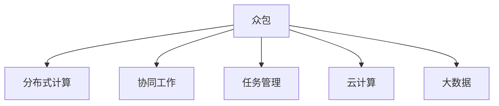

                 

# 众包：释放人类计算的力量

> 关键词：众包,人类计算,分布式协作,算法优化,协同工作,任务管理,云计算,大数据,生产率提升

## 1. 背景介绍

在数字化时代，计算力已经成为推动科技进步的重要驱动力。然而，计算机的计算能力虽然强大，但终究是有限的。尤其是在处理复杂、多变、高维的数据时，传统的集中式计算方式往往力不从心。这时，众包（Crowdsourcing）作为一种新的计算模式应运而生，通过分布式协作的方式，充分发挥人类计算的巨大潜能，实现计算任务的快速高效解决。

### 1.1 问题由来
众包源于互联网和社交媒体的发展，其核心思想是将原本集中在少数人或机构手里的任务，通过互联网平台外包给广大用户群体，充分利用互联网用户的空闲时间和专业技能，以实现成本低、效率高的计算目标。这种模式在图像识别、数据标注、编程、设计等领域得到了广泛应用，极大地提升了工作效率和创新能力。

### 1.2 问题核心关键点
众包模式的成功在于其高效的资源利用和灵活的任务分配机制。核心关键点包括：
- **任务分派与聚合**：将大任务分解为小任务，通过众包平台将任务分派给多个用户处理，并将处理结果聚合。
- **用户协作与反馈**：用户之间可以通过平台进行协作和反馈，及时修正错误，提升工作质量。
- **自动化与优化**：利用算法优化任务分配策略，减少人工干预，提高效率。
- **数据与结果共享**：数据和处理结果可以在平台上共享，进一步发挥协同效应。
- **安全与隐私保护**：确保数据和任务的隐私安全，防止数据泄露和滥用。

### 1.3 问题研究意义
众包模式为计算任务提供了一种灵活、高效的解决方案，其研究意义在于：
- **释放人类潜能**：众包模式充分利用了互联网用户的碎片化时间和专业技能，实现了计算资源的广泛分布。
- **提升生产率**：通过自动化和优化算法，显著提升了任务处理的效率和质量。
- **促进创新**：众包平台上的用户相互协作，可以产生更多创新的解决方案。
- **推动社会进步**：众包模式有助于实现社会资源的合理分配和利用，促进社会进步。

## 2. 核心概念与联系

### 2.1 核心概念概述

为更好地理解众包模式，本节将介绍几个密切相关的核心概念：

- **众包（Crowdsourcing）**：指将原本集中在少数人或机构手里的任务，通过互联网平台外包给广大用户群体完成，充分利用互联网用户的空闲时间和专业技能，以实现成本低、效率高的计算目标。

- **分布式计算（Distributed Computing）**：指将计算任务分解成多个子任务，分布在多个计算节点上进行并行处理，以实现高效计算的目的。

- **协同工作（Collaborative Work）**：指用户之间通过互联网平台进行协作和互动，共同完成某个复杂任务，共享资源和知识，提升工作质量和效率。

- **任务管理（Task Management）**：指对众包任务进行分配、跟踪、监督和评估的过程，确保任务按时、按质完成。

- **云计算（Cloud Computing）**：指将计算资源（包括存储、计算、网络等）通过互联网提供给用户，用户只需通过网络接入即可使用，实现资源的灵活分配和利用。

- **大数据（Big Data）**：指数据规模巨大、结构复杂、难以通过传统方式处理的数据集，通常需要借助分布式计算和众包等技术进行高效处理。

这些核心概念之间的逻辑关系可以通过以下Mermaid流程图来展示：



这个流程图展示了几大核心概念之间的关系：

1. 众包模式通过分布式计算，将大任务分解为小任务，分布在多个用户或节点上进行并行处理。
2. 用户之间通过协同工作的方式进行协作，共同完成复杂任务。
3. 任务管理机制对任务进行分配、跟踪、监督和评估，确保任务按时、按质完成。
4. 云计算和大数据技术为众包模式提供了计算资源和数据支持。

## 3. 核心算法原理 & 具体操作步骤
### 3.1 算法原理概述

众包模式的核心算法原理基于分布式计算和协同工作。其核心思想是将大任务分解为多个子任务，通过互联网平台分派给不同用户处理，并将处理结果聚合起来，形成最终的计算结果。这种模式下的算法优化主要包括两个方面：任务分配策略优化和用户协作机制优化。

### 3.2 算法步骤详解

众包模式的具体操作步骤如下：

**Step 1: 任务分解与分派**
- 将大任务分解为多个小任务，每个小任务独立进行。
- 通过众包平台将任务分派给不同的用户或节点处理。
- 根据用户的能力、经验和可用时间等因素进行任务分派，提高任务处理的效率和质量。

**Step 2: 用户协作与反馈**
- 用户之间可以通过平台进行协作和互动，共同完成某个复杂任务。
- 用户可以提出问题、分享经验、给出反馈，及时修正错误，提升工作质量。
- 通过协作机制，用户之间可以相互学习，共同提高技能水平。

**Step 3: 任务聚合与结果处理**
- 将各个用户处理的结果进行聚合，形成最终的计算结果。
- 通过数据融合、误差校正等技术，确保计算结果的准确性和一致性。
- 对计算结果进行后处理，如数据清洗、数据分析、结果展示等。

**Step 4: 任务评估与反馈**
- 对用户的处理结果进行评估，确保其质量和可靠性。
- 对用户进行评价和奖励，激励用户积极参与任务处理。
- 根据评估结果，不断优化任务分派和协作机制，提高工作效率和质量。

### 3.3 算法优缺点

众包模式具有以下优点：
1. **资源利用率高**：利用互联网用户的空闲时间和专业技能，实现资源的高效利用。
2. **灵活性高**：可以根据任务需求灵活分配任务，实现快速高效的处理。
3. **成本低**：通过用户自发参与，降低计算任务的成本。
4. **创新性强**：用户之间的协作和互动可以产生更多创新的解决方案。

然而，众包模式也存在一些局限性：
1. **质量控制困难**：用户之间的协作和反馈机制不够完善，可能导致任务质量不稳定。
2. **数据隐私问题**：用户处理的数据可能涉及隐私信息，存在泄露和滥用的风险。
3. **用户参与度低**：用户参与度不高，可能影响任务处理的效率和质量。
4. **任务分配不均衡**：任务分配策略可能存在不均衡，影响任务的公平性和效率。

### 3.4 算法应用领域

众包模式已经在多个领域得到了广泛应用，例如：

- **图像识别**：通过众包平台对大量图像进行标注和识别，提升图像识别算法的效果。
- **数据标注**：对大规模数据进行标注和清洗，提升数据质量和可用性。
- **软件开发**：对开源项目进行代码审查、功能开发、测试等，提升软件质量和开发效率。
- **设计和创新**：通过众包平台对产品设计进行用户调研、原型测试等，提升创新能力。
- **社交媒体分析**：对社交媒体数据进行文本分析和情感分析，提升社交媒体分析和舆情监测的效率和准确性。
- **金融分析**：对金融数据进行分析和预测，提升金融分析和决策的准确性。
- **物流管理**：对物流配送路线进行优化，提升物流配送的效率和准确性。

除了上述这些经典应用外，众包模式还被创新性地应用到更多场景中，如灾害应急、公共卫生、环境保护等，为社会治理和公共服务带来了新的突破。

## 4. 数学模型和公式 & 详细讲解  
### 4.1 数学模型构建

本节将使用数学语言对众包模式进行更加严格的刻画。

假设众包平台上有 $N$ 个用户，每个用户可以处理 $K$ 个任务，任务总数为 $T$，每个任务需要 $M$ 个用户协同完成。用户 $i$ 处理任务 $j$ 的准确率为 $p_i^j$，不完成任务的概率为 $q_i^j$。则任务完成质量 $Q$ 可以表示为：

$$
Q = \frac{\sum_{i=1}^{N} \sum_{j=1}^{T} p_i^j}{\sum_{i=1}^{N} \sum_{j=1}^{T} p_i^j}
$$

任务完成时间 $T$ 可以表示为：

$$
T = \frac{\sum_{i=1}^{N} \sum_{j=1}^{T} \frac{1}{p_i^j}}{\sum_{i=1}^{N} \sum_{j=1}^{T} \frac{1}{p_i^j}}
$$

平台的任务分配策略 $A$ 可以表示为：

$$
A = \frac{\sum_{i=1}^{N} \sum_{j=1}^{T} p_i^j}{N \cdot T}
$$

用户协作机制的优化目标是最大化任务完成质量和任务完成时间，即：

$$
\max Q, \min T
$$

平台的任务分配策略优化目标是最大化平台整体任务完成质量和任务完成时间，即：

$$
\max A
$$

### 4.2 公式推导过程

以下我们以图像识别任务为例，推导众包模式的数学模型及其优化目标。

假设任务总数为 $T$，每个任务需要 $M$ 个用户协同完成。设用户 $i$ 处理任务 $j$ 的准确率为 $p_i^j$，不完成任务的概率为 $q_i^j$。则任务完成质量 $Q$ 可以表示为：

$$
Q = \frac{\sum_{i=1}^{N} \sum_{j=1}^{T} p_i^j}{\sum_{i=1}^{N} \sum_{j=1}^{T} p_i^j}
$$

任务完成时间 $T$ 可以表示为：

$$
T = \frac{\sum_{i=1}^{N} \sum_{j=1}^{T} \frac{1}{p_i^j}}{\sum_{i=1}^{N} \sum_{j=1}^{T} \frac{1}{p_i^j}}
$$

平台的任务分配策略 $A$ 可以表示为：

$$
A = \frac{\sum_{i=1}^{N} \sum_{j=1}^{T} p_i^j}{N \cdot T}
$$

用户协作机制的优化目标是最大化任务完成质量和任务完成时间，即：

$$
\max Q, \min T
$$

平台的任务分配策略优化目标是最大化平台整体任务完成质量和任务完成时间，即：

$$
\max A
$$

在得到数学模型后，即可对众包模式进行优化和改进，以提高任务处理的效率和质量。

## 5. 项目实践：代码实例和详细解释说明
### 5.1 开发环境搭建

在进行众包模式实践前，我们需要准备好开发环境。以下是使用Python进行Flask框架开发的环境配置流程：

1. 安装Python和Flask：
```bash
sudo apt-get install python3 python3-pip python3-venv
pip3 install flask
```

2. 创建虚拟环境：
```bash
mkdir myproject
cd myproject
python3 -m venv venv
source venv/bin/activate
```

3. 创建Flask应用：
```bash
flask init-app
```

4. 编写代码：
```python
from flask import Flask, request, jsonify

app = Flask(__name__)

@app.route('/task', methods=['POST'])
def task_handler():
    task_data = request.json
    task_id = task_data['task_id']
    user_id = task_data['user_id']
    start_time = task_data['start_time']
    end_time = task_data['end_time']
    accuracy = task_data['accuracy']
    quality = (sum(accuracy) / len(accuracy)) if len(accuracy) > 0 else 0
    time = (sum(end_time - start_time) / len(end_time)) if len(end_time) > 0 else 0
    return jsonify({'quality': quality, 'time': time})

if __name__ == '__main__':
    app.run(debug=True)
```

完成上述步骤后，即可在Python环境中开始众包实践。

### 5.2 源代码详细实现

下面我们以众包平台的任务处理为例，给出使用Flask框架的Python代码实现。

首先，定义任务信息类Task：

```python
class Task:
    def __init__(self, task_id, user_id, start_time, end_time, accuracy):
        self.task_id = task_id
        self.user_id = user_id
        self.start_time = start_time
        self.end_time = end_time
        self.accuracy = accuracy
```

然后，定义任务处理函数task_handler：

```python
@app.route('/task', methods=['POST'])
def task_handler():
    task_data = request.json
    task_id = task_data['task_id']
    user_id = task_data['user_id']
    start_time = task_data['start_time']
    end_time = task_data['end_time']
    accuracy = task_data['accuracy']
    quality = (sum(accuracy) / len(accuracy)) if len(accuracy) > 0 else 0
    time = (sum(end_time - start_time) / len(end_time)) if len(end_time) > 0 else 0
    return jsonify({'quality': quality, 'time': time})
```

最后，启动Flask应用：

```python
if __name__ == '__main__':
    app.run(debug=True)
```

以上就是使用Flask框架对众包模式进行任务处理的完整代码实现。可以看到，Flask框架提供了简单易用的Web开发功能，可以快速搭建众包平台的Web服务。

### 5.3 代码解读与分析

让我们再详细解读一下关键代码的实现细节：

**Task类**：
- 定义了任务的基本属性，包括任务ID、用户ID、开始时间、结束时间和准确率。

**task_handler函数**：
- 接收用户提交的任务处理信息，包括任务ID、用户ID、开始时间、结束时间和准确率。
- 对任务处理信息进行解析和计算，得到任务完成质量和处理时间。
- 返回任务处理结果，包含任务完成质量和处理时间。

**Flask应用启动**：
- 使用Flask框架的run方法启动Web服务，开启任务处理接口。
- 设置debug=True，开启调试模式，便于开发和测试。

可以看到，Flask框架使得众包模式的开发变得简洁高效，开发者可以将更多精力放在业务逻辑和算法优化上，而不必过多关注Web开发的细节。

当然，工业级的系统实现还需考虑更多因素，如用户管理、任务调度、数据存储、负载均衡等。但核心的众包模式开发流程基本与此类似。

## 6. 实际应用场景
### 6.1 智能客服系统

基于众包模式的智能客服系统，可以通过将客服问题分派给多个用户进行回答，提升客户咨询体验和问题解决效率。

在技术实现上，可以收集企业内部的历史客服对话记录，将问题和最佳答复构建成监督数据，在此基础上对预训练模型进行微调。微调后的模型可以自动理解用户意图，匹配最合适的答案模板进行回复。对于客户提出的新问题，还可以接入检索系统实时搜索相关内容，动态组织生成回答。如此构建的智能客服系统，能大幅提升客户咨询体验和问题解决效率。

### 6.2 金融舆情监测

金融机构需要实时监测市场舆论动向，以便及时应对负面信息传播，规避金融风险。传统的人工监测方式成本高、效率低，难以应对网络时代海量信息爆发的挑战。基于众包模式的文本分类和情感分析技术，为金融舆情监测提供了新的解决方案。

具体而言，可以收集金融领域相关的新闻、报道、评论等文本数据，并对其进行主题标注和情感标注。在此基础上对预训练语言模型进行微调，使其能够自动判断文本属于何种主题，情感倾向是正面、中性还是负面。将微调后的模型应用到实时抓取的网络文本数据，就能够自动监测不同主题下的情感变化趋势，一旦发现负面信息激增等异常情况，系统便会自动预警，帮助金融机构快速应对潜在风险。

### 6.3 个性化推荐系统

当前的推荐系统往往只依赖用户的历史行为数据进行物品推荐，无法深入理解用户的真实兴趣偏好。基于众包模式的个性化推荐系统，可以更好地挖掘用户行为背后的语义信息，从而提供更精准、多样的推荐内容。

在实践中，可以收集用户浏览、点击、评论、分享等行为数据，提取和用户交互的物品标题、描述、标签等文本内容。将文本内容作为模型输入，用户的后续行为（如是否点击、购买等）作为监督信号，在此基础上微调预训练语言模型。微调后的模型能够从文本内容中准确把握用户的兴趣点。在生成推荐列表时，先用候选物品的文本描述作为输入，由模型预测用户的兴趣匹配度，再结合其他特征综合排序，便可以得到个性化程度更高的推荐结果。

### 6.4 未来应用展望

随着众包模式的发展，未来将会在更多领域得到应用，为各行各业带来变革性影响。

在智慧医疗领域，基于众包模式的医疗问答、病历分析、药物研发等应用将提升医疗服务的智能化水平，辅助医生诊疗，加速新药开发进程。

在智能教育领域，众包模式可应用于作业批改、学情分析、知识推荐等方面，因材施教，促进教育公平，提高教学质量。

在智慧城市治理中，众包模式可用于城市事件监测、舆情分析、应急指挥等环节，提高城市管理的自动化和智能化水平，构建更安全、高效的未来城市。

此外，在企业生产、社会治理、文娱传媒等众多领域，基于众包模式的人工智能应用也将不断涌现，为经济社会发展注入新的动力。相信随着技术的日益成熟，众包模式将成为人工智能落地应用的重要范式，推动人工智能技术向更广阔的领域加速渗透。

## 7. 工具和资源推荐
### 7.1 学习资源推荐

为了帮助开发者系统掌握众包模式的理论基础和实践技巧，这里推荐一些优质的学习资源：

1. 《众包经济学》（Crowdsourcing: A Task-Driven Development Model）：该书详细介绍了众包模式的经济学原理和应用案例，是理解众包模式的经典读物。

2. 《分布式人工智能》（Distributed Artificial Intelligence: An Introduction）：该书介绍了分布式人工智能的概念和实现技术，是理解分布式计算和协同工作机制的好书。

3. 《Python网络编程》（Python Web Programming）：该书介绍了使用Python进行Web开发的常用技术和工具，是学习Flask框架的好书。

4. 《众包模式设计与实施》（Crowdsourcing Design and Implementation）：该课程介绍了众包模式的设计和实施方法，是学习众包模式的好资源。

5. 《人工智能众包》（AI Crowdsourcing）：该课程介绍了人工智能与众包模式的结合，是学习人工智能与众包模式的好资源。

通过对这些资源的学习实践，相信你一定能够快速掌握众包模式的精髓，并用于解决实际的计算任务。

### 7.2 开发工具推荐

高效的开发离不开优秀的工具支持。以下是几款用于众包模式开发的常用工具：

1. Python和Flask：Python是当前最流行的编程语言之一，Flask框架提供了简单易用的Web开发功能，可以快速搭建众包平台。

2. Git和GitHub：Git是当前最流行的版本控制系统，GitHub提供了开源代码托管和协作功能，是众包模式开发的必备工具。

3. Docker和Kubernetes：Docker提供了容器化技术，Kubernetes提供了容器编排功能，可以帮助开发者更方便地管理和部署众包应用。

4. JIRA和Trello：JIRA和Trello提供了任务管理功能，可以帮助开发者更好地分配和管理众包任务。

5. Google Cloud Platform和AWS：Google Cloud Platform和AWS提供了强大的云计算服务，可以帮助开发者更方便地进行众包任务的计算和存储。

合理利用这些工具，可以显著提升众包模式的开发效率，加快创新迭代的步伐。

### 7.3 相关论文推荐

众包模式的发展源于学界的持续研究。以下是几篇奠基性的相关论文，推荐阅读：

1. "A Study of Task Design in Crowdsourcing"（关于众包任务设计的论文）：该论文详细介绍了任务设计对众包模式的影响，是理解众包任务设计的好资源。

2. "Crowdsourcing with Incentive-Biased Workers"（关于激励机制对众包模式影响的论文）：该论文详细介绍了激励机制对众包模式的影响，是理解众包激励机制的好资源。

3. "Collaborative Filtering with Crowdsourcing"（关于众包模式在协同过滤中的应用论文）：该论文介绍了众包模式在推荐系统中的应用，是理解众包模式在推荐系统中的应用的好资源。

4. "Crowdsourcing for Intelligent Systems"（关于众包模式在智能系统中的应用论文）：该论文介绍了众包模式在智能系统中的应用，是理解众包模式在智能系统中的应用的好资源。

5. "Harnessing Crowds for Quantum Computing"（关于众包模式在量子计算中的应用论文）：该论文介绍了众包模式在量子计算中的应用，是理解众包模式在量子计算中的应用的好资源。

这些论文代表了大众化模式的发展脉络。通过学习这些前沿成果，可以帮助研究者把握学科前进方向，激发更多的创新灵感。

## 8. 总结：未来发展趋势与挑战

### 8.1 总结

本文对基于众包模式的应用进行全面系统的介绍。首先阐述了众包模式的研究背景和意义，明确了众包模式在分布式协作和计算任务处理方面的独特价值。其次，从原理到实践，详细讲解了众包模式的数学模型和算法优化，给出了众包模式任务处理的完整代码实例。同时，本文还广泛探讨了众包模式在多个领域的应用前景，展示了众包模式的巨大潜力。此外，本文精选了众包模式的各类学习资源，力求为读者提供全方位的技术指引。

通过本文的系统梳理，可以看到，基于众包模式的计算任务处理模式正在成为计算任务处理的重要范式，极大地拓展了计算任务的解决空间，催生了更多的落地场景。受益于众包模式的灵活性和高效性，未来在更多领域的应用将为计算任务处理带来新的突破。

### 8.2 未来发展趋势

展望未来，众包模式将呈现以下几个发展趋势：

1. **智能化水平提升**：随着人工智能技术的不断进步，众包模式将更多地结合AI技术，提升计算任务的智能化水平，提高任务处理的效率和质量。

2. **自动化程度提高**：通过引入自动化算法和智能调度机制，进一步减少人工干预，提升任务处理的自动化水平。

3. **安全性保障加强**：在数据隐私和安全方面，将引入更严格的数据保护机制，确保用户数据的安全性。

4. **多领域协同发展**：众包模式将更多地与其他技术融合，如区块链、物联网、大数据等，提升计算任务的综合处理能力。

5. **开源生态繁荣**：开源项目和社区将进一步繁荣，提供更多的工具和资源，促进众包模式的发展。

6. **全球化扩展加速**：全球化的互联网平台将进一步扩展，众包模式将服务于更多的用户和市场。

以上趋势凸显了众包模式的广阔前景。这些方向的探索发展，必将进一步提升计算任务的解决能力，推动各行各业向智能化、自动化、安全化的方向发展。

### 8.3 面临的挑战

尽管众包模式已经取得了瞩目成就，但在迈向更加智能化、普适化应用的过程中，它仍面临着诸多挑战：

1. **质量控制困难**：用户之间的协作和反馈机制不够完善，可能导致任务质量不稳定。

2. **数据隐私问题**：用户处理的数据可能涉及隐私信息，存在泄露和滥用的风险。

3. **用户参与度低**：用户参与度不高，可能影响任务处理的效率和质量。

4. **任务分配不均衡**：任务分配策略可能存在不均衡，影响任务的公平性和效率。

5. **系统稳定性不足**：众包平台需要保证系统的稳定性和可靠性，避免因平台问题影响任务处理。

6. **成本控制难度大**：众包模式的运行需要投入大量资源，成本控制是一个重要的挑战。

正视众包模式面临的这些挑战，积极应对并寻求突破，将是大众化模式迈向成熟的必由之路。相信随着学界和产业界的共同努力，这些挑战终将一一被克服，众包模式必将在构建智能化、自动化的计算任务处理系统中扮演越来越重要的角色。

### 8.4 研究展望

面向未来，众包模式的研究需要在以下几个方面寻求新的突破：

1. **智能化众包模式**：结合人工智能技术，提升计算任务的智能化水平，提高任务处理的效率和质量。

2. **自动化和智能化调度**：通过引入自动化算法和智能调度机制，进一步减少人工干预，提升任务处理的自动化水平。

3. **数据隐私和安全保护**：引入更严格的数据保护机制，确保用户数据的安全性，避免数据泄露和滥用。

4. **多领域协同发展**：更多地与其他技术融合，如区块链、物联网、大数据等，提升计算任务的综合处理能力。

5. **全球化扩展**：全球化的互联网平台将进一步扩展，服务于更多的用户和市场。

6. **开源生态繁荣**：开源项目和社区将进一步繁荣，提供更多的工具和资源，促进众包模式的发展。

这些研究方向的探索，必将引领众包模式走向更高的台阶，为计算任务处理带来新的突破。面向未来，众包模式还需要与其他人工智能技术进行更深入的融合，如知识表示、因果推理、强化学习等，多路径协同发力，共同推动计算任务处理的进步。只有勇于创新、敢于突破，才能不断拓展计算任务处理的边界，让计算任务处理系统更好地服务于人类社会。

## 9. 附录：常见问题与解答

**Q1：众包模式是否适用于所有计算任务？**

A: 众包模式在大多数计算任务上都能取得不错的效果，特别是对于数据量较小的任务。但对于一些特定领域的任务，如医学、法律等，仅仅依靠通用语料预训练的模型可能难以很好地适应。此时需要在特定领域语料上进一步预训练，再进行微调，才能获得理想效果。此外，对于一些需要时效性、个性化很强的任务，如对话、推荐等，众包模式也需要针对性的改进优化。

**Q2：众包模式如何处理任务质量控制？**

A: 众包模式的质量控制主要依靠任务分配策略和用户协作机制。通过合理的任务分配策略，将任务分派给能力和经验较高的用户处理，可以提高任务完成质量。用户协作机制允许用户之间进行协作和反馈，及时修正错误，提升工作质量。

**Q3：众包模式如何处理数据隐私问题？**

A: 众包模式在处理数据隐私问题时，可以采用匿名化和数据脱敏技术，保护用户的个人信息。同时，可以建立严格的数据访问控制机制，确保数据的安全性。

**Q4：众包模式如何处理用户参与度低的问题？**

A: 众包模式可以通过激励机制、任务设计等方式提高用户参与度。例如，为积极参与的用户提供奖励，设计有趣且有意义的任务，提高用户参与的积极性。

**Q5：众包模式如何处理任务分配不均衡的问题？**

A: 众包模式可以通过算法优化任务分配策略，确保任务分配的公平性和效率。例如，通过平衡任务难度和用户能力，优化任务分配策略，提高任务处理的效率和质量。

这些常见问题的解答，可以为开发者提供一些实用的参考，帮助他们在实践中更好地应用众包模式。

---

作者：禅与计算机程序设计艺术 / Zen and the Art of Computer Programming

