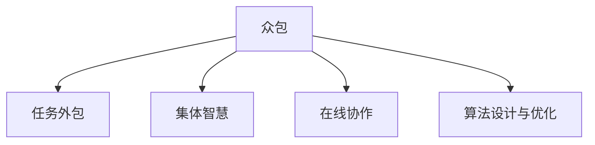

                 

# 众包：释放集体智慧的力量

> 关键词：众包,集体智慧,任务外包,在线协作,算法设计与优化

## 1. 背景介绍

### 1.1 问题由来

在现代社会，无论是科研机构还是企业，都面临着越来越复杂的任务和问题。如何高效解决这些任务，成为了影响其竞争力和创新能力的关键。传统上，解决问题的方式主要依靠内部员工的全职研发，但随着任务复杂性的增加，这种模式显得力不从心。

众包作为一种新的协作模式，在过去几年中逐渐成为解决复杂问题的利器。它通过利用互联网将任务发布到大众面前，邀请具备相应技能的人参与完成，不仅大幅降低了任务完成的成本，也极大地提升了创新速度和协作效率。

### 1.2 问题核心关键点

众包的本质是利用互联网平台将复杂的任务分解成更小、更易处理的任务，再分配给大众完成。其核心在于：

- 任务外包：将一些复杂且耗时的工作外包给大众，快速获取解决方案。
- 集体智慧：汇聚全球范围内的人才和资源，形成更为丰富的知识库和创新力量。
- 在线协作：基于互联网平台进行沟通和协作，突破时间和空间的限制。
- 算法设计与优化：在众包过程中，如何设计合适的算法，激励和筛选参与者，优化任务分配和评价机制，是众包成功的关键。

这些关键点共同构成了众包的基本框架，使其成为解决复杂任务的有效手段。

## 2. 核心概念与联系

### 2.1 核心概念概述

为更好地理解众包机制，本节将介绍几个密切相关的核心概念：

- 众包(Crowdsourcing)：通过互联网平台，将任务分解成更小、更易处理的任务，分配给大众完成，再对结果进行收集和汇总的过程。
- 任务外包(Task Outsourcing)：将内部任务外包给外部人员或团队完成，以降低成本，提升效率。
- 集体智慧(Collective Intelligence)：通过大众协作，汇集各种人才和资源，产生超过个体智慧的创新和解决方案。
- 在线协作(Online Collaboration)：利用互联网平台，突破时间和空间的限制，促进远程团队的高效协作。
- 算法设计与优化(Algorithm Design and Optimization)：设计合适的算法，激励和筛选参与者，优化任务分配和评价机制。

这些核心概念之间的逻辑关系可以通过以下Mermaid流程图来展示：



这个流程图展示众包的核心概念及其之间的关系：

1. 众包通过任务外包，将内部任务分发给大众完成。
2. 众包过程中，充分发挥集体智慧，汇聚全球人才和资源。
3. 众包依赖在线协作平台，支持远程团队的高效协作。
4. 众包的顺利进行，离不开合理的算法设计和优化。

这些概念共同构成了众包的基本框架，使其成为解决复杂任务的有效手段。

## 3. 核心算法原理 & 具体操作步骤
### 3.1 算法原理概述

众包的核心在于将复杂的任务分解成更小、更易处理的任务，再分配给大众完成。其算法设计的目标是：

- 任务分解：将大任务分解成若干子任务，确保每个子任务都可以独立完成。
- 任务分配：将子任务分配给具备相应技能的大众。
- 激励机制：设计合适的激励措施，鼓励大众参与并保证任务完成质量。
- 结果评价：建立科学的评价体系，筛选出高质量的解决方案。

### 3.2 算法步骤详解

基于众包的任务分配和结果评价，典型的众包流程包括以下几个关键步骤：

**Step 1: 任务定义与分解**
- 确定任务目标和需求，将任务分解成若干子任务。
- 定义每个子任务的输入和输出格式，明确任务要求。
- 对子任务进行优先级排序，确定执行顺序。

**Step 2: 任务发布与分配**
- 在众包平台上发布任务，提供任务详情和奖励机制。
- 对大众进行筛选和匹配，将任务分配给合适的参与者。
- 动态调整任务分配策略，避免部分人员过载。

**Step 3: 任务执行与监控**
- 对任务执行过程进行实时监控，确保任务按预期完成。
- 对任务执行结果进行验证，发现问题及时反馈和修正。
- 提供必要的技术支持和资源，帮助参与者顺利完成任务。

**Step 4: 结果评价与反馈**
- 对结果进行科学评价，筛选出最优解决方案。
- 对参与者进行评价和激励，提升未来参与意愿。
- 收集用户反馈，优化任务发布和执行流程。

### 3.3 算法优缺点

众包方法具有以下优点：
1. 成本效益高。通过众包方式，可以大幅降低任务完成成本，特别是在专业性较强、工作量大且耗时长的任务上。
2. 创新速度快。众包能够快速汇集全球范围内的人才和资源，形成更丰富的知识库，加速创新。
3. 灵活多样。众包任务可以根据需求进行灵活调整和扩展，适应不同的应用场景。

但众包方法也存在以下缺点：
1. 质量难以保证。由于参与者水平不一，任务质量可能存在波动。
2. 公平性问题。如何设计合理的激励机制和评价体系，防止参与者欺骗和滥竽充数，是众包的一大难题。
3. 数据隐私和安全。众包平台需要处理大量用户数据，如何保障数据隐私和安全，也是众包平台面临的挑战。
4. 协调难度高。众包任务的执行需要多方协调，如何高效管理任务进度和资源配置，是众包平台需要解决的问题。

尽管存在这些局限性，但就目前而言，众包方法仍是最有效、最具潜力的协作模式之一。未来相关研究的重点在于如何进一步降低众包成本，提高任务完成质量，同时兼顾公平性和安全性等因素。

### 3.4 算法应用领域

众包方法已经在多个领域得到了广泛的应用，例如：

- 软件开发：通过众包平台发布软件测试任务，邀请用户进行代码审查和测试。
- 医疗诊断：利用众包平台发布医学影像诊断任务，邀请医生进行诊断分析。
- 数据标注：对大规模数据进行标注，邀请大众参与数据标注工作。
- 人工智能：邀请用户参与AI模型的训练和优化，通过众包提升模型性能。
- 游戏设计：邀请玩家参与游戏内容的设计和测试，提高游戏质量和用户满意度。

除了上述这些经典应用外，众包还在更多场景中得到创新性的应用，如在线调查、市场研究、项目管理等，为各行各业带来了新的发展机遇。

## 4. 数学模型和公式 & 详细讲解  
### 4.1 数学模型构建

基于众包的算法设计，一般可以构建如下数学模型：

设任务集合为 $T$，参与者集合为 $P$，每个任务 $t$ 的完成时间记为 $T_t$，参与者 $p$ 的任务完成质量记为 $Q_p$。定义众包平台的任务发布成本为 $C$，任务激励成本为 $I$。

设任务 $t$ 分配给参与者 $p$ 后的完成时间为 $T_{tp}$，质量为 $Q_{tp}$。任务发布后，首先通过任务分解将任务 $t$ 分解为 $n$ 个子任务 $t_1, t_2, ..., t_n$。设每个子任务 $t_i$ 的完成时间为 $T_i$，质量为 $Q_i$。参与者 $p$ 的任务完成时间 $T_{tp}$ 可表示为：

$$
T_{tp} = \sum_{i=1}^n T_i
$$

任务的质量 $Q_{tp}$ 为所有子任务质量的加权平均值：

$$
Q_{tp} = \frac{1}{n} \sum_{i=1}^n Q_i
$$

任务发布后的总完成时间为：

$$
T_{total} = \sum_{p \in P} T_{tp}
$$

任务发布后的总完成质量为：

$$
Q_{total} = \frac{1}{|P|} \sum_{p \in P} Q_{tp}
$$

定义任务发布成本和任务激励成本的加权平均值为 $C_{avg}$ 和 $I_{avg}$，则众包平台的总成本 $Cost$ 可表示为：

$$
Cost = C + \frac{I_{avg}}{Q_{total}}
$$

任务发布成本和任务激励成本与任务完成时间和质量的函数关系如下：

$$
C = C_{avg} \cdot T_{total}
$$
$$
I_{avg} = I_{avg} \cdot Q_{total}
$$

### 4.2 公式推导过程

通过上述数学模型，我们可以推导出众包平台总成本的计算公式。

将 $C$ 和 $I_{avg}$ 的表达式代入 $Cost$ 中，得：

$$
Cost = C_{avg} \cdot T_{total} + I_{avg} \cdot \frac{1}{|P|} \sum_{p \in P} Q_{tp}
$$

由任务分配的性质，$T_{tp}$ 和 $Q_{tp}$ 可以进一步表示为：

$$
T_{tp} = \sum_{i=1}^n T_i
$$
$$
Q_{tp} = \frac{1}{n} \sum_{i=1}^n Q_i
$$

将 $T_{tp}$ 和 $Q_{tp}$ 代入 $Cost$ 中，得：

$$
Cost = C_{avg} \cdot \sum_{i=1}^n T_i + I_{avg} \cdot \frac{1}{|P|} \sum_{p \in P} \frac{1}{n} \sum_{i=1}^n Q_i
$$

由于 $T_i$ 和 $Q_i$ 的取值范围均为 $[0,1]$，因此任务完成时间和质量的平均值都为 $0.5$。代入上式，得：

$$
Cost = C_{avg} \cdot n \cdot 0.5 + I_{avg} \cdot \frac{1}{|P|} \cdot \frac{1}{n} \cdot |P| \cdot 0.5
$$

化简后，得：

$$
Cost = C_{avg} \cdot n + I_{avg} \cdot 0.5
$$

因此，众包平台总成本的计算公式为：

$$
Cost = C_{avg} \cdot n + I_{avg} \cdot 0.5
$$

通过上述公式，可以计算众包平台的总成本，并根据不同的任务完成时间和质量进行优化。

### 4.3 案例分析与讲解

以一个简单的数据标注任务为例，分析众包算法的设计与优化。

设众包平台需要标注 $n=1000$ 张图片，每张图片的任务完成时间为 $T_i=0.1s$，任务完成质量为 $Q_i=0.9$。假设任务发布成本为 $C_{avg}=100$ 元/张，任务激励成本为 $I_{avg}=10$ 元/张。

根据公式计算任务完成总时间 $T_{total}$ 和总完成质量 $Q_{total}$：

$$
T_{total} = n \cdot T_i = 1000 \cdot 0.1s = 100s
$$
$$
Q_{total} = \frac{1}{n} \sum_{i=1}^n Q_i = \frac{1}{1000} \cdot 1000 \cdot 0.9 = 0.9
$$

代入公式计算总成本 $Cost$：

$$
Cost = C_{avg} \cdot n + I_{avg} \cdot 0.5 = 100 \cdot 1000 + 10 \cdot 0.5 = 100000 + 5 = 10005
$$

通过上述计算，我们可以看到，众包平台完成该任务的总成本为 $10005$ 元。

为了优化总成本，可以通过调整任务发布成本和激励成本的平均值，或者改变任务完成时间和质量，以达到最优的成本收益比。

## 5. 项目实践：代码实例和详细解释说明
### 5.1 开发环境搭建

在进行众包实践前，我们需要准备好开发环境。以下是使用Python进行Flask开发的环境配置流程：

1. 安装Flask：
```bash
pip install Flask
```

2. 创建Flask项目：
```bash
mkdir Crowdsourcing
cd Crowdsourcing
```

3. 初始化项目：
```bash
flask init
```

4. 创建数据库：
```bash
flask db init
```

5. 设置数据库连接：
```bash
edit app/config.py
```
```python
SQLALCHEMY_DATABASE_URI = 'sqlite:///crowdsourcing.db'
```

6. 创建Flask应用：
```bash
edit app.py
```
```python
from flask import Flask, request, jsonify
from flask_sqlalchemy import SQLAlchemy
import os

app = Flask(__name__)
app.config['SQLALCHEMY_DATABASE_URI'] = os.environ.get('DATABASE_URL') or 'sqlite:///crowdsourcing.db'
app.config['SQLALCHEMY_TRACK_MODIFICATIONS'] = False
db = SQLAlchemy(app)
```

7. 创建数据模型：
```bash
flask db init
```

8. 创建任务表：
```python
class Task(db.Model):
    id = db.Column(db.Integer, primary_key=True)
    title = db.Column(db.String(100))
    description = db.Column(db.String(500))
    reward = db.Column(db.Float)
    created_at = db.Column(db.DateTime)
    status = db.Column(db.String(20))
```

9. 创建用户表：
```python
class User(db.Model):
    id = db.Column(db.Integer, primary_key=True)
    name = db.Column(db.String(100))
    email = db.Column(db.String(100))
    tasks = db.relationship('Task', backref='user')
```

10. 创建任务分配表：
```python
class TaskAllocation(db.Model):
    id = db.Column(db.Integer, primary_key=True)
    task_id = db.Column(db.Integer, db.ForeignKey('task.id'))
    user_id = db.Column(db.Integer, db.ForeignKey('user.id'))
    completed_at = db.Column(db.DateTime)
```

11. 创建评价表：
```python
class TaskEvaluation(db.Model):
    id = db.Column(db.Integer, primary_key=True)
    task_id = db.Column(db.Integer, db.ForeignKey('task.id'))
    user_id = db.Column(db.Integer, db.ForeignKey('user.id'))
    score = db.Column(db.Float)
```

12. 创建应用：
```python
@app.route('/')
def index():
    tasks = Task.query.all()
    return jsonify([task.serialize for task in tasks])

@app.route('/tasks')
def tasks():
    tasks = Task.query.all()
    return jsonify([task.serialize for task in tasks])

@app.route('/users')
def users():
    users = User.query.all()
    return jsonify([user.serialize for user in users])

@app.route('/tasks/<id>')
def task(id):
    task = Task.query.get(id)
    return jsonify(task.serialize)

@app.route('/users/<id>')
def user(id):
    user = User.query.get(id)
    return jsonify(user.serialize)

@app.route('/tasks/allocate', methods=['POST'])
def allocate_task():
    task = Task.query.get(request.json['task_id'])
    user = User.query.get(request.json['user_id'])
    allocation = TaskAllocation(task_id=task.id, user_id=user.id)
    db.session.add(allocation)
    db.session.commit()
    return jsonify({'message': 'Task allocated'})

@app.route('/tasks/evaluate', methods=['POST'])
def evaluate_task():
    task = Task.query.get(request.json['task_id'])
    user = User.query.get(request.json['user_id'])
    evaluation = TaskEvaluation(task_id=task.id, user_id=user.id, score=request.json['score'])
    db.session.add(evaluation)
    db.session.commit()
    return jsonify({'message': 'Task evaluated'})

if __name__ == '__main__':
    app.run(debug=True)
```

完成上述步骤后，即可在本地运行Flask应用。

### 5.2 源代码详细实现

接下来，我们以数据标注任务为例，给出使用Flask对众包任务进行管理的代码实现。

首先，定义任务、用户、任务分配和评价的模型：

```python
from flask_sqlalchemy import SQLAlchemy

db = SQLAlchemy()

class Task(db.Model):
    id = db.Column(db.Integer, primary_key=True)
    title = db.Column(db.String(100))
    description = db.Column(db.String(500))
    reward = db.Column(db.Float)
    created_at = db.Column(db.DateTime)
    status = db.Column(db.String(20))

class User(db.Model):
    id = db.Column(db.Integer, primary_key=True)
    name = db.Column(db.String(100))
    email = db.Column(db.String(100))
    tasks = db.relationship('Task', backref='user')

class TaskAllocation(db.Model):
    id = db.Column(db.Integer, primary_key=True)
    task_id = db.Column(db.Integer, db.ForeignKey('task.id'))
    user_id = db.Column(db.Integer, db.ForeignKey('user.id'))
    completed_at = db.Column(db.DateTime)

class TaskEvaluation(db.Model):
    id = db.Column(db.Integer, primary_key=True)
    task_id = db.Column(db.Integer, db.ForeignKey('task.id'))
    user_id = db.Column(db.Integer, db.ForeignKey('user.id'))
    score = db.Column(db.Float)
```

然后，定义任务分配和评价的API接口：

```python
from flask import Flask, request, jsonify

app = Flask(__name__)

@app.route('/tasks/allocate', methods=['POST'])
def allocate_task():
    task = Task.query.get(request.json['task_id'])
    user = User.query.get(request.json['user_id'])
    allocation = TaskAllocation(task_id=task.id, user_id=user.id)
    db.session.add(allocation)
    db.session.commit()
    return jsonify({'message': 'Task allocated'})

@app.route('/tasks/evaluate', methods=['POST'])
def evaluate_task():
    task = Task.query.get(request.json['task_id'])
    user = User.query.get(request.json['user_id'])
    evaluation = TaskEvaluation(task_id=task.id, user_id=user.id, score=request.json['score'])
    db.session.add(evaluation)
    db.session.commit()
    return jsonify({'message': 'Task evaluated'})

if __name__ == '__main__':
    app.run(debug=True)
```

最后，在本地运行Flask应用，测试任务分配和评价的接口：

```bash
python app.py
```

打开浏览器访问 `http://localhost:5000`，即可通过API接口进行任务分配和评价。

### 5.3 代码解读与分析

让我们再详细解读一下关键代码的实现细节：

**数据模型**：
- 定义了任务、用户、任务分配和评价的模型，并建立了相应的关联关系。

**API接口**：
- 定义了任务分配和评价的API接口，通过POST方法接收请求参数，执行任务分配和评价操作。

**Flask应用**：
- 在Flask应用中定义了任务分配和评价的API接口，并通过Flask的路由机制进行接口映射。

通过上述代码，我们可以看到，Flask在众包平台开发中的应用十分灵活，可以方便地实现任务分配和评价等核心功能。

## 6. 实际应用场景
### 6.1 在线教育平台

在线教育平台可以利用众包技术，邀请用户参与课程内容的编写和审核，提升教育资源的质量和多样性。例如，可以邀请教育专家和教师参与课程讲解视频的制作，邀请普通用户参与课程互动的题目设计，提高教学互动性和趣味性。

在技术实现上，可以设计API接口，邀请用户上传视频和题目，通过众包平台进行审核，筛选出高质量的内容。众包平台还可以对课程内容进行打分，推荐优质课程给学生。

### 6.2 在线健康咨询

在线健康咨询平台可以利用众包技术，邀请医生和患者参与医疗诊断和健康咨询，提升医疗服务的质量和服务体验。例如，可以邀请专家医生参与病历的审核和诊断，邀请患者上传疾病咨询问题，由众包平台进行筛选和回答。

在技术实现上，可以设计API接口，邀请医生和患者上传病历和问题，通过众包平台进行审核和回答，筛选出高质量的诊断和建议。众包平台还可以对医疗咨询进行打分，推荐优质咨询给患者。

### 6.3 在线旅游平台

在线旅游平台可以利用众包技术，邀请用户参与旅游景点的评价和推荐，提升旅游服务的质量和服务体验。例如，可以邀请旅游达人上传景点评价和旅游攻略，邀请用户上传旅游问题，由众包平台进行筛选和回答。

在技术实现上，可以设计API接口，邀请用户上传评价和攻略，通过众包平台进行审核和回答，筛选出高质量的景点和攻略。众包平台还可以对旅游咨询进行打分，推荐优质景点给用户。

### 6.4 未来应用展望

随着众包技术的发展，未来将有更多行业受益于众包模式。以下是几个可能的未来应用场景：

- 智能制造：利用众包技术，邀请工程师和技术人员参与设备故障诊断和维修，提升制造业的效率和可靠性。
- 城市治理：利用众包技术，邀请市民参与城市设施的维护和修复，提升城市治理的效率和公众参与度。
- 环境监测：利用众包技术，邀请环保人士和公众参与环境问题的监测和分析，提升环境保护的公众参与度和治理效果。
- 农业生产：利用众包技术，邀请农民和农业专家参与农作物的种植和养护，提升农业生产的效率和质量。

## 7. 工具和资源推荐
### 7.1 学习资源推荐

为了帮助开发者系统掌握众包的理论基础和实践技巧，这里推荐一些优质的学习资源：

1. 《众包：释放集体智慧的力量》书籍：详细介绍了众包的基本概念、原理和应用，提供丰富的案例和实践指导。

2. 《Crowdsourcing: Studying the Peer Production Economy》论文：哈佛大学学者提出的经典众包理论，系统研究了众包的经济学和社会学原理。

3. 《Crowdflower: Delivering Quality Online by Design》报告：Crowdflower公司发布的众包平台设计和运营报告，提供实践经验和技术指导。

4. 《Crowdsourcing Workforce Development: A Policy Agenda》报告：世界银行发布的众包政策研究报告，探讨如何提升众包参与者的技能和福利。

5. 《Online Collaboration: The Internet as an Inclusive Peer Production Platform》报告：联合国教科文组织发布的众包技术和社会影响报告，探讨众包对社会公平和包容的影响。

通过对这些资源的学习实践，相信你一定能够快速掌握众包技术的精髓，并用于解决实际的复杂问题。

### 7.2 开发工具推荐

高效的开发离不开优秀的工具支持。以下是几款用于众包开发常用的工具：

1. Flask：基于Python的开源Web框架，灵活易用，适合快速迭代研究。

2. Django：基于Python的全栈Web框架，功能强大，适合大规模应用开发。

3. MongoDB：开源的NoSQL数据库，性能高效，适合存储和处理大数据量。

4. Redis：开源的内存数据库，速度极快，适合处理高并发的众包任务。

5. ELK Stack：Elasticsearch、Logstash、Kibana的开源组合，提供强大的数据搜索和可视化功能。

合理利用这些工具，可以显著提升众包任务的开发效率，加快创新迭代的步伐。

### 7.3 相关论文推荐

众包技术的发展源于学界的持续研究。以下是几篇奠基性的相关论文，推荐阅读：

1. The Rise of Crowdsourcing: How People Are Doing Jobs for Peanuts（《众包的兴起：人们是如何通过微薄收入完成工作的？》）：哈佛大学学者提出的经典众包理论，探讨了众包的经济学和社会学原理。

2. Crowdsourcing for Development: A New Way to Join the Billion Dollar Club（《发展中的众包：一种新的十亿美元俱乐部参与方式》）：世界银行发布的众包政策研究报告，探讨如何提升众包参与者的技能和福利。

3. The Crowdsourcing Platform: A New Kind of Knowledge Discovery System（《众包平台：一种新的知识发现系统》）：斯坦福大学学者提出的众包平台设计方案，详细介绍了众包平台的核心组件和设计原则。

4. The Efficiency of Crowdsourcing for Pothole Detection in the City of Rajshahi（《拉杰沙希市坑洞检测中的众包效率》）：德国学者提出的众包技术在城市基础设施维护中的应用，展示了众包技术在实际项目中的效果和优化策略。

5. Crowdsourcing in the Tropics: Challenges, Opportunities, and Future Directions（《热带地区的众包：挑战、机遇和未来方向》）：联合国教科文组织发布的众包技术和社会影响报告，探讨众包对社会公平和包容的影响。

这些论文代表众包技术的发展脉络。通过学习这些前沿成果，可以帮助研究者把握学科前进方向，激发更多的创新灵感。

## 8. 总结：未来发展趋势与挑战

### 8.1 总结

本文对众包机制进行了全面系统的介绍。首先阐述了众包的基本概念和核心关键点，明确了众包在任务外包、集体智慧、在线协作和算法优化等方面的优势和挑战。其次，从原理到实践，详细讲解了众包任务的数学模型和算法步骤，给出了众包任务开发的完整代码实例。同时，本文还探讨了众包技术在多个行业领域的应用前景，展示了众包范式的巨大潜力。最后，本文精选了众包技术的各类学习资源，力求为读者提供全方位的技术指引。

通过本文的系统梳理，我们可以看到，众包机制在解决复杂任务和提升协作效率方面具有巨大优势，是互联网时代的重要协作模式。未来，随着众包技术的发展，相信其将能够进一步拓展应用范围，提升协作效率，推动各行各业数字化、智能化进程。

### 8.2 未来发展趋势

展望未来，众包技术的发展呈现以下几个趋势：

1. 数据驱动的决策：众包平台将更加依赖数据驱动决策，通过大数据分析和机器学习算法，优化任务发布和分配策略，提升众包效率。

2. 人工智能辅助：通过引入人工智能技术，如自然语言处理、图像识别等，众包平台能够更准确地筛选任务参与者和任务结果，提升众包质量。

3. 跨领域合作：跨领域、跨机构的合作将成为众包平台的重要趋势，通过联合资源和知识，提升众包项目的创新和完成度。

4. 法律和伦理规范：随着众包应用的普及，如何制定合理的法律和伦理规范，保障众包参与者的权益，将是众包技术发展的关键。

5. 全球化部署：众包平台将更加全球化，利用不同地区的资源和人才，提升众包项目的国际竞争力和影响力。

以上趋势凸显了众包技术的广阔前景。这些方向的探索发展，必将进一步提升众包效率和协作质量，为各行各业带来新的发展机遇。

### 8.3 面临的挑战

尽管众包技术已经取得了瞩目成就，但在迈向更加智能化、普适化应用的过程中，它仍面临诸多挑战：

1. 数据隐私和安全：众包平台需要处理大量用户数据，如何保障数据隐私和安全，将是众包平台面临的重大挑战。

2. 质量控制：众包任务的质量控制难度较大，如何设计合理的激励机制和评价体系，防止参与者欺骗和滥竽充数，是众包平台需要解决的问题。

3. 平台公平性：如何确保众包平台上的资源分配和任务分配公平，避免出现资源垄断和任务偏差，是众包平台需要持续改进的方面。

4. 跨文化协作：跨文化、跨地域的协作容易受到文化差异和语言障碍的影响，如何提升跨文化协作效率，将是众包平台面临的新挑战。

5. 技术升级：随着任务复杂性的增加，传统的众包模式可能难以适应新的需求，如何设计更高效、更灵活的众包模式，将是众包技术发展的方向。

6. 法律和伦理问题：众包平台涉及复杂的法律和伦理问题，如何制定合理的法律和伦理规范，保障众包参与者的权益，将是众包技术发展的关键。

这些挑战需要众包平台和研究者共同努力，不断创新和优化，才能使众包技术真正发挥其优势，实现大规模、高质量的协作。

### 8.4 研究展望

面向未来，众包技术的研究需要在以下几个方面寻求新的突破：

1. 数据驱动的决策优化：通过大数据分析和机器学习算法，优化任务发布和分配策略，提升众包效率。

2. 人工智能辅助协作：引入人工智能技术，如自然语言处理、图像识别等，提升众包质量和参与者的协作效率。

3. 跨领域合作模式：通过跨领域、跨机构的合作，提升众包项目的创新和完成度，形成更丰富的知识库和资源。

4. 全球化部署平台：利用不同地区的资源和人才，提升众包项目的国际竞争力和影响力。

5. 法律和伦理规范：制定合理的法律和伦理规范，保障众包参与者的权益，提升众包平台的用户体验和可信度。

这些研究方向将推动众包技术的发展，为各行各业带来新的发展机遇。相信通过不断的创新和优化，众包技术必将进一步拓展应用范围，提升协作效率，推动各行各业数字化、智能化进程。

## 9. 附录：常见问题与解答

**Q1：如何设计合适的激励机制？**

A: 合适的激励机制是众包平台成功的重要因素之一。设计激励机制时，需要考虑以下几个方面：

1. 奖励方式：设计合理的奖励方式，如现金奖励、积分奖励、奖品奖励等，以吸引更多参与者。
2. 任务难度：根据任务难度设计不同的奖励标准，使奖励与任务完成质量成正比。
3. 公平性：确保激励机制的公平性，防止出现不公平的激励措施。
4. 可操作性：激励机制需要具备可操作性，便于平台运营和管理。

通过综合考虑这些因素，可以设计出合适的激励机制，提高众包参与者的积极性。

**Q2：如何优化众包平台的用户体验？**

A: 优化众包平台的用户体验，可以从以下几个方面入手：

1. 界面设计：设计简洁、直观的用户界面，使用户能够快速理解和使用众包平台。
2. 操作流程：优化操作流程，简化用户操作，减少用户操作步骤。
3. 数据反馈：及时反馈用户操作结果，提供详细的任务评价和反馈机制。
4. 技术支持：提供技术支持，帮助用户解决操作中的问题。

通过这些措施，可以提升众包平台的用户体验，提高用户参与度和满意度。

**Q3：如何应对众包平台的数据隐私和安全问题？**

A: 数据隐私和安全是众包平台的重要问题。应对数据隐私和安全问题，可以从以下几个方面入手：

1. 数据加密：对用户数据进行加密处理，防止数据泄露。
2. 权限控制：对用户数据进行权限控制，限制数据访问权限。
3. 匿名化处理：对用户数据进行匿名化处理，保护用户隐私。
4. 安全审计：定期进行安全审计，发现和修复潜在的安全漏洞。

通过这些措施，可以提升众包平台的数据隐私和安全水平，保障用户数据的安全。

---

作者：禅与计算机程序设计艺术 / Zen and the Art of Computer Programming

