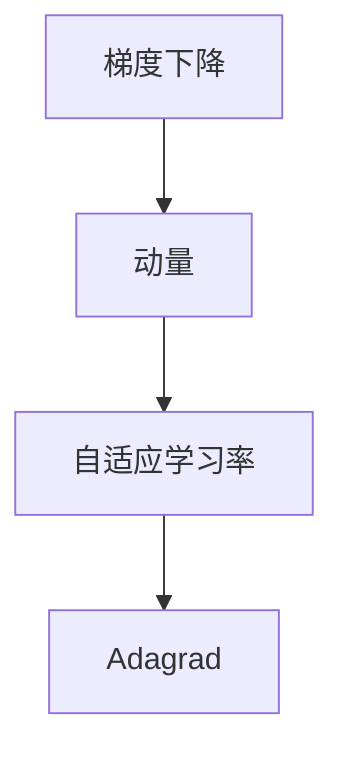

                 

# 优化算法：Adagrad 原理与代码实例讲解

> 关键词：Adagrad算法,梯度下降,自适应学习率,归一化梯度

## 1. 背景介绍

在机器学习中，优化算法是核心内容之一。在训练神经网络模型时，通过不断调整模型参数，最小化损失函数。常见的优化算法包括梯度下降（Gradient Descent）、动量（Momentum）、自适应学习率（Adaptive Learning Rate）等。

其中，梯度下降（包括随机梯度下降和批量梯度下降）是最基本的优化算法，但在参数多、数据量大时，存在计算量大、收敛速度慢等问题。动量算法则通过引入动量项，加速梯度下降过程，提高收敛速度。

而自适应学习率算法，则是在梯度下降的基础上，根据梯度的变化动态调整学习率，克服梯度下降的缺点，具有更好的收敛特性。其中，Adagrad算法（Adaptive Gradient Algorithm）是最早被提出的自适应学习率算法之一，具有简单易懂、效果良好的特点。

本文将详细介绍Adagrad算法的原理，通过代码实例讲解其实现过程，并讨论其应用场景和优缺点。

## 2. 核心概念与联系

### 2.1 核心概念概述

为更好地理解Adagrad算法，本节将介绍几个关键概念：

- 梯度下降（Gradient Descent）：通过不断调整模型参数，最小化损失函数。其核心思想是：沿着梯度的反方向更新参数，不断逼近最优解。
- 动量（Momentum）：通过引入动量项，使模型在梯度下降过程中保留一定惯性，加速收敛。动量算法的效果相当于在梯度下降的基础上，引入一个加速度项，沿着梯度方向前进。
- 自适应学习率（Adaptive Learning Rate）：根据梯度的变化动态调整学习率，克服梯度下降的缺点。自适应学习率算法包括Adagrad、RMSprop、Adam等。
- Adagrad算法：基于梯度的平方和，动态调整每个参数的学习率，适应不同参数的更新需求。

这些概念之间的逻辑关系可以通过以下Mermaid流程图来展示：



这个流程图展示了几类优化算法之间的逻辑关系：

1. 梯度下降是基础算法。
2. 动量算法通过引入动量项，加速梯度下降过程。
3. 自适应学习率算法根据梯度的变化动态调整学习率，进一步提高收敛速度。
4. Adagrad算法是自适应学习率算法的一种，通过计算梯度平方和，动态调整每个参数的学习率。

这些算法共同构成机器学习中的优化工具，对模型参数进行优化，以最小化损失函数。

## 3. 核心算法原理 & 具体操作步骤

### 3.1 算法原理概述

Adagrad算法是一种基于梯度平方和的自适应学习率算法，最初由AdaGrad算法发展而来，后来由Duchi等人进一步改进。

Adagrad算法的核心思想是：根据梯度平方的累计值，动态调整每个参数的学习率。对于梯度较大的参数，学习率较小，防止其过度更新；对于梯度较小的参数，学习率较大，促进其快速收敛。这种自适应性使得Adagrad算法能够有效应对不同参数的学习需求。

具体地，Adagrad算法通过计算梯度平方的累计和，不断调整学习率。对于第 $t$ 次迭代时参数 $\theta_k$ 的更新公式为：

$$
\theta_k^{(t+1)} = \theta_k^{(t)} - \frac{\eta_t}{\sum_{j=1}^{t} g_j^2} g_k^{(t)}
$$

其中，$\eta_t$ 为当前迭代的学习率，$g_k^{(t)}$ 为第 $t$ 次迭代时参数 $\theta_k$ 的梯度，$g_j^2$ 为历史梯度的平方和，$\sum_{j=1}^{t} g_j^2$ 即为梯度平方的累计和。

### 3.2 算法步骤详解

Adagrad算法的执行步骤如下：

1. 初始化参数 $\theta$ 和初始学习率 $\eta$。
2. 对于每个样本 $(x,y)$，计算梯度 $g_k$。
3. 更新梯度平方的累计和 $\sum_{j=1}^{t} g_j^2$。
4. 根据梯度平方的累计和计算当前迭代的学习率 $\eta_t$。
5. 更新模型参数 $\theta_k$。
6. 重复步骤2-5，直至收敛。

具体实现时，通常使用一个累加器来记录梯度平方的累计和，即：

$$
s_k = s_k + g_k^2
$$

其中，$s_k$ 为梯度平方的累计和。

则更新公式变为：

$$
\theta_k^{(t+1)} = \theta_k^{(t)} - \frac{\eta}{s_k} g_k^{(t)}
$$

其中，$\eta$ 为初始学习率。

### 3.3 算法优缺点

Adagrad算法具有以下优点：

1. 自适应性：根据梯度平方的累计和动态调整学习率，适应不同参数的学习需求。
2. 收敛性好：在稀疏梯度场景下表现优异，可以有效应对梯度方差较大的问题。
3. 简单易懂：算法实现简单，易于理解和调试。

同时，Adagrad算法也存在一些缺点：

1. 学习率逐渐减小：随着迭代次数的增加，学习率逐渐减小，导致后期收敛速度较慢。
2. 空间复杂度高：需要存储梯度平方的累计和，空间复杂度较高。
3. 难以恢复：由于学习率逐渐减小，模型难以恢复，易陷入局部最优解。

尽管存在这些缺点，但Adagrad算法仍然在许多场景下表现出色，尤其是在稀疏梯度问题中。

### 3.4 算法应用领域

Adagrad算法在机器学习中被广泛应用于各种任务，如线性回归、逻辑回归、深度学习等。在深度学习中，Adagrad算法通常用于神经网络中的自适应学习率调整。

例如，在深度学习中，Adagrad算法可以用于调整卷积神经网络（CNN）中的参数。在优化深度学习模型的过程中，Adagrad算法能够有效避免梯度消失和梯度爆炸问题，提高模型的收敛速度和精度。

此外，Adagrad算法还被应用于自然语言处理（NLP）领域，如文本分类、情感分析等任务。通过在训练过程中动态调整学习率，Adagrad算法能够有效应对NLP任务中的稀疏梯度问题，提高模型的泛化能力。

## 4. 数学模型和公式 & 详细讲解 & 举例说明

### 4.1 数学模型构建

Adagrad算法的数学模型可以表示为：

$$
\theta_k^{(t+1)} = \theta_k^{(t)} - \frac{\eta}{s_k} g_k^{(t)}
$$

其中，$\theta_k$ 为第 $k$ 个参数的当前值，$\theta_k^{(t+1)}$ 为第 $t+1$ 次迭代后的值，$\eta$ 为初始学习率，$g_k^{(t)}$ 为第 $t$ 次迭代时参数 $\theta_k$ 的梯度，$s_k$ 为梯度平方的累计和，即：

$$
s_k = s_k + g_k^2
$$

### 4.2 公式推导过程

Adagrad算法的推导过程如下：

1. 根据梯度下降的公式，更新第 $k$ 个参数的值为：

$$
\theta_k^{(t+1)} = \theta_k^{(t)} - \eta g_k^{(t)}
$$

其中，$\eta$ 为初始学习率，$g_k^{(t)}$ 为第 $t$ 次迭代时参数 $\theta_k$ 的梯度。

2. 根据梯度平方和，更新每个参数的学习率为：

$$
\eta_t = \frac{\eta}{\sqrt{s_k} + \epsilon}
$$

其中，$\epsilon$ 为避免除数为0的常数，通常取 $10^{-8}$。

3. 将更新后的学习率代入梯度下降公式，得到Adagrad算法的更新公式：

$$
\theta_k^{(t+1)} = \theta_k^{(t)} - \frac{\eta}{\sqrt{s_k} + \epsilon} g_k^{(t)}
$$

其中，$s_k$ 为梯度平方的累计和。

### 4.3 案例分析与讲解

以线性回归为例，说明Adagrad算法的应用。

假设线性回归模型为：

$$
y = wx + b
$$

其中，$w$ 为权重，$b$ 为偏置，$x$ 为输入特征，$y$ 为输出标签。模型的损失函数为均方误差：

$$
L(w,b) = \frac{1}{2m} \sum_{i=1}^{m} (y_i - wx_i - b)^2
$$

其中，$m$ 为样本数量。

假设当前迭代为第 $t$ 次，$(x_i,y_i)$ 为第 $i$ 个样本，梯度为：

$$
g_w^{(t)} = -\frac{\partial L}{\partial w} = -\frac{2}{m} \sum_{i=1}^{m} (y_i - wx_i - b)x_i
$$

$$
g_b^{(t)} = -\frac{\partial L}{\partial b} = -\frac{2}{m} \sum_{i=1}^{m} (y_i - wx_i - b)
$$

则Adagrad算法的更新公式为：

$$
w^{(t+1)} = w^{(t)} - \frac{\eta}{s_w + \epsilon} g_w^{(t)}
$$

$$
b^{(t+1)} = b^{(t)} - \frac{\eta}{s_b + \epsilon} g_b^{(t)}
$$

其中，$s_w$ 和 $s_b$ 分别为 $w$ 和 $b$ 的梯度平方累计和。

## 5. 项目实践：代码实例和详细解释说明

### 5.1 开发环境搭建

在进行Adagrad算法实践前，我们需要准备好开发环境。以下是使用Python进行TensorFlow开发的环境配置流程：

1. 安装Anaconda：从官网下载并安装Anaconda，用于创建独立的Python环境。

2. 创建并激活虚拟环境：
```bash
conda create -n tf-env python=3.8 
conda activate tf-env
```

3. 安装TensorFlow：根据CUDA版本，从官网获取对应的安装命令。例如：
```bash
conda install tensorflow -c tensorflow -c conda-forge
```

4. 安装numpy、scipy等各类工具包：
```bash
pip install numpy scipy matplotlib tqdm jupyter notebook ipython
```

完成上述步骤后，即可在`tf-env`环境中开始Adagrad算法的实践。

### 5.2 源代码详细实现

下面我们以Adagrad算法实现线性回归为例，给出TensorFlow代码实现。

```python
import tensorflow as tf
import numpy as np

# 设置随机种子
np.random.seed(0)
tf.random.set_seed(0)

# 生成数据
X = np.random.randn(100, 1)
y = 2 * X + 3 + np.random.randn(100, 1)

# 定义模型
w = tf.Variable(np.random.randn(1), dtype=tf.float32)
b = tf.Variable(np.random.randn(1), dtype=tf.float32)
model = tf.keras.Sequential([
    tf.keras.layers.Dense(1)
])

# 定义损失函数和优化器
def loss(y_true, y_pred):
    return tf.reduce_mean(tf.square(y_true - y_pred))

optimizer = tf.keras.optimizers.Adagrad(learning_rate=0.01)

# 定义训练函数
@tf.function
def train_step(x, y):
    with tf.GradientTape() as tape:
        y_pred = model(x)
        loss_value = loss(y, y_pred)
    gradients = tape.gradient(loss_value, [w, b])
    optimizer.apply_gradients(zip(gradients, [w, b]))

# 训练模型
for i in range(1000):
    train_step(X, y)

# 评估模型
test_X = np.random.randn(10, 1)
test_y = 2 * test_X + 3 + np.random.randn(10, 1)
test_y_pred = model(test_X)
print("Test Loss: ", loss(test_y, test_y_pred).numpy())
```

### 5.3 代码解读与分析

让我们再详细解读一下关键代码的实现细节：

**数据生成**：
- `X` 和 `y` 为生成的随机数据，用于训练模型。

**模型定义**：
- 使用TensorFlow的Sequential模型定义线性回归模型，包括一个Dense层。

**损失函数和优化器定义**：
- 定义均方误差损失函数 `loss`。
- 使用Adagrad优化器，学习率为0.01。

**训练函数**：
- 定义训练函数 `train_step`，在每个批次上计算梯度并应用优化器更新参数。

**训练模型**：
- 使用for循环，重复训练模型1000次，每次迭代更新模型参数。

**模型评估**：
- 生成测试数据 `test_X` 和 `test_y`，使用训练好的模型进行预测，并计算测试损失。

可以看到，TensorFlow的高级API使得Adagrad算法的实现变得简洁高效。开发者可以将更多精力放在模型设计和数据处理上，而不必过多关注底层的实现细节。

## 6. 实际应用场景

Adagrad算法在机器学习和深度学习中有着广泛的应用场景，以下是几个实际应用案例：

### 6.1 图像分类

图像分类是计算机视觉中的经典任务，Adagrad算法在训练卷积神经网络（CNN）中得到广泛应用。通过调整卷积层、全连接层等参数，Adagrad算法可以优化CNN模型，提高图像分类的精度。

### 6.2 自然语言处理

自然语言处理（NLP）是AI领域的另一个重要方向。Adagrad算法在NLP中的应用包括文本分类、情感分析、命名实体识别等任务。通过调整词向量、层权重等参数，Adagrad算法可以优化NLP模型，提高模型的泛化能力。

### 6.3 强化学习

强化学习（RL）是AI领域的另一重要方向，Adagrad算法可以用于优化RL算法中的策略参数。通过调整动作选择策略、状态表示等参数，Adagrad算法可以优化RL模型，提高智能体的学习效率和性能。

### 6.4 未来应用展望

随着深度学习技术的不断发展，Adagrad算法在更多领域中得到应用，为机器学习和深度学习带来了新的突破。

在智慧医疗领域，Adagrad算法可以用于优化医疗图像分类模型，提高诊断准确率。

在智能教育领域，Adagrad算法可以用于优化个性化推荐系统，提高学习效果。

在智慧城市治理中，Adagrad算法可以用于优化交通流量预测模型，提高交通管理效率。

此外，在企业生产、社会治理、文娱传媒等众多领域，Adagrad算法也将不断涌现，为机器学习和深度学习带来新的应用场景。相信随着技术的日益成熟，Adagrad算法必将在更多领域中发挥重要作用。

## 7. 工具和资源推荐

### 7.1 学习资源推荐

为了帮助开发者系统掌握Adagrad算法的理论基础和实践技巧，这里推荐一些优质的学习资源：

1. 《TensorFlow官方文档》：官方文档是学习Adagrad算法的最佳资源，提供详细的API文档和示例代码。

2. 《深度学习》课程：斯坦福大学开设的深度学习课程，有Lecture视频和配套作业，带你入门深度学习的基础概念和经典模型。

3. 《机器学习实战》书籍：通过实际案例讲解机器学习和深度学习的各个算法，包括梯度下降、Adagrad等优化算法。

4. 《TensorFlow实战Google深度学习》书籍：使用TensorFlow框架实现深度学习任务，包括图像分类、自然语言处理等应用。

5. 《Python深度学习》书籍：全面介绍深度学习框架TensorFlow和PyTorch的使用，包括优化算法和模型优化技巧。

通过对这些资源的学习实践，相信你一定能够快速掌握Adagrad算法的精髓，并用于解决实际的机器学习和深度学习问题。

### 7.2 开发工具推荐

高效的开发离不开优秀的工具支持。以下是几款用于Adagrad算法开发的常用工具：

1. TensorFlow：由Google主导开发的开源深度学习框架，生产部署方便，适合大规模工程应用。

2. PyTorch：基于Python的开源深度学习框架，灵活动态的计算图，适合快速迭代研究。

3. Keras：基于TensorFlow和Theano的高级API，易于使用，适合快速原型开发。

4. Weights & Biases：模型训练的实验跟踪工具，可以记录和可视化模型训练过程中的各项指标，方便对比和调优。

5. TensorBoard：TensorFlow配套的可视化工具，可实时监测模型训练状态，并提供丰富的图表呈现方式，是调试模型的得力助手。

合理利用这些工具，可以显著提升Adagrad算法的开发效率，加快创新迭代的步伐。

### 7.3 相关论文推荐

Adagrad算法的研究源于学界的持续探索。以下是几篇奠基性的相关论文，推荐阅读：

1. Adaptive Subgradient Methods for Online Learning and Stochastic Optimization：提出Adagrad算法，基于梯度平方和自适应调整学习率，具有较强的收敛性。

2. A Method for Stochastic Optimization：提出AdaGrad算法，进一步改进Adagrad算法，加入动量项，提高收敛速度。

3. Neural Network Training with Adaptive Learning Rate：提出Adagrad算法的变种AdaGrad算法，在反向传播过程中引入动量项，提高学习效率。

4. Adaptive Moment Estimation（AdaM）：提出Adam算法，进一步改进Adagrad算法，具有更好的收敛性和稳定性。

5. Momentum RMSProp with Adaptive Weight Decay and Nesterov Momentum：提出RMSprop算法，改进Adagrad算法，提高收敛速度和稳定性。

这些论文代表了大模型微调技术的发展脉络。通过学习这些前沿成果，可以帮助研究者把握学科前进方向，激发更多的创新灵感。

## 8. 总结：未来发展趋势与挑战

### 8.1 总结

本文对Adagrad算法的原理进行了全面系统的介绍。首先阐述了Adagrad算法的背景和重要性，明确了其在机器学习和深度学习中的应用价值。其次，从原理到实践，详细讲解了Adagrad算法的数学模型和操作步骤，并通过代码实例展示了其应用过程。同时，本文还讨论了Adagrad算法的应用场景和优缺点，展示其在实际问题中的广泛应用。

通过本文的系统梳理，可以看到，Adagrad算法在优化机器学习和深度学习模型的过程中，具有简单易懂、效果良好的特点。未来，随着深度学习技术的不断发展，Adagrad算法仍将发挥重要作用，并在更多领域中得到应用。

### 8.2 未来发展趋势

展望未来，Adagrad算法将呈现以下几个发展趋势：

1. 优化器融合：Adagrad算法可以与其他优化器进行融合，形成更加高效的优化器。例如，Adagrad+Momentum、Adagrad+Adam等。

2. 自适应性改进：进一步改进Adagrad算法，使其具有更好的自适应性。例如，Adagrad+L2正则、Adagrad+动量等。

3. 多任务优化：Adagrad算法可以用于多任务优化，提高模型在多个任务上的性能。例如，多任务Adagrad算法。

4. 分布式优化：在分布式环境下，Adagrad算法可以用于优化分布式深度学习系统，提高训练效率。

5. 深度强化学习：Adagrad算法可以用于优化深度强化学习模型，提高智能体的学习效率和性能。

以上趋势凸显了Adagrad算法的广阔前景。这些方向的探索发展，必将进一步提升Adagrad算法的性能和应用范围，为机器学习和深度学习带来新的突破。

### 8.3 面临的挑战

尽管Adagrad算法已经取得了不错的效果，但在迈向更加智能化、普适化应用的过程中，它仍面临着诸多挑战：

1. 学习率逐渐减小：随着迭代次数的增加，学习率逐渐减小，导致后期收敛速度较慢。

2. 空间复杂度高：需要存储梯度平方的累计和，空间复杂度较高。

3. 难以恢复：由于学习率逐渐减小，模型难以恢复，易陷入局部最优解。

4. 稀疏梯度问题：Adagrad算法在稀疏梯度问题上表现较好，但在密集梯度问题上可能存在欠拟合问题。

5. 动量项问题：Adagrad算法中的动量项可能导致参数更新过大，影响模型的稳定性。

尽管存在这些挑战，但Adagrad算法仍具有独特的优势和应用场景，需要在未来进行不断优化和改进。

### 8.4 研究展望

面对Adagrad算法所面临的种种挑战，未来的研究需要在以下几个方面寻求新的突破：

1. 参数复用：在Adagrad算法中，每个参数的梯度平方累计和是独立的，可以考虑使用共享梯度平方累计和，减小空间复杂度。

2. 自适应学习率改进：改进Adagrad算法，使其具有更好的自适应性，适应不同的参数更新需求。

3. 动态学习率调整：在Adagrad算法中，学习率是固定的，可以考虑引入动态学习率调整机制，根据数据分布和模型状态动态调整学习率。

4. 稀疏梯度问题解决：针对Adagrad算法在密集梯度问题上的欠拟合问题，可以考虑使用稀疏梯度问题解决方法，如Adagrad与SGD结合等。

5. 动量项改进：改进Adagrad算法中的动量项，使其能够更好地适应不同的参数更新需求。

这些研究方向将引领Adagrad算法迈向更高的台阶，为机器学习和深度学习带来新的突破。相信随着学界和产业界的共同努力，这些挑战终将一一被克服，Adagrad算法必将在构建人机协同的智能时代中扮演越来越重要的角色。

## 9. 附录：常见问题与解答

**Q1：Adagrad算法为什么会出现学习率逐渐减小的情况？**

A: 这是因为Adagrad算法在每次迭代时，都会更新梯度平方的累计和，而梯度平方的累计和随着时间的增加而增大，导致学习率逐渐减小。

**Q2：Adagrad算法的空间复杂度为什么较高？**

A: 这是因为Adagrad算法需要存储梯度平方的累计和，空间复杂度较高。

**Q3：Adagrad算法在稀疏梯度问题上表现为什么较好？**

A: 这是因为Adagrad算法能够根据梯度平方的累计和动态调整每个参数的学习率，适应不同参数的更新需求。在稀疏梯度问题上，梯度平方的累计和较小，学习率较大，能够促进模型快速收敛。

**Q4：Adagrad算法的动量项为什么可能导致参数更新过大？**

A: 这是因为Adagrad算法中的动量项可能导致累积梯度逐渐增大，导致参数更新过大，影响模型的稳定性。

---

作者：禅与计算机程序设计艺术 / Zen and the Art of Computer Programming

