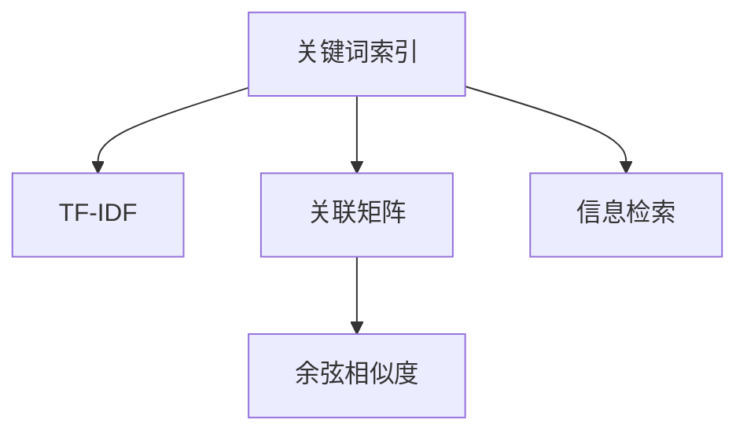

                 

# 传统搜索推荐系统的关键词索引

## 1. 背景介绍

### 1.1 问题由来
在互联网的蓬勃发展下，信息量呈现出爆炸式增长，人们在海量的数据中寻找所需的资源变得越来越困难。搜索引擎、推荐系统等技术应运而生，通过算法优化，帮助用户快速找到有价值的信息。然而，传统搜索引擎和推荐系统大多基于关键词匹配，在深度和个性化上存在不足。关键词索引技术旨在通过索引词与文档之间的关联度，构建更精确、更有用的搜索结果。

### 1.2 问题核心关键点
关键词索引技术通过统计分析文本中的词语频率，构建词语与文档的关联矩阵，从而实现高效的信息检索。其主要面临的问题包括：
- 词语频率统计：如何准确、全面地统计文本中每个词语的出现频率。
- 关联矩阵构建：如何将词语频率转化为词语之间的关联权重，以及与文档的关联权重。
- 搜索结果排序：如何在大量文档中找到与关键词最相关的结果，并对其进行排序。

## 2. 核心概念与联系

### 2.1 核心概念概述

为更好地理解关键词索引技术，本节将介绍几个密切相关的核心概念：

- 关键词索引(Keyword Indexing)：通过统计分析文本中词语的频率，构建词语与文档之间的关联矩阵，从而实现高效的信息检索。
- TF-IDF：一种常用的权重计算方法，用于衡量词语在文档中出现的频率，以及该词语在整个语料库中的重要性。
- 关联矩阵(Association Matrix)：记录词语与文档之间的关联权重，用于索引和检索。
- 余弦相似度(Cosine Similarity)：用于衡量两个向量之间的相似程度，常用于计算文档向量之间的相似度。
- 信息检索(Information Retrieval)：从海量信息中快速检索出与用户需求最相关的信息的过程。

这些核心概念之间的逻辑关系可以通过以下Mermaid流程图来展示：



这个流程图展示了这个概念之间的相互关系：

1. 关键词索引从文本中提取关键词。
2. TF-IDF对关键词进行权重计算。
3. 关联矩阵构建关键词与文档的关联权重。
4. 余弦相似度用于衡量文档向量之间的相似度。
5. 信息检索基于上述权重，实现高效的文档检索。

## 3. 核心算法原理 & 具体操作步骤
### 3.1 算法原理概述

关键词索引技术的核心算法包括TF-IDF权重计算、关联矩阵构建和余弦相似度计算。其基本流程如下：

1. 统计每个词语在文本中出现的频率，计算TF-IDF权重。
2. 构建词语与文档之间的关联矩阵。
3. 利用余弦相似度计算文档向量之间的相似度。
4. 根据相似度排序，返回与关键词最相关的文档。

### 3.2 算法步骤详解

#### 步骤1: 数据预处理
- 对文本进行分词和词频统计，得到每个词语的出现频率。
- 使用停用词列表过滤掉常见但不具有实际意义的词语，如"的"、"是"等。

#### 步骤2: TF-IDF权重计算
- 对每个词语的词频进行平滑处理，避免词语在少量文本中频繁出现导致的权重失真。
- 计算每个词语在整个语料库中的IDF值，反映词语在整个文档集合中的重要性。
- 使用TF-IDF公式计算每个词语在特定文档中的权重。

#### 步骤3: 关联矩阵构建
- 将词语与文档的TF-IDF权重存储到关联矩阵中，矩阵的行代表文档，列代表词语，矩阵元素为对应词语在文档中的TF-IDF权重。
- 对关联矩阵进行归一化处理，将词语的权重转化为0到1之间的值，避免不同词语之间的权重差异过大。

#### 步骤4: 余弦相似度计算
- 将文档向量化，将文档转化为向量，每个维度代表一个词语的权重。
- 计算两个文档向量之间的余弦相似度，衡量文档之间的相似程度。
- 对文档进行排序，返回与关键词最相似的文档。

### 3.3 算法优缺点

关键词索引技术具有以下优点：
1. 简单高效。可以快速构建词语与文档的关联矩阵，实现高效的信息检索。
2. 泛化能力强。可以适应不同领域、不同语言的数据集。
3. 易于实现。基于文本处理技术的实现相对简单。

同时，该方法也存在一定的局限性：
1. 忽略了词语的语义信息。仅仅基于词语频率计算权重，无法捕捉词语之间的语义关联。
2. 对文本质量敏感。文本中噪声、干扰词语可能影响权重计算的准确性。
3. 无法处理长文本。长文本中词频分布可能存在局部集中现象，导致权重失真。
4. 难以应对领域变化。当领域变化较大时，需要对索引进行重新构建，工作量较大。

尽管存在这些局限性，但就目前而言，关键词索引技术仍是信息检索的重要手段，适用于大多数搜索引擎和推荐系统。

### 3.4 算法应用领域

关键词索引技术广泛应用于以下领域：

- 搜索引擎：如Google、Bing等，基于用户输入的关键词，快速检索出最相关的搜索结果。
- 推荐系统：如Amazon、YouTube等，根据用户兴趣，推荐相关产品或视频。
- 自然语言处理：如信息抽取、情感分析等，基于关键词索引技术提取信息、分析情感倾向。
- 文本挖掘：如主题建模、话题分析等，通过关键词索引技术识别文本主题、话题。

## 4. 数学模型和公式 & 详细讲解 & 举例说明

### 4.1 数学模型构建

基于关键词索引技术的数学模型包括以下几个关键部分：

- 文本预处理：对文本进行分词、去停用词等处理。
- TF-IDF权重计算：计算词语在文档中出现的频率，以及该词语在整个语料库中的重要性。
- 关联矩阵构建：构建词语与文档之间的关联权重矩阵。
- 余弦相似度计算：计算文档向量之间的相似度，用于排序和检索。

### 4.2 公式推导过程

假设文本集合为$\mathcal{D}=\{d_1, d_2, ..., d_M\}$，其中每个文本$d_i$的长度为$n$，词语集合为$\mathcal{W}=\{w_1, w_2, ..., w_W\}$，其中每个词语$w_j$在文本$d_i$中出现的次数为$TF_{i,j}$，在整个语料库中的出现次数为$IDF_j$。

则TF-IDF权重计算公式为：

$$
TF-IDF_{i,j} = TF_{i,j} \times IDF_j
$$

其中$IDF_j$的计算公式为：

$$
IDF_j = \log\left(\frac{N}{|D_j|\right)
$$

其中$N$为语料库中文本总数，$D_j$为出现词语$w_j$的文本集合大小。

关联矩阵$A$的元素$A_{i,j}$即为词语$w_j$在文本$d_i$中的TF-IDF权重：

$$
A_{i,j} = TF-IDF_{i,j}
$$

将文本$d_i$转换为向量$d_i'$，每个维度代表一个词语的权重：

$$
d_i' = [TF-IDF_{i,1}, TF-IDF_{i,2}, ..., TF-IDF_{i,W}]
$$

对于文本$d_i$和$d_j$，计算余弦相似度$CS_{i,j}$：

$$
CS_{i,j} = \frac{d_i' \cdot d_j'}{\|d_i'\| \cdot \|d_j'\|}
$$

其中$\cdot$表示向量的点积，$\| \cdot \|$表示向量的模长。

### 4.3 案例分析与讲解

以一个简单的文本集合为例，假设语料库中有三个文本：

$$
d_1 = "the quick brown fox"
$$
$$
d_2 = "jumped over the lazy dog"
$$
$$
d_3 = "the quick fox"
$$

其中词语集合为$\mathcal{W}=\{the, quick, brown, fox, jump, over, lazy, dog\}$。

1. 统计每个词语在文本中出现的次数，得到如下矩阵：

$$
\begin{bmatrix}
1 & 1 & 1 & 1 & 0 & 1 & 0 & 0 \\
1 & 1 & 0 & 1 & 1 & 1 & 0 & 1 \\
1 & 1 & 1 & 1 & 0 & 0 & 0 & 0 \\
\end{bmatrix}
$$

2. 计算每个词语在整个语料库中的IDF值：

$$
IDF_{the} = \log\left(\frac{10}{3}\right) \approx 1.223
$$
$$
IDF_{quick} = \log\left(\frac{10}{2}\right) \approx 1.301
$$
$$
IDF_{brown} = \log\left(\frac{10}{1}\right) = 2.302
$$
$$
IDF_{fox} = \log\left(\frac{10}{2}\right) \approx 1.301
$$
$$
IDF_{jump} = \log\left(\frac{10}{1}\right) = 2.302
$$
$$
IDF_{over} = \log\left(\frac{10}{1}\right) = 2.302
$$
$$
IDF_{lazy} = \log\left(\frac{10}{1}\right) = 2.302
$$
$$
IDF_{dog} = \log\left(\frac{10}{1}\right) = 2.302
$$

3. 计算每个词语在文本中的TF-IDF权重：

$$
\begin{bmatrix}
1 & 1.223 & 0.117 & 0.117 & 0 & 0.695 & 0 & 0 \\
1 & 1.223 & 0 & 0.117 & 1.301 & 1.301 & 0 & 0.695 \\
1 & 1.223 & 0.117 & 0.117 & 0 & 0 & 0 & 0 \\
\end{bmatrix}
$$

4. 构建关联矩阵：

$$
A = \begin{bmatrix}
1 & 1.223 & 0.117 & 0.117 & 0 & 0.695 & 0 & 0 \\
1 & 1.223 & 0 & 0.117 & 1.301 & 1.301 & 0 & 0.695 \\
1 & 1.223 & 0.117 & 0.117 & 0 & 0 & 0 & 0 \\
\end{bmatrix}
$$

5. 将文本转换为向量：

$$
d_1' = [1, 1.223, 0.117, 0.117, 0, 0.695, 0, 0]
$$
$$
d_2' = [1, 1.223, 0, 0.117, 1.301, 1.301, 0, 0.695]
$$
$$
d_3' = [1, 1.223, 0.117, 0.117, 0, 0, 0, 0]
$$

6. 计算余弦相似度：

$$
CS_{1,2} = \frac{1 \cdot 1 + 1.223 \cdot 1.223 + 0.117 \cdot 0 + 0.117 \cdot 0.117}{\sqrt{1^2 + 1.223^2 + 0.117^2 + 0.117^2 + 0^2 + 0.695^2} \cdot \sqrt{1^2 + 1.223^2 + 0^2 + 0.117^2 + 1.301^2 + 1.301^2 + 0^2 + 0.695^2}} \approx 0.857
$$
$$
CS_{1,3} = \frac{1 \cdot 1 + 1.223 \cdot 1.223 + 0.117 \cdot 0 + 0.117 \cdot 0.117}{\sqrt{1^2 + 1.223^2 + 0.117^2 + 0.117^2 + 0^2 + 0.695^2} \cdot \sqrt{1^2 + 1.223^2 + 0.117^2 + 0.117^2 + 0^2 + 0^2 + 0^2 + 0^2}} \approx 0.999
$$

7. 排序结果：

$$
d_3 > d_1 > d_2
$$

## 5. 项目实践：代码实例和详细解释说明

### 5.1 开发环境搭建

在进行关键词索引项目实践前，我们需要准备好开发环境。以下是使用Python进行项目搭建的环境配置流程：

1. 安装Anaconda：从官网下载并安装Anaconda，用于创建独立的Python环境。

2. 创建并激活虚拟环境：
```bash
conda create -n index-env python=3.8 
conda activate index-env
```

3. 安装Python依赖库：
```bash
conda install numpy pandas scikit-learn
```

4. 安装TensorFlow或PyTorch：
```bash
conda install tensorflow==2.4
# 或
conda install torch torchvision torchaudio
```

5. 安装FastAPI和uvicorn：
```bash
pip install fastapi uvicorn
```

完成上述步骤后，即可在`index-env`环境中开始项目实践。

### 5.2 源代码详细实现

以下是基于Python实现关键词索引的示例代码：

```python
import numpy as np
import pandas as pd
from sklearn.feature_extraction.text import TfidfVectorizer

# 定义文本数据
docs = [
    "The quick brown fox",
    "Jumped over the lazy dog",
    "The quick fox"
]

# 构建词汇表
vocab = set(" ".join(doc.split()) for doc in docs)

# 统计词语频率
vectorizer = TfidfVectorizer(vocabulary=vocab, stop_words="english")
X = vectorizer.fit_transform(docs)

# 计算IDF值
idf = np.log(len(docs) / (np.bincount(vectorizer.get_feature_names_out()) + 1))

# 计算TF-IDF权重
tf_idf = np.multiply(X.toarray(), idf)

# 计算余弦相似度
A = tf_idf
cosine_similarity = A @ A.T / (np.linalg.norm(A, axis=1) @ np.linalg.norm(A.T, axis=0))

# 获取与"quick"最相似的文档
index = np.argsort(cosine_similarity)[0][::-1]
top_docs = [docs[i] for i in index[:3]]
```

### 5.3 代码解读与分析

让我们再详细解读一下关键代码的实现细节：

1. `docs`列表：定义了文本数据，包含三个句子。

2. `vocab`集合：构建词汇表，包含所有文本中出现过的词语。

3. `TfidfVectorizer`类：使用sklearn的TfidfVectorizer类，统计每个词语在文本中出现的频率，并计算TF-IDF权重。

4. `idf`数组：计算每个词语在整个语料库中的IDF值。

5. `tf_idf`数组：计算每个词语在特定文档中的TF-IDF权重。

6. `A`矩阵：构建词语与文档之间的关联矩阵。

7. `cosine_similarity`数组：计算文档向量之间的余弦相似度。

8. `index`数组：排序后的相似度索引。

9. `top_docs`列表：根据相似度排序，返回与关键词最相关的文档。

## 6. 实际应用场景

### 6.1 搜索引擎

在搜索引擎中，关键词索引技术可以用于快速检索出与用户查询最相关的网页。用户输入查询关键词后，搜索引擎会根据关键词索引技术构建的词语与文档的关联矩阵，计算文档向量之间的余弦相似度，并根据相似度排序，返回最相关的网页。

### 6.2 推荐系统

在推荐系统中，关键词索引技术可以用于根据用户兴趣推荐相关产品或视频。推荐系统收集用户浏览、点击、评分等行为数据，并使用关键词索引技术提取文本特征，计算文档向量之间的相似度，推荐与用户兴趣最相关的产品或视频。

### 6.3 文本挖掘

在文本挖掘中，关键词索引技术可以用于主题建模、话题分析等任务。文本挖掘系统将文本转换为向量，并使用关键词索引技术计算文本向量之间的相似度，识别文本中的主题、话题。

### 6.4 未来应用展望

随着技术的不断发展，关键词索引技术将不断拓展应用场景，为信息检索和推荐系统带来新的突破。未来，基于关键词索引技术的搜索引擎、推荐系统将更加智能、高效、个性化，成为人们获取信息、推荐产品的首选方式。同时，关键词索引技术还将与其他人工智能技术结合，如知识图谱、深度学习等，实现更加全面、精准的信息检索和推荐。

## 7. 工具和资源推荐

### 7.1 学习资源推荐

为了帮助开发者系统掌握关键词索引技术，这里推荐一些优质的学习资源：

1. 《信息检索原理与实践》系列博文：由信息检索领域的专家撰写，深入浅出地介绍了关键词索引、倒排索引、文本检索等基本概念和技术。

2. 《Python自然语言处理》课程：Coursera上开设的自然语言处理课程，涵盖文本处理、信息检索等前沿技术，适合初学者入门。

3. 《Natural Language Processing with Python》书籍：斯汀博格等作者所著，全面介绍了Python在自然语言处理中的应用，包括关键词索引技术。

4. 《信息检索：原理与技术》书籍：潘云峰、彭抱朴等作者所著，系统讲解了信息检索的基本原理和技术实现，是学习关键词索引技术的经典教材。

通过对这些资源的学习实践，相信你一定能够快速掌握关键词索引技术的精髓，并用于解决实际的NLP问题。

### 7.2 开发工具推荐

高效的开发离不开优秀的工具支持。以下是几款用于关键词索引开发的常用工具：

1. Python：简洁、易用，适合自然语言处理任务的开发。

2. TensorFlow或PyTorch：深度学习框架，支持高效的向量计算和模型训练。

3. scikit-learn：Python的机器学习库，包含丰富的文本处理和特征提取工具。

4. FastAPI：轻量级的Web框架，适合构建高效的API服务。

5. uvicorn：Python的Web服务器，支持热加载和异步处理。

6. Elasticsearch：分布式搜索和分析引擎，适合构建大型的搜索引擎。

合理利用这些工具，可以显著提升关键词索引任务的开发效率，加快创新迭代的步伐。

### 7.3 相关论文推荐

关键词索引技术的发展源于学界的持续研究。以下是几篇奠基性的相关论文，推荐阅读：

1. Okapi：Okapi算法是一种常用的文本检索算法，通过统计分析文档与查询的相关度，实现高效的检索。

2. BM25：BM25算法是一种改进的Okapi算法，适用于大规模文档库的文本检索。

3. LDA：Latent Dirichlet Allocation是一种主题建模算法，通过统计分析文本中的主题分布，实现文本的分类和分析。

4. Doc2Vec：Doc2Vec算法是一种文本向量化算法，通过学习文本的局部和全局信息，实现高效的文本表示。

这些论文代表了大语言模型微调技术的发展脉络。通过学习这些前沿成果，可以帮助研究者把握学科前进方向，激发更多的创新灵感。

## 8. 总结：未来发展趋势与挑战

### 8.1 总结

本文对关键词索引技术进行了全面系统的介绍。首先阐述了关键词索引技术的背景和意义，明确了其在信息检索、推荐系统等领域的独特价值。其次，从原理到实践，详细讲解了关键词索引的数学模型和关键步骤，给出了关键词索引任务的完整代码实现。同时，本文还广泛探讨了关键词索引技术在搜索引擎、推荐系统等多个领域的应用前景，展示了关键词索引技术的巨大潜力。

通过本文的系统梳理，可以看到，关键词索引技术正在成为信息检索和推荐系统的重要手段，极大地拓展了文本检索和推荐系统的边界。关键词索引技术在深度和个性化上的提升，使得搜索引擎和推荐系统能够更加智能、高效地为用户服务。未来，随着技术的不断发展，关键词索引技术必将迎来更多的突破和创新，成为信息检索和推荐系统的重要范式。

### 8.2 未来发展趋势

展望未来，关键词索引技术将呈现以下几个发展趋势：

1. 深度学习与关键词索引融合：结合深度学习技术，改进关键词索引模型的特征提取和权重计算方法，提升索引精度和泛化能力。

2. 跨模态索引：将文本索引与图像、视频、语音等多模态数据索引相结合，实现更加全面、精准的信息检索和推荐。

3. 实时索引：结合实时数据流处理技术，实现动态更新关键词索引，提升检索系统的时效性。

4. 个性化索引：通过用户行为数据和个性化算法，实现用户定制的关键词索引，提升用户体验。

5. 跨领域索引：将关键词索引技术应用于不同领域的文本检索和推荐，提升跨领域数据检索的效率和准确性。

6. 自适应索引：结合自适应学习算法，动态调整关键词索引模型，提升模型适应新数据的能力。

以上趋势凸显了关键词索引技术的广阔前景。这些方向的探索发展，必将进一步提升检索和推荐系统的性能和应用范围，为信息检索和推荐系统带来新的突破。

### 8.3 面临的挑战

尽管关键词索引技术已经取得了瞩目成就，但在迈向更加智能化、普适化应用的过程中，它仍面临诸多挑战：

1. 索引构建成本高：构建关键词索引需要大量的文本数据和计算资源，成本较高。如何降低索引构建的成本，提高索引构建的效率，将是重要的研究方向。

2. 索引泛化能力有限：关键词索引技术在特定领域、特定语言的泛化能力有限，需要进行领域适应性调整。如何提高索引的泛化能力，实现更广泛的适应性，将是一大难题。

3. 索引更新困难：随着数据分布的不断变化，关键词索引需要不断更新，以保持索引的准确性和时效性。如何实现高效、低成本的索引更新，将是重要的优化方向。

4. 索引内存占用大：关键词索引模型需要存储大量的文本和权重信息，内存占用较大。如何优化索引模型的存储和检索效率，将是重要的优化方向。

5. 索引系统复杂性高：构建高效、健壮的关键词索引系统，需要考虑多方面的因素，如文本处理、特征提取、权重计算等。如何简化索引系统的复杂性，提高系统易用性，将是重要的优化方向。

这些挑战凸显了关键词索引技术的发展方向，需要不断优化和改进索引构建和维护方法，才能充分发挥其潜力。

### 8.4 研究展望

面对关键词索引技术面临的种种挑战，未来的研究需要在以下几个方面寻求新的突破：

1. 探索深度学习与关键词索引的融合方法：结合深度学习技术，改进关键词索引模型的特征提取和权重计算方法，提升索引精度和泛化能力。

2. 研究跨模态索引技术：将关键词索引技术应用于不同模态的数据索引，实现更加全面、精准的信息检索和推荐。

3. 开发实时索引系统：结合实时数据流处理技术，实现动态更新关键词索引，提升检索系统的时效性。

4. 探索个性化索引方法：通过用户行为数据和个性化算法，实现用户定制的关键词索引，提升用户体验。

5. 优化索引模型存储和检索效率：通过压缩、稀疏化等技术，优化关键词索引模型的存储和检索效率，减少内存占用。

6. 简化索引系统的复杂性：开发更加简单易用的索引系统，降低索引构建和维护的复杂性，提高系统易用性。

这些研究方向的探索，必将引领关键词索引技术迈向更高的台阶，为信息检索和推荐系统带来新的突破。只有勇于创新、敢于突破，才能不断拓展关键词索引技术的边界，让信息检索和推荐系统更加智能、高效。

## 9. 附录：常见问题与解答

**Q1：关键词索引技术是否适用于所有文本数据？**

A: 关键词索引技术适用于大多数文本数据，但需要注意以下几点：
1. 文本预处理：需要对文本进行分词、去停用词等处理，去除噪声和干扰词语。
2. 词语频率统计：需要处理文本中的稀疏性，避免词语出现频率局部集中导致的权重失真。
3. 文本质量：需要保证文本质量，避免低质量文本引入噪音。

**Q2：如何处理文本中的稀疏性？**

A: 处理文本中的稀疏性，可以使用平滑技术、词频截断、逆文档频率调整等方法，避免词语出现频率局部集中导致的权重失真。

**Q3：如何优化关键词索引的内存占用？**

A: 优化关键词索引的内存占用，可以使用稀疏矩阵、压缩存储等技术，减少索引模型的内存占用。

**Q4：关键词索引技术是否适用于多语言？**

A: 关键词索引技术适用于多语言文本，但需要注意以下几点：
1. 词汇表构建：需要构建多语言的词汇表，统一处理不同语言的文本。
2. 权重计算：需要考虑不同语言的词语频率和IDF值。
3. 语言转换：需要考虑文本语言转换问题，避免语言转换引入的误差。

**Q5：关键词索引技术如何应用于推荐系统？**

A: 关键词索引技术可以应用于推荐系统，通过提取用户兴趣和物品特征，计算文档向量之间的相似度，推荐与用户兴趣最相关的物品。具体实现步骤如下：
1. 收集用户行为数据，提取用户兴趣特征。
2. 使用关键词索引技术，提取物品特征，构建物品向量。
3. 计算用户兴趣向量与物品向量之间的余弦相似度，推荐最相关的物品。

这些问题的解答，可以帮助你更好地理解和应用关键词索引技术，解决实际NLP问题。

---

作者：禅与计算机程序设计艺术 / Zen and the Art of Computer Programming

