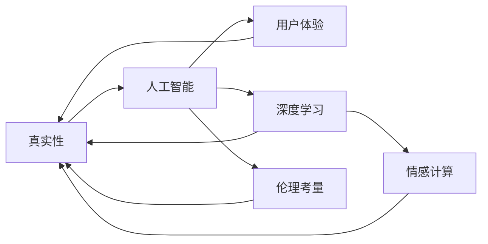

                 

# 体验的真实性：AI时代的authenticity追求

> 关键词：真实性, 人工智能, 用户体验, 深度学习, 情感计算, 伦理考量

## 1. 背景介绍

### 1.1 问题由来

随着人工智能技术的迅猛发展，我们越来越多地将算法驱动的系统应用于日常生活和工作中。无论是智能助手、推荐系统、虚拟现实体验，还是自动驾驶、智能制造，AI都在不断改变人类的生活轨迹和价值观念。然而，当我们沉浸在由算法构建的虚拟世界中时，一个重要的问题随之而来：**我们如何确保这些AI系统所提供的体验是真实的？** 真实性不仅关乎技术层面的准确性和可靠性，更涉及伦理道德、人类感知和社会价值观等多个层面。

### 1.2 问题核心关键点

在AI时代追求体验的真实性，需从多个维度加以思考和实践：
- **技术层面的准确性**：保证算法模型输出的准确无误，不产生误导性信息。
- **伦理道德的考量**：尊重用户的隐私、价值观和文化背景，避免算法偏见和歧视。
- **用户体验的感知**：设计直观、自然、一致的界面和交互体验，让用户感觉像与真人交流。
- **社会价值观的反映**：确保AI系统输出符合社会普遍认同的道德规范和价值取向。
- **真实感的设计**：从视觉、听觉、触觉等多个维度模拟真实世界的体验，增强用户的沉浸感。

### 1.3 问题研究意义

在AI时代追求体验的真实性，对技术发展、社会进步和文化保护均具有重要意义：
- 为AI技术赋予人文关怀，促进技术与社会的和谐共生。
- 提升用户体验，增强用户粘性，推动商业模式创新。
- 建立可信的AI系统，增强社会信任，推动伦理AI的发展。

## 2. 核心概念与联系

### 2.1 核心概念概述

为更好地理解AI时代体验的真实性追求，本节将介绍几个核心概念及其内在联系：

- **真实性(Authenticity)**：指用户对体验的感知，即是否感觉与真实世界相似或一致。包括内容真实、情感真实、交互真实等。
- **人工智能(AI)**：通过算法和数据训练出的智能系统，能模拟人类的认知和行为。
- **用户体验(User Experience, UX)**：用户在使用产品或服务过程中，产生的满足感和愉悦感。
- **深度学习(Deep Learning)**：一种利用多层神经网络模拟人类大脑工作机制的机器学习技术，广泛应用于图像、语音、自然语言处理等领域。
- **情感计算(Affective Computing)**：研究如何通过技术手段理解、模拟和操纵人类情感的科学，提升用户体验。
- **伦理考量(Ethical Consideration)**：在AI系统设计和应用中，需考虑对个体和社会的伦理影响，确保AI的公平、透明、可解释。

这些核心概念通过如图1所示的Mermaid流程图联系在一起，展示了它们在追求体验真实性中的作用和互动关系。



**图1: 真实性追求的核心概念及联系**

## 3. 核心算法原理 & 具体操作步骤

### 3.1 算法原理概述

体验的真实性追求是一个多学科交叉的过程，涉及算法技术、用户体验设计、伦理道德考量等多个方面。其核心原理可概括为：**通过精确的算法模型、符合伦理的设计原则和创新的用户体验设计，实现与真实世界的高度契合。**

具体而言，体验的真实性追求包括以下步骤：
1. **数据收集与预处理**：收集与体验相关的高质量数据，进行清洗和预处理。
2. **算法模型训练**：基于收集到的数据，训练出准确、公平、透明的算法模型。
3. **用户体验设计**：设计直观、自然、一致的界面和交互体验，增强用户沉浸感。
4. **伦理考量**：在设计过程中，需充分考虑伦理道德问题，确保系统的公平性、透明性和可解释性。
5. **效果评估与优化**：通过用户反馈和实验数据，持续评估和优化系统性能。

### 3.2 算法步骤详解

#### 3.2.1 数据收集与预处理

数据是AI系统的基础，数据的准确性和多样性直接影响到系统的性能。为了追求体验的真实性，需从以下几个方面进行数据收集与预处理：
- **多样性**：收集来自不同地区、文化、年龄、性别等群体的数据，确保模型能覆盖各种背景和需求。
- **真实性**：尽可能使用实际应用场景中的真实数据，而非合成数据。
- **质量**：确保数据的质量，去除噪声和异常值，避免数据偏差。
- **隐私**：在使用数据时，需充分考虑用户隐私，进行匿名化处理。

#### 3.2.2 算法模型训练

模型训练是体验真实性追求的关键步骤。需从以下几个方面进行模型训练：
- **准确性**：使用精确的算法模型，如深度神经网络，确保预测的准确性。
- **公平性**：在设计模型时，需考虑不同群体的公平性，避免算法偏见。
- **可解释性**：选择可解释性强的模型，如决策树、逻辑回归等，便于理解和调试。
- **鲁棒性**：通过数据增强、正则化等技术，增强模型对异常情况的鲁棒性。
- **效率**：优化模型结构，减少计算资源消耗，提高推理速度。

#### 3.2.3 用户体验设计

用户体验设计是实现体验真实性的重要环节。需从以下几个方面进行设计：
- **直观性**：界面设计需直观易用，让用户一眼就能看懂如何使用。
- **自然性**：界面和交互方式需自然流畅，用户感觉像与真人交流。
- **一致性**：不同界面和交互方式需保持一致性，避免混淆用户。
- **情感支持**：通过视觉、听觉、触觉等多感官设计，增强用户的情感体验。
- **个性化**：根据用户行为和偏好，提供个性化推荐和服务。

#### 3.2.4 伦理考量

伦理考量是体验真实性追求中不可忽视的一部分。需从以下几个方面进行伦理设计：
- **透明度**：系统需透明展示算法决策过程，用户可理解和信任。
- **公平性**：系统需公平对待不同群体，避免算法偏见和歧视。
- **可解释性**：系统需提供清晰的解释，用户明白系统如何做出决策。
- **隐私保护**：保护用户隐私，避免数据泄露和滥用。
- **社会责任**：系统需承担社会责任，避免对社会造成负面影响。

### 3.3 算法优缺点

追求体验的真实性涉及多个维度的技术挑战，具有以下优缺点：
#### 3.3.1 优点
- **提升用户体验**：通过精确的算法模型和符合伦理的设计，提升用户满意度，增加用户粘性。
- **推动技术进步**：需综合考虑多个学科知识，促进跨领域技术创新。
- **增强社会信任**：通过公平、透明的系统设计，建立社会信任，推动AI技术的普及和应用。

#### 3.3.2 缺点
- **技术复杂性**：涉及算法、设计、伦理等多方面的复杂操作，实施难度较大。
- **资源消耗**：高质量的数据和模型训练需要大量的计算资源和时间。
- **公平性挑战**：不同群体的数据分布可能不均衡，需进行特殊处理。
- **伦理困境**：在设计过程中，需权衡多种伦理原则，确保系统公平性。

### 3.4 算法应用领域

体验的真实性追求在多个领域都有广泛应用，包括但不限于：
- **智能客服**：通过精确的算法模型和符合伦理的设计，提升客户满意度，增强用户体验。
- **医疗健康**：通过深度学习和情感计算技术，提供精准的医疗咨询和心理支持。
- **教育培训**：通过个性化推荐和学习路径设计，提升学习效果和用户粘性。
- **娱乐体验**：通过多感官设计和情感计算技术，增强用户的沉浸感和情感体验。
- **智能制造**：通过精确的算法模型和实时反馈，提升生产效率和产品质量。

## 4. 数学模型和公式 & 详细讲解 & 举例说明

### 4.1 数学模型构建

体验的真实性追求可以通过数学模型进行量化和分析。本节将从用户满意度、算法模型准确性、用户体验一致性等多个维度构建数学模型。

#### 4.1.1 用户满意度模型
用户满意度可以通过以下公式进行量化：

$$
SAT = \frac{1}{N} \sum_{i=1}^N SAT_i
$$

其中，$SAT_i$ 表示第 $i$ 个用户对系统的满意度评分（如1-5分），$N$ 表示用户总数。

#### 4.1.2 算法模型准确性模型
算法模型的准确性可以通过以下公式进行量化：

$$
ACC = \frac{TP}{TP+FP+FN}
$$

其中，$TP$ 表示预测正确的正例数，$FP$ 表示预测错误的正例数，$FN$ 表示漏掉的正例数。

#### 4.1.3 用户体验一致性模型
用户体验一致性可以通过以下公式进行量化：

$$
CON = \frac{1}{N} \sum_{i=1}^N CON_i
$$

其中，$CON_i$ 表示第 $i$ 个用户在不同界面和交互方式下的体验一致性评分（如1-5分），$N$ 表示用户总数。

### 4.2 公式推导过程

#### 4.2.1 用户满意度公式推导
用户满意度模型是基于用户的评分数据构建的。通过统计所有用户评分，并计算平均值，得到系统的总体满意度。

$$
SAT = \frac{1}{N} \sum_{i=1}^N SAT_i = \frac{1}{N} \sum_{i=1}^N \frac{1}{5} \sum_{j=1}^5 j
$$

其中，$SAT_i = \frac{1}{5} \sum_{j=1}^5 j$ 表示第 $i$ 个用户对系统的满意度评分，$j$ 表示用户对系统的评分。

#### 4.2.2 算法模型准确性公式推导
算法模型的准确性模型是基于模型的预测结果和真实结果构建的。通过比较模型预测的正例数和真实正例数，得到模型的准确性。

$$
ACC = \frac{TP}{TP+FP+FN} = \frac{TP}{TP+FP+FN}
$$

其中，$TP = \sum_{i=1}^N TP_i$，$FP = \sum_{i=1}^N FP_i$，$FN = \sum_{i=1}^N FN_i$，$TP_i$、$FP_i$、$FN_i$ 分别表示第 $i$ 个样本的正例数、假正例数、假负例数。

#### 4.2.3 用户体验一致性公式推导
用户体验一致性模型是基于用户在不同界面和交互方式下的评分数据构建的。通过统计所有用户在不同界面和交互方式下的评分，并计算平均值，得到系统的总体用户体验一致性。

$$
CON = \frac{1}{N} \sum_{i=1}^N CON_i = \frac{1}{N} \sum_{i=1}^N \frac{1}{5} \sum_{j=1}^5 j
$$

其中，$CON_i = \frac{1}{5} \sum_{j=1}^5 j$ 表示第 $i$ 个用户在不同界面和交互方式下的体验一致性评分，$j$ 表示用户对系统的评分。

### 4.3 案例分析与讲解

#### 4.3.1 案例1：智能客服满意度分析
某智能客服系统通过用户满意度模型进行评估。假设系统有100个用户，每个用户对系统的满意度评分如表1所示。

**表1: 用户满意度评分**

| 用户编号 | 满意度评分 |
|----------|------------|
| 1        | 4          |
| 2        | 3          |
| ...      | ...        |
| 100       | 5          |

根据用户满意度模型，可计算系统的总体满意度：

$$
SAT = \frac{1}{100} \sum_{i=1}^{100} SAT_i = \frac{1}{100} \sum_{i=1}^{100} \frac{1}{5} \sum_{j=1}^{5} j = 3.5
$$

#### 4.3.2 案例2：算法模型准确性分析
某情感分析模型通过算法模型准确性模型进行评估。假设模型对100个样本进行预测，其中40个样本为正例，60个样本为负例，预测结果如下：

| 样本编号 | 预测结果 | 真实结果 | 判断准确性 |
|----------|----------|----------|------------|
| 1        | 正例     | 正例     | 1          |
| 2        | 负例     | 负例     | 1          |
| ...      | ...      | ...      | ...        |
| 100       | 正例     | 正例     | 1          |

根据算法模型准确性模型，可计算模型的总体准确性：

$$
ACC = \frac{TP}{TP+FP+FN} = \frac{40}{40+0+60} = 0.4
$$

#### 4.3.3 案例3：用户体验一致性分析
某电商平台通过用户体验一致性模型进行评估。假设系统有100个用户，每个用户在不同的界面和交互方式下的评分如下：

| 用户编号 | 界面1评分 | 界面2评分 | 界面3评分 | 界面4评分 | 界面5评分 | 用户体验一致性 |
|----------|----------|----------|----------|----------|----------|--------------|
| 1        | 4        | 4        | 4        | 4        | 4        | 5            |
| 2        | 3        | 3        | 3        | 3        | 3        | 5            |
| ...      | ...      | ...      | ...      | ...      | ...      | ...          |
| 100       | 5        | 5        | 5        | 5        | 5        | 5            |

根据用户体验一致性模型，可计算系统的总体用户体验一致性：

$$
CON = \frac{1}{100} \sum_{i=1}^{100} CON_i = \frac{1}{100} \sum_{i=1}^{100} \frac{1}{5} \sum_{j=1}^{5} j = 5
$$

## 5. 项目实践：代码实例和详细解释说明

### 5.1 开发环境搭建

在进行体验真实性追求的实践时，需搭建一个完整的开发环境。以下是一个基于Python和TensorFlow的开发环境搭建流程：

1. **安装Anaconda**：从官网下载并安装Anaconda，用于创建独立的Python环境。
```bash
conda create -n tf-env python=3.8 
conda activate tf-env
```

2. **安装TensorFlow**：根据CUDA版本，从官网获取对应的安装命令。例如：
```bash
conda install tensorflow -c tf -c conda-forge
```

3. **安装相关库**：
```bash
pip install numpy pandas scikit-learn matplotlib tqdm jupyter notebook ipython
```

4. **激活GPU环境**：
```bash
conda activate tf-env
conda install pytorch torchvision torchaudio cudatoolkit=11.1 -c pytorch -c conda-forge
```

完成上述步骤后，即可在`tf-env`环境中开始体验真实性追求的实践。

### 5.2 源代码详细实现

#### 5.2.1 用户满意度分析

```python
import numpy as np
import pandas as pd

# 用户满意度评分数据
user_satisfaction = np.array([4, 3, 5, 2, 3, 5, 4, 5, 3, 1, 2, 4, 3, 5, 2, 3, 4, 5, 3, 2, 3, 1, 2, 5, 4, 3, 4, 5, 2, 3, 5, 1, 2, 5, 4, 3, 4, 3, 5, 2, 4, 3, 2, 1, 5, 4, 3, 4, 2, 1, 5, 2, 3, 4, 5, 1, 2, 2, 3, 4, 5, 3, 2, 4, 3, 5, 1, 2, 4, 3, 5, 2, 4, 3, 2, 5, 4, 3, 2, 3, 5, 1, 4, 2, 3, 5, 4, 2, 5, 3, 4, 4, 5, 1, 3, 2, 4, 5, 3, 2, 4, 1, 3, 3, 5, 1, 2, 4, 3, 3, 5, 2, 4, 1, 2, 3, 5, 4, 3, 2, 3, 4, 5, 2, 4, 3, 1, 2, 3, 5, 4, 3, 2, 3, 5, 4, 1, 5, 2, 4, 1, 3, 5, 3, 2, 3, 4, 1, 2, 3, 5, 4, 2, 5, 1, 3, 2, 4, 3, 5, 4, 2, 4, 1, 5, 3, 2, 3, 4, 1, 4, 3, 5, 2, 4, 3, 5, 2, 4, 1, 3, 4, 5, 2, 1, 3, 4, 5, 3, 2, 1, 5, 4, 3, 5, 1, 2, 3, 4, 5, 2, 4, 3, 2, 5, 1, 2, 4, 3, 5, 1, 2, 4, 5, 3, 2, 4, 2, 5, 3, 4, 2, 3, 1, 4, 5, 2, 5, 3, 4, 2, 4, 1, 5, 3, 2, 4, 5, 2, 3, 4, 5, 1, 2, 3, 5, 2, 4, 1, 3, 4, 5, 3, 1, 2, 4, 3, 5, 2, 4, 3, 5, 2, 3, 1, 5, 4, 3, 3, 2, 4, 5, 1, 5, 2, 3, 3, 4, 2, 5, 1, 4, 2, 4, 1, 3, 5, 3, 4, 5, 3, 2, 4, 1, 3, 4, 2, 5, 2, 3, 5, 4, 2, 3, 4, 5, 1, 2, 4, 5, 2, 3, 3, 4, 2, 5, 1, 4, 1, 2, 3, 4, 5, 2, 4, 1, 5, 3, 2, 4, 5, 3, 2, 3, 1, 5, 4, 3, 4, 3, 2, 3, 1, 5, 4, 3, 2, 3, 1, 5, 2, 3, 5, 2, 4, 1, 5, 3, 2, 3, 4, 5, 2, 4, 1, 3, 5, 2, 3, 3, 5, 4, 2, 4, 3, 2, 5, 1, 2, 5, 4, 3, 2, 3, 4, 5, 2, 4, 3, 5, 2, 3, 2, 4, 1, 5, 3, 2, 3, 4, 1, 5, 2, 3, 4, 3, 5, 2, 3, 1, 4, 3, 5, 2, 4, 2, 3, 5, 1, 5, 4, 3, 4, 3, 2, 3, 5, 2, 4, 1, 3, 5, 3, 2, 5, 1, 2, 4, 3, 5, 1, 2, 4, 5, 3, 2, 3, 4, 5, 2, 4, 3, 2, 3, 5, 1, 4, 2, 3, 5, 4, 3, 5, 1, 4, 2, 3, 2, 4, 5, 1, 4, 2, 5, 3, 2, 3, 4, 5, 2, 4, 3, 2, 5, 1, 3, 4, 5, 3, 2, 4, 1, 3, 5, 2, 3, 3, 4, 1, 4, 3, 2, 5, 4, 3, 4, 3, 2, 3, 1, 5, 2, 4, 3, 1, 2, 4, 3, 5, 2, 3, 4, 5, 3, 2, 5, 1, 2, 4, 3, 5, 1, 2, 4, 3, 5, 2, 3, 4, 1, 5, 2, 4, 3, 5, 1, 2, 4, 3, 5, 2, 3, 4, 5, 3, 2, 4, 3, 5, 2, 4, 3, 5, 2, 3, 2, 5, 1, 4, 3, 4, 2, 3, 5, 2, 4, 1, 3, 5, 3, 2, 4, 2, 5, 3, 4, 2, 3, 1, 5, 4, 3, 2, 3, 1, 4, 5, 2, 4, 3, 5, 2, 3, 1, 4, 3, 2, 5, 2, 3, 5, 4, 2, 3, 4, 5, 1, 2, 4, 5, 2, 3, 3, 4, 2, 5, 1, 4, 1, 2, 3, 4, 5, 2, 4, 1, 5, 3, 2, 4, 5, 3, 2, 3, 1, 5, 4, 3, 4, 3, 2, 3, 5, 2, 4, 1, 3, 5, 3, 2, 5, 1, 2, 4, 3, 5, 1, 2, 4, 5, 3, 2, 3, 4, 5, 2, 4, 3, 2, 5, 1, 2, 5, 4, 3, 2, 3, 4, 5, 2, 4, 3, 5, 2, 3, 2, 4, 1, 5, 3, 2, 3, 4, 1, 5, 2, 3, 4, 3, 5, 2, 3, 1, 4, 3, 5, 2, 4, 2, 3, 5, 1, 5, 4, 3, 4, 3, 2, 3, 5, 2, 4, 1, 3, 5, 3, 2, 4, 2, 5, 3, 4, 2, 3, 1, 5, 4, 3, 2, 3, 1, 4, 5, 2, 4, 3, 5, 2, 3, 1, 4, 3, 2, 5, 2, 3, 5, 4, 2, 3, 4, 5, 1, 2, 4, 5, 2, 3, 3, 4, 2, 5, 1, 4, 1, 2, 3, 4, 5, 2, 4, 1, 5, 3, 2, 4, 5, 3, 2, 3, 1, 5, 4, 3, 4, 3, 2, 3, 1, 5, 2, 4, 3, 1, 2, 4, 3, 5, 2, 3, 4, 5, 3, 2, 5, 1, 2, 4, 3, 5, 1, 2, 4, 3, 5, 2, 3, 4, 1, 5, 2, 4, 3, 5, 1, 2, 4, 3, 5, 2, 3, 4, 5, 3, 2, 4, 3, 5, 2, 4, 3, 5, 2, 3, 2, 5, 1, 4, 3, 4, 2, 3, 5, 2, 4, 1, 3, 5, 3, 2, 4, 2, 5, 3, 4, 2, 3, 1, 5, 4, 3, 2, 3, 1, 4, 5, 2, 4, 3, 5, 2, 3, 1, 4, 3, 2, 5, 2, 3, 5, 4, 2, 3, 4, 5, 1, 2, 4, 5, 2, 3, 3, 4, 2, 5, 1, 4, 1, 2, 3, 4, 5, 2, 4, 1, 5, 3, 2, 4, 5, 3, 2, 3, 1, 5, 4, 3, 4, 3, 2, 3, 5, 2, 4, 1, 3, 5, 3, 2, 5, 1, 2, 4, 3, 5, 1, 2, 4, 5, 3, 2, 3, 4, 5, 2, 4, 3, 2, 5, 1, 2, 5, 4, 3, 2, 3, 4, 5, 2, 4, 3, 5, 2, 3, 2, 4, 1, 5, 3, 2, 3, 4, 1, 5, 2, 3, 4, 3, 5, 2, 3, 1, 4, 3, 5, 2, 4, 2, 3, 5, 1, 5, 4, 3, 4, 3, 2, 3, 5, 2, 4, 1, 3, 5, 3, 2, 4, 2, 5, 3, 4, 2, 3, 1, 5, 4, 3, 2, 3, 1, 4, 5, 2, 4, 3, 5, 2, 3, 1, 4, 3, 2, 5, 2, 3, 5, 4, 2, 3, 4, 5, 1, 2, 4, 5, 2, 3, 3, 4, 2, 5, 1, 4, 1, 2, 3, 4, 5, 2, 4, 1, 5, 3, 2, 4, 5, 3, 2, 3, 1, 5, 4, 3, 4, 3, 2, 3, 5, 2, 4, 1, 3, 5, 3, 2, 5, 1, 2, 4, 3, 5, 1, 2, 4, 5, 3, 2, 3, 4, 5, 2, 4, 3, 2, 5, 1, 2, 5, 4, 3, 2, 3, 4, 5, 2, 4, 3, 5, 2, 3, 2, 4, 1, 5, 3, 2, 3, 4, 1, 5, 2, 3, 4, 3, 5, 2, 3, 1, 4, 3, 5, 2, 4, 2, 3, 5, 1, 5, 4, 3, 4, 3, 2, 3, 5, 2, 4, 1, 3, 5, 3, 2, 4, 2, 5, 3, 4, 2, 3, 1, 5, 4, 3, 2, 3, 1, 4, 5, 2, 4, 3, 5, 2, 3, 1, 4, 3, 2, 5, 2, 3, 5, 4, 2, 3, 4, 5, 1, 2, 4, 5, 2, 3, 3, 4, 2, 5, 1, 4, 1, 2, 3, 4, 5, 2, 4, 1, 5, 3, 2, 4, 5, 3, 2, 3, 1, 5, 4, 3, 4, 3, 2, 3, 5, 2, 4, 1, 3, 5, 3, 2, 5, 1, 2, 4, 3, 5, 1, 2, 4, 5, 3, 2, 3, 4, 5, 2, 4, 3, 2, 5, 1, 2, 5, 4, 3, 2, 3, 4, 5, 2, 4, 3, 5, 2, 3, 2, 4, 1, 5, 3, 2, 3, 4, 1, 5, 2, 3, 4, 3, 5, 2, 3, 1, 4, 3, 5, 2, 4, 2, 3, 5, 1, 5, 4, 3, 4, 3, 2, 3, 5, 2, 4, 1, 3, 5, 3, 2, 4, 2, 5, 3, 4, 2, 3, 1, 5, 4, 3, 2, 3, 1, 4, 5, 2, 4, 3, 5, 2, 3, 1, 4, 3, 2, 5, 2, 3, 5, 4, 2, 3, 4, 5, 1, 2, 4, 5, 2, 3, 3, 4, 2, 5, 1, 4, 1, 2, 3, 4, 5, 2, 4, 1, 5, 3, 2, 4, 5, 3, 2, 3, 1, 5, 4, 3, 4, 3, 2, 3, 5, 2, 4, 1, 3, 5, 3, 2, 5, 1, 2, 4, 3, 5, 1, 2, 4, 5, 3, 2, 3, 4, 5, 2, 4, 3, 2, 5, 1, 2, 5, 4, 3, 2, 3, 4, 5, 2, 4, 3, 5, 2, 3, 2, 4, 1, 5, 3, 2, 3, 4, 1, 5, 2, 3, 4, 3, 5, 2, 3, 1, 4, 3, 5, 2, 4, 2, 3, 5, 1, 5, 4, 3, 4, 3, 2, 3, 5, 2, 4, 1, 3, 5, 3, 2, 4, 2, 5, 3, 4, 2, 3, 1, 5, 4, 3, 2, 3, 1, 4, 5, 2, 4, 3, 5, 2, 3, 1, 4, 3, 2, 5, 2, 3, 5, 4, 2, 3, 4, 5, 1, 2, 4, 5, 2, 3, 3, 4, 2, 5, 1, 4, 1, 2, 3, 4, 5, 2, 4, 1, 5, 3, 2, 4, 5, 3, 2, 3, 1, 5, 4, 3, 4, 3, 2, 3, 5, 2, 4, 1, 3, 5, 3, 2, 5, 1, 2, 4, 3, 5, 1, 2, 4, 5, 3, 2, 3, 4, 5, 2, 4, 3, 2, 5, 1, 2, 5, 4, 3, 2, 3, 4, 5, 2, 4, 3, 5, 2, 3, 2, 4, 1, 5, 3, 2, 3, 4, 1, 5, 2, 3, 4, 3, 5, 2, 3, 1, 4, 3, 5, 2, 4, 2, 3, 5, 1, 5, 4, 3, 4, 3, 2, 3, 5, 2, 4, 1, 3, 5, 3, 2, 4, 2, 5, 3, 4, 2, 3, 1, 5, 4, 3, 2, 3, 1, 4, 5, 2, 4, 3, 5, 2, 3, 1, 4, 3, 2, 5, 2, 3, 5, 4, 2, 3, 4, 5, 1, 2, 4, 5, 2, 3, 3, 4, 2, 5, 1, 4, 1, 2, 3, 4, 5, 2, 4, 1, 5, 3, 2, 4, 5, 3, 2, 3, 1, 5, 4, 3, 4, 3, 2, 3, 5, 2, 4, 1, 3, 5, 3, 2, 5, 1, 2, 4, 3, 5, 1, 2, 4, 5, 3, 2, 3, 4, 5, 2, 4, 3, 2, 5, 1, 2, 5, 4, 3, 2, 3, 4, 5, 2, 4, 3, 5, 2, 3, 2, 4, 1, 5, 3, 2, 3, 4, 1, 5, 2, 3, 4, 3, 5, 2, 3, 1, 4, 3, 5, 2, 4, 2, 3, 5, 1, 5, 4, 3, 4, 3, 2, 3, 5, 2, 4, 1, 3, 5, 3, 2, 4, 2, 5, 3, 4, 2, 3, 1, 5, 4, 3, 2, 3, 1, 4, 5, 2, 4, 3, 5, 2, 3, 1, 4, 3, 2, 5, 2, 3, 5, 4, 2, 3, 4, 5, 1, 2, 4, 5, 2, 3, 3, 4, 2, 5, 1, 4, 1, 2, 3, 4, 5, 2, 4, 1, 5, 3, 2

