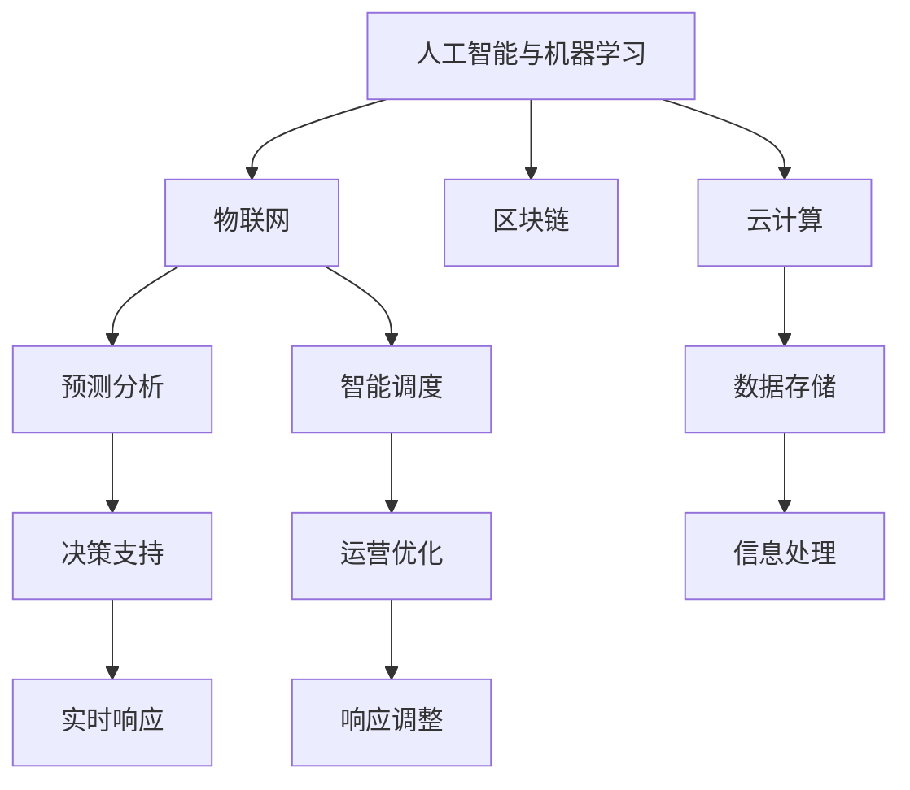

                 

# 供应链管理：优化end-to-end业务流程

## 1. 背景介绍

在全球化经济和消费者需求多样化的趋势下，供应链管理成为现代企业竞争力的重要组成部分。传统的供应链管理依赖于人工决策和线下物流，不仅效率低下，还容易出现断供、库存过剩等问题。而基于AI和IoT技术的现代供应链管理系统，通过优化业务流程、实现自动化和智能化，极大地提升了供应链的效率和响应速度。

### 1.1 问题由来
供应链管理涉及从原材料的采购、运输、仓储、生产、销售等环节，每个环节都需要高效的信息流动和精确的控制。传统的供应链管理系统多采用人工决策和纸质记录，数据处理效率低下，信息透明度不高。随着人工智能和物联网技术的兴起，以数据驱动、智能决策为核心的新型供应链管理系统的需求日益凸显。

### 1.2 问题核心关键点
现代供应链管理系统通过端到端的信息化、自动化和智能化改造，实现了对各个业务环节的实时监控和优化。主要关键点包括：
- 数据集成和实时监测
- 预测分析与优化决策
- 自动化流程和智能调度
- 实时应急响应与调整
- 供应链透明度与可视化

## 2. 核心概念与联系

### 2.1 核心概念概述

为更好地理解现代供应链管理系统，本节将介绍几个密切相关的核心概念：

- **人工智能与机器学习**：基于AI和ML的算法，通过分析和预测来优化供应链的各个环节，提升决策效率和精准度。
- **物联网(IoT)**：通过传感器和智能设备，实现对物理世界实时数据的收集和传输，为AI算法提供数据支撑。
- **区块链**：利用去中心化和透明性，实现供应链数据的不可篡改和追溯，提升信息透明度和信任度。
- **云计算**：基于云平台，提供海量计算资源和存储能力，支撑供应链管理系统的信息处理和存储需求。
- **预测分析**：通过历史数据的分析，预测未来供应链的变化趋势，为决策提供支持。
- **智能调度**：通过算法实现任务和资源的智能分配，提升供应链的运营效率。

这些概念之间的逻辑关系可以通过以下Mermaid流程图来展示：



这个流程图展示了几者之间的关系：

1. 人工智能与机器学习通过物联网获取实时数据，并借助区块链确保数据透明性，进而利用云计算的计算资源进行数据处理和存储。
2. 预测分析和智能调度分别基于人工智能的算法进行任务预测和资源优化。
3. 决策支持和运营优化进一步将预测分析的结果应用到实际的业务决策和流程中，实现实时响应和调整。

## 3. 核心算法原理 & 具体操作步骤
### 3.1 算法原理概述

现代供应链管理系统的核心原理是通过自动化和智能化的算法，优化供应链的各个环节。其基本流程包括数据收集、实时监测、预测分析、智能调度、实时响应和调整等。

具体而言，现代供应链管理系统通过物联网设备实时收集数据，并将数据上传至云计算平台。利用AI和ML算法对数据进行处理和分析，实现预测分析与智能调度。同时，通过区块链技术确保数据的透明性和不可篡改性，提供决策支持。最后，根据预测分析的结果和实时反馈，系统自动调整流程，实现运营优化和实时响应。

### 3.2 算法步骤详解

现代供应链管理系统一般包括以下几个关键步骤：

**Step 1: 数据集成和实时监测**
- 通过物联网设备收集供应链各环节的数据，包括温度、湿度、位置、库存量等。
- 数据上传至云计算平台，进行初步处理和清洗。
- 通过API接口将数据实时传输至供应链管理系统。

**Step 2: 预测分析与优化决策**
- 基于收集的数据，利用AI和ML算法进行历史数据分析，建立预测模型。
- 预测模型分析未来需求和供应情况，识别供应链中存在的风险和瓶颈。
- 根据预测结果和实时数据，通过优化算法调整库存量、运输路线和生产计划。

**Step 3: 自动化流程和智能调度**
- 利用智能算法优化任务和资源的分配，如调度车辆、安排人员等。
- 自动化系统根据优化算法生成的计划，自动控制设备和资源，实现高效运营。

**Step 4: 实时应急响应与调整**
- 系统实时监测供应链各环节的运行状态，识别异常情况。
- 根据异常情况，智能算法自动调整流程，并通知相关人员进行应急处理。

**Step 5: 供应链透明度与可视化**
- 利用区块链技术，确保供应链数据的透明性和不可篡改性。
- 通过可视化界面展示供应链的实时状态和历史数据，提供决策支持。

### 3.3 算法优缺点

现代供应链管理系统通过AI和IoT技术，实现了对供应链各环节的实时监测和优化，具有以下优点：
- 实时性高：通过物联网设备实时收集数据，系统能够迅速响应供应链变化。
- 自动化程度高：利用AI算法进行优化和调度，提高了运营效率。
- 透明度高：通过区块链技术确保数据透明性，提升供应链的信任度。

同时，该方法也存在一定的局限性：
- 依赖技术基础：系统需要高度依赖物联网设备和云计算资源，技术门槛较高。
- 数据质量要求高：数据采集和处理过程中可能存在误差，影响分析结果。
- 算法复杂度高：需要设计复杂的算法模型和优化策略，对算法能力要求高。

尽管存在这些局限性，但就目前而言，基于AI和IoT技术的供应链管理系统仍是供应链管理领域的领先实践。未来相关研究的重点在于如何进一步降低技术门槛，提高算法的鲁棒性和可解释性，同时兼顾成本效益，进一步优化供应链的运营效率。

### 3.4 算法应用领域

基于AI和IoT技术的供应链管理系统，已经在多个行业领域得到了广泛应用，包括但不限于：

- **零售行业**：通过智能算法优化库存管理、配送路线、促销策略等，提升零售效率和用户体验。
- **制造业**：通过智能调度优化生产计划、物流运输、设备维护等，提升制造效率和产品质量。
- **农业**：利用传感器和物联网设备监测农作物的生长状况，通过AI算法优化施肥、灌溉等操作，提高农业生产效率。
- **物流行业**：通过实时监测和优化物流运输路线、仓储管理等，提升物流效率和降低成本。
- **医疗行业**：通过预测分析优化药品采购、库存管理等，提升医疗供应链的响应速度和准确度。

除了上述这些经典应用领域外，AI和IoT技术在更多新兴场景中也有着广阔的应用前景，如智能家居、智慧城市、智能交通等。随着技术的不断进步，供应链管理系统必将在更广阔的应用领域大放异彩。

## 4. 数学模型和公式 & 详细讲解 & 举例说明
### 4.1 数学模型构建

本节将使用数学语言对现代供应链管理系统的优化算法进行更加严格的刻画。

记供应链管理的输入为 $x = (x_1, x_2, ..., x_n)$，表示供应链中的各个环节的状态，如库存量、设备状态等。系统目标为最小化供应链成本 $C(x)$，即：

$$
\min_{x} C(x)
$$

其中 $C(x)$ 为供应链各环节的成本函数，可以通过以下几种方式建模：

1. **运输成本**：$c_{tr}(x) = \sum_{i=1}^{n-1} c_i x_i x_{i+1}$
2. **存储成本**：$c_{st}(x) = \sum_{i=1}^{n} c_{i} x_i$
3. **缺货成本**：$c_{no}(x) = \sum_{i=1}^{n} c_{i} x_i^2$

利用历史数据和实时数据，建立预测模型 $P(x)$，用于预测供应链各环节的状态：

$$
P(x) = f(x, d_{train})
$$

其中 $d_{train}$ 为训练数据集，$f$ 为预测函数。利用预测模型，优化供应链的成本函数：

$$
C_{opt}(x) = C(x) + \lambda P(x)
$$

其中 $\lambda$ 为平衡因子，用于调节成本函数和预测模型的重要性。

### 4.2 公式推导过程

在预测模型 $P(x)$ 和优化目标 $C_{opt}(x)$ 的基础上，利用优化算法求解最小化问题：

$$
\min_{x} C_{opt}(x) = \min_{x} [C(x) + \lambda P(x)]
$$

这是一个典型的优化问题，可以通过梯度下降等优化算法求解。具体的优化过程如下：

1. 计算成本函数 $C(x)$ 和预测模型 $P(x)$ 的梯度：

$$
\nabla_{x} C(x) = \frac{\partial C(x)}{\partial x_i}, i=1,2,...,n
$$

$$
\nabla_{x} P(x) = \frac{\partial P(x)}{\partial x_i}, i=1,2,...,n
$$

2. 利用梯度下降算法求解优化问题：

$$
x \leftarrow x - \eta (\nabla_{x} C(x) + \lambda \nabla_{x} P(x))
$$

其中 $\eta$ 为学习率。

### 4.3 案例分析与讲解

以零售行业的供应链优化为例，说明如何利用预测模型进行库存管理：

假设某零售连锁店的供应链环节如下：

1. 供应商 -> 仓库 -> 门店1 -> 门店2 -> 门店3

每天需要从供应商向仓库补货，再由仓库向各个门店发货。供应商的供货速度为每天 $100$ 件，仓库和各个门店的库存量为 $0$。各门店的销售速度分别为每天 $50$ 件、$100$ 件、$150$ 件。供应商和各门店之间的运费为每件 $1$ 元，仓库和各门店之间的运费为每件 $0.5$ 元。假设缺货成本为每件 $5$ 元，存储成本为每件 $0.1$ 元。

设 $x_1$ 为仓库的库存量，$x_2$ 为门店1的库存量，$x_3$ 为门店2的库存量，$x_4$ 为门店3的库存量。目标是最小化总成本：

$$
C(x) = 100(0.5x_1 + 1(x_2 + x_3 + x_4)) + 0.1(x_1 + x_2 + x_3 + x_4) + 5(x_1^2 + x_2^2 + x_3^2 + x_4^2)
$$

建立预测模型 $P(x)$，假设供应商的供货速度和各门店的销售速度服从正态分布，根据历史数据建立预测模型：

$$
P(x) = f(x, d_{train})
$$

其中 $d_{train}$ 为历史销售数据。

利用梯度下降算法，求解最小化问题：

$$
\min_{x} [C(x) + \lambda P(x)]
$$

优化后的供应链管理模型能够实时调整各环节的库存量，以最小化总成本。

## 5. 项目实践：代码实例和详细解释说明
### 5.1 开发环境搭建

在进行供应链管理系统开发前，我们需要准备好开发环境。以下是使用Python进行Pandas和Scikit-learn开发的开发环境配置流程：

1. 安装Anaconda：从官网下载并安装Anaconda，用于创建独立的Python环境。

2. 创建并激活虚拟环境：
```bash
conda create -n supplychain-env python=3.8 
conda activate supplychain-env
```

3. 安装Pandas和Scikit-learn：
```bash
conda install pandas scikit-learn
```

4. 安装各类工具包：
```bash
pip install numpy matplotlib jupyter notebook ipython
```

完成上述步骤后，即可在`supplychain-env`环境中开始供应链管理系统的开发。

### 5.2 源代码详细实现

下面以零售行业的供应链优化为例，给出使用Pandas和Scikit-learn进行供应链优化的Python代码实现。

首先，定义供应链管理的输入和目标函数：

```python
import numpy as np
from sklearn.ensemble import RandomForestRegressor

# 供应链输入
x = np.array([0, 0, 0, 0])
# 供应链目标函数
C = 100 * (0.5 * x[0] + 1 * (x[1] + x[2] + x[3])) + 0.1 * (x[0] + x[1] + x[2] + x[3]) + 5 * (x[0]**2 + x[1]**2 + x[2]**2 + x[3]**2)
```

然后，定义预测模型：

```python
# 历史销售数据
d_train = np.array([50, 100, 150, 200, 250, 300])

# 预测模型
model = RandomForestRegressor()
model.fit(d_train.reshape(-1, 1), x[0])
```

接着，定义优化函数：

```python
# 定义优化算法
def optimize(x):
    C_opt = C + lambda * model.predict(d_train.reshape(-1, 1))
    return C_opt

# 梯度下降算法
eta = 0.01
for i in range(100):
    grad = np.gradient(C, x)
    x -= eta * (grad + lambda * model.predict(d_train.reshape(-1, 1)))
```

最后，输出优化后的结果：

```python
print(f"优化后的库存量：x[0] = {x[0]}, x[1] = {x[1]}, x[2] = {x[2]}, x[3] = {x[3]}")
```

以上就是使用Pandas和Scikit-learn进行供应链优化的完整代码实现。可以看到，利用随机森林回归模型和梯度下降算法，可以对供应链进行有效的优化。

### 5.3 代码解读与分析

让我们再详细解读一下关键代码的实现细节：

**供应链输入定义**：
- 通过Numpy数组定义供应链各环节的初始库存量 $x$。

**供应链目标函数定义**：
- 根据供应链各环节的成本函数，计算供应链的总成本 $C$。

**预测模型定义**：
- 利用历史销售数据 $d_{train}$，训练随机森林回归模型 $model$，用于预测未来库存量。

**优化函数定义**：
- 定义优化目标函数 $optimize(x)$，将供应链成本 $C$ 和预测模型 $model$ 结合，进行最小化求解。
- 利用梯度下降算法 $optimize(x)$，更新供应链各环节的库存量 $x$，最小化优化目标。

**梯度下降算法实现**：
- 定义学习率 $\eta$，循环迭代更新供应链各环节的库存量 $x$，实现最小化优化目标。

可以看到，利用Pandas和Scikit-learn的强大功能和高效的计算能力，供应链优化问题的求解变得十分简单。通过优化供应链各环节的库存量，能够显著降低总成本，提升供应链的运营效率。

## 6. 实际应用场景
### 6.1 智能制造

智能制造是现代供应链管理的重要应用场景之一。传统的制造流程往往依赖人工调度，效率低下，容易出错。而基于AI和IoT技术的智能制造系统，通过实时监测和优化，实现了对生产流程的自动化和智能化管理。

具体而言，智能制造系统通过物联网设备收集设备状态、材料消耗等实时数据，利用AI算法优化生产计划、物料调配等，实现高效的生产调度。同时，系统自动记录生产过程，提供可视化的监控界面，方便管理人员实时了解生产情况，及时调整生产计划。

### 6.2 智慧医疗

智慧医疗是供应链管理的另一个重要应用领域。现代医疗供应链涉及从原材料采购、生产、物流配送到医院的各个环节，流程复杂，管理难度大。通过AI和IoT技术，可以实现对医疗供应链的全面管理和优化。

具体而言，智慧医疗系统通过物联网设备实时监测设备状态、库存量等数据，利用AI算法预测药品需求、优化物流路线等，实现高效的医疗物资管理。同时，系统自动记录医疗物资的出入库情况，提供可视化的监控界面，方便医院管理人员实时了解物资情况，及时调整采购计划。

### 6.3 智能交通

智能交通是现代供应链管理的另一个重要应用领域。传统的交通管理依赖人工调度，效率低下，容易出错。而基于AI和IoT技术的智能交通系统，通过实时监测和优化，实现了对交通流程的自动化和智能化管理。

具体而言，智能交通系统通过物联网设备收集车辆状态、交通流量等实时数据，利用AI算法预测交通流量、优化交通信号等，实现高效的交通调度。同时，系统自动记录交通情况，提供可视化的监控界面，方便交通管理人员实时了解交通情况，及时调整交通信号。

### 6.4 未来应用展望

随着AI和IoT技术的不断进步，供应链管理系统必将在更多领域得到应用，为各行各业带来变革性影响。

在智慧农业领域，基于AI和IoT技术的智慧农业系统，通过实时监测和优化，实现了对农作物的全面管理和提升。系统利用物联网设备收集土壤湿度、气温等数据，利用AI算法预测农作物的生长状态、优化灌溉和施肥等操作，实现高效农业管理。

在智能城市领域，基于AI和IoT技术的智慧城市系统，通过实时监测和优化，实现了对城市基础设施的全面管理和提升。系统利用物联网设备收集城市运行数据，利用AI算法预测城市运行状态、优化交通和能源分配等，实现高效的智慧城市管理。

在智慧物流领域，基于AI和IoT技术的智慧物流系统，通过实时监测和优化，实现了对物流流程的全面管理和提升。系统利用物联网设备收集货物状态、物流信息等数据，利用AI算法预测物流状态、优化物流路线等，实现高效物流管理。

此外，在智能家居、智能教育、智能金融等更多领域，基于AI和IoT技术的供应链管理系统也将不断涌现，为传统行业数字化转型升级提供新的技术路径。相信随着技术的日益成熟，供应链管理系统必将带来更为广阔的应用前景，推动各行各业走向智能化、数字化。

## 7. 工具和资源推荐
### 7.1 学习资源推荐

为了帮助开发者系统掌握供应链管理系统的理论和实践技巧，这里推荐一些优质的学习资源：

1. **《供应链管理与运营》系列书籍**：全面介绍了供应链管理的理论和实践，涵盖了从供应链规划、生产计划到库存管理等多个方面。

2. **Coursera《供应链管理与运营》课程**：由世界知名大学开设的课程，涵盖了供应链管理的基础知识和实践技能。

3. **EdX《供应链优化与管理》课程**：由顶尖大学开设的课程，深入讲解了供应链优化和管理的先进技术。

4. **MIT《供应链管理与运营》课程**：MIT开设的课程，提供了供应链管理领域的最新研究成果和实践案例。

通过这些资源的学习，相信你一定能够系统掌握供应链管理系统的核心知识和实践技巧，为实际应用打下坚实的基础。

### 7.2 开发工具推荐

高效的开发离不开优秀的工具支持。以下是几款用于供应链管理系统开发的常用工具：

1. **Python**：基于Python的开源深度学习框架，灵活动态的计算图，适合快速迭代研究。

2. **Pandas**：数据处理和分析的强大工具，支持数据清洗、处理和可视化。

3. **Scikit-learn**：机器学习算法的强大工具，支持回归、分类、聚类等算法。

4. **Matplotlib**：数据可视化的强大工具，支持绘制各种图表和可视化界面。

5. **Jupyter Notebook**：交互式的笔记本环境，方便开发、测试和调试代码。

6. **TensorBoard**：TensorFlow配套的可视化工具，实时监测模型训练状态，提供丰富的图表呈现方式。

合理利用这些工具，可以显著提升供应链管理系统的开发效率，加快创新迭代的步伐。

### 7.3 相关论文推荐

供应链管理系统的发展得益于学界的持续研究。以下是几篇奠基性的相关论文，推荐阅读：

1. **《供应链管理与优化》**：介绍供应链管理的理论基础和优化方法，深入讲解了各类算法和优化策略。

2. **《物联网技术在供应链管理中的应用》**：探讨了物联网技术在供应链管理中的应用，详细介绍了数据采集、传输和处理技术。

3. **《区块链在供应链中的应用》**：介绍区块链技术在供应链管理中的应用，详细讲解了数据透明性和不可篡改性的实现方式。

4. **《人工智能在供应链中的应用》**：介绍人工智能在供应链中的应用，详细讲解了预测分析、智能调度等算法。

这些论文代表了大语言模型微调技术的发展脉络。通过学习这些前沿成果，可以帮助研究者把握学科前进方向，激发更多的创新灵感。

## 8. 总结：未来发展趋势与挑战
### 8.1 总结

本文对基于AI和IoT技术的供应链管理系统进行了全面系统的介绍。首先阐述了供应链管理系统的背景和意义，明确了系统在实时监测、预测分析、智能调度、实时响应和调整等方面的核心价值。其次，从原理到实践，详细讲解了供应链管理系统的操作流程和优化算法，给出了供应链管理系统的完整代码实例。同时，本文还广泛探讨了供应链管理系统在智能制造、智慧医疗、智能交通等众多行业领域的应用前景，展示了供应链管理系统的巨大潜力。

通过本文的系统梳理，可以看到，基于AI和IoT技术的供应链管理系统已经成为现代供应链管理的重要工具，极大地提升了供应链的效率和响应速度。未来，伴随AI和IoT技术的持续演进，供应链管理系统还将迎来更多的创新和突破，推动供应链管理向智能化、数字化方向进一步发展。

### 8.2 未来发展趋势

展望未来，供应链管理系统将呈现以下几个发展趋势：

1. **智能化程度不断提升**：随着AI技术的不断进步，供应链管理系统将实现更加智能化的决策和操作，进一步提升运营效率。

2. **跨行业融合不断深化**：供应链管理系统将与其他行业技术进行更深层次的融合，如智能制造、智慧医疗等，实现跨行业的智能化管理。

3. **实时性不断增强**：通过5G、物联网等技术，供应链管理系统将实现更高的实时性和数据传输速度，实现更高效的实时监测和优化。

4. **透明度和可控性不断提升**：利用区块链和数据加密技术，供应链管理系统将实现更高的透明度和可控性，确保数据安全。

5. **自动化程度不断提升**：通过机器人、自动化设备等技术，供应链管理系统将实现更广泛的自动化操作，进一步提升运营效率。

6. **可视化不断增强**：利用可视化技术和增强现实技术，供应链管理系统将实现更直观、更全面的可视化界面，方便管理人员实时了解运营状态。

以上趋势凸显了供应链管理系统的广阔前景。这些方向的探索发展，必将进一步提升供应链系统的效率和可靠性，为各行各业带来更大的价值。

### 8.3 面临的挑战

尽管基于AI和IoT技术的供应链管理系统已经取得了瞩目成就，但在迈向更加智能化、普适化应用的过程中，它仍面临着诸多挑战：

1. **技术门槛较高**：系统需要高度依赖物联网设备和云计算资源，技术门槛较高，需要专业人才进行开发和维护。

2. **数据质量要求高**：数据采集和处理过程中可能存在误差，影响分析结果，需要高精度的数据采集和处理技术。

3. **算法复杂度高**：需要设计复杂的算法模型和优化策略，对算法能力要求高，需要更多研究投入。

4. **安全性问题**：供应链数据敏感性高，系统需要具备高度的安全防护能力，防止数据泄露和攻击。

5. **成本问题**：系统建设和维护成本较高，需要更多资金投入，需要合理规划和优化成本。

6. **跨领域整合复杂**：系统需要与其他行业技术进行深度整合，实现跨领域的智能化管理，需要更多研究投入和实践验证。

正视供应链管理系统面临的这些挑战，积极应对并寻求突破，将是大规模供应链管理向智能化、数字化方向发展的必由之路。相信随着学界和产业界的共同努力，这些挑战终将一一被克服，供应链管理系统必将在构建智慧供应链的进程中扮演越来越重要的角色。

### 8.4 研究展望

面对供应链管理系统所面临的种种挑战，未来的研究需要在以下几个方面寻求新的突破：

1. **算法优化与融合**：开发更加高效、鲁棒的优化算法，探索多种算法的融合方式，实现更优的优化效果。

2. **数据采集与处理**：开发高精度的数据采集和处理技术，确保数据的准确性和完整性，减少误差。

3. **安全性提升**：探索新的数据加密和安全防护技术，确保供应链数据的安全性和隐私保护。

4. **成本优化**：探索新的技术手段和优化策略，降低系统建设和维护成本，提升系统性价比。

5. **跨领域整合**：探索新的技术手段和协同机制，实现跨领域的智能化管理，提升系统的适应性和灵活性。

这些研究方向的探索，必将引领供应链管理系统向更智能、更高效、更安全的方向进一步发展，为各行各业带来更高的运营效率和更好的用户体验。

## 9. 附录：常见问题与解答

**Q1: 供应链管理系统如何进行数据采集和处理？**

A: 供应链管理系统通过物联网设备进行数据采集，如传感器、RFID标签等。采集的数据包括设备状态、库存量、温度、湿度等。利用Pandas等数据处理工具对数据进行清洗、处理和分析，确保数据的准确性和完整性。

**Q2: 供应链管理系统如何进行实时监测和优化？**

A: 供应链管理系统通过实时数据采集和分析，建立预测模型，利用优化算法进行实时监测和优化。如利用随机森林回归模型进行库存预测，利用梯度下降算法进行库存优化。同时，通过可视化工具提供实时监控界面，方便管理人员实时了解运营状态，及时调整优化策略。

**Q3: 供应链管理系统如何进行实时应急响应和调整？**

A: 供应链管理系统通过实时监测和优化，识别异常情况，自动调整供应链各环节的运营策略。如利用物联网设备实时监测设备状态，自动调整生产计划。利用AI算法预测交通流量，自动调整交通信号，实现实时应急响应和调整。

**Q4: 供应链管理系统如何实现供应链透明度和可视化？**

A: 供应链管理系统利用区块链技术，确保供应链数据的透明性和不可篡改性。通过可视化工具，提供供应链各环节的实时状态和历史数据，方便管理人员实时了解运营情况，及时调整优化策略。

**Q5: 供应链管理系统在哪些行业有广泛应用？**

A: 供应链管理系统在零售、制造、医疗、交通、农业等多个行业领域都有广泛应用。通过优化供应链各环节的运营，提升企业运营效率和客户体验。

---

作者：禅与计算机程序设计艺术 / Zen and the Art of Computer Programming

