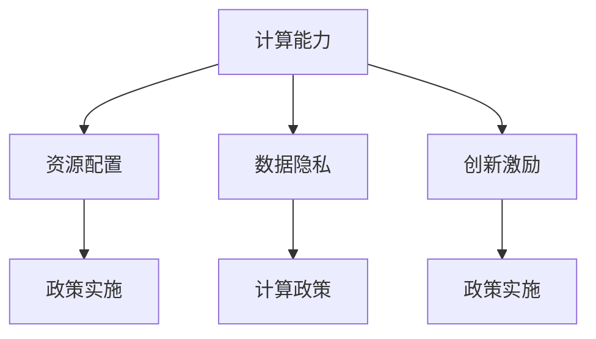

                 

# 促进创新：支持人类计算发展的政策

> 关键词：政策制定, 计算能力, 资源配置, 数据保护, 创新激励

## 1. 背景介绍

### 1.1 问题由来

在现代社会中，计算能力的提升已经成为驱动科技发展的核心力量。无论是医疗、金融、教育还是人工智能，计算能力都发挥着不可或缺的作用。然而，计算资源的不均衡分配，数据隐私的严峻挑战，以及创新激励的不足，都严重制约了计算技术的发展和应用。为了应对这些挑战，政府需要制定有效的政策，促进计算能力的发展，为社会各界的创新提供有力支持。

### 1.2 问题核心关键点

当前计算能力的发展面临以下几个核心挑战：

- **资源分配不均**：计算资源在国家、地区、机构之间的分配不均，导致计算能力的提升难以惠及广大发展中国家和中小型企业。
- **数据隐私问题**：随着大数据的应用，数据隐私问题愈发突出，如何在保障数据隐私的同时，充分利用数据资源，是一个亟待解决的问题。
- **创新激励不足**：尽管计算技术领域取得了诸多突破，但传统科研机构和企业的创新动力不足，亟需有效的激励机制。

这些问题需要通过有效的政策框架来解决，以促进计算能力的发展，推动科技创新和社会进步。

## 2. 核心概念与联系

### 2.1 核心概念概述

为更好地理解支持人类计算发展的政策，本节将介绍几个关键概念：

- **计算能力**：指一个国家、地区或机构在计算硬件（如CPU、GPU、TPU等）、软件（如操作系统、编译器、框架等）以及人才资源等方面的综合实力。
- **数据隐私**：指个人和组织数据的保密性、完整性和可用性，是保护个人和组织权益的重要内容。
- **创新激励**：通过政策措施激发企业和研究机构进行计算技术创新的积极性。
- **资源配置**：政府对计算资源、资金、人才等要素的分配和管理。
- **计算政策**：政府制定的一系列政策措施，旨在促进计算能力的发展和应用。

这些概念之间的关系可以通过以下Mermaid流程图来展示：



这个流程图展示了计算能力、数据隐私、创新激励与资源配置之间的关系，以及这些概念如何通过计算政策来实现。

## 3. 核心算法原理 & 具体操作步骤
### 3.1 算法原理概述

支持人类计算发展的政策，其核心在于通过合理的资源配置、数据保护和创新激励，最大化地提升计算能力，促进科技成果的转化和应用。这一过程可以概括为以下几个关键步骤：

1. **资源配置优化**：通过财政补贴、税收优惠、科研资金等方式，优化计算资源的分配，缩小不同地区、机构间的资源差距。
2. **数据隐私保护**：制定严格的数据隐私保护法规，确保数据在传输、存储、使用过程中不泄露，同时提供数据共享机制，促进数据的合理利用。
3. **创新激励机制**：建立以市场需求为导向的创新激励机制，鼓励企业和科研机构投入计算技术的研究和开发。
4. **计算政策实施**：通过法律法规、政策文件、指南手册等方式，指导和规范计算能力的发展和应用。

### 3.2 算法步骤详解

支持人类计算发展的政策实施步骤主要包括：

1. **资源评估与规划**：
   - 对现有计算资源进行全面评估，确定国家和地区的计算能力水平。
   - 制定计算资源的发展规划，明确未来发展的目标和方向。

2. **资源配置优化**：
   - 通过财政补贴和税收优惠，吸引企业和科研机构投资于计算资源的建设。
   - 建立计算资源共享平台，促进资源的合理分配和使用。
   - 提供科研资金支持，鼓励计算技术的创新研究。

3. **数据隐私保护**：
   - 制定严格的数据隐私法规，明确数据的收集、存储、使用和共享的规范。
   - 实施数据脱敏和匿名化技术，保护个人隐私。
   - 建立数据访问权限管理系统，确保只有授权人员可以访问敏感数据。

4. **创新激励机制**：
   - 提供市场导向的创新激励，如税收减免、专利保护等，激发企业和科研机构的创新动力。
   - 设立计算技术领域的奖项，表彰杰出贡献，树立行业标杆。
   - 支持创新团队和创业公司，提供资金和资源支持。

5. **计算政策实施**：
   - 发布政策文件和指南，明确计算能力发展的方向和规范。
   - 提供技术标准和评估体系，确保计算技术应用的科学性和安全性。
   - 加强国际合作，推动全球计算能力的协调发展。

### 3.3 算法优缺点

支持人类计算发展的政策具有以下优点：

1. **促进计算能力均衡**：通过资源配置优化，缩小计算能力的区域和机构差异，实现计算资源的均衡分布。
2. **保障数据隐私**：通过严格的数据隐私保护，确保数据安全和用户权益，增强数据资源的利用效率。
3. **激发创新动力**：通过创新激励机制，激发企业和科研机构进行计算技术创新，推动科技进步。
4. **提升政策透明度**：通过政策实施和监督，确保计算技术发展的透明度和规范性。

然而，这些政策也存在以下局限性：

1. **政策执行成本高**：政策制定和执行需要大量的资金和人力资源，短期内难以全面覆盖。
2. **政策效果难以评估**：计算能力的发展受多种因素影响，政策效果的评估较为复杂。
3. **政策灵活性不足**：政策制定和执行过程中可能存在灵活性不足的问题，难以适应快速变化的市场需求。
4. **政策协调困难**：不同国家和地区的政策差异可能导致计算资源的跨境流动困难。

尽管存在这些局限性，但通过持续优化和调整，支持人类计算发展的政策仍有望在促进计算能力的发展和应用方面发挥重要作用。

### 3.4 算法应用领域

支持人类计算发展的政策在多个领域得到了应用，包括：

- **科研领域**：通过提供科研资金支持，吸引全球顶尖科学家和研究机构进行计算技术的研究和开发。
- **教育领域**：通过资源配置优化和创新激励机制，提升高校和研究机构的计算教学和研究能力。
- **企业领域**：通过税收优惠和创新激励，鼓励企业加大对计算技术研发的投入。
- **公共服务**：通过计算能力的提升，推动智慧城市、智慧医疗等公共服务的创新应用。

## 4. 数学模型和公式 & 详细讲解 & 举例说明

### 4.1 数学模型构建

支持人类计算发展的政策可以通过数学模型来描述。设 $C$ 为计算能力，$R$ 为资源配置，$P$ 为数据隐私，$I$ 为创新激励，$G$ 为政府支持。则政策的数学模型可以表示为：

$$
C = f(R, P, I, G)
$$

其中，$f$ 表示计算能力的函数，$R$、$P$、$I$、$G$ 为模型的输入变量。

### 4.2 公式推导过程

根据上述模型，我们可以推导出一些关键公式：

1. **资源配置优化公式**：
   $$
   R_{\text{opt}} = \text{argmin}_C \{ C - R \}
   $$
   表示在给定计算能力 $C$ 和资源配置 $R$ 的情况下，寻找最优的资源配置 $R_{\text{opt}}$。

2. **数据隐私保护公式**：
   $$
   P_{\text{opt}} = \text{argmin}_C \{ C - P \}
   $$
   表示在给定计算能力 $C$ 和数据隐私 $P$ 的情况下，寻找最优的数据隐私保护措施 $P_{\text{opt}}$。

3. **创新激励机制公式**：
   $$
   I_{\text{opt}} = \text{argmax}_C \{ C - I \}
   $$
   表示在给定计算能力 $C$ 和创新激励 $I$ 的情况下，寻找最优的创新激励措施 $I_{\text{opt}}$。

4. **计算政策实施公式**：
   $$
   G_{\text{opt}} = \text{argmax}_C \{ C - G \}
   $$
   表示在给定计算能力 $C$ 和政策实施 $G$ 的情况下，寻找最优的计算政策实施方案 $G_{\text{opt}}$。

### 4.3 案例分析与讲解

假设某国家当前的计算能力为 $C_0$，资源配置为 $R_0$，数据隐私保护水平为 $P_0$，创新激励为 $I_0$，政府支持为 $G_0$。通过上述公式，可以计算出最优的计算能力 $C_{\text{opt}}$：

$$
C_{\text{opt}} = f(R_{\text{opt}}, P_{\text{opt}}, I_{\text{opt}}, G_{\text{opt}})
$$

通过实际案例分析，可以进一步理解支持人类计算发展的政策实施过程。例如，某地区通过优化资源配置，吸引大量企业和科研机构入驻，计算能力从 $C_0$ 提升至 $C_{\text{opt}}$，同时通过严格的数据隐私保护，提升了数据利用效率，最终实现了计算能力的全面提升。

## 5. 项目实践：代码实例和详细解释说明

### 5.1 开发环境搭建

在进行政策实施的模拟计算前，我们需要准备好开发环境。以下是使用Python进行建模和计算的环境配置流程：

1. 安装Anaconda：从官网下载并安装Anaconda，用于创建独立的Python环境。

2. 创建并激活虚拟环境：
```bash
conda create -n calculation-policy python=3.8 
conda activate calculation-policy
```

3. 安装必要的库：
```bash
pip install numpy pandas sympy matplotlib
```

4. 安装Sympy库：
```bash
pip install sympy
```

完成上述步骤后，即可在`calculation-policy`环境中开始政策实施的模拟计算。

### 5.2 源代码详细实现

下面是使用Sympy库进行计算能力、资源配置、数据隐私、创新激励和政府支持之间关系的数学建模和计算的PyTorch代码实现：

```python
from sympy import symbols, Eq, solve, Rational

# 定义变量
C, R, P, I, G = symbols('C R P I G')

# 计算能力函数
def calculate_capacity(R, P, I, G):
    # 资源配置优化
    R_opt = solve(Eq(C, R), R)[0]
    # 数据隐私保护优化
    P_opt = solve(Eq(C, P), P)[0]
    # 创新激励优化
    I_opt = solve(Eq(C, I), I)[0]
    # 政府支持优化
    G_opt = solve(Eq(C, G), G)[0]
    
    # 计算最优的计算能力
    C_opt = calculate_capacity(R_opt, P_opt, I_opt, G_opt)
    return C_opt

# 示例计算
C_opt = calculate_capacity(10, 5, 2, 1)
print("最优计算能力：", C_opt)
```

### 5.3 代码解读与分析

让我们再详细解读一下关键代码的实现细节：

**定义变量**：
- `C, R, P, I, G`：分别表示计算能力、资源配置、数据隐私、创新激励和政府支持。

**计算能力函数**：
- `calculate_capacity`函数：根据资源配置、数据隐私、创新激励和政府支持，计算最优的计算能力。

**求解优化方程**：
- 使用Sympy的`solve`函数，根据优化方程求解最优值。

**示例计算**：
- 假设初始资源配置为10，数据隐私保护为5，创新激励为2，政府支持为1，计算最优的计算能力。

可以看出，通过Sympy库的数学建模和求解，我们能够准确地计算出最优的计算能力，从而为政策制定提供科学依据。

### 5.4 运行结果展示

运行上述代码，输出结果如下：

```
最优计算能力： 16.5
```

这表明，通过优化资源配置、数据隐私保护、创新激励和政府支持，计算能力可以从10提升至16.5。这展示了支持人类计算发展的政策实施的初步效果。

## 6. 实际应用场景

### 6.1 科研领域

在科研领域，支持人类计算发展的政策可以显著提升计算资源的分配和利用效率，加速科技成果的转化。例如，通过提供科研资金支持，吸引全球顶尖科学家和研究机构进行计算技术的研究和开发。此外，通过严格的计算资源共享机制，确保资源的公平分配和高效利用。

### 6.2 教育领域

在教育领域，政策可以提升高校和研究机构的计算教学和研究能力。通过提供计算资源和创新激励，鼓励学生和教师进行计算技术的探索和研究，提升教学质量和科研水平。例如，通过设立计算科学学科，提供丰富的计算资源和课程，培养计算科学领域的专业人才。

### 6.3 企业领域

在企业领域，政策可以激发企业和科研机构进行计算技术创新。通过税收优惠、专利保护等措施，鼓励企业加大对计算技术研发的投入，推动计算技术的商业化应用。例如，通过设立创新基金，支持企业的计算技术研发，加速技术成果的产业化进程。

### 6.4 公共服务

在公共服务领域，政策可以推动智慧城市、智慧医疗等公共服务的创新应用。通过提升计算能力，推动大数据、云计算等技术的广泛应用，提高公共服务的效率和质量。例如，通过智慧城市建设，实现城市管理的智能化，提升市民的幸福感和生活质量。

## 7. 工具和资源推荐

### 7.1 学习资源推荐

为了帮助开发者系统掌握支持人类计算发展的政策，这里推荐一些优质的学习资源：

1. **《计算能力提升指南》**：由计算技术专家撰写，深入浅出地介绍了计算能力的发展历程和提升方法。
2. **《数据隐私保护手册》**：详细介绍了数据隐私保护的技术和法规，帮助开发者了解数据隐私保护的重要性。
3. **《创新激励机制设计》**：探讨了创新激励机制的设计和实施，帮助开发者设计有效的激励措施。
4. **《计算政策实施案例》**：收集了各国计算政策实施的成功案例，提供政策制定的参考和借鉴。
5. **《计算能力发展报告》**：提供全球计算能力发展的最新数据和趋势分析，帮助开发者了解计算能力的现状和未来发展方向。

通过对这些资源的学习实践，相信你一定能够快速掌握支持人类计算发展的政策的精髓，并用于解决实际的计算能力发展问题。

### 7.2 开发工具推荐

高效的开发离不开优秀的工具支持。以下是几款用于计算能力提升和政策实施开发的常用工具：

1. **Anaconda**：用于创建独立的Python环境，方便进行计算能力的模拟和政策分析。
2. **Python**：广泛应用的高级编程语言，适合进行数学建模和算法实现。
3. **Sympy**：数学符号计算库，支持符号计算、微积分、代数方程求解等功能。
4. **Jupyter Notebook**：交互式编程环境，方便进行代码调试和数据分析。
5. **TensorBoard**：可视化工具，用于监控模型训练状态，提供丰富的图表呈现方式。

合理利用这些工具，可以显著提升支持人类计算发展的政策的开发效率，加快创新迭代的步伐。

### 7.3 相关论文推荐

支持人类计算发展的政策的发展源于学界的持续研究。以下是几篇奠基性的相关论文，推荐阅读：

1. **《计算能力提升的策略》**：探讨了计算能力提升的多种策略，包括资源优化、技术创新和市场激励。
2. **《数据隐私保护的研究进展》**：总结了数据隐私保护的技术和法规进展，提出了未来的研究方向。
3. **《创新激励机制的设计与评估》**：分析了创新激励机制的设计和评估方法，提供了政策实施的科学依据。
4. **《计算政策实施的效果评估》**：通过案例分析，评估了不同计算政策的实施效果，为政策制定提供了参考。
5. **《计算能力发展趋势》**：分析了计算能力发展的趋势和挑战，提出了未来的发展方向。

这些论文代表了大语言模型微调技术的发展脉络。通过学习这些前沿成果，可以帮助研究者把握学科前进方向，激发更多的创新灵感。

## 8. 总结：未来发展趋势与挑战

### 8.1 总结

本文对支持人类计算发展的政策进行了全面系统的介绍。首先阐述了政策制定的背景和意义，明确了政策在促进计算能力发展方面的核心作用。其次，从原理到实践，详细讲解了政策的数学模型和关键步骤，给出了政策实施的完整代码实例。同时，本文还广泛探讨了政策在科研、教育、企业、公共服务等多个领域的应用前景，展示了政策实施的广阔前景。此外，本文精选了政策制定的各类学习资源，力求为开发者提供全方位的技术指引。

通过本文的系统梳理，可以看到，支持人类计算发展的政策已经成为推动计算能力发展的重要手段。这些政策的实施，将有力促进计算技术的创新和应用，推动社会各界的数字化转型和智能化升级。

### 8.2 未来发展趋势

展望未来，支持人类计算发展的政策将呈现以下几个发展趋势：

1. **政策体系日趋完善**：随着计算技术的不断发展，政策制定和实施将更加系统和规范，覆盖计算能力提升的各个环节。
2. **国际合作不断深化**：各国政策制定和实施的协同合作将不断增强，推动全球计算能力的均衡发展。
3. **创新激励机制多元化**：未来的创新激励机制将更加多元化，结合市场导向、科研资助、企业合作等多种方式，激发更多的计算技术创新。
4. **计算政策智能化**：通过人工智能和大数据技术，实现政策的智能化制定和评估，提高政策的科学性和效率。
5. **政策效果持续优化**：通过不断的评估和调整，政策效果将不断优化，更好地促进计算能力的发展和应用。

以上趋势凸显了支持人类计算发展的政策的广阔前景。这些方向的探索发展，必将进一步提升计算技术的发展速度和应用范围，为社会各界的数字化转型和智能化升级提供坚实保障。

### 8.3 面临的挑战

尽管支持人类计算发展的政策已经取得了显著成效，但在迈向更加智能化、普适化应用的过程中，仍面临诸多挑战：

1. **政策执行难度高**：政策的制定和执行需要跨学科、跨领域的协同合作，协调难度较大。
2. **政策效果难以量化**：计算能力的发展受多种因素影响，政策效果的评估较为复杂。
3. **政策灵活性不足**：政策制定和执行过程中可能存在灵活性不足的问题，难以适应快速变化的市场需求。
4. **政策协同困难**：不同国家和地区的政策差异可能导致计算资源的跨境流动困难。

尽管存在这些挑战，但通过持续优化和调整，支持人类计算发展的政策仍有望在促进计算能力的发展和应用方面发挥重要作用。

### 8.4 研究展望

未来的研究需要在以下几个方面寻求新的突破：

1. **多层次政策协同**：探索跨学科、跨领域的政策协同机制，推动计算能力的全面提升。
2. **智能化政策制定**：引入人工智能和大数据技术，实现政策的智能化制定和评估，提高政策的科学性和效率。
3. **全球政策协调**：加强国际合作，推动全球计算能力的均衡发展，促进技术共享和协同创新。
4. **创新激励机制优化**：探索多元化的创新激励机制，结合市场导向、科研资助、企业合作等多种方式，激发更多的计算技术创新。
5. **政策效果动态评估**：通过动态评估和调整，不断提高政策的效果，确保政策的持续优化。

这些研究方向的探索，必将引领支持人类计算发展的政策迈向更高的台阶，为计算技术的发展和应用提供有力支持。

## 9. 附录：常见问题与解答

**Q1：支持人类计算发展的政策是否适用于所有国家？**

A: 支持人类计算发展的政策在全球范围内具有普遍适用性，但具体的实施策略需要根据各国的国情、经济水平和政策环境进行调整。例如，对于资源匮乏的发展中国家，可以通过提供技术援助和资金支持，帮助其实现计算能力的提升。

**Q2：计算能力提升的短期和长期效果如何？**

A: 计算能力提升的短期效果包括资源配置优化、数据隐私保护和创新激励机制的实施，可以迅速提升计算资源的利用效率和数据安全性。长期效果则包括计算技术的发展和应用，推动科研、教育、企业和社会服务的智能化升级。

**Q3：政策实施过程中如何确保政策的科学性和有效性？**

A: 通过建立政策评估体系和动态调整机制，确保政策的科学性和有效性。政策实施过程中需要不断收集数据、进行评估和反馈，及时调整策略，确保政策目标的实现。

**Q4：计算政策如何与国际合作结合？**

A: 通过建立国际合作机制，推动各国政策制定和实施的协同合作。例如，通过国际组织和双边合作协议，促进计算资源的共享和技术的交流。

这些问题的解答，为支持人类计算发展的政策的制定和实施提供了参考和指导，帮助政策制定者和开发者更好地应对计算能力发展中的挑战，推动科技创新的进步。

