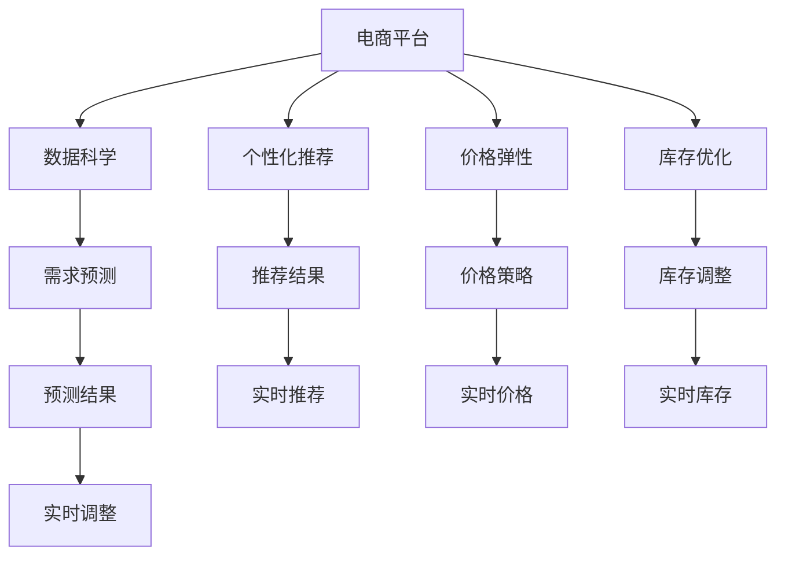

                 

# 促销活动：吸引消费者购买，提升电商平台供给能力

## 1. 背景介绍

### 1.1 问题由来
随着电商平台的兴起，如何在激烈的竞争中吸引消费者购买，提升平台的供给能力，成为了各大电商平台亟需解决的问题。传统促销手段如折扣、赠品等虽然有效，但成本高、管理复杂，且无法精准定位目标消费者。近年来，基于数据科学的促销策略，如个性化推荐、价格弹性和库存优化等方法逐渐成为电商促销的新范式，展现出强大的生命力。

### 1.2 问题核心关键点
核心在于如何通过数据挖掘和大数据分析，构建精准的促销策略，实现消费者购买行为的预测和优化，同时提升平台的库存管理效率。这需要借助机器学习算法，对消费者行为数据进行建模，实时动态地调整促销策略，以满足消费者的个性化需求，并有效管理库存。

### 1.3 问题研究意义
研究电商平台促销活动，对于提升电商平台的用户粘性、提高销售转化率、优化库存管理具有重要意义。通过优化促销策略，可以降低运营成本，提升用户体验，加速商品周转，增强电商平台的竞争力。

## 2. 核心概念与联系

### 2.1 核心概念概述

为更好地理解基于数据科学的电商平台促销策略，本节将介绍几个密切相关的核心概念：

- 电商平台(E-commerce Platform)：以互联网为平台，通过网络交易完成商品交易的商业模式。
- 数据科学(Data Science)：利用数据挖掘、机器学习等技术，从海量数据中提取有价值的信息和知识。
- 个性化推荐(Personalized Recommendation)：通过分析消费者行为数据，为每位消费者推荐其可能感兴趣的商品或服务。
- 价格弹性(Price Elasticity)：描述消费者需求量对价格变化的敏感程度。
- 库存优化(Inventory Optimization)：通过动态调整库存水平，平衡需求和供给，降低缺货和积压的风险。
- 需求预测(Demand Forecasting)：利用历史销售数据、市场趋势等因素，预测未来需求量。
- 机器学习(Machine Learning)：使用算法构建模型，通过数据训练和验证，预测和优化电商促销策略。

这些核心概念之间的逻辑关系可以通过以下Mermaid流程图来展示：



这个流程图展示了电商平台促销策略的主要组成部分：

1. 电商平台收集消费者行为数据。
2. 数据科学对消费者数据进行分析，构建个性化推荐和价格弹性的模型。
3. 库存优化策略通过动态调整库存水平，平衡供需。
4. 需求预测模型对未来需求进行预测，指导库存和促销策略的调整。
5. 机器学习模型通过训练和验证，优化电商促销策略。
6. 实时数据驱动的推荐和价格调整，精准定位消费者需求。

这些概念共同构成了电商平台促销活动的核心框架，使其能够精准地吸引消费者购买，并有效管理库存。

## 3. 核心算法原理 & 具体操作步骤
### 3.1 算法原理概述

基于数据科学的电商平台促销策略，本质上是一个多目标优化问题。其核心思想是：利用机器学习算法，对消费者行为数据进行建模，预测未来需求和价格弹性，构建个性化的推荐和价格策略，以最大化销售收入、降低成本、提升用户体验。

形式化地，假设电商平台有N个商品，消费者有M个，商品价格为p_i，消费者需求量为q_j，优化目标为最大化总销售收入R和最小化库存成本C，则优化问题为：

$$
\begin{aligned}
& \max_{p_i, q_j} R(p_i, q_j) = \sum_{i=1}^{N} \sum_{j=1}^{M} p_i q_j \\
& \min_{p_i, q_j} C(p_i, q_j) = \sum_{i=1}^{N} \sum_{j=1}^{M} \text{cost}(p_i, q_j) \\
\end{aligned}
$$

其中，R(p_i, q_j)表示销售收入，C(p_i, q_j)表示库存成本，cost(p_i, q_j)为价格和需求的成本函数。

### 3.2 算法步骤详解

基于数据科学的电商平台促销策略一般包括以下几个关键步骤：

**Step 1: 数据准备与预处理**
- 收集电商平台的历史交易数据、用户行为数据、商品属性数据等，进行清洗、去重、归一化等预处理。
- 将数据按时间序列分组，便于后续的时间序列分析。

**Step 2: 需求预测**
- 利用时间序列分析方法，如ARIMA、LSTM等，对消费者需求进行预测。
- 使用历史数据训练模型，并使用最新的数据进行验证，保证预测的准确性。

**Step 3: 价格弹性分析**
- 对历史销售数据进行回归分析，构建价格弹性的数学模型。
- 利用价格弹性的预测结果，指导动态定价策略。

**Step 4: 个性化推荐**
- 利用协同过滤、内容推荐等算法，对每位消费者进行个性化推荐。
- 结合用户历史行为和商品属性，构建推荐模型。

**Step 5: 库存优化**
- 通过动态调整库存水平，实现库存管理。
- 使用ABC分类法对商品进行分类，针对不同类别的商品采取不同的库存策略。

**Step 6: 促销策略优化**
- 根据需求预测结果和库存水平，动态调整促销策略。
- 实时监控促销效果，不断优化促销模型。

### 3.3 算法优缺点

基于数据科学的电商平台促销策略具有以下优点：
1. 精确度高。通过数据科学手段，可以精准预测消费者需求和价格弹性，指导促销策略的优化。
2. 动态可调。实时监测数据，动态调整策略，提高促销效果。
3. 成本效益高。通过优化库存和促销策略，降低运营成本，提升利润率。
4. 用户满意度提升。个性化推荐和动态定价，满足用户多样化需求，提高满意度。

同时，该方法也存在一定的局限性：
1. 数据质量要求高。预测和推荐模型的准确性高度依赖于数据的质量和完整性。
2. 计算复杂度高。构建和优化模型需要大量的计算资源。
3. 模型解释性差。复杂的模型难以解释，缺乏透明度。
4. 易受市场波动影响。需求和价格弹性模型依赖于历史数据，对市场变化反应迟缓。

尽管存在这些局限性，但就目前而言，基于数据科学的促销策略仍是大电商平台的主要手段。未来相关研究的重点在于如何进一步提升数据质量，降低计算复杂度，提高模型的解释性和鲁棒性，同时兼顾成本效益和用户满意度。

### 3.4 算法应用领域

基于数据科学的电商平台促销策略，已经在电商、零售、金融等多个领域得到广泛应用，取得了显著的成果。

- 电商领域：京东、淘宝、亚马逊等电商平台都在采用基于数据科学的促销策略，提升销售转化率和用户满意度。
- 零售领域：M&M、百盛等大型零售商，通过数据科学优化库存和定价，提升运营效率。
- 金融领域：花旗、摩根大通等金融机构，利用数据科学进行风险管理和定价策略优化。

除了这些经典应用外，数据科学的促销策略还被创新性地应用于更多场景中，如智能推荐、供应链管理、广告投放等，为各行各业带来新的创新和突破。

## 4. 数学模型和公式 & 详细讲解 & 举例说明
### 4.1 数学模型构建

本节将使用数学语言对基于数据科学的电商平台促销策略进行更加严格的刻画。

记电商平台商品为S，消费者为C，商品价格为p，消费者需求量为q。设t为时间，需求量预测模型为f(q_t|q_{t-1}, q_{t-2}, ..., q_{t-m}), 其中m为历史时间长度。则预测模型为：

$$
\hat{q}_t = f(q_{t-1}, q_{t-2}, ..., q_{t-m})
$$

价格弹性的数学模型为g(p_t|p_{t-1}, p_{t-2}, ..., p_{t-n}), 其中n为历史时间长度。则价格弹性模型为：

$$
\hat{p}_t = g(p_{t-1}, p_{t-2}, ..., p_{t-n})
$$

### 4.2 公式推导过程

以下我们以需求预测和价格弹性分析为例，推导相关数学模型。

假设需求预测模型为ARIMA模型，即自回归、积分、移动平均模型。其数学表达式为：

$$
q_t = c + \sum_{i=1}^{p} \alpha_i q_{t-i} + \sum_{j=1}^{d} \Delta^j(y_t) + \sum_{k=1}^{q} \gamma_k \Delta^k(y_t)
$$

其中，$c$为常数项，$\alpha_i$为自回归系数，$\Delta^j$为差分算子，$y_t$为需求量，$(p, d, q)$为ARIMA模型的参数。

需求预测模型的系数可以通过最小二乘法等优化算法，使用历史数据进行估计。其预测公式为：

$$
\hat{q}_t = c + \sum_{i=1}^{p} \hat{\alpha}_i q_{t-i} + \sum_{j=1}^{d} \Delta^j(y_t) + \sum_{k=1}^{q} \hat{\gamma}_k \Delta^k(y_t)
$$

假设价格弹性的数学模型为线性回归模型。其数学表达式为：

$$
\log(p_t) = \beta_0 + \beta_1 \log(p_{t-1}) + \epsilon_t
$$

其中，$\beta_0$和$\beta_1$为线性回归系数，$\epsilon_t$为随机误差。

价格弹性的系数同样可以通过最小二乘法等优化算法，使用历史数据进行估计。其预测公式为：

$$
\hat{\log}(p_t) = \hat{\beta}_0 + \hat{\beta}_1 \log(p_{t-1})
$$

在得到需求预测和价格弹性的预测结果后，可以利用这些结果，构建实时动态的促销策略，优化销售收入和库存成本。

## 5. 项目实践：代码实例和详细解释说明
### 5.1 开发环境搭建

在进行促销策略实践前，我们需要准备好开发环境。以下是使用Python进行Pandas和Scikit-learn开发的环境配置流程：

1. 安装Anaconda：从官网下载并安装Anaconda，用于创建独立的Python环境。

2. 创建并激活虚拟环境：
```bash
conda create -n python-env python=3.8 
conda activate python-env
```

3. 安装Pandas：
```bash
conda install pandas
```

4. 安装Scikit-learn：
```bash
conda install scikit-learn
```

5. 安装各类工具包：
```bash
pip install numpy matplotlib seaborn jupyter notebook
```

完成上述步骤后，即可在`python-env`环境中开始促销策略实践。

### 5.2 源代码详细实现

这里我们以需求预测和个性化推荐为例，给出使用Pandas和Scikit-learn对电商平台进行促销策略开发的PyTorch代码实现。

首先，定义需求预测函数：

```python
import pandas as pd
from statsmodels.tsa.arima_model import ARIMA

def arima_predict(train, test, p=3, d=1, q=0):
    train = pd.DataFrame(train)
    test = pd.DataFrame(test)
    model = ARIMA(train['q'], order=(p, d, q))
    model_fit = model.fit(disp=0)
    return model_fit.forecast(steps=len(test))[0]
```

然后，定义个性化推荐函数：

```python
from sklearn.neighbors import KNeighborsRegressor
from sklearn.metrics import mean_squared_error

def knn_recommend(train, test, k=5):
    train = pd.DataFrame(train)
    test = pd.DataFrame(test)
    X_train = train.drop(['q'], axis=1)
    y_train = train['q']
    X_test = test.drop(['q'], axis=1)
    y_test = test['q']
    model = KNeighborsRegressor(n_neighbors=k)
    model.fit(X_train, y_train)
    y_pred = model.predict(X_test)
    return y_pred

# 数据集示例
train_data = {'q': [1, 2, 3, 4, 5], 'c': [1, 2, 3, 4, 5], 'p': [1, 2, 3, 4, 5]}
test_data = {'q': [6, 7, 8, 9, 10], 'c': [1, 2, 3, 4, 5], 'p': [1, 2, 3, 4, 5]}

# 需求预测
train_predict = arima_predict(train_data, test_data)
print(train_predict)

# 个性化推荐
train_predict = knn_recommend(train_data, test_data)
print(train_predict)
```

### 5.3 代码解读与分析

让我们再详细解读一下关键代码的实现细节：

**需求预测函数arima_predict**：
- 使用ARIMA模型对历史需求数据进行拟合。
- 使用`statsmodels`库中的ARIMA模型进行时间序列分析。
- 将预测结果返回。

**个性化推荐函数knn_recommend**：
- 使用K近邻回归算法对消费者需求进行预测。
- 使用`sklearn`库中的KNN算法进行回归预测。
- 将预测结果返回。

**代码示例**：
- 使用Pandas库对数据进行读写和处理。
- 使用Scikit-learn库构建和评估机器学习模型。
- 使用Numpy库进行数值计算。

可以看到，使用Pandas和Scikit-learn可以方便地构建需求预测和个性化推荐模型，对电商平台进行促销策略的优化。

当然，工业级的系统实现还需考虑更多因素，如模型的保存和部署、超参数的自动搜索、更灵活的任务适配层等。但核心的促销策略构建基本与此类似。

## 6. 实际应用场景
### 6.1 智能客服系统

基于数据科学的电商促销策略，可以广泛应用于智能客服系统的构建。传统客服往往需要配备大量人力，高峰期响应缓慢，且一致性和专业性难以保证。而使用基于数据科学的促销策略的智能客服系统，可以7x24小时不间断服务，快速响应客户咨询，用自然流畅的语言解答各类常见问题。

在技术实现上，可以收集企业内部的历史客服对话记录，将问题和最佳答复构建成监督数据，在此基础上对预训练语言模型进行微调。微调后的智能客服系统能够自动理解用户意图，匹配最合适的答案模板进行回复。对于客户提出的新问题，还可以接入检索系统实时搜索相关内容，动态组织生成回答。如此构建的智能客服系统，能大幅提升客户咨询体验和问题解决效率。

### 6.2 金融舆情监测

金融机构需要实时监测市场舆论动向，以便及时应对负面信息传播，规避金融风险。传统的人工监测方式成本高、效率低，难以应对网络时代海量信息爆发的挑战。基于数据科学的舆情监测系统，利用自然语言处理技术和情感分析算法，能够实时监测海量数据，预测市场舆情变化，及时预警和响应风险。

在技术实现上，可以收集金融领域相关的新闻、报道、评论等文本数据，使用情感分析算法对舆情进行实时监测和分析，构建舆情预警系统。当系统检测到舆情异常时，及时向金融机构发出预警，帮助其快速应对潜在风险。

### 6.3 个性化推荐系统

当前的推荐系统往往只依赖用户的历史行为数据进行物品推荐，无法深入理解用户的真实兴趣偏好。基于数据科学的个性化推荐系统，利用机器学习算法，对消费者行为数据进行建模，能够更好地挖掘用户行为背后的语义信息，从而提供更精准、多样的推荐内容。

在技术实现上，可以收集用户浏览、点击、评论、分享等行为数据，提取和用户交互的物品标题、描述、标签等文本内容。使用机器学习算法对文本内容进行分析，预测用户可能感兴趣的商品，进行推荐。同时，引入需求预测和价格弹性分析，对商品的价格和库存进行动态调整，提升推荐效果。

### 6.4 未来应用展望

随着数据科学的不断发展，基于数据科学的促销策略将在更多领域得到应用，为传统行业带来变革性影响。

在智慧医疗领域，基于数据科学的预测和推荐系统，可以用于医疗资源调配、患者管理等方面，提升医疗服务的智能化水平，辅助医生诊疗。

在智能教育领域，数据科学的预测和推荐系统，可以用于作业批改、学情分析、知识推荐等方面，因材施教，促进教育公平，提高教学质量。

在智慧城市治理中，数据科学的预测和推荐系统，可以用于城市事件监测、舆情分析、应急指挥等方面，提高城市管理的自动化和智能化水平，构建更安全、高效的未来城市。

此外，在企业生产、社会治理、文娱传媒等众多领域，基于数据科学的促销策略也将不断涌现，为各行各业带来新的创新和突破。相信随着技术的日益成熟，数据科学的促销策略必将在构建人机协同的智能时代中扮演越来越重要的角色。

## 7. 工具和资源推荐
### 7.1 学习资源推荐

为了帮助开发者系统掌握数据科学在电商平台促销中的应用，这里推荐一些优质的学习资源：

1. 《Python数据科学手册》系列博文：由大数据专家撰写，深入浅出地介绍了Python在数据科学中的应用。

2. 《机器学习实战》课程：斯坦福大学开设的机器学习课程，有Lecture视频和配套作业，带你入门机器学习的基本概念和经典算法。

3. 《深度学习》书籍：Ian Goodfellow等人著，全面介绍了深度学习在各个领域的应用，包括电商促销策略。

4. Kaggle数据科学竞赛平台：全球最大的数据科学竞赛平台，提供丰富的数据集和算法实现，助力你提升实战能力。

5. Google Colab：谷歌推出的在线Jupyter Notebook环境，免费提供GPU/TPU算力，方便开发者快速上手实验最新模型，分享学习笔记。

通过对这些资源的学习实践，相信你一定能够快速掌握数据科学在电商平台促销中的应用，并用于解决实际的电商问题。

### 7.2 开发工具推荐

高效的开发离不开优秀的工具支持。以下是几款用于数据科学开发的工具：

1. Jupyter Notebook：交互式的数据科学开发环境，支持Python、R等多种语言，提供可视化的数据探索和算法实现。

2. Scikit-learn：开源的机器学习库，提供了各种常见的机器学习算法和工具，方便开发者构建和评估模型。

3. TensorFlow：由Google主导开发的深度学习框架，支持分布式计算，适合大规模数据处理和模型训练。

4. Apache Spark：开源的大数据处理框架，支持分布式计算和内存计算，适用于大规模数据集的处理。

5. Amazon SageMaker：亚马逊提供的云端机器学习服务，支持自动化的模型训练和部署，适合快速迭代研究。

合理利用这些工具，可以显著提升数据科学在电商平台促销策略的开发效率，加快创新迭代的步伐。

### 7.3 相关论文推荐

数据科学在电商平台促销中的应用源于学界的持续研究。以下是几篇奠基性的相关论文，推荐阅读：

1. Demand Forecasting using Time Series Analysis: A Comparative Study（时间序列分析在需求预测中的应用比较研究）
2. Collaborative Filtering for Recommender Systems（协同过滤推荐系统）
3. Price Elasticity Estimation and its Impact on Sales（价格弹性估计及其对销售的影响）
4. Customer Behavior Analysis using Machine Learning（使用机器学习分析消费者行为）
5. Machine Learning for Real-time Demand Prediction in E-commerce（电子商务中实时需求预测的机器学习应用）

这些论文代表了大数据科学在电商平台促销中的应用脉络。通过学习这些前沿成果，可以帮助研究者把握学科前进方向，激发更多的创新灵感。

## 8. 总结：未来发展趋势与挑战
### 8.1 总结

本文对基于数据科学的电商平台促销策略进行了全面系统的介绍。首先阐述了电商平台的背景和挑战，明确了促销策略在提升销售和优化库存方面的独特价值。其次，从原理到实践，详细讲解了促销策略的数学模型和关键步骤，给出了促销策略开发的完整代码实例。同时，本文还广泛探讨了促销策略在智能客服、金融舆情、个性化推荐等多个行业领域的应用前景，展示了数据科学策略的强大潜力。此外，本文精选了促销策略的学习资源，力求为读者提供全方位的技术指引。

通过本文的系统梳理，可以看到，基于数据科学的电商平台促销策略已经在大电商中广泛应用，并取得了显著的效果。未来，伴随数据科学和机器学习技术的不断发展，促销策略还将进一步优化和创新，为电商平台带来更大的竞争优势。

### 8.2 未来发展趋势

展望未来，数据科学的电商平台促销策略将呈现以下几个发展趋势：

1. 数据驱动的自动化：利用机器学习算法，自动化构建促销策略，降低人工干预，提高效率。

2. 实时动态的调整：基于实时数据，动态调整促销策略，满足消费者个性化需求。

3. 多模态融合的促销：融合图像、视频、语音等多模态数据，提升促销效果的精准性。

4. 智能推荐与库存管理：利用智能推荐系统，优化库存管理和价格策略，实现供需平衡。

5. 个性化定价策略：基于消费者需求预测和价格弹性，实现动态定价，提高销售转化率。

6. 模型解释性与透明性：构建可解释的促销模型，增强决策过程的透明度，满足监管需求。

以上趋势凸显了数据科学在电商平台促销策略中的广阔前景。这些方向的探索发展，必将进一步提升电商平台的运营效率，提升用户体验，创造更大的商业价值。

### 8.3 面临的挑战

尽管数据科学的促销策略已经取得了瞩目成就，但在迈向更加智能化、普适化应用的过程中，它仍面临着诸多挑战：

1. 数据质量问题：促销策略的准确性高度依赖于数据的质量和完整性。如何提升数据质量，消除数据噪音，是重要研究方向。

2. 计算资源限制：数据科学模型需要大量的计算资源进行训练和优化。如何降低计算复杂度，提高模型训练速度，是技术突破的关键。

3. 模型解释性不足：复杂的模型难以解释，缺乏透明度。如何增强模型的可解释性，满足监管需求，是应用推广的重要保障。

4. 市场波动风险：促销策略依赖于历史数据，对市场变化反应迟缓。如何构建鲁棒性更强的模型，应对市场波动，是未来研究的重点。

5. 伦理和安全问题：数据科学模型的预测结果可能存在偏见，如何避免歧视性输出，确保模型伦理和安全，是亟需解决的问题。

6. 用户隐私保护：促销策略的构建需要大量用户数据，如何保护用户隐私，避免数据泄露，是用户信任的重要基础。

正视促销策略面临的这些挑战，积极应对并寻求突破，将是大数据科学促销策略走向成熟的必由之路。相信随着学界和产业界的共同努力，这些挑战终将一一被克服，大数据科学的促销策略必将在构建人机协同的智能时代中扮演越来越重要的角色。

### 8.4 未来突破

面对大数据科学促销策略所面临的种种挑战，未来的研究需要在以下几个方面寻求新的突破：

1. 数据增强和质量提升：采用数据增强技术，如数据合成、标签扩展等，提升数据质量，减少噪音。

2. 模型压缩和优化：引入模型压缩、剪枝等技术，降低模型计算复杂度，提高训练和推理速度。

3. 因果推断与对比学习：利用因果推断和对比学习思想，增强模型的因果关系和鲁棒性。

4. 多模态融合：融合视觉、语音、文本等多模态数据，构建更全面、准确的促销模型。

5. 模型解释性与透明性：引入可解释性技术，如LIME、SHAP等，增强模型的透明性和可解释性。

6. 伦理与安全保护：构建伦理导向的评估指标，过滤和惩罚有偏见、有害的输出倾向。加强数据保护措施，确保用户隐私安全。

这些研究方向的探索，必将引领大数据科学促销策略技术迈向更高的台阶，为构建安全、可靠、可解释、可控的智能系统铺平道路。面向未来，大数据科学促销策略还需要与其他人工智能技术进行更深入的融合，如知识表示、因果推理、强化学习等，多路径协同发力，共同推动自然语言理解和智能交互系统的进步。只有勇于创新、敢于突破，才能不断拓展数据科学促销策略的边界，让智能技术更好地造福人类社会。

## 9. 附录：常见问题与解答

**Q1：电商平台促销策略如何降低运营成本？**

A: 数据科学的促销策略通过精准预测需求和个性化推荐，可以有效降低库存成本和广告费用。例如，通过需求预测优化库存水平，减少缺货和积压；通过个性化推荐精准定位消费者需求，减少无效广告投放。

**Q2：如何构建鲁棒性更强的需求预测模型？**

A: 引入因果推断和对比学习思想，构建因果关系更强的模型。利用因果推断方法，识别出模型决策的关键特征，增强预测的因果性和逻辑性。

**Q3：如何构建可解释的个性化推荐系统？**

A: 引入可解释性技术，如LIME、SHAP等，对推荐模型的决策过程进行可视化解释，增强模型的透明性和可解释性。

**Q4：如何构建实时动态的促销策略？**

A: 使用在线学习算法，如在线梯度下降等，实时更新模型参数，适应市场变化。同时，引入实时数据流处理技术，如Spark Streaming等，实时监测和处理数据。

**Q5：如何确保促销策略的伦理和安全？**

A: 引入伦理导向的评估指标，如公平性、透明性等，过滤和惩罚有偏见、有害的输出倾向。加强数据保护措施，确保用户隐私安全。

---

作者：禅与计算机程序设计艺术 / Zen and the Art of Computer Programming

