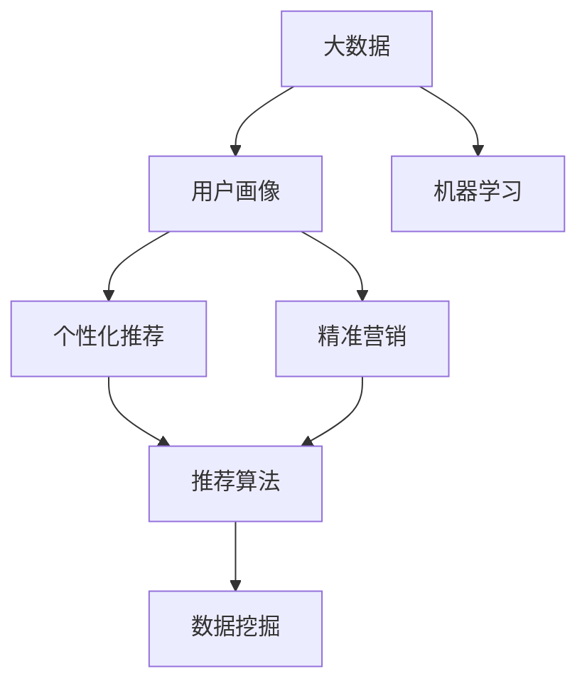

                 

# 信息差的商业服务个性化：大数据如何提升服务个性化

> 关键词：信息差,商业服务,个性化,大数据,算法,精准营销,用户画像

## 1. 背景介绍

### 1.1 问题由来

在互联网商业中，个性化服务已成为用户运营的核心驱动力。越来越多的企业通过大数据、人工智能等技术手段，希望通过精准营销、个性化推荐等方式提升用户体验，从而提升转化率和营收。但事实上，很多企业仍然存在信息不对称的问题，即无法精确理解用户需求和行为，难以做到真正的个性化服务。

信息差是指用户在获取信息、获取建议、购买决策等方面存在的差异和偏差。不同用户群体由于知识水平、兴趣偏好、行为模式等方面的不同，往往对同一产品、服务、活动等产生不同的理解和需求。因此，如何通过数据分析、算法设计等手段，有效识别和缩小信息差，成为企业提升服务个性化的关键所在。

### 1.2 问题核心关键点

- **信息差识别**：通过用户行为数据、搜索历史、社交网络等，识别不同用户的需求、兴趣和行为差异。
- **个性化推荐**：基于用户画像和推荐算法，实现产品、内容、活动的个性化匹配和推荐。
- **精准营销**：通过数据挖掘和模型优化，实现对目标用户的精准定位和高效触达。
- **用户行为分析**：对用户行为数据进行挖掘分析，提取有价值的信息，指导产品设计和用户运营策略。

这些核心关键点共同构成了信息差背景下的商业服务个性化需求。通过理解这些关键点，可以更好地把握个性化服务的本质，制定有效的策略和措施。

## 2. 核心概念与联系

### 2.1 核心概念概述

为了更好地理解如何利用大数据提升商业服务个性化，本节将介绍几个密切相关的核心概念：

- **大数据(Big Data)**：指规模巨大、类型多样、速度极快的数据集合，涵盖结构化、半结构化和非结构化数据。大数据在商业服务个性化中提供了丰富的数据来源，如用户行为数据、搜索记录、社交媒体、交易数据等。
- **个性化推荐系统(Personalized Recommendation System)**：根据用户的历史行为和实时兴趣，推荐最符合用户需求的产品、内容、活动等。个性化推荐系统是提升服务个性化的关键手段。
- **用户画像(User Profile)**：基于用户行为数据，构建详尽的用户特征向量，帮助企业了解用户需求、兴趣、行为等，实现精细化运营。
- **精准营销(Precision Marketing)**：通过数据分析和算法优化，精准定位目标用户，实现高效触达和转化。精准营销能够最大化营销资源的效果。
- **机器学习(Machine Learning)**：通过算法模型，从数据中挖掘规律，实现对用户行为和需求的预测和推荐。机器学习是实现个性化服务的重要工具。

这些核心概念之间的逻辑关系可以通过以下Mermaid流程图来展示：



这个流程图展示了大数据、用户画像、个性化推荐、精准营销和机器学习等核心概念及其之间的关系：

1. 大数据提供了丰富的用户数据来源，为用户画像和个性化推荐提供了基础。
2. 用户画像通过数据分析和机器学习技术，构建用户特征向量，为个性化推荐和精准营销提供了依据。
3. 个性化推荐系统通过算法模型，实现对用户需求的精准匹配和推荐。
4. 精准营销通过数据分析和算法优化，实现对目标用户的精准定位和高效触达。
5. 机器学习模型为数据挖掘和个性化推荐提供了强大的算法支持。

这些概念共同构成了大数据背景下的商业服务个性化框架，帮助企业更好地理解和满足用户需求。

## 3. 核心算法原理 & 具体操作步骤
### 3.1 算法原理概述

大数据在提升商业服务个性化中的核心在于通过数据分析和算法设计，实现对用户需求、兴趣和行为的精准识别和匹配。具体来说，个性化服务个性化的过程可以分为以下几个步骤：

1. **数据收集**：通过各种渠道收集用户的交互数据，如点击记录、浏览历史、购买记录等。
2. **数据预处理**：对收集到的数据进行清洗、去重、归一化等预处理操作，确保数据的准确性和一致性。
3. **用户画像构建**：基于预处理后的数据，构建用户画像，提取用户的基本特征和行为特征。
4. **算法模型训练**：选择适当的机器学习模型，如协同过滤、深度学习等，对用户画像进行训练，提取用户需求和行为规律。
5. **个性化推荐**：根据训练好的模型，对用户进行个性化推荐，实现精准匹配。

### 3.2 算法步骤详解

基于大数据的商业服务个性化，通常遵循以下步骤：

**Step 1: 数据收集与清洗**

- 从各种渠道收集用户行为数据，如电商平台、社交媒体、移动应用等。
- 对收集到的数据进行清洗，包括去重、格式统一、异常值处理等。

**Step 2: 数据特征提取**

- 对清洗后的数据进行特征提取，如用户ID、时间戳、浏览时间、点击次数、商品ID等。
- 使用特征工程技术，对提取到的特征进行编码、归一化、降维等处理，以提高模型的训练效果。

**Step 3: 用户画像构建**

- 基于提取到的特征，使用聚类、分类等算法，构建用户画像。
- 根据用户画像，进一步挖掘用户的兴趣、需求、行为规律等特征。

**Step 4: 模型训练与优化**

- 选择合适的机器学习模型，如协同过滤、矩阵分解、深度学习等。
- 使用训练集对模型进行训练，调整模型参数，以最大化推荐效果。
- 在验证集上评估模型效果，进行模型调优。

**Step 5: 个性化推荐**

- 将训练好的模型应用到新用户的行为数据上，实现个性化推荐。
- 对推荐结果进行展示，并通过用户反馈进一步优化推荐算法。

### 3.3 算法优缺点

基于大数据的商业服务个性化具有以下优点：

- **丰富数据源**：大数据提供了丰富的数据来源，能够从多角度、多维度了解用户需求和行为。
- **精准推荐**：通过机器学习模型，能够实现对用户需求的精准匹配和推荐，提升用户体验。
- **动态调整**：大数据和机器学习模型能够实现对用户需求的动态调整，适应用户行为的变化。

同时，大数据个性化服务也存在一些局限性：

- **数据隐私**：用户数据涉及隐私，如何保护用户隐私和数据安全是重要问题。
- **数据质量**：大数据来源多样，数据质量参差不齐，需要进行严格的预处理和清洗。
- **模型复杂**：大数据和机器学习模型的构建和调优复杂度较高，需要较强的技术积累。
- **成本高昂**：大数据和机器学习模型的建设和维护成本较高，需要较大的投入。

尽管存在这些局限性，但大数据和机器学习在商业服务个性化中的应用已经取得了显著的成效，成为企业提升用户体验和运营效率的重要手段。

### 3.4 算法应用领域

基于大数据的商业服务个性化技术，已经在多个行业领域得到广泛应用，例如：

- **电商推荐**：通过个性化推荐系统，帮助用户发现感兴趣的商品，提升购物体验和转化率。
- **内容推荐**：根据用户行为数据，推荐用户可能感兴趣的新闻、视频、音乐等内容。
- **金融理财**：基于用户交易和行为数据，推荐个性化的理财产品和投资方案。
- **社交网络**：通过个性化推荐和精准营销，提升用户粘性和活跃度。
- **出行服务**：根据用户出行习惯和行为数据，推荐个性化出行方案和目的地。
- **旅游推荐**：结合用户兴趣和行为数据，推荐个性化旅游线路和目的地。

除了上述这些经典应用外，大数据个性化服务还被创新性地应用到更多场景中，如智能客服、健康医疗、智能家居等，为各行各业带来了新的创新可能。

## 4. 数学模型和公式 & 详细讲解 & 举例说明

### 4.1 数学模型构建

本节将使用数学语言对基于大数据的商业服务个性化过程进行更加严格的刻画。

记用户行为数据为 $X=\{x_i\}_{i=1}^N$，其中 $x_i$ 表示用户第 $i$ 次行为的数据特征，如浏览时间、点击次数等。用户画像可以表示为 $P=\{p_j\}_{j=1}^K$，其中 $p_j$ 表示用户特征向量的第 $j$ 个维度，如年龄、性别、兴趣偏好等。

个性化推荐系统基于用户画像 $P$ 和行为数据 $X$，构建推荐模型 $M:\mathcal{X}\times\mathcal{P} \rightarrow \mathcal{R}$，其中 $\mathcal{R}$ 表示推荐结果集，如商品ID、新闻ID等。推荐模型的损失函数为 $\mathcal{L}(M)=\sum_{i=1}^N\ell(x_i, M(x_i, P_i))$，其中 $\ell$ 为损失函数，$P_i$ 表示用户 $i$ 的用户画像。

### 4.2 公式推导过程

以下我们以协同过滤(Collaborative Filtering)为例，推导个性化推荐模型的损失函数及其梯度计算公式。

协同过滤模型基于用户历史行为数据和用户画像，预测用户对未看过商品的兴趣。假设用户历史行为数据为 $I=\{i_j\}_{j=1}^{N_i}$，其中 $i_j$ 表示用户 $i$ 对商品 $j$ 的评分。用户画像为 $P=\{p_j\}_{j=1}^K$。

协同过滤模型的预测结果可以表示为：

$$
\hat{y}_{i,j}=\sum_{k=1}^K w_k p_{k,i} \times \frac{\sum_{j'=N_i}^N w_{j'} x_{j',k}}{\sum_{j'=N_i}^N w_{j'} x_{j',k}^2}
$$

其中 $w_k$ 为第 $k$ 个特征的权重，$x_{j',k}$ 表示用户 $j'$ 对商品 $k$ 的评分，$\hat{y}_{i,j}$ 表示用户 $i$ 对商品 $j$ 的预测评分。

损失函数可以表示为：

$$
\mathcal{L}(M)=\sum_{i=1}^N\sum_{j=1}^{N_i}\ell(\hat{y}_{i,j}, y_{i,j})
$$

其中 $\ell$ 为损失函数，$y_{i,j}$ 表示用户 $i$ 对商品 $j$ 的真实评分。

根据链式法则，损失函数对用户画像 $P$ 的梯度计算公式为：

$$
\frac{\partial \mathcal{L}(M)}{\partial P} = -\sum_{i=1}^N\sum_{j=1}^{N_i} \frac{\partial \ell(\hat{y}_{i,j}, y_{i,j})}{\partial \hat{y}_{i,j}} \frac{\partial \hat{y}_{i,j}}{\partial P} \frac{\partial \hat{y}_{i,j}}{\partial x_{i,j}}
$$

其中 $\frac{\partial \hat{y}_{i,j}}{\partial P}$ 和 $\frac{\partial \hat{y}_{i,j}}{\partial x_{i,j}}$ 分别为预测评分对用户画像和行为数据的偏导数。

在得到梯度后，即可带入优化算法，完成模型的迭代优化。重复上述过程直至收敛，最终得到适应用户需求的个性化推荐模型。

## 5. 项目实践：代码实例和详细解释说明
### 5.1 开发环境搭建

在进行个性化服务实践前，我们需要准备好开发环境。以下是使用Python进行PyTorch开发的环境配置流程：

1. 安装Anaconda：从官网下载并安装Anaconda，用于创建独立的Python环境。

2. 创建并激活虚拟环境：
```bash
conda create -n pytorch-env python=3.8 
conda activate pytorch-env
```

3. 安装PyTorch：根据CUDA版本，从官网获取对应的安装命令。例如：
```bash
conda install pytorch torchvision torchaudio cudatoolkit=11.1 -c pytorch -c conda-forge
```

4. 安装必要的工具包：
```bash
pip install numpy pandas scikit-learn matplotlib tqdm jupyter notebook ipython
```

完成上述步骤后，即可在`pytorch-env`环境中开始开发实践。

### 5.2 源代码详细实现

下面我们以电商推荐系统为例，给出使用PyTorch进行个性化推荐系统的PyTorch代码实现。

首先，定义用户行为数据和用户画像：

```python
import pandas as pd

# 用户行为数据
user_data = pd.read_csv('user_based_data.csv', index_col='user_id')
user_data = user_data.sort_index()

# 用户画像
profile_data = pd.read_csv('profile_data.csv', index_col='user_id')
profile_data = profile_data.sort_index()

# 商品数据
item_data = pd.read_csv('item_data.csv', index_col='item_id')
```

然后，定义推荐模型的预测函数：

```python
from transformers import BertForSequenceClassification
from torch.utils.data import Dataset
import torch

class RecommendationDataset(Dataset):
    def __init__(self, user_data, profile_data, item_data, user_ids):
        self.user_data = user_data
        self.profile_data = profile_data
        self.item_data = item_data
        self.user_ids = user_ids
        
    def __len__(self):
        return len(self.user_ids)
    
    def __getitem__(self, item):
        user_id = self.user_ids[item]
        user_profile = self.profile_data.loc[user_id]
        user_items = self.user_data.loc[user_id].dropna()
        items = self.item_data.index[(user_items['item_id'] != 0).values]
        scores = self.item_data.loc[user_items['item_id'].dropna(), 'score'].dropna()
        return {
            'user_id': user_id,
            'user_profile': user_profile,
            'items': items,
            'scores': scores
        }

# 加载数据集
user_ids = pd.read_csv('user_ids.csv', index_col='user_id')
train_dataset = RecommendationDataset(user_data, profile_data, item_data, user_ids)
val_dataset = RecommendationDataset(user_data, profile_data, item_data, user_ids)
test_dataset = RecommendationDataset(user_data, profile_data, item_data, user_ids)

# 加载预训练模型
model = BertForSequenceClassification.from_pretrained('bert-base-cased', num_labels=len(item_data['item_id'].unique()))
```

接着，定义模型训练函数：

```python
from torch.utils.data import DataLoader
from torch.optim import Adam
from tqdm import tqdm

def train(model, train_dataset, val_dataset, test_dataset, epochs=5, batch_size=16, learning_rate=1e-5):
    model.train()
    train_loader = DataLoader(train_dataset, batch_size=batch_size, shuffle=True)
    val_loader = DataLoader(val_dataset, batch_size=batch_size, shuffle=False)
    test_loader = DataLoader(test_dataset, batch_size=batch_size, shuffle=False)
    
    for epoch in range(epochs):
        train_loss = 0
        for batch in tqdm(train_loader, desc='Training'):
            user_id, user_profile, items, scores = batch
            items = items.to('cuda')
            scores = scores.to('cuda')
            user_profile = user_profile.to('cuda')
            
            logits = model(user_profile, items)
            loss = torch.mean((logits - scores)**2)
            optimizer.zero_grad()
            loss.backward()
            optimizer.step()
            train_loss += loss.item()
            
        val_loss = evaluate(model, val_dataset)
        test_loss = evaluate(model, test_dataset)
        
        print(f'Epoch {epoch+1}, train loss: {train_loss/len(train_loader):.4f}, val loss: {val_loss:.4f}, test loss: {test_loss:.4f}')

# 模型评估函数
def evaluate(model, dataset, batch_size=16):
    model.eval()
    val_loader = DataLoader(dataset, batch_size=batch_size, shuffle=False)
    val_loss = 0
    for batch in tqdm(val_loader, desc='Evaluating'):
        user_id, user_profile, items, scores = batch
        items = items.to('cuda')
        scores = scores.to('cuda')
        user_profile = user_profile.to('cuda')
        
        logits = model(user_profile, items)
        loss = torch.mean((logits - scores)**2)
        val_loss += loss.item()
    
    return val_loss / len(dataset)

# 模型训练与评估
train(model, train_dataset, val_dataset, test_dataset)
```

以上就是使用PyTorch进行电商推荐系统的完整代码实现。可以看到，通过PyTorch和Bert模型，我们可以快速实现个性化推荐系统的训练和评估。

### 5.3 代码解读与分析

让我们再详细解读一下关键代码的实现细节：

**RecommendationDataset类**：
- `__init__`方法：初始化用户行为数据、用户画像和商品数据等关键组件。
- `__len__`方法：返回数据集的样本数量。
- `__getitem__`方法：对单个样本进行处理，将用户行为数据、用户画像和商品数据进行预处理，返回模型所需的输入。

**数据加载**：
- 使用pandas加载用户行为数据、用户画像和商品数据，确保数据格式的正确性。
- 对数据进行清洗、去重、排序等预处理操作。
- 使用RecommendationDataset类，将用户行为数据、用户画像和商品数据封装为DataLoader对象，方便模型的批量处理。

**模型训练**：
- 使用Adam优化器，设置学习率、批大小等超参数，开始训练过程。
- 在训练过程中，通过模型预测商品评分，计算预测评分与真实评分的平方误差，反向传播更新模型参数。
- 在每个epoch结束后，在验证集和测试集上评估模型效果，输出训练损失、验证损失和测试损失。

**模型评估**：
- 定义模型评估函数，在验证集上计算模型预测评分与真实评分的平方误差，求平均值。
- 在训练过程中，定期在验证集上评估模型性能，根据验证损失调整训练参数。

通过这些代码实现，我们可以全面掌握电商推荐系统的开发流程，理解其中的核心技术和优化策略。

当然，工业级的系统实现还需考虑更多因素，如模型的保存和部署、超参数的自动搜索、更灵活的任务适配层等。但核心的个性化推荐流程基本与此类似。

## 6. 实际应用场景
### 6.1 智能客服系统

基于大数据的个性化服务，可以广泛应用于智能客服系统的构建。传统客服往往需要配备大量人力，高峰期响应缓慢，且一致性和专业性难以保证。而使用大数据个性化服务技术，可以7x24小时不间断服务，快速响应客户咨询，用自然流畅的语言解答各类常见问题。

在技术实现上，可以收集企业内部的历史客服对话记录，将问题和最佳答复构建成监督数据，在此基础上对预训练语言模型进行微调。微调后的语言模型能够自动理解用户意图，匹配最合适的答复模板进行回复。对于客户提出的新问题，还可以接入检索系统实时搜索相关内容，动态组织生成回答。如此构建的智能客服系统，能大幅提升客户咨询体验和问题解决效率。

### 6.2 金融舆情监测

金融机构需要实时监测市场舆论动向，以便及时应对负面信息传播，规避金融风险。传统的人工监测方式成本高、效率低，难以应对网络时代海量信息爆发的挑战。基于大数据个性化服务的文本分类和情感分析技术，为金融舆情监测提供了新的解决方案。

具体而言，可以收集金融领域相关的新闻、报道、评论等文本数据，并对其进行主题标注和情感标注。在此基础上对预训练语言模型进行微调，使其能够自动判断文本属于何种主题，情感倾向是正面、中性还是负面。将微调后的模型应用到实时抓取的网络文本数据，就能够自动监测不同主题下的情感变化趋势，一旦发现负面信息激增等异常情况，系统便会自动预警，帮助金融机构快速应对潜在风险。

### 6.3 个性化推荐系统

当前的推荐系统往往只依赖用户的历史行为数据进行物品推荐，无法深入理解用户的真实兴趣偏好。基于大数据个性化服务的推荐系统可以更好地挖掘用户行为背后的语义信息，从而提供更精准、多样的推荐内容。

在实践中，可以收集用户浏览、点击、评论、分享等行为数据，提取和用户交互的物品标题、描述、标签等文本内容。将文本内容作为模型输入，用户的后续行为（如是否点击、购买等）作为监督信号，在此基础上微调预训练语言模型。微调后的模型能够从文本内容中准确把握用户的兴趣点。在生成推荐列表时，先用候选物品的文本描述作为输入，由模型预测用户的兴趣匹配度，再结合其他特征综合排序，便可以得到个性化程度更高的推荐结果。

### 6.4 未来应用展望

随着大数据和个性化服务技术的不断发展，基于大数据的个性化服务将在更多领域得到应用，为传统行业带来变革性影响。

在智慧医疗领域，基于大数据的个性化服务可以帮助医院优化诊疗流程，提高医疗服务质量和效率。例如，通过分析患者的历史诊疗记录和行为数据，推荐个性化的诊疗方案和治疗建议，提升医生的诊疗水平。

在智能教育领域，个性化服务技术可以应用于作业批改、学情分析、知识推荐等方面，因材施教，促进教育公平，提高教学质量。例如，通过分析学生的学习行为和偏好，推荐个性化的学习资源和教学方案，提升学生的学习效果。

在智慧城市治理中，基于大数据的个性化服务可以应用于城市事件监测、舆情分析、应急指挥等环节，提高城市管理的自动化和智能化水平，构建更安全、高效的未来城市。例如，通过分析城市居民的出行数据和行为习惯，推荐个性化的出行方案和政策建议，提升城市的智能化管理水平。

此外，在企业生产、社会治理、文娱传媒等众多领域，基于大数据的个性化服务还将不断涌现，为传统行业带来新的创新可能。相信随着技术的日益成熟，大数据个性化服务必将在更广阔的应用领域大放异彩，深刻影响人类的生产生活方式。

## 7. 工具和资源推荐
### 7.1 学习资源推荐

为了帮助开发者系统掌握大数据和个性化服务的理论基础和实践技巧，这里推荐一些优质的学习资源：

1. 《Python数据分析基础》：系统介绍Python数据处理和分析的基础知识，是学习大数据和个性化服务的入门必备。
2. 《机器学习实战》：实战介绍机器学习算法的应用，涵盖协同过滤、深度学习等推荐系统核心技术。
3. 《TensorFlow实战》：系统介绍TensorFlow的深度学习应用，适合想要深入学习大数据和个性化服务的开发者。
4. 《大数据与人工智能》：由大数据和人工智能专家撰写的教材，涵盖大数据和人工智能的理论与实践。
5. Kaggle数据科学竞赛：Kaggle提供丰富的数据集和竞赛机会，是学习大数据和个性化服务的绝佳平台。

通过对这些资源的学习实践，相信你一定能够快速掌握大数据和个性化服务的精髓，并用于解决实际的商业问题。
###  7.2 开发工具推荐

高效的开发离不开优秀的工具支持。以下是几款用于大数据和个性化服务开发的常用工具：

1. Python：作为数据科学和机器学习的标准语言，Python提供丰富的数据分析和机器学习库，如Pandas、NumPy、Scikit-learn、TensorFlow等，适合处理大数据和构建个性化推荐系统。
2. Apache Hadoop：用于处理大规模数据的分布式计算框架，适合大数据的存储和计算需求。
3. Apache Spark：用于处理大规模数据集的分布式计算框架，提供丰富的API和工具，适合大数据的分布式处理和计算。
4. Apache Flink：用于实时数据流处理的分布式计算框架，适合大数据的实时分析和处理。
5. Apache Kafka：用于处理大规模数据流的分布式消息队列，适合大数据的高效传输和处理。
6. Elasticsearch：用于全文搜索和数据存储的开源搜索引擎，适合大数据的文本分析和检索。

合理利用这些工具，可以显著提升大数据和个性化服务的开发效率，加快创新迭代的步伐。

### 7.3 相关论文推荐

大数据和个性化服务的发展源于学界的持续研究。以下是几篇奠基性的相关论文，推荐阅读：

1. "Collaborative Filtering for Implicit Feedback Datasets"：介绍协同过滤算法的基本原理和实现方法，是推荐系统领域的经典论文。
2. "A Deep Learning Approach to Recommendation System"：提出基于深度学习的推荐系统模型，显著提高了推荐效果。
3. "Apache Spark: Leveraging the Power of Clusters to Process Trillions of Records"：介绍Apache Spark的分布式计算框架，适合大规模数据的处理和分析。
4. "Scalable Distributed Density-Based Clustering using Hadoop"：介绍基于Hadoop的分布式密度聚类算法，适合大数据的聚类分析。
5. "Elasticsearch: A Distributed Real-Time File System"：介绍Elasticsearch的分布式搜索引擎和文本分析能力，适合大数据的文本检索和分析。

这些论文代表了大数据和个性化服务的研究前沿，通过学习这些前沿成果，可以帮助研究者把握学科前进方向，激发更多的创新灵感。

## 8. 总结：未来发展趋势与挑战

### 8.1 总结

本文对基于大数据的商业服务个性化方法进行了全面系统的介绍。首先阐述了大数据和个性化服务的研究背景和意义，明确了大数据和个性化服务对提升用户体验和运营效率的关键作用。其次，从原理到实践，详细讲解了大数据和个性化服务的数学原理和关键步骤，给出了数据收集、数据预处理、用户画像构建、模型训练和个性化推荐等完整的实现流程。同时，本文还广泛探讨了大数据和个性化服务在电商、金融、智能客服、智能教育等多个行业领域的应用前景，展示了大数据和个性化服务的巨大潜力。

通过本文的系统梳理，可以看到，基于大数据的商业服务个性化技术已经成为企业提升用户体验和运营效率的重要手段。大数据和机器学习模型能够通过多维度、多场景的数据分析，实现对用户需求的精准识别和匹配，显著提升个性化服务的效果。未来，伴随大数据和机器学习技术的持续演进，基于大数据的商业服务个性化必将在更广泛的领域落地应用，深刻影响人类的生产生活方式。

### 8.2 未来发展趋势

展望未来，基于大数据的商业服务个性化技术将呈现以下几个发展趋势：

1. **多模态数据融合**：未来的个性化服务将更加注重多模态数据的融合，如文本、图像、音频等。通过多模态数据的整合，提升对用户需求的全面理解。
2. **实时计算能力**：随着硬件计算能力的提升，个性化服务的实时计算能力将得到显著增强。实时计算能力能够实现对用户需求的动态调整，提升服务的时效性和精准度。
3. **隐私保护技术**：隐私保护技术将成为个性化服务的重要组成部分。如何在大数据和个性化服务中保护用户隐私，成为未来的一个重要研究方向。
4. **个性化算法优化**：未来将涌现更多优化个性化的算法，如强化学习、对抗学习等，进一步提升个性化服务的推荐效果和用户体验。
5. **跨领域融合**：大数据和个性化服务将与其他人工智能技术进行更深入的融合，如知识表示、因果推理、强化学习等，推动人工智能技术在更多领域的应用。
6. **普适化服务**：未来的个性化服务将更加普适化，能够更好地适配不同用户群体的需求，提升服务的覆盖面和普及率。

以上趋势凸显了大数据和个性化服务技术的广阔前景。这些方向的探索发展，必将进一步提升个性化服务的效果和应用范围，为人类认知智能的进化带来深远影响。

### 8.3 面临的挑战

尽管大数据和个性化服务技术已经取得了显著的成效，但在迈向更加智能化、普适化应用的过程中，它仍面临着诸多挑战：

1. **数据隐私保护**：用户数据涉及隐私，如何保护用户隐私和数据安全是重要问题。需要制定严格的数据隐私保护机制，确保用户数据的安全。
2. **数据质量问题**：大数据来源多样，数据质量参差不齐，需要进行严格的预处理和清洗。需要提高数据的采集和处理能力，确保数据的准确性和一致性。
3. **计算资源限制**：大数据和个性化服务的计算资源需求较高，需要具备较高的硬件计算能力。如何优化计算资源的使用，提升计算效率，是未来的一个重要研究方向。
4. **模型复杂度**：大数据和个性化服务的模型复杂度较高，需要较强的技术积累。如何简化模型结构，降低模型复杂度，是未来的一个重要研究方向。
5. **算法性能**：个性化服务算法的效果取决于数据质量和模型复杂度，需要在数据和模型上进行平衡，提升算法性能。
6. **用户反馈机制**：如何构建有效的用户反馈机制，根据用户反馈调整个性化服务策略，是未来的一个重要研究方向。

这些挑战凸显了大数据和个性化服务技术在实际应用中需要不断优化和改进。只有在数据、模型、技术、应用等多方面协同发力，才能真正实现个性化服务的理想效果。

### 8.4 研究展望

面对大数据和个性化服务所面临的挑战，未来的研究需要在以下几个方面寻求新的突破：

1. **隐私保护技术**：研究如何在大数据和个性化服务中保护用户隐私，制定严格的数据隐私保护机制，确保用户数据的安全。
2. **数据质量提升**：研究如何提高数据的采集和处理能力，确保数据的准确性和一致性，优化数据的预处理和清洗方法。
3. **计算资源优化**：研究如何优化计算资源的使用，提升计算效率，降低硬件计算成本。
4. **模型简化**：研究如何简化模型结构，降低模型复杂度，提升模型的计算效率和推理速度。
5. **算法性能提升**：研究如何提升个性化服务算法的性能，实现更精准、更高效的个性化服务。
6. **用户反馈机制**：研究如何构建有效的用户反馈机制，根据用户反馈调整个性化服务策略，提升用户体验和满意度。

这些研究方向将进一步推动大数据和个性化服务技术的成熟和发展，为构建更加智能化、普适化的商业服务体系提供有力支持。

## 9. 附录：常见问题与解答

**Q1：大数据和个性化服务是否适用于所有商业场景？**

A: 大数据和个性化服务在大多数商业场景中都能取得不错的效果，特别是对于数据量较大的场景。但对于一些特定领域的场景，如医疗、法律等，大数据和个性化服务的效果可能有限。此时需要在特定领域语料上进一步预训练，再进行微调，才能获得理想效果。

**Q2：如何选择合适的个性化推荐算法？**

A: 选择合适的个性化推荐算法需要考虑多个因素，包括数据类型、推荐目标、计算资源等。常见的个性化推荐算法包括协同过滤、矩阵分解、深度学习等。协同过滤适合处理稀疏数据，矩阵分解适合处理密集数据，深度学习适合处理大规模数据和高维数据。需要根据具体应用场景进行选择。

**Q3：如何在个性化服务中保护用户隐私？**

A: 保护用户隐私是大数据和个性化服务的重要课题。常用的方法包括数据匿名化、差分隐私、联邦学习等。数据匿名化是将用户数据进行去标识化处理，防止数据泄露。差分隐私是在数据分析过程中加入噪声，保护用户隐私。联邦学习是在不共享数据的情况下，通过分布式计算实现模型训练。

**Q4：如何优化大数据和个性化服务的计算资源？**

A: 优化大数据和个性化服务的计算资源需要从多个方面入手，包括数据预处理、模型简化、计算并行等。数据预处理可以通过压缩、编码等方法降低数据量。模型简化可以通过特征选择、参数压缩等方法降低模型复杂度。计算并行可以通过分布式计算、GPU加速等方法提升计算效率。

**Q5：如何构建有效的用户反馈机制？**

A: 构建有效的用户反馈机制需要考虑多个因素，包括反馈渠道、反馈形式、反馈处理等。常用的方法包括问卷调查、A/B测试、用户行为分析等。问卷调查可以获取用户的主观反馈，A/B测试可以客观评估推荐效果，用户行为分析可以自动提取用户反馈。

通过这些问题的回答，可以看到大数据和个性化服务技术在实际应用中需要综合考虑多个因素，不断优化和改进，才能实现理想的效果。

---

作者：禅与计算机程序设计艺术 / Zen and the Art of Computer Programming

