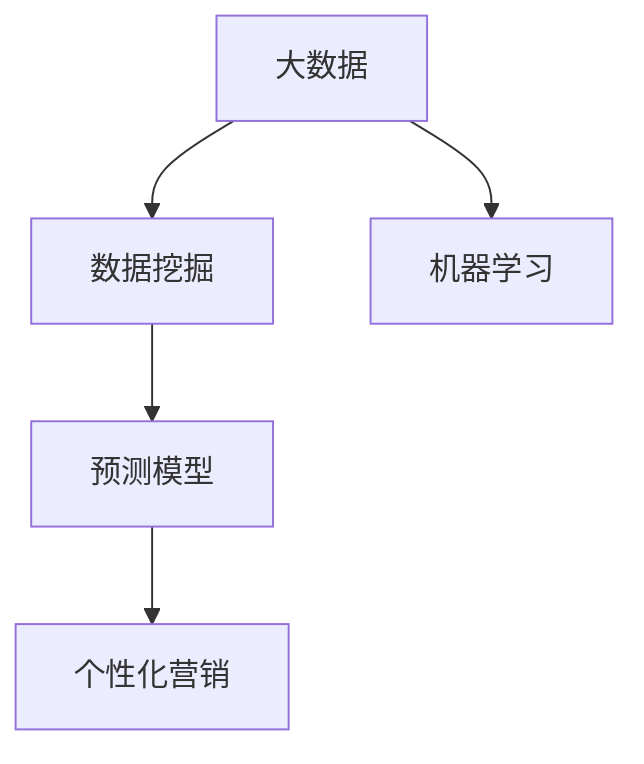

                 

# 信息差的市场细分利器：大数据如何实现精准市场细分

## 1. 背景介绍

在今天的信息时代，市场细分已不再是传统意义上的市场划分区隔，而是利用大数据技术，通过深度分析和精准定位，实现对不同客户群体的差异化营销和定制化服务。信息差作为市场细分的核心，已成为企业获取竞争优势的重要手段。通过挖掘和分析海量数据，企业能够更加深入地了解目标客户群体的需求、行为和偏好，从而制定更加精准的营销策略，提高市场响应度和客户满意度。

### 1.1 问题由来

随着互联网和移动互联网的普及，消费者获取信息和进行购物决策的渠道越来越多样化。企业想要在激烈的竞争中脱颖而出，就必须深入了解目标市场，精准定位客户需求，提供个性化、差异化的产品和服务。传统的市场细分方法，如人口统计学、地理位置等，在面对海量数据和复杂场景时，往往显得力不从心。信息差方法通过大数据分析，揭示了客户背后的行为模式和心理特征，为企业提供了更加精准的市场细分工具。

### 1.2 问题核心关键点

信息差市场细分的核心关键点在于以下几个方面：

- **数据源多样化**：信息差市场细分需要涵盖多渠道的数据源，如社交媒体、电商交易记录、搜索记录、用户行为数据等，以全面揭示客户信息。

- **数据分析深度**：通过对数据的深度挖掘，发现隐藏的消费行为模式和心理特征，揭示客户需求的本质。

- **模型预测能力**：基于数据挖掘和机器学习技术，构建预测模型，实现对客户行为的精准预测。

- **个性化营销**：利用精准的市场细分结果，制定个性化、差异化的营销策略，提高客户转化率和满意度。

## 2. 核心概念与联系

### 2.1 核心概念概述

为更好地理解大数据在信息差市场细分中的作用，本节将介绍几个密切相关的核心概念：

- **大数据(Big Data)**：指在传统数据处理应用软件无法有效处理的大或复杂的数据集。通常以TB、PB计。大数据具有海量性、多样性、高速性等特点。

- **信息差(Information Gap)**：指消费者需求与市场供给之间的差异。信息差越大，消费者越难以找到满足自身需求的产品，也越容易产生购物决策的延迟和消费行为的转移。

- **数据挖掘(Data Mining)**：指从大数据集中提取有用信息的过程。包括数据清洗、特征提取、模式发现、关联规则挖掘等环节。

- **机器学习(Machine Learning)**：指通过数据训练模型，使模型能够预测未知数据的能力。包括监督学习、无监督学习、强化学习等多种形式。

- **预测模型(Prediction Model)**：指基于历史数据训练得到的模型，用于对未来数据进行预测。包括回归模型、分类模型、聚类模型等。

这些核心概念之间的逻辑关系可以通过以下Mermaid流程图来展示：



这个流程图展示了大数据、数据挖掘、机器学习和预测模型与个性化营销之间的联系：

1. 大数据是数据挖掘的基础。
2. 数据挖掘通过从大数据中提取有价值的信息，为机器学习提供数据支持。
3. 机器学习通过构建预测模型，实现对未来数据的精准预测。
4. 预测模型结合个性化营销，实现精准的市场细分和营销策略制定。

## 3. 核心算法原理 & 具体操作步骤
### 3.1 算法原理概述

信息差市场细分的核心算法原理是利用大数据和机器学习技术，揭示消费者需求与市场供给之间的差异，实现对客户行为的精准预测。其核心步骤包括：

1. **数据采集**：收集不同渠道的客户数据，涵盖消费记录、行为数据、社交媒体信息等。
2. **数据预处理**：对数据进行清洗、归一化、去重等预处理操作，保证数据质量和一致性。
3. **特征提取**：从数据中提取有意义的特征，如消费频率、购物习惯、兴趣偏好等。
4. **模型训练**：基于历史数据训练预测模型，如分类模型、回归模型、聚类模型等，实现对客户行为的精准预测。
5. **市场细分**：利用预测模型对客户进行市场细分，识别不同客户群体的信息差特征。
6. **个性化营销**：基于市场细分结果，制定个性化、差异化的营销策略，实现精准营销。

### 3.2 算法步骤详解

以下是信息差市场细分的详细步骤：

**Step 1: 数据采集与清洗**

- **多渠道数据源**：收集电商交易记录、社交媒体互动数据、搜索记录、用户行为数据等。
- **数据清洗**：去除无效数据、缺失数据，统一数据格式，保证数据一致性。

**Step 2: 特征提取与工程**

- **特征工程**：设计合理的特征提取流程，提取有意义的特征如消费频率、购物时长、兴趣偏好等。
- **特征降维**：采用主成分分析、因子分析等方法，减少特征维度，提升模型训练效率。

**Step 3: 模型训练与优化**

- **选择模型**：根据任务需求选择合适的机器学习模型，如分类模型、回归模型、聚类模型等。
- **模型训练**：使用历史数据对模型进行训练，优化模型参数，提升模型预测精度。
- **模型评估**：采用交叉验证、ROC曲线、AUC等指标对模型进行评估，确保模型稳定性和泛化能力。

**Step 4: 市场细分与分析**

- **市场细分**：利用训练好的模型对客户进行市场细分，识别不同客户群体的信息差特征。
- **行为分析**：分析各细分群体的消费行为模式，揭示客户需求的本质。

**Step 5: 个性化营销策略**

- **策略制定**：结合市场细分结果和行为分析，制定个性化、差异化的营销策略。
- **效果评估**：定期评估营销策略效果，根据反馈调整策略，持续优化。

### 3.3 算法优缺点

信息差市场细分方法具有以下优点：

- **精准性高**：通过深度数据分析和机器学习，揭示客户需求的本质，实现精准的市场细分。
- **自动化强**：数据采集、特征提取、模型训练等环节高度自动化，减轻人工负担。
- **可扩展性强**：适用于多种场景和行业，可灵活调整算法和模型，实现个性化营销。

但同时也存在一些局限性：

- **数据依赖性强**：对数据质量和多样性的依赖较大，一旦数据不足或数据质量低下，模型效果可能大打折扣。
- **计算资源需求高**：大数据分析需要高性能计算资源，对硬件要求较高。
- **模型解释性差**：复杂的机器学习模型可能缺乏解释性，难以被客户和业务人员理解。

## 4. 数学模型和公式 & 详细讲解 & 举例说明

### 4.1 数学模型构建

本节将使用数学语言对信息差市场细分的核心算法进行更加严格的刻画。

记客户数据集为 $D=\{(x_i,y_i)\}_{i=1}^N$，其中 $x_i$ 为特征向量，$y_i$ 为客户标签。假设模型 $f(x)$ 能够预测客户是否产生购买行为，即 $y_i=f(x_i)$。

定义预测误差函数为 $L(f)=\frac{1}{N}\sum_{i=1}^N (y_i - f(x_i))^2$。目标是最小化预测误差，即：

$$
\min_{f} L(f)
$$

其中 $f$ 为模型参数。通常使用最小二乘法、梯度下降等方法求解。

### 4.2 公式推导过程

以回归模型为例，我们推导最小二乘法的公式及其求解过程。

假设客户数据集 $D=\{(x_i,y_i)\}_{i=1}^N$，其中 $x_i$ 为特征向量，$y_i$ 为客户购买行为。我们假设模型为线性回归模型，即 $y_i=\beta_0+\beta_1x_{i1}+\beta_2x_{i2}+\cdots+\beta_nx_{in}+\epsilon_i$。

其中 $\beta_0,\beta_1,\cdots,\beta_n$ 为模型参数，$\epsilon_i$ 为误差项。最小二乘法通过最小化预测误差来求解模型参数：

$$
\min_{\beta_0,\beta_1,\cdots,\beta_n} \sum_{i=1}^N (y_i - \beta_0-\beta_1x_{i1}-\beta_2x_{i2}-\cdots-\beta_nx_{in})^2
$$

通过对上述表达式求偏导数，得到模型参数的求解公式：

$$
\beta_j=\frac{\sum_{i=1}^N(x_{ij}-\bar{x}_{ij})(y_i-\bar{y}_i)}{\sum_{i=1}^N(x_{ij}-\bar{x}_{ij})^2} \quad j=0,1,\cdots,n
$$

其中 $\bar{x}_{ij}$ 和 $\bar{y}_i$ 分别为特征 $x_{ij}$ 和标签 $y_i$ 的均值。

### 4.3 案例分析与讲解

以下以电商平台为例，展示信息差市场细分的实际应用。

**案例背景**：某电商平台希望通过信息差市场细分，实现对不同客户群体的精准营销。该平台拥有数百万用户，每个用户的购买记录、浏览记录、搜索记录等数据被收集起来，成为大数据分析的素材。

**特征设计**：平台选取了用户的购买频率、消费金额、浏览时间、购买品类等作为特征，设计了多个特征组合，如“高频消费+中高消费金额”、“浏览时间较长+购买高频”等。

**模型选择**：平台选择了随机森林模型，对历史数据进行了训练和优化，得到了一个较为稳定的预测模型。

**市场细分**：利用训练好的随机森林模型，对所有用户进行了市场细分，识别出高潜力客户和高价值客户等不同群体。

**策略制定**：针对不同客户群体，制定了不同的营销策略，如对高潜力客户进行优惠促销，对高价值客户进行VIP专享活动等。

**效果评估**：通过监控客户的购买行为和平台销售额的变化，评估了不同营销策略的效果。发现针对不同客户群体的营销策略均取得了良好的效果。

## 5. 项目实践：代码实例和详细解释说明
### 5.1 开发环境搭建

在进行信息差市场细分实践前，我们需要准备好开发环境。以下是使用Python进行Scikit-learn开发的环境配置流程：

1. 安装Anaconda：从官网下载并安装Anaconda，用于创建独立的Python环境。

2. 创建并激活虚拟环境：
```bash
conda create -n scikit-learn-env python=3.8 
conda activate scikit-learn-env
```

3. 安装Scikit-learn：
```bash
conda install scikit-learn
```

4. 安装Pandas、NumPy、Matplotlib等工具包：
```bash
pip install pandas numpy matplotlib seaborn
```

完成上述步骤后，即可在`scikit-learn-env`环境中开始信息差市场细分的实践。

### 5.2 源代码详细实现

这里我们以回归模型为例，展示信息差市场细分的代码实现。

首先，定义数据预处理函数：

```python
import pandas as pd
from sklearn.preprocessing import StandardScaler
from sklearn.model_selection import train_test_split

def preprocess_data(df):
    # 数据清洗
    df = df.dropna()
    # 特征工程
    features = df[['购买频率', '消费金额', '浏览时间', '购买品类']]
    # 标准化处理
    scaler = StandardScaler()
    features = scaler.fit_transform(features)
    # 目标变量
    target = df['购买行为']
    # 划分训练集和测试集
    features_train, features_test, target_train, target_test = train_test_split(features, target, test_size=0.2, random_state=42)
    return features_train, features_test, target_train, target_test
```

然后，定义回归模型并训练：

```python
from sklearn.ensemble import RandomForestRegressor
from sklearn.metrics import mean_squared_error

def train_model(features_train, target_train):
    # 模型选择
    model = RandomForestRegressor(n_estimators=100, random_state=42)
    # 模型训练
    model.fit(features_train, target_train)
    # 模型评估
    y_pred = model.predict(features_test)
    mse = mean_squared_error(target_test, y_pred)
    return model, mse
```

接着，定义市场细分和策略制定函数：

```python
from sklearn.cluster import KMeans

def segment_data(features_train, target_train):
    # 模型选择
    model = KMeans(n_clusters=3, random_state=42)
    # 模型训练
    model.fit(features_train)
    # 市场细分
    clusters = model.predict(features_train)
    return clusters
```

最后，启动训练流程并在测试集上评估：

```python
# 数据预处理
features_train, features_test, target_train, target_test = preprocess_data(df)

# 模型训练和市场细分
model, mse = train_model(features_train, target_train)
clusters = segment_data(features_train, target_train)

# 效果评估
print(f"Mean Squared Error: {mse:.3f}")

# 策略制定和效果评估
# 此处省略具体策略实现
```

以上就是使用Scikit-learn进行信息差市场细分的完整代码实现。可以看到，Scikit-learn提供了强大的数据分析和机器学习工具，使得模型训练和市场细分的实现变得简洁高效。

### 5.3 代码解读与分析

让我们再详细解读一下关键代码的实现细节：

**preprocess_data函数**：
- `dropna`方法：去除缺失值，保证数据完整性。
- `StandardScaler`：标准化处理，确保不同特征的尺度一致。
- `train_test_split`：划分训练集和测试集，保证模型评估的公正性。

**train_model函数**：
- `RandomForestRegressor`：选择随机森林回归模型，进行训练和预测。
- `mean_squared_error`：评估模型预测精度，选择均方误差作为指标。

**segment_data函数**：
- `KMeans`：使用K-means聚类算法对客户进行市场细分，划分为不同群体。

**效果评估**：
- 输出模型在测试集上的均方误差，评估预测精度。
- 市场细分的结果可以通过可视化展示，如散点图、柱状图等。

以上代码实现了信息差市场细分的核心步骤，包括数据预处理、模型训练、市场细分和策略制定。在实际应用中，还需要结合具体业务场景，对各环节进行优化和调整。

## 6. 实际应用场景
### 6.1 电商平台

在电商平台中，信息差市场细分可以帮助企业识别出高潜力客户和高价值客户，实现精准营销。通过分析客户的购买记录、浏览记录、搜索记录等数据，平台可以构建出多个特征组合，如“高频消费+中高消费金额”、“浏览时间较长+购买高频”等。将这些特征组合作为输入，训练回归模型或分类模型，实现对客户购买行为的预测。最终，平台可以根据市场细分结果，针对不同客户群体制定个性化、差异化的营销策略，如对高潜力客户进行优惠促销，对高价值客户进行VIP专享活动等。

### 6.2 金融服务

金融服务行业也常常使用信息差市场细分，对客户进行精准识别和风险评估。金融机构可以收集客户的交易记录、资产配置、信用评分等数据，构建出客户画像，并利用机器学习模型进行分类预测。通过对客户进行市场细分，金融机构可以识别出高风险客户和高价值客户，实施差异化的风险控制和产品推荐策略。

### 6.3 医疗健康

医疗健康领域的信息差市场细分，可以帮助医院和诊所精准识别高需求客户，提高医疗资源的利用效率。通过分析患者的病历记录、诊疗历史、用药习惯等数据，医院可以构建出多个特征组合，如“频繁就诊+高支出”、“慢性病+特殊需求”等。将这些特征组合作为输入，训练回归模型或分类模型，实现对患者需求的精准预测。最终，医院可以根据市场细分结果，针对不同客户群体制定个性化、差异化的诊疗方案，如对高需求客户进行优先诊疗，对高价值客户进行VIP服务等。

### 6.4 未来应用展望

随着大数据和机器学习技术的不断发展，信息差市场细分将在更多领域得到应用，为各行各业带来变革性影响。

在智慧城市治理中，通过收集和分析市民的出行数据、消费数据等，可以揭示城市公共服务需求和市民需求之间的信息差，实现精准的公共服务配置和资源分配。在智慧农业中，通过收集和分析农作物的生长数据、气象数据等，可以揭示作物生长与环境条件之间的信息差，实现精准的农业生产管理。在智能制造中，通过收集和分析生产设备的运行数据、工人操作数据等，可以揭示生产效率与设备状态之间的信息差，实现精准的生产优化和设备维护。

未来，信息差市场细分将与更多前沿技术结合，如物联网、人工智能、区块链等，推动各个领域的智能化发展，为社会进步和经济发展提供新的动力。

## 7. 工具和资源推荐
### 7.1 学习资源推荐

为了帮助开发者系统掌握信息差市场细分的理论基础和实践技巧，这里推荐一些优质的学习资源：

1. 《Python数据分析实战》系列博文：由数据科学专家撰写，深入浅出地介绍了Python在数据分析中的应用，涵盖数据清洗、特征工程、模型训练等多个环节。

2. 《机器学习实战》课程：由机器学习社区举办的在线课程，系统讲解了各种机器学习算法的原理和应用，适合初学者和进阶者。

3. 《数据科学与统计》书籍：全面介绍了数据科学的基本概念和统计学基础，适合对数据处理和建模感兴趣的读者。

4. Kaggle竞赛平台：全球最大的数据科学竞赛平台，汇集了大量优秀的数据集和竞赛，适合实践和锻炼技能。

5. Scikit-learn官方文档：Scikit-learn官方文档，提供了详细的API文档和使用示例，是学习Scikit-learn不可或缺的参考资料。

通过对这些资源的学习实践，相信你一定能够快速掌握信息差市场细分的精髓，并用于解决实际的业务问题。

### 7.2 开发工具推荐

高效的数据分析和机器学习开发离不开优秀的工具支持。以下是几款用于信息差市场细分开发的常用工具：

1. Python：作为数据科学和机器学习的主流语言，Python具有丰富的数据处理和机器学习库，易于学习和使用。

2. Scikit-learn：开源的Python机器学习库，提供多种经典算法和模型，方便开发者快速实现机器学习任务。

3. Pandas：开源的Python数据分析库，提供高效的数据处理和清洗功能，适合大规模数据处理。

4. NumPy：开源的Python科学计算库，提供高性能的数值计算功能，适合矩阵计算和统计分析。

5. Jupyter Notebook：开源的交互式笔记本，支持代码调试、可视化展示，适合开发者快速迭代实验。

合理利用这些工具，可以显著提升信息差市场细分的开发效率，加快创新迭代的步伐。

### 7.3 相关论文推荐

信息差市场细分领域的研究源于学界的持续研究。以下是几篇奠基性的相关论文，推荐阅读：

1. K-means: A Method for Clustering in Spaces of Limited Dimensionality：K-means聚类算法，经典的无监督学习算法，在市场细分中广泛应用。

2. The Elements of Statistical Learning：统计学习领域的经典著作，涵盖各种机器学习算法和模型，适合深入研究。

3. Machine Learning Yearning：Facebook的深度学习专家撰写，介绍了机器学习在各个领域的应用，包括市场细分。

4. Deep Learning Specialization by Andrew Ng：由斯坦福大学教授Andrew Ng主讲，涵盖了深度学习的基础和进阶内容，适合系统学习。

这些论文代表了大数据和机器学习在信息差市场细分领域的发展脉络。通过学习这些前沿成果，可以帮助研究者把握学科前进方向，激发更多的创新灵感。

## 8. 总结：未来发展趋势与挑战
### 8.1 总结

本文对信息差市场细分技术进行了全面系统的介绍。首先阐述了信息差市场细分的背景和意义，明确了市场细分在揭示客户需求与市场供给差异中的独特价值。其次，从原理到实践，详细讲解了信息差市场细分的数学模型和关键步骤，给出了市场细分的完整代码实例。同时，本文还广泛探讨了信息差市场细分在电商、金融、医疗等多个行业领域的应用前景，展示了信息差市场细分的广阔应用范围。

通过本文的系统梳理，可以看到，信息差市场细分技术已经成为大数据分析的重要应用方向，极大地拓展了企业市场细分的能力，提升了客户满意度和营销效率。未来，伴随大数据和机器学习技术的持续演进，信息差市场细分必将在更广泛的场景中发挥重要作用，推动各行业的智能化转型。

### 8.2 未来发展趋势

展望未来，信息差市场细分技术将呈现以下几个发展趋势：

1. **数据源多样化**：随着物联网、移动互联网等技术的发展，数据源将更加多样和实时。企业可以收集更多的客户数据，构建更加全面的客户画像。

2. **模型多样化**：不同行业和应用场景需要不同的模型，未来的信息差市场细分将结合更多的机器学习模型，如神经网络、强化学习等，提升预测精度和鲁棒性。

3. **实时化**：实时数据分析和实时预测将成为信息差市场细分的标准配置，企业可以实时响应市场变化，实现精准营销。

4. **智能化**：结合自然语言处理、计算机视觉等技术，信息差市场细分将变得更加智能，能够处理更多类型的数据，进行更深层次的分析。

5. **自动化**：信息差市场细分流程将进一步自动化，从数据采集、特征工程到模型训练、市场细分，每个环节都由系统自动完成，减轻人工负担。

这些趋势将进一步提升信息差市场细分的效果和应用范围，为各行各业带来新的变革和机遇。

### 8.3 面临的挑战

尽管信息差市场细分技术已经取得了瞩目成就，但在迈向更加智能化、普适化应用的过程中，它仍面临诸多挑战：

1. **数据隐私和安全**：随着数据量的大幅增加，数据隐私和安全问题变得愈加突出。如何在保证数据隐私的前提下，实现市场细分和精准营销，成为亟待解决的问题。

2. **模型复杂度**：复杂模型的泛化能力和解释性较差，难以被业务人员理解和信任。如何在提升预测精度的同时，增强模型的可解释性，成为重要的研究方向。

3. **计算资源需求**：信息差市场细分需要大量的计算资源，如何降低计算成本，提升模型训练和推理效率，是重要的优化方向。

4. **跨平台兼容性**：信息差市场细分需要在不同的数据平台和业务系统中实现统一和兼容，如何构建通用的数据模型和算法，是重要的技术挑战。

5. **跨领域应用**：信息差市场细分在多领域的通用性和适用性仍需进一步验证和优化，如何结合具体行业需求，进行模型和算法定制，是重要的研究课题。

这些挑战需要从技术、业务、伦理等多个层面协同解决，方能实现信息差市场细分的全面突破。

### 8.4 研究展望

面对信息差市场细分所面临的种种挑战，未来的研究需要在以下几个方面寻求新的突破：

1. **数据隐私保护**：引入隐私保护技术，如差分隐私、联邦学习等，确保数据隐私和安全。

2. **模型可解释性**：结合因果推断、可解释AI等方法，增强模型的可解释性和可解释性，提高模型的可信度和接受度。

3. **计算资源优化**：结合GPU、TPU等高性能计算资源，优化模型训练和推理效率，降低计算成本。

4. **跨平台兼容性**：构建通用的数据模型和算法，实现信息差市场细分在多平台和业务系统中的统一和兼容。

5. **跨领域应用**：针对不同行业需求，进行模型和算法定制，提高信息差市场细分在各领域的适用性和效果。

这些研究方向的探索，必将引领信息差市场细分技术迈向更高的台阶，为各行业带来更智能、更高效的市场细分和营销手段，推动智能社会的发展。

## 9. 附录：常见问题与解答

**Q1：信息差市场细分是否适用于所有行业？**

A: 信息差市场细分技术适用于大多数行业，特别是数据量较大、客户需求多样化的领域。但不同行业的市场细分需求和应用场景有所差异，需要进行针对性调整和优化。

**Q2：信息差市场细分是否需要大量的标注数据？**

A: 信息差市场细分通常不需要标注数据，主要通过历史数据进行训练和预测。但某些场景下，如个性化推荐，可能需要少量的标注数据进行模型微调。

**Q3：信息差市场细分的效果是否受数据质量影响？**

A: 信息差市场细分的效果高度依赖数据质量和多样性。如果数据质量低下或数据维度单一，模型效果可能大打折扣。因此，需要在数据采集和预处理阶段，对数据进行严格清洗和特征工程，提升数据质量。

**Q4：信息差市场细分是否存在算法复杂度问题？**

A: 复杂算法如神经网络模型可能存在过拟合和泛化能力不足的问题。因此，在模型选择和训练过程中，需要选择合适的模型，进行交叉验证和模型优化，提高模型泛化能力。

**Q5：信息差市场细分是否需要大量的计算资源？**

A: 信息差市场细分确实需要较高的计算资源，尤其是大规模数据处理和复杂模型训练。但通过优化算法和优化资源利用，可以在一定程度上降低计算成本，提高模型训练和推理效率。

这些问题的解答，展示了信息差市场细分的核心技术和应用场景，帮助读者更全面地理解和应用信息差市场细分技术。

---

作者：禅与计算机程序设计艺术 / Zen and the Art of Computer Programming

