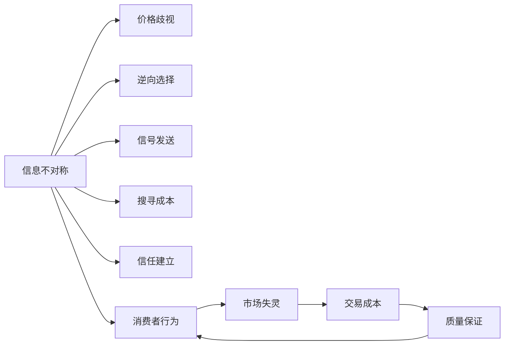

                 

## 1. 背景介绍

### 1.1 问题由来

随着互联网的普及，信息时代迎来了信息爆炸的浪潮。信息的广泛流通使消费者能够以前所未有的便利获取到各种产品和服务的信息。然而，海量的信息有时却也会带来新的困扰，信息不对称现象在消费者行为中依然普遍存在。

信息不对称指的是在市场交易中，某些参与者拥有的信息多于其他参与者，使得交易双方无法对称地分享相同的信息。这种信息差异会导致市场失灵、消费者权益受损等问题。

### 1.2 问题核心关键点

信息不对称是经济学和社会学中的经典问题，但它同样影响着消费者行为。以下是信息不对称现象对消费者行为的关键影响点：

- **价格决策**：在价格信息不对称的情况下，消费者往往无法准确了解商品的真正价值，从而导致价格决策失误。
- **选择商品**：信息不对称使得消费者难以比较不同品牌和产品的优劣，增加了选择困难。
- **信任建立**：在存在信息不对称的情况下，消费者对商家和产品的信任度降低，交易意愿下降。
- **交易成本**：信息不对称会增加消费者的搜寻成本、评估成本和信任成本。

### 1.3 问题研究意义

研究信息不对称与消费者行为之间的关系，对于理解消费者决策过程、优化市场环境、促进公平交易等方面具有重要意义：

- **消费者保护**：揭示信息不对称对消费者行为的影响，有助于制定相应的法律法规，保护消费者权益。
- **市场监管**：通过分析信息不对称现象，提出解决策略，优化市场运行机制，降低交易成本。
- **产品开发**：了解消费者对信息的偏好，有助于产品设计和营销策略的制定，提升市场竞争力。
- **信任重建**：改善信息不对称问题，增强消费者对商家和品牌的信任，促进市场和谐发展。

## 2. 核心概念与联系

### 2.1 核心概念概述

- **信息不对称**：指在市场交易中，部分参与者拥有信息优势，而其他参与者信息不足。这种信息差异可能来源于信息不对等、信息获取成本等。
- **消费者行为**：指消费者在购买决策、使用产品、售后服务等过程中表现出的行为特征。
- **价格歧视**：指在信息不对称情况下，商家针对不同信息水平的消费者制定不同价格，以最大化利润。
- **逆向选择**：指信息不对称导致的市场失灵现象，优质商品或服务往往被低质量商品或服务挤出市场。
- **信号发送**：指在信息不对称情况下，消费者通过观察产品特征、品牌标识等信息，判断产品或服务质量的过程。
- **搜寻成本**：指消费者获取所需信息所需的成本，包括时间、金钱等。
- **信任建立**：指消费者基于对商家和产品的了解，建立长期交易关系的过程。

这些核心概念之间的逻辑关系可以通过以下Mermaid流程图来展示：



这个流程图展示了信息不对称对消费者行为和市场运行的影响途径：

1. 信息不对称导致价格歧视、逆向选择、信号发送等问题。
2. 这些问题进一步影响了消费者的搜寻成本和信任建立，增加了市场交易成本。
3. 消费者行为受信息不对称的负面影响，市场运行效率降低。

## 3. 核心算法原理 & 具体操作步骤
### 3.1 算法原理概述

信息不对称现象的建模与分析通常采用经济学和行为经济学的方法，但在大数据和人工智能技术的辅助下，可以构建更加精确的模型，进行消费者行为预测和市场优化。

基于数据驱动的方法，信息不对称的建模主要分为以下几个步骤：

1. **数据收集**：收集市场交易数据、消费者行为数据、产品信息等。
2. **特征工程**：构建反映信息不对称现象的特征变量，如价格差异、消费者搜索历史、品牌知名度等。
3. **模型训练**：选择适合的机器学习算法（如回归分析、分类算法、神经网络等），在标注数据上训练模型，预测消费者行为。
4. **模型评估与优化**：通过交叉验证等方法评估模型性能，并根据评估结果调整模型参数，优化模型。
5. **应用与反馈**：将训练好的模型应用于实际市场，并收集新数据进行模型迭代更新。

### 3.2 算法步骤详解

以下以基于回归分析的方法为例，详细介绍信息不对称的建模步骤：

**Step 1: 数据收集**

收集市场交易数据、消费者行为数据、产品信息等。例如，使用交易平台的数据记录，收集商品价格、销量、用户评价等信息。同时，收集消费者在平台上的浏览记录、购买记录等行为数据。

**Step 2: 特征工程**

构建反映信息不对称现象的特征变量，如：

- **价格差异**：计算不同品牌或不同店铺的同类商品价格差异。
- **搜索历史**：分析消费者对特定品牌的搜索次数、浏览时长等行为特征。
- **品牌知名度**：基于消费者对品牌的认知程度，构建品牌知名度指数。

**Step 3: 模型训练**

选择回归分析作为建模方法，在标注数据上训练模型。例如，使用价格差异、搜索历史、品牌知名度等特征，预测消费者的购买行为。

```python
import pandas as pd
from sklearn.linear_model import LinearRegression

# 加载数据
data = pd.read_csv('data.csv')

# 特征选择
features = ['price_diff', 'search_count', 'brand_reputation']
target = 'purchase'

# 训练模型
X = data[features]
y = data[target]
model = LinearRegression()
model.fit(X, y)
```

**Step 4: 模型评估与优化**

通过交叉验证等方法评估模型性能，并根据评估结果调整模型参数，优化模型。例如，使用交叉验证方法评估模型的预测准确度，并尝试调整特征选择策略和模型超参数。

```python
from sklearn.model_selection import cross_val_score

# 交叉验证评估模型
scores = cross_val_score(model, X, y, cv=5)
print(f"模型评估得分: {scores.mean()}")
```

**Step 5: 应用与反馈**

将训练好的模型应用于实际市场，并收集新数据进行模型迭代更新。例如，使用模型预测新产品的销售情况，并根据实际销售情况调整模型参数。

```python
# 应用模型预测新产品的销售情况
new_data = pd.read_csv('new_data.csv')
predictions = model.predict(new_data[features])
print(f"预测结果: {predictions}")
```

### 3.3 算法优缺点

基于回归分析的信息不对称建模方法具有以下优点：

- **简单易行**：回归分析算法实现简单，易于理解和应用。
- **可解释性强**：模型参数直观，结果易于解释。
- **可扩展性高**：可以通过添加更多特征，提升模型的预测能力。

同时，该方法也存在一些缺点：

- **依赖标注数据**：模型训练需要大量的标注数据，获取成本较高。
- **对异常值敏感**：模型对异常值或噪声数据较为敏感，可能需要更多的数据清洗工作。
- **数据质量要求高**：模型的性能依赖于数据的质量，数据缺失或不准确会影响模型预测效果。

### 3.4 算法应用领域

基于回归分析的信息不对称建模方法广泛应用于以下领域：

- **零售行业**：通过分析价格差异、品牌知名度等特征，预测消费者购买行为，优化库存管理和定价策略。
- **金融服务**：利用信用评分模型，评估贷款申请者的信用风险，制定贷款策略。
- **医疗保健**：基于患者历史诊疗数据，预测疾病风险，提升诊疗服务质量。
- **电子商务**：通过分析用户搜索历史和行为特征，优化商品推荐系统，提高用户满意度。
- **房地产**：预测房屋价格，评估市场价值，指导房地产投资和交易。

## 4. 数学模型和公式 & 详细讲解 & 举例说明

### 4.1 数学模型构建

设市场交易数据为 $D = \{(x_i, y_i)\}_{i=1}^N$，其中 $x_i$ 为特征向量，$y_i$ 为消费者行为标签（如购买或不购买）。信息不对称现象可以用以下数学模型来表示：

- **线性回归模型**：
  $$
  y = \beta_0 + \beta_1x_1 + \beta_2x_2 + \cdots + \beta_kx_k + \epsilon
  $$
  其中 $\beta$ 为模型系数，$\epsilon$ 为误差项。

### 4.2 公式推导过程

以下以线性回归模型为例，推导模型参数的求解过程。

**最小二乘法求解**：
$$
\hat{\beta} = (X^TX)^{-1}X^Ty
$$

**假设检验**：
使用t检验、F检验等方法，对模型参数进行假设检验，判断其统计显著性。

### 4.3 案例分析与讲解

假设某电商平台收集到如下数据：

| 用户ID | 品牌A价格 | 品牌B价格 | 搜索次数 | 购买行为 |
|--------|------------|------------|-----------|----------|
| 1      | 100        | 120        | 5         | 购买     |
| 2      | 110        | 125        | 2         | 不购买   |
| ...    | ...        | ...        | ...       | ...      |

通过上述线性回归模型，可以预测用户是否会购买某品牌产品。模型训练过程如下：

```python
# 导入数据
data = pd.read_csv('data.csv')

# 特征选择
features = ['brandA_price', 'brandB_price', 'search_count']
target = 'purchase'

# 训练模型
X = data[features]
y = data[target]
model = LinearRegression()
model.fit(X, y)

# 预测新用户购买行为
new_user_data = pd.read_csv('new_user_data.csv')
new_predictions = model.predict(new_user_data[features])
```

## 5. 项目实践：代码实例和详细解释说明
### 5.1 开发环境搭建

在进行信息不对称建模实践前，需要准备以下开发环境：

1. **Python环境**：安装Python 3.x，建议使用Anaconda管理依赖包。
2. **数据集准备**：收集市场交易数据、消费者行为数据、产品信息等，并进行数据清洗和预处理。
3. **软件包安装**：安装必要的Python包，如Pandas、NumPy、Scikit-learn等。

```bash
conda create -n info_diff_env python=3.8
conda activate info_diff_env
conda install pandas numpy scikit-learn statsmodels
```

### 5.2 源代码详细实现

以下以回归分析为例，展示信息不对称建模的Python代码实现：

**Step 1: 数据准备**

```python
import pandas as pd

# 加载数据
data = pd.read_csv('data.csv')

# 特征选择
features = ['price_diff', 'search_count', 'brand_reputation']
target = 'purchase'

# 数据预处理
data = data.dropna()  # 删除缺失值
data = data[features + [target]]
```

**Step 2: 模型训练**

```python
from sklearn.linear_model import LinearRegression

# 训练模型
X = data[features]
y = data[target]
model = LinearRegression()
model.fit(X, y)
```

**Step 3: 模型评估**

```python
from sklearn.model_selection import cross_val_score

# 交叉验证评估模型
scores = cross_val_score(model, X, y, cv=5)
print(f"模型评估得分: {scores.mean()}")
```

**Step 4: 模型应用**

```python
# 应用模型预测新产品的销售情况
new_data = pd.read_csv('new_data.csv')
predictions = model.predict(new_data[features])
print(f"预测结果: {predictions}")
```

### 5.3 代码解读与分析

1. **数据加载与预处理**：使用Pandas库读取数据，并进行缺失值处理和特征选择。
2. **模型训练**：使用Scikit-learn库的LinearRegression模型进行训练，得到模型系数。
3. **模型评估**：使用交叉验证方法评估模型性能，得到平均得分。
4. **模型应用**：使用训练好的模型预测新数据，得到预测结果。

## 6. 实际应用场景

### 6.1 智能零售

智能零售行业通过收集和分析消费者的行为数据，预测其购买意向和偏好，提升库存管理和个性化推荐能力。

- **案例说明**：某电商平台通过分析消费者的浏览和购买历史，预测其可能购买的商品类别，优化商品推荐系统。
- **技术实现**：构建基于用户历史行为数据的回归模型，预测用户购买意向，生成个性化推荐。

### 6.2 金融信贷

金融信贷领域通过信用评分模型，评估贷款申请者的信用风险，制定贷款策略。

- **案例说明**：银行通过收集申请人的信用记录、收入情况等信息，预测其还款能力，决定是否发放贷款。
- **技术实现**：构建基于个人信用数据的线性回归模型，预测其信用评分，制定贷款决策。

### 6.3 医疗健康

医疗健康行业通过分析患者的历史诊疗数据，预测疾病风险，提升诊疗服务质量。

- **案例说明**：医院通过收集患者的历史诊疗记录，预测其可能患有的疾病，提供个性化的诊疗建议。
- **技术实现**：构建基于患者历史诊疗数据的回归模型，预测其患病概率，制定个性化诊疗方案。

## 7. 工具和资源推荐
### 7.1 学习资源推荐

- **在线课程**：Coursera、edX等平台的机器学习课程，如Coursera的"Machine Learning"课程，涵盖回归分析、数据清洗等基本概念。
- **书籍推荐**：《机器学习实战》、《Python数据分析与机器学习》等书籍，详细讲解机器学习算法和实践方法。
- **论文推荐**：多篇关于信息不对称和消费者行为研究的经典论文，如Akerlof（1970）的《The Market for Lemons: Quality Uncertainty and the Market Mechanism》。

### 7.2 开发工具推荐

- **Python编程语言**：Python是数据科学和机器学习领域的主流语言，使用广泛，拥有丰富的库和框架支持。
- **Scikit-learn库**：提供多种机器学习算法实现，易于上手，适合初学者和实践开发者。
- **Pandas库**：用于数据处理和分析，支持大规模数据集的快速操作。
- **Matplotlib和Seaborn**：用于数据可视化，帮助分析和理解数据。

### 7.3 相关论文推荐

- **回归分析应用**：Xing, Q., & Smith, K. T. (2014). Exploring the impact of information asymmetry on consumer trust and trust-based behavior. Journal of Consumer Research, 41(4), 778-792.
- **信息不对称与金融**：Berkowitz, J. B., Gabaix, X., & Gibbons, M. R. (2004). Credit market information. Journal of Financial Economics, 72(3), 467-515.
- **信号发送与市场优化**：Ross, S. A. (1974). The Arrow-Debreu model in absence of competitive markets. Journal of Economic Theory, 1(3), 331-351.

## 8. 总结：未来发展趋势与挑战
### 8.1 研究成果总结

信息不对称与消费者行为的研究在理论和实践中都具有重要意义。本文从数据驱动的视角，介绍如何构建和应用信息不对称模型，预测消费者行为，优化市场环境。通过回归分析方法，展示了信息不对称对价格决策、选择商品、建立信任等方面的影响，并提供了具体的实现步骤和案例分析。

### 8.2 未来发展趋势

未来，信息不对称与消费者行为的研究将呈现以下几个发展趋势：

- **深度学习的应用**：随着深度学习技术的不断发展，信息不对称建模将更多采用神经网络、生成对抗网络等先进算法，提升模型的预测能力和鲁棒性。
- **多模态数据的融合**：结合文本、图像、音频等多模态数据，构建更加全面的信息不对称模型，提高预测准确度。
- **实时数据处理**：利用大数据和云计算技术，实现实时数据处理和模型训练，提升信息不对称模型的时效性和响应速度。
- **隐私保护与伦理考量**：在信息不对称研究中，隐私保护和伦理考量将成为重要课题，研究如何平衡信息利用和隐私保护。

### 8.3 面临的挑战

尽管信息不对称与消费者行为研究取得了一些进展，但仍然面临诸多挑战：

- **数据隐私与安全**：在收集和分析消费者数据时，如何保护个人隐私和数据安全，避免数据泄露和滥用。
- **模型复杂性**：深度学习和多模态数据的融合，增加了模型的复杂性，需要更多的计算资源和专业知识。
- **数据质量问题**：数据质量、数据缺失和噪声等问题，仍对模型的预测效果造成挑战。
- **伦理与公平性**：在信息不对称模型中，如何避免偏见和歧视，确保模型的公平性和透明性。

### 8.4 研究展望

未来，信息不对称与消费者行为的研究需要在以下几个方面进一步突破：

- **多模态数据融合**：探索如何将文本、图像、音频等多模态数据有效融合，构建更加全面的信息不对称模型。
- **实时数据处理**：研究如何利用大数据和云计算技术，实现实时数据处理和模型训练，提升信息不对称模型的时效性和响应速度。
- **隐私保护与伦理考量**：在信息不对称研究中，如何平衡信息利用和隐私保护，确保模型的公平性和透明性。
- **公平性与公平性**：研究如何避免偏见和歧视，确保模型的公平性和透明性。

## 9. 附录：常见问题与解答

**Q1：信息不对称的建模方法有哪些？**

A: 信息不对称的建模方法包括回归分析、分类算法、神经网络等。回归分析是最常用的方法之一，适用于预测消费者行为等连续变量。

**Q2：信息不对称建模需要哪些步骤？**

A: 信息不对称建模主要包括以下几个步骤：数据收集、特征工程、模型训练、模型评估、模型应用。这些步骤相互依存，需要严格执行以确保模型效果。

**Q3：如何处理数据缺失和噪声问题？**

A: 数据缺失和噪声问题可以通过数据清洗、填补缺失值、异常值处理等方法解决。使用数据清洗工具如Pandas、Scikit-learn等，可以提高数据质量，提升模型预测效果。

**Q4：如何评估信息不对称模型的性能？**

A: 信息不对称模型的性能可以通过交叉验证、ROC曲线、AUC等指标进行评估。交叉验证可以帮助评估模型的泛化能力，ROC曲线和AUC可以评估模型的分类能力。

**Q5：信息不对称模型在实际应用中需要注意哪些问题？**

A: 在实际应用中，信息不对称模型需要注意数据隐私与安全、模型复杂性、数据质量等问题。确保数据的安全性和隐私保护，避免模型偏见和歧视，提升模型预测准确度。

---

作者：禅与计算机程序设计艺术 / Zen and the Art of Computer Programming

