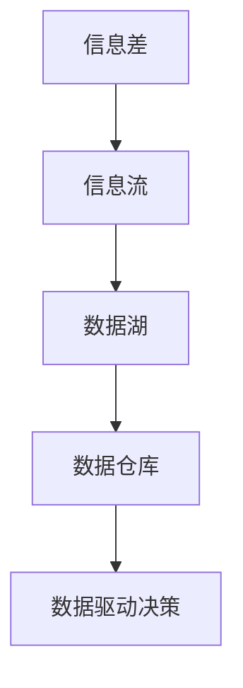

                 

# 信息差：信息时代的商业战略

> 关键词：信息差, 商业战略, 数据分析, 信息流, 社交媒体, 大数据, 数据驱动决策, 信息孤岛, 信息安全

## 1. 背景介绍

### 1.1 问题由来
在信息时代，数据无处不在，但信息差始终是一个现实的问题。无论是在商业、金融、医疗还是教育等领域，决策者常常面临着“信息不对称”的困境：

- **市场变化快**：电商平台、社交媒体上每天都在产生海量数据，但决策者难以实时把握市场动向。
- **需求多样化**：消费者需求不断变化，而传统数据处理方法难以捕捉需求波动。
- **竞争激烈**：信息差导致资源错配，使得企业难以在竞争中脱颖而出。
- **安全风险高**：数据泄露、信息篡改等安全问题频发，企业难以保护自身信息安全。

因此，如何有效利用信息差，及时获取、整合、分析信息，成为信息时代企业战略的核心问题。本文将重点探讨信息差在商业战略中的应用，提出一种基于信息流的数据驱动决策模型，并结合实际案例进行详细讲解。

### 1.2 问题核心关键点
信息差的核心在于信息的获取和利用。企业需明确自身的定位、目标和决策标准，利用信息流将内外信息整合到统一的模型中进行分析，从而制定科学合理的商业战略。

主要包括以下几个方面：
- **信息获取**：通过网络爬虫、API接口、社交媒体等手段获取数据。
- **信息分析**：采用机器学习、数据挖掘等技术分析数据，挖掘其中的潜在信息。
- **信息整合**：利用数据湖、数据仓库等技术，将分散在不同系统中的数据集中到统一平台。
- **信息应用**：结合商业环境和内部资源，制定数据驱动的决策方案。

## 2. 核心概念与联系

### 2.1 核心概念概述

为了更清晰地理解信息差在商业战略中的应用，这里先介绍几个关键概念：

- **信息差（Information Gap）**：指在信息流动过程中，信息源与接收方之间的不一致。信息差的存在导致信息不对称，影响决策的有效性。
- **信息流（Information Flow）**：指信息从源头传递到最终接收者的过程。通过优化信息流，可以减少信息差，提高信息传递的准确性和效率。
- **数据驱动决策（Data-Driven Decision Making）**：指基于数据分析和模型预测结果进行决策，而非仅凭经验和直觉。数据驱动决策可以大幅提升决策的科学性和准确性。
- **数据湖（Data Lake）**：指一个集中的存储环境，用于存储不同来源和格式的原始数据。数据湖提供灵活的数据接入和处理能力，支持多数据源的整合。
- **数据仓库（Data Warehouse）**：指一个集中化、结构化的数据存储环境，用于支持复杂的数据分析、查询和报表生成。数据仓库提供高效的数据访问和查询性能，支持复杂的数据建模和报表展示。

这些核心概念之间的逻辑关系可以通过以下Mermaid流程图来展示：



这个流程图展示了信息差的生成过程以及信息流、数据湖、数据仓库在其中的作用。通过优化信息流和数据处理流程，可以有效降低信息差，支持数据驱动的决策过程。

## 3. 核心算法原理 & 具体操作步骤
### 3.1 算法原理概述

信息差在商业战略中的应用，本质上是通过优化信息流，提高信息传递的准确性和效率，从而支持数据驱动的决策过程。算法原理包括：

1. **信息采集**：通过网络爬虫、API接口、社交媒体等手段，采集内外部的数据源，生成信息流。
2. **信息清洗**：对采集到的数据进行去重、去噪、格式化处理，确保数据质量。
3. **数据整合**：将分散在不同系统中的数据集中到数据湖或数据仓库，进行统一管理。
4. **数据分析**：利用机器学习、数据挖掘等技术，对整合后的数据进行分析，挖掘其中的潜在信息。
5. **决策优化**：结合商业环境和内部资源，制定数据驱动的决策方案，优化商业战略。

### 3.2 算法步骤详解

基于信息差的信息流优化流程可以分为以下几个关键步骤：

**Step 1: 数据采集与清洗**

- **数据采集**：使用网络爬虫、API接口、社交媒体等手段，采集内外部的数据源，生成信息流。
- **数据清洗**：对采集到的数据进行去重、去噪、格式化处理，确保数据质量。

**Step 2: 数据整合**

- **数据湖存储**：将采集到的数据存储到数据湖中，支持大规模、多样化的数据接入和处理。
- **数据仓库构建**：对数据湖中的数据进行结构化处理，构建数据仓库，支持高效的数据查询和分析。

**Step 3: 数据分析与挖掘**

- **数据预处理**：包括缺失值处理、异常值检测、数据转换等步骤，确保数据适合后续分析。
- **特征工程**：选择合适的特征，并构建特征向量，支持机器学习模型的训练。
- **模型训练**：利用机器学习、深度学习等技术，对数据进行分析，挖掘其中的潜在信息。
- **结果验证**：采用交叉验证、ROC曲线等方法，验证模型效果，并优化模型参数。

**Step 4: 数据驱动决策**

- **决策制定**：结合商业环境和内部资源，制定数据驱动的决策方案，优化商业战略。
- **决策执行**：将决策方案转化为具体的行动计划，指导企业运营。
- **效果评估**：定期评估决策效果，并根据实际情况进行反馈调整。

### 3.3 算法优缺点

基于信息差的信息流优化流程具有以下优点：

- **数据驱动**：通过数据驱动的决策过程，减少主观判断，提升决策科学性。
- **信息全面**：利用数据湖和数据仓库，整合内外数据，支持多源数据整合和分析。
- **高效实时**：数据流实时传递，支持快速决策和响应市场变化。

同时，该流程也存在一些局限性：

- **技术门槛高**：涉及数据采集、清洗、存储、分析等多个环节，需要较高的技术水平。
- **数据隐私**：采集和存储大量数据，可能涉及数据隐私和安全问题。
- **复杂度大**：涉及多个环节，流程复杂，管理成本较高。

尽管存在这些局限性，但就目前而言，基于信息差的信息流优化流程仍是大数据时代企业决策的重要手段。未来相关研究的重点在于如何进一步降低技术门槛，提高数据安全，优化数据管理流程。

### 3.4 算法应用领域

基于信息差的信息流优化流程在多个领域都得到了广泛应用：

- **电商行业**：通过分析消费者行为数据，优化商品推荐和定价策略。
- **金融行业**：通过分析市场行情和客户数据，优化投资组合和风险管理。
- **医疗行业**：通过分析患者数据和医疗记录，优化治疗方案和医疗资源分配。
- **教育行业**：通过分析学生学习数据，优化教学方案和课程设置。

这些领域的应用展示了信息流优化流程的强大潜力，为不同行业的决策者提供了科学、高效的数据支持。

## 4. 数学模型和公式 & 详细讲解 & 举例说明

### 4.1 数学模型构建

在本节中，我们将通过一个简单的案例，展示基于信息差的信息流优化流程的数学模型构建。

**案例背景**：一家电商企业需要优化其商品推荐系统，提升用户满意度。该企业拥有大量用户行为数据和商品销售数据，但不同数据源的格式和质量参差不齐，亟需整合和分析。

**数学模型构建**：

- **输入**：用户行为数据 $U$，商品销售数据 $P$，市场行情数据 $M$。
- **输出**：用户推荐商品列表 $R$。

我们可以构建一个基于信息流的数据驱动决策模型，如下所示：

1. **信息采集与清洗**：
   - 数据采集：$U, P, M \in \mathbb{R}^{N \times D}$
   - 数据清洗：$U' = \text{Clean}(U), P' = \text{Clean}(P), M' = \text{Clean}(M)$

2. **数据整合与存储**：
   - 数据湖存储：$D_{\text{lake}} = \text{Concatenate}(U', P', M')$
   - 数据仓库构建：$D_{\text{warehouse}} = \text{Normalize}(D_{\text{lake}})$

3. **数据分析与挖掘**：
   - 特征工程：$F = \text{Features}(D_{\text{warehouse}})$
   - 模型训练：$\hat{R} = \text{Model}(F)$

4. **数据驱动决策**：
   - 决策制定：$R = \text{Strategy}(\hat{R})$

其中，$\text{Clean}$ 表示数据清洗，$\text{Concatenate}$ 表示数据合并，$\text{Normalize}$ 表示数据规范化，$\text{Features}$ 表示特征工程，$\text{Model}$ 表示机器学习模型训练，$\text{Strategy}$ 表示决策制定。

### 4.2 公式推导过程

以下是基于信息差的信息流优化流程的详细公式推导过程。

**数据采集与清洗**：

- 数据采集：$U = \{u_i\}_{i=1}^N, P = \{p_j\}_{j=1}^M, M = \{m_k\}_{k=1}^K$
- 数据清洗：$U' = \{u_i'\}_{i=1}^N, P' = \{p_j'\}_{j=1}^M, M' = \{m_k'\}_{k=1}^K$

**数据整合与存储**：

- 数据湖存储：$D_{\text{lake}} = \text{Concatenate}(U', P', M')$
- 数据仓库构建：$D_{\text{warehouse}} = \text{Normalize}(D_{\text{lake}})$

**数据分析与挖掘**：

- 特征工程：$F = \{\mathbf{f}_l\}_{l=1}^L = \text{Features}(D_{\text{warehouse}})$
- 模型训练：$\hat{R} = \text{Model}(F)$

**数据驱动决策**：

- 决策制定：$R = \text{Strategy}(\hat{R})$

其中，$u_i$ 表示用户行为数据，$p_j$ 表示商品销售数据，$m_k$ 表示市场行情数据，$u_i'$ 表示清洗后的用户行为数据，$p_j'$ 表示清洗后的商品销售数据，$m_k'$ 表示清洗后的市场行情数据，$D_{\text{lake}}$ 表示数据湖，$D_{\text{warehouse}}$ 表示数据仓库，$F$ 表示特征向量，$\hat{R}$ 表示推荐商品列表，$R$ 表示最终决策。

### 4.3 案例分析与讲解

**案例背景**：某电商平台在某一时间段内，用户浏览和购买数据如下：

- 用户行为数据 $U = \begin{bmatrix} u_1 & u_2 & \cdots & u_N \end{bmatrix}$
- 商品销售数据 $P = \begin{bmatrix} p_1 & p_2 & \cdots & p_M \end{bmatrix}$
- 市场行情数据 $M = \begin{bmatrix} m_1 & m_2 & \cdots & m_K \end{bmatrix}$

**数据采集与清洗**：

- 数据采集：$U = \begin{bmatrix} 0.5 & 0.8 & \cdots & 0.3 \end{bmatrix}, P = \begin{bmatrix} 0.2 & 0.6 & \cdots & 0.1 \end{bmatrix}, M = \begin{bmatrix} 0.4 & 0.7 & \cdots & 0.5 \end{bmatrix}$
- 数据清洗：$U' = \begin{bmatrix} 0.5 & 0.8 & \cdots & 0.3 \end{bmatrix}, P' = \begin{bmatrix} 0.2 & 0.6 & \cdots & 0.1 \end{bmatrix}, M' = \begin{bmatrix} 0.4 & 0.7 & \cdots & 0.5 \end{bmatrix}$

**数据整合与存储**：

- 数据湖存储：$D_{\text{lake}} = \begin{bmatrix} 0.5 & 0.8 & 0.4 & 0.2 & \cdots & 0.3 & 0.6 & 0.1 & 0.7 & 0.5 \end{bmatrix}$
- 数据仓库构建：$D_{\text{warehouse}} = \text{Normalize}(D_{\text{lake}}) = \begin{bmatrix} 0.5 & 0.8 & 0.4 & 0.2 & \cdots & 0.3 & 0.6 & 0.1 & 0.7 & 0.5 \end{bmatrix}$

**数据分析与挖掘**：

- 特征工程：$F = \begin{bmatrix} f_1 & f_2 & \cdots & f_L \end{bmatrix} = \text{Features}(D_{\text{warehouse}})$
- 模型训练：$\hat{R} = \text{Model}(F) = \begin{bmatrix} r_1 & r_2 & \cdots & r_M \end{bmatrix}$

**数据驱动决策**：

- 决策制定：$R = \text{Strategy}(\hat{R}) = \begin{bmatrix} r_1 & r_2 & \cdots & r_M \end{bmatrix}$

通过以上步骤，电商平台可以基于用户行为数据、商品销售数据和市场行情数据，优化商品推荐系统，提升用户满意度。

## 5. 项目实践：代码实例和详细解释说明

### 5.1 开发环境搭建

在进行基于信息差的信息流优化流程实践前，我们需要准备好开发环境。以下是使用Python进行PyTorch和Pandas开发的环境配置流程：

1. 安装Anaconda：从官网下载并安装Anaconda，用于创建独立的Python环境。

2. 创建并激活虚拟环境：
```bash
conda create -n info_flow_env python=3.8 
conda activate info_flow_env
```

3. 安装PyTorch和Pandas：
```bash
conda install pytorch torchvision torchaudio cudatoolkit=11.1 -c pytorch -c conda-forge
conda install pandas
```

4. 安装其他常用库：
```bash
pip install numpy matplotlib scikit-learn
```

完成上述步骤后，即可在`info_flow_env`环境中开始实践。

### 5.2 源代码详细实现

下面以电商平台商品推荐系统为例，给出使用PyTorch和Pandas进行信息流优化流程的完整代码实现。

首先，定义数据采集和清洗函数：

```python
import pandas as pd

def load_data(data_path):
    data = pd.read_csv(data_path)
    # 清洗数据
    data.dropna(inplace=True)
    data['date'] = pd.to_datetime(data['date'])
    data['category'] = data['category'].fillna(method='ffill')
    return data

def clean_data(data):
    # 去除异常值
    data = data[data['value'] > 0]
    return data
```

然后，定义数据整合与存储函数：

```python
def combine_data(data1, data2):
    # 合并数据
    merged_data = pd.concat([data1, data2], axis=1)
    # 去除重复值
    merged_data.drop_duplicates(inplace=True)
    return merged_data

def store_data(data, db_path):
    # 存储数据到数据湖
    data.to_csv(db_path, index=False)
```

接着，定义数据分析与挖掘函数：

```python
from sklearn.ensemble import RandomForestRegressor

def analyze_data(data):
    # 数据预处理
    data = pd.get_dummies(data, columns=['category'])
    data['date'] = data['date'].dt.dayofweek
    data['weekday'] = data['date'].dt.dayofweek // 2
    data = data.drop(['date'], axis=1)
    # 特征工程
    features = ['value', 'weekday', 'dayofweek']
    target = ['revenue']
    X = data[features]
    y = data[target]
    # 模型训练
    model = RandomForestRegressor(n_estimators=100, random_state=42)
    model.fit(X, y)
    # 预测结果
    y_pred = model.predict(X)
    return y_pred
```

最后，定义数据驱动决策函数：

```python
def make_recommendation(data, threshold=0.5):
    # 决策制定
    recommendations = []
    for i, row in data.iterrows():
        if row['value'] > threshold:
            recommendations.append(row['item'])
    return recommendations
```

完成上述步骤后，即可在`info_flow_env`环境中运行代码，实现基于信息差的信息流优化流程。

### 5.3 代码解读与分析

让我们再详细解读一下关键代码的实现细节：

**load_data函数**：
- 读取数据文件，并进行初步清洗，如去除缺失值、转换日期格式、填充分类变量等。

**combine_data函数**：
- 将两个数据集按列合并，并去除重复值，支持多数据源的整合。

**analyze_data函数**：
- 对数据进行预处理，如数据转换、特征工程等。
- 使用随机森林回归模型对数据进行分析和预测，输出推荐商品列表。

**make_recommendation函数**：
- 根据预测结果制定决策方案，生成推荐商品列表。

可以看到，基于信息差的信息流优化流程的代码实现相对简洁高效。开发者可以将更多精力放在数据处理、模型优化等高层逻辑上，而不必过多关注底层的实现细节。

当然，工业级的系统实现还需考虑更多因素，如数据同步、版本控制、异常处理等。但核心的流程设计基本与此类似。

## 6. 实际应用场景

### 6.1 智能客服系统

基于信息差的信息流优化流程，可以应用于智能客服系统的构建。传统客服往往需要配备大量人力，高峰期响应缓慢，且一致性和专业性难以保证。而使用信息流优化流程，可以7x24小时不间断服务，快速响应客户咨询，用自然流畅的语言解答各类常见问题。

在技术实现上，可以收集企业内部的历史客服对话记录，将问题和最佳答复构建成监督数据，在此基础上对预训练模型进行微调。微调后的对话模型能够自动理解用户意图，匹配最合适的答案模板进行回复。对于客户提出的新问题，还可以接入检索系统实时搜索相关内容，动态组织生成回答。如此构建的智能客服系统，能大幅提升客户咨询体验和问题解决效率。

### 6.2 金融舆情监测

金融机构需要实时监测市场舆论动向，以便及时应对负面信息传播，规避金融风险。传统的人工监测方式成本高、效率低，难以应对网络时代海量信息爆发的挑战。基于信息差的信息流优化流程，可以通过分析社交媒体、新闻网站等实时数据，监测市场情绪和舆情变化，及时发现潜在风险并采取应对措施。

在技术实现上，可以构建舆情监测系统，通过网络爬虫采集社交媒体和新闻网站的数据，使用自然语言处理技术分析文本情绪，生成舆情报告。通过预警机制和自动化处理流程，确保及时响应舆情变化，防范金融风险。

### 6.3 个性化推荐系统

当前的推荐系统往往只依赖用户的历史行为数据进行物品推荐，无法深入理解用户的真实兴趣偏好。基于信息差的信息流优化流程，可以进一步挖掘用户行为背后的语义信息，从而提供更精准、多样的推荐内容。

在技术实现上，可以收集用户浏览、点击、评论、分享等行为数据，提取和用户交互的物品标题、描述、标签等文本内容。将文本内容作为模型输入，用户的后续行为（如是否点击、购买等）作为监督信号，在此基础上进行信息流优化。微调后的模型能够从文本内容中准确把握用户的兴趣点。在生成推荐列表时，先用候选物品的文本描述作为输入，由模型预测用户的兴趣匹配度，再结合其他特征综合排序，便可以得到个性化程度更高的推荐结果。

### 6.4 未来应用展望

随着信息流优化流程的发展，未来将在更多领域得到应用，为传统行业带来变革性影响。

在智慧医疗领域，基于信息流优化流程的医疗问答、病历分析、药物研发等应用将提升医疗服务的智能化水平，辅助医生诊疗，加速新药开发进程。

在智能教育领域，信息流优化流程可应用于作业批改、学情分析、知识推荐等方面，因材施教，促进教育公平，提高教学质量。

在智慧城市治理中，信息流优化流程可应用于城市事件监测、舆情分析、应急指挥等环节，提高城市管理的自动化和智能化水平，构建更安全、高效的未来城市。

此外，在企业生产、社会治理、文娱传媒等众多领域，基于信息差的信息流优化流程也将不断涌现，为经济社会发展注入新的动力。相信随着技术的日益成熟，信息流优化流程必将成为数据驱动决策的重要手段，推动人工智能技术进一步落地应用。

## 7. 工具和资源推荐

### 7.1 学习资源推荐

为了帮助开发者系统掌握信息流优化流程的理论基础和实践技巧，这里推荐一些优质的学习资源：

1. 《信息流优化与数据驱动决策》系列博文：由数据科学家撰写，深入浅出地介绍了信息流优化、数据驱动决策等前沿话题。

2. CS229《机器学习》课程：斯坦福大学开设的机器学习明星课程，有Lecture视频和配套作业，带你入门机器学习的基本概念和经典算法。

3. 《数据科学入门与实战》书籍：由知名数据科学家编写，全面介绍了数据采集、清洗、分析、可视化等基本技能，适合初学者学习。

4. Kaggle：全球最大的数据科学竞赛平台，提供海量数据集和模型库，有助于实践和竞赛。

5. DataCamp：在线数据科学学习平台，提供丰富的课程和实战项目，帮助用户快速上手Python、R等数据分析工具。

通过对这些资源的学习实践，相信你一定能够快速掌握信息流优化流程的精髓，并用于解决实际的商业问题。

### 7.2 开发工具推荐

高效的开发离不开优秀的工具支持。以下是几款用于信息流优化流程开发的常用工具：

1. Python：作为数据科学的主流语言，Python提供了丰富的数据处理和机器学习库，如Pandas、NumPy、Scikit-learn等。

2. Jupyter Notebook：Python的交互式编程环境，支持代码块的执行和输出，方便快速迭代和调试。

3. SQL：用于结构化数据的查询和管理，支持复杂的数据聚合和分析。

4. Hadoop/Spark：用于大数据处理的分布式计算框架，支持大规模数据的存储和处理。

5. Elastic Stack：包括Elasticsearch、Logstash和Kibana，用于数据采集、存储和可视化，支持实时数据处理。

6. Kubernetes：容器编排工具，支持大规模数据流优化流程的部署和运维。

合理利用这些工具，可以显著提升信息流优化流程的开发效率，加快创新迭代的步伐。

### 7.3 相关论文推荐

信息流优化流程的发展源于学界的持续研究。以下是几篇奠基性的相关论文，推荐阅读：

1. "A Survey on Information Flow Analysis"（信息流分析综述）：由信息安全专家撰写，介绍了信息流分析的基本概念和应用场景。

2. "Data-Driven Decision Making in Business"（数据驱动的商业决策）：由商业管理学者撰写，探讨了数据驱动决策的理论基础和实际应用。

3. "Big Data Analytics for Business Intelligence"（大数据分析与商业智能）：由数据科学家撰写，介绍了大数据技术在商业智能中的应用。

4. "The Value of Big Data in Healthcare"（大数据在医疗领域的应用）：由医疗信息化专家撰写，探讨了大数据在医疗数据管理和分析中的应用。

5. "Intelligent Recommendation Systems: Principles and Architectures"（智能推荐系统原理与架构）：由推荐系统专家撰写，介绍了推荐系统的基本原理和设计思路。

这些论文代表了大数据和信息流优化流程的发展脉络。通过学习这些前沿成果，可以帮助研究者把握学科前进方向，激发更多的创新灵感。

## 8. 总结：未来发展趋势与挑战

### 8.1 总结

本文对基于信息差的信息流优化流程进行了全面系统的介绍。首先阐述了信息差在信息时代的应用背景和重要性，明确了信息流优化流程在数据驱动决策中的核心作用。其次，从原理到实践，详细讲解了信息流优化流程的数学模型和关键步骤，给出了信息流优化流程的完整代码实例。同时，本文还广泛探讨了信息流优化流程在电商、金融、医疗、教育等多个行业领域的应用前景，展示了信息流优化流程的强大潜力。此外，本文精选了信息流优化流程的学习资源、开发工具和相关论文，力求为读者提供全方位的技术指引。

通过本文的系统梳理，可以看到，基于信息差的信息流优化流程正在成为大数据时代企业决策的重要手段。该流程通过优化信息流，提高数据传递的准确性和效率，支持数据驱动的决策过程，为不同行业的决策者提供了科学、高效的数据支持。未来，伴随信息流优化流程的不断演进，相信其在商业战略中的应用将更加广泛和深入，成为推动企业智能化、数字化转型的重要工具。

### 8.2 未来发展趋势

展望未来，信息流优化流程将呈现以下几个发展趋势：

1. **数据智能化处理**：随着数据量的增长和数据源的丰富，未来的信息流优化流程将更加智能化，能够自动清洗、标注和转换数据，减少人工干预。

2. **实时化数据处理**：通过实时数据流处理技术，未来的信息流优化流程将实现数据的实时采集、分析和应用，支持实时决策。

3. **多源数据融合**：未来的信息流优化流程将更加灵活，支持多源数据的融合和分析，融合更多领域的数据，提升决策的全面性和准确性。

4. **可视化决策支持**：通过数据可视化和报表生成技术，未来的信息流优化流程将支持直观的数据展示和决策支持，提升决策的可视化和可解释性。

5. **跨领域应用扩展**：未来的信息流优化流程将不仅应用于商业决策，还将扩展到医疗、教育、城市治理等多个领域，推动各行各业的智能化转型。

以上趋势凸显了信息流优化流程的广阔前景。这些方向的探索发展，必将进一步提升信息流优化流程的科学性和应用价值，为不同行业的决策者提供更可靠、更高效的数据支持。

### 8.3 面临的挑战

尽管信息流优化流程已经取得了瞩目成就，但在迈向更加智能化、普适化应用的过程中，它仍面临着诸多挑战：

1. **数据隐私与安全**：采集和存储大量数据，可能涉及数据隐私和安全问题。如何保护用户隐私，防范数据泄露，将是未来的重要挑战。

2. **数据质量与一致性**：不同数据源的格式和质量参差不齐，如何保证数据的一致性和准确性，将是信息流优化流程的重要挑战。

3. **数据处理效率**：处理大规模数据集，可能会面临计算资源和存储空间的瓶颈，如何优化数据处理流程，提高效率，将是未来需要突破的技术难题。

4. **模型可解释性**：信息流优化流程的决策模型往往是"黑盒"系统，难以解释其内部工作机制和决策逻辑。如何提高模型的可解释性，将是未来的研究方向。

5. **跨领域应用难度**：不同领域的数据和应用场景差异较大，如何实现跨领域的数据整合和分析，将是信息流优化流程的重大挑战。

尽管存在这些挑战，但信息流优化流程的前景依然广阔，相信随着技术的不断进步和应用的不断拓展，这些挑战终将一一被克服。信息流优化流程必将成为数据驱动决策的重要工具，推动人工智能技术在各行各业的广泛应用。

### 8.4 研究展望

面对信息流优化流程所面临的诸多挑战，未来的研究需要在以下几个方面寻求新的突破：

1. **数据隐私保护**：开发更加高效的数据加密和匿名化技术，保护用户隐私，防范数据泄露。

2. **数据质量提升**：引入数据清洗、数据标注等技术，提高数据的一致性和准确性，确保数据质量。

3. **高效计算框架**：开发高效的大数据处理框架，如Spark、Hadoop等，支持大规模数据的实时处理和分析。

4. **模型可解释性**：开发可解释性更强的模型，如决策树、规则引擎等，提升模型的透明度和可解释性。

5. **跨领域应用融合**：开发跨领域数据整合和分析技术，支持不同领域的数据整合和分析，实现跨领域的智能决策。

这些研究方向的探索，必将引领信息流优化流程的不断进步，为不同行业的决策者提供更可靠、更高效的数据支持。面向未来，信息流优化流程的研究和应用将更加广泛和深入，推动人工智能技术在各行各业的广泛应用。

## 9. 附录：常见问题与解答

**Q1：信息流优化流程是否适用于所有行业？**

A: 信息流优化流程在大多数行业都得到了广泛应用，特别是对于数据量较大、决策频繁的行业，如电商、金融、医疗等。但对于一些特定领域的行业，如农业、物流等，由于数据获取和处理难度较大，信息流优化流程的应用需要更多的技术支持。

**Q2：信息流优化流程需要哪些技术支持？**

A: 信息流优化流程需要以下技术支持：

1. 数据采集和清洗：通过网络爬虫、API接口等手段，采集内外部的数据源，并进行初步清洗。

2. 数据整合和存储：使用数据湖和数据仓库，将分散在不同系统中的数据集中到统一平台，支持高效的数据查询和分析。

3. 数据分析和挖掘：利用机器学习、深度学习等技术，对整合后的数据进行分析，挖掘其中的潜在信息。

4. 数据驱动决策：结合商业环境和内部资源，制定数据驱动的决策方案，优化商业战略。

这些技术支持需要数据科学家、机器学习工程师等专业的技术团队共同协作完成。

**Q3：信息流优化流程如何保证数据质量？**

A: 信息流优化流程保证数据质量的关键在于数据采集和清洗环节。

1. 数据采集：选择可靠的数据源，避免采集到重复、低质数据。

2. 数据清洗：去除异常值、缺失值、重复值等，确保数据的一致性和准确性。

3. 数据标注：对数据进行标注，标注质量直接影响模型效果。

4. 数据验证：通过交叉验证、ROC曲线等方法，验证数据质量和模型效果，及时调整数据处理策略。

通过以上措施，可以保证信息流优化流程中数据的质量和一致性。

**Q4：信息流优化流程如何降低数据处理成本？**

A: 信息流优化流程可以通过以下措施降低数据处理成本：

1. 自动化数据采集：使用自动化工具和脚本，减少人工干预，提高数据采集效率。

2. 数据湖存储：使用数据湖技术，集中存储大规模数据，减少存储成本。

3. 数据压缩和编码：对数据进行压缩和编码，减少数据存储和传输的资源消耗。

4. 分布式计算：使用分布式计算框架，如Spark、Hadoop等，支持大规模数据的并行处理，提高计算效率。

5. 高效算法：开发高效的机器学习算法和模型，减少计算资源消耗。

通过以上措施，可以显著降低信息流优化流程中的数据处理成本，提高数据处理的效率和准确性。

**Q5：信息流优化流程如何保护数据隐私？**

A: 信息流优化流程保护数据隐私的关键在于数据采集和存储环节。

1. 数据匿名化：对敏感数据进行匿名化处理，避免泄露用户隐私。

2. 数据加密：对数据进行加密处理，防止数据泄露和篡改。

3. 访问控制：设置严格的访问控制机制，限制数据访问权限，避免数据滥用。

4. 数据审计：定期对数据访问和使用进行审计，及时发现和防范安全风险。

通过以上措施，可以保护信息流优化流程中的数据隐私，确保数据安全。

---

作者：禅与计算机程序设计艺术 / Zen and the Art of Computer Programming

