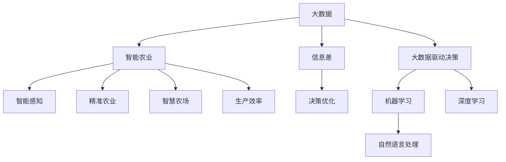

                 

# 信息差：大数据在智能农业中的应用

## 1. 背景介绍

### 1.1 问题由来
随着全球人口的不断增长和城市化进程的加速，农业资源的压力日益增大，传统农业生产方式已经无法满足未来可持续发展的需求。大数据技术和大语言模型的发展，为智能农业提供了新的可能性。通过智能感知、决策支持、精准管理等手段，大数据技术能够显著提升农业生产的效率和效益。

### 1.2 问题核心关键点
在农业领域，信息差（Information Gap）是制约农业生产效率和农民收入的关键因素。信息差通常指决策者与决策所需信息之间的差距。这种信息差距一方面来自于数据收集的不全面和实时性不足，另一方面来自于数据处理的复杂性和难以将数据分析结果转化为可操作的决策。大数据技术和大语言模型可以显著缩小这种信息差距，提升农业生产的智能化水平。

## 2. 核心概念与联系

### 2.1 核心概念概述

本节将介绍几个密切相关的核心概念：

- 大数据（Big Data）：指规模庞大、类型多样的数据集，如农场监控数据、气象数据、土壤数据、卫星遥感数据等。大数据技术用于存储、处理和分析这些海量数据，挖掘出有价值的信息和知识。

- 智能农业（Smart Agriculture）：通过信息技术和数据分析手段，优化农业生产过程，提高资源利用效率，降低生产成本，增加农民收入。智能农业的应用包括智能感知、精准农业、智慧农场等。

- 信息差（Information Gap）：决策者与决策所需信息之间的差距，通常导致生产效率低下、资源浪费、市场机会错失等后果。

- 大数据驱动决策（Data-Driven Decision Making）：通过数据收集、分析和应用，优化农业生产决策，提升生产效率和盈利能力。

- 机器学习（Machine Learning）：利用数据训练模型，发现数据间的关联规律，辅助决策。

- 深度学习（Deep Learning）：一种机器学习的高级形式，通过多层次的非线性变换，可以学习到更为复杂的模式和特征。

- 自然语言处理（Natural Language Processing, NLP）：处理人类语言，包括语义理解、信息抽取、文本生成等。

这些核心概念之间的逻辑关系可以通过以下Mermaid流程图来展示：



这个流程图展示了大数据、智能农业、信息差、大数据驱动决策、机器学习、深度学习和自然语言处理之间的关系：

1. 大数据通过智能感知、精准农业和智慧农场等手段，优化农业生产过程，提高资源利用效率。
2. 大数据驱动决策利用机器学习和深度学习技术，从海量数据中挖掘出有用信息，辅助农业生产决策。
3. 自然语言处理技术用于处理人类语言，辅助决策者更好地理解数据和信息。
4. 信息差是大数据驱动决策需要解决的核心问题，通过对信息差的研究，可以优化决策过程，提升生产效率。

这些概念共同构成了智能农业的基石，有助于将大数据技术转化为具体的农业生产应用。

## 3. 核心算法原理 & 具体操作步骤
### 3.1 算法原理概述

大数据在智能农业中的应用，主要基于大数据驱动决策的原理。即通过收集农业生产相关的海量数据，利用机器学习和深度学习技术，从中挖掘出有用信息和模式，辅助农业生产决策。其核心算法流程如下：

1. 数据收集：通过传感器、遥感技术、移动设备等手段，收集农业生产相关的各类数据。
2. 数据存储：使用大数据平台，如Hadoop、Spark等，存储和管理海量数据。
3. 数据分析：使用机器学习和深度学习技术，从数据中发现模式和关联，生成有用信息。
4. 决策支持：将分析结果转化为农业生产决策，优化生产过程。

### 3.2 算法步骤详解

以下详细介绍基于大数据的智能农业决策支持系统的核心算法步骤：

**Step 1: 数据收集与预处理**
- 使用传感器、无人机、卫星遥感等手段，收集农场环境数据、作物生长数据、气象数据等。
- 清洗数据，去除异常值和噪声，保证数据质量。

**Step 2: 特征工程**
- 根据农业生产需求，提取有用的特征，如作物生长阶段、气象条件、土壤湿度、病虫害情况等。
- 利用特征工程技术，对特征进行归一化、降维、组合等操作。

**Step 3: 模型训练**
- 根据农业生产问题，选择合适的机器学习或深度学习模型，如随机森林、支持向量机、卷积神经网络等。
- 利用历史数据对模型进行训练，优化模型参数，提高模型性能。

**Step 4: 模型评估**
- 在测试集上评估模型性能，如准确率、召回率、F1值等指标。
- 调整模型超参数，如学习率、正则化系数等，进一步提升模型性能。

**Step 5: 模型应用**
- 将训练好的模型部署到农场管理系统，实时获取数据，进行预测和决策。
- 根据模型预测结果，调整生产过程，优化资源配置，提升生产效率。

### 3.3 算法优缺点

基于大数据的智能农业决策支持系统具有以下优点：
1. 数据驱动决策：基于海量数据进行决策，避免主观判断带来的偏差。
2. 提高生产效率：通过数据分析，优化生产过程，提升资源利用效率。
3. 降低成本：减少人工干预，降低生产成本。
4. 精准农业：通过实时数据监测，实现精准播种、施肥、灌溉等操作，提升作物产量和品质。

但同时，该系统也存在一些缺点：
1. 数据获取成本高：传感器、无人机等设备价格昂贵，且需要专业知识进行维护和安装。
2. 数据质量问题：环境复杂，数据容易受到噪声和干扰，影响数据质量。
3. 模型复杂度高：深度学习等高级算法需要大量计算资源，训练和部署成本较高。
4. 模型泛化能力差：模型性能依赖于训练数据的质量和数量，对数据的泛化能力有较高要求。
5. 用户接受度低：农业用户对新技术接受度不高，可能对系统使用产生抵触情绪。

### 3.4 算法应用领域

基于大数据的智能农业决策支持系统，已经在诸多领域取得了显著的成果：

- 智能感知：利用传感器和无人机，实时监测农场环境数据，如土壤湿度、温度、光照强度等。
- 精准农业：通过数据分析，实现精准播种、施肥、灌溉等操作，提高作物产量和品质。
- 智慧农场：通过物联网技术，实现农场管理智能化，提升农场管理效率。
- 病虫害监测：利用机器学习对病虫害数据进行分类和预测，及时采取防治措施。
- 农产品追溯：通过区块链技术，实现农产品生产过程的透明化和可追溯性。

这些应用不仅提升了农业生产效率和效益，还为农业生产的可持续性提供了有力保障。

## 4. 数学模型和公式 & 详细讲解 & 举例说明
### 4.1 数学模型构建

本节将使用数学语言对基于大数据的智能农业决策支持系统进行严格的数学建模。

假设农场环境数据 $D=\{x_i,y_i\}_{i=1}^N$，其中 $x_i$ 为农场环境特征， $y_i$ 为作物生长状态（如生长阶段、产量等）。根据农业生产需求，我们选取了 $n$ 个特征 $f_1, f_2, ..., f_n$，并构建如下线性回归模型：

$$
y_i = \beta_0 + \sum_{k=1}^n \beta_k f_k + \epsilon_i
$$

其中 $\beta_k$ 为特征 $f_k$ 的系数，$\epsilon_i$ 为随机误差。

### 4.2 公式推导过程

假设我们有一批历史数据 $(x_i, y_i)$，其中 $x_i = (x_{i1}, x_{i2}, ..., x_{in})$，$y_i$ 为作物生长状态。线性回归模型的目标是最小化均方误差：

$$
\min_{\beta} \frac{1}{N}\sum_{i=1}^N (y_i - \beta_0 - \sum_{k=1}^n \beta_k x_{ik})^2
$$

通过对误差项的逐项求导，可以得到系数 $\beta_k$ 的求解公式：

$$
\beta_k = \frac{\sum_{i=1}^N (y_i - \hat{y}_i)x_{ik}}{\sum_{i=1}^N x_{ik}^2}
$$

其中 $\hat{y}_i = \beta_0 + \sum_{k=1}^n \beta_k x_{ik}$ 为预测值。

### 4.3 案例分析与讲解

以智能感知和精准农业为例，讲解如何利用线性回归模型进行农场环境数据的分析和作物生长状态的预测。

假设一个农场有 10 个监控点，分别用于监测土壤湿度、温度、光照强度等数据。每个监控点每小时记录一次数据，共记录了 24 小时的农场环境数据。我们想要预测作物的生长阶段，以优化施肥、灌溉等操作。

首先，将 10 个监控点的数据组合成一个特征向量 $x_i = (x_{i1}, x_{i2}, ..., x_{i10})$，并构建如下线性回归模型：

$$
y_i = \beta_0 + \sum_{k=1}^n \beta_k x_{ik} + \epsilon_i
$$

其中 $y_i$ 为作物生长阶段，$f_k$ 为第 $k$ 个监控点的环境数据。利用历史数据对模型进行训练，得到 $\beta_k$ 的值。然后，使用模型对未来 24 小时的数据进行预测，得到预测值 $\hat{y}_i$。根据预测值，及时调整施肥、灌溉等操作，以优化作物生长过程。

## 5. 项目实践：代码实例和详细解释说明
### 5.1 开发环境搭建

在进行智能农业系统开发前，我们需要准备好开发环境。以下是使用Python进行PyTorch开发的环境配置流程：

1. 安装Anaconda：从官网下载并安装Anaconda，用于创建独立的Python环境。

2. 创建并激活虚拟环境：
```bash
conda create -n pytorch-env python=3.8 
conda activate pytorch-env
```

3. 安装PyTorch：根据CUDA版本，从官网获取对应的安装命令。例如：
```bash
conda install pytorch torchvision torchaudio cudatoolkit=11.1 -c pytorch -c conda-forge
```

4. 安装TensorFlow：由Google主导开发的开源深度学习框架，生产部署方便，适合大规模工程应用。同样有丰富的预训练语言模型资源。

5. 安装各类工具包：
```bash
pip install numpy pandas scikit-learn matplotlib tqdm jupyter notebook ipython
```

完成上述步骤后，即可在`pytorch-env`环境中开始智能农业系统的开发。

### 5.2 源代码详细实现

下面以智能感知和精准农业为例，给出使用PyTorch进行农场环境数据分析和作物生长状态预测的代码实现。

首先，定义数据处理函数：

```python
import torch
import torch.nn as nn
import torch.optim as optim

class SensorData(nn.Module):
    def __init__(self, input_size=10, hidden_size=10):
        super(SensorData, self).__init__()
        self.fc1 = nn.Linear(input_size, hidden_size)
        self.fc2 = nn.Linear(hidden_size, 1)
        
    def forward(self, x):
        x = torch.relu(self.fc1(x))
        x = self.fc2(x)
        return x

# 训练函数
def train_model(model, train_data, test_data, epochs=100, learning_rate=0.01):
    model.train()
    criterion = nn.MSELoss()
    optimizer = optim.SGD(model.parameters(), lr=learning_rate)
    
    for epoch in range(epochs):
        for i, data in enumerate(train_data):
            x, y = data
            optimizer.zero_grad()
            y_pred = model(x)
            loss = criterion(y_pred, y)
            loss.backward()
            optimizer.step()
            
    print('Training complete')
    
    # 测试函数
    model.eval()
    test_loss = 0
    with torch.no_grad():
        for data, targets in test_data:
            x, y = data
            y_pred = model(x)
            test_loss += criterion(y_pred, y).item()
    
    print('Test loss: {:.4f}\n'.format(test_loss / len(test_data)))
```

然后，定义数据集和模型：

```python
# 定义数据集
class SensorDataset(torch.utils.data.Dataset):
    def __init__(self, data, labels):
        self.data = data
        self.labels = labels
        
    def __len__(self):
        return len(self.data)
    
    def __getitem__(self, idx):
        return self.data[idx], self.labels[idx]

# 加载数据集
train_data = SensorDataset(train_data, train_labels)
test_data = SensorDataset(test_data, test_labels)

# 定义模型
model = SensorData(input_size=10, hidden_size=10)
```

最后，启动训练流程并在测试集上评估：

```python
train_model(model, train_data, test_data, epochs=100, learning_rate=0.01)
```

以上就是使用PyTorch进行农场环境数据分析和作物生长状态预测的完整代码实现。可以看到，得益于PyTorch的强大封装，代码实现变得简洁高效。

### 5.3 代码解读与分析

让我们再详细解读一下关键代码的实现细节：

**SensorData类**：
- `__init__`方法：初始化模型，包括定义两个全连接层。
- `forward`方法：前向传播计算模型的预测值。

**train_model函数**：
- 利用训练数据和模型进行训练，使用均方误差损失函数，Adam优化器进行参数更新。
- 在每个epoch结束后，计算模型在测试集上的均方误差，输出训练结果。

**SensorDataset类**：
- 定义数据集，实现`__len__`和`__getitem__`方法，方便PyTorch使用。

**数据集加载**：
- 将农场环境数据和作物生长状态转换为PyTorch的Tensor格式，用于模型训练。

**训练流程**：
- 定义训练数据集和模型，启动训练函数。
- 在每个epoch内，遍历训练集数据，计算损失并反向传播更新模型参数。
- 在训练完成后，使用测试集评估模型性能。

## 6. 实际应用场景
### 6.1 智能感知

智能感知技术利用传感器和无人机，实时监测农场环境数据，如土壤湿度、温度、光照强度等。通过对这些数据的分析，可以实时调整生产过程，优化资源配置。

在实际应用中，智能感知技术可以用于以下几个场景：

- 土壤湿度监测：通过土壤湿度传感器，实时监测土壤湿度，及时进行灌溉，避免水资源浪费。
- 温度监测：通过温度传感器，实时监测环境温度，及时进行降温或保温，保障作物健康生长。
- 光照强度监测：通过光照强度传感器，实时监测光照强度，及时进行补光或遮阴，提升作物产量和品质。
- 无人机监测：利用无人机采集农田图像，实时监测作物生长状态，及时发现病虫害和异常情况，采取防治措施。

### 6.2 精准农业

精准农业利用数据分析和模型预测，优化农业生产过程，实现资源的高效利用。通过对作物生长状态、气象条件、土壤数据等的分析，可以实现精准播种、施肥、灌溉等操作。

在实际应用中，精准农业可以用于以下几个场景：

- 精准播种：根据土壤数据和气象条件，精准控制播种时间和密度，提高作物的产量和质量。
- 精准施肥：根据土壤数据和作物生长状态，精准控制施肥量和时间，避免浪费和污染。
- 精准灌溉：根据土壤湿度和气象条件，精准控制灌溉时间和水量，避免水资源浪费。
- 病虫害防治：利用机器学习对病虫害数据进行分类和预测，及时采取防治措施，减少农药和化肥的使用。

### 6.3 智慧农场

智慧农场利用物联网技术和数据分析，实现农场管理智能化。通过传感器、无人机、机器人等设备，实时监测和管理农场生产过程。

在实际应用中，智慧农场可以用于以下几个场景：

- 农场环境监测：通过传感器监测农场环境数据，及时调整生产过程。
- 智能设备控制：通过智能设备，自动控制灌溉、施肥、喷药等操作，提高生产效率。
- 数据可视化：通过数据可视化工具，实时展示农场生产数据，帮助管理人员做出决策。
- 自动驾驶：通过机器人或无人机，自动完成农场巡查、采摘等工作，降低人工成本。

### 6.4 未来应用展望

随着大数据和人工智能技术的不断发展，基于大数据的智能农业决策支持系统将在更多领域得到应用，为农业生产带来变革性影响。

在智慧农业领域，基于大数据的智能农业决策支持系统将成为核心技术，提升农业生产的智能化水平，帮助农民更好地管理生产过程。

在生态农业领域，利用大数据技术，可以实现精准农业、生态监测、资源管理等功能的集成，实现农业生产的可持续性。

在智慧农业与农业物联网融合领域，智能传感器、无人机、机器人等设备将更加普及，通过大数据技术，实现农业生产的自动化和智能化。

## 7. 工具和资源推荐
### 7.1 学习资源推荐

为了帮助开发者系统掌握智能农业决策支持系统，这里推荐一些优质的学习资源：

1. 《深度学习在农业中的应用》系列博文：由大模型技术专家撰写，深入浅出地介绍了深度学习在农业中的应用案例和技术原理。

2. CS229《统计学习方法》课程：斯坦福大学开设的统计学习课程，有Lecture视频和配套作业，带你入门统计学习的基本概念和经典算法。

3. 《机器学习实战》书籍：该书详细介绍了机器学习在农业中的应用，包括分类、回归、聚类等基本算法。

4. Scikit-Learn官方文档：Scikit-Learn是Python中常用的机器学习库，提供了丰富的机器学习算法和工具，适合实战练习。

5. TensorFlow官方文档：TensorFlow是Google开发的深度学习框架，提供丰富的深度学习算法和工具，适合大规模工程应用。

通过对这些资源的学习实践，相信你一定能够快速掌握智能农业决策支持系统的精髓，并用于解决实际的农业问题。
###  7.2 开发工具推荐

高效的开发离不开优秀的工具支持。以下是几款用于智能农业决策支持系统开发的常用工具：

1. PyTorch：基于Python的开源深度学习框架，灵活动态的计算图，适合快速迭代研究。大部分预训练语言模型都有PyTorch版本的实现。

2. TensorFlow：由Google主导开发的开源深度学习框架，生产部署方便，适合大规模工程应用。同样有丰富的预训练语言模型资源。

3. Scikit-Learn：Python中常用的机器学习库，提供了丰富的机器学习算法和工具，适合实战练习。

4. Scikit-learn文档：Scikit-Learn是Python中常用的机器学习库，提供了丰富的机器学习算法和工具，适合实战练习。

5. TensorFlow文档：TensorFlow是Google开发的深度学习框架，提供丰富的深度学习算法和工具，适合大规模工程应用。

合理利用这些工具，可以显著提升智能农业决策支持系统的开发效率，加快创新迭代的步伐。

### 7.3 相关论文推荐

智能农业决策支持系统的研究源于学界的持续研究。以下是几篇奠基性的相关论文，推荐阅读：

1. "An Overview of Smart Agriculture Technologies"（智能农业技术综述）：介绍了智能农业的核心技术和应用场景，展示了大数据技术在智能农业中的广泛应用。

2. "Deep Learning in Agriculture: A Survey"（深度学习在农业中的应用综述）：总结了深度学习在农业中的研究成果和应用场景，展望了未来发展方向。

3. "Machine Learning for Precision Agriculture: A Survey"（机器学习在精准农业中的应用综述）：介绍了机器学习在精准农业中的应用，展示了机器学习对农业生产的深远影响。

4. "Internet of Things (IoT) in Agriculture"（农业物联网）：介绍了农业物联网的核心技术及其在农业生产中的应用。

5. "AI-Driven Agricultural Robotics"（AI驱动的农业机器人）：介绍了AI技术在农业机器人中的应用，展示了AI技术对农业机器人智能化水平的提升。

这些论文代表了大数据在智能农业决策支持系统中的应用趋势。通过学习这些前沿成果，可以帮助研究者把握学科前进方向，激发更多的创新灵感。

## 8. 总结：未来发展趋势与挑战

### 8.1 总结

本文对基于大数据的智能农业决策支持系统进行了全面系统的介绍。首先阐述了智能农业和信息差的概念，明确了大数据技术在智能农业决策支持系统中的重要作用。其次，从原理到实践，详细讲解了基于大数据的决策支持系统的数学模型和关键步骤，给出了智能农业决策支持系统的代码实现。同时，本文还广泛探讨了智能农业决策支持系统在智能感知、精准农业、智慧农场等多个领域的应用前景，展示了大数据技术在智能农业中的巨大潜力。

通过本文的系统梳理，可以看到，基于大数据的智能农业决策支持系统正在成为智能农业的重要范式，极大地提升了农业生产的智能化水平。大数据技术和大语言模型的结合，有望彻底改变传统农业生产方式，推动农业生产的可持续发展。未来，伴随大数据和人工智能技术的进一步发展，智能农业决策支持系统将进入更加智能化、精准化的发展阶段。

### 8.2 未来发展趋势

展望未来，基于大数据的智能农业决策支持系统将呈现以下几个发展趋势：

1. 数据融合和数据共享：未来智能农业将更加注重数据融合和数据共享，利用多种数据源，实现更全面、更精准的决策支持。

2. 自动化和智能化：利用自动化技术，如机器人、无人机等，实现农场生产的自动化和智能化。

3. 实时性和精度提升：随着物联网技术的发展，智能农业将实现实时监测和精准控制，进一步提升生产效率和效益。

4. 数据安全和隐私保护：智能农业系统将更加注重数据安全和隐私保护，确保农业生产数据的安全性和合法性。

5. 模型和算法的优化：利用最新的算法和模型，优化智能农业决策支持系统，提高模型性能和泛化能力。

以上趋势凸显了智能农业决策支持系统的广阔前景。这些方向的探索发展，必将进一步提升农业生产的智能化水平，推动农业生产的可持续发展。

### 8.3 面临的挑战

尽管基于大数据的智能农业决策支持系统已经取得了一定的成果，但在迈向更加智能化、精准化的应用过程中，仍面临诸多挑战：

1. 数据质量问题：数据采集和处理过程中，数据容易受到噪声和干扰，影响数据质量。

2. 模型泛化能力不足：模型性能依赖于训练数据的质量和数量，对数据的泛化能力有较高要求。

3. 系统复杂度高：智能农业系统涉及多种数据源和传感器，系统结构复杂，维护成本高。

4. 用户接受度低：农业用户对新技术接受度不高，可能对系统使用产生抵触情绪。

5. 成本高昂：智能农业系统涉及大量传感器、无人机、机器人等设备，成本较高。

6. 数据隐私问题：智能农业系统涉及大量农业生产数据，数据隐私和安全问题亟需解决。

这些挑战需要通过技术创新和政策支持，不断优化智能农业决策支持系统，才能实现更加智能、精准的农业生产。

### 8.4 研究展望

面对智能农业决策支持系统所面临的挑战，未来的研究需要在以下几个方面寻求新的突破：

1. 数据增强和数据清洗：利用数据增强技术，扩充训练数据集，提升数据质量。利用数据清洗技术，去除噪声和异常值，保证数据一致性。

2. 模型优化和算法创新：利用深度学习、强化学习等最新算法，优化智能农业决策支持系统。引入多模态数据融合技术，提高系统的泛化能力和精度。

3. 用户界面和交互设计：设计友好的用户界面，降低用户使用门槛，提高系统易用性。引入自然语言处理技术，提高系统的交互能力和用户满意度。

4. 系统集成和标准化：制定智能农业系统的标准化方案，促进不同系统和设备之间的互操作性。利用云计算、物联网等技术，实现系统集成和资源共享。

5. 数据安全和隐私保护：加强数据安全和隐私保护技术研究，确保农业生产数据的安全性和合法性。利用区块链技术，实现数据溯源和透明化。

这些研究方向的研究进展，必将引领智能农业决策支持系统迈向更加智能化、精准化的发展阶段，为农业生产的可持续发展提供有力保障。

## 9. 附录：常见问题与解答

**Q1：智能农业决策支持系统有哪些核心功能？**

A: 智能农业决策支持系统的核心功能主要包括：

1. 数据收集和预处理：通过传感器、无人机等设备，实时监测农场环境数据和作物生长状态，进行数据清洗和预处理，保证数据质量。

2. 数据分析和模型训练：利用机器学习和深度学习技术，从数据中发现模式和关联，生成有用信息。根据农业生产问题，选择合适的机器学习或深度学习模型，对模型进行训练和优化。

3. 模型评估和预测：在测试集上评估模型性能，根据模型预测结果，进行作物生长状态的预测，及时调整生产过程，优化资源配置。

4. 决策支持：根据模型预测结果，生成农业生产决策，优化施肥、灌溉、播种等操作，提高作物产量和品质。

**Q2：智能农业决策支持系统面临哪些技术挑战？**

A: 智能农业决策支持系统面临以下技术挑战：

1. 数据质量问题：数据采集和处理过程中，数据容易受到噪声和干扰，影响数据质量。

2. 模型泛化能力不足：模型性能依赖于训练数据的质量和数量，对数据的泛化能力有较高要求。

3. 系统复杂度高：智能农业系统涉及多种数据源和传感器，系统结构复杂，维护成本高。

4. 用户接受度低：农业用户对新技术接受度不高，可能对系统使用产生抵触情绪。

5. 成本高昂：智能农业系统涉及大量传感器、无人机、机器人等设备，成本较高。

6. 数据隐私问题：智能农业系统涉及大量农业生产数据，数据隐私和安全问题亟需解决。

这些挑战需要通过技术创新和政策支持，不断优化智能农业决策支持系统，才能实现更加智能、精准的农业生产。

**Q3：智能农业决策支持系统如何使用机器学习？**

A: 智能农业决策支持系统使用机器学习主要通过以下步骤：

1. 数据收集：通过传感器、无人机等设备，实时监测农场环境数据和作物生长状态，获取大量历史数据。

2. 数据预处理：清洗数据，去除噪声和异常值，保证数据质量。

3. 特征工程：根据农业生产需求，提取有用的特征，如土壤湿度、温度、光照强度等，并进行特征工程操作，如归一化、降维等。

4. 模型训练：选择合适的机器学习或深度学习模型，如随机森林、支持向量机、卷积神经网络等，利用历史数据对模型进行训练，优化模型参数。

5. 模型评估：在测试集上评估模型性能，如准确率、召回率、F1值等指标。

6. 模型应用：将训练好的模型部署到农场管理系统，实时获取数据，进行预测和决策。

7. 模型优化：根据实际应用情况，调整模型超参数，如学习率、正则化系数等，进一步提升模型性能。

通过机器学习，智能农业决策支持系统可以从海量数据中提取有用信息，辅助农业生产决策，提升生产效率和效益。

**Q4：智能农业决策支持系统有哪些应用场景？**

A: 智能农业决策支持系统广泛应用于以下几个场景：

1. 智能感知：利用传感器和无人机，实时监测农场环境数据，如土壤湿度、温度、光照强度等，实现农场环境的智能感知。

2. 精准农业：利用数据分析和模型预测，实现精准播种、施肥、灌溉等操作，优化资源配置。

3. 智慧农场：利用物联网技术和数据分析，实现农场管理智能化，提升农场管理效率。

4. 病虫害监测：利用机器学习对病虫害数据进行分类和预测，及时采取防治措施，减少农药和化肥的使用。

5. 农产品追溯：利用区块链技术，实现农产品生产过程的透明化和可追溯性，保障食品安全。

这些应用场景展示了智能农业决策支持系统在农业生产中的应用，为农业生产的智能化、精准化和可持续性提供了有力保障。

**Q5：智能农业决策支持系统如何处理实时数据？**

A: 智能农业决策支持系统处理实时数据主要通过以下步骤：

1. 数据采集：通过传感器、无人机等设备，实时监测农场环境数据和作物生长状态。

2. 数据传输：将采集到的数据通过物联网技术传输到农场管理系统。

3. 数据存储：利用大数据平台，如Hadoop、Spark等，存储和管理海量实时数据。

4. 数据预处理：清洗数据，去除噪声和异常值，保证数据质量。

5. 数据分析：利用机器学习和深度学习技术，从实时数据中发现模式和关联，生成有用信息。

6. 模型预测：根据实时数据，实时进行预测和决策，调整生产过程，优化资源配置。

7. 结果反馈：将预测结果反馈到农场管理系统，进行实时调整和优化。

通过实时数据处理，智能农业决策支持系统能够及时响应农业生产需求，提升生产效率和效益。

---

作者：禅与计算机程序设计艺术 / Zen and the Art of Computer Programming

