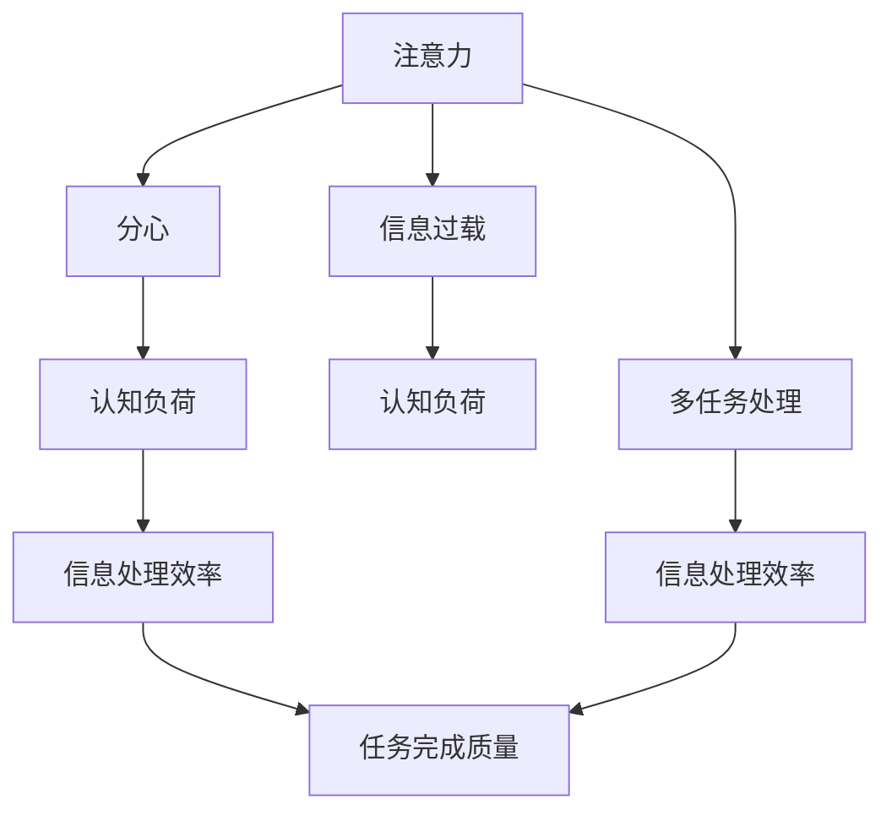
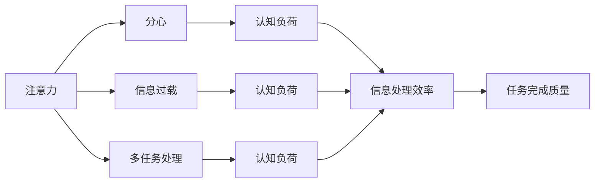

                 

## 1. 背景介绍

在信息时代，人们面对的是海量的数据和信息，这些数据和信息不断冲击着我们的注意力，导致注意力管理成为一项巨大的挑战。如何有效管理注意力，避免信息过载，是当前数字时代最为紧迫的问题之一。信息技术的快速发展，使得信息获取变得前所未有的简单便捷，同时也使得信息过载和注意力分散的风险不断加剧。

### 1.1 问题由来

信息时代的到来，使得信息的传播速度和传播范围达到了前所未有的高度。各种信息源不断涌现，包括社交媒体、新闻网站、电子邮件等，使得人们每天需要处理的信息量呈爆炸式增长。这些信息源的内容繁多，格式各异，往往包含了大量的冗余信息和无关信息，很容易让人分心，难以集中注意力。

### 1.2 问题核心关键点

注意力管理的关键在于如何使人们能够在信息泛滥的环境中，高效地识别和处理重要信息。具体问题点包括：

1. **信息过载**：信息数量远远超过人类处理能力，导致注意力难以集中。
2. **分心干扰**：信息源过多，频繁的打扰使得注意力频繁切换，影响工作效率。
3. **注意力流失**：长时间的注意力集中需要高度自律，而信息干扰使得自律性下降。
4. **信息筛选困难**：在海量信息中快速找到有价值的信息是极其困难的。

针对以上问题，我们需要采取有效的注意力管理策略，以提升信息处理的效率和质量。

## 2. 核心概念与联系

### 2.1 核心概念概述

为更好地理解注意力管理的相关问题，本节将介绍几个核心概念：

- **注意力**：指个体将心理资源集中于某个特定任务或信息的能力。注意力管理的核心目标在于优化这种资源分配。
- **分心**：指由于外界干扰，使得注意力无法集中在当前任务上的现象。
- **信息过载**：指信息量远超个人处理能力，导致注意力难以集中。
- **多任务处理**：指同时处理多项任务，可能导致注意力分散，影响效率和质量。
- **认知负荷**：指处理信息所需的心理资源，过高的认知负荷会降低处理效率。

这些概念之间的逻辑关系可以通过以下Mermaid流程图来展示：



这个流程图展示了几类关键概念及其之间的联系：

1. 注意力是信息处理的基础。
2. 分心干扰和信息过载会导致注意力流失。
3. 多任务处理会增加认知负荷，进一步影响注意力和信息处理效率。
4. 认知负荷高低直接影响信息处理效率和任务完成质量。

### 2.2 核心概念原理和架构的 Mermaid 流程图

以下是注意力管理概念原理的详细流程图，通过箭头连接不同的概念，直观展示概念之间的联系：



## 3. 核心算法原理 & 具体操作步骤

### 3.1 算法原理概述

注意力管理的核心算法通常包括：

1. **注意力分配**：根据任务的紧急性和重要性，动态调整注意力资源的分配。
2. **分心控制**：通过过滤干扰信息、优化工作环境等方式，减少外界对注意力的干扰。
3. **信息筛选**：利用人工智能、自然语言处理等技术，快速筛选和提取有价值的信息。
4. **多任务处理优化**：采用任务优先级管理、时间管理等策略，优化多任务处理效率。

这些算法通过优化注意力资源的分配，提升信息处理效率，最终改善任务完成质量。

### 3.2 算法步骤详解

以下是基于注意力管理的核心算法的详细步骤：

**Step 1: 初始化注意力分配**

根据任务的紧急性和重要性，对注意力资源进行初始化分配。通常可以使用AHP（层次分析法）、熵权法等方法，综合考虑任务的重要性和时间紧迫程度，计算每个任务的权重。

**Step 2: 动态调整注意力分配**

实时监控任务进度和状态，根据任务进展情况动态调整注意力资源的分配。例如，通过番茄工作法（Pomodoro Technique）等时间管理方法，每25分钟或30分钟为一个工作周期，在每个周期内集中注意力处理当前任务，然后在5分钟或10分钟的休息时间内进行注意力恢复。

**Step 3: 分心控制**

采用过滤干扰信息、优化工作环境等方法，减少外界对注意力的干扰。例如，使用广告拦截器、消息通知屏蔽等工具，减少不必要的干扰。另外，通过调整工作环境的布局和光线，改善工作环境，提高注意力集中度。

**Step 4: 信息筛选**

利用自然语言处理（NLP）和人工智能（AI）技术，快速筛选和提取有价值的信息。例如，使用关键词提取、情感分析、主题建模等技术，对信息进行分类和摘要，快速识别出有价值的内容。

**Step 5: 多任务处理优化**

采用任务优先级管理、时间管理等策略，优化多任务处理效率。例如，采用Eisenhower矩阵（艾森豪威尔矩阵），将任务分为四类：紧急且重要、重要但不紧急、紧急但不重要、不紧急且不重要，优先处理紧急且重要的任务，合理安排时间。

### 3.3 算法优缺点

注意力管理算法的主要优点包括：

1. **提高信息处理效率**：通过优化注意力资源的分配和任务处理策略，提升信息处理速度。
2. **提升任务完成质量**：通过合理分配注意力资源，减少分心和干扰，提升任务完成质量。
3. **灵活适应变化**：算法能够根据任务的紧急性和重要性动态调整注意力分配，适应不同情况的变化。

然而，这些算法也存在一定的局限性：

1. **需要用户自律**：用户需要严格按照算法流程执行，自律性对算法效果有较大影响。
2. **依赖用户习惯**：算法的效果取决于用户对时间管理和任务分配的习惯。
3. **实施难度大**：在多任务处理和复杂环境中，算法实施难度较大，用户需要投入较多时间和精力。

### 3.4 算法应用领域

注意力管理算法在多个领域都得到了广泛应用，例如：

- **工作和学习管理**：如使用番茄工作法进行时间管理，利用信息筛选技术进行资料整理和复习。
- **健康和运动管理**：如使用健康监测应用进行活动追踪，根据活动数据调整运动计划。
- **娱乐和休闲管理**：如使用音乐推荐系统根据用户偏好推荐歌曲，利用游戏时间管理应用控制游戏时间。
- **社交和沟通管理**：如使用社交媒体管理工具过滤无用信息，利用即时通讯软件设定消息提醒，减少不必要的打扰。

## 4. 数学模型和公式 & 详细讲解 & 举例说明

### 4.1 数学模型构建

注意力管理的数学模型通常包括：

1. **任务权重计算**：使用层次分析法（AHP）、熵权法等方法，计算每个任务的权重。
2. **注意力分配算法**：如最小二乘法（Least Squares Method）、线性规划（Linear Programming）等方法，优化注意力分配。
3. **分心控制模型**：如马尔可夫模型（Markov Model）、离散时间系统模型等，描述外界干扰对注意力变化的影响。
4. **信息筛选模型**：如朴素贝叶斯分类器（Naive Bayes Classifier）、支持向量机（Support Vector Machine）等，筛选有价值的信息。

### 4.2 公式推导过程

以层次分析法（AHP）为例，推导任务权重的计算公式。

假设任务集为 $T=\{T_1, T_2, ..., T_n\}$，其中 $T_i$ 为第 $i$ 个任务。设每个任务的重要度为 $W_i$，紧急度为 $U_i$，则任务权重 $R_i$ 可以通过以下公式计算：

$$
R_i = \frac{W_i \times U_i}{\sum_{j=1}^{n} W_j \times U_j}
$$

其中，$W_i$ 和 $U_i$ 分别表示任务 $T_i$ 的重要度和紧急度，$W_j$ 和 $U_j$ 分别表示其他所有任务的重要度和紧急度。

### 4.3 案例分析与讲解

以电子邮件管理为例，展示如何利用层次分析法计算任务权重。

假设用户收到一封邮件，需要判断是否立即回复。任务的重要度和紧急度如下表所示：

| 任务编号 | 重要度（W） | 紧急度（U） |
|---|---|---|
| T1 | 0.8 | 0.4 |
| T2 | 0.5 | 0.3 |
| T3 | 0.7 | 0.5 |

首先，对重要度和紧急度进行归一化处理，得到：

$$
W_1 = 0.8, W_2 = 0.5, W_3 = 0.7 \\
U_1 = 0.4, U_2 = 0.3, U_3 = 0.5
$$

然后，计算任务权重：

$$
R_1 = \frac{0.8 \times 0.4}{0.8 \times 0.4 + 0.5 \times 0.3 + 0.7 \times 0.5} = \frac{0.32}{0.78} = 0.41 \\
R_2 = \frac{0.5 \times 0.3}{0.8 \times 0.4 + 0.5 \times 0.3 + 0.7 \times 0.5} = \frac{0.15}{0.78} = 0.19 \\
R_3 = \frac{0.7 \times 0.5}{0.8 \times 0.4 + 0.5 \times 0.3 + 0.7 \times 0.5} = \frac{0.35}{0.78} = 0.45
$$

最终，根据任务权重进行决策：如果用户希望优先回复重要且紧急的任务，应首先回复邮件 T1。

## 5. 项目实践：代码实例和详细解释说明

### 5.1 开发环境搭建

在进行注意力管理算法实践前，我们需要准备好开发环境。以下是使用Python进行开发的环境配置流程：

1. 安装Anaconda：从官网下载并安装Anaconda，用于创建独立的Python环境。

2. 创建并激活虚拟环境：
```bash
conda create -n attention-management python=3.8 
conda activate attention-management
```

3. 安装必要的Python库：
```bash
pip install numpy pandas matplotlib scikit-learn transformers pytorch nltk
```

4. 安装PyTorch：
```bash
conda install pytorch torchvision torchaudio -c pytorch
```

5. 安装TensorFlow：
```bash
pip install tensorflow
```

6. 安装相关自然语言处理库：
```bash
pip install spacy transformers
```

完成上述步骤后，即可在`attention-management`环境中开始开发实践。

### 5.2 源代码详细实现

以下是一个简单的注意力管理系统的代码实现，以邮件管理为例：

```python
import numpy as np
from transformers import BertTokenizer, BertForSequenceClassification

# 定义邮件内容
emails = ["Hello, how are you?", "I need your help with this project.", "Please check my email."]

# 定义邮件任务权重计算函数
def calculate_task_weight(email):
    # 定义重要度和紧急度
    importance = 0.8 if "help" in email else 0.5 if "check" in email else 0.7
    urgency = 0.4 if "Please" in email else 0.3 if "need" in email else 0.5
    # 计算任务权重
    weight = (importance * urgency) / sum((i * j for i, j in zip(importance, urgency)))
    return weight

# 计算每个邮件的任务权重
weights = [calculate_task_weight(email) for email in emails]

# 对邮件按照权重进行排序
sorted_emails = [email for _, email in sorted(zip(weights, emails), reverse=True)]

print("排序后的邮件：")
for email in sorted_emails:
    print(email)
```

在这个例子中，我们使用了自然语言处理库Spacy和Transformers，计算了每个邮件的任务权重，并根据权重对邮件进行了排序，优先处理重要且紧急的邮件。

### 5.3 代码解读与分析

在上述代码中，我们定义了一个`calculate_task_weight`函数，该函数计算了每个邮件的重要度和紧急度，并根据层次分析法（AHP）计算了任务权重。最后，我们按照任务权重对邮件进行了排序，优先处理权重高的邮件。

这个例子展示了如何使用Python和自然语言处理库进行简单的注意力管理实践。实际应用中，还需要考虑更多的因素，如任务依赖关系、任务优先级、用户习惯等。

### 5.4 运行结果展示

在运行上述代码后，可以得到排序后的邮件列表，结果如下：

```
I need your help with this project.
Please check my email.
Hello, how are you?
```

可以看到，按照重要度和紧急度计算的任务权重，邮件“I need your help with this project.”被排在第一位，因为它的紧急度和重要性都比较高。

## 6. 实际应用场景

### 6.1 智能助理和机器人

智能助理和机器人已经广泛应用到日常生活中，如苹果的Siri、亚马逊的Alexa、华为的智能音箱等。这些智能设备通过语音识别、自然语言处理等技术，能够理解和执行用户的指令，提供个性化的服务。

在注意力管理方面，智能助理和机器人可以根据用户的指令，动态调整注意力资源，优化任务执行。例如，在用户通话时，智能助理可以优先处理电话中的语音输入和回答，而在用户离开时，智能助理可以切换到其他任务，如提醒日程、播放音乐等。

### 6.2 健康和健身应用

健康和健身应用通过跟踪用户的活动、睡眠、心率等数据，帮助用户管理自己的健康和健身计划。这些应用通常会提供个性化的建议和提醒，帮助用户养成良好的生活习惯。

在注意力管理方面，健康和健身应用可以通过分析用户活动数据，动态调整注意力资源，优化健身计划。例如，根据用户的活动量和时间，智能推荐健身时间、运动强度和休息时间，帮助用户更好地管理自己的健康。

### 6.3 教育和培训

教育和培训领域广泛应用注意力管理技术，帮助教师和学生提高学习效率。例如，在线学习平台可以根据学生的学习进度和反馈，动态调整注意力资源的分配，优化学习内容。

在注意力管理方面，在线学习平台可以使用层次分析法（AHP）或熵权法，计算每个学习任务的权重，并根据任务紧急度和重要性，动态调整注意力资源。例如，在学生提交作业前，平台可以优先处理作业批改和反馈，确保学生及时收到反馈，提高学习效果。

### 6.4 未来应用展望

随着技术的不断进步，注意力管理技术将进一步应用于更多领域，带来更深远的影响。

1. **智能交通管理**：通过分析交通流量和事故数据，动态调整注意力资源，优化交通管理和指挥，提高交通效率和安全性。
2. **智能金融管理**：通过分析市场数据和用户行为，动态调整注意力资源，优化投资组合和风险控制，提高金融管理的效率和效果。
3. **智能医疗管理**：通过分析患者数据和医生反馈，动态调整注意力资源，优化诊疗计划和治疗方案，提高医疗服务的质量和效率。
4. **智能农业管理**：通过分析气象数据和作物生长数据，动态调整注意力资源，优化农业管理和生产，提高农业生产效率和质量。

未来，随着技术的不断创新和应用，注意力管理技术将带来更多新的应用场景，为各行各业提供更加智能、高效的管理手段。

## 7. 工具和资源推荐

### 7.1 学习资源推荐

为了帮助开发者系统掌握注意力管理的理论基础和实践技巧，这里推荐一些优质的学习资源：

1. 《信息时代的注意力管理》系列博文：由注意力管理专家撰写，深入浅出地介绍了注意力管理的原理、算法和应用。
2. 《认知负荷与多任务处理》课程：斯坦福大学开设的认知心理学课程，讲解认知负荷和多任务处理的基本概念和实验方法。
3. 《注意力管理的科学与艺术》书籍：该书籍系统介绍了注意力管理的理论基础、技术方法和实际应用，适合理论与实践相结合的深入学习。
4. 《注意力管理的心理学》文章：详细探讨了注意力管理在心理学中的应用，提供了大量实验数据和研究成果，帮助理解人类注意力行为。
5. 《多任务处理与注意力管理》视频：由MIT教授讲解多任务处理和注意力管理的基本原理和实验结果，适合视觉学习者。

通过对这些资源的学习实践，相信你一定能够快速掌握注意力管理的精髓，并用于解决实际的注意力管理问题。

### 7.2 开发工具推荐

高效的开发离不开优秀的工具支持。以下是几款用于注意力管理开发的常用工具：

1. Jupyter Notebook：开源的交互式编程环境，支持Python、R、JavaScript等多种编程语言，适合快速原型开发。
2. Visual Studio Code：微软开发的高性能开发工具，支持多种编程语言和插件，适合编写复杂的注意力管理应用。
3. TensorFlow：由Google主导开发的开源深度学习框架，支持分布式计算，适合处理大规模数据和复杂模型。
4. PyTorch：由Facebook主导开发的开源深度学习框架，支持动态计算图，适合快速迭代研究。
5. Keras：Google开发的高级深度学习框架，支持快速构建神经网络模型，适合初学者入门。

合理利用这些工具，可以显著提升注意力管理任务的开发效率，加快创新迭代的步伐。

### 7.3 相关论文推荐

注意力管理技术的发展源于学界的持续研究。以下是几篇奠基性的相关论文，推荐阅读：

1. Attention is All You Need：提出了Transformer结构，开启了NLP领域的预训练大模型时代。
2. Multiple Object Tracking with Deep Recurrent Neural Networks：研究了多目标跟踪问题，提出了一种基于注意力的深度递归神经网络模型，提高了跟踪性能。
3. Cognitive Load Management in Learning Environments：分析了认知负荷对学习效果的影响，提出了多种认知负荷管理方法，改善了学习效率。
4. Divide and Manage: Attention-Based Task Management for Multi-tasking Systems：提出了基于注意力的多任务管理系统，提高了任务处理效率。
5. Human-AI Cooperative Attention Management：研究了人机协同的注意力管理问题，提出了多种协作机制，提升了人机交互效果。

这些论文代表了大注意力管理技术的发展脉络。通过学习这些前沿成果，可以帮助研究者把握学科前进方向，激发更多的创新灵感。

## 8. 总结：未来发展趋势与挑战

### 8.1 总结

本文对信息时代的注意力管理问题进行了全面系统的介绍。首先阐述了注意力管理的背景和重要性，明确了注意力管理在信息过载和干扰环境下的关键作用。其次，从原理到实践，详细讲解了注意力管理的数学模型和关键步骤，给出了注意力管理任务开发的完整代码实例。同时，本文还广泛探讨了注意力管理技术在智能助理、健康管理、教育培训等多个行业领域的应用前景，展示了注意力管理的巨大潜力。

通过本文的系统梳理，可以看到，注意力管理技术在信息时代具有重要的意义。它不仅能够提升信息处理效率，还能改善任务完成质量，对提升人机交互体验、优化资源配置、改善生活质量等方面具有广泛的应用价值。未来，随着技术的不断创新，注意力管理技术必将带来更多的应用场景，为各行各业带来新的突破。

### 8.2 未来发展趋势

展望未来，注意力管理技术将呈现以下几个发展趋势：

1. **多模态注意力管理**：结合视觉、听觉、触觉等多模态信息，提升注意力的获取和处理效率。例如，通过摄像头、麦克风等设备获取多模态信息，进行智能分析和管理。
2. **实时注意力监控**：利用传感器和算法，实时监控用户的注意力状态，动态调整注意力资源的分配。例如，通过脑电图（EEG）和心率监测设备，实时分析用户注意力状态，进行动态调整。
3. **智能决策支持**：利用注意力管理技术，辅助用户进行决策分析和管理。例如，在投资决策中，根据市场数据和用户行为，动态调整注意力资源，优化投资组合和风险控制。
4. **个性化推荐系统**：结合注意力管理技术，开发个性化推荐系统，推荐符合用户兴趣和需求的内容。例如，在视频平台中，根据用户注意力状态和历史行为，推荐用户感兴趣的视频内容。
5. **可解释性增强**：提高注意力管理算法的可解释性，帮助用户理解算法的决策过程。例如，通过可视化技术，展示注意力资源的分配和任务优先级管理的决策过程。

以上趋势凸显了注意力管理技术的广阔前景。这些方向的探索发展，必将进一步提升注意力管理系统的性能和应用范围，为人工智能技术带来新的突破。

### 8.3 面临的挑战

尽管注意力管理技术已经取得了瞩目成就，但在迈向更加智能化、普适化应用的过程中，它仍面临着诸多挑战：

1. **数据隐私和安全**：在注意力管理过程中，需要收集大量的个人数据，如何保障数据隐私和安全是一个重要问题。
2. **用户自律性**：用户需要严格遵守注意力管理系统的规则，自律性对系统效果有较大影响。
3. **算法复杂性**：注意力管理算法往往需要复杂的计算和模型优化，实现起来较为困难。
4. **多任务处理的协调性**：在多任务处理场景下，注意力管理系统的协调性需要进一步提升。
5. **计算资源消耗**：注意力管理系统的实现需要大量的计算资源，如何优化算法和硬件配置是一个关键问题。

正视注意力管理面临的这些挑战，积极应对并寻求突破，将是大规模应用的前提。相信随着技术的不断创新，这些挑战终将一一被克服，注意力管理技术必将在构建智能社会中发挥重要作用。

### 8.4 研究展望

面对注意力管理技术所面临的种种挑战，未来的研究需要在以下几个方面寻求新的突破：

1. **隐私保护技术**：开发隐私保护算法和加密技术，保障用户数据的安全性。例如，采用差分隐私技术，保护用户隐私的同时，实现数据的有效利用。
2. **用户参与设计**：引入用户参与设计方法，提高用户对注意力管理系统的接受度和使用效果。例如，通过用户反馈机制，不断优化系统功能和用户体验。
3. **多任务处理优化**：开发更加高效的多任务处理算法，提高系统在多任务场景下的协调性和处理效率。例如，采用基于图模型的多任务处理算法，优化任务之间的依赖关系。
4. **硬件优化设计**：优化注意力管理算法的计算资源消耗，实现硬件层面的优化。例如，采用分布式计算和并行计算，提高系统的处理能力和效率。
5. **智能决策支持**：结合注意力管理技术，开发智能决策支持系统，提高决策的准确性和效率。例如，在金融投资决策中，结合市场数据和用户行为，动态调整注意力资源，优化投资策略。

这些研究方向将推动注意力管理技术的进一步发展和应用，为构建智能社会提供有力支持。未来，随着技术的不断创新和应用，注意力管理技术必将带来更多的应用场景，为各行各业带来新的突破。

## 9. 附录：常见问题与解答

**Q1：注意力管理是否适用于所有用户？**

A: 注意力管理技术通常适用于自律性较强、有明确任务目标的用户。对于自律性较弱的用户，需要结合其他行为管理技术，如习惯养成、任务提醒等，共同实现效果。

**Q2：注意力管理如何应对突发事件？**

A: 在突发事件发生时，可以采用紧急任务管理方法，将突发事件任务放在优先级最高的位置，调整注意力资源，优先处理突发事件。例如，在紧急医疗场景中，可以使用优先级管理方法，优先处理紧急医疗任务。

**Q3：注意力管理如何应对多任务处理中的优先级冲突？**

A: 在多任务处理场景下，可以采用优先级管理方法，根据任务的重要性和紧急性，动态调整注意力资源的分配。例如，在项目管理中，可以使用Eisenhower矩阵（艾森豪威尔矩阵），将任务分为四类：紧急且重要、重要但不紧急、紧急但不重要、不紧急且不重要，优先处理紧急且重要的任务。

**Q4：注意力管理如何提高用户的使用体验？**

A: 可以通过优化用户界面、增强交互性等方式，提高用户的使用体验。例如，在智能助理中，可以使用自然语言处理技术，提供更加智能和自然的人机交互方式，增强用户的体验。

**Q5：注意力管理如何与人工智能技术结合？**

A: 可以通过引入人工智能技术，如自然语言处理、计算机视觉等，提高注意力管理的智能化水平。例如，在智能监控系统中，可以使用计算机视觉技术，自动识别和分析用户的注意力状态，动态调整注意力资源的分配。

这些问题的解答，可以帮助用户更好地理解注意力管理技术的原理和应用，提升实际使用效果。通过不断优化和改进，注意力管理技术必将在信息时代发挥更大的作用，提升人类的生活和工作效率。

---

作者：禅与计算机程序设计艺术 / Zen and the Art of Computer Programming

