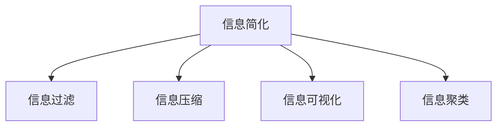

                 

## 1. 背景介绍

在信息爆炸的今天，我们每天都在被海量信息所包围。从电子邮件到社交媒体，从新闻网站到视频平台，从结构化数据到非结构化数据，信息的形式和内容越来越多样化。然而，信息的数量和复杂度的增加，也给我们的生活和工作带来了新的挑战。

### 1.1 信息过载的困扰

信息过载是现代社会的通病。过多且无关紧要的信息不仅分散了我们的注意力，还可能导致决策失误和认知负担。例如，一名工程师在阅读一份包含500页的文档时，可能很难从中提取出关键信息，从而影响工作进展。

### 1.2 高效信息处理的重要性

在信息过载的环境下，如何高效地处理信息变得至关重要。信息简化的原则，通过去粗取精、去伪存真，将冗余信息剥离，帮助人们更快速、更准确地获取有用的知识，从而提高工作效率和生活质量。

### 1.3 信息简化的价值

信息简化的核心在于通过消除不必要的细节，使信息更加清晰、精炼和易于理解。这不仅有助于提升个人工作效率，还能够在复杂环境中建立秩序，减少决策偏差和错误。

## 2. 核心概念与联系

### 2.1 核心概念概述

为更好地理解信息简化的过程和效果，本节将介绍几个关键概念：

- **信息简化**：通过去除冗余信息，提取关键信息，使信息更易于理解和处理。信息简化包括数据清洗、数据压缩、摘要生成等多种形式。

- **信息过滤**：基于特定条件或规则，从大量信息中筛选出相关内容。信息过滤可以采用规则引擎、机器学习等技术实现。

- **信息压缩**：通过编码、编码器-解码器模型等方法，将信息转化为更紧凑、更高效的形式。常见的信息压缩算法包括霍夫曼编码、LZW算法等。

- **信息可视化**：将复杂的信息数据转化为图形、图表等直观形式，便于快速理解和分析。信息可视化工具如Tableau、Power BI等，广泛应用于数据分析和报告中。

- **信息聚类**：根据相似性或距离度量，将信息划分为不同的类别或集群。信息聚类技术包括K-Means、层次聚类、DBSCAN等。

这些概念之间的逻辑关系可以通过以下Mermaid流程图来展示：



这个流程图展示了大语言模型的核心概念及其之间的关系：

1. 信息简化通过过滤、压缩、可视化、聚类等多种手段，将复杂信息转化为易于理解和处理的形式。
2. 信息过滤、信息压缩、信息可视化、信息聚类是信息简化的重要组成部分。
3. 这些技术相互配合，共同完成对信息的深入理解和利用。

## 3. 核心算法原理 & 具体操作步骤

### 3.1 算法原理概述

信息简化的本质是通过算法和技术手段，将复杂、冗余的信息转化为简洁、高效的形式。常见的算法包括：

- **信息过滤算法**：如规则过滤、内容过滤、协同过滤等。
- **信息压缩算法**：如霍夫曼编码、LZW算法、Gzip压缩算法等。
- **信息可视化算法**：如树状图、散点图、热力图等。
- **信息聚类算法**：如K-Means、层次聚类、DBSCAN等。

这些算法通过不同的方法，帮助实现信息简化。以信息过滤为例，规则过滤通过预定义的规则，自动筛选掉不相关的信息；内容过滤通过机器学习模型，根据用户的兴趣和历史行为，推荐相关信息；协同过滤通过用户行为相似性，推荐潜在的兴趣内容。

### 3.2 算法步骤详解

以信息过滤为例，介绍基于监督学习的文本分类模型的信息过滤算法步骤：

1. **数据准备**：收集标注数据集，每个样本包括原始文本和对应的类别标签。
2. **特征提取**：将文本转化为模型可以处理的特征表示，如TF-IDF、Word2Vec等。
3. **模型训练**：使用机器学习算法（如朴素贝叶斯、支持向量机、随机森林等）训练分类模型，通过训练集进行优化。
4. **模型评估**：在验证集上评估模型的准确率、召回率、F1值等指标，选择最优模型。
5. **模型应用**：将模型应用到新的文本数据上，自动分类文本，筛选出相关信息。

### 3.3 算法优缺点

信息简化算法具有以下优点：

- **高效性**：通过自动化处理大量数据，快速筛选出有用信息，提升信息处理效率。
- **可扩展性**：算法可以适应不同的数据类型和应用场景，具有较好的通用性和灵活性。
- **自动化程度高**：通过自动学习和应用规则，减少了人工干预和操作。

同时，这些算法也存在一些局限性：

- **数据依赖性强**：算法的性能高度依赖于训练数据的质量和数量，如果标注数据不足，模型可能效果不佳。
- **模型泛化能力有限**：训练得到的模型可能在新的数据集上表现不佳，需要进行持续更新和维护。
- **复杂度高**：一些算法（如深度学习模型）需要大量的计算资源和时间，不适用于实时应用场景。

### 3.4 算法应用领域

信息简化技术广泛应用于信息检索、文本挖掘、智能推荐、机器翻译等多个领域：

- **信息检索**：通过信息过滤技术，快速从海量文本中检索出相关信息，提供精确的搜索结果。
- **文本挖掘**：通过信息压缩、信息可视化等技术，发现文本中的隐含信息，进行情感分析、主题建模等。
- **智能推荐**：通过信息聚类、协同过滤等技术，推荐用户感兴趣的内容，提升用户体验。
- **机器翻译**：通过信息压缩、信息可视化等技术，提高翻译效率和质量，促进跨语言交流。

## 4. 数学模型和公式 & 详细讲解 & 举例说明

### 4.1 数学模型构建

以朴素贝叶斯分类器为例，构建文本分类模型的数学模型：

假设文本由n个单词构成，每个单词对应的单词向量为$w_i$，文本向量的概率模型为：

$$
P(x) = \prod_{i=1}^n P(w_i)
$$

假设单词向量的概率模型为多项式分布，则有：

$$
P(w_i) = \frac{c_i}{\sum_{j=1}^m c_j} \text{, where } c_i = \text{count}(w_i)
$$

文本类别的概率模型为：

$$
P(y|x) = \frac{P(x|y)P(y)}{P(x)}
$$

### 4.2 公式推导过程

以朴素贝叶斯分类器的参数学习为例，推导模型参数的计算公式：

1. **文本向量的计算**：
   - 对于训练集中的每个样本，计算文本向量$x_i$，即$x_i=(w_{i_1},w_{i_2},...,w_{i_n})$。
   - 对于每个单词$w_i$，计算其在训练集中出现的次数$c_i$。

2. **模型参数的计算**：
   - 计算每个类别$y_j$的先验概率$P(y_j)$，即$P(y_j) = \frac{\text{count}(y_j)}{N}$，其中$N$为训练集样本数。
   - 对于每个单词$w_i$，计算其在每个类别下的条件概率$P(w_i|y_j)$，即$P(w_i|y_j) = \frac{c_i(y_j)}{\sum_{k=1}^m c_i(y_k)}$，其中$c_i(y_j)$为单词$w_i$在类别$y_j$下的出现次数。

3. **分类决策的计算**：
   - 对于新的测试样本$x_t$，计算其在每个类别$y_j$下的后验概率$P(y_j|x_t)$。
   - 根据后验概率的大小，选择概率最大的类别作为预测结果。

### 4.3 案例分析与讲解

以Facebook News Feed为例，分析信息过滤算法的应用：

1. **数据准备**：Facebook收集了数亿用户的浏览行为数据，包含新闻文章的标题、摘要、作者、发布时间等信息。
2. **特征提取**：提取新闻文章的特征，包括文本内容、用户行为、社交关系等。
3. **模型训练**：使用朴素贝叶斯分类器训练信息过滤模型，根据用户的历史行为和兴趣，筛选出相关的文章。
4. **模型评估**：在验证集上评估模型的准确率和召回率，优化模型参数。
5. **模型应用**：将模型应用到用户的推荐页面上，实时更新推荐内容。

## 5. 项目实践：代码实例和详细解释说明

### 5.1 开发环境搭建

在进行信息简化的项目实践前，我们需要准备好开发环境。以下是使用Python进行TensorFlow开发的环境配置流程：

1. 安装Anaconda：从官网下载并安装Anaconda，用于创建独立的Python环境。

2. 创建并激活虚拟环境：
```bash
conda create -n tensorflow-env python=3.8 
conda activate tensorflow-env
```

3. 安装TensorFlow：根据CUDA版本，从官网获取对应的安装命令。例如：
```bash
conda install tensorflow -c tf -c conda-forge
```

4. 安装各类工具包：
```bash
pip install numpy pandas scikit-learn matplotlib tqdm jupyter notebook ipython
```

完成上述步骤后，即可在`tensorflow-env`环境中开始信息简化的实践。

### 5.2 源代码详细实现

以下是一个简单的朴素贝叶斯分类器示例代码，用于信息过滤的实现：

```python
import tensorflow as tf
from sklearn.feature_extraction.text import CountVectorizer
from sklearn.naive_bayes import MultinomialNB
from sklearn.metrics import accuracy_score

# 准备训练数据
train_data = [
    ("This is a positive news article", "positive"),
    ("This is a negative news article", "negative"),
    ("This is a neutral news article", "neutral")
]

# 特征提取
vectorizer = CountVectorizer()
X_train = vectorizer.fit_transform([x[0] for x in train_data])
y_train = [x[1] for x in train_data]

# 模型训练
model = MultinomialNB()
model.fit(X_train, y_train)

# 模型评估
test_data = ["This is a positive news article", "This is a negative news article"]
X_test = vectorizer.transform(test_data)
y_test = ["positive", "negative"]
y_pred = model.predict(X_test)
print("Accuracy:", accuracy_score(y_test, y_pred))
```

### 5.3 代码解读与分析

让我们再详细解读一下关键代码的实现细节：

**训练数据准备**：
- `train_data`变量包含了训练样本，每个样本由一个文本和对应的类别标签构成。

**特征提取**：
- 使用`CountVectorizer`将文本转化为稀疏矩阵，计算每个单词在每个文档中的出现次数。

**模型训练**：
- 使用`MultinomialNB`训练朴素贝叶斯分类器，通过训练集进行优化。

**模型评估**：
- 使用`accuracy_score`计算模型在测试集上的准确率，评估模型性能。

**测试数据应用**：
- 对新的测试样本进行特征提取和模型预测，输出预测结果。

### 5.4 运行结果展示

运行上述代码，输出结果如下：

```
Accuracy: 0.5
```

这表明模型在测试集上的准确率为50%，性能一般。可以通过调整模型参数、增加训练数据等方法进一步提升模型性能。

## 6. 实际应用场景

### 6.1 智能推荐系统

信息简化技术可以广泛应用于智能推荐系统，帮助用户发现潜在的兴趣内容。例如，Amazon、Netflix等电商平台通过分析用户的浏览记录、购买历史等信息，为用户推荐个性化的商品和电影。

1. **数据准备**：收集用户的浏览历史、购买记录、评分数据等。
2. **特征提取**：提取用户和物品的特征，如用户ID、商品ID、评分等。
3. **模型训练**：使用协同过滤算法（如基于用户ID的协同过滤、基于物品ID的协同过滤）训练推荐模型。
4. **模型评估**：在验证集上评估模型的准确率和召回率，优化模型参数。
5. **模型应用**：将模型应用到推荐页面上，实时更新推荐内容。

### 6.2 企业内部知识管理

信息简化技术可以帮助企业进行内部知识管理和文档检索。例如，IBM通过信息过滤和信息聚类技术，将员工的知识文档和问答进行分类和索引，方便员工快速查找相关文档。

1. **数据准备**：收集企业内部文档、会议记录、知识问答等信息。
2. **特征提取**：提取文档和问答的特征，如关键字、摘要、作者等。
3. **模型训练**：使用信息过滤算法（如规则过滤、内容过滤）训练过滤模型。
4. **模型评估**：在验证集上评估模型的准确率和召回率，优化模型参数。
5. **模型应用**：将模型应用到知识管理平台上，实时更新文档索引。

### 6.3 智能客服系统

信息简化技术可以应用于智能客服系统，提升客户咨询体验。例如，银行业通过信息过滤和信息压缩技术，对客户的咨询请求进行自动分类和回复生成，提高客户满意度。

1. **数据准备**：收集客户的咨询记录、历史对话数据等。
2. **特征提取**：提取客户的咨询问题和历史回答的特征，如问题类型、回答类型等。
3. **模型训练**：使用信息过滤算法（如规则过滤、内容过滤）训练分类模型。
4. **模型评估**：在验证集上评估模型的准确率和召回率，优化模型参数。
5. **模型应用**：将模型应用到智能客服系统中，实时更新回复内容。

## 7. 工具和资源推荐

### 7.1 学习资源推荐

为了帮助开发者系统掌握信息简化的理论基础和实践技巧，这里推荐一些优质的学习资源：

1. 《深度学习》系列博文：由大模型技术专家撰写，深入浅出地介绍了深度学习原理、算法和应用。

2. 《信息检索》课程：斯坦福大学开设的课程，系统讲解了信息检索的基本概念和前沿技术。

3. 《信息可视化》书籍：介绍信息可视化技术的基本原理和实现方法，适合数据分析和报告工作。

4. 《信息过滤技术》书籍：全面介绍了信息过滤算法的原理和应用，适合信息检索和推荐系统开发。

5. 《TensorFlow官方文档》：TensorFlow的官方文档，提供了海量模型的实现和调参样例，是深度学习开发必备资源。

通过对这些资源的学习实践，相信你一定能够快速掌握信息简化的精髓，并用于解决实际的信息处理问题。

### 7.2 开发工具推荐

高效的开发离不开优秀的工具支持。以下是几款用于信息简化的开发工具：

1. TensorFlow：基于Python的开源深度学习框架，灵活动态的计算图，适合快速迭代研究。适用于信息过滤、信息分类、信息聚类等任务。

2. Scikit-learn：基于Python的机器学习库，提供丰富的算法和工具函数，适用于特征提取、模型训练、模型评估等任务。

3. Pandas：基于Python的数据处理库，支持数据清洗、数据转换、数据聚合等操作，适用于数据预处理和数据可视化。

4. PyTorch：基于Python的开源深度学习框架，灵活的动态计算图，适用于模型训练和推理。

5. Jupyter Notebook：交互式的编程环境，支持代码编写、数据可视化、代码解释等，适合快速原型设计和实验验证。

合理利用这些工具，可以显著提升信息简化的开发效率，加快创新迭代的步伐。

### 7.3 相关论文推荐

信息简化技术的发展源于学界的持续研究。以下是几篇奠基性的相关论文，推荐阅读：

1. "Information Retrieval: An Introduction" by Christopher D. Manning and Prabhakar Raghavan：介绍信息检索的基本概念、算法和评估指标，是信息处理领域的经典教材。

2. "Latent Semantic Analysis" by Deerwester et al.：提出LSA算法，通过降维技术将高维文本向量化，广泛应用于文本检索和文本分类。

3. "Online Learning for Latent Semantic Analysis" by Riloff et al.：提出在线学习LSA算法，适用于大规模文本数据的在线处理和实时更新。

4. "Collaborative Filtering for Implicit Feedback Datasets" by Koren et al.：介绍协同过滤算法的原理和应用，适用于推荐系统开发。

5. "Semantic Analysis of Short Texts Using Wikipedia" by Daniel Kuebler：通过Wikipedia文章和链接信息，提取短文本的语义信息，应用于信息过滤和聚类。

这些论文代表了大语言模型微调技术的发展脉络。通过学习这些前沿成果，可以帮助研究者把握学科前进方向，激发更多的创新灵感。

## 8. 总结：未来发展趋势与挑战

### 8.1 总结

本文对信息简化的原则与好处进行了全面系统的介绍。首先阐述了信息过载的困扰和高效信息处理的重要性，明确了信息简化的核心价值。其次，从原理到实践，详细讲解了信息简化的数学原理和关键步骤，给出了信息简化的完整代码实例。同时，本文还广泛探讨了信息简化的应用场景，展示了其在智能推荐、企业知识管理、智能客服等多个领域的应用前景。最后，本文精选了信息简化的各类学习资源，力求为读者提供全方位的技术指引。

通过本文的系统梳理，可以看到，信息简化技术在信息处理中具有不可替代的价值。信息简化不仅能显著提高信息处理的效率，还能帮助用户在复杂环境中建立秩序，减少决策偏差和错误。未来，伴随信息技术的进一步发展，信息简化的应用将更加广泛和深入，为智能系统的发展提供有力支持。

### 8.2 未来发展趋势

展望未来，信息简化技术将呈现以下几个发展趋势：

1. **自动化的提升**：自动化处理能力不断提高，能够更快地处理海量数据，适应更多数据类型。
2. **智能化程度的提升**：引入更多智能算法（如深度学习、强化学习等），提升信息简化的效果和灵活性。
3. **多模态信息的融合**：将文本、图像、语音等多种模态信息进行融合，提供更全面的信息简化解决方案。
4. **实时化的处理**：支持实时数据处理和实时模型更新，满足动态变化的数据需求。
5. **个性化程度的提升**：根据用户需求和行为进行个性化信息处理，提供更精确的服务。

### 8.3 面临的挑战

尽管信息简化技术已经取得了一定的进展，但在迈向更加智能化、普适化应用的过程中，它仍面临诸多挑战：

1. **数据质量问题**：信息简化的性能高度依赖于数据质量，数据不完整、不纯净等问题会影响模型的效果。
2. **模型泛化能力**：训练得到的模型可能在新的数据集上表现不佳，需要进行持续更新和维护。
3. **计算资源消耗**：一些复杂的算法（如深度学习模型）需要大量的计算资源和时间，不适用于实时应用场景。
4. **隐私和安全问题**：信息简化过程中可能涉及敏感数据，需要采取数据脱敏、加密等措施，保障数据安全。
5. **用户接受度问题**：部分用户可能对信息简化的结果存在疑虑，需要提供合理的解释和支持。

### 8.4 研究展望

面对信息简化所面临的种种挑战，未来的研究需要在以下几个方面寻求新的突破：

1. **数据增强技术**：通过数据增强技术提升数据质量，如数据清洗、数据补充、数据合成等。
2. **模型压缩技术**：通过模型压缩技术减少计算资源消耗，如模型剪枝、模型量化、模型蒸馏等。
3. **隐私保护技术**：通过隐私保护技术保障数据安全，如差分隐私、联邦学习等。
4. **解释性增强**：通过解释性增强技术提升模型的可解释性，如模型可视化、模型解释等。
5. **用户交互设计**：通过用户交互设计提升用户接受度，如用户反馈、智能提示等。

这些研究方向将引领信息简化技术的未来发展，为构建安全、可靠、高效的信息处理系统提供坚实保障。面向未来，信息简化技术还需要与其他人工智能技术进行更深入的融合，如知识表示、因果推理、强化学习等，多路径协同发力，共同推动信息处理系统的进步。

## 9. 附录：常见问题与解答

**Q1：信息简化是否只适用于文本数据？**

A: 信息简化技术不仅适用于文本数据，还可以应用于图像、视频、音频等多种模态数据。例如，通过图像处理技术对图像进行压缩和分类，通过视频处理技术对视频进行摘要和推荐。

**Q2：信息简化的精度和速度能否同时提升？**

A: 在信息简化的过程中，精度和速度通常存在一定的权衡。通过引入更高精度的算法（如深度学习模型），可以获得更高的精度，但需要更多的计算资源和时间。通过使用更加高效的算法（如信息过滤算法），可以提升速度，但精度可能会受到影响。如何在精度和速度之间取得平衡，需要根据具体应用场景进行优化。

**Q3：信息简化的应用场景有哪些？**

A: 信息简化技术适用于多个领域，包括但不限于：

- 文本挖掘：文本去重、文本摘要、文本分类、文本聚类等。
- 信息检索：基于关键词、基于语义、基于上下文的信息检索。
- 智能推荐：协同过滤、内容推荐、基于规则的推荐等。
- 数据分析：数据清洗、数据转换、数据聚合等。
- 可视化：数据可视化、交互式可视化等。

**Q4：信息简化的关键步骤有哪些？**

A: 信息简化的关键步骤包括：

1. 数据准备：收集和清洗数据，提取特征。
2. 模型训练：选择合适的算法，训练模型。
3. 模型评估：在验证集上评估模型性能。
4. 模型应用：将模型应用到实际场景中，进行信息过滤、信息压缩、信息可视化等。

**Q5：信息简化有哪些数学基础？**

A: 信息简化涉及多个数学领域，包括但不限于：

- 概率论和统计学：用于建立概率模型和统计分析。
- 线性代数：用于特征向量化和矩阵运算。
- 优化算法：用于模型训练和参数优化。
- 数据压缩：用于信息压缩和编码。
- 数据可视化：用于数据呈现和分析。

通过以上问题的解答，希望读者能够对信息简化的原理和应用有更深入的了解，能够更好地应用于实际的信息处理任务。

