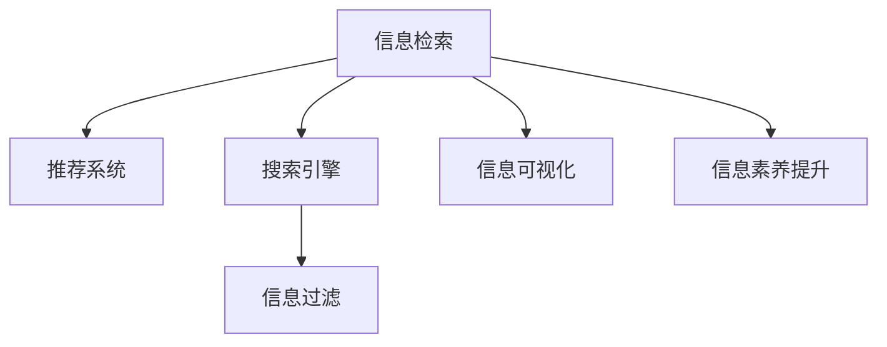

                 

# 信息过载与信息搜索策略与技术：在庞大的信息海洋中找到你需要的信息

## 1. 背景介绍

在数字化时代，信息爆炸的浪潮已经彻底改变了人们的生活方式。我们几乎无时无刻不在生产、分享、消费大量的信息。无论是社交媒体、新闻网站、学术数据库，还是商业平台，信息无处不在，无时不在。然而，伴随着信息量的激增，信息过载现象也越来越严重。信息的爆炸增长与人们处理信息能力的有限性形成了鲜明对比。这不仅影响了人们的日常生活，也给企业、机构的数据治理和决策带来了巨大挑战。

### 1.1 信息过载的定义

信息过载（Information Overload）是指在处理海量信息的过程中，人们无法处理所有信息，从而导致信息获取和信息利用的效率下降。信息过载主要表现为：

1. **信息过剩**：信息量远远超过个人或系统的处理能力。
2. **信息噪声**：信息中的噪声和不相关数据干扰了有价值信息的识别。
3. **信息分散**：有价值的信息分散在多个来源和格式中，难以集中和利用。

### 1.2 信息过载的影响

信息过载对个人、企业和组织的影响主要体现在以下几个方面：

1. **决策困难**：过多的信息使得决策者难以快速识别关键信息，做出明智的决策。
2. **工作效率下降**：信息处理时间增加，工作节奏减缓，资源浪费。
3. **认知负担加重**：信息过载增加了认知负担，易导致注意力分散，影响创造力和创新能力。
4. **信息质量下降**：缺乏筛选和验证机制，导致假信息、误导性信息泛滥。
5. **用户满意度降低**：信息获取难度增加，用户满意度下降，引发用户流失。

## 2. 核心概念与联系

### 2.1 核心概念概述

为了更好地理解信息搜索与信息过载问题，本节将介绍几个密切相关的核心概念：

1. **信息检索（Information Retrieval, IR）**：通过自动搜索信息库，为用户提供最相关的信息。信息检索是解决信息过载问题的核心技术之一。
2. **推荐系统（Recommender Systems）**：通过分析用户的历史行为和偏好，为用户推荐相关内容。推荐系统能够有效减轻信息过载，提升用户体验。
3. **搜索引擎（Search Engines）**：支持信息检索的自动化软件或服务，如Google、Bing等。
4. **信息过滤（Information Filtering）**：根据用户偏好和行为，过滤不相关或低质量信息，提高信息相关性。
5. **信息可视化（Information Visualization）**：通过图形化手段展示信息，帮助用户理解和利用信息。
6. **信息素养的提升（Information Literacy）**：通过教育培训，提升用户的信息查找、评估、使用能力。

这些核心概念之间的逻辑关系可以通过以下Mermaid流程图来展示：



这个流程图展示了大规模信息处理和利用的核心过程：

1. 通过搜索引擎获取信息。
2. 利用推荐系统，根据用户偏好筛选信息。
3. 通过信息过滤，去除不相关和低质量信息。
4. 应用信息可视化，帮助用户理解信息。
5. 提升用户信息素养，提高信息获取和利用能力。

## 3. 核心算法原理 & 具体操作步骤

### 3.1 算法原理概述

为了应对信息过载，现代信息搜索策略与技术通常基于以下几个关键原理：

1. **相关性排序**：基于信息检索模型，对检索结果进行相关性排序，展示最相关的信息。
2. **用户意图理解**：通过自然语言处理（NLP）技术，理解用户的查询意图，提高检索的精准度。
3. **个性化推荐**：根据用户的历史行为和偏好，个性化推荐相关内容，减少信息过载。
4. **实时反馈机制**：通过用户对搜索结果的反馈，动态调整搜索算法和推荐策略。
5. **多模态数据融合**：结合文本、图像、视频等多模态数据，提高信息的完整性和丰富性。
6. **语义搜索**：通过语义理解技术，识别关键词的同义词和相关概念，扩展搜索范围。

### 3.2 算法步骤详解

基于上述原理，信息检索和推荐系统的工作流程可以总结如下：

**Step 1: 数据收集与预处理**
- 收集大量信息源，包括文本、图像、视频等。
- 对数据进行预处理，如去除噪声、标准化格式等。

**Step 2: 构建信息检索模型**
- 选择合适的检索模型，如向量空间模型、语义模型等。
- 训练模型，优化相关性排序算法。

**Step 3: 用户意图理解**
- 通过NLP技术，分析用户查询的意图和情感。
- 根据意图和情感，动态调整检索策略。

**Step 4: 个性化推荐**
- 根据用户的历史行为和偏好，构建用户画像。
- 使用协同过滤、内容推荐等算法，为用户推荐相关内容。

**Step 5: 信息过滤**
- 基于用户画像和行为模式，过滤不相关和低质量信息。
- 使用阈值控制、规则引擎等技术，实现信息筛选。

**Step 6: 信息可视化**
- 应用图表、地图等可视化技术，展示信息结构。
- 利用交互设计，提升信息展示效果。

**Step 7: 实时反馈与优化**
- 收集用户对搜索结果的反馈。
- 基于反馈数据，动态调整检索和推荐算法。

### 3.3 算法优缺点

信息检索和推荐系统在减轻信息过载方面具有以下优点：

1. **高效性**：自动化信息处理，显著提高信息获取速度。
2. **精准度**：通过相关性排序和个性化推荐，提高信息的相关性和有用性。
3. **可扩展性**：支持大规模数据处理，适应信息量快速增长的需求。
4. **用户体验提升**：通过信息过滤和可视化，改善信息展示效果，提升用户满意度。

同时，这些技术也存在一些局限性：

1. **复杂性**：算法复杂度较高，对数据和计算资源要求较高。
2. **隐私问题**：收集和处理用户数据可能引发隐私问题，需加强数据保护。
3. **误导性信息**：算法可能引入误导性信息，需要加强信息验证。
4. **依赖高质量数据**：算法效果依赖高质量的数据，数据噪声和偏差会影响结果。
5. **资源消耗**：数据处理和算法优化需要大量计算资源，成本较高。

### 3.4 算法应用领域

信息检索和推荐技术在多个领域得到了广泛应用，包括：

- **电子商务**：通过推荐系统，为用户推荐商品，提高购买率。
- **新闻与媒体**：根据用户兴趣，推荐新闻和内容，提升阅读体验。
- **社交网络**：推荐好友和内容，增强用户粘性。
- **教育**：推荐学习资源，提升教育效果。
- **医疗**：推荐医学文献，辅助医疗决策。
- **金融**：推荐金融产品，优化投资组合。
- **旅游**：推荐旅游目的地，提升旅游体验。

除了上述这些领域，信息检索和推荐技术还在诸多新兴应用中发挥作用，如智能家居、智能制造、智慧城市等，为各行各业带来了新的数字化解决方案。

## 4. 数学模型和公式 & 详细讲解 & 举例说明

### 4.1 数学模型构建

为了更好地理解信息检索和推荐系统的工作原理，本节将介绍几个核心数学模型：

1. **向量空间模型（Vector Space Model, VSM）**：将文本表示为向量，计算文本之间的相似度。
2. **隐含语义模型（Latent Semantic Analysis, LSA）**：通过奇异值分解（SVD），发现文本之间的隐含语义关系。
3. **协同过滤算法**：基于用户-物品评分矩阵，推荐用户可能感兴趣的物品。
4. **矩阵分解**：将评分矩阵分解为用户和物品的隐向量表示，实现个性化推荐。
5. **深度学习模型**：使用神经网络，学习复杂的用户-物品关系，实现更加精准的推荐。

这些数学模型构建了信息检索和推荐系统的理论基础，使得系统能够处理和推荐海量信息。

### 4.2 公式推导过程

以下是几个核心模型的公式推导过程：

**向量空间模型（VSM）**：
$$
\text{similarity}(x,y) = \frac{\mathbf{x} \cdot \mathbf{y}}{\|\mathbf{x}\|\|\mathbf{y}\|}
$$

其中 $\mathbf{x}$ 和 $\mathbf{y}$ 为文本的向量表示，$\cdot$ 表示向量点积，$\|\mathbf{x}\|$ 表示向量范数。

**隐含语义模型（LSA）**：
$$
\mathbf{U} = \mathbf{A} \mathbf{V}^T
$$

其中 $\mathbf{U}$ 和 $\mathbf{V}$ 为奇异值分解后的隐含语义矩阵，$\mathbf{A}$ 为文本-语义矩阵。

**协同过滤算法**：
$$
\text{prediction}(u,i) = \hat{\mathbf{u}}_i = \mathbf{u} \cdot \mathbf{p}_i
$$

其中 $\mathbf{u}$ 为用户的隐向量，$\mathbf{p}_i$ 为物品 $i$ 的隐向量，$\cdot$ 表示向量点积。

**矩阵分解**：
$$
\mathbf{R} \approx \mathbf{U} \mathbf{V}^T
$$

其中 $\mathbf{R}$ 为用户-物品评分矩阵，$\mathbf{U}$ 和 $\mathbf{V}$ 为分解后的矩阵。

**深度学习模型（如矩阵分解神经网络）**：
$$
\mathbf{\hat{R}} = \sigma(\mathbf{W} [\mathbf{U}, \mathbf{V}] + \mathbf{b})
$$

其中 $\mathbf{W}$ 为神经网络参数，$\sigma$ 为激活函数，$\mathbf{b}$ 为偏置项。

### 4.3 案例分析与讲解

以推荐系统中的协同过滤算法为例，介绍其在实际应用中的工作原理：

1. **数据准备**：收集用户和物品的历史评分数据，构建用户-物品评分矩阵 $\mathbf{R}$。
2. **矩阵分解**：使用奇异值分解或矩阵分解技术，将 $\mathbf{R}$ 分解为 $\mathbf{U}$ 和 $\mathbf{V}$。
3. **预测评分**：根据用户 $u$ 的隐向量 $\mathbf{u}$ 和物品 $i$ 的隐向量 $\mathbf{p}_i$，计算物品 $i$ 对用户 $u$ 的预测评分 $\hat{r}_{ui}$。
4. **推荐排序**：将预测评分排序，推荐评分最高的物品给用户 $u$。

例如，一个用户的隐向量为 $\mathbf{u} = [0.5, 0.3, 0.8]$，一个物品的隐向量为 $\mathbf{p}_i = [0.2, 0.5, 0.3]$。根据公式，计算用户对该物品的预测评分为：

$$
\hat{r}_{ui} = \mathbf{u} \cdot \mathbf{p}_i = 0.5 \times 0.2 + 0.3 \times 0.5 + 0.8 \times 0.3 = 0.53
$$

如果预测评分高于用户历史评分的平均水平，就推荐给用户。

## 5. 项目实践：代码实例和详细解释说明

### 5.1 开发环境搭建

在进行信息检索和推荐系统开发前，我们需要准备好开发环境。以下是使用Python进行TensorFlow开发的环境配置流程：

1. 安装Anaconda：从官网下载并安装Anaconda，用于创建独立的Python环境。

2. 创建并激活虚拟环境：
```bash
conda create -n tf-env python=3.8 
conda activate tf-env
```

3. 安装TensorFlow：从官网获取对应的安装命令。例如：
```bash
conda install tensorflow -c tf -c conda-forge
```

4. 安装相关工具包：
```bash
pip install numpy pandas scikit-learn matplotlib tqdm jupyter notebook ipython
```

完成上述步骤后，即可在`tf-env`环境中开始信息检索和推荐系统的开发实践。

### 5.2 源代码详细实现

这里我们以基于TensorFlow的协同过滤推荐系统为例，给出完整的代码实现。

首先，定义用户和物品的评分矩阵：

```python
import numpy as np
from tensorflow.keras import layers

# 构建评分矩阵
R = np.array([[3.0, 1.0, 2.0],
              [4.0, 2.0, 3.0],
              [1.0, 4.0, 2.0]])

# 构建用户和物品向量
u = np.array([0.5, 0.3, 0.8])
v = np.array([0.2, 0.5, 0.3])
```

然后，使用矩阵分解算法进行推荐：

```python
# 定义模型
model = layers.Model(inputs=[layers.Input(shape=3, name='user')],
                    outputs=[layers.Dense(3, activation='sigmoid', name='item')])

# 编译模型
model.compile(optimizer='adam', loss='binary_crossentropy')

# 预测评分
prediction = model.predict(np.array([u]))
```

最后，展示推荐结果：

```python
# 获取预测评分
prediction_score = prediction[0]
print("预测评分：", prediction_score)
```

以上就是使用TensorFlow实现协同过滤推荐系统的完整代码实现。可以看到，TensorFlow提供了强大的计算图支持和丰富的API，使得推荐系统模型训练和推理变得非常简单。

### 5.3 代码解读与分析

让我们再详细解读一下关键代码的实现细节：

**用户和物品评分矩阵**：
- 定义了用户和物品的历史评分矩阵 $R$，每个元素表示用户对物品的评分。

**用户和物品向量**：
- 定义了用户隐向量 $u$ 和物品隐向量 $v$，通过点积计算预测评分。

**TensorFlow模型定义**：
- 使用`layers.Model`定义模型结构，输入层为用户向量，输出层为物品向量。
- 使用`layers.Dense`定义全连接层，使用`activation='sigmoid'`激活函数，输出预测评分。
- 使用`model.compile`编译模型，指定优化器和损失函数。

**模型预测**：
- 使用`model.predict`进行预测评分，返回预测结果。

**展示推荐结果**：
- 将预测评分输出，展示推荐结果。

可以看到，TensorFlow使得模型的定义、编译、训练、预测变得非常简单，可以快速迭代开发和调试。

## 6. 实际应用场景

### 6.1 电子商务

在电子商务领域，推荐系统已经成为标配。通过分析用户的浏览历史、购买记录等数据，推荐系统能够为用户推荐商品，提高购买转化率。例如，亚马逊的推荐系统可以通过协同过滤算法，为用户推荐相关商品，提升用户满意度和销售额。

### 6.2 新闻与媒体

新闻与媒体平台利用推荐系统，根据用户的阅读历史和兴趣，推荐相关新闻和内容。例如，谷歌新闻可以根据用户的点击记录，推荐用户可能感兴趣的新闻和主题，提升用户体验和阅读量。

### 6.3 社交网络

社交网络平台通过推荐系统，为用户推荐好友、帖子、话题等。例如，Facebook通过推荐系统，为用户推荐可能感兴趣的内容，提升用户粘性和互动率。

### 6.4 金融与投资

金融与投资领域也广泛应用推荐系统。例如，股票推荐系统可以根据用户的历史交易记录和市场趋势，推荐可能受益的股票，帮助用户优化投资组合，提升投资回报率。

### 6.5 智慧医疗

在智慧医疗领域，推荐系统可以帮助医生推荐诊断工具、治疗方案等。例如，基于患者病历和症状，推荐系统可以为医生推荐最合适的检查和治疗方案，提高诊疗效率和效果。

## 7. 工具和资源推荐

### 7.1 学习资源推荐

为了帮助开发者系统掌握信息检索和推荐技术，以下是一些优质的学习资源：

1. **《推荐系统实战》**：介绍推荐系统的核心算法和应用案例，适合实践入门。
2. **Coursera《Recommender Systems》课程**：斯坦福大学开设的推荐系统课程，涵盖算法和应用，适合系统学习。
3. **Kaggle推荐系统竞赛**：通过实际比赛，提升算法优化和应用实践能力。
4. **NIPS、ICML等会议论文**：最新推荐系统算法和技术，及时了解前沿进展。

### 7.2 开发工具推荐

高效的开发离不开优秀的工具支持。以下是几款用于信息检索和推荐系统开发的常用工具：

1. **TensorFlow**：谷歌主导的深度学习框架，支持分布式计算和大规模模型训练。
2. **PyTorch**：Facebook开发的深度学习框架，灵活性和易用性高。
3. **Scikit-learn**：Python机器学习库，提供简单易用的算法和工具。
4. **NLTK**：自然语言处理工具库，支持文本预处理和分析。
5. **ELK Stack**：开源日志分析和监控工具，支持大数据处理和实时分析。

### 7.3 相关论文推荐

信息检索和推荐技术的不断进步离不开学界的持续研究。以下是几篇奠基性的相关论文，推荐阅读：

1. **BPR: Bayesian Personalized Ranking from Logs**：提出BPR算法，用于协同过滤推荐系统。
2. **ALS: Alternating Least Squares for Matrix Factorization**：提出ALS算法，用于矩阵分解推荐系统。
3. **Netflix Prize**：Netflix推荐系统竞赛，推动了协同过滤算法的进步。
4. **LDA: Latent Dirichlet Allocation**：提出LDA算法，用于文本主题建模。
5. **Attention is All You Need**：提出Transformer模型，用于深度学习推荐系统。

这些论文代表了大规模信息处理和利用的最新进展，通过学习这些前沿成果，可以帮助研究者把握学科前进方向，激发更多的创新灵感。

## 8. 总结：未来发展趋势与挑战

### 8.1 总结

本文对信息检索和推荐系统进行了全面系统的介绍。首先阐述了信息过载问题的背景和影响，明确了信息检索和推荐系统在解决信息过载中的核心作用。其次，从原理到实践，详细讲解了信息检索和推荐系统的数学模型和操作步骤，给出了系统开发的完整代码实例。同时，本文还广泛探讨了信息检索和推荐系统在电子商务、新闻媒体、社交网络、金融投资等多个领域的应用前景，展示了信息技术的巨大潜力。最后，本文精选了信息检索和推荐技术的各类学习资源，力求为读者提供全方位的技术指引。

通过本文的系统梳理，可以看到，信息检索和推荐系统已经在多个领域得到了广泛应用，为信息技术落地提供了重要工具。未来，伴随数据量持续增长和算法不断演进，信息检索和推荐系统将迎来更加广泛的应用场景和更高的技术要求。

### 8.2 未来发展趋势

展望未来，信息检索和推荐技术将呈现以下几个发展趋势：

1. **多模态融合**：结合文本、图像、语音等多种信息源，提高信息的多样性和丰富性。
2. **实时性和动态性**：提高信息处理的实时性和动态性，适应实时数据流的处理需求。
3. **个性化与隐私保护**：实现更加精准的个性化推荐，同时保护用户隐私。
4. **混合算法**：融合协同过滤、矩阵分解、深度学习等多种算法，提升推荐精度。
5. **跨域推荐**：实现跨平台、跨设备的推荐，提升用户粘性。
6. **用户参与式设计**：引入用户反馈和交互设计，提升推荐系统的鲁棒性和可解释性。

以上趋势凸显了大规模信息处理和利用技术的广阔前景。这些方向的探索发展，必将进一步提升信息检索和推荐系统的性能和应用范围，为各行各业带来新的数字化解决方案。

### 8.3 面临的挑战

尽管信息检索和推荐系统已经取得了瞩目成就，但在迈向更加智能化、普适化应用的过程中，它仍面临着诸多挑战：

1. **数据质量问题**：高质量数据是推荐系统成功的前提，但数据获取和标注成本较高。数据噪声和偏差会影响算法效果。
2. **算法复杂性**：信息检索和推荐算法复杂度较高，对计算资源和数据处理能力要求较高。
3. **隐私保护**：用户数据的隐私保护是一个重要问题，需要设计隐私保护机制，确保数据安全。
4. **冷启动问题**：新用户或新物品缺乏历史数据，难以进行有效推荐。
5. **多样性与新颖性**：推荐算法往往偏向于推荐热门物品，难以满足用户的差异化需求。
6. **动态性**：用户兴趣和行为动态变化，需要动态调整推荐策略。

### 8.4 研究展望

面对信息检索和推荐系统面临的挑战，未来的研究需要在以下几个方面寻求新的突破：

1. **无监督学习**：通过无监督学习，从海量无标签数据中提取有用信息，降低数据标注成本。
2. **多任务学习**：在推荐系统中引入多任务学习，提高推荐的综合性和多样性。
3. **混合数据源**：结合不同类型的数据源，实现更加全面和准确的信息检索和推荐。
4. **可解释性**：引入可解释性技术，提高推荐系统的透明性和用户信任度。
5. **跨域协同**：通过跨平台和跨设备的协同，提升推荐系统的跨域能力。
6. **动态模型**：开发动态模型，适应用户兴趣和行为的动态变化。

这些研究方向的探索，必将推动信息检索和推荐技术的进一步发展，为构建智能推荐系统提供更多可能。总之，信息检索和推荐技术在解决信息过载问题上有着广阔的应用前景，但其未来发展仍需面对诸多挑战，需要学术界和产业界的共同努力。

## 9. 附录：常见问题与解答

**Q1：信息检索和推荐系统如何处理冷启动问题？**

A: 冷启动问题是信息检索和推荐系统中常见的问题，通常可以通过以下几种方法解决：
1. **基于内容的推荐**：利用物品的特征向量，推荐与新物品相似的物品。
2. **基于用户的推荐**：利用相似用户的历史行为，推荐相似用户喜欢的物品。
3. **基于模型的推荐**：使用深度学习模型，利用用户和物品的隐向量进行推荐。
4. **多模态推荐**：结合用户的多模态数据，提高推荐的准确性。

这些方法需要根据具体情况选择，以提高推荐系统的效果。

**Q2：信息检索和推荐系统如何处理数据质量问题？**

A: 数据质量问题通常可以通过以下几种方法解决：
1. **数据清洗**：去除噪声数据和异常值，提高数据质量。
2. **数据标注**：通过人工标注或半监督学习，获得高质量标注数据。
3. **数据增强**：利用数据增强技术，生成更多的训练数据。
4. **模型融合**：结合多个模型的输出，提高推荐的稳定性和准确性。
5. **异常检测**：检测和处理异常数据，提高数据可靠性。

通过这些方法，可以有效提升信息检索和推荐系统的数据质量，提升算法效果。

**Q3：信息检索和推荐系统如何处理用户隐私问题？**

A: 用户隐私问题通常可以通过以下几种方法解决：
1. **差分隐私**：通过添加噪声，保护用户数据的隐私性。
2. **联邦学习**：在本地设备上进行模型训练，不共享用户数据。
3. **匿名化**：对用户数据进行匿名化处理，保护用户隐私。
4. **隐私计算**：在隐私保护的前提下，进行数据计算和分析。
5. **用户授权**：通过用户授权和同意，合法使用用户数据。

这些方法需要根据具体情况选择，以确保用户数据的隐私保护。

**Q4：信息检索和推荐系统如何处理用户的多样化需求？**

A: 用户的多样化需求通常可以通过以下几种方法解决：
1. **多样化推荐**：结合用户的历史行为和当前偏好，推荐多样化物品。
2. **个性化推荐**：根据用户兴趣和行为的动态变化，动态调整推荐策略。
3. **协同过滤**：结合用户和物品的隐向量，推荐相似用户或物品。
4. **多任务学习**：在推荐系统中引入多任务学习，提高推荐的综合性和多样性。
5. **混合算法**：结合协同过滤、矩阵分解、深度学习等多种算法，提升推荐精度。

这些方法需要根据具体情况选择，以提高推荐系统的多样性和新颖性。

**Q5：信息检索和推荐系统如何处理数据动态变化问题？**

A: 数据动态变化问题通常可以通过以下几种方法解决：
1. **在线学习**：实时更新模型参数，适应数据动态变化。
2. **增量学习**：定期更新模型，适应新数据的到来。
3. **强化学习**：通过用户反馈，动态调整推荐策略。
4. **自适应算法**：根据数据动态变化，自适应调整算法参数。
5. **动态模型**：设计动态模型，适应数据动态变化。

这些方法需要根据具体情况选择，以提高推荐系统的动态性和鲁棒性。

---

作者：禅与计算机程序设计艺术 / Zen and the Art of Computer Programming

